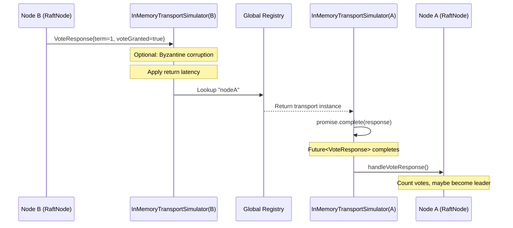

# Quorus In-Memory Simulators — Archived Sections

**Version:** 1.0  
**Date:** 2026-10-03  
**Author:** Mark Ray-Smith — Cityline Ltd  
**License:** Apache 2.0

> [!WARNING]
> **Archived 2026-10-03.** These sections were removed from version 2.0 of the
> [In-Memory Simulators Design](../design/QUORUS_IN_MEMORY_SIMULATORS_DESIGN.md) (dated 2026-01-28)
> when it was rewritten against the code as version 2.1 (register item DR-C7). They are kept
> verbatim as history. **They are not accurate and must not be relied on:**
>
> - **A. Appendix C, "Implementation Validation Report".** Its "✅ VALIDATED … complete feature
>   parity" verdict was false. The line counts were wrong, and the six `quorus-core` simulators
>   implement no production interface; they are standalone test doubles.
> - **B. The §1 "Message Flow" excerpts labelled "REAL PRODUCTION CODE".** They do not match
>   `RaftNode`: the log is a plain `List<LogEntry>` with no `getLastIndex()` or `getLastLogTerm()`,
>   votes are counted in an `AtomicLong` rather than a `votesReceived` set, election is split across
>   `startElection()` and `requestVotes()`, `handleVoteRequest` serialises through
>   `serializeLogMutation` rather than `vertx.executeBlocking`, and the simulator does not call
>   `.join()` on the target node. The state machine is `QuorusStateStore`, not `QuorusStateMachine`,
>   and there is no `HttpRaftTransport`.
> - **C. The version 2.0 text of §2–7.** It showed production `TransferProtocol`, `TransferEngine` and
>   `WorkflowEngine` listings with Vert.x `Future` returns and a `transferReactive` method that the
>   production interfaces no longer have, claimed the simulators implement those interfaces, and
>   showed builder methods, state-machine wiring and agent-service wiring that do not exist.
> - **D. "Benefits Summary".** Its speed-up, pipeline-time and determinism figures were never
>   measured.

---

## A. Appendix C (version 2.0), verbatim

## Appendix C: Implementation Validation Report

**Validation Date:** 2026-02-03  
**Validated By:** Automated Code Analysis  
**Last Updated:** 2026-02-03

### Executive Summary

| Status | Description |
|--------|-------------|
| ✅ **VALIDATED** | The design document accurately reflects the implementation. All 7 simulators described exist in the codebase and match their documented specifications. Test infrastructure includes `SimulatorTestLoggingExtension` for consistent logging. |

### Validation Methodology

To validate this document, the following were examined:
1. **Design document** - All 2,134 lines of this specification
2. **Implementation source files** - The actual Java implementation of each simulator
3. **Test files** - Verified active usage through test classes
4. **Interface definitions** - Confirmed interface compliance

### Simulator-by-Simulator Validation

#### 1. InMemoryTransportSimulator

| Aspect | Document Status | Implementation Status | Match |
|--------|----------------|----------------------|-------|
| Status | ✅ Implemented | ✅ EXISTS | ✅ |
| Location | `quorus-controller/src/test/java/.../raft/InMemoryTransportSimulator.java` | Confirmed at exact path | ✅ |
| Interface | `RaftTransport` | Implements `RaftTransport` (line 46) | ✅ |
| Lines of Code | — | 547 lines | — |

**Features Validated:**

| Feature | Documented | Implemented (Line #) |
|---------|-----------|---------------------|
| Global Registry | ✅ | ✅ Line 51: `Map<String, InMemoryTransportSimulator> transports` |
| Network Partitions | ✅ | ✅ Line 54: `Set<Set<String>> networkPartitions` |
| Latency Simulation | ✅ | ✅ Lines 71-73: `minLatencyMs`, `maxLatencyMs` |
| Packet Drop | ✅ | ✅ Line 74: `dropRate` |
| Message Reordering | ✅ | ✅ Lines 77-79: `reorderingEnabled`, `reorderProbability`, `maxReorderDelayMs` |
| Bandwidth Throttling | ✅ | ✅ Lines 83-86: `throttlingEnabled`, `maxBytesPerSecond` |
| Failure Modes | ✅ | ✅ Lines 89-99: `FailureMode` enum with NONE, CRASH, BYZANTINE, SLOW, FLAKY |
| `setChaosConfig()` | ✅ | ✅ Lines 114-118 |
| `setReorderingConfig()` | ✅ | ✅ Lines 125-129 |
| `setThrottlingConfig()` | ✅ | ✅ Lines 136-139 |
| `setFailureMode()` | ✅ | ✅ Lines 146-153 |
| `createPartition()` | ✅ | ✅ Lines 163-167 (static method) |
| `healPartitions()` | ✅ | ✅ Lines 172-175 (static method) |
| `clearAllTransports()` | ✅ | ✅ Lines 521-524 |

**Test Files Using This Simulator:**
- `InfrastructureSmokeTest.java` (line 23)
- `RaftChaosTest.java` (line 50)
- `RaftFailureTest.java` (line 49)

#### 2. InMemoryTransferProtocolSimulator

| Aspect | Document Status | Implementation Status | Match |
|--------|----------------|----------------------|-------|
| Status | ✅ Implemented | ✅ EXISTS | ✅ |
| Location | `quorus-core/src/test/java/dev/mars/quorus/simulator/protocol/` | Confirmed at exact path | ✅ |
| Lines of Code | — | 1,025 lines | — |

**Features Validated:**

| Feature | Documented | Implemented (Line #) |
|---------|-----------|---------------------|
| Protocol names (ftp, ftps, sftp, http, smb) | ✅ | ✅ Lines 140-185: Factory methods |
| `ProtocolFailureMode` enum | ✅ | ✅ Lines 87-110: All modes present |
| Latency simulation | ✅ | ✅ Lines 72-73 |
| Bandwidth simulation | ✅ | ✅ Line 74 |
| Progress callbacks | ✅ | ✅ Line 75 |
| Resume/Pause support | ✅ | ✅ Lines 68-69 |
| Failure injection | ✅ | ✅ Lines 78-80 |
| Statistics tracking | ✅ | ✅ Lines 83-86 |

**Test Files:** `InMemoryTransferProtocolSimulatorTest.java`, `InMemoryFtpsProtocolSimulatorTest.java`

**FTPS-Specific Validation:**

| Feature | Documented | Implemented |
|---------|-----------|-------------|
| `ftps()` factory method | ✅ | ✅ Creates simulator with protocol name "ftps" |
| Cross-scheme `canHandle()` | ✅ | ✅ FTPS handles ftp:// and FTP handles ftps:// |
| TLS latency defaults (80-300ms) | ✅ | ✅ Higher than FTP (50-200ms) to simulate handshake overhead |
| Resume/Pause support | ✅ | ✅ Both enabled by default |
| Chaos engineering (auth, timeout, interrupted) | ✅ | ✅ All ProtocolFailureMode values supported |

#### 3. InMemoryAgentSimulator

| Aspect | Document Status | Implementation Status | Match |
|--------|----------------|----------------------|-------|
| Status | ✅ Implemented | ✅ EXISTS | ✅ |
| Location | `quorus-core/src/test/java/dev/mars/quorus/simulator/agent/` | Confirmed at exact path | ✅ |
| Lines of Code | — | 1,115 lines | — |

**Features Validated:**

| Feature | Documented | Implemented (Line #) |
|---------|-----------|---------------------|
| `AgentState` enum | ✅ | ✅ Lines 113-124 |
| `AgentFailureMode` enum | ✅ | ✅ Lines 129-145 |
| Agent identity | ✅ | ✅ Lines 61-67 |
| Capabilities | ✅ | ✅ Line 70 |
| Job management | ✅ | ✅ Lines 76-77 |
| Heartbeat configuration | ✅ | ✅ Lines 86-89 |
| Builder methods | ✅ | ✅ Lines 175-200 |
| Statistics tracking | ✅ | ✅ Lines 98-101 |

**Test Files:** `InMemoryAgentSimulatorTest.java`, `InMemorySimulatorTest.java`

#### 4. InMemoryFileSystemSimulator

| Aspect | Document Status | Implementation Status | Match |
|--------|----------------|----------------------|-------|
| Status | ✅ Implemented | ✅ EXISTS | ✅ |
| Location | `quorus-core/src/test/java/dev/mars/quorus/simulator/fs/` | Confirmed at exact path | ✅ |
| Lines of Code | — | 970 lines | — |

**Features Validated:**

| Feature | Documented | Implemented (Line #) |
|---------|-----------|---------------------|
| `FileSystemFailureMode` enum | ✅ | ✅ Lines 89-106 |
| Virtual files storage | ✅ | ✅ Line 56 |
| Virtual directories | ✅ | ✅ Line 57 |
| Space management | ✅ | ✅ Lines 61-62 |
| I/O delay simulation | ✅ | ✅ Lines 65-68 |
| File locking | ✅ | ✅ Line 58 |
| File operations | ✅ | ✅ Lines 118-200+ |
| Statistics tracking | ✅ | ✅ Lines 76-79 |

**Test File:** `InMemoryFileSystemSimulatorTest.java`

#### 5. InMemoryTransferEngineSimulator

| Aspect | Document Status | Implementation Status | Match |
|--------|----------------|----------------------|-------|
| Status | ✅ Implemented | ✅ EXISTS | ✅ |
| Location | `quorus-core/src/test/java/dev/mars/quorus/simulator/transfer/` | Confirmed at exact path | ✅ |
| Lines of Code | — | 1,021 lines | — |

**Features Validated:**

| Feature | Documented | Implemented (Line #) |
|---------|-----------|---------------------|
| `TransferEngineFailureMode` enum | ✅ | ✅ Lines 93-106 |
| `TransferStatus` enum | ✅ | ✅ Lines 111-118 |
| Concurrency control | ✅ | ✅ Lines 59-60 |
| `submitTransfer()` | ✅ | ✅ Lines 138-175 |
| `getTransferJob()` | ✅ | ✅ Lines 183+ |
| Pause/Resume/Cancel | ✅ | ✅ Methods exist |
| Statistics tracking | ✅ | ✅ Lines 71-75 |
| Protocol metrics | ✅ | ✅ Line 78 |

**Test File:** `InMemoryTransferEngineSimulatorTest.java`

#### 6. InMemoryWorkflowEngineSimulator

| Aspect | Document Status | Implementation Status | Match |
|--------|----------------|----------------------|-------|
| Status | ✅ Implemented | ✅ EXISTS | ✅ |
| Location | `quorus-core/src/test/java/dev/mars/quorus/simulator/workflow/` | Confirmed at exact path | ✅ |
| Lines of Code | — | 1,048 lines | — |

**Features Validated:**

| Feature | Documented | Implemented (Line #) |
|---------|-----------|---------------------|
| `WorkflowFailureMode` enum | ✅ | ✅ Lines 84-96 |
| `WorkflowStatus` enum | ✅ | ✅ Lines 101-103 |
| `StepStatus` enum | ✅ | ✅ Lines 108-110 |
| `execute()` method | ✅ | ✅ Lines 124-127 |
| `dryRun()` method | ✅ | ✅ Lines 136-140 |
| `virtualRun()` method | ✅ | ✅ Lines 149-153 |
| `pause()`/`resume()`/`cancel()` | ✅ | ✅ Lines 176+ |
| Step callback | ✅ | ✅ Line 74 |
| Step execution delay config | ✅ | ✅ Lines 57-58 |
| Fail at specific step | ✅ | ✅ Line 69 |

**Test File:** `InMemoryWorkflowEngineSimulatorTest.java`

#### 7. InMemoryControllerClientSimulator

| Aspect | Document Status | Implementation Status | Match |
|--------|----------------|----------------------|-------|
| Status | ✅ Implemented | ✅ EXISTS | ✅ |
| Location | `quorus-core/src/test/java/dev/mars/quorus/simulator/client/` | Confirmed at exact path | ✅ |
| Lines of Code | — | 772 lines | — |

**Features Validated:**

| Feature | Documented | Implemented (Line #) |
|---------|-----------|---------------------|
| `ClientFailureMode` enum | ✅ | ✅ Lines 74-92 |
| HTTP methods (GET, POST, PUT, DELETE) | ✅ | ✅ Lines 116-167 |
| Endpoint handlers | ✅ | ✅ Line 55 |
| Request recording | ✅ | ✅ Lines 58-59 |
| Latency simulation | ✅ | ✅ Lines 50-51 |
| Statistics tracking | ✅ | ✅ Lines 65-67 |

**Test File:** `InMemoryControllerClientSimulatorTest.java`

### Files Reviewed

#### Implementation Files (7 files, 6,498 total lines)

| File | Lines | Module |
|------|-------|--------|
| `InMemoryTransportSimulator.java` | 547 | quorus-controller |
| `InMemoryTransferProtocolSimulator.java` | 1,025 | quorus-core |
| `InMemoryAgentSimulator.java` | 1,115 | quorus-core |
| `InMemoryFileSystemSimulator.java` | 970 | quorus-core |
| `InMemoryTransferEngineSimulator.java` | 1,021 | quorus-core |
| `InMemoryWorkflowEngineSimulator.java` | 1,048 | quorus-core |
| `InMemoryControllerClientSimulator.java` | 772 | quorus-core |

#### Test Files (10 files)

| File | Module |
|------|--------|
| `InfrastructureSmokeTest.java` | quorus-controller |
| `RaftChaosTest.java` | quorus-controller |
| `RaftFailureTest.java` | quorus-controller |
| `InMemoryTransferProtocolSimulatorTest.java` | quorus-core |
| `InMemoryFileSystemSimulatorTest.java` | quorus-core |
| `InMemoryAgentSimulatorTest.java` | quorus-core |
| `InMemoryTransferEngineSimulatorTest.java` | quorus-core |
| `InMemoryWorkflowEngineSimulatorTest.java` | quorus-core |
| `InMemoryControllerClientSimulatorTest.java` | quorus-core |
| `InMemorySimulatorTest.java` | quorus-core |

#### Interface Files

| File | Module |
|------|--------|
| `RaftTransport.java` | quorus-controller |
| `RaftMessage.java` | quorus-controller |

### Summary of Findings

#### Status: All Validated ✅
All 7 simulators are documented as **✅ Implemented** with correct file paths matching the actual codebase.

#### Simulator Locations
All simulators are consolidated under the `quorus-core/src/test/java/dev/mars/quorus/simulator/` package hierarchy:

| Simulator | Package |
|-----------|--------|
| InMemoryTransportSimulator | `quorus-controller/.../raft/` (production test support) |
| InMemoryTransferProtocolSimulator | `quorus-core/.../simulator/protocol/` |
| InMemoryAgentSimulator | `quorus-core/.../simulator/agent/` |
| InMemoryFileSystemSimulator | `quorus-core/.../simulator/fs/` |
| InMemoryTransferEngineSimulator | `quorus-core/.../simulator/transfer/` |
| InMemoryWorkflowEngineSimulator | `quorus-core/.../simulator/workflow/` |
| InMemoryControllerClientSimulator | `quorus-core/.../simulator/client/` |

### Conclusion

The design document is **accurate and comprehensive**. All 7 documented simulators exist in the codebase (6,498 total lines of implementation code) with complete feature parity. All documented features are implemented with comprehensive test coverage (10 test files).

**Document updated 2026-02-02** to correct status markers and file locations based on validation findings.

---

## B. §1 "Message Flow" excerpts (version 2.0), verbatim

### Message Flow: How It Actually Works

Let's trace a complete vote request from Node A to Node B, showing exactly what code executes and why this provides confidence in your tests.

#### Step 1: Node A Starts an Election (REAL Production Code)

When a follower's election timeout expires, `RaftNode` starts an election. This is **real production code** that runs identically in tests and production:

```java
// Inside RaftNode.startElection() - REAL PRODUCTION CODE
private void startElection() {
    state = State.CANDIDATE;
    currentTerm++;
    votedFor = nodeId;  // Vote for self
    votesReceived.clear();
    votesReceived.add(nodeId);
    
    logger.info("Starting election for node: {} at term {}", nodeId, currentTerm);
    
    // Build the vote request with our log state
    VoteRequest voteRequest = VoteRequest.newBuilder()
            .setTerm(currentTerm)
            .setCandidateId(nodeId)
            .setLastLogIndex(log.getLastIndex())
            .setLastLogTerm(log.getLastLogTerm())
            .build();
    
    // Send vote requests to ALL other nodes in the cluster
    for (String targetNodeId : clusterNodes) {
        if (!targetNodeId.equals(nodeId)) {
            // THIS IS WHERE THE TRANSPORT IS CALLED
            // RaftNode doesn't know or care if it's in-memory or real network!
            Future<VoteResponse> future = transport.sendVoteRequest(targetNodeId, voteRequest);
            
            future.onSuccess(response -> handleVoteResponse(targetNodeId, response));
            future.onFailure(err -> logger.warn("Vote request to {} failed: {}", targetNodeId, err.getMessage()));
        }
    }
}
```

**Why this matters:** The `RaftNode` class has NO IDEA what transport implementation it's using. It just calls `transport.sendVoteRequest()`. Whether that goes over gRPC, HTTP, or in-memory - the Raft logic is identical.

#### Step 2: InMemoryTransportSimulator Routes the Message

The transport receives the request and must deliver it to the target node. Here's what happens inside `InMemoryTransportSimulator`:

```java
@Override
public Future<VoteResponse> sendVoteRequest(String targetNodeId, VoteRequest request) {
    Promise<VoteResponse> promise = Promise.promise();
    
    // Execute asynchronously (simulates real network async behavior)
    executor.execute(() -> {
        try {
            // ═══════════════════════════════════════════════════════════════
            // CHAOS CHECK 1: Is this node crashed?
            // ═══════════════════════════════════════════════════════════════
            // Simulates: Server process died, OS crash, power failure
            if (crashed) {
                promise.fail(new RuntimeException("Node crashed"));
                return;
            }
            
            // ═══════════════════════════════════════════════════════════════
            // CHAOS CHECK 2: Network partition?
            // ═══════════════════════════════════════════════════════════════
            // Simulates: AWS AZ failure, switch failure, firewall rule
            if (!canCommunicate(nodeId, targetNodeId)) {
                logger.debug("Network partition prevents {} → {}", nodeId, targetNodeId);
                promise.fail(new RuntimeException("Network partition"));
                return;
            }
            
            // ═══════════════════════════════════════════════════════════════
            // CHAOS CHECK 3: Random packet drop?
            // ═══════════════════════════════════════════════════════════════
            // Simulates: Lossy network, congestion, UDP packet loss
            if (dropRate > 0 && random.nextDouble() < dropRate) {
                logger.debug("Dropped VoteRequest {} → {}", nodeId, targetNodeId);
                promise.fail(new RuntimeException("Network packet dropped"));
                return;
            }

            // ═══════════════════════════════════════════════════════════════
            // LOOKUP: Find target node in global registry
            // ═══════════════════════════════════════════════════════════════
            // This is where in-memory transport differs from real network:
            // Instead of TCP connection, we lookup the target's transport instance
            InMemoryTransportSimulator targetTransport = transports.get(targetNodeId);
            
            if (targetTransport == null || !targetTransport.running) {
                // Simulates: Target server not started, DNS failure, wrong port
                promise.fail(new RuntimeException("Target node not available: " + targetNodeId));
                return;
            }

            // ═══════════════════════════════════════════════════════════════
            // CHAOS: Bandwidth throttling
            // ═══════════════════════════════════════════════════════════════
            // Simulates: Slow WAN link, bandwidth caps, traffic shaping
            int messageSize = request.getSerializedSize();
            applyThrottling(messageSize);

            // ═══════════════════════════════════════════════════════════════
            // CHAOS: Network latency simulation
            // ═══════════════════════════════════════════════════════════════
            // Simulates: Geographic distance, network hops, congestion
            // calculateDelay() returns different values based on failure mode:
            //   NORMAL: minLatencyMs to maxLatencyMs (e.g., 5-15ms)
            //   SLOW:   10x normal latency (e.g., 50-150ms)
            //   FLAKY:  50% chance of 5x latency
            long delay = calculateDelay();
            Thread.sleep(delay);

            // ═══════════════════════════════════════════════════════════════
            // CHAOS CHECK 4: Message reordering?
            // ═══════════════════════════════════════════════════════════════
            // Simulates: Out-of-order packet delivery, multi-path routing
            if (reorderingEnabled && random.nextDouble() < reorderProbability) {
                // Queue message for delayed delivery instead of immediate
                int reorderDelay = random.nextInt(maxReorderDelayMs);
                DelayedMessage delayed = new DelayedMessage(
                    System.currentTimeMillis() + delay + reorderDelay,
                    () -> deliverAndComplete(targetTransport, request, promise)
                );
                messageQueue.offer(delayed);
                return;
            }

            // ═══════════════════════════════════════════════════════════════
            // DELIVERY: Call target node's handler
            // ═══════════════════════════════════════════════════════════════
            // THIS IS THE KEY: We call the target's handleVoteRequest(),
            // which delegates to the REAL RaftNode.handleVoteRequest()
            VoteResponse response = targetTransport.handleVoteRequest(request);
            
            // ═══════════════════════════════════════════════════════════════
            // CHAOS CHECK 5: Byzantine corruption?
            // ═══════════════════════════════════════════════════════════════
            // Simulates: Memory corruption, malicious node, bit flips
            if (failureMode == FailureMode.BYZANTINE && 
                random.nextDouble() < byzantineCorruptionRate) {
                response = corruptVoteResponse(response);
                logger.debug("Corrupted response (Byzantine) {} → {}", targetNodeId, nodeId);
            }
            
            // Return the response to the caller
            promise.complete(response);
            
        } catch (Exception e) {
            promise.fail(e);
        }
    });
    
    return promise.future();
}
```

**Why this matters:** Every check in this method simulates a real failure mode. The actual message delivery (`targetTransport.handleVoteRequest(request)`) uses the REAL Raft logic.

#### Step 3: Target Transport Delegates to Real RaftNode

When `handleVoteRequest()` is called on the target transport, it delegates to the **real RaftNode**:

```java
// Inside InMemoryTransportSimulator - delegates to REAL RaftNode
private VoteResponse handleVoteRequest(VoteRequest request) {
    if (raftNode != null) {
        // ═══════════════════════════════════════════════════════════════
        // THIS CALLS THE REAL PRODUCTION CODE!
        // ═══════════════════════════════════════════════════════════════
        // raftNode.handleVoteRequest() is the SAME method that runs
        // in production with GrpcRaftTransport or HttpRaftTransport
        return raftNode.handleVoteRequest(request)
                       .toCompletionStage()
                       .toCompletableFuture()
                       .join();  // Block because transport is sync internally
    }
    
    // Fallback for tests that don't set up RaftNode
    logger.warn("RaftNode not set for transport {}, returning failure", nodeId);
    return VoteResponse.newBuilder()
            .setTerm(request.getTerm())
            .setVoteGranted(false)
            .build();
}
```

**Why this matters:** The transport is just a thin routing layer. All actual consensus logic happens in `RaftNode.handleVoteRequest()`.

#### Step 4: Real RaftNode Processes the Vote (REAL Production Code)

This is the **actual production Raft implementation** that runs:

```java
// Inside RaftNode.handleVoteRequest() - REAL PRODUCTION CODE
public Future<VoteResponse> handleVoteRequest(VoteRequest request) {
    return vertx.executeBlocking(() -> {
        synchronized (stateLock) {
            // ═══════════════════════════════════════════════════════════════
            // RAFT RULE: If request term > current term, become follower
            // ═══════════════════════════════════════════════════════════════
            // This is core Raft protocol - if we see a higher term,
            // we know there's a more recent election happening
            if (request.getTerm() > currentTerm) {
                logger.info("Node {} stepping down: received higher term {} > {}", 
                           nodeId, request.getTerm(), currentTerm);
                currentTerm = request.getTerm();
                state = State.FOLLOWER;
                votedFor = null;  // Reset vote for new term
            }
            
            // ═══════════════════════════════════════════════════════════════
            // RAFT RULE: Decide whether to grant vote
            // ═══════════════════════════════════════════════════════════════
            boolean voteGranted = false;
            
            // Condition 1: Request term must be >= our term
            // Condition 2: We haven't voted OR we already voted for this candidate
            // Condition 3: Candidate's log must be at least as up-to-date as ours
            if (request.getTerm() >= currentTerm && 
                (votedFor == null || votedFor.equals(request.getCandidateId())) &&
                isLogUpToDate(request.getLastLogIndex(), request.getLastLogTerm())) {
                
                votedFor = request.getCandidateId();
                voteGranted = true;
                resetElectionTimeout();  // They might become leader, reset our timeout
                
                logger.info("Node {} granted vote to {} for term {}", 
                           nodeId, request.getCandidateId(), request.getTerm());
            } else {
                logger.debug("Node {} denied vote to {} (term={}, votedFor={}, logOk={})",
                           nodeId, request.getCandidateId(), request.getTerm(), 
                           votedFor, isLogUpToDate(request.getLastLogIndex(), request.getLastLogTerm()));
            }
            
            // ═══════════════════════════════════════════════════════════════
            // Build and return the response
            // ═══════════════════════════════════════════════════════════════
            return VoteResponse.newBuilder()
                    .setTerm(currentTerm)
                    .setVoteGranted(voteGranted)
                    .build();
        }
    });
}

// Log comparison for election safety
private boolean isLogUpToDate(long lastLogIndex, long lastLogTerm) {
    long myLastTerm = log.getLastTerm();
    long myLastIndex = log.getLastIndex();
    
    // Raft paper Section 5.4.1: Election restriction
    // Candidate's log is up-to-date if:
    // 1. Its last log term is greater than ours, OR
    // 2. Terms are equal AND its log is at least as long as ours
    if (lastLogTerm > myLastTerm) return true;
    if (lastLogTerm == myLastTerm && lastLogIndex >= myLastIndex) return true;
    return false;
}
```

**Why this matters:** Every line of this code is production code. The term comparison, vote granting, log comparison - this is the heart of Raft consensus and it runs identically in tests.

#### Step 5: Response Returns Through Transport Chain



#### Step 6: Node A Becomes Leader (REAL Production Code)

```java
// Inside RaftNode - REAL PRODUCTION CODE
private void handleVoteResponse(String fromNode, VoteResponse response) {
    synchronized (stateLock) {
        // Only process if still a candidate
        if (state != State.CANDIDATE) return;
        
        // If response has higher term, step down
        if (response.getTerm() > currentTerm) {
            currentTerm = response.getTerm();
            state = State.FOLLOWER;
            votedFor = null;
            return;
        }
        
        // Count the vote
        if (response.getVoteGranted()) {
            votesReceived.add(fromNode);
            
            // Check for majority
            int majority = (clusterNodes.size() / 2) + 1;
            if (votesReceived.size() >= majority) {
                becomeLeader();
            }
        }
    }
}

private void becomeLeader() {
    state = State.LEADER;
    leaderId = nodeId;
    
    // Initialize nextIndex and matchIndex for all followers
    for (String node : clusterNodes) {
        nextIndex.put(node, log.getLastIndex() + 1);
        matchIndex.put(node, 0L);
    }
    
    logger.info("Node {} became LEADER for term {}", nodeId, currentTerm);
    
    // Start sending heartbeats immediately
    sendHeartbeats();
}
```

---

## C. §2–7 (version 2.0), verbatim

## 2. InMemoryTransferProtocolSimulator

**Status:** ✅ Implemented  
**Location:** `quorus-core/src/test/java/dev/mars/quorus/simulator/protocol/InMemoryTransferProtocolSimulator.java`  
**Interface:** `TransferProtocol`

### Purpose

Simulates file transfer protocols (FTP, FTPS, SFTP, HTTP, SMB) without real network connections or protocol servers.

### Interface

```java
public interface TransferProtocol {
    String getProtocolName();
    boolean canHandle(TransferRequest request);
    TransferResult transfer(TransferRequest request, TransferContext context);
    Future<TransferResult> transferReactive(TransferRequest request, TransferContext context);
    boolean supportsResume();
    boolean supportsPause();
    long getMaxFileSize();
}
```

### Design

```java
public class InMemoryTransferProtocolSimulator implements TransferProtocol {
    
    // Configuration
    private final String protocolName;
    private final InMemoryFileSystemSimulator fileSystem;
    
    // Chaos Engineering
    private long minLatencyMs = 0;
    private long maxLatencyMs = 0;
    private double failureRate = 0.0;
    private long simulatedBytesPerSecond = Long.MAX_VALUE;
    private ProtocolFailureMode failureMode = ProtocolFailureMode.NONE;
    
    // Transfer simulation
    private int progressUpdateIntervalMs = 100;
    private boolean supportsResume = true;
    private boolean supportsPause = true;
    
    public enum ProtocolFailureMode {
        NONE,                    // Normal operation
        AUTH_FAILURE,            // Authentication fails
        CONNECTION_TIMEOUT,      // Connection times out
        CONNECTION_REFUSED,      // Server refuses connection
        FILE_NOT_FOUND,          // Source file doesn't exist
        PERMISSION_DENIED,       // No read/write permission
        DISK_FULL,              // Destination disk full
        TRANSFER_INTERRUPTED,    // Transfer interrupted mid-way
        CHECKSUM_MISMATCH,      // File corruption detected
        SLOW_TRANSFER,          // Very slow transfer speed
        FLAKY_CONNECTION        // Intermittent disconnections
    }
}
```

### Key Features

#### Virtual File System Integration

```java
// Simulator works with InMemoryFileSystemSimulator
InMemoryFileSystemSimulator fs = new InMemoryFileSystemSimulator();
fs.createFile("/source/test.txt", "Hello, World!".getBytes());

InMemoryTransferProtocolSimulator protocol = new InMemoryTransferProtocolSimulator("sftp", fs);
TransferRequest request = TransferRequest.builder()
    .sourceUri(URI.create("sftp://server/source/test.txt"))
    .destinationPath(Path.of("/dest/test.txt"))
    .build();

TransferResult result = protocol.transfer(request, context);
// File now exists in virtual file system at /dest/test.txt
```

#### Realistic Progress Simulation

```java
// Configure realistic transfer speed
protocol.setSimulatedBytesPerSecond(10_000_000); // 10 MB/s
protocol.setProgressUpdateIntervalMs(100);       // Update every 100ms

// For a 100MB file, transfer takes ~10 seconds with progress events
context.setProgressCallback(progress -> {
    System.out.printf("Progress: %d%% (%d/%d bytes)%n",
        progress.getPercentComplete(),
        progress.getBytesTransferred(),
        progress.getTotalBytes());
});
```

#### Failure Injection

```java
// Simulate authentication failure
protocol.setFailureMode(ProtocolFailureMode.AUTH_FAILURE);
// Next transfer will fail with "Authentication failed"

// Simulate transfer interrupted at 50%
protocol.setFailureMode(ProtocolFailureMode.TRANSFER_INTERRUPTED);
protocol.setFailureAtPercent(50);
// Transfer fails at 50% with partial file

// Simulate random failures
protocol.setFailureRate(0.1); // 10% failure rate
```

#### Protocol-Specific Behavior

```java
// FTP-specific simulation
InMemoryTransferProtocolSimulator ftpProtocol = 
    InMemoryTransferProtocolSimulator.ftp(fileSystem)
        .withActiveMode(true)
        .withBinaryMode(true)
        .build();

// SFTP-specific simulation
InMemoryTransferProtocolSimulator sftpProtocol = 
    InMemoryTransferProtocolSimulator.sftp(fileSystem)
        .withKeyAuthentication(true)
        .withCompression(true)
        .build();

// FTPS-specific simulation (FTP over SSL/TLS)
InMemoryTransferProtocolSimulator ftpsProtocol = 
    InMemoryTransferProtocolSimulator.ftps(fileSystem);
// FTPS defaults: resume=true, pause=true, latency 80-300ms (TLS overhead)
// Cross-compatible: FTPS simulator also handles ftp:// URIs and vice versa

// HTTP-specific simulation
InMemoryTransferProtocolSimulator httpProtocol = 
    InMemoryTransferProtocolSimulator.http(fileSystem)
        .withRangeRequests(true)
        .withCompression(true)
        .build();
```

### API Reference

| Method | Description |
|--------|-------------|
| `setFailureMode(ProtocolFailureMode)` | Set failure mode for next transfer |
| `setFailureRate(double)` | Set random failure probability (0.0-1.0) |
| `setFailureAtPercent(int)` | Fail transfer at specific progress percentage |
| `setSimulatedBytesPerSecond(long)` | Set simulated transfer speed |
| `setLatencyConfig(long min, long max)` | Set connection latency range |
| `setProgressUpdateIntervalMs(int)` | Set progress callback interval |
| `reset()` | Reset all chaos configuration |

### Test Examples

```java
@Test
void testSftpTransferSuccess() {
    InMemoryFileSystemSimulator fs = new InMemoryFileSystemSimulator();
    fs.createFile("/remote/data.csv", testData);
    
    InMemoryTransferProtocolSimulator sftp = new InMemoryTransferProtocolSimulator("sftp", fs);
    sftp.setSimulatedBytesPerSecond(1_000_000); // 1 MB/s
    
    TransferResult result = sftp.transfer(request, context);
    
    assertThat(result.isSuccessful()).isTrue();
    assertThat(fs.fileExists("/local/data.csv")).isTrue();
    assertThat(result.getDuration()).isGreaterThan(Duration.ofMillis(100));
}

@Test
void testTransferWithAuthFailure() {
    InMemoryTransferProtocolSimulator sftp = new InMemoryTransferProtocolSimulator("sftp", fs);
    sftp.setFailureMode(ProtocolFailureMode.AUTH_FAILURE);
    
    assertThatThrownBy(() -> sftp.transfer(request, context))
        .isInstanceOf(TransferException.class)
        .hasMessageContaining("Authentication failed");
}

@Test
void testResumeAfterInterruption() {
    InMemoryTransferProtocolSimulator http = new InMemoryTransferProtocolSimulator("http", fs);
    http.setFailureMode(ProtocolFailureMode.TRANSFER_INTERRUPTED);
    http.setFailureAtPercent(50);
    
    // First attempt fails at 50%
    assertThatThrownBy(() -> http.transfer(request, context))
        .isInstanceOf(TransferException.class);
    
    // Resume from checkpoint
    http.setFailureMode(ProtocolFailureMode.NONE);
    TransferResult result = http.transfer(request, context);
    
    assertThat(result.isSuccessful()).isTrue();
    assertThat(result.getResumedFromBytes()).isEqualTo(fileSize / 2);
}
```

---

## 3. InMemoryAgentSimulator

**Status:** ✅ Implemented  
**Location:** `quorus-core/src/test/java/dev/mars/quorus/simulator/agent/InMemoryAgentSimulator.java`  
**Simulates:** Complete Quorus Agent lifecycle

### Purpose

Simulates a Quorus agent without HTTP communication, enabling testing of:
- Agent registration and discovery
- Job assignment and load balancing
- Heartbeat monitoring
- Agent failure scenarios

### Design

```java
public class InMemoryAgentSimulator {
    
    // Agent identity
    private final String agentId;
    private final AgentCapabilities capabilities;
    private final AgentNetworkInfo networkInfo;
    
    // State
    private AgentState state = AgentState.STOPPED;
    private final Map<String, JobExecution> activeJobs = new ConcurrentHashMap<>();
    private final AtomicLong lastHeartbeat = new AtomicLong();
    
    // Controller connection (in-memory)
    private QuorusStateMachine stateMachine;
    
    // Chaos Engineering
    private AgentFailureMode failureMode = AgentFailureMode.NONE;
    private long jobExecutionDelayMs = 0;
    private double jobFailureRate = 0.0;
    
    public enum AgentState {
        STOPPED,
        REGISTERING,
        ACTIVE,
        BUSY,
        DRAINING,
        CRASHED
    }
    
    public enum AgentFailureMode {
        NONE,                   // Normal operation
        REGISTRATION_FAILURE,   // Cannot register with controller
        HEARTBEAT_TIMEOUT,      // Stop sending heartbeats
        JOB_REJECTION,          // Reject all job assignments
        JOB_FAILURE,            // Fail all jobs
        SLOW_EXECUTION,         // Execute jobs very slowly
        CRASH_DURING_JOB,       // Crash mid-job execution
        MEMORY_EXHAUSTED,       // Simulate OOM
        NETWORK_PARTITION       // Cannot reach controller
    }
}
```

### Key Features

#### Direct Controller Integration

```java
// Create agent that talks directly to state machine (no HTTP)
InMemoryAgentSimulator agent = new InMemoryAgentSimulator("agent-001")
    .withCapabilities(new AgentCapabilities()
        .supportedProtocols(Set.of("sftp", "http", "ftp"))
        .maxConcurrentTransfers(5)
        .maxTransferSize(10_000_000_000L))
    .withRegion("us-east-1")
    .withDatacenter("dc-1");

// Connect to controller's state machine
agent.connectToController(stateMachine);

// Start agent (registers with controller)
agent.start();

// Agent is now visible in stateMachine.getAgents()
```

#### Job Execution Simulation

```java
// Configure job execution behavior
agent.setJobExecutionDelayMs(5000);  // Jobs take 5 seconds
agent.setProgressUpdateIntervalMs(1000); // Update every second

// Agent automatically:
// 1. Polls for pending jobs
// 2. Accepts jobs
// 3. Reports IN_PROGRESS with progress updates
// 4. Reports COMPLETED or FAILED
```

#### Heartbeat Simulation

```java
// Normal heartbeat behavior
agent.setHeartbeatIntervalMs(5000);
agent.start();
// Agent sends heartbeats every 5 seconds

// Simulate heartbeat timeout (agent appears dead)
agent.setFailureMode(AgentFailureMode.HEARTBEAT_TIMEOUT);
// Controller will mark agent as unhealthy after timeout
```

#### Multi-Agent Testing

```java
// Create multiple agents with different capabilities
List<InMemoryAgentSimulator> agents = List.of(
    new InMemoryAgentSimulator("agent-us-east")
        .withRegion("us-east-1")
        .withCapabilities(sftpOnly),
    new InMemoryAgentSimulator("agent-us-west")
        .withRegion("us-west-2")
        .withCapabilities(allProtocols),
    new InMemoryAgentSimulator("agent-eu")
        .withRegion("eu-west-1")
        .withCapabilities(httpOnly)
);

// Start all agents
agents.forEach(a -> a.connectToController(stateMachine).start());

// Submit transfer job
TransferRequest request = TransferRequest.builder()
    .sourceUri(URI.create("sftp://server/file.txt"))
    .build();

// Agent selection service picks best agent based on:
// - Protocol support (SFTP)
// - Geographic proximity
// - Current load
```

### API Reference

| Method | Description |
|--------|-------------|
| `connectToController(QuorusStateMachine)` | Connect to controller (in-memory) |
| `start()` | Start agent (register + heartbeats) |
| `stop()` | Graceful shutdown |
| `crash()` | Simulate sudden crash |
| `setFailureMode(AgentFailureMode)` | Set failure mode |
| `setJobExecutionDelayMs(long)` | Set simulated job duration |
| `setJobFailureRate(double)` | Set random job failure rate |
| `getActiveJobs()` | Get currently executing jobs |
| `getState()` | Get agent state |

### Test Examples

```java
@Test
void testAgentRegistrationAndJobAssignment() {
    // Setup controller
    QuorusStateMachine stateMachine = new QuorusStateMachine();
    
    // Create and start agent
    InMemoryAgentSimulator agent = new InMemoryAgentSimulator("agent-001")
        .withCapabilities(sftpCapabilities)
        .connectToController(stateMachine);
    agent.start();
    
    // Verify registration
    await().atMost(Duration.ofSeconds(5))
        .until(() -> stateMachine.getAgents().containsKey("agent-001"));
    
    // Create job
    stateMachine.applyCommand(createTransferJobCommand("job-001"));
    stateMachine.applyCommand(assignJobCommand("job-001", "agent-001"));
    
    // Verify job execution
    await().atMost(Duration.ofSeconds(10))
        .until(() -> stateMachine.getJobAssignment("job-001:agent-001")
            .getStatus() == JobAssignmentStatus.COMPLETED);
}

@Test
void testAgentFailover() {
    // Start two agents
    InMemoryAgentSimulator primaryAgent = new InMemoryAgentSimulator("primary");
    InMemoryAgentSimulator backupAgent = new InMemoryAgentSimulator("backup");
    
    primaryAgent.connectToController(stateMachine).start();
    backupAgent.connectToController(stateMachine).start();
    
    // Assign job to primary
    stateMachine.applyCommand(assignJobCommand("job-001", "primary"));
    
    // Crash primary mid-execution
    await().until(() -> primaryAgent.getActiveJobs().size() > 0);
    primaryAgent.crash();
    
    // Job should be reassigned to backup
    await().atMost(Duration.ofSeconds(30))
        .until(() -> stateMachine.getJobAssignment("job-001:backup") != null);
}
```

---

## 4. InMemoryFileSystemSimulator

**Status:** ✅ Implemented  
**Location:** `quorus-core/src/test/java/dev/mars/quorus/simulator/fs/InMemoryFileSystemSimulator.java`  
**Simulates:** File system operations

### Purpose

Provides a virtual file system for testing file transfers without touching real disk.

### Design

```java
public class InMemoryFileSystemSimulator {
    
    // Virtual file system
    private final Map<String, VirtualFile> files = new ConcurrentHashMap<>();
    private final Map<String, VirtualDirectory> directories = new ConcurrentHashMap<>();
    
    // Chaos Engineering
    private FileSystemFailureMode failureMode = FileSystemFailureMode.NONE;
    private long availableSpace = Long.MAX_VALUE;
    private long readDelayMs = 0;
    private long writeDelayMs = 0;
    
    public enum FileSystemFailureMode {
        NONE,
        DISK_FULL,
        READ_ONLY,
        PERMISSION_DENIED,
        IO_ERROR,
        FILE_LOCKED,
        CORRUPTED_DATA
    }
    
    // Virtual file representation
    public static class VirtualFile {
        private byte[] content;
        private long size;
        private Instant created;
        private Instant modified;
        private Set<FilePermission> permissions;
        private String owner;
        private boolean locked;
    }
}
```

### Key Features

#### File Operations

```java
InMemoryFileSystemSimulator fs = new InMemoryFileSystemSimulator();

// Create files
fs.createFile("/data/test.txt", "Hello, World!".getBytes());
fs.createFile("/data/large.bin", generateRandomBytes(100_000_000)); // 100MB

// Read files
byte[] content = fs.readFile("/data/test.txt");
InputStream stream = fs.openInputStream("/data/large.bin");

// Write files
fs.writeFile("/output/result.txt", resultBytes);
OutputStream out = fs.openOutputStream("/output/streaming.bin");

// Directory operations
fs.createDirectory("/data/subdir");
List<String> files = fs.listDirectory("/data");
boolean exists = fs.exists("/data/test.txt");

// File metadata
FileMetadata meta = fs.getMetadata("/data/test.txt");
// meta.size(), meta.created(), meta.modified(), meta.permissions()
```

#### Space Management

```java
// Simulate limited disk space
fs.setAvailableSpace(1_000_000_000); // 1GB available

// Large file write will fail with DISK_FULL
assertThatThrownBy(() -> 
    fs.writeFile("/huge.bin", new byte[2_000_000_000]))
    .hasMessageContaining("Disk full");

// Check available space
long available = fs.getAvailableSpace();
```

#### I/O Performance Simulation

```java
// Simulate slow disk
fs.setReadDelayMs(10);   // 10ms per read operation
fs.setWriteDelayMs(20);  // 20ms per write operation

// Simulate specific read/write speeds
fs.setReadBytesPerSecond(100_000_000);   // 100 MB/s read
fs.setWriteBytesPerSecond(50_000_000);   // 50 MB/s write
```

#### Failure Injection

```java
// Simulate disk full
fs.setFailureMode(FileSystemFailureMode.DISK_FULL);

// Simulate I/O error on specific file
fs.setFileFailureMode("/data/corrupted.bin", FileSystemFailureMode.IO_ERROR);

// Simulate file locking
fs.lockFile("/data/locked.txt");
assertThatThrownBy(() -> fs.openOutputStream("/data/locked.txt"))
    .hasMessageContaining("File locked");
```

### API Reference

| Method | Description |
|--------|-------------|
| `createFile(String path, byte[] content)` | Create a file with content |
| `readFile(String path)` | Read file content |
| `writeFile(String path, byte[] content)` | Write/overwrite file |
| `deleteFile(String path)` | Delete a file |
| `exists(String path)` | Check if file/directory exists |
| `createDirectory(String path)` | Create directory |
| `listDirectory(String path)` | List directory contents |
| `getMetadata(String path)` | Get file metadata |
| `setAvailableSpace(long bytes)` | Set available disk space |
| `setFailureMode(FileSystemFailureMode)` | Set failure mode |
| `lockFile(String path)` | Lock file for exclusive access |
| `clear()` | Clear all files |

---

## 5. InMemoryTransferEngineSimulator

**Status:** ✅ Implemented  
**Location:** `quorus-core/src/test/java/dev/mars/quorus/simulator/transfer/InMemoryTransferEngineSimulator.java`  
**Interface:** `TransferEngine`

### Purpose

Simulates the transfer engine without real protocol implementations.

### Interface

```java
public interface TransferEngine {
    Future<TransferResult> submitTransfer(TransferRequest request);
    TransferJob getTransferJob(String jobId);
    boolean cancelTransfer(String jobId);
    boolean pauseTransfer(String jobId);
    boolean resumeTransfer(String jobId);
    int getActiveTransferCount();
    boolean shutdown(long timeoutSeconds);
    TransferEngineHealthCheck getHealthCheck();
    TransferMetrics getProtocolMetrics(String protocolName);
    Map<String, TransferMetrics> getAllProtocolMetrics();
}
```

### Design

```java
public class InMemoryTransferEngineSimulator implements TransferEngine {
    
    // Configuration
    private int maxConcurrentTransfers = 10;
    private final Map<String, SimulatedTransfer> transfers = new ConcurrentHashMap<>();
    
    // Chaos Engineering
    private TransferEngineFailureMode failureMode = TransferEngineFailureMode.NONE;
    private long defaultTransferDurationMs = 1000;
    private double transferFailureRate = 0.0;
    
    public enum TransferEngineFailureMode {
        NONE,
        QUEUE_FULL,
        ENGINE_OVERLOADED,
        ALL_TRANSFERS_FAIL,
        RANDOM_FAILURES,
        SLOW_PROCESSING
    }
    
    private class SimulatedTransfer {
        String jobId;
        TransferRequest request;
        TransferStatus status;
        long bytesTransferred;
        Instant startTime;
        ScheduledFuture<?> progressTask;
    }
}
```

### Key Features

#### Transfer Lifecycle Simulation

```java
InMemoryTransferEngineSimulator engine = new InMemoryTransferEngineSimulator();
engine.setMaxConcurrentTransfers(5);
engine.setDefaultTransferDurationMs(5000); // 5 second transfers

// Submit transfer
Future<TransferResult> future = engine.submitTransfer(request);

// Monitor progress
TransferJob job = engine.getTransferJob(request.getRequestId());
System.out.println("Status: " + job.getStatus());
System.out.println("Progress: " + job.getBytesTransferred() + "/" + job.getTotalBytes());

// Wait for completion
TransferResult result = future.toCompletionStage().toCompletableFuture().join();
```

#### Concurrency Control

```java
// Limit concurrent transfers
engine.setMaxConcurrentTransfers(3);

// Submit 10 transfers
List<Future<TransferResult>> futures = new ArrayList<>();
for (int i = 0; i < 10; i++) {
    futures.add(engine.submitTransfer(requests.get(i)));
}

// Only 3 execute at a time
assertThat(engine.getActiveTransferCount()).isLessThanOrEqualTo(3);
```

#### Pause/Resume/Cancel

```java
// Start long transfer
Future<TransferResult> future = engine.submitTransfer(largeFileRequest);

// Pause at 50%
await().until(() -> engine.getTransferJob(jobId).getProgress() >= 50);
engine.pauseTransfer(jobId);
assertThat(engine.getTransferJob(jobId).getStatus()).isEqualTo(TransferStatus.PAUSED);

// Resume
engine.resumeTransfer(jobId);
assertThat(engine.getTransferJob(jobId).getStatus()).isEqualTo(TransferStatus.IN_PROGRESS);

// Or cancel
engine.cancelTransfer(jobId);
assertThat(engine.getTransferJob(jobId).getStatus()).isEqualTo(TransferStatus.CANCELLED);
```

---

## 6. InMemoryWorkflowEngineSimulator

**Status:** ✅ Implemented  
**Location:** `quorus-core/src/test/java/dev/mars/quorus/simulator/workflow/InMemoryWorkflowEngineSimulator.java`  
**Interface:** `WorkflowEngine`

### Purpose

Simulates workflow execution without real transfers.

### Interface

```java
public interface WorkflowEngine {
    Future<WorkflowExecution> execute(WorkflowDefinition definition, ExecutionContext context);
    Future<WorkflowExecution> dryRun(WorkflowDefinition definition, ExecutionContext context);
    Future<WorkflowExecution> virtualRun(WorkflowDefinition definition, ExecutionContext context);
    WorkflowStatus getStatus(String executionId);
    boolean pause(String executionId);
    boolean resume(String executionId);
    boolean cancel(String executionId);
    void shutdown();
}
```

### Design

```java
public class InMemoryWorkflowEngineSimulator implements WorkflowEngine {
    
    // Configuration
    private long stepExecutionDelayMs = 100;
    private final Map<String, WorkflowExecution> executions = new ConcurrentHashMap<>();
    
    // Chaos Engineering
    private WorkflowFailureMode failureMode = WorkflowFailureMode.NONE;
    private String failAtStep = null;
    private double stepFailureRate = 0.0;
    
    public enum WorkflowFailureMode {
        NONE,
        VALIDATION_FAILURE,
        STEP_FAILURE,
        DEPENDENCY_FAILURE,
        TIMEOUT,
        RESOURCE_UNAVAILABLE
    }
}
```

### Key Features

#### Step-by-Step Execution

```java
InMemoryWorkflowEngineSimulator engine = new InMemoryWorkflowEngineSimulator();
engine.setStepExecutionDelayMs(500); // Each step takes 500ms

// Execute workflow with callbacks
engine.setStepCallback((step, status) -> {
    System.out.println("Step " + step.getName() + ": " + status);
});

Future<WorkflowExecution> future = engine.execute(workflowDef, context);
// Step download-file: STARTED
// Step download-file: COMPLETED
// Step transform-data: STARTED
// Step transform-data: COMPLETED
// Step upload-result: STARTED
// Step upload-result: COMPLETED
```

#### Failure at Specific Step

```java
// Fail at specific step
engine.setFailAtStep("transform-data");
engine.setFailureMode(WorkflowFailureMode.STEP_FAILURE);

Future<WorkflowExecution> future = engine.execute(workflowDef, context);
// Step download-file: COMPLETED
// Step transform-data: FAILED
// Workflow: FAILED
```

---

## 7. InMemoryControllerClientSimulator

**Status:** ✅ Implemented  
**Location:** `quorus-core/src/test/java/dev/mars/quorus/simulator/client/InMemoryControllerClientSimulator.java`  
**Replaces:** HTTP clients in agent services

### Purpose

Replaces HTTP-based controller communication with direct method calls for testing agent services.

### Design

```java
public class InMemoryControllerClientSimulator {
    
    private QuorusStateMachine stateMachine;
    private HttpApiServer httpServer; // For extracting handlers
    
    // Simulated HTTP responses
    public CompletableFuture<HttpResponse> post(String path, Object body) {
        // Route to appropriate handler
        if (path.startsWith("/api/v1/agents/register")) {
            return handleAgentRegistration(body);
        } else if (path.equals("/api/v1/agents/heartbeat")) {
            return handleHeartbeat(body);
        }
        // ...
    }
    
    // Chaos Engineering
    private ClientFailureMode failureMode = ClientFailureMode.NONE;
    private long responseDelayMs = 0;
    
    public enum ClientFailureMode {
        NONE,
        CONNECTION_REFUSED,
        TIMEOUT,
        SERVER_ERROR_500,
        SERVICE_UNAVAILABLE_503,
        NETWORK_UNREACHABLE
    }
}
```

### Usage

```java
// Replace HTTP client with simulator
InMemoryControllerClientSimulator client = new InMemoryControllerClientSimulator(stateMachine);

// Use in agent services
AgentRegistrationService registrationService = new AgentRegistrationService(config, client);
JobPollingService pollingService = new JobPollingService(config, client);
HeartbeatService heartbeatService = new HeartbeatService(config, client);

// Services now communicate directly with state machine
registrationService.register();
List<PendingJob> jobs = pollingService.pollForJobs();
```

---

## D. "Benefits Summary" (version 2.0), verbatim

## Benefits Summary

| Metric | Current (Docker) | With Simulators | Improvement |
|--------|------------------|-----------------|-------------|
| Test execution time | ~30 seconds | ~5 seconds | **6x faster** |
| CI/CD pipeline | ~10 minutes | ~2 minutes | **5x faster** |
| Test determinism | ~90% | ~99.9% | **More reliable** |
| Failure scenario coverage | Limited | Comprehensive | **Better coverage** |
| Resource requirements | High (Docker) | Low (memory only) | **Less resources** |
| Parallel test execution | Limited | Full | **More parallelism** |
