# Quorus System Design — Archived Sections

**Version:** 1.0  
**Date:** 2026-10-03  
**Author:** Mark Ray-Smith — Cityline Ltd  
**License:** Apache 2.0  
**Status:** Archived; historical and non-normative  
**Source:** `docs-design/design/QUORUS_SYSTEM_DESIGN.md` v3.8 (2026-09-28), split by register item DR-C5

> [!WARNING]
> **Archived 2026-10-03.** These sections were moved out of the [Quorus Comprehensive System Design](../design/QUORUS_SYSTEM_DESIGN.md) when it was split under register item DR-C5. Each one was superseded, described target-state behaviour with no basis in the code, duplicated the canonical [Architecture Specification](../../docs/QUORUS_ARCHITECTURE_SPECIFICATION.md), or described technology Quorus does not use (PostgreSQL, Redis, etcd, Kubernetes, SQL schemas, LDAP/SAML/Kerberos), a changelog, or a file-organisation tree. The text is kept verbatim from v3.8 as a historical record and is **not** a description of current behaviour: it still names classes that do not exist (`QuorusStateMachine`, `TenantSecurityService`, `TenantAwareStorageService`, `DependencyResolver`, `TransferMetrics`), a singleton `AppConfig.get()`, file-system configuration locations, a running assignment scheduler and route-trigger evaluator, and agent-to-agent streaming. For current behaviour read the [Architecture Specification](../../docs/QUORUS_ARCHITECTURE_SPECIFICATION.md) and the [OpenAPI contract](../../quorus-controller/src/main/resources/openapi/quorus-controller-v1.yaml); for the remaining design material read the live [system design](../design/QUORUS_SYSTEM_DESIGN.md). Do not reopen this file for new work.

## Contents

| # | Archived section (v3.8 heading) | v3.8 lines | Why it was moved | Where to look now |
|---|---|---|---|---|
| A | Phase 1–4 status notes from the document header | 16–26 | Duplicated the capability status table | [Architecture Specification §3](../../docs/QUORUS_ARCHITECTURE_SPECIFICATION.md#3-capability-status) |
| B | Agent Trust, Build, Deployment, and Fleet Lifecycle | 118–135 | Duplicated by the specification | [Architecture Specification §10.7](../../docs/QUORUS_ARCHITECTURE_SPECIFICATION.md#107-secure-agent-build-and-deployment-lifecycle) |
| C | Service Connectivity, Trust, Egress, and Secret Management | 136–160 | Duplicated by the specification; also claimed a scheduler that admits agents by pool and zone (none runs, register `ENG-01`) | [Architecture Specification §10.2–§10.6](../../docs/QUORUS_ARCHITECTURE_SPECIFICATION.md#102-trust-zones-and-connection-flows) |
| D | Transfer Correctness, Attempts, Publication, and Reconciliation | 161–180 | Duplicated by the specification | [Architecture Specification §6](../../docs/QUORUS_ARCHITECTURE_SPECIFICATION.md#6-distributed-transfer-contract) |
| E | Transfer Operations Monitoring, Telemetry, and Alerting | 181–199 | Duplicated by the specification | [Architecture Specification §12](../../docs/QUORUS_ARCHITECTURE_SPECIFICATION.md#12-transfer-operations-monitoring-observability-and-telemetry) |
| F | Protocol Security, Capability, and Large-File Readiness | 290–306 | Duplicated by the specification | [Architecture Specification §10.4](../../docs/QUORUS_ARCHITECTURE_SPECIFICATION.md#104-protocol-security-requirements) |
| G | Module Configuration Architecture | 541–633 | Superseded: singleton `AppConfig.get()` and file-system locations never existed in this form | Live system design, "Module Configuration Architecture" |
| H | Route-Based Architecture (principles, lifecycle, trigger evaluation, controller-agent-route architecture, route-based sequence) | 686–1187 | Target state with no runtime basis: no trigger evaluator (`ARCH-04`), no startup validation, no agent-to-agent streaming | [Architecture Specification §7–§8](../../docs/QUORUS_ARCHITECTURE_SPECIFICATION.md#8-routes-and-workflows) |
| I | System Reliability Improvements | 1974–2019 | Changelog; the sequence-number "restart detection" was never implemented (the heartbeat handler only echoes the number) | — |
| J | Agent Registration Protocol and Heartbeat Protocol payloads | 2162–2234 | Superseded payloads that never matched the agent API | [OpenAPI contract](../../quorus-controller/src/main/resources/openapi/quorus-controller-v1.yaml) |
| K | Multi-Tenancy Architecture | 2490–2643 | Interfaces that do not exist (`MultiTenantWorkflowEngine`, `TenantSecurityService`, `TenantAwareStorageService`) | `quorus-tenant` source; [Architecture Specification §3](../../docs/QUORUS_ARCHITECTURE_SPECIFICATION.md#3-capability-status) |
| L | YAML Workflow System | 2644–3076 | Schemas the parser does not accept (`kind: Transfer`, tenant blocks, `${env:…}` built-ins) | [YAML Syntax Guide](../../docs/QUORUS_YAML_SYNTAX_GUIDE.md) |
| M | Transfer Process Flow | 3202–3280 | Agent-to-agent streaming and a tenant/quota check the workflow engine does not make | [Architecture Specification §7](../../docs/QUORUS_ARCHITECTURE_SPECIFICATION.md#7-canonical-data-plane) |
| N | Data Models | 3281–3391 | Superseded class sketches | Source and the OpenAPI contract |
| O | Data Isolation Strategies | 3392–3457 | SQL row-level security and Kubernetes NetworkPolicy; Quorus uses neither | — |
| P | Enterprise Features | 3458–3519 | Illustrative YAML no parser accepts; covered by the live "Enterprise Capability Requirements" | Live system design |
| Q | Security Architecture (first) | 3520–3556 | LDAP/SAML/directory target list, duplicated | [Architecture Specification §10](../../docs/QUORUS_ARCHITECTURE_SPECIFICATION.md#10-enterprise-security-service-connectivity-and-agent-deployment) |
| R | Configuration Management (hierarchical tenant configuration) | 3557–3612 | Target state with no basis | — |
| S | Deployment Architecture (PostgreSQL/Redis/etcd topology, Kubernetes, distributed state, database schema) | 3613–4040 | Technology Quorus does not use; the Raft log and snapshots are the only state authority | [Architecture Specification §5](../../docs/QUORUS_ARCHITECTURE_SPECIFICATION.md#5-authoritative-state-and-consistency) |
| T | Security Architecture (second) | 4080–4162 | LDAP/SAML/Kubernetes/row-level-security target list, duplicated | [Architecture Specification §10](../../docs/QUORUS_ARCHITECTURE_SPECIFICATION.md#10-enterprise-security-service-connectivity-and-agent-deployment) |
| U | Internal Network Optimizations | 4163–4247 | Protocol options no adapter accepts; Active Directory/SNMP integration does not exist | — |
| V | Scalability & Performance; Monitoring & Observability; Error Handling & Recovery | 4248–4298 | Generic duplicates; claimed circuit breakers | Live system design |
| W | File Organization | 4546–4637 | File tree with modules and packages that do not exist (`quorus-workflow-examples`) | The repository itself |

---

## A. Former Phase 1–4 status notes (document header)

*Moved verbatim from v3.8, lines 16–26. Headings below keep their original levels.*

> [!NOTE]
> Phase 1 now includes a fail-closed production security foundation: TLS 1.3 mutual authentication for controller HTTP and Raft, certificate-authenticated agent HTTP clients, trusted gateway and direct-workload identity resolution, tenant-aware policy middleware, effective-identity and authorization-explanation REST resources, runtime revocation shared by HTTP and Raft, certificate-expiry and trust-version telemetry, controlled certificate-overlap tests, and separately persisted tamper-evident operational and retained audit chains. The repository technical gate is complete. Governed service-connection security is delivered in Phase 4. Corporate PKI accreditation, secure agent enrollment and deployment entitlement binding, searchable/WORM evidence services, and full enterprise release validation remain later-phase or deployment responsibilities.

> [!NOTE]
> The current Phase 2 checkpoint includes immutable authoritative transfer attempts, monotonically increasing fencing generations and report sequences, leases, atomic assignment and first-attempt creation, attempt-aware polling and reporting, tenant-checked attempt-history APIs, and one replicated lifecycle command that atomically updates attempt, assignment, transfer status, and progress. Exact terminal report retries are idempotent through the HTTP boundary. Phase 2 remains open for automatic lease expiry and reassignment, external lease renewal, submission idempotency, retry policy, integrity verification, governed publication, and reconciliation.

> [!NOTE]
> Phase 4 is implemented. Production submissions require a tenant-scoped service connection alias, remote path, and agent pool; downloads bind the alias to the remote source and uploads bind it to the remote destination while preserving the agent-local endpoint. Direct URIs are development-only and URI user-info is rejected for both endpoints in the core model and at controller ingress. Raft-backed service connections and opaque Vault KV v2 references carry ownership, service identity, protocol, path, direction, pool, network-zone, DNS/CIDR/port, and trust policy. The controller authorizes before submission; scheduling binds pool and zone to the registered agent; and the executing agent independently verifies its configured identity attributes, policy version, digest, DNS pins, path, and direction before retrieving a short-lived secret. Agent-local paths are confined to separate upload and download roots with canonical and symbolic-link escape checks. HTTPS, FTPS, and SFTP sockets connect to the agent-approved DNS address while retaining the service hostname for TLS/SNI or SSH identity verification. SFTP host keys are pinned, HTTPS and FTPS enforce PKIX with approved trust-anchor and optional leaf pins, FTP passive bounce is prevented, and governed Kerberos SMB/NFS mounts fail closed without encrypted-authenticated mount attestation. Policy-only and active route validation, accurate authorization/use/expiry events, migration scanning, redaction, and snapshot restoration are covered by tests written first.

> [!NOTE]
> The current Phase 3 TDD checkpoint persists business service, owner, criticality, environment, processing date, expected start, required completion, and runbook context through Raft and exposes a tenant-checked per-transfer progress API with real last-progress time, explicit missing/stale telemetry, governed freshness/stall windows, stable stall-onset and duration semantics, known/unknown size semantics, active attempt and agent, deadline condition, and explicitly qualified rate/ETA output. The ordered event resource now covers the canonical submission, assignment, acceptance, start, and progress prefix, carries attempt/agent/progress correlation, and has explicit snapshot reset/restore proof. This is still an initial operator read model: durable stall event detection, remaining lifecycle events, configurable deadline-risk prediction, queries, timelines, streaming, alert lifecycle, retention, and service reporting remain open.

---

## B. Agent Trust, Build, Deployment, and Fleet Lifecycle

*Moved verbatim from v3.8, lines 118–135. Headings below keep their original levels.*

### Agent Trust, Build, Deployment, and Fleet Lifecycle

Every production agent MUST have a controlled lifecycle:

1. **Build:** produce a reproducible artifact with a pinned digest, software bill of materials, provenance, vulnerability result, and trusted signature.
2. **Admission:** reject unsigned, unapproved, incompatible, critically vulnerable, or policy-noncompliant artifacts.
3. **Enrollment:** use short-lived, single-purpose bootstrap authority to issue a unique workload identity bound to tenant, environment, agent pool, and permitted capabilities.
4. **Attestation:** record artifact digest, runtime posture, configuration version, host or workload identity, and security-policy result.
5. **Operation:** report health, capacity, version, capabilities, active attempts, effective policy, certificate expiry, and telemetry freshness.
6. **Rotation:** renew identities and trust material before expiry without losing control of active work.
7. **Drain:** stop new assignments, allow governed completion or cancellation of active attempts, and expose drain progress.
8. **Upgrade:** use canary or staged rollout with compatibility checks, health gates, failure thresholds, pause, and resume.
9. **Rollback:** return to an approved signed version while preserving assignment and audit evidence.
10. **Quarantine and revocation:** immediately prevent new work, block service access, revoke credentials, and preserve incident evidence.
11. **Decommission:** verify drain, revoke all authority, remove inventory eligibility, and retain the required lifecycle history.

Agents SHOULD run as non-root workloads with a read-only filesystem where practical, restricted temporary storage, bounded resources, default-deny network policy, minimal image content, and no embedded credentials. Fleet operations MUST be available through the canonical API and must not depend on direct host access.

---

## C. Service Connectivity, Trust, Egress, and Secret Management

*Moved verbatim from v3.8, lines 136–160. Headings below keep their original levels.*

### Service Connectivity, Trust, Egress, and Secret Management

Production transfers MUST reference approved service connections rather than arbitrary credential-bearing URIs. A service connection defines:

- tenant, environment, business owner, technical owner, criticality, and data classification;
- protocol, hostname or service identity, port, and permitted network zone;
- permitted source or destination paths, shares, buckets, prefixes, and operations;
- allowed agent pools and transfer directions;
- TLS certificate, CA, hostname, SSH host key, or pinned fingerprint policy;
- approved protocol versions, algorithms, ciphers, redirect behavior, and authentication mechanism;
- opaque secret reference and secrets-provider metadata, never the secret value;
- timeouts, retry constraints, throughput limits, and maintenance windows;
- DNS and resolved-address policy that prevents rebinding into forbidden networks;
- validation, connection-test, last-success, last-failure, and rotation status.

The agent and controller MUST independently enforce the authorized connection policy before secret retrieval and again before connection. The selected agent's registered pool and network zone MUST match the connection. Agent-local upload sources and download destinations MUST remain under separately configured roots after canonical path and symbolic-link resolution. Network adapters MUST bind the actual socket to an address in the approved DNS set while retaining the configured hostname for peer verification. Default-deny egress, service identity verification, remote and local path constraints, and audit MUST prevent an agent from becoming a generic route to enterprise services or its host filesystem.

Secrets SHOULD integrate with enterprise Vault, cloud secrets managers, KMS, or HSM-backed services. Quorus stores only opaque references and redacted metadata. Retrieval, use, failure, rotation, and revocation are audited. Secret values MUST NOT appear in controller state, URIs, workflow definitions, logs, traces, metrics, support bundles, container images, or API responses.

The implemented service-connection authority is tenant-scoped and Raft replicated. Its REST representation includes `serviceConnectionId`, protocol, credential-free endpoint, network zone, allowed path roots, allowed directions, agent pools, owner, environment, classification, opaque `secretReferenceId`, non-secret service identity, authentication type, trust policy, egress policy, policy version, lifecycle status, and timestamps. Secret-reference resources expose provider, path, key, version, expiry, rotation time, and status but can never accept a secret value.

For every governed assignment, the controller resolves DNS through the default-deny hostname, CIDR, and port policy and commits the resolved address set plus a deterministic policy digest. The scheduler admits only an agent whose registered pool and network zone match the connection. The agent receives the redacted authority through its authenticated polling endpoint, recomputes the decision against its own DNS result and deployment-configured pool/zone, and refuses stale versions, changed digests, rebinding, disallowed paths, directions, placement, or local filesystem roots before the provider is invoked. The remote endpoint used by the adapter is reconstructed exclusively from the agent authorization, never from a queued URI. Vault material exists only in closeable agent memory, is injected outside serializable metadata, and is wiped when the transfer future completes.

Protocol enforcement is fail closed: SFTP uses managed SHA-256 host-key pins with password or ephemeral private-key authentication; HTTPS disables redirects and permits Basic or Bearer authentication; FTPS protects control and data channels and permits password authentication. HTTPS, FTPS, and SFTP bind their sockets to an agent-approved address; TLS retains the original hostname for SNI and verification. HTTPS and FTPS perform normal PKIX and hostname verification, restrict the validated chain including a locally selected root normally omitted by servers to approved SHA-256 CA fingerprints, optionally enforce leaf pins, and enforce the configured TLS floor. Clear FTP is not a production service-connection protocol; SMB and NFS require Kerberos policy and explicit encrypted-authenticated mount attestation. Validation results use the fixed stages `POLICY`, `DNS`, `ROUTE`, `NEGOTIATION`, `IDENTITY`, `AUTHENTICATION`, and `AUTHORIZATION`; `probeNetwork=true` performs a bounded active route probe to an approved address, while controller validation never resolves secrets.

---

## D. Transfer Correctness, Attempts, Publication, and Reconciliation

*Moved verbatim from v3.8, lines 161–180. Headings below keep their original levels.*

### Transfer Correctness, Attempts, Publication, and Reconciliation

Enterprise transfer reliability requires more than a final job status. Each execution MUST have an immutable `attemptId`, assigned agent identity, lease, fencing generation, start and end times, progress sequence, protocol observations, integrity outcome, publication outcome, and terminal reason.

Required behavior includes:

- explicit `SUBMITTED`, validation, queue, assignment, acceptance, running, pause, cancellation, success, failure, timeout, quarantine, and reconciliation states;
- a required `IN_PROGRESS` acknowledgement before successful completion;
- monotonic progress reports protected from replay and stale attempts;
- attempt leases and fencing tokens that reject delayed or superseded agents;
- idempotent transfer submission and state-changing client operations;
- classified retry policy with maximum attempts, maximum elapsed time, backoff, jitter, and non-retriable failure categories;
- destination staging followed by integrity verification and atomic or otherwise explicitly governed publication;
- overwrite, versioning, duplicate, and partial-file policies;
- source and destination checksum or digest evidence when required;
- reconciliation for ambiguous timeouts, lost acknowledgements, expired leases, controller failover, and publication uncertainty;
- immutable history for every attempt and operator intervention.

Quorus MUST NOT claim exactly-once external execution. A transfer is successful only when the required bytes, integrity verification, and destination publication have completed. Automatic reassignment remains conservative until leases, fencing, idempotent publication, and reconciliation are implemented.

---

## E. Transfer Operations Monitoring, Telemetry, and Alerting

*Moved verbatim from v3.8, lines 181–199. Headings below keep their original levels.*

### Transfer Operations Monitoring, Telemetry, and Alerting

File-transfer process health is the primary operational observability outcome. JVM, container, Raft, network, and infrastructure signals are supporting evidence.

For every critical or time-sensitive transfer, operations teams require:

- tenant, business service, operational owner, criticality, processing date, environment, and runbook;
- expected start, actual start, required completion time, current ETA, time remaining, and risk confidence;
- source and destination service aliases without exposed credentials;
- active attempt, assigned agent, queue duration, connection duration, bytes transferred, total bytes, percent complete, rolling throughput, and average throughput;
- last-progress time, last-telemetry time, freshness state, and explicit unknown-size behavior;
- retry count, failure classification, next action, and reconciliation state;
- integrity verification and destination publication state;
- an ordered end-to-end timeline covering submission through final publication;
- operational conditions `ON_TRACK`, `AT_RISK`, `LATE`, `STALLED`, `DEGRADED`, and `UNKNOWN` independently of lifecycle state;
- actionable alerts containing evidence, affected resources, deadline impact, owner, severity, runbook, acknowledgement, suppression, escalation, notification delivery, and resolution.

The platform MUST provide durable event queries and a resumable filtered event stream. Stream consumers use cursor or event identifiers, bounded replay, gap notification, authorization re-evaluation, and backpressure protection. Loss of telemetry is itself an observable condition and MUST NOT be represented as zero progress.

---

## F. Protocol Security, Capability, and Large-File Readiness

*Moved verbatim from v3.8, lines 290–306. Headings below keep their original levels.*

### Protocol Security, Capability, and Large-File Readiness

Every protocol adapter MUST publish its verified capabilities and fail closed when a requested control is unsupported. Capability metadata includes upload, download, pause, resume, known-size behavior, checksums, atomic publication, overwrite modes, proxy support, authentication mechanisms, maximum tested object size, bounded-memory behavior, and retry safety.

Required protocol controls include:

- HTTPS hostname and certificate verification, approved roots, minimum TLS policy, restricted redirects, and bounded streaming;
- SFTP strict host-key verification, managed known-hosts or pinned fingerprints, approved keys and algorithms;
- FTPS peer verification, explicit mode policy, bounded data connections, and secure fallback behavior;
- SMB/CIFS signing and encryption requirements, share and path constraints, and domain authentication policy;
- NFS export and mount policy, path enforcement, identity mapping, and network-zone restrictions;
- streaming transfer with bounded buffers and backpressure for large files;
- protocol-specific interruption, partial-file, cleanup, and safe-resume semantics;
- conformance and interoperability tests against supported server versions.

Cloud-storage adapters such as S3, Azure Blob, and Google Cloud Storage require separate implementation, security, identity, multipart, integrity, retry, and publication contracts before being advertised as supported.

---

## G. Module Configuration Architecture

*Moved verbatim from v3.8, lines 541–633. Headings below keep their original levels.*

## Module Configuration Architecture

Each Quorus module follows a standardized configuration pattern with externalized properties files that support environment variable overrides. This design ensures consistent configuration management across the system while allowing deployment-specific customization.

### Configuration Design Principles

1. **Module-Specific Properties**: Each module has its own properties file in `src/main/resources/`
2. **Environment Variable Override**: All properties can be overridden via environment variables
3. **Sensible Defaults**: Missing configuration files fall back to reasonable defaults
4. **Startup Logging**: All configuration properties are logged at startup for debugging

### Configuration Files by Module

| Module | Properties File | Config Class | Description |
|--------|-----------------|--------------|-------------|
| `quorus-core` | `quorus.properties` | `QuorusConfiguration` | Core transfer engine, protocols, network settings |
| `quorus-controller` | `quorus-controller.properties` | `AppConfig` | Raft consensus, HTTP API, cluster coordination, telemetry |
| `quorus-agent` | `quorus-agent.properties` | `AgentConfig` | Agent identity, controller connection, job polling, heartbeat |

### Configuration Class Pattern

Each module implements a singleton configuration class following this pattern:

```java
public final class AppConfig {
    private static final AppConfig INSTANCE = new AppConfig();
    
    public static AppConfig get() {
        return INSTANCE;
    }
    
    public String getString(String key, String defaultValue) {
        // 1. Check QUORUS_XXX environment variable
        // 2. Check properties file
        // 3. Return default value
    }
    
    public int getInt(String key, int defaultValue) { ... }
    public boolean getBoolean(String key, boolean defaultValue) { ... }
}
```

### Key Configuration Categories

#### Controller Configuration (`quorus-controller.properties`)
- **Node Identity**: Unique cluster node identifier
- **HTTP Server**: Port and host bindings for REST API
- **Raft Cluster**: Consensus port and cluster node topology
- **Job Assignment**: Timing intervals for job processing
- **Telemetry**: OpenTelemetry and Prometheus endpoints

#### Agent Configuration (`quorus-agent.properties`)
- **Agent Identity**: Unique agent identifier, region, datacenter
- **Controller Connection**: URL for controller API communication
- **Transfer Settings**: Max concurrent transfers, supported protocols
- **Heartbeat**: Interval for health reporting to controller
- **Job Polling**: Timing for job queue polling

#### Core Configuration (`quorus.properties`)
- **Transfer Engine**: Concurrent transfers, retries, buffer sizes
- **Network**: Connection and read timeouts
- **File Handling**: Max file size, checksum algorithm, temp directory
- **Protocol Settings**: SFTP/FTP/SMB port and buffer configurations

### Environment Variable Override Pattern

Properties are converted to environment variables using this pattern:
- Convert to uppercase
- Replace dots (`.`) with underscores (`_`)

| Property | Environment Variable |
|----------|---------------------|
| `quorus.http.port` | `QUORUS_HTTP_PORT` |
| `quorus.node.id` | `QUORUS_NODE_ID` |
| `quorus.cluster.nodes` | `QUORUS_CLUSTER_NODES` |
| `quorus.agent.heartbeat.interval-ms` | `QUORUS_AGENT_HEARTBEAT_INTERVAL_MS` |

### Configuration Loading Order

1. **Classpath** - Packaged in JAR (`src/main/resources/`)
2. **Working directory** - Runtime override files
3. **Home directory** - User-specific settings (`~/.quorus/`)
4. **System directory** - System-wide settings (`/etc/quorus/`)

Later sources override earlier ones, enabling flexible deployment customization without modifying packaged JARs.

### Backward Compatibility

The configuration system maintains backward compatibility:
- Environment variables always override properties files
- Missing config files fall back to sensible defaults
- No breaking changes to existing deployments

---

## H. Route-Based Architecture

*Moved verbatim from v3.8, lines 686–1187. Headings below keep their original levels.*

### Route-Based Architecture

Quorus implements a **route-based transfer orchestration** model where predefined routes are stored in the central controller's configuration repository.

#### Core Route Principles

1. **Route Definitions**: Routes define source agent, destination agent, and trigger conditions
2. **Controller Repository**: Central configuration repository stores all route definitions
3. **Startup Validation**: Controller validates all agents in routes are active before route activation
4. **Multiple Trigger Types**: Routes support diverse trigger mechanisms:
   - **Event-based**: File appearance/modification in monitored locations
   - **Time-based**: Scheduled transfers with cron expressions
   - **Interval-based**: Periodic transfers (every N minutes/hours)
   - **Batch-based**: Transfer when N files accumulate
   - **Size-based**: Transfer when cumulative file size reaches threshold
   - **Manual**: On-demand triggers via API or command
   - **External**: Triggered by external systems or events
   - **Composite**: Multiple conditions with AND/OR logic
5. **Automatic Orchestration**: Files transferred automatically when trigger conditions met
6. **Health Monitoring**: Continuous monitoring of route status and agent health
7. **Failover Support**: Automatic failover to backup agents when primary agents fail

#### Route Configuration Example

```yaml
apiVersion: v1
kind: RouteConfiguration
metadata:
  name: crm-to-warehouse
  description: CRM data export to data warehouse
  
spec:
  source:
    agent: agent-crm-001
    location: /corporate-data/crm/export/
    
  destination:
    agent: agent-warehouse-001
    location: /corporate-data/warehouse/import/
    
  trigger:
    type: EVENT_BASED
    events:
      - FILE_CREATED
      - FILE_MODIFIED
    filters:
      pattern: "*.json"
      minSize: 1KB
      
  options:
    validation:
      checksumAlgorithm: SHA-256
      verifyIntegrity: true
    retry:
      maxAttempts: 3
      backoff: EXPONENTIAL
    monitoring:
      alertOnFailure: true
      logLevel: INFO
```

#### Route Lifecycle

The following state diagram shows how a route transitions through its lifecycle, from initial configuration to active operation, including failure handling and administrative controls.

##### Figure 3: Route Lifecycle State Machine

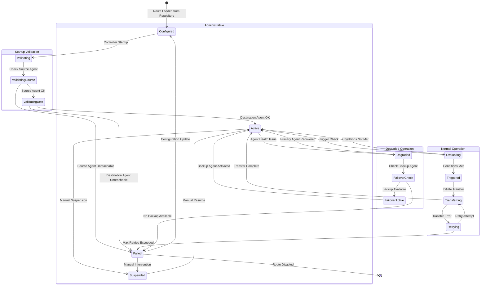

##### Lifecycle Stages Explained

**1. Startup Validation** — When `QuorusControllerVerticle` starts on any Quorus Controller (`quorus-controller1`, `quorus-controller2`, `quorus-controller3`), it loads route definitions from workflow YAML files via `YamlWorkflowDefinitionParser`. Each route is validated before activation:

| State | Description | Transition Conditions |
|-------|-------------|----------------------|
| `Configured` | Route definition loaded from workflow YAML file | Automatically transitions to `Validating` on controller startup |
| `Validating` | Controller begins validation sequence | — |
| `ValidatingSource` | Controller checks if the source Quorus Agent (e.g., `agent-crm-001`) is registered and responsive via `HeartbeatService` | `Source Agent OK` → proceed; `Source Agent Unreachable` → `Failed` |
| `ValidatingDest` | Controller checks if the destination Quorus Agent (e.g., `agent-warehouse-001`) is registered and responsive | `Destination Agent OK` → `Active`; `Destination Agent Unreachable` → `Failed` |

**2. Normal Operation** — Once validated, the route enters the active trigger evaluation loop:

| State | Description | Transition Conditions |
|-------|-------------|----------------------|
| `Active` | Route is operational; trigger conditions are continuously evaluated | Trigger check runs at configured interval (e.g., every 10 seconds) |
| `Evaluating` | Trigger engine checks if conditions are met (file appeared, cron matched, batch threshold reached, etc.) | `Conditions Met` → `Triggered`; `Conditions Not Met` → return to `Active` |
| `Triggered` | Conditions satisfied; route initiates transfer job | Immediately transitions to `Transferring` |
| `Transferring` | Transfer in progress via `SimpleTransferEngine` on the assigned Quorus Agent | `Transfer Complete` → `Active`; `Transfer Error` → `Retrying` |
| `Retrying` | Transfer failed; controller schedules retry with exponential backoff | `Retry Attempt` → `Transferring`; `Max Retries Exceeded` → `Failed` |

**3. Degraded Operation** — When agent health issues are detected:

| State | Description | Transition Conditions |
|-------|-------------|----------------------|
| `Degraded` | Source or destination Quorus Agent stopped sending heartbeats (missed 3+ consecutive heartbeats) | Controller checks for backup agent |
| `FailoverCheck` | Controller looks for a configured backup agent in the route's `failover.backupAgent` field | `Backup Available` → `FailoverActive`; `No Backup Available` → `Failed` |
| `FailoverActive` | Backup Quorus Agent is now handling transfers for this route | Transitions to `Active` once backup is confirmed healthy |

**4. Administrative Controls** — Manual intervention states:

| State | Description | Transition Conditions |
|-------|-------------|----------------------|
| `Suspended` | Route paused by operator via REST API (`PUT /routes/{id}/suspend`) | `Manual Resume` via `PUT /routes/{id}/resume` → `Active` |
| `Failed` | Route cannot operate (agent unreachable, max retries exceeded, no backup available) | `Configuration Update` (fix and redeploy) → `Configured`; `Manual Intervention` → `Suspended` |

##### Example: CRM Export Route Lifecycle

1. **Startup**: `quorus-controller1` (LEADER) loads route `crm-to-warehouse` from workflow YAML via `YamlWorkflowDefinitionParser`
2. **Validation**: Controller pings `agent-crm-001` (source) — ✅ healthy; pings `agent-warehouse-001` (destination) — ✅ healthy
3. **Active**: Route enters trigger evaluation loop (EVENT type — watching `/corporate-data/crm/export/`)
4. **Trigger**: New file `customers-2026-02-01.json` appears in source directory
5. **Transfer**: Controller assigns job to `agent-crm-001`; agent transfers file via `SftpTransferProtocol` to `agent-warehouse-001`
6. **Complete**: Transfer verified; route returns to `Active` state, waiting for next file event

#### Route Trigger Evaluation Flow

The Trigger Evaluation Engine runs inside the LEADER Quorus Controller (`quorus-controller1`, `quorus-controller2`, or `quorus-controller3` — whichever is currently LEADER). It continuously evaluates trigger conditions for all active routes and initiates transfers when conditions are met.

##### Trigger Types

| Trigger Type | Evaluator | Description | Example Use Case |
|--------------|-----------|-------------|------------------|
| **EVENT** | Event Monitor | Watches source directory for file system events (create, modify, delete) | Real-time CRM export: transfer each new file immediately |
| **TIME** | Cron Scheduler | Triggers at specific times using cron expressions | Nightly backup: `0 2 * * *` (2:00 AM daily) |
| **INTERVAL** | Interval Timer | Triggers after a fixed time period elapses | Log collection: every 15 minutes |
| **BATCH** | File Counter | Triggers when file count reaches threshold (with optional max wait timeout) | Report distribution: when 100 files accumulate or 1 hour passes |
| **SIZE** | Size Accumulator | Triggers when cumulative file size reaches threshold (with optional max wait timeout) | Data warehouse load: when 1 GB of data accumulates or 4 hours pass |
| **COMPOSITE** | Composite Logic | Combines multiple conditions with AND/OR logic | Complex workflows: (TIME AND EVENT) OR MANUAL |

##### Evaluation Flow by Trigger Type

**EVENT Trigger** (Real-time file watching)
```
Event Monitor → File Event Detected? → (No) → continue monitoring
                     ↓ (Yes)
              Matches Filters? → (No) → continue monitoring
                     ↓ (Yes)
              TRIGGER TRANSFER
```
The Event Monitor uses file system watchers (via Quorus Agent's `JobPollingService`) to detect new files. Filter patterns (e.g., `*.json`, `customer-*.csv`) are applied before triggering.

**TIME Trigger** (Cron-based scheduling)
```
Cron Scheduler → Cron Match? → (No) → wait until next check
                      ↓ (Yes)
               TRIGGER TRANSFER
```
The Cron Scheduler evaluates cron expressions (e.g., `0 2 * * *` for 2:00 AM daily). Standard cron syntax is supported with second-level precision.

**INTERVAL Trigger** (Fixed period)
```
Interval Timer → Interval Elapsed? → (No) → continue waiting
                       ↓ (Yes)
                TRIGGER TRANSFER
```
Simple periodic transfers. Example: `intervalMinutes: 15` triggers every 15 minutes regardless of file activity.

**BATCH Trigger** (File count threshold)
```
File Counter → File Count >= Threshold? → (Yes) → TRIGGER TRANSFER
                       ↓ (No)
              Max Wait Exceeded? → (Yes) → TRIGGER TRANSFER
                       ↓ (No)
              continue accumulating
```
Batches files until either the count threshold is met OR the maximum wait time expires (prevents indefinite accumulation).

**SIZE Trigger** (Cumulative size threshold)
```
Size Accumulator → Total Size >= Threshold? → (Yes) → TRIGGER TRANSFER
                          ↓ (No)
                  Max Wait Exceeded? → (Yes) → TRIGGER TRANSFER
                          ↓ (No)
                  continue accumulating
```
Similar to BATCH, but based on cumulative file size (e.g., `sizeThresholdMB: 1024` for 1 GB).

**COMPOSITE Trigger** (Combined conditions)
```
Composite Logic → Composite Logic Met? → (Yes) → TRIGGER TRANSFER
                         ↓ (No)
                 continue evaluating
```
Combines multiple conditions. Example: `(TIME:weekday AND EVENT:*.csv) OR MANUAL` — triggers on weekdays when CSV files appear, or on manual request.

##### Configuration Examples

**EVENT Trigger Configuration:**
```yaml
trigger:
  type: EVENT
  event:
    patterns: ["*.json", "*.csv"]
    excludePatterns: ["*.tmp", "*.partial"]
    debounceMs: 500  # Wait 500ms after last event before triggering
```

**TIME Trigger Configuration:**
```yaml
trigger:
  type: TIME
  schedule:
    cron: "0 2 * * *"      # 2:00 AM daily
    timezone: "GMT"
```

**BATCH Trigger Configuration:**
```yaml
trigger:
  type: BATCH
  batch:
    fileCountThreshold: 100
    maxWaitMinutes: 60     # Trigger after 1 hour even if threshold not reached
```

**COMPOSITE Trigger Configuration:**
```yaml
trigger:
  type: COMPOSITE
  composite:
    operator: OR
    conditions:
      - type: TIME
        schedule:
          cron: "0 6 * * 1-5"  # 6 AM on weekdays
      - type: EVENT
        event:
          patterns: ["urgent-*.json"]
```

##### Figure 4: Trigger Evaluation Flow

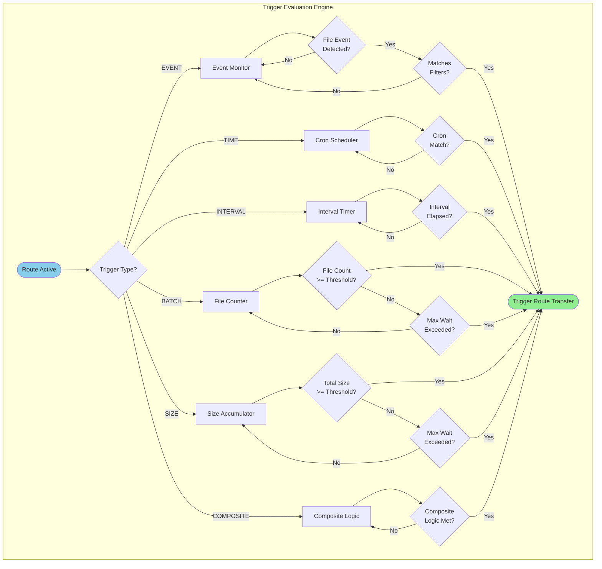

#### Controller-Agent-Route Architecture

The diagram below shows the complete Quorus architecture: the 3-node Quorus Controller cluster (Control Plane), the workflow definitions (loaded from YAML files), and the geo-distributed Quorus Agent fleet executing transfers.

##### Control Plane Components

| Component | Description |
|-----------|-------------|
| **Controller Cluster** | Three Quorus Controllers (`quorus-controller1`, `quorus-controller2`, `quorus-controller3`) running Raft consensus. Only the LEADER evaluates triggers and assigns jobs; FOLLOWERs replicate state and can become LEADER if the current LEADER fails. |
| **Workflow Definitions** | Transfer routes are defined in YAML workflow files and parsed by `YamlWorkflowDefinitionParser`. When a workflow is submitted, it creates transfer jobs that are stored in `QuorusStateMachine.transferJobs`. |

##### Example Workflow Routes

The diagram shows four example routes defined in workflow YAML files:

| Route | Trigger Type | Source Agent | Destination Agent | Description |
|-------|--------------|--------------|-------------------|-------------|
| `CRM→Warehouse` | ⚡ EVENT | `agent-crm-001` (APAC-East) | `agent-warehouse-001` (APAC-East) | Real-time export: transfers each new file from CRM system to data warehouse |
| `App→Backup` | 🕐 TIME (2AM) | `agent-app-001` (APAC-East) | `agent-backup-001` (APAC-West) | Nightly backup: transfers application data to backup site at 2:00 AM |
| `Logs→Archive` | 🔄 INTERVAL (15m) | `agent-logs-001` (APAC-West) | `agent-archive-001` (EU-West) | Periodic collection: transfers collected logs to archive every 15 minutes |
| `Reports→Dist` | 📦 BATCH (100) | `agent-reports-001` (EU-West) | `agent-dist-001` (EU-West) | Batch distribution: transfers reports when 100 files accumulate |

##### Agent Fleet (Geo-Distributed)

Quorus Agents are deployed close to data sources and destinations to minimize transfer latency and respect data residency requirements:

| Region | Agents | Watched Directories | Purpose |
|--------|--------|---------------------|---------|
| **APAC-East** | `agent-crm-001`, `agent-warehouse-001`, `agent-app-001` | `/crm/export/`, `/warehouse/import/`, `/app/data/` | Primary business applications — CRM exports, warehouse imports, application data |
| **APAC-West** | `agent-backup-001`, `agent-logs-001` | `/backup/nightly/`, `/logs/collected/` | Disaster recovery and log aggregation site |
| **EU-West** | `agent-archive-001`, `agent-reports-001`, `agent-dist-001` | `/archive/logs/`, `/reports/generated/`, `/distribution/` | European data-residency example; compliance requires separate control evidence |

##### Route-to-Agent Mapping

Each route connects exactly one source agent to one destination agent:

```
Route: CRM→Warehouse
  Source:      agent-crm-001       (/crm/export/)        [APAC-East]
  Destination: agent-warehouse-001 (/warehouse/import/)  [APAC-East]
  
Route: App→Backup
  Source:      agent-app-001       (/app/data/)          [APAC-East]
  Destination: agent-backup-001    (/backup/nightly/)    [APAC-West]  ← Cross-region for DR
  
Route: Logs→Archive
  Source:      agent-logs-001      (/logs/collected/)    [APAC-West]
  Destination: agent-archive-001   (/archive/logs/)      [EU-West]  ← Cross-region for compliance
  
Route: Reports→Dist
  Source:      agent-reports-001   (/reports/generated/) [EU-West]
  Destination: agent-dist-001      (/distribution/)      [EU-West]
```

##### Communication Flow

1. **Raft Consensus (gRPC, port 9080)**: `quorus-controller1` ↔ `quorus-controller2` ↔ `quorus-controller3` — Leader election, log replication, route configuration sync
2. **Agent Heartbeats (HTTP, port 8080)**: Each Quorus Agent sends `POST /api/v1/agents/heartbeat` to the controller cluster via `HeartbeatService`
3. **Job Assignment (HTTP, port 8080)**: The agent fetches assigned work via `GET /api/v1/agents/{agentId}/jobs`. Automatic route-trigger evaluation is target-state behavior and is not wired in the current controller startup path.
4. **Transfer Execution**: Source agent reads file, transfers via `SimpleTransferEngine` using the appropriate protocol adapter (`SftpTransferProtocol`, `HttpTransferProtocol`, etc.)
5. **Status Reporting (HTTP, port 8080)**: The agent reports `ACCEPTED`, `IN_PROGRESS`, and terminal state through `POST /api/v1/jobs/{jobId}/status` using attempt identity, expected state, fencing generation, and ordered report sequence. The controller applies attempt, assignment, transfer status, and progress atomically; legacy assignments retain a compatibility path.

In the current R3 remediation, authorization, secret, local-path and request-preparation
rejections report `FAILED` directly from acknowledged `ACCEPTED`; the pending transfer
also becomes `FAILED` atomically, without synthetic start/use evidence. Transient lost
acknowledgements are reconciled by bounded exact-report replay, and an unresolved start
does not authorize transfer execution. Repeated polls for the same fenced attempt are
suppressed within the running agent. Durable agent report-outbox recovery and destination
reconciliation remain Phase 2 work; consult the current
[implementation checkpoint](../task/QUORUS_ENTERPRISE_IMPLEMENTATION_PLAN.md#remediation-checkpoint--2026-09-04)
and [operator procedure](../../docs/QUORUS_SECURITY_DEPLOYMENT_GUIDE.md#12-pre-execution-failure-and-acknowledgement-reconciliation).

##### Figure 5: Controller-Agent-Route Architecture

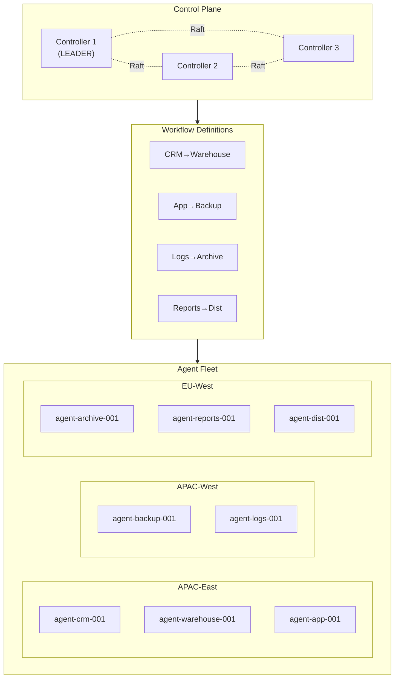

#### Route-Based Transfer Sequence

##### Figure 6: Route-Based Transfer Sequence

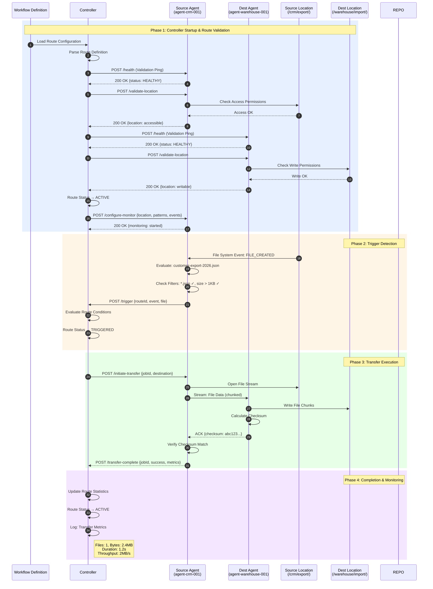

---

## I. System Reliability Improvements

*Moved verbatim from v3.8, lines 1974–2019. Headings below keep their original levels.*

### System Reliability Improvements

The controller-first architecture includes several critical reliability improvements that address common failure modes in distributed systems:

#### Health Check Configuration
**Problem Resolved**: Docker health checks were using incorrect endpoints (`/q/health` vs `/health`)
**Solution**: Standardized health endpoints across all components
**Impact**: Accurate container health reporting and proper load balancer routing

```yaml
# Corrected health check configuration
healthcheck:
  test: ["CMD", "curl", "-f", "http://localhost:8080/health"]
  interval: 10s
  timeout: 5s
  retries: 3
  start_period: 30s
```

#### Sequence Number Persistence
**Problem Resolved**: In-memory sequence number tracking caused heartbeat rejection after restarts
**Solution**: Enhanced sequence number validation with restart detection
**Impact**: Graceful handling of controller restarts without agent re-registration

```java
// Enhanced sequence number validation
if (lastSeqNum == null) {
    // First heartbeat from this agent since server startup
    logger.info("First heartbeat received from agent " + agentId +
               " since server startup, sequence: " + request.getSequenceNumber());
}
```

#### Load Balancer Integration
**Problem Resolved**: Single point of failure with single API endpoint
**Solution**: Nginx load balancer with health-aware routing
**Impact**: High availability with automatic failover to healthy controllers

```nginx
upstream quorus_controllers {
    server controller1:8080 max_fails=3 fail_timeout=30s;
    server controller2:8080 max_fails=3 fail_timeout=30s;
    server controller3:8080 max_fails=3 fail_timeout=30s;
}
```

---

## J. Agent Registration and Heartbeat Protocol payloads

*Moved verbatim from v3.8, lines 2162–2234. Headings below keep their original levels.*

### Agent Registration Protocol

Agents must register with the controller quorum before participating in transfer operations. The registration process establishes agent capabilities, resources, and location information.

```yaml
# Agent Registration Message
registration:
  agentId: "agent-001"
  hostname: "transfer-agent-001.corp.com"
  version: "1.0.0"
  capabilities:
    protocols: ["http", "https", "sftp", "smb", "ftp"]
    maxConcurrentTransfers: 10
    maxBandwidthMbps: 1000
    supportedFeatures: ["chunked-transfer", "resume", "compression"]
  resources:
    cpu:
      cores: 4
      architecture: "x86_64"
    memory:
      totalMB: 8192
      availableMB: 6144
    storage:
      totalGB: 1024
      availableGB: 512
    network:
      interfaces: ["eth0", "eth1"]
      totalBandwidthMbps: 1000
  location:
    datacenter: "dc-east-1"
    zone: "zone-a"
    region: "apac-east"
    tags: ["production", "high-bandwidth"]
  security:
    certificateFingerprint: "sha256:abc123..."
    supportedAuthMethods: ["certificate", "token"]
```

### Heartbeat Protocol

Agents send regular heartbeat messages to maintain their registration and report current status, capacity, and health metrics.

```yaml
# Heartbeat Message (every 30 seconds)
heartbeat:
  agentId: "agent-001"
  timestamp: "2024-01-15T10:30:00Z"
  sequenceNumber: 12345
  status: "active"  # active, busy, draining, unhealthy
  currentJobs: 3
  availableCapacity: 7
  metrics:
    cpu:
      usage: 45.2
      loadAverage: [1.2, 1.5, 1.8]
    memory:
      usage: 62.1
      available: 3072
    network:
      utilization: 23.4
      bytesTransferred: 1073741824
    transfers:
      active: 3
      completed: 127
      failed: 2
  health:
    diskSpace: "healthy"
    networkConnectivity: "healthy"
    systemLoad: "normal"
  lastJobCompletion: "2024-01-15T10:28:45Z"
  nextMaintenanceWindow: "2024-01-16T02:00:00Z"
```

---

## K. Multi-Tenancy Architecture

*Moved verbatim from v3.8, lines 2490–2643. Headings below keep their original levels.*

## Multi-Tenancy Architecture

### Core Multi-Tenancy Concepts

#### 1. Tenant
A logical isolation boundary representing an organization, department, or business unit with its own:
- Configuration and policies
- Resource quotas and limits
- Security boundaries
- Workflow definitions
- Execution history and metrics

#### 2. Tenant Hierarchy
Support for nested tenants (e.g., Company → Department → Team) with inheritance of policies and quotas.

#### 3. Tenant Isolation Levels
- **Logical Isolation**: Shared infrastructure with data separation
- **Physical Isolation**: Dedicated resources per tenant
- **Hybrid Isolation**: Mix of shared and dedicated resources

### Multi-Tenant System Architecture

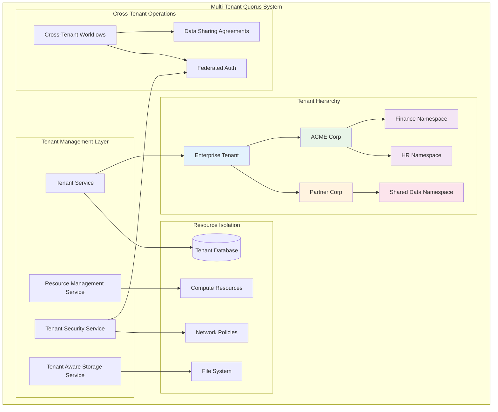

#### 1. Tenant Management Service
```java
// New package: dev.mars.quorus.tenant
public interface TenantService {
    // Tenant lifecycle
    Tenant createTenant(TenantConfiguration config);
    Tenant updateTenant(String tenantId, TenantConfiguration config);
    void deleteTenant(String tenantId);
    
    // Tenant discovery
    Tenant getTenant(String tenantId);
    List<Tenant> getChildTenants(String parentTenantId);
    TenantHierarchy getTenantHierarchy(String tenantId);
    
    // Resource management
    ResourceQuota getResourceQuota(String tenantId);
    ResourceUsage getResourceUsage(String tenantId);
    boolean checkResourceLimit(String tenantId, ResourceType type, long amount);
}
```

#### 2. Multi-Tenant Workflow Engine
```java
public interface MultiTenantWorkflowEngine extends WorkflowEngine {
    // Tenant-aware execution
    WorkflowExecution execute(WorkflowDefinition definition, TenantContext context);
    
    // Cross-tenant operations
    WorkflowExecution executeCrossTenant(WorkflowDefinition definition, 
                                       List<TenantContext> tenants);
    
    // Tenant isolation
    List<WorkflowExecution> getExecutions(String tenantId);
    WorkflowMetrics getMetrics(String tenantId, TimeRange range);
}
```

#### 3. Tenant-Aware Security Service
```java
public interface TenantSecurityService {
    // Authentication
    TenantPrincipal authenticate(String tenantId, AuthenticationToken token);
    
    // Authorization
    boolean authorize(TenantPrincipal principal, String resource, String action);
    
    // Data protection
    EncryptionKey getTenantEncryptionKey(String tenantId);
    String encryptForTenant(String tenantId, String data);
    String decryptForTenant(String tenantId, String encryptedData);
    
    // Cross-tenant security
    boolean isCrossTenantAllowed(String sourceTenant, String targetTenant);
    DataSharingAgreement getDataSharingAgreement(String tenant1, String tenant2);
}
```

#### 4. Resource Management Service
```java
public interface ResourceManagementService {
    // Quota management
    boolean reserveResources(String tenantId, ResourceRequest request);
    void releaseResources(String tenantId, ResourceRequest request);
    
    // Usage tracking
    void recordUsage(String tenantId, ResourceUsage usage);
    ResourceMetrics getUsageMetrics(String tenantId, TimeRange range);
    
    // Billing and cost allocation
    CostReport generateCostReport(String tenantId, TimeRange range);
    void allocateCosts(String tenantId, TransferExecution execution);
}
```

---

## L. YAML Workflow System

*Moved verbatim from v3.8, lines 2644–3076. Headings below keep their original levels.*

## YAML Workflow System

### Core Concepts

#### 1. Transfer Definition
A single file transfer operation with source, destination, and metadata.

#### 2. Transfer Group
A collection of related transfers that can be executed with dependencies, sequencing, and shared configuration.

#### 3. Transfer Workflow
A higher-level orchestration of transfer groups with complex dependency trees, triggers, and conditional execution.

#### 4. Transfer Plan
The resolved execution plan after dependency analysis and validation.

### YAML Schema Design

#### Single Transfer Definition

```yaml
# transfer-internal-data.yaml
apiVersion: quorus.dev/v1
kind: Transfer
metadata:
  name: internal-data-sync
  description: "Sync customer data from CRM to data warehouse"
  tenant: acme-corp              # Tenant identifier
  namespace: finance             # Sub-tenant/namespace
  labels:
    environment: production
    priority: high
    team: data-ops
    dataClassification: confidential
    costCenter: "CC-12345"
    networkZone: "internal-dmz"
  annotations:
    created-by: "john.doe@company.com"
    ticket: "JIRA-12345"

spec:
  source:
    # Internal corporate API endpoint
    uri: "https://crm-internal.acme-corp.local/api/customers/export"
    protocol: https
    authentication:
      type: service-account      # Internal service account
      serviceAccount: "quorus-data-sync"
    headers:
      X-Internal-Service: "quorus"
      X-Data-Classification: "${metadata.labels.dataClassification}"
      X-Network-Zone: "${metadata.labels.networkZone}"
    timeout: 300s
    # Internal network optimization
    networkOptimization:
      useInternalRouting: true
      preferredDataCenter: "dc-east-1"

  destination:
    # Internal corporate storage path
    path: "/corporate-storage/data-warehouse/customers/customers-${date:yyyy-MM-dd}.json"
    protocol: nfs                # Internal NFS mount
    createDirectories: true
    permissions: "640"           # Corporate security standard
    # Corporate encryption standards
    encryption:
      enabled: true
      algorithm: "AES-256-GCM"
      keySource: "corporate-kms"
      keyId: "${tenant.security.keyManagement.keyId}"

  validation:
    expectedSize:
      min: 10MB                  # Larger internal datasets
      max: 5GB
    checksum:
      algorithm: "SHA-256"
      required: true
    # Internal data quality checks
    dataQuality:
      validateSchema: true
      schemaVersion: "v2.1"
      rejectOnValidationFailure: true

  retry:
    maxAttempts: 5               # More retries for internal reliability
    backoff: exponential
    initialDelay: 500ms          # Faster retry for internal network
    maxDelay: 10s

  # Corporate monitoring integration
  monitoring:
    enabled: true
    progressReporting: true
    metricsEnabled: true
    alertOnFailure: true
    # Corporate monitoring systems
    integrations:
      splunk: true
      datadog: true
      corporateSOC: true
    tags:
      tenant: "${tenant.id}"
      namespace: "${metadata.namespace}"
      costCenter: "${metadata.labels.costCenter}"
      networkZone: "${metadata.labels.networkZone}"
      dataClassification: "${metadata.labels.dataClassification}"
```

#### Transfer Group Definition

```yaml
# backup-workflow.yaml
apiVersion: quorus.dev/v1
kind: TransferGroup
metadata:
  name: daily-backup-workflow
  description: "Daily backup workflow for critical data"
  tenant: acme-corp
  namespace: finance
  labels:
    schedule: daily
    criticality: high

spec:
  # Execution strategy
  execution:
    strategy: sequential  # sequential, parallel, mixed
    maxConcurrency: 3
    timeout: 3600s
    continueOnError: false
    
  # Shared configuration
  defaults:
    retry:
      maxAttempts: 3
      backoff: exponential
    monitoring:
      progressReporting: true
      
  # Variable definitions
  variables:
    BACKUP_DATE: "${date:yyyy-MM-dd}"
    BACKUP_ROOT: "${tenant.storage.root}/backup/${BACKUP_DATE}"
    AUTH_TOKEN: "${env:API_TOKEN}"
    
  # Transfer definitions
  transfers:
    - name: user-data
      source:
        uri: "https://api.company.com/users/export"
        headers:
          Authorization: "${AUTH_TOKEN}"
      destination:
        path: "${BACKUP_ROOT}/users.json"
      dependsOn: []
      
    - name: order-data
      source:
        uri: "https://api.company.com/orders/export"
        headers:
          Authorization: "${AUTH_TOKEN}"
      destination:
        path: "${BACKUP_ROOT}/orders.json"
      dependsOn: ["user-data"]  # Wait for user-data to complete
      
    - name: analytics-data
      source:
        uri: "https://analytics.company.com/export"
      destination:
        path: "${BACKUP_ROOT}/analytics.json"
      dependsOn: ["user-data", "order-data"]
      condition: "${user-data.success} && ${order-data.success}"
      
  # Post-execution actions
  onSuccess:
    - action: notify
      target: "symphony://data-ops-channel"
      message: "Daily backup completed successfully"
    - action: cleanup
      target: "/backup"
      retentionDays: 30
      
  onFailure:
    - action: notify
      target: "email://ops-team@company.com"
      message: "Daily backup failed: ${error.message}"
    - action: rollback
      strategy: deletePartial
```

#### Multi-Tenant Workflow Definition

```yaml
# multi-tenant-workflow.yaml
apiVersion: quorus.dev/v1
kind: TransferWorkflow
metadata:
  name: cross-tenant-data-sync
  tenant: enterprise            # Parent tenant

spec:
  # Multi-tenant execution
  tenants:
    - name: acme-corp
      namespace: finance
      role: source              # source, destination, both

    - name: partner-corp
      namespace: shared-data
      role: destination

  # Tenant-specific execution policies
  execution:
    isolation: logical          # logical, physical, hybrid
    crossTenantAllowed: true
    approvalRequired: true
    dryRun: false
    virtualRun: false
    parallelism: 5
    timeout: 7200s

  # Cross-tenant security
  security:
    # Data sharing agreements
    dataSharing:
      agreements: ["DSA-2024-001"]
      dataClassification: "internal"
      retentionPolicy: "30d"

    # Cross-tenant authentication
    authentication:
      federatedAuth: true
      trustedTenants: ["partner-corp"]

  # Environment-specific variables
  environments:
    production:
      SOURCE_DB: "prod-db.company.com"
      TARGET_STORAGE: "s3://prod-backup"
    staging:
      SOURCE_DB: "staging-db.company.com"
      TARGET_STORAGE: "s3://staging-backup"

  groups:
    - name: extract-acme-data
      tenant: acme-corp
      namespace: finance
      transferGroup:
        spec:
          transfers:
            - name: customer-export
              source:
                uri: "${acme-corp.api.endpoint}/customers"
                authentication:
                  type: tenant-oauth2
              destination:
                path: "${shared.storage}/acme-customers.json"

    - name: sync-to-partner
      tenant: partner-corp
      namespace: shared-data
      dependsOn: ["extract-acme-data"]
      condition: "${acme-corp.dataSharing.approved}"
      transferGroup:
        spec:
          transfers:
            - name: partner-import
              source:
                path: "${shared.storage}/acme-customers.json"
              destination:
                uri: "${partner-corp.api.endpoint}/import"
                authentication:
                  type: tenant-oauth2

  # Workflow triggers
  triggers:
    - name: schedule
      type: cron
      schedule: "0 2 * * *"  # Daily at 2 AM
      timezone: "GMT"

    - name: file-watcher
      type: fileSystem
      path: "/incoming/trigger.flag"
      action: create

  # Validation rules
  validation:
    - name: source-connectivity
      type: connectivity
      targets: ["${SOURCE_DB}"]

    - name: storage-capacity
      type: diskSpace
      path: "/staging"
      required: 10GB

    - name: dependency-check
      type: yamlDependencies
      recursive: true
```

### Tenant Configuration

```yaml
# tenant-config.yaml
apiVersion: quorus.dev/v1
kind: TenantConfiguration
metadata:
  name: acme-corp
  namespace: enterprise
  labels:
    tier: premium
    region: apac-east-1
    industry: finance

spec:
  # Tenant hierarchy
  hierarchy:
    parent: null  # Root tenant
    children: ["acme-corp-finance", "acme-corp-hr", "acme-corp-it"]

  # Resource quotas and limits
  resources:
    quotas:
      # Transfer limits
      maxConcurrentTransfers: 50
      maxDailyTransfers: 1000
      maxMonthlyDataTransfer: 10TB
      maxFileSize: 5GB

      # Storage limits
      maxStorageUsage: 1TB
      maxRetentionDays: 365

      # Compute limits
      maxCpuCores: 16
      maxMemoryGB: 64
      maxBandwidthMbps: 1000

    # Resource allocation strategy
    allocation:
      strategy: shared  # shared, dedicated, hybrid
      priority: high    # low, medium, high, critical

  # Security policies
  security:
    # Network access controls
    networking:
      allowedSourceCIDRs: ["10.0.0.0/8", "192.168.0.0/16"]
      allowedDestinations: ["s3://acme-corp-*", "/data/acme-corp/*"]
      requireVPN: true
      allowCrossRegion: false

    # Authentication and authorization
    authentication:
      provider: "oauth2"  # oauth2, saml, ldap, api-key
      endpoint: "https://auth.acme-corp.com"

    authorization:
      rbac:
        enabled: true
        defaultRole: "transfer-user"
        adminRole: "transfer-admin"

    # Data protection
    dataProtection:
      encryptionAtRest: true
      encryptionInTransit: true
      encryptionAlgorithm: "AES-256"
      keyManagement: "aws-kms"  # aws-kms, azure-kv, vault

  # Compliance and governance
  governance:
    # Data classification
    dataClassification:
      defaultLevel: "internal"
      allowedLevels: ["public", "internal", "confidential"]

    # Audit and compliance
    audit:
      enabled: true
      retentionDays: 2555  # 7 years
      exportFormat: "json"

    compliance:
      frameworks: ["SOX", "GDPR", "HIPAA"]
      dataResidency: "apac-east-1"
      crossBorderTransfer: false

  # Monitoring and alerting
  monitoring:
    # Metrics collection
    metrics:
      enabled: true
      granularity: "1m"
      retention: "90d"

    # Alerting configuration
    alerting:
      channels:
        - type: "symphony"
          webhook: "https://hooks.symphony.com/acme-corp"
        - type: "email"
          recipients: ["ops@acme-corp.com"]
        - type: "webhook"
          endpoint: "https://monitoring.acme-corp.com/alerts"

      thresholds:
        errorRate: 5%
        quotaUsage: 80%
        transferLatency: 30s

  # Workflow defaults
  defaults:
    # Default retry policy
    retry:
      maxAttempts: 3
      backoff: exponential
      initialDelay: 1s

    # Default validation
    validation:
      checksumRequired: true
      sizeValidation: true

    # Default monitoring
    monitoring:
      progressReporting: true
      metricsEnabled: true
```

---

## M. Transfer Process Flow

*Moved verbatim from v3.8, lines 3202–3280. Headings below keep their original levels.*

## Transfer Process Flow

### Route-Based Transfer Flow

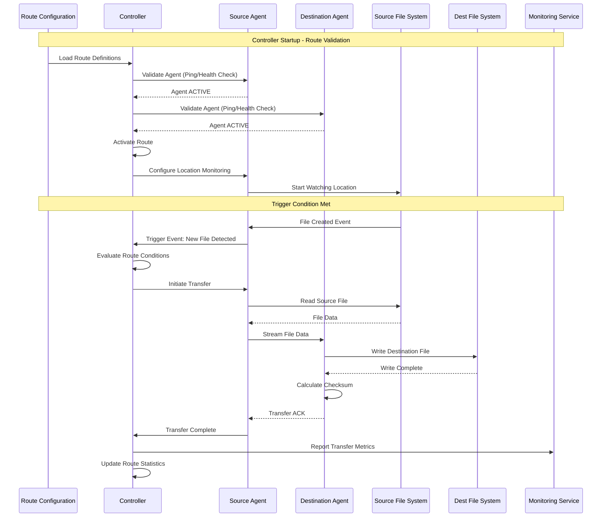

### Workflow-Based Transfer Flow

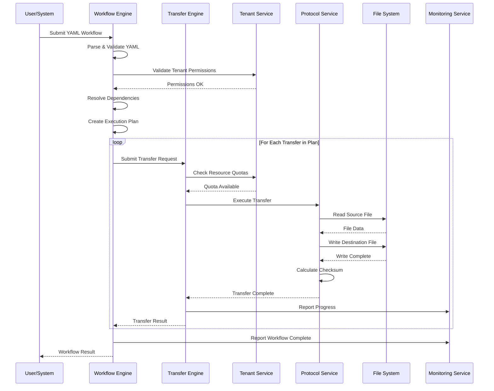

---

## N. Data Models

*Moved verbatim from v3.8, lines 3281–3391. Headings below keep their original levels.*

## Data Models

### Route Configuration Models

#### Route Definition
```java
public class RouteConfiguration {
    private String routeId;
    private String name;
    private String description;
    private AgentEndpoint source;
    private AgentEndpoint destination;
    private RouteTrigger trigger;
    private RouteOptions options;
    private RouteStatus status;
    private String tenantId;
    // ... other fields
}

public class AgentEndpoint {
    private String agentId;
    private String location;  // Path or URL to monitor/target
    private Map<String, String> parameters;
}

public class RouteTrigger {
    private TriggerType type;  // EVENT, TIME, INTERVAL, BATCH, SIZE, MANUAL, EXTERNAL, COMPOSITE
    private Map<String, Object> configuration;
    // Event-based: file patterns, events (CREATE, MODIFY, DELETE)
    // Time-based: cron expression
    // Interval-based: period duration
    // Batch-based: file count threshold
    // Size-based: size threshold
}

public enum RouteStatus {
    CONFIGURED,
    VALIDATING,
    ACTIVE,
    TRIGGERED,
    TRANSFERRING,
    DEGRADED,
    SUSPENDED,
    FAILED
}
```

### Core Domain Models

#### Transfer Request
```java
public class TransferRequest {
    private String requestId;
    private URI sourceUri;
    private Path destinationPath;
    private String protocol;
    private String tenantId;
    private String namespace;
    private Map<String, String> metadata;
    private long expectedSize;
    private String expectedChecksum;
    // ... other fields
}
```

#### Transfer Job
```java
public class TransferJob {
    private String jobId;
    private TransferRequest request;
    private TransferStatus status;
    private long bytesTransferred;
    private long totalBytes;
    private Instant startTime;
    private String actualChecksum;
    private String tenantId;
    // ... other fields
}
```

### Multi-Tenant Models

#### Tenant Configuration
```java
public class TenantConfiguration {
    private String tenantId;
    private String parentTenantId;
    private ResourceQuota resourceQuota;
    private SecurityPolicy securityPolicy;
    private ComplianceSettings compliance;
    private Map<String, String> variables;
    // ... other fields
}
```

### Workflow Models

#### Workflow Definition
```java
public class WorkflowDefinition {
    private String name;
    private String tenantId;
    private String namespace;
    private ExecutionStrategy execution;
    private List<TransferGroupDefinition> groups;
    private Map<String, String> variables;
    private List<TenantContext> tenants;
    // ... other fields
}
```

---

## O. Data Isolation Strategies

*Moved verbatim from v3.8, lines 3392–3457. Headings below keep their original levels.*

## Data Isolation Strategies

### 1. Database-Level Isolation
```sql
-- Tenant-aware schema design
CREATE TABLE transfers (
    id UUID PRIMARY KEY,
    tenant_id VARCHAR(255) NOT NULL,
    namespace VARCHAR(255),
    request_data JSONB,
    status VARCHAR(50),
    created_at TIMESTAMP DEFAULT NOW(),

    -- Tenant isolation constraints
    CONSTRAINT fk_tenant FOREIGN KEY (tenant_id) REFERENCES tenants(id),
    INDEX idx_tenant_namespace (tenant_id, namespace)
);

-- Row-level security
CREATE POLICY tenant_isolation ON transfers
    FOR ALL TO application_role
    USING (tenant_id = current_setting('app.current_tenant'));
```

### 2. Storage Isolation
```java
public class TenantAwareStorageService {
    private final String getTenantStorageRoot(String tenantId) {
        return String.format("/data/tenants/%s", tenantId);
    }

    private final void validateTenantAccess(String tenantId, Path path) {
        String tenantRoot = getTenantStorageRoot(tenantId);
        if (!path.startsWith(tenantRoot)) {
            throw new SecurityException("Cross-tenant storage access denied");
        }
    }
}
```

### 3. Network Isolation
```yaml
# Kubernetes NetworkPolicy example
apiVersion: networking.k8s.io/v1
kind: NetworkPolicy
metadata:
  name: tenant-isolation
spec:
  podSelector:
    matchLabels:
      tenant: acme-corp
  policyTypes:
  - Ingress
  - Egress
  ingress:
  - from:
    - podSelector:
        matchLabels:
          tenant: acme-corp
  egress:
  - to:
    - podSelector:
        matchLabels:
          tenant: acme-corp
```

---

## P. Enterprise Features

*Moved verbatim from v3.8, lines 3458–3519. Headings below keep their original levels.*

## Enterprise Features

The snippets in this section are illustrative target-state policy concepts, not schemas accepted by the current workflow parser or proof of implemented controls. The complete capability requirements and delivery dependencies are defined in [Enterprise Capability Requirements](#enterprise-capability-requirements); canonical implementation status remains in the architecture and REST API specifications.

### 1. Governance & Compliance
```yaml
governance:
  approvals:
    required: true
    approvers: ["data-ops-lead", "security-team"]

  compliance:
    dataClassification: confidential
    retentionPolicy: 7years
    encryptionRequired: true
    auditLogging: true

  security:
    allowedSources: ["*.company.com", "trusted-partner.com"]
    allowedDestinations: ["s3://company-*", "/backup/*"]
    requiresVPN: true
```

### 2. Resource Management
```yaml
resources:
  limits:
    maxConcurrentTransfers: 10
    maxBandwidth: 100MB/s
    maxDiskUsage: 1TB

  quotas:
    dailyTransferLimit: 1TB
    monthlyTransferLimit: 30TB

  scheduling:
    priority: high
    preferredHours: "02:00-06:00"
    blackoutWindows: ["12:00-13:00"]
```

### 3. Monitoring & Alerting
```yaml
monitoring:
  metrics:
    - transferRate
    - errorRate
    - queueDepth
    - resourceUtilization

  alerts:
    - name: transfer-failure
      condition: "errorRate > 5%"
      severity: critical
      channels: ["symphony", "email", "xmatters"]

    - name: slow-transfer
      condition: "transferRate < 1MB/s"
      severity: warning
      channels: ["symphony"]
```

---

## Q. Security Architecture (first)

*Moved verbatim from v3.8, lines 3520–3556. Headings below keep their original levels.*

## Security Architecture

### Authentication
- **Enterprise directory integration** (Active Directory, LDAP)
- **Single Sign-On (SSO)** with corporate identity providers (SAML, OAuth2)
- **Service account authentication** for automated internal systems
- **Certificate-based authentication** for high-security internal transfers
- **Tenant-specific authentication** configuration for multi-tenant deployments

### Authorization
- **Role-based access control (RBAC)** integrated with corporate directory
- **Department and team-based** access controls
- **Data classification-aware** permissions (confidential, internal, public)
- **Network segment-based** access controls for internal zones
- **Fine-grained resource access** controls for sensitive data

### Data Protection
- **Encryption at rest** using corporate key management systems
- **TLS encryption** optimized for internal network performance
- **Data classification** and handling policies for corporate data
- **Network-level encryption** for high-security internal transfers
- **Tenant-specific encryption** keys for multi-tenant isolation

### Internal Network Security
- **Network segmentation** awareness and routing
- **Corporate firewall** integration and rule management
- **VPN and private network** support for remote sites
- **Internal certificate authority** integration
- **Network monitoring** and intrusion detection integration

### Audit & Compliance
- **Corporate audit system** integration
- **Compliance framework** support (SOX, GDPR, HIPAA, PCI-DSS)
- **Data lineage tracking** for internal data movement
- **Regulatory reporting** for internal data governance
- **Tenant-isolated audit trails** for multi-tenant compliance

---

## R. Configuration Management

*Moved verbatim from v3.8, lines 3557–3612. Headings below keep their original levels.*

## Configuration Management

### Hierarchical Configuration
```yaml
# Global defaults (system-level)
global:
  defaults:
    retry:
      maxAttempts: 3
    security:
      encryptionRequired: true

# Tenant-level overrides
tenant:
  acme-corp:
    defaults:
      retry:
        maxAttempts: 5  # Override global
      security:
        encryptionAlgorithm: "AES-256-GCM"  # Add tenant-specific

    # Namespace-level overrides
    namespaces:
      finance:
        defaults:
          retry:
            maxAttempts: 7  # Override tenant
          validation:
            checksumRequired: true  # Add namespace-specific
```

### Variable Resolution with Tenancy
```yaml
variables:
  # System variables
  system:
    version: "1.0.0"
    region: "apac-east-1"

  # Tenant variables
  tenant:
    id: "acme-corp"
    name: "ACME Corporation"
    storage:
      root: "/data/tenants/acme-corp"
      backup: "s3://acme-corp-backup"
    api:
      endpoint: "https://api.acme-corp.com"

  # Namespace variables
  namespace:
    name: "finance"
    costCenter: "CC-12345"
    approver: "finance-lead@acme-corp.com"
```

---

## S. Deployment Architecture

*Moved verbatim from v3.8, lines 3613–4040. Headings below keep their original levels.*

## Deployment Architecture

> [!CAUTION]
> The database, Redis, and etcd topology retained in this target-state section is a superseded legacy alternative, not the canonical Quorus controller architecture. Current authoritative controller state is the Raft log and snapshots; PostgreSQL, Redis, and etcd are not controller state authorities. Static Raft membership, current security gaps, and measurable availability requirements are defined in the canonical architecture specification.

### Corporate Network Deployment with Controller Quorum

```mermaid
graph TD
    %% External Access Layer
    CORP[Corporate Network<br/>Internal Traffic] --> VIP[Virtual IP<br/>Failover]
    VIP --> LB[Internal Load Balancer<br/>F5/HAProxy Cluster]

    %% Controller Quorum Layer
    subgraph "Controller Quorum (Multi-AZ)"
        direction TB
        LB --> C1[Controller Leader<br/>AZ-1]
        LB --> C2[Controller Follower<br/>AZ-2]
        LB --> C3[Controller Follower<br/>AZ-3]

        C1 -.->|Raft Consensus| C2
        C1 -.->|Raft Consensus| C3
        C2 -.->|Raft Consensus| C3
    end

    %% Distributed State Layer
    subgraph "Distributed State (Multi-AZ)"
        PG[(PostgreSQL Cluster<br/>Primary + 2 Replicas)]
        REDIS[(Redis Cluster<br/>6 Nodes)]
        ETCD[(etcd Cluster<br/>Agent Registry)]
    end

    %% Agent Fleet
    subgraph "Agent Fleet (Geographic Distribution)"
        subgraph "DC-East Agents"
            AE1[Agent E1<br/>HTTP/SFTP]
            AE2[Agent E2<br/>SMB/FTP]
            AE3[Agent EN...<br/>Multi-Protocol]
        end

        subgraph "DC-West Agents"
            AW1[Agent W1<br/>HTTP/SFTP]
            AW2[Agent W2<br/>SMB/FTP]
            AW3[Agent WN...<br/>Multi-Protocol]
        end

        subgraph "Cloud Agents"
            AC1[Agent C1<br/>HTTP/SFTP]
            AC2[Agent C2<br/>SMB/FTP]
            AC3[Agent CN...<br/>Multi-Protocol]
        end
    end

    %% Controller to State connections
    C1 --> PG
    C1 --> REDIS
    C1 --> ETCD
    C2 --> PG
    C2 --> REDIS
    C2 --> ETCD
    C3 --> PG
    C3 --> REDIS
    C3 --> ETCD

    %% Controller to Agent connections
    C1 -.->|Work Distribution| AE1
    C1 -.->|Work Distribution| AE2
    C1 -.->|Work Distribution| AE3
    C1 -.->|Work Distribution| AW1
    C1 -.->|Work Distribution| AW2
    C1 -.->|Work Distribution| AW3
    C1 -.->|Work Distribution| AC1
    C1 -.->|Work Distribution| AC2
    C1 -.->|Work Distribution| AC3

    %% Agent heartbeats
    AE1 -.->|Heartbeat| LB
    AE2 -.->|Heartbeat| LB
    AE3 -.->|Heartbeat| LB
    AW1 -.->|Heartbeat| LB
    AW2 -.->|Heartbeat| LB
    AW3 -.->|Heartbeat| LB
    AC1 -.->|Heartbeat| LB
    AC2 -.->|Heartbeat| LB
    AC3 -.->|Heartbeat| LB

    %% Corporate Integration
    subgraph "Corporate Services"
        AD[Active Directory<br/>Corporate LDAP]
        VAULT[Corporate Vault<br/>Key Management]
        CA[Corporate PKI<br/>Certificate Authority]
        NAS[Corporate NAS<br/>File Storage]
        NFS[NFS Mounts<br/>Department Shares]
    end

    %% Corporate Monitoring
    subgraph "Corporate Monitoring"
        PROM[Prometheus<br/>Corporate Monitoring]
        SPLUNK[Splunk<br/>Corporate SIEM]
        GRAF[Grafana<br/>Corporate Dashboards]
        ALERT[AlertManager]
        EMAIL[Corporate Email<br/>Exchange/O365]
    end

    %% Integration connections
    C1 --> AD
    C1 --> VAULT
    C1 --> CA
    AE1 --> NAS
    AE2 --> NFS
    AW1 --> NAS
    AW2 --> NFS
    AC1 --> NAS
    AC2 --> NFS

    %% Monitoring connections
    PROM --> C1
    PROM --> C2
    PROM --> C3
    PROM --> AE1
    PROM --> AW1
    PROM --> AC1
    SPLUNK --> PROM
    GRAF --> PROM
    ALERT --> PROM
    ALERT --> EMAIL

    %% Styling
    style C1 fill:#e3f2fd
    style C2 fill:#e8f5e8
    style C3 fill:#e8f5e8
    style AE1 fill:#fff3e0
    style AE2 fill:#fff3e0
    style AE3 fill:#fff3e0
    style AW1 fill:#fff3e0
    style AW2 fill:#fff3e0
    style AW3 fill:#fff3e0
    style AC1 fill:#fff3e0
    style AC2 fill:#fff3e0
    style AC3 fill:#fff3e0
    style CORP fill:#f0f0f0
    style LB fill:#f0f0f0
    style PG fill:#f3e5f5
    style REDIS fill:#f3e5f5
    style ETCD fill:#f3e5f5
    style PROM fill:#fce4ec
    style SPLUNK fill:#fce4ec
    style GRAF fill:#fce4ec
    style ALERT fill:#fce4ec
    style VAULT fill:#f1f8e9
    style CA fill:#f1f8e9
    style AD fill:#fff8e1
    style NAS fill:#fff8e1
    style NFS fill:#fff8e1
    style EMAIL fill:#fff8e1
```
```yaml
# Kubernetes deployment example
apiVersion: apps/v1
kind: Deployment
metadata:
  name: quorus-engine
spec:
  replicas: 3
  selector:
    matchLabels:
      app: quorus-engine
  template:
    metadata:
      labels:
        app: quorus-engine
    spec:
      containers:
      - name: quorus-engine
        image: quorus/engine:latest
        resources:
          requests:
            memory: "512Mi"
            cpu: "500m"
          limits:
            memory: "1Gi"
            cpu: "1000m"
        env:
        - name: QUORUS_TENANT_ID
          valueFrom:
            fieldRef:
              fieldPath: metadata.labels['tenant']
```

### Distributed State Management

The enhanced Quorus architecture implements distributed state management to ensure consistency, availability, and partition tolerance across the controller quorum and agent fleet.

#### State Distribution Strategy

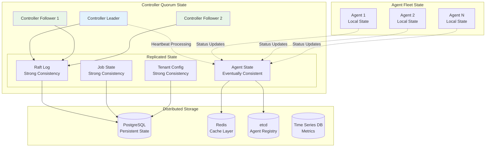

**State Categories:**

1. **Strongly Consistent State** (Raft Consensus):
   - Job assignments and status
   - Tenant configurations
   - Workflow definitions
   - System configuration

2. **Eventually Consistent State** (Gossip/Cache):
   - Agent heartbeats and status
   - Performance metrics
   - Capacity information
   - Health status

3. **Local State** (Agent-specific):
   - Active transfer progress
   - Local resource utilization
   - Temporary file state
   - Protocol-specific state

#### High Availability Configuration

**Controller Quorum:**
- **Minimum**: 3 controllers (tolerates 1 failure)
- **Recommended**: 5 controllers (tolerates 2 failures)
- **Geographic Distribution**: Controllers across availability zones
- **Network Partitioning**: Majority quorum required for operations

**Data Persistence:**
- **PostgreSQL Cluster**: Primary + 2 synchronous replicas
- **Redis Cluster**: 6 nodes (3 masters + 3 replicas)
- **etcd Cluster**: 3-5 nodes for agent registry
- **Backup Strategy**: Automated backups with point-in-time recovery

**Failure Scenarios:**
- **Single Controller Failure**: Automatic leader election, <5s downtime
- **Database Failure**: Automatic failover to replica, <30s downtime
- **Network Partition**: Majority partition continues operation
- **Agent Failure**: Duplicate-safe redistribution is not a current guarantee; leases and fencing exist, but automatic expiry/reassignment, destination enforcement, and reconciliation are still required

### Database Schema

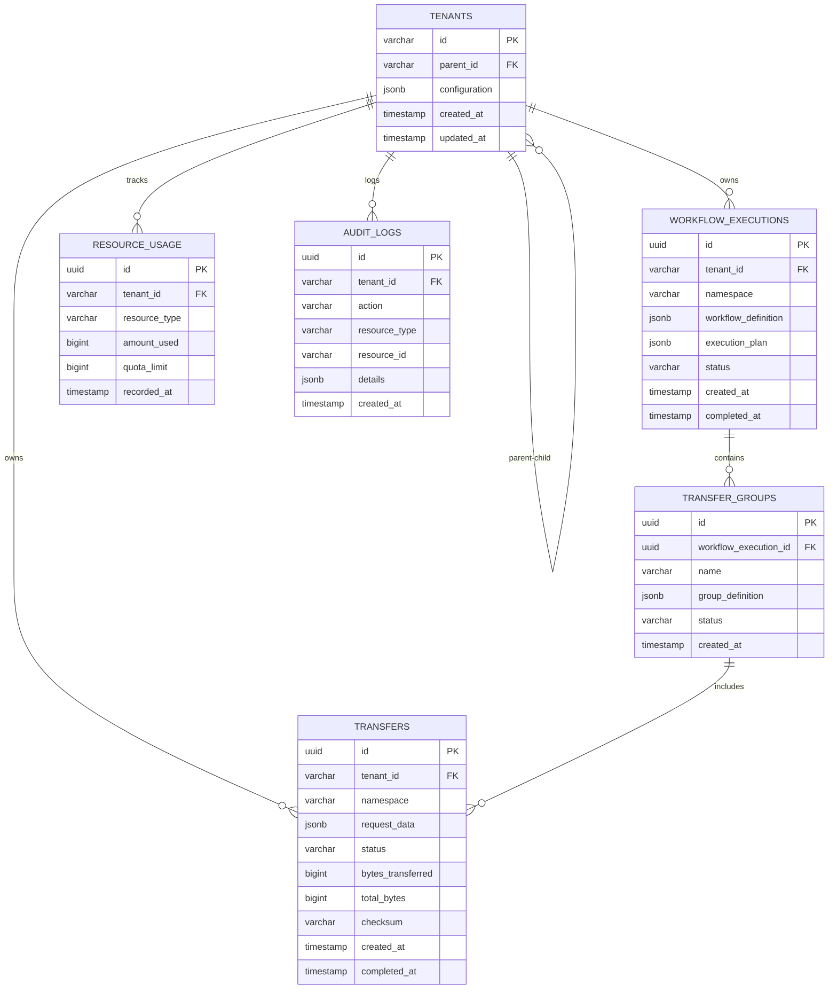

```sql
-- Core tables
CREATE TABLE tenants (
    id VARCHAR(255) PRIMARY KEY,
    parent_id VARCHAR(255),
    configuration JSONB,
    created_at TIMESTAMP DEFAULT NOW(),
    updated_at TIMESTAMP DEFAULT NOW(),
    FOREIGN KEY (parent_id) REFERENCES tenants(id)
);

CREATE TABLE transfers (
    id UUID PRIMARY KEY,
    tenant_id VARCHAR(255) NOT NULL,
    namespace VARCHAR(255),
    request_data JSONB,
    status VARCHAR(50),
    bytes_transferred BIGINT DEFAULT 0,
    total_bytes BIGINT,
    checksum VARCHAR(255),
    created_at TIMESTAMP DEFAULT NOW(),
    completed_at TIMESTAMP,
    FOREIGN KEY (tenant_id) REFERENCES tenants(id)
);

CREATE TABLE workflow_executions (
    id UUID PRIMARY KEY,
    tenant_id VARCHAR(255) NOT NULL,
    namespace VARCHAR(255),
    workflow_definition JSONB,
    execution_plan JSONB,
    status VARCHAR(50),
    created_at TIMESTAMP DEFAULT NOW(),
    completed_at TIMESTAMP,
    FOREIGN KEY (tenant_id) REFERENCES tenants(id)
);

CREATE TABLE transfer_groups (
    id UUID PRIMARY KEY,
    workflow_execution_id UUID NOT NULL,
    name VARCHAR(255),
    group_definition JSONB,
    status VARCHAR(50),
    created_at TIMESTAMP DEFAULT NOW(),
    FOREIGN KEY (workflow_execution_id) REFERENCES workflow_executions(id)
);

CREATE TABLE resource_usage (
    id UUID PRIMARY KEY,
    tenant_id VARCHAR(255) NOT NULL,
    resource_type VARCHAR(100),
    amount_used BIGINT,
    quota_limit BIGINT,
    recorded_at TIMESTAMP DEFAULT NOW(),
    FOREIGN KEY (tenant_id) REFERENCES tenants(id)
);

CREATE TABLE audit_logs (
    id UUID PRIMARY KEY,
    tenant_id VARCHAR(255) NOT NULL,
    action VARCHAR(100),
    resource_type VARCHAR(100),
    resource_id VARCHAR(255),
    details JSONB,
    created_at TIMESTAMP DEFAULT NOW(),
    FOREIGN KEY (tenant_id) REFERENCES tenants(id)
);
```

---

## T. Security Architecture (second)

*Moved verbatim from v3.8, lines 4080–4162. Headings below keep their original levels.*

## Security Architecture

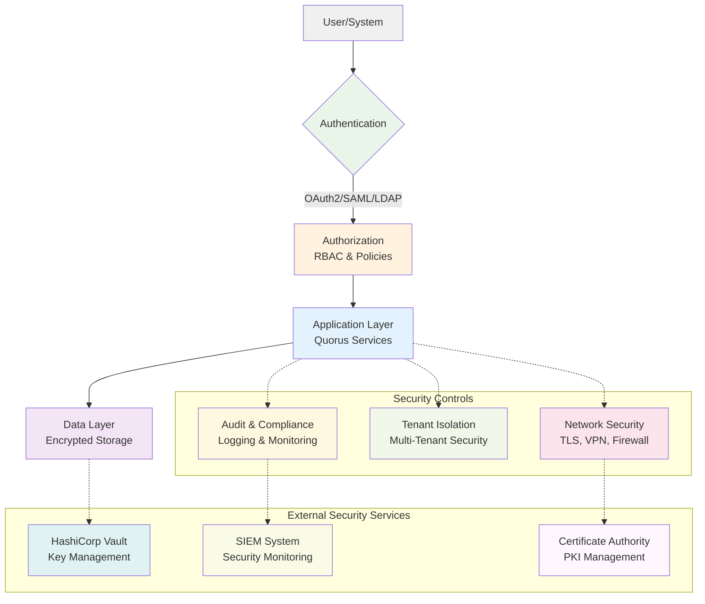

### Security Layer Details

#### Authentication Layer
- **OAuth2 Provider** - Modern token-based authentication
- **SAML Provider** - Enterprise SSO integration
- **LDAP Provider** - Directory service authentication
- **API Key Authentication** - Service-to-service authentication

#### Authorization Layer
- **Role-Based Access Control (RBAC)** - User role management
- **Attribute-Based Access Control (ABAC)** - Fine-grained permissions
- **Policy Engine** - Centralized policy management
- **Permission Manager** - Access control enforcement

#### Data Protection Layer
- **Encryption at Rest** - Database and file encryption
- **Encryption in Transit Requirement** - TLS/mTLS and verified peer identity for all applicable communications; not fully implemented today
- **Key Management Service** - Centralized key management
- **Hardware Security Module** - Secure key storage

#### Network Security Layer
- **TLS/mTLS** - Secure communication protocols
- **VPN Gateway** - Secure network access
- **Firewall Rules** - Network traffic filtering
- **Network Policies** - Kubernetes network isolation

#### Audit & Compliance Layer
- **Audit Logging** - Comprehensive activity logging
- **Compliance Monitor** - Regulatory compliance tracking
- **Data Residency** - Geographic data controls
- **Retention Policies** - Data lifecycle management

#### Tenant Isolation Layer
- **Tenant Isolation** - Multi-tenant data separation
- **Row Level Security** - Database-level isolation
- **Namespace Isolation** - Kubernetes namespace separation
- **Quota Management** - Resource usage controls

---

## U. Internal Network Optimizations

*Moved verbatim from v3.8, lines 4163–4247. Headings below keep their original levels.*

## Internal Network Optimizations

### Corporate Network Characteristics

Quorus is designed to leverage the unique characteristics of internal corporate networks:

#### **High Bandwidth Availability**
- **Gigabit/10Gb Ethernet** standard in corporate environments
- **Dedicated network segments** for data transfer operations
- **Quality of Service (QoS)** policies for prioritizing transfer traffic
- **Network bandwidth reservation** for critical transfer operations

#### **Low Latency Communications**
- **Sub-millisecond latency** within data centers
- **Predictable network paths** through corporate routing
- **Optimized TCP window sizing** for internal network characteristics
- **Connection pooling** for frequently accessed internal services

#### **Trusted Network Environment**
- **Reduced encryption overhead** where appropriate within secure zones
- **Certificate-based authentication** for internal service-to-service communication
- **Network-level security** through corporate firewalls and VLANs
- **Simplified authentication** using corporate directory services

### Internal Protocol Optimizations

#### **SMB/CIFS Protocol Support**
```yaml
source:
  uri: "smb://fileserver.corp.local/shares/data/export.csv"
  protocol: smb
  authentication:
    type: kerberos
    domain: "CORP"
  options:
    smbVersion: "3.1.1"
    directIO: true
    largeBuffers: true
```

#### **NFS Protocol Support**
```yaml
source:
  uri: "nfs://storage.corp.local/exports/data"
  protocol: nfs
  options:
    nfsVersion: "4.1"
    rsize: 1048576      # 1MB read buffer
    wsize: 1048576      # 1MB write buffer
    tcp: true
```

#### **Internal HTTP Optimizations**
```yaml
source:
  uri: "http://internal-api.corp.local/data/export"
  protocol: http
  options:
    keepAlive: true
    connectionPoolSize: 50
    tcpNoDelay: true
    bufferSize: 65536
    compressionEnabled: false  # Skip compression on fast internal networks
```

### Corporate Integration Features

#### **Active Directory Integration**
- **Seamless authentication** using corporate credentials
- **Group-based authorization** aligned with corporate structure
- **Service account management** for automated transfers
- **Audit trail integration** with corporate security systems

#### **Corporate Storage Integration**
- **SAN/NAS connectivity** for high-performance storage access
- **Storage tiering** awareness for optimal placement
- **Backup integration** with corporate backup systems
- **Disaster recovery** coordination with corporate DR plans

#### **Network Monitoring Integration**
- **SNMP integration** with corporate network monitoring
- **Bandwidth utilization** reporting to network operations
- **Network path optimization** based on corporate topology
- **Traffic shaping** coordination with network QoS policies

---

## V. Scalability & Performance; Monitoring & Observability; Error Handling & Recovery

*Moved verbatim from v3.8, lines 4248–4298. Headings below keep their original levels.*

## Scalability & Performance

### Horizontal Scaling
- Stateless service design
- Load balancing across instances
- Distributed execution coordination

### Resource Management
- Configurable concurrency limits
- Resource quotas per tenant
- Dynamic resource allocation

### Performance Optimization
- Efficient buffer management
- Connection pooling
- Asynchronous I/O operations

## Monitoring & Observability

### Metrics
- Transfer performance metrics
- Resource utilization tracking
- Error rates and latency measurements

### Logging
- Structured logging with correlation IDs
- Tenant-scoped log aggregation
- Configurable log levels

### Alerting
- Threshold-based alerting
- Tenant-specific notification channels
- Integration with external monitoring systems

## Error Handling & Recovery

### Retry Mechanisms
- Exponential backoff strategies
- Configurable retry limits
- Circuit breaker patterns

### Failure Recovery
- Graceful degradation
- Automatic failover
- Manual recovery procedures

### Error Reporting
- Structured error messages
- Error categorization and classification
- Integration with monitoring systems

---

## W. File Organization

*Moved verbatim from v3.8, lines 4546–4637. Headings below keep their original levels.*

## File Organization

### Project Structure Overview

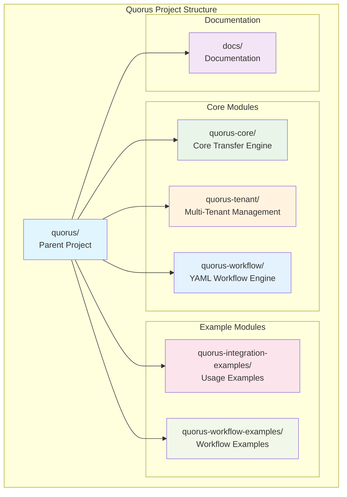

### Module Details

#### Core Modules
```
quorus-core/                    # Core transfer engine
├── src/main/java/dev/mars/quorus/
│   ├── core/                   # Domain models
│   ├── transfer/               # Transfer engine
│   ├── protocol/               # Protocol handlers
│   ├── storage/                # File management
│   └── config/                 # Configuration
└── src/test/java/              # Unit tests

quorus-tenant/                  # Multi-tenant management
├── src/main/java/dev/mars/quorus/tenant/
│   ├── model/                  # Tenant models
│   ├── service/                # Tenant services
│   ├── security/               # Multi-tenant security
│   └── resource/               # Resource management
└── src/test/java/              # Unit tests

quorus-workflow/                # YAML workflow engine
├── src/main/java/dev/mars/quorus/workflow/
│   ├── definition/             # YAML models
│   ├── parser/                 # YAML parsing
│   ├── engine/                 # Workflow engine
│   └── resolver/               # Dependency resolution
└── src/test/java/              # Unit tests
```

#### Example Modules
```
quorus-integration-examples/    # Usage examples
├── src/main/java/dev/mars/quorus/examples/
│   └── BasicTransferExample.java
└── README.md

quorus-workflow-examples/       # Workflow examples
├── basic/                      # Simple examples
├── enterprise/                 # Complex workflows
└── templates/                  # Reusable templates
```

#### Documentation
```
docs/                           # Documentation
├── quorus-comprehensive-system-design.md
├── quorus-implementation-plan.md
└── README.md
```

