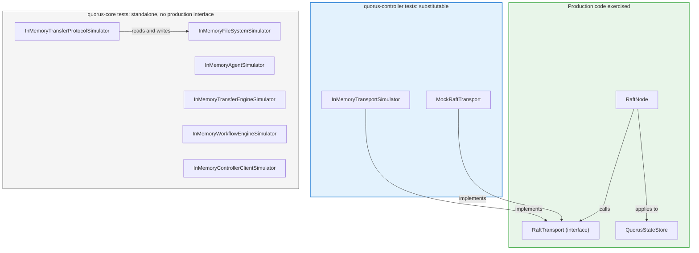
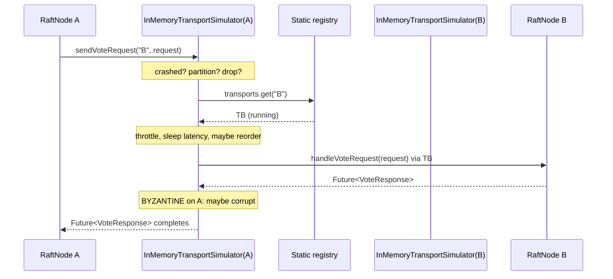

# Quorus In-Memory Simulators Design Document

**Version:** 2.1  
**Date:** 2026-10-03  
**Author:** Mark Ray-Smith — Cityline Ltd  
**License:** Apache 2.0  

> [!IMPORTANT]
> This is a non-normative design record for test tooling. Read it in three parts:
>
> - **Current, and used across the controller test suite: §1.** `InMemoryTransportSimulator`
>   implements the production `RaftTransport` interface. Real `RaftNode` and `QuorusStateStore`
>   instances run over it, and 33 controller test classes construct it. §1 also covers
>   `MockRaftTransport`, the other in-memory `RaftTransport` used by controller tests.
> - **Standalone test doubles: §2–7.** The six simulators in `quorus-core` test sources implement
>   **no** production interface. They define their own request, result and exception types, and
>   nothing outside their own package uses them. They cannot stand in for `TransferProtocol`,
>   `TransferEngine`, `WorkflowEngine` or the agent's `ControllerClient`.
> - **Proposals: anything marked _Proposal_.** This covers the protocol-specific builders, wiring
>   the simulators to the controller state store or to agent services, and the full-stack examples
>   in [Combining Simulators](#combining-simulators). None of it is implemented.
>
> "Production" in this document means the Quorus code a test double replaces. It never describes
> Quorus product readiness, which is defined in
> [QUORUS_ARCHITECTURE_SPECIFICATION.md](../../docs/QUORUS_ARCHITECTURE_SPECIFICATION.md).
> Version 2.0's validation report (Appendix C) and its "REAL PRODUCTION CODE" excerpts were wrong.
> They are kept, with the superseded text of §2–7, in
> [QUORUS_IN_MEMORY_SIMULATORS_ARCHIVED_SECTIONS.md](../archive/QUORUS_IN_MEMORY_SIMULATORS_ARCHIVED_SECTIONS.md).

---

## Table of Contents

1. [Summary](#summary)
2. [Background](#background)
3. [Architecture Overview](#architecture-overview)
4. [Simulator Specifications](#simulator-specifications)
   - [1. InMemoryTransportSimulator](#1-inmemorytransportsimulator)
   - [2. InMemoryTransferProtocolSimulator](#2-inmemorytransferprotocolsimulator)
   - [3. InMemoryAgentSimulator](#3-inmemoryagentsimulator)
   - [4. InMemoryFileSystemSimulator](#4-inmemoryfilesystemsimulator)
   - [5. InMemoryTransferEngineSimulator](#5-inmemorytransferenginesimulator)
   - [6. InMemoryWorkflowEngineSimulator](#6-inmemoryworkflowenginesimulator)
   - [7. InMemoryControllerClientSimulator](#7-inmemorycontrollerclientsimulator)
5. [Combining Simulators](#combining-simulators)
6. [Where the Simulators Fit](#where-the-simulators-fit)
7. [Appendices](#appendix-a-simulator-summary)
   - [Appendix A: Simulator Summary](#appendix-a-simulator-summary)
   - [Appendix B: Chaos Engineering Features Matrix](#appendix-b-chaos-engineering-features-matrix)
   - [Appendix C: Removed](#appendix-c-removed)
   - [Appendix D: Edge Case Test Coverage Analysis](#appendix-d-edge-case-test-coverage-analysis)
8. [Revision History](#revision-history)

---

## Summary

Quorus has two kinds of in-memory test tooling:

| Kind | Classes | Replaces | Used by |
|------|---------|----------|---------|
| Raft transport doubles | `InMemoryTransportSimulator`, `MockRaftTransport` | `GrpcRaftTransport`, through the `RaftTransport` interface | 33 controller test classes construct `InMemoryTransportSimulator`; two construct `MockRaftTransport` |
| Standalone test doubles | Six `InMemory*Simulator` classes in `quorus-core` test sources | Nothing. They imitate the shape of Quorus components but are not substitutable for them | Only their own tests in `dev.mars.quorus.simulator` |

The transport doubles let the controller's Raft and HTTP tests run a real `RaftNode` cluster in one
JVM with no network. The standalone doubles are self-contained models of protocols, agents, a file
system, a transfer engine, a workflow engine and an HTTP client. They are tested, but no Quorus code
or test outside their package uses them.

## Background

### Problem

Testing Quorus end to end requires Docker containers for the FTP, SFTP and HTTP servers, real
network connections and real file systems. That is slow to set up, timing-sensitive, and makes
failure scenarios such as partitions or lost packets hard to produce on demand.

### Test layers in use

| Layer | What runs | Example |
|-------|-----------|---------|
| Unit | Single classes, no simulators | Most module tests |
| In-memory Raft | Real `RaftNode` and `QuorusStateStore` over `InMemoryTransportSimulator`, sometimes with the real HTTP API | [`RaftChaosTest`](../../quorus-controller/src/test/java/dev/mars/quorus/controller/raft/RaftChaosTest.java), [`InfrastructureSmokeTest`](../../quorus-controller/src/test/java/dev/mars/quorus/controller/integration/InfrastructureSmokeTest.java) |
| Standalone simulator | One simulator class, testing itself | [`InMemoryFileSystemSimulatorTest`](../../quorus-core/src/test/java/dev/mars/quorus/simulator/fs/InMemoryFileSystemSimulatorTest.java) |
| Docker | Containers through Testcontainers | [`DockerRaftClusterTest`](../../quorus-controller/src/test/java/dev/mars/quorus/controller/raft/DockerRaftClusterTest.java) |

No speed-up or determinism figures have been measured for these layers. The figures in version 2.0
were not measured and are archived.

## Architecture Overview


```mermaid
flowchart TB
    subgraph Controller["quorus-controller tests: substitutable"]
        ITS["InMemoryTransportSimulator"]
        MRT["MockRaftTransport"]
    end

    subgraph Prod["Production code exercised"]
        RT["RaftTransport (interface)"]
        RN["RaftNode"]
        QSS["QuorusStateStore"]
    end

    subgraph Core["quorus-core tests: standalone, no production interface"]
        ITPS["InMemoryTransferProtocolSimulator"]
        IFSS["InMemoryFileSystemSimulator"]
        IAS["InMemoryAgentSimulator"]
        ITES["InMemoryTransferEngineSimulator"]
        IWES["InMemoryWorkflowEngineSimulator"]
        ICCS["InMemoryControllerClientSimulator"]
    end

    ITS -->|implements| RT
    MRT -->|implements| RT
    RN -->|calls| RT
    RN -->|applies to| QSS
    ITPS -->|reads and writes| IFSS

    style Controller fill:#e3f2fd,stroke:#1976d2,stroke-width:2px
    style Prod fill:#e8f5e9,stroke:#4caf50,stroke-width:2px
    style Core fill:#f5f5f5,stroke:#666,stroke-width:1px
```

The only link between the standalone simulators is that `InMemoryTransferProtocolSimulator` reads
and writes an `InMemoryFileSystemSimulator`. The agent, transfer-engine and workflow simulators do
not use the protocol or file-system simulators.

## Simulator Specifications

---

## 1. InMemoryTransportSimulator

**Status:** Implemented. Used by 33 controller test classes  
**Location:** [`quorus-controller/src/test/java/dev/mars/quorus/controller/raft/InMemoryTransportSimulator.java`](../../quorus-controller/src/test/java/dev/mars/quorus/controller/raft/InMemoryTransportSimulator.java)  
**Interface:** [`RaftTransport`](../../quorus-controller/src/main/java/dev/mars/quorus/controller/raft/RaftTransport.java)

### Overview

`InMemoryTransportSimulator` implements `RaftTransport` by handing requests directly to the target
node's `RaftNode` in the same JVM. `RaftNode` cannot tell it apart from the production
`GrpcRaftTransport`, so tests exercise the real election, replication, snapshot and state-machine
code with no sockets. The simulator adds controls for latency, packet drop, partitions, message
reordering, bandwidth throttling and four failure modes.

### The `RaftTransport` contract

Current interface, without Javadoc:

```java
public interface RaftTransport {
    void start(Consumer<RaftMessage> messageHandler);
    Future<Void> stop();
    Future<VoteResponse> sendVoteRequest(String targetId, VoteRequest request);
    Future<AppendEntriesResponse> sendAppendEntries(String targetId, AppendEntriesRequest request);
    Future<InstallSnapshotResponse> sendInstallSnapshot(String targetId, InstallSnapshotRequest request);
    default void setRaftNode(RaftNode node) {}
}
```

`Future` is `io.vertx.core.Future`. The request and response types are the protobuf classes in
`dev.mars.quorus.controller.raft.grpc`. [`RaftMessage`](../../quorus-controller/src/main/java/dev/mars/quorus/controller/raft/RaftMessage.java)
is a sealed interface with two records, `Vote(VoteRequest)` and `AppendEntries(AppendEntriesRequest)`.
It has no install-snapshot variant.

`RaftNode.start()` calls `transport.setRaftNode(this)`, recovers from storage, and then calls
`transport.start(this::handleMessage)`. `RaftNode.stop()` calls `transport.stop()`.

### What is real and what is simulated

| Real production code | How the simulator reaches it |
|----------------------|------------------------------|
| `RaftNode.start()` / `stop()` | Called by the test |
| Election (`startElection()` and `requestVotes()`, both private) | `requestVotes()` calls `transport.sendVoteRequest(...)` for each peer |
| `RaftNode.handleVoteRequest(VoteRequest)` | Called on the target node by the simulator |
| `RaftNode.handleAppendEntriesRequest(AppendEntriesRequest)` | Called on the target node by the simulator |
| `RaftNode.handleInstallSnapshot(InstallSnapshotRequest)` | Called on the target node by the simulator |
| `RaftNode.submitCommand(RaftCommand)` | Called by the test or by the HTTP API |
| `QuorusStateStore.apply(RaftCommand)` (via `RaftLogApplicator`) | Called by `RaftNode` for committed entries |

Simulated or absent:

- **No serialisation.** Protobuf request and response objects are passed by reference. They are
  never encoded.
- **No gRPC, TLS or peer authorisation.** `GrpcRaftTransport`, `GrpcRaftServer` and
  `RaftPeerAuthorizationInterceptor` are not exercised.
- **Failures are immediate.** A dropped or partitioned message fails its `Future` at once with a
  `RuntimeException`. On a real network the failure would show up as a slow error or a timeout.

### Message path

`sendVoteRequest` and `sendAppendEntries` do the following, in order, on the sending transport's own
fixed pool of 10 threads:

1. **Crashed sender.** If this transport is in `CRASH` mode, the future fails with `Node crashed`.
2. **Partition.** If the sender and target are partitioned, the future fails with `Network partition`.
3. **Packet drop.** With probability `dropRate`, the future fails with `Network packet dropped (Chaos)`.
4. **Lookup.** The target is looked up in the static registry. If it is missing or stopped, the
   future fails with `Target node not available: <id>`.
5. **Throttling.** If throttling is enabled, the request's serialised size is counted against this
   transport's bytes-per-second budget, and the thread sleeps when the budget is exceeded.
6. **Latency.** The thread sleeps for the delay returned by `calculateDelay()` (see
   [Failure modes](#failure-modes)).
7. **Reordering.** With probability `reorderProbability`, delivery is queued with an extra random
   delay. A per-transport scheduler delivers queued messages, checking every 10 ms.
8. **Delivery.** The target's `RaftNode` handler is called. If the target has no `RaftNode`, the
   simulator passes the message to the target's message handler and returns a refusal (vote not
   granted, or `success=false`).
9. **Byzantine corruption.** If *this* transport is in `BYZANTINE` mode, the response it receives
   is corrupted with probability `byzantineCorruptionRate`.

`sendInstallSnapshot` performs steps 1–4, 6 and 8 only. It ignores throttling and reordering, and
never corrupts responses.


```mermaid
sequenceDiagram
    participant A as RaftNode A
    participant TA as InMemoryTransportSimulator(A)
    participant Reg as Static registry
    participant TB as InMemoryTransportSimulator(B)
    participant B as RaftNode B

    A->>TA: sendVoteRequest("B", request)
    Note over TA: crashed? partition? drop?
    TA->>Reg: transports.get("B")
    Reg-->>TA: TB (running)
    Note over TA: throttle, sleep latency, maybe reorder
    TA->>B: handleVoteRequest(request) via TB
    B-->>TA: Future<VoteResponse>
    Note over TA: BYZANTINE on A: maybe corrupt
    TA-->>A: Future<VoteResponse> completes
```

### Static state

The registry of transports and the set of partitions are **static** and shared by every instance in
the JVM:

```java
private static final Map<String, InMemoryTransportSimulator> transports = new ConcurrentHashMap<>();
private static final Set<Set<String>> networkPartitions = ConcurrentHashMap.newKeySet();
```

`start()` registers the transport under its node ID, and `stop()` removes it. Because the state is
shared, tests must call `InMemoryTransportSimulator.clearAllTransports()` before and after each
test, and test classes that use it must not run concurrently in one JVM. The controller's
[`junit-platform.properties`](../../quorus-controller/src/test/resources/junit-platform.properties)
runs classes and methods sequentially by default. Only the Docker test classes opt in to concurrency.

### Usage

#### Three-node cluster

Adapted from `RaftChaosTest` and `RaftFailureTest`. `vertx` comes from `VertxExtension`.

```java
InMemoryTransportSimulator.clearAllTransports();

Set<String> clusterNodes = Set.of("node1", "node2", "node3");
List<RaftNode> cluster = new ArrayList<>();
for (String nodeId : clusterNodes) {
    cluster.add(RaftNode.builder()
            .vertx(vertx)
            .nodeId(nodeId)
            .clusterNodes(clusterNodes)
            .transport(new InMemoryTransportSimulator(nodeId))
            .stateMachine(new QuorusStateStore())
            .mode(RaftNodeMode.volatileMode())
            .electionTimeout(1000)
            .heartbeatInterval(200)
            .build());
}
cluster.forEach(RaftNode::start);          // start() returns Future<Void>

await().atMost(Duration.ofSeconds(10))
       .until(() -> cluster.stream().filter(RaftNode::isLeader).count() == 1);

// Tear down
cluster.forEach(RaftNode::stop);           // stop() returns Future<Void>
InMemoryTransportSimulator.clearAllTransports();
```

`RaftNode` has a private constructor and is built only through `RaftNode.builder()`. `vertx`,
`nodeId`, `clusterNodes`, `transport`, `stateMachine` and `mode` are required, and `build()` throws
`IllegalStateException` if any is missing. `electionTimeout` defaults to 5000 ms and
`heartbeatInterval` to 1000 ms. Tests use shorter values, such as 500/100, 600/120 and 1000/200.

#### Single-node cluster

From [`InfrastructureSmokeTest`](../../quorus-controller/src/test/java/dev/mars/quorus/controller/integration/InfrastructureSmokeTest.java),
which then starts the HTTP API on top of the node:

```java
RaftTransport transport = new InMemoryTransportSimulator("smoke-test-node");
raftNode = RaftNode.builder().vertx(vertx).nodeId("smoke-test-node").clusterNodes(clusterNodes)
        .transport(transport).stateMachine(stateMachine).mode(RaftNodeMode.volatileMode())
        .electionTimeout(500).heartbeatInterval(100).build();
```

A single-node cluster elects itself: `requestVotes()` calls `becomeLeader()` directly when the
cluster has one member.

### Chaos controls

#### Latency and packet drop

```java
transport.setChaosConfig(100, 200, 0.0);   // 100–200 ms latency, no drops
transport.setChaosConfig(5, 15, 0.25);     // 5–15 ms latency, 25% drop
```

| Parameter | Default | Meaning |
|-----------|---------|---------|
| `minLatencyMs` | 5 | Minimum delay per message sent by this transport |
| `maxLatencyMs` | 15 | Maximum delay per message sent by this transport |
| `dropRate` | 0.0 | Probability that a message from this transport fails immediately |

All settings apply to messages *sent by* the transport they are set on.

#### Network partitions

```java
InMemoryTransportSimulator.createPartition(Set.of("node1"), Set.of("node2", "node3"));
// ...
InMemoryTransportSimulator.healPartitions();
```

`createPartition(a, b)` adds `a` and `b` as two groups to the static partition set. Two nodes can
communicate only if **every** group contains both of them or neither of them. As a result:

- Partitions are symmetric. They apply to all three RPCs and take effect on the next send.
- Calls accumulate. Each `createPartition` adds more groups, and only `healPartitions()` (or
  `clearAllTransports()`) removes them.
- A node named in neither group can still reach other unnamed nodes, but cannot reach any node in
  either group.

#### Message reordering

```java
transport.setReorderingConfig(true, 0.3, 50);   // 30% of messages delayed by up to 50 ms more
```

| Parameter | Meaning |
|-----------|---------|
| `enabled` | Whether reordering is enabled |
| `reorderProbability` | Probability that a vote or append-entries message is queued for later delivery |
| `maxReorderDelayMs` | Upper bound (exclusive) on the extra delay. Must be greater than 0 when reordering is enabled |

Delivery order is not guaranteed even with reordering disabled. Each send is a separate task on a
10-thread pool with its own random latency, so two messages from A to B can arrive in either order.

#### Bandwidth throttling

```java
transport.setThrottlingConfig(true, 1000);   // about 1 KB/s for this sender
```

The budget is per sending transport, shared across all its targets, and reset every second.
Install-snapshot messages are not throttled.

#### Failure modes

```java
transport.setFailureMode(InMemoryTransportSimulator.FailureMode.BYZANTINE, 0.5);
transport.recoverFromCrash();
```

| Mode | Effect on the transport it is set on |
|------|--------------------------------------|
| `NONE` | Normal operation |
| `CRASH` | Every message this node *sends* fails with `Node crashed`. Messages to this node are still delivered, and its `RaftNode` still answers them. To model a crashed process, stop the `RaftNode`, as `RaftFailureTest` does. `recoverFromCrash()`, or setting another mode, clears it |
| `BYZANTINE` | Responses this node *receives* to its vote and append-entries requests are corrupted with the given probability. The corruption adds 0–9 to the term, flips `voteGranted` or `success`, and sets append-entries `matchIndex` to a random 0–99 |
| `SLOW` | Latency × 10 |
| `FLAKY` | 50% chance of latency × 5 per message. Messages are never failed |

### API reference

| Member | Description |
|--------|-------------|
| `InMemoryTransportSimulator(String nodeId)` | Creates the transport and starts its reorder scheduler. Registration happens in `start()` |
| `start(Consumer<RaftMessage>)` | Registers the transport in the static registry and marks it running |
| `Future<Void> stop()` | Unregisters the transport, stops the reorder scheduler, and returns a succeeded future |
| `sendVoteRequest`, `sendAppendEntries`, `sendInstallSnapshot` | See [Message path](#message-path) |
| `setRaftNode(RaftNode)` | Called by `RaftNode.start()` |
| `isRunning()` | Whether `start()` has been called and `stop()` has not |
| `setChaosConfig(int, int, double)` | Latency range and drop rate |
| `setReorderingConfig(boolean, double, int)` | Reordering |
| `setThrottlingConfig(boolean, long)` | Bandwidth limit |
| `setFailureMode(FailureMode, double)` | Failure mode and Byzantine corruption rate |
| `recoverFromCrash()` | Leaves `CRASH` mode |
| `static createPartition(Set<String>, Set<String>)` | Adds a partition |
| `static healPartitions()` | Removes all partitions |
| `static getAllTransports()` | Copy of the registry |
| `static clearAllTransports()` | Empties the registry and heals partitions. It does not stop the transports |

### Tests that use it

All 33 users are in `quorus-controller` test sources. The tests below are written around the
simulator itself:

| Test class | Tests | What it covers |
|------------|------:|----------------|
| [`RaftChaosTest`](../../quorus-controller/src/test/java/dev/mars/quorus/controller/raft/RaftChaosTest.java) | 2 | Five-node cluster replicating under 25% packet loss, and under 100–200 ms latency |
| [`RaftFailureTest`](../../quorus-controller/src/test/java/dev/mars/quorus/controller/raft/RaftFailureTest.java) | 10 | Command submission to a follower, double start and stop, leader failure and recovery, loss of one node (by stopping it, not by `createPartition`), invalid configuration, transport start failure, state-machine failures, concurrent elections, message and node-ID validation |
| [`EnhancedInMemoryTransportTest`](../../quorus-controller/src/test/java/dev/mars/quorus/controller/raft/EnhancedInMemoryTransportTest.java) | 8 | Each chaos control: partition, reordering, throttling, `CRASH`, `BYZANTINE`, `SLOW`, `FLAKY`, and a combined case |
| [`InstallSnapshotTest`](../../quorus-controller/src/test/java/dev/mars/quorus/controller/raft/InstallSnapshotTest.java) | 7 | Snapshots sent to a follower left behind by `createPartition`, state restored from a snapshot, stale-term rejection, chunk reassembly and persistence |
| [`InfrastructureSmokeTest`](../../quorus-controller/src/test/java/dev/mars/quorus/controller/integration/InfrastructureSmokeTest.java) | 14 | Single-node cluster with the HTTP API: health, Raft status, commands, metrics |

The other users are mostly HTTP API, job-assignment, lifecycle and durability tests in the
controller's `http`, `integration`, `lifecycle`, `raft` and `service` test packages. They use the
simulator to get a leader without a network.

### MockRaftTransport

**Location:** [`quorus-controller/src/test/java/dev/mars/quorus/controller/raft/MockRaftTransport.java`](../../quorus-controller/src/test/java/dev/mars/quorus/controller/raft/MockRaftTransport.java)  
**Interface:** `RaftTransport`  
**Used by:** `MetadataPersistenceTest`, `RaftLogClusterIntegrationTest`

A simpler in-memory transport with no static state:

- The test builds a `Map<String, MockRaftTransport>` and passes it to each transport with
  `setTransports(map)`.
- It has fixed random delays (10–30 ms for votes, 5–15 ms for append entries and install
  snapshot) on a 10-thread pool.
- It has no partition, drop, reordering, throttling or failure-mode controls. A stopped or missing
  target fails the future.
- If the target has no `RaftNode`, it **grants a vote 90% of the time and reports append success
  95% of the time, at random**. A correctly wired test never reaches this path, because
  `RaftNode.start()` sets the node. If the path is reached, results are random rather than failing,
  so prefer `InMemoryTransportSimulator` for new tests.

### `RaftTransport` implementations

| Implementation | Where | Network | Chaos controls | Used for |
|----------------|-------|---------|----------------|----------|
| [`GrpcRaftTransport`](../../quorus-controller/src/main/java/dev/mars/quorus/controller/raft/GrpcRaftTransport.java) | main | gRPC over Netty, optional TLS | None | Production |
| `InMemoryTransportSimulator` | test | None | Partition, drop, latency, reordering, throttling, failure modes | 33 controller test classes |
| `MockRaftTransport` | test | None | None (fixed random delay) | Two controller test classes |
| `RaftNodeIntegrationTest.TestRaftTransport` | test | None | None. Every RPC succeeds at once | `RaftNodeIntegrationTest` |

There is no HTTP Raft transport.

### Limits and known issues

- **Docker tests are still needed** for process start and stop, port binding, health probes,
  serialisation, gRPC, TLS and mTLS peer authorisation, and real latency.
- **Threads are not released.** `stop()` shuts down the reorder scheduler but not the per-instance
  10-thread send pool, so each instance leaves its pool threads alive until the JVM exits.

### Practices

1. Call `InMemoryTransportSimulator.clearAllTransports()` in `@BeforeEach` and `@AfterEach`, and
   stop every `RaftNode` in `@AfterEach`.
2. Create fresh transports and nodes for each test, because the registry is keyed by node ID.
3. After chaos, assert that there is exactly one leader and that committed state agrees.
4. Use timeouts suited to in-memory runs. `RaftChaosTest` waits up to 10 s, or 20 s for
   high-latency cases. `EnhancedInMemoryTransportTest` waits up to 10 s.

---

## 2. InMemoryTransferProtocolSimulator

**Status:** Implemented as a standalone test double  
**Location:** [`quorus-core/src/test/java/dev/mars/quorus/simulator/protocol/InMemoryTransferProtocolSimulator.java`](../../quorus-core/src/test/java/dev/mars/quorus/simulator/protocol/InMemoryTransferProtocolSimulator.java)  
**Production interface:** None  
**Tests:** `InMemoryTransferProtocolSimulatorTest` (40), `InMemoryFtpsProtocolSimulatorTest` (33), and the protocol group in `InMemorySimulatorTest`

### Purpose

Models a file transfer over FTP, FTPS, SFTP, HTTP or SMB as reads and writes on an
`InMemoryFileSystemSimulator`, with latency, simulated bandwidth, progress callbacks, pause, resume
and cancel, and injected failures.

### Relationship to `TransferProtocol`

The simulator uses the method names of the production
[`TransferProtocol`](../../quorus-core/src/main/java/dev/mars/quorus/protocol/TransferProtocol.java)
(`getProtocolName`, `canHandle`, `transfer`, `supportsResume`, `supportsPause`, `getMaxFileSize`),
but it does **not** implement that interface:

- Its `TransferRequest`, `TransferContext`, `TransferProgress`, `TransferResult` and
  `TransferException` are nested types of the simulator, not the `dev.mars.quorus` types.
- It adds `transferReactive(...)`, which returns a `java.util.concurrent.CompletableFuture`.
  `transfer(...)` blocks on that future.

The production `TransferProtocol.transfer` is a blocking call with no reactive variant and no
Vert.x types.

### Behaviour

- **Factories.** `ftp(fs)`, `ftps(fs)`, `sftp(fs)`, `http(fs)` and `smb(fs)` return a simulator with
  resume and pause enabled. The constructor `new InMemoryTransferProtocolSimulator(name, fs)` gives
  the same result.
- **Default latency per transfer.** FTP 50–200 ms, FTPS 80–300 ms, SFTP 30–150 ms, HTTP 10–100 ms,
  SMB 5–50 ms. `setLatencyConfig(min, max)` overrides it.
- **`canHandle`.** True when the source URI scheme matches the protocol name. In addition, the HTTP
  simulator accepts `https`, FTPS accepts `ftp`, and FTP accepts `ftps`.
- **Direction.** Taken from the URI schemes. A remote source with a `file:` destination is a
  download, and a `file:` source with a remote destination is an upload. Both sides read and write
  the same virtual file system by URI path. Remote-to-remote transfers throw `TransferException`.
- **Speed.** By default the file moves in one chunk with no delay. `setSimulatedBytesPerSecond(n)`
  moves it in chunks of about `n × progressUpdateIntervalMs / 1000` bytes, with a progress callback
  and a sleep for each chunk.
- **Resume.** Only explicit: `TransferRequest.builder().resumeFromBytes(n)` starts at byte `n` when
  resume is supported, and the result reports `resumedFromBytes() == n`. Nothing is checkpointed
  automatically between attempts.

### Failure modes

| `ProtocolFailureMode` | Effect |
|-----------------------|--------|
| `NONE` | Normal operation |
| `AUTH_FAILURE`, `CONNECTION_TIMEOUT`, `CONNECTION_REFUSED`, `FILE_NOT_FOUND`, `PERMISSION_DENIED`, `DISK_FULL` | `TransferException` before any bytes move, with messages such as `Authentication failed for <host>` |
| `TRANSFER_INTERRUPTED` | Only together with `setFailureAtPercent(p)`: `TransferException("Transfer interrupted at N%")` once progress reaches `p`. Nothing is written to the destination |
| `CHECKSUM_MISMATCH` | `TransferException` after progress completes, before the destination is written |
| `SLOW_TRANSFER` | Uses 1 KB chunks when a bandwidth is set. **It does not slow the transfer**: the total sleep is still size ÷ bandwidth, and in the default unlimited mode it has no effect |
| `FLAKY_CONNECTION` | 10% chance per chunk of a 0.5–1.5 s stall. The transfer is never failed |

`setFailureRate(r)` independently fails a transfer before it starts with probability `r`.

### API reference

| Method | Description |
|--------|-------------|
| `transfer(TransferRequest, TransferContext)` | Blocking transfer. Throws `TransferException` |
| `transferReactive(TransferRequest, TransferContext)` | The same, as a `CompletableFuture` |
| `pauseTransfer(id)`, `resumeTransfer(id)`, `cancelTransfer(id)` | Control an active transfer. The ID is the `transferId` reported in `TransferProgress` |
| `setLatencyConfig(long, long)` | Connection latency range |
| `setSimulatedBytesPerSecond(long)` | Simulated bandwidth |
| `setProgressUpdateIntervalMs(int)` | Used to size chunks when a bandwidth is set |
| `setFailureMode(ProtocolFailureMode)` | Failure mode |
| `setFailureRate(double)` | Random pre-transfer failure probability |
| `setFailureAtPercent(int)` | Trigger point for `TRANSFER_INTERRUPTED` |
| `setMaxFileSize(long)`, `setSupportsResume(boolean)`, `setSupportsPause(boolean)` | Capabilities |
| `reset()` | Clears the failure mode, failure rate and failure percentage. Latency and bandwidth are unchanged |
| `getTotalTransfers()`, `getSuccessfulTransfers()`, `getFailedTransfers()`, `getTotalBytesTransferred()`, `resetStatistics()` | Statistics |
| `shutdown()` | Stops the simulator's scheduler |

### Example

Adapted from `InMemoryTransferProtocolSimulatorTest`:

```java
InMemoryFileSystemSimulator fs = new InMemoryFileSystemSimulator();
fs.createFile("/source/test.txt", "Hello, World!".getBytes());
InMemoryTransferProtocolSimulator sftp = InMemoryTransferProtocolSimulator.sftp(fs);

var request = InMemoryTransferProtocolSimulator.TransferRequest.builder()
        .sourceUri(URI.create("sftp://host/source/test.txt"))
        .destinationPath(Path.of("/destination/test.txt"))
        .build();

var result = sftp.transfer(request, new InMemoryTransferProtocolSimulator.TransferContext());
assertThat(result.isSuccessful()).isTrue();
assertThat(result.bytesTransferred()).isEqualTo(13);
assertThat(fs.exists("/destination/test.txt")).isTrue();

sftp.setFailureMode(InMemoryTransferProtocolSimulator.ProtocolFailureMode.AUTH_FAILURE);
assertThatThrownBy(() -> sftp.transfer(request, new InMemoryTransferProtocolSimulator.TransferContext()))
        .isInstanceOf(InMemoryTransferProtocolSimulator.TransferException.class)
        .hasMessageContaining("Authentication failed");

sftp.shutdown();
```

### _Proposal_: protocol-specific builders

Not implemented. The factories return a configured simulator directly, with no builder and no
`with...` methods.

```java
// PROPOSAL — does not compile against current code
InMemoryTransferProtocolSimulator ftpProtocol =
    InMemoryTransferProtocolSimulator.ftp(fileSystem)
        .withActiveMode(true)
        .withBinaryMode(true)
        .build();

InMemoryTransferProtocolSimulator sftpProtocol =
    InMemoryTransferProtocolSimulator.sftp(fileSystem)
        .withKeyAuthentication(true)
        .withCompression(true)
        .build();

InMemoryTransferProtocolSimulator httpProtocol =
    InMemoryTransferProtocolSimulator.http(fileSystem)
        .withRangeRequests(true)
        .withCompression(true)
        .build();
```

---

## 3. InMemoryAgentSimulator

**Status:** Implemented as a standalone test double  
**Location:** [`quorus-core/src/test/java/dev/mars/quorus/simulator/agent/InMemoryAgentSimulator.java`](../../quorus-core/src/test/java/dev/mars/quorus/simulator/agent/InMemoryAgentSimulator.java)  
**Production interface:** None  
**Tests:** `InMemoryAgentSimulatorTest` (57), and the agent group in `InMemorySimulatorTest`

### Purpose

Models an agent's lifecycle (registration, heartbeats, job polling, job execution and shutdown)
against a controller that the test supplies.

### Relationship to Quorus

The simulator talks to its own nested interface, not to the controller or the real agent:

```java
public interface ControllerConnection {
    void registerAgent(AgentRegistration registration);
    void unregisterAgent(String agentId);
    void sendHeartbeat(HeartbeatInfo heartbeat);
    List<JobAssignment> pollPendingJobs(String agentId);
    void reportJobStatus(JobStatusUpdate update);
}
```

The test implements `ControllerConnection`, usually as a stub or recorder. `AgentCapabilities`,
`AgentRegistration`, `HeartbeatInfo`, `JobAssignment` and `JobStatusUpdate` are all nested types.
No adapter connects the simulator to `QuorusStateStore`, the controller's HTTP API or
`quorus-agent`. Job execution is timed only: no bytes move, and no protocol or file-system
simulator is involved.

### Behaviour

- **`start()`.** Fails with `AgentException` if the agent is already running or has no connection.
  Otherwise it calls `registerAgent`, moves the agent to `ACTIVE`, and schedules heartbeats (every
  5000 ms by default) and job polling (every 1000 ms by default).
- **Jobs.** Jobs arrive from `pollPendingJobs` or a direct `assignJob(...)`. An assignment is
  rejected, with an event, when the agent is not `ACTIVE` or `BUSY`, when it is at
  `maxConcurrentTransfers` (the agent becomes `BUSY`), or when the acceptance filter refuses it.
- **Execution.** A job runs in 10 progress steps spread over `jobExecutionDelayMs` (1000 ms by
  default). Each step is reported through `reportJobStatus`.
- **`stop()`.** Moves to `DRAINING`, waits up to 30 s for active jobs, unregisters, and moves to
  `STOPPED`.
- **`crash()`.** Fails all active jobs with `Agent crashed` and moves to `CRASHED`.
  `recover()` restarts the agent.
- **Unused setting.** `setProgressUpdateIntervalMs` is stored but has no effect.

`AgentState`: `STOPPED`, `REGISTERING`, `ACTIVE`, `BUSY`, `DRAINING`, `CRASHED`, `PARTITIONED`.

### Failure modes

| `AgentFailureMode` | Effect |
|--------------------|--------|
| `NONE` | Normal operation |
| `REGISTRATION_FAILURE` | `start()` throws `AgentException` |
| `HEARTBEAT_TIMEOUT` | No heartbeats are sent. If set while the agent is running, the heartbeat task is cancelled |
| `JOB_REJECTION` | Every assignment is rejected |
| `JOB_FAILURE` | Every job fails after its progress steps |
| `SLOW_EXECUTION` | Job duration × 10 |
| `CRASH_DURING_JOB` | The agent calls `crash()` at the sixth of the ten progress steps |
| `MEMORY_EXHAUSTED` | Jobs fail at the fourth step with `Out of memory (simulated)`, and heartbeats report memory use of 0.95 |
| `NETWORK_PARTITION` | Cancels polling and heartbeats, and sets the state to `PARTITIONED`. If set before `start()`, `start()` then fails with `Agent is already running`, because the agent is no longer `STOPPED` |

`setJobFailureRate(r)` fails jobs at random with probability `r`.

### API reference

| Method | Description |
|--------|-------------|
| `InMemoryAgentSimulator(String agentId)` | Constructor |
| `withHostname`, `withRegion`, `withDatacenter`, `withCapabilities`, `withTag`, `withEventCallback`, `withJobAcceptanceFilter` | Fluent configuration |
| `connectToController(ControllerConnection)` | Sets the controller connection |
| `start()`, `stop()`, `crash()`, `recover()`, `shutdown()` | Lifecycle |
| `assignJob(JobAssignment)` | Pushes a job directly |
| `setHeartbeatIntervalMs`, `setPollingIntervalMs`, `setJobExecutionDelayMs`, `setFailureMode`, `setJobFailureRate`, `reset()` | Behaviour and chaos |
| `getState()`, `getActiveJobs()`, `getActiveJobCount()`, `getCompletedJobs()`, `getLastHeartbeat()` and the `getTotal...` counters | Inspection |

### _Proposal_: connecting to the controller

Not implemented: a `ControllerConnection` adapter over `QuorusStateStore`, so that agent
simulators register, heartbeat and receive assignments through the real controller state machine.
Without it, the agent simulator cannot test controller behaviour such as agent selection or
reassigning a crashed agent's jobs. Those behaviours belong to the controller, not to this
simulator.

---

## 4. InMemoryFileSystemSimulator

**Status:** Implemented as a standalone test double  
**Location:** [`quorus-core/src/test/java/dev/mars/quorus/simulator/fs/InMemoryFileSystemSimulator.java`](../../quorus-core/src/test/java/dev/mars/quorus/simulator/fs/InMemoryFileSystemSimulator.java)  
**Production interface:** None (not a `java.nio.file.FileSystem`)  
**Tests:** `InMemoryFileSystemSimulatorTest` (89), and the file-system group in `InMemorySimulatorTest`

### Purpose

A virtual file system of byte arrays, for the protocol simulator and for tests that must not touch
the disk.

### Behaviour

- **Paths.** Backslashes become `/`, a leading `/` is added, and a trailing `/` is removed. A
  `null` or empty path means the root. `..` is **not** resolved or rejected.
- **Directories.** Creating a file creates its parent directories. The root cannot be deleted, and
  a non-empty directory cannot be deleted.
- **Space.** `setAvailableSpace(n)` limits capacity. Writes that do not fit fail with
  `IOException("Disk full: ...")`, and deleting files frees space.
- **Locking.** `lockFile` gives exclusive locks: reading, writing, opening a stream on or deleting a
  locked file fails with `File locked`, and locking an already locked file fails.
- **Performance.** Fixed per-operation delays (`setReadDelayMs`, `setWriteDelayMs`) and bandwidth
  limits (`setReadBytesPerSecond`, `setWriteBytesPerSecond`).

### Failure modes

`FileSystemFailureMode` can be set for the whole file system (`setFailureMode`) or for one path
(`setFileFailureMode`):

| Mode | Effect |
|------|--------|
| `NONE` | Normal operation |
| `DISK_FULL` | `IOException("Disk full")` |
| `READ_ONLY` | Writes fail with `File system is read-only` |
| `PERMISSION_DENIED` | `IOException("Permission denied: <path>")` |
| `IO_ERROR` | `IOException("I/O error on: <path>")` |
| `FILE_LOCKED` | `IOException("File locked: <path>")` |
| `CORRUPTED_DATA` | Reads return altered bytes of the same length |
| `RANDOM_FAILURE` | Operations fail about half the time |

`setFailureRate(r)` also fails operations at random with probability `r`. `resetChaos()` clears all
of these settings.

### API reference

| Method | Description |
|--------|-------------|
| `createFile`, `readFile`, `writeFile`, `appendFile`, `deleteFile` | File operations, all throwing `IOException` |
| `openInputStream`, `openOutputStream` | Streams over a virtual file |
| `exists`, `isFile`, `isDirectory` | Queries |
| `createDirectory`, `createDirectories`, `listDirectory`, `deleteDirectory` | Directory operations |
| `getMetadata(path)` | `FileMetadata(path, size, created, modified, lastAccessed, permissions, owner, isDirectory)` |
| `setPermissions(path, Set<FilePermission>)` | File permissions |
| `lockFile`, `unlockFile`, `isLocked` | Locking |
| `setAvailableSpace`, `getAvailableSpace`, `getTotalSpace`, `getUsedSpace` | Space |
| `setReadDelayMs`, `setWriteDelayMs`, `setReadBytesPerSecond`, `setWriteBytesPerSecond` | Performance |
| `setFailureMode`, `setFileFailureMode`, `clearFileFailureMode`, `setFailureRate`, `resetChaos` | Chaos |
| `getReadOperations`, `getWriteOperations`, `getBytesRead`, `getBytesWritten`, `getFileCount`, `getDirectoryCount`, `resetStatistics` | Statistics |
| `clear`, `getAllFilePaths`, `getAllDirectoryPaths` | Utilities |

### Example

```java
InMemoryFileSystemSimulator fs = new InMemoryFileSystemSimulator();
fs.createFile("/data/test.txt", "Hello, World!".getBytes());
assertThat(fs.readFile("/data/test.txt")).isEqualTo("Hello, World!".getBytes());

fs.setAvailableSpace(1_000);
assertThatThrownBy(() -> fs.writeFile("/big.bin", new byte[2_000]))
        .isInstanceOf(IOException.class)
        .hasMessageContaining("Disk full");

fs.lockFile("/data/test.txt");
assertThatThrownBy(() -> fs.openOutputStream("/data/test.txt"))
        .hasMessageContaining("File locked");
```

---

## 5. InMemoryTransferEngineSimulator

**Status:** Implemented as a standalone test double  
**Location:** [`quorus-core/src/test/java/dev/mars/quorus/simulator/transfer/InMemoryTransferEngineSimulator.java`](../../quorus-core/src/test/java/dev/mars/quorus/simulator/transfer/InMemoryTransferEngineSimulator.java)  
**Production interface:** None  
**Tests:** `InMemoryTransferEngineSimulatorTest` (55), and the engine group in `InMemorySimulatorTest`

### Purpose

Models a transfer engine's job lifecycle (queueing, concurrency, progress, pause, resume, cancel)
and its statistics, with time standing in for transfers. No bytes move, and no protocol is used.

### Relationship to `TransferEngine`

The production
[`TransferEngine`](../../quorus-core/src/main/java/dev/mars/quorus/transfer/TransferEngine.java)
is blocking. `TransferResult transfer(TransferRequest) throws TransferException` runs on the
caller's thread, and `shutdown(Duration)` waits for completion. The simulator does **not**
implement it:

- It offers `submitTransfer(TransferRequest)`, which returns a `CompletableFuture`.
- It has `shutdown(long timeoutSeconds)`.
- Its `TransferRequest` (string URIs), `TransferJob`, `TransferResult`, `TransferStatus` and
  `HealthCheck` are nested types.

### Behaviour

- **Submission.** A transfer starts at once if a concurrency permit is free. Otherwise it is
  `QUEUED`, and a background loop starts it when a permit is released.
- **Progress.** Ten progress updates over `defaultTransferDurationMs` (1000 ms by default), using
  `expectedSizeBytes` or `defaultTransferSizeBytes` (10 MB by default) as the size.
- **Completion.** Each transfer completes `defaultTransferDurationMs` after it starts.
- **Pause and resume.** These change the status between `IN_PROGRESS` and `PAUSED`, and progress
  updates stop while a transfer is paused. Completion is not rescheduled, so a paused transfer
  still completes at its original time.
- **Cancel.** Fails the future with `Transfer cancelled`. It returns false for a terminal transfer.
- **Concurrency limit (defect).** The limit is fixed at **10**. The semaphore is created with 10
  permits in the constructor. `setMaxConcurrentTransfers(n)` changes only the value reported by
  `getHealthCheck()`, not the number of transfers that may run.

`TransferStatus`: `PENDING`, `QUEUED`, `IN_PROGRESS`, `PAUSED`, `COMPLETED`, `FAILED`, `CANCELLED`.

### Failure modes

| `TransferEngineFailureMode` | Effect |
|-----------------------------|--------|
| `NONE` | Normal operation |
| `QUEUE_FULL`, `ENGINE_OVERLOADED`, `SHUTTING_DOWN` | `submitTransfer` returns a failed future at once |
| `ALL_TRANSFERS_FAIL` | Every transfer fails on completion |
| `RANDOM_FAILURES` | Transfers fail with the probability set by `setTransferFailureRate` |
| `SLOW_PROCESSING` | Duration × 10 |

### API reference

| Method | Description |
|--------|-------------|
| `submitTransfer(TransferRequest)` | Returns `CompletableFuture<TransferResult>` |
| `getTransferJob(id)`, `getAllTransferJobs()`, `getTransfersByStatus(status)` | Inspection |
| `cancelTransfer`, `pauseTransfer`, `resumeTransfer` | Control |
| `getActiveTransferCount()` | Transfers started and not yet finished, including paused ones |
| `setDefaultTransferDurationMs`, `setDefaultTransferSizeBytes`, `setFailureMode`, `setTransferFailureRate`, `setEventCallback`, `reset()` | Behaviour and chaos |
| `setMaxConcurrentTransfers(int)` | See the concurrency defect above |
| `getHealthCheck()`, `getProtocolMetrics(protocol)`, `getAllProtocolMetrics()` and the `getTotal...` counters | Metrics |
| `shutdown(long)`, `shutdownNow()`, `clear()` | Shutdown |

### Example

```java
InMemoryTransferEngineSimulator engine = new InMemoryTransferEngineSimulator()
        .setDefaultTransferDurationMs(500);

var request = InMemoryTransferEngineSimulator.TransferRequest.builder()
        .jobId("job-1")
        .sourceUri("sftp://host/file.txt")
        .destinationPath("/dest/file.txt")
        .build();

CompletableFuture<InMemoryTransferEngineSimulator.TransferResult> future = engine.submitTransfer(request);
assertThat(engine.getTransferJob("job-1").status())
        .isEqualTo(InMemoryTransferEngineSimulator.TransferStatus.IN_PROGRESS);
assertThat(future.get(5, TimeUnit.SECONDS).successful()).isTrue();
```

---

## 6. InMemoryWorkflowEngineSimulator

**Status:** Implemented as a standalone test double  
**Location:** [`quorus-core/src/test/java/dev/mars/quorus/simulator/workflow/InMemoryWorkflowEngineSimulator.java`](../../quorus-core/src/test/java/dev/mars/quorus/simulator/workflow/InMemoryWorkflowEngineSimulator.java)  
**Production interface:** None  
**Tests:** `InMemoryWorkflowEngineSimulatorTest` (35), and the workflow group in `InMemorySimulatorTest`

### Purpose

Models workflow execution as a sequence of timed steps, with validation, dry runs, virtual runs,
step callbacks and injected failures. No transfers run.

### Relationship to `WorkflowEngine`

The production
[`WorkflowEngine`](../../quorus-workflow/src/main/java/dev/mars/quorus/workflow/WorkflowEngine.java)
is blocking. Its `execute`, `dryRun` and `virtualRun` methods return `WorkflowExecution` and throw
`InterruptedException`. It also has `getStatus`, `cancel` and `shutdown`. It has no `pause` or
`resume`; those were removed under `ENG-12`.

The simulator does **not** implement it:

- Its `execute`, `dryRun` and `virtualRun` methods return `CompletableFuture<WorkflowExecution>`.
- It still has `pause` and `resume`.
- Its `WorkflowDefinition`, `WorkflowStep`, `ExecutionContext`, `WorkflowExecution` and status
  enums are nested types, not the `quorus-workflow` YAML model.

### Behaviour

- **Validation first.** Every run starts with a validation phase (`VALIDATING`). It checks for a
  name, at least one step, unique step names and known `dependsOn` targets. A dry run stops there
  with `COMPLETED`.
- **Step order.** Steps run one at a time, in list order. `dependsOn` is validated but does not
  affect ordering. A failed required step (the default) fails the run. A failed optional step is
  recorded and the run continues.
- **Step duration.** A normal run sleeps each step's `estimatedDurationMs`, or
  `setDefaultStepDurationMs` when that is not set. A virtual run sleeps `setStepExecutionDelayMs`
  for each step instead.
- **Callback.** `setStepCallback(BiConsumer<WorkflowStep, StepStatus>)` is called as steps change
  status.

`WorkflowStatus`: `PENDING`, `VALIDATING`, `RUNNING`, `PAUSED`, `COMPLETED`, `FAILED`, `CANCELLED`.
`StepStatus`: `PENDING`, `RUNNING`, `COMPLETED`, `FAILED`, `SKIPPED`.

### Failure modes

| `WorkflowFailureMode` | Effect |
|-----------------------|--------|
| `NONE` | Normal operation |
| `VALIDATION_FAILURE` | The run fails in validation |
| `STEP_FAILURE` | With `setFailAtStep(name)`, that step fails |
| `RESOURCE_UNAVAILABLE` | Every step fails with `Resource unavailable (simulated)` |
| `RANDOM_FAILURE` | Steps fail with the probability set by `setStepFailureRate` |
| `DEPENDENCY_FAILURE`, `TIMEOUT` | Declared but **not implemented**: they have no effect |

`setStepFailureMode(stepName, mode)` makes one step fail whenever its mode is not `NONE`.

### Example

```java
InMemoryWorkflowEngineSimulator engine = new InMemoryWorkflowEngineSimulator()
        .setDefaultStepDurationMs(50)
        .setFailAtStep("transform")
        .setFailureMode(InMemoryWorkflowEngineSimulator.WorkflowFailureMode.STEP_FAILURE);

var definition = InMemoryWorkflowEngineSimulator.WorkflowDefinition.builder()
        .name("pipeline")
        .step(InMemoryWorkflowEngineSimulator.WorkflowStep.builder().name("download").type("transfer").build())
        .step(InMemoryWorkflowEngineSimulator.WorkflowStep.builder().name("transform").build())
        .build();

var execution = engine.execute(definition, InMemoryWorkflowEngineSimulator.ExecutionContext.empty())
        .get(5, TimeUnit.SECONDS);
assertThat(execution.getStatus()).isEqualTo(InMemoryWorkflowEngineSimulator.WorkflowStatus.FAILED);
```

---

## 7. InMemoryControllerClientSimulator

**Status:** Implemented as a standalone test double  
**Location:** [`quorus-core/src/test/java/dev/mars/quorus/simulator/client/InMemoryControllerClientSimulator.java`](../../quorus-core/src/test/java/dev/mars/quorus/simulator/client/InMemoryControllerClientSimulator.java)  
**Production interface:** None  
**Tests:** `InMemoryControllerClientSimulatorTest` (51), and the client group in `InMemorySimulatorTest`

### Purpose

A programmable fake HTTP client. Tests register handlers for method-and-path pairs, send requests,
and inspect what was sent, with injected latency and failures.

### Relationship to Quorus

The agent's real client,
[`ControllerClient`](../../quorus-agent/src/main/java/dev/mars/quorus/agent/service/ControllerClient.java),
is a `final` class. `AgentRegistrationService`, `HeartbeatService` and `JobPollingService` take it
directly, so this simulator cannot be passed to them. The simulator also has no link to the
controller's `HttpApiServer` or state store. Every response comes from a handler registered by the
test; an unmatched request returns 404.

### Behaviour

- **Requests.** `get`, `post`, `put`, `delete` and `patch` return
  `CompletableFuture<HttpResponse>`.
- **Handlers.** `registerHandler(method, path, (request, pathParams) -> response)` routes requests.
  Paths may contain `{name}` templates. `registerSimpleHandler` returns a fixed status and body.
- **Recording.** Requests are recorded by default (`getRecordedRequests`, `getLastRequest`,
  `awaitRequests`).
- **Latency.** `setDefaultLatencyMs` or `setLatencyRange`.

### Failure modes

`ClientFailureMode` can be set globally (`setFailureMode`) or for one path (`setPathFailureMode`).
Each mode fails the request with a `ClientException` carrying a matching message:
`CONNECTION_REFUSED`, `CONNECTION_TIMEOUT`, `REQUEST_TIMEOUT`, `SERVER_ERROR_500`,
`SERVICE_UNAVAILABLE_503`, `BAD_GATEWAY_502`, `NETWORK_UNREACHABLE` and `SSL_ERROR`.
`RANDOM_FAILURE` fails about half of all requests. `setFailureRate(r)` adds random failures with
probability `r`. The failure modes do not return HTTP error responses.

### Example

```java
InMemoryControllerClientSimulator client = new InMemoryControllerClientSimulator();
client.registerSimpleHandler("GET", "/simple", 200, Map.of("simple", true));

var response = client.get("/simple").get(5, TimeUnit.SECONDS);
assertThat(response.isSuccessful()).isTrue();
assertThat(client.getRecordedRequests()).hasSize(1);
```

### _Proposal_: using the client simulator in agent services

Not implemented. To use the simulator in agent services, `ControllerClient` would need an
extracted interface, and the simulator would need handlers backed by the controller's real request
handling.

---

## Combining Simulators

### Current

The only test that combines simulators is the "Simulator Integration" group in
[`InMemorySimulatorTest`](../../quorus-core/src/test/java/dev/mars/quorus/simulator/InMemorySimulatorTest.java).
Its two tests run a protocol simulator over a file-system simulator: one transfers a file, and one
fails a transfer and then retries it. The
`quorus-core/src/test/java/dev/mars/quorus/simulator/integration/` package exists but is empty.

### _Proposal_: full-stack in-memory tests

The two examples below are proposals. They do not compile against the current code, which lacks
the following:

- `InMemoryTransferEngineSimulator` has no `registerProtocol` and does not use a protocol simulator.
- `InMemoryAgentSimulator` has no `withTransferEngine`, and `connectToController` takes the
  simulator's own `ControllerConnection`, not a state machine.
- There are no `createTransferJobCommand` or `assignJobCommand` helpers. `QuorusStateStore` is
  driven through `apply(RaftCommand)`, normally by `RaftNode`.
- `InMemoryTransportSimulator` partitions affect only Raft messages between controller nodes. An
  agent is not a Raft node, so `createPartition` cannot isolate one. The agent simulator's
  `NETWORK_PARTITION` mode is the nearest equivalent.

```java
// PROPOSAL — end-to-end transfer through simulators
@Test
void testEndToEndFileTransfer() {
    // 1. Setup in-memory file system with source file
    InMemoryFileSystemSimulator fs = new InMemoryFileSystemSimulator();
    fs.createFile("/remote/data.csv", testData);
    
    // 2. Setup transfer protocol simulator
    InMemoryTransferProtocolSimulator sftpProtocol = 
        new InMemoryTransferProtocolSimulator("sftp", fs);
    sftpProtocol.setSimulatedBytesPerSecond(1_000_000);
    
    // 3. Setup transfer engine with simulated protocol
    InMemoryTransferEngineSimulator transferEngine = 
        new InMemoryTransferEngineSimulator();
    transferEngine.registerProtocol(sftpProtocol);
    
    // 4. Setup Raft cluster with in-memory transport
    InMemoryTransportSimulator.clearAllTransports();
    // ... setup 3-node cluster
    
    // 5. Setup agent simulator
    InMemoryAgentSimulator agent = new InMemoryAgentSimulator("agent-001")
        .withTransferEngine(transferEngine)
        .connectToController(stateMachine);
    agent.start();
    
    // 6. Submit transfer job via controller
    TransferRequest request = TransferRequest.builder()
        .sourceUri(URI.create("sftp://server/remote/data.csv"))
        .destinationPath(Path.of("/local/data.csv"))
        .build();
    
    stateMachine.applyCommand(createTransferJobCommand(request));
    stateMachine.applyCommand(assignJobCommand(request.getRequestId(), "agent-001"));
    
    // 7. Wait for completion
    await().atMost(Duration.ofSeconds(10))
        .until(() -> stateMachine.getTransferJob(request.getRequestId())
            .getStatus() == TransferStatus.COMPLETED);
    
    // 8. Verify file exists in virtual file system
    assertThat(fs.exists("/local/data.csv")).isTrue();
    assertThat(fs.readFile("/local/data.csv")).isEqualTo(testData);
}
```

```java
// PROPOSAL — agent isolated from the controller during a transfer
@Test
void testTransferSurvivesNetworkPartition() {
    // Setup full stack with simulators
    // ...
    
    // Start transfer
    stateMachine.applyCommand(createTransferJobCommand(request));
    stateMachine.applyCommand(assignJobCommand(request.getRequestId(), "agent-001"));
    
    // Wait for transfer to start
    await().until(() -> agent.getActiveJobs().size() > 0);
    
    // Create network partition (agent isolated from controller)
    InMemoryTransportSimulator.createPartition(
        Set.of("controller-1", "controller-2", "controller-3"),
        Set.of("agent-001")
    );
    
    // Transfer should continue (agent has the job)
    await().atMost(Duration.ofSeconds(30))
        .until(() -> transferEngine.getTransferJob(request.getRequestId())
            .getStatus() == TransferStatus.COMPLETED);
    
    // Heal partition
    InMemoryTransportSimulator.healPartitions();
    
    // Agent should report completion
    await().atMost(Duration.ofSeconds(10))
        .until(() -> stateMachine.getTransferJob(request.getRequestId())
            .getStatus() == TransferStatus.COMPLETED);
}
```

---

## Where the Simulators Fit

| Level | Tooling | What it proves |
|-------|---------|----------------|
| Docker | Testcontainers, real servers | Real network, real protocols, container lifecycle |
| In-memory Raft | `InMemoryTransportSimulator` or `MockRaftTransport` with real `RaftNode` and `QuorusStateStore` | Consensus, replication, snapshots and the HTTP API, without a network |
| Standalone simulator | One `quorus-core` simulator | Only the simulator's own behaviour. These tests do not test Quorus production code |
| Unit | No simulators | Pure logic |

---

## Appendix A: Simulator Summary

| Class | Production interface | Location | Test classes (tests) | Used outside its own tests |
|-------|----------------------|----------|-------------------|----------------------------|
| `InMemoryTransportSimulator` | `RaftTransport` | `quorus-controller` test, `dev.mars.quorus.controller.raft` | `EnhancedInMemoryTransportTest` (8) and 32 others | Yes: 33 controller test classes |
| `MockRaftTransport` | `RaftTransport` | `quorus-controller` test, `dev.mars.quorus.controller.raft` | None of its own | Yes: two controller test classes |
| `InMemoryTransferProtocolSimulator` | None | `quorus-core` test, `dev.mars.quorus.simulator.protocol` | `InMemoryTransferProtocolSimulatorTest` (40), `InMemoryFtpsProtocolSimulatorTest` (33) | No |
| `InMemoryAgentSimulator` | None | `quorus-core` test, `dev.mars.quorus.simulator.agent` | `InMemoryAgentSimulatorTest` (57) | No |
| `InMemoryFileSystemSimulator` | None | `quorus-core` test, `dev.mars.quorus.simulator.fs` | `InMemoryFileSystemSimulatorTest` (89) | Only by the protocol simulator |
| `InMemoryTransferEngineSimulator` | None | `quorus-core` test, `dev.mars.quorus.simulator.transfer` | `InMemoryTransferEngineSimulatorTest` (55) | No |
| `InMemoryWorkflowEngineSimulator` | None | `quorus-core` test, `dev.mars.quorus.simulator.workflow` | `InMemoryWorkflowEngineSimulatorTest` (35) | No |
| `InMemoryControllerClientSimulator` | None | `quorus-core` test, `dev.mars.quorus.simulator.client` | `InMemoryControllerClientSimulatorTest` (51) | No |
| `SimulatorTestLoggingExtension` | JUnit `BeforeAllCallback`, `AfterAllCallback`, `BeforeEachCallback`, `AfterEachCallback`, `TestWatcher` | `quorus-core` test, `dev.mars.quorus.simulator` | — | Only by the `quorus-core` simulator tests. No controller test uses it |

`InMemorySimulatorTest` (39 tests) also covers all six `quorus-core` simulators.

---

## Appendix B: Chaos Engineering Features Matrix

| Feature | Transport | Protocol | Agent | FileSystem | Engine | Workflow | Client |
|---------|:---------:|:--------:|:-----:|:----------:|:------:|:--------:|:------:|
| Latency or delay | ✅ | ✅ | ✅ job duration | ✅ | ✅ job duration | ✅ step duration | ✅ |
| Named failure modes | ✅ | ✅ | ✅ | ✅ | ✅ | ✅ | ✅ |
| Network partition | ✅ | - | ✅ `NETWORK_PARTITION` | - | - | - | - |
| Random failures | ✅ drop rate | ✅ | ✅ | ✅ | ✅ | ✅ | ✅ |
| Bandwidth throttling | ✅ | ✅ | - | ✅ | - | - | - |
| Message reordering | ✅ | - | - | - | - | - | - |
| Corrupted data or responses | ✅ `BYZANTINE` | ⚠️ `CHECKSUM_MISMATCH` fails the transfer; no corrupt data is delivered | - | ✅ `CORRUPTED_DATA` | - | - | - |
| Resource exhaustion | - | ✅ `DISK_FULL` | ✅ `MEMORY_EXHAUSTED` | ✅ space limit, `DISK_FULL` | ✅ `QUEUE_FULL`, `ENGINE_OVERLOADED` | ✅ `RESOURCE_UNAVAILABLE` | - |

Known gaps, described in their sections:

- Protocol `SLOW_TRANSFER` does not slow transfers.
- Workflow `DEPENDENCY_FAILURE` and `TIMEOUT` have no effect.
- The engine's concurrency limit cannot be changed from 10.

---

## Appendix C: Removed

Version 2.0's "Implementation Validation Report" said the document was "accurate and comprehensive"
with "complete feature parity". That was false, and the appendix has been removed. It is archived
verbatim in
[QUORUS_IN_MEMORY_SIMULATORS_ARCHIVED_SECTIONS.md](../archive/QUORUS_IN_MEMORY_SIMULATORS_ARCHIVED_SECTIONS.md).

---

## Appendix D: Edge Case Test Coverage Analysis

**Originally:** 2026-02-03. **Re-checked against the test source:** 2026-10-03  
**Scope:** `InMemoryFileSystemSimulator`

### Current test coverage

`InMemoryFileSystemSimulatorTest` has 89 tests (88 `@Test` and one `@ParameterizedTest`), up from
54:

| Group | Tests |
|-------|------:|
| File Operations | 10 |
| Directory Operations | 6 |
| File Metadata | 3 |
| File Locking | 5 |
| Space Management | 4 |
| Performance Simulation | 3 |
| Chaos Engineering | 8 |
| Statistics | 7 |
| Utility Methods | 4 |
| Concurrent Access | 4 |
| Security & Data Integrity Edge Cases | 14 |
| Failure Mode Edge Cases | 11 |
| Additional Edge Cases | 10 |
| **Total** | **89** |

### Edge cases

✅ means a test covering the case exists. ⬜ means the case is still open.

#### HIGH severity (security and data integrity)

| # | Case | Status |
|---|------|--------|
| 1 | Empty (0-byte) files | ✅ "Should handle empty file (0 bytes)", plus stream and append variants |
| 2 | Large files (>100 MB) | ⬜ No test |
| 3 | Binary content integrity | ✅ "Should preserve binary content integrity", "… with null bytes" |
| 4 | Path traversal (`../`, `..\`) | ⬜ No test. The simulator neither resolves nor rejects `..` |
| 5 | Special characters in paths | ✅ Spaces, Unicode and URL-encoded-style paths |
| 6 | Concurrent locking of one file | ✅ "Should handle concurrent file locking correctly" (exactly one of 10 threads wins) |
| 7 | Concurrent directory creation | ✅ "Should handle concurrent directory creation safely" |
| 8 | Deleting the root directory | ✅ "Should prevent deleting root directory" |
| 9 | `null` paths | ⬜ No test. The simulator treats `null` as the root rather than throwing |
| 10 | Empty paths | ✅ "Should handle empty path as root" |

#### MEDIUM severity (feature completeness)

| # | Case | Status |
|---|------|--------|
| 11 | Write bandwidth throttling | ✅ "Should simulate write bandwidth throttling" |
| 12 | `CORRUPTED_DATA` | ✅ "Should simulate CORRUPTED_DATA failure mode" |
| 13 | `FILE_LOCKED` | ✅ "Should simulate FILE_LOCKED failure mode globally" |
| 14 | Append to a missing file | ✅ "Should throw on append to non-existent file" |
| 15 | Lock a missing file | ✅ "Should throw on locking non-existent file" |
| 16 | Deep directory nesting | ✅ "Should handle very long file paths" (50 levels) and "… non-existent deep directory" |
| 17 | List a missing directory | ✅ "Should throw on listing non-existent directory" |
| 18 | Metadata for a missing path | ✅ "Should throw on metadata for non-existent path" |
| 19 | Output stream opened and never closed | ⬜ No test |
| 20 | Interrupting a thread during simulated delays | ⬜ No test |

#### LOW severity (API completeness)

| # | Case | Status |
|---|------|--------|
| 21 | `setPermissions` on a directory | ⬜ No test (only files are tested) |
| 22 | `getTotalSpace()` | ✅ "Should return correct total space" |
| 23 | `clearFileFailureMode()` | ✅ "Should clear file-specific failure mode" |

### _Proposal_: remaining HIGH-severity tests

These tests describe behaviour the simulator does not have yet. Path traversal is not rejected, and
`null` is treated as the root. Each test needs the matching simulator change.

```java
// PROPOSAL — requires the simulator to reject ".." segments
@Test
@DisplayName("Should reject path traversal attacks")
void testPathTraversalPrevention() {
    assertThatThrownBy(() -> fs.createFile("../../../etc/passwd", "hack".getBytes()))
        .isInstanceOf(SecurityException.class);
    assertThatThrownBy(() -> fs.createFile("..\\..\\windows\\system32", "hack".getBytes()))
        .isInstanceOf(SecurityException.class);
}

// PROPOSAL — requires the simulator to reject null paths
@Test
@DisplayName("Should handle null path gracefully")
void testNullPathHandling() {
    assertThatThrownBy(() -> fs.createFile(null, "content".getBytes()))
        .isInstanceOf(NullPointerException.class);
}
```

### Acceptance criteria

- [ ] All HIGH-severity edge cases covered. Items 2, 4 and 9 are open.
- [ ] Concurrent access tests pass 100 consecutive runs. Not recorded.
- [ ] No path-traversal or null-handling weakness. Items 4 and 9 are open.
- [ ] Binary data integrity verified with checksums. Content is compared byte for byte, not by
  checksum.
- [x] All documented failure modes have test coverage. Each `FileSystemFailureMode` except `NONE`
  has a dedicated test.

---

## Revision History

| Version | Date | Changes |
|---------|------|---------|
| 2.1 | 2026-10-03 | DR-C7. Rewrote §1 against the code: the current `RaftTransport` (`Future<Void> stop()`, `sendInstallSnapshot`), `RaftNode.builder()`, `QuorusStateStore`, the actual message path and chaos semantics, `MockRaftTransport`, and links to `RaftChaosTest`, `RaftFailureTest` and `InfrastructureSmokeTest`. Relabelled §2–7 as standalone test doubles and rewrote them from the code, recording the simulator defects found. Marked the builder, wiring and full-stack examples as proposals. Re-checked Appendix D and ticked the delivered items. Removed and archived Appendix C, the "REAL PRODUCTION CODE" excerpts, the version 2.0 text of §2–7 and the unmeasured "Benefits Summary" |
| 2.0 | 2026-01-28 | Previous version |
