# Quorus Comprehensive System Design

**Version:** 4.0  
**Date:** 2026-10-03  
**Author:** Mark Ray-Smith — Cityline Ltd  
**License:** Apache 2.0  
**Status:** Non-normative target-state vision, with current sections marked  
**Scope:** Design rationale and target-state architecture; current behaviour is summarised only where it explains the design

> [!IMPORTANT]
> This document is a design narrative, not the runtime contract. The canonical description of current behaviour is the [Quorus Architecture Specification](../../docs/QUORUS_ARCHITECTURE_SPECIFICATION.md) (normative, including the capability status in its §3), and the current HTTP API is defined by the [OpenAPI contract](../../quorus-controller/src/main/resources/openapi/quorus-controller-v1.yaml); the [REST API Specification](../../docs/QUORUS_REST_API_SPECIFICATION.md) defines the target API. Where this document and those documents conflict, the canonical specifications take precedence. Nothing here is a performance, security, compliance, scaling or delivery guarantee.
>
> Each top-level section carries a status badge:
>
> - **Current** — checked against the source tree on 2026-10-03 and matches it;
> - **Partly current** — the parts written in the present tense match the source; the parts marked *Target* do not exist yet;
> - **Target** — planned, not built. Where a register or plan item exists, the badge names it.
>
> What is current, in one paragraph: each controller is one JVM running `QuorusControllerVerticle`, which starts an embedded Vert.x `HttpApiServer`, a gRPC Raft transport and server, and a `RaftNode` whose committed commands are applied to `QuorusStateStore` (the `RaftLogApplicator`); the Raft log and metadata are stored by `raftlog-core` 1.2.0 through `RaftLogStorageAdapter`, and membership is static. The controller does **not** run the workflow engine, the tenant service or the transfer engine, runs **no** assignment scheduler (`JobAssignmentService` and `AgentSelectionService` are never constructed; register `ENG-01`) and **no** route-trigger evaluator (`ARCH-04`); a submitted transfer is assigned only by `POST /api/v1/assignments`. Agents poll for their assignments and execute transfers through the `quorus-core` protocol adapters. Consensus is moving to the generic QRaft engine ([ADR-0011](../architecture-decisions/ADR-0011-CONSENSUS-VIA-QRAFT-GENERIC-ENGINE.md)) and the controller off Vert.x ([ADR-0012](../architecture-decisions/ADR-0012-JAVA-RUNTIME-AND-STRUCTURED-CONCURRENCY.md), plan item `RT-06`).

> [!NOTE]
> **Archived sections.** Version 4.0 moved the sections that were superseded, had no basis in the code, duplicated the Architecture Specification, or described technology Quorus does not use (PostgreSQL, Redis, etcd, Kubernetes, SQL schemas, LDAP/SAML/Kerberos, the changelog and the file-organisation tree) to [QUORUS_SYSTEM_DESIGN_ARCHIVED_SECTIONS.md](../archive/QUORUS_SYSTEM_DESIGN_ARCHIVED_SECTIONS.md), verbatim. The former Phase 1–4 status notes moved there too; the specification's §3 is the status of record.

## Technology Stack

**Status: Current.** Versions checked against the root and module `pom.xml` files on 2026-10-03.

| Technology | Version | Purpose |
|------------|---------|---------|
| **Java** | 27 | Runtime platform and repository build baseline (`java.version` 27) |
| **Vert.x** | 5.0.8 | `quorus-controller` only (and the profile-only `quorus-benchmarks`, which drives the controller's Raft engine): HTTP server and the in-repository Raft engine, until plan item RT-06 moves the controller off it ([ADR-0012](../architecture-decisions/ADR-0012-JAVA-RUNTIME-AND-STRUCTURED-CONCURRENCY.md)); `quorus-core`, `quorus-workflow`, `quorus-tenant`, `quorus-agent` and `quorus-integration-examples` have no Vert.x |
| **raftlog-core** | 1.2.0 | Raft write-ahead log and metadata storage (`io.github.mraysmit`, from Maven Central), used through `RaftLogStorageAdapter`. Consensus is to move to the generic QRaft engine ([ADR-0011](../architecture-decisions/ADR-0011-CONSENSUS-VIA-QRAFT-GENERIC-ENGINE.md)) |
| **gRPC** | 1.68.1 | Raft RPC transport between controllers |
| **Protocol Buffers** | 3.25.5 | Raft messages and replicated command encoding |
| **Jackson** | 2.19.4 | JSON serialization for the REST API and snapshots |
| **OpenTelemetry** | 1.59.0 | Metrics and tracing; Prometheus exporter |
| **JUnit** | 5.14.3 | Testing framework |
| **Testcontainers** | 2.0.3 | Docker-based integration testing |
| **Maven** | — | Build and dependency management (the repository pins no Maven version) |

There is no PostgreSQL, Redis, etcd or other database in any module: the Raft log and its snapshots are the only controller state authority ([specification §5.1](../../docs/QUORUS_ARCHITECTURE_SPECIFICATION.md#51-source-of-truth-rule)).

## Overview

**Status: Partly current.**

This document describes a target-state enterprise file-transfer system designed for high reliability, scalability, and multi-tenant operation within corporate network environments. The current Quorus runtime has route configuration and lifecycle APIs, but autonomous route-trigger evaluation, automatic assignment, complete tenant security, and agent-to-agent transfer semantics are not implemented. Current capabilities and release blockers are defined only by the canonical architecture specification.

## Executive Synopsis

**Status: Partly current.** The mission, pillars and use cases are target state; the controller and module descriptions are current.

- **Mission & Scope (Target)**: Provide secure, controller-first orchestration for high-throughput, internal corporate transfers spanning data-center sync, departmental distribution, ETL staging, and compliance-driven backups. In the target design, transfers are orchestrated through predefined routes that define source and destination agents, with multiple trigger mechanisms (event-based, time-based, interval-based, batch-based); today routes are stored configuration only and no trigger is evaluated (`ARCH-04`). Reliability is anchored by Raft consensus, while extensibility comes from REST APIs plus declarative YAML workflows and route configurations.
- **Target-State Platform Pillars**: (1) Workflow engine with dependency graphs, dry/virtual runs, and templating. (2) Multi-tenant governance with hierarchical quotas and policy inheritance. (3) Transfer-process observability supported by metrics, traces, logs, predictive ETAs, deadline risk, stall detection, alerts, and operator timelines. (4) Explicit enterprise trust boundaries using authenticated identity, authorization, encryption, peer verification, secret references, and audit. These are requirements, not current compliance or implementation claims.
- **Controller-First Architecture (Current)**: Every controller node embeds the HTTP API, the Raft engine and the replicated state store (`QuorusStateStore`) in one JVM, so there is no separate API tier. There is no assignment scheduler in the controller (`ENG-01`). The current Raft membership is static; adding or removing controllers live is not supported. Leader failover timing is configuration-dependent and should not be treated as a fixed sub-second guarantee.
- **Module Snapshot (Current)**:

  | Module | Purpose | Key Classes |
  |--------|---------|-------------|
  | `quorus-core` | Transfer primitives, protocol adapters (`HttpTransferProtocol`, `SftpTransferProtocol`, `FtpTransferProtocol`, `SmbTransferProtocol`, `NfsTransferProtocol`), blocking `SimpleTransferEngine` that runs each transfer on the calling thread under a concurrency limit, with retries | `TransferEngine`, `ProtocolFactory`, `TransferJob`, `TransferRequest` |
  | `quorus-workflow` | YAML parsing via `YamlWorkflowDefinitionParser`, validation with `WorkflowSchemaValidator`, dependency ordering via `DependencyGraph`; runs in-process, not in the controller | `WorkflowEngine`, `SimpleWorkflowEngine`, `WorkflowDefinition`, `TransferGroup` |
  | `quorus-tenant` | In-process tenant model with hierarchy, and usage and quota checks via `ResourceManagementService`; not used by the controller | `TenantService`, `SimpleTenantService`, `Tenant`, `TenantConfiguration` |
  | `quorus-controller` | Vert.x 5 verticle runtime with gRPC Raft transport, `RaftNode` consensus, embedded `HttpApiServer` | `QuorusControllerVerticle`, `GrpcRaftTransport`, `GrpcRaftServer`, `RaftNode`, `QuorusStateStore` |
  | `quorus-agent` | Distributed transfer worker that polls the controller for its assignments, executes file transfers via protocol adapters, sends heartbeats and status reports | `QuorusAgent`, `JobPollingService`, `TransferExecutionService`, `HeartbeatService`, `AgentRegistrationService` |
  | `quorus-integration-examples` | Runnable demos for transfers, workflows, validation scenarios | Generates representative corporate datasets for testing |
  | `quorus-benchmarks` | Benchmark harness, built only with `-Pbenchmarks` | Not a runtime dependency |
  | `docker/compose/*` | Compose topologies for controller clusters, protocol test servers and the observability stack | There is no `docker/agents` directory |

### Primary Use Cases

**Status: Target.**

Quorus is designed primarily for **internal corporate network file transfers**, including:

- **Data center to data center** transfers within the same organization
- **Department to department** file sharing and data distribution
- **Application to application** data synchronization across internal systems
- **Backup and archival** operations within corporate infrastructure
- **ETL pipeline** data movement between internal databases and storage systems
- **Multi-tenant SaaS** file operations within controlled network environments
- **Hybrid cloud** transfers between on-premises and private cloud infrastructure

The target design assumes high-bandwidth, low-latency corporate networks while requiring explicit security at every trust boundary. Internal placement is not itself trusted and does not establish enterprise reliability, monitoring, governance, or compliance.

## Enterprise Capability Requirements

**Status: Target.** These are requirements, not implementation claims; the third column of the summary gives the current position, and the [Architecture Specification §3](../../docs/QUORUS_ARCHITECTURE_SPECIFICATION.md#3-capability-status) is the status of record. Delivery is sequenced by the [Enterprise Implementation Plan](../task/QUORUS_ENTERPRISE_IMPLEMENTATION_PLAN.md). Requirements the specification already states normatively are listed in [Requirements held by the Architecture Specification](#requirements-held-by-the-architecture-specification) rather than repeated.

An administration or operations user interface is only a presentation and control client. It does not create enterprise capability by itself. The platform services beneath it MUST provide trustworthy identity, authorization, transfer state, telemetry, security controls, audit evidence, recovery behavior, and complete APIs. The canonical implementation status and release consequences remain defined by the [Quorus Architecture Specification](../../docs/QUORUS_ARCHITECTURE_SPECIFICATION.md) and [Quorus REST API Specification](../../docs/QUORUS_REST_API_SPECIFICATION.md).

### Enterprise Capability Summary

| Capability | Target outcome | Current design position |
|---|---|---|
| Identity, access, and separation of duties | Authenticated human and workload identities with scoped authorization and controlled privileged actions | Partial; production HTTP and Raft use mTLS, trusted identities, scoped policy and audit, while corporate SSO, fleet identity lifecycle and complete enterprise evidence remain open |
| Agent trust and deployment lifecycle | Every agent is enrolled, identifiable, attestable, upgradeable, revocable, and auditable | Required; current alpha registration is incomplete |
| Governed service connectivity | Agents connect only to approved services, paths, protocols, and network zones using verified peers and secret references | Implemented for the Phase 4 production transfer path; broader route/workflow adoption follows their activation phases |
| Transfer correctness and recovery | Attempts, leases, fencing, integrity, atomic publication, retry, and reconciliation produce explainable outcomes | Required; duplicate-safe reassignment is not available |
| Transfer operations telemetry | Operations teams can see progress, deadlines, risk, stalls, retries, integrity, publication, and alerts for every critical transfer | Required; aggregate metrics are insufficient |
| Complete management API | Every supported control and observation is available through a versioned, secured, auditable API | Required; current HTTP surface covers only a subset |
| Audit, evidence, and data governance | Immutable evidence with retention, integrity, export, classification, residency, and controlled deletion | Required; complete evidence services are not implemented |
| Tenant and resource governance | Authenticated isolation, hierarchy, quotas, reservations, usage, and inherited policy | Partial; tenant fields are not identities |
| High availability and disaster recovery | Proven durability, backup, restore, failover, compatibility, RPO, and RTO | Partial; important durability and recovery evidence remains required |
| Route and workflow operations | Validated, versioned, schedulable, observable, controllable executions | Partial; route CRUD and in-process workflows exist, but no route trigger is evaluated (`ARCH-04`) and there are no workflow REST resources |
| Protocol and large-file readiness | Secure peer verification, bounded memory, capability discovery, and safe protocol-specific behavior | Partial; adapter limitations remain |
| Configuration and release governance | Reproducible configuration, drift control, signed releases, safe rollout, and measurable release gates | Required |
| Enterprise integrations | Events, alert delivery, ITSM, SIEM, schedulers, CMDB, secrets, PKI, KMS, and support tooling | Required for enterprise operations |
| Administration and operations interface | Role-specific UI built entirely on the supported REST and event contracts | Required after the underlying capabilities are trustworthy |

### Identity, Authentication, Authorization, and Separation of Duties

The target platform MUST distinguish human operators, service integrations, controllers, agents, and deployment automation. A tenant identifier or agent identifier supplied in a JSON payload is not identity.

Required capabilities are:

- enterprise SSO through an approved OIDC, OAuth 2.0, or SAML identity boundary;
- unique workload identities for controllers, agents, service integrations, and deployment automation;
- mutual authentication for controller-to-controller and agent-to-controller communication;
- tenant, environment, business-service, resource-owner, and action scopes derived from trusted claims and policy;
- RBAC for standard duties and ABAC for tenant, classification, environment, service, path, time, and risk constraints;
- least-privilege service accounts without interactive-user permissions;
- time-bounded privileged elevation with reason, approver, and audit correlation;
- separation of duties between platform administration, security administration, transfer operations, application ownership, audit, and deployment roles;
- immediate revocation and session invalidation when an identity, certificate, agent, or role is withdrawn;
- authorization re-evaluation for long-lived streams and operations.

High-risk actions SHOULD require four-eyes approval. This includes production route activation, trust-policy changes, secret-reference changes, agent quarantine release, forced retry after an uncertain external outcome, overwrite publication, evidence deletion, and emergency configuration changes. Approval records MUST identify requester, approver, scope, reason, expiry, resulting version, and audit event.

### Requirements held by the Architecture Specification

The Architecture Specification already states the following requirements normatively, so this document no longer repeats them; the former text is in the [archived sections](../archive/QUORUS_SYSTEM_DESIGN_ARCHIVED_SECTIONS.md) (B–E):

- agent trust, build, deployment and fleet lifecycle — [specification §10.7](../../docs/QUORUS_ARCHITECTURE_SPECIFICATION.md#107-secure-agent-build-and-deployment-lifecycle);
- service connectivity, trust, egress and secret management — [specification §10.2–§10.6](../../docs/QUORUS_ARCHITECTURE_SPECIFICATION.md#102-trust-zones-and-connection-flows);
- transfer correctness, attempts, publication and reconciliation — [specification §6](../../docs/QUORUS_ARCHITECTURE_SPECIFICATION.md#6-distributed-transfer-contract);
- transfer operations monitoring, telemetry and alerting — [specification §12](../../docs/QUORUS_ARCHITECTURE_SPECIFICATION.md#12-transfer-operations-monitoring-observability-and-telemetry).

### Complete REST, Event, and Automation Contract

Every remotely operable function MUST be available through the canonical versioned API. Operators, automation, integrations, and the future UI MUST NOT require direct database, Raft-log, filesystem, or undocumented endpoint access.

The API contract includes:

- OpenAPI 3.1 schemas and generated contract tests;
- authentication and required scopes for every operation;
- transfer, attempt, progress, event, timeline, integrity, publication, retry, pause, resume, cancellation, and reconciliation resources;
- route definition, validation, activation, suspension, triggering, execution, and history;
- versioned workflow definitions, plans, executions, steps, events, and lifecycle controls;
- tenant, hierarchy, quota, reservation, usage, and policy resources;
- agent inventory, posture, effective policy, enrollment, drain, upgrade, rollback, quarantine, revocation, and decommissioning;
- service connections, trust policy, egress policy, secret-reference metadata, validation, and connection tests;
- audit, evidence export, alerts, operational events, cluster state, snapshots, and redacted effective configuration;
- idempotency keys, ETags and preconditions, asynchronous operation resources, cursor pagination, filtering, stable problem responses, versioning, deprecation, and retention behavior;
- explicit leader and read-consistency behavior.

REST controls file movement but never carries file bytes or secret values. Event delivery and webhooks complement durable resource queries; they do not become independent sources of truth.

### Audit, Compliance Evidence, and Data Governance

The audit service MUST produce immutable, tenant-aware evidence for authentication, authorization, denial, mutation, privileged read, secret-reference use, trust-policy decision, transfer control, agent lifecycle, deployment, configuration change, approval, notification, export, and administrative operation.

Each audit event records actor, workload identity, action, decision, reason, resource, previous and resulting version, tenant, business service, environment, source, timestamp, correlation and trace identifiers, request fingerprint, and redacted outcome. Evidence exports are asynchronous, access-controlled, integrity-protected, time-limited, and themselves audited.

Data-governance policy MUST address:

- data classification and handling restrictions;
- filename, path, label, and metadata masking where these reveal sensitive business information;
- geographic and legal residency constraints;
- retention, archive, legal hold, defensible deletion, and evidence preservation;
- lineage between route, workflow, transfer, attempts, source, destination, integrity result, and publication;
- tenant-isolated search and export;
- external evidence storage and SIEM delivery;
- regulatory control mapping supported by actual evidence.

Quorus documentation MUST NOT claim SOX, GDPR, HIPAA, PCI-DSS, ISO 27001, or other certification solely from feature configuration. Compliance requires deployed controls, operating evidence, organizational procedures, and independent assessment.

### Tenant, Quota, Policy, and Resource Governance

Tenant scope MUST be derived from authenticated identity and enforced in the authoritative state machine. All referenced resources—agent, transfer, assignment, route, workflow, service connection, secret reference, alert, and audit event—must belong to an authorized compatible scope.

Enterprise tenant governance includes:

- hierarchical tenants with explicit inheritance and override rules;
- lifecycle states including active, suspended, retiring, and retired;
- quotas for active transfers, queued work, bytes, bandwidth, agents, storage, API requests, exports, and workflow concurrency;
- atomic quota admission and reservations with release or expiry;
- priority and fairness policy that prevents one tenant or service from starving others;
- usage history, capacity consumption, forecasting, showback, and optional chargeback;
- business-service ownership, environment, criticality, data classification, and cost allocation labels;
- policy explanation showing the effective inherited rule and denial reason;
- isolation tests for every list, item, event, export, and streaming path.

### High Availability, Durability, Backup, and Disaster Recovery

Enterprise availability requires proven operational recovery, not only Raft replication. The platform MUST define and test:

- supported static controller topologies, quorum requirements, failure domains, and compatibility rules;
- leader discovery and safe client retry without authenticated redirects;
- durable local storage paths aligned with deployment volume mounts;
- snapshot creation, integrity verification, retention, replication, and restore compatibility;
- backup ownership, encryption, off-site or cross-zone storage, and access control;
- recovery from one-node loss, quorum loss, corrupt log, corrupt snapshot, full-cluster loss, and accidental configuration loss;
- declared RPO and RTO for controller metadata, audit evidence, telemetry, and configuration;
- scheduled restore exercises and disaster-recovery evidence;
- rolling upgrade and rollback behavior across compatible controller and agent versions;
- reconciliation of active or uncertain transfers after control-plane recovery.

Dynamic Raft membership is not assumed. Live node add/remove and multi-region consensus require a separate safe membership and latency design before being offered as enterprise functionality.

### Route, Workflow, Scheduling, and Business Calendars

Routes and workflows MUST be versioned, validated, policy-checked, and observable. Activation requires valid service connections, authorized agent pools, resolvable non-secret inputs, compatible capabilities, and a running evaluator.

The target execution service provides:

- manual, scheduled, event-driven, interval, and approved file-arrival triggers;
- immutable execution records pinned to a route or workflow version;
- dependency and step state, linked transfer resources, pause, cancellation, retry, and reconciliation;
- idempotent trigger handling and duplicate-event suppression;
- dry-run, virtual plan, and policy-validation modes without external side effects;
- execution history, event timeline, input digest, and redacted resolved configuration;
- calendar-aware cut-offs, market holidays, processing dates, daylight-saving behavior, blackout windows, maintenance windows, and exception calendars;
- deadline escalation aligned to settlement, clearing, reporting, end-of-day, and regulatory submission windows;
- controlled backfill and reprocessing with approval and duplicate-publication protection.

Creating a route definition does not mean an autonomous route service is operating. The API and UI MUST display evaluator, validation, activation, and last-execution state separately.

### Protocol Security, Capability, and Large-File Readiness

Stated normatively in [specification §10.4](../../docs/QUORUS_ARCHITECTURE_SPECIFICATION.md#104-protocol-security-requirements); the former text is archived section F. Cloud-storage adapters (S3, Azure Blob, Google Cloud Storage) are not registered by `ProtocolFactory` and remain planned.

### Configuration, Change, Release, and Environment Promotion

Configuration MUST be schema-versioned, validated, attributable, reproducible, and safe to inspect. The platform exposes redacted effective configuration, source, version, reloadability, restart requirements, node-local versus cluster scope, compatibility, and drift state.

Enterprise change management includes:

- configuration-as-code with review, signature, approval, and immutable version history;
- promotion through development, integration, pre-production, and production without copying secret values;
- environment-specific policy overlays with explicit inheritance;
- pre-deployment validation, compatibility checks, canary rollout, automated health gates, pause, rollback, and evidence;
- maintenance windows and emergency-change paths with time-bounded authority;
- database-free and shell-free supported administrative operations;
- release artifacts with SBOM, provenance, signatures, vulnerability policy, and reproducible build evidence;
- contract, isolation, upgrade, rollback, failure-injection, security, performance, and recovery test gates;
- documented deprecation and migration periods for API, configuration, route, workflow, and agent-protocol versions.

### Enterprise Integrations, Notification, and Incident Management

Quorus SHOULD integrate through governed outbound events and adapters with:

- ITSM platforms for incident, problem, and change records;
- on-call platforms for escalation, acknowledgement, and resolution state;
- SIEM and security-data platforms for immutable security and audit events;
- enterprise schedulers and workload automation platforms;
- CMDB and service catalogues for ownership, criticality, environment, and dependency metadata;
- corporate PKI, identity providers, secrets managers, KMS, and HSM services;
- email, approved messaging, and webhook destinations;
- enterprise data catalogues and lineage systems.

Notification policy MUST support routing, deduplication, throttling, escalation, acknowledgement, time-bounded suppression, maintenance windows, delivery retries, dead-letter handling, and proof of delivery. Notification failure is observable and does not silently resolve the underlying alert.

### Supportability, Diagnostics, Capacity, and Service Management

Enterprise support requires a safe diagnostic interface that can produce a time-bounded, redacted support bundle containing build versions, compatibility, cluster state, replication position, snapshot status, effective non-secret configuration, agent posture, relevant transfer timelines, event gaps, alert delivery, and recent classified failures.

Supportability and service-management capabilities include:

- correlation and trace identifiers across API, controller, agent, service connection, and notification delivery;
- diagnostic health that distinguishes liveness, readiness, dependency degradation, capacity exhaustion, and quorum loss;
- maintenance mode and controlled degraded operation;
- runbook links and ownership for every critical service, route, workflow, connection, and transfer;
- capacity forecasting for queue depth, agent pools, bandwidth, storage, controller resources, event retention, and evidence exports;
- service-level reporting for success, timeliness, throughput, retry, integrity, publication, alert response, and telemetry completeness;
- controlled remote diagnostics without exposing shell access or secrets;
- support-bundle access, expiry, integrity, download, and audit controls.

### Administration and Operations Interface Dependency

The future administration and operations interface MUST be a client of the same supported REST and event contracts available to automation. It MUST NOT have privileged database, Raft, filesystem, or controller-internal access.

The interface requires role-specific views for transfer operations, application owners, platform administrators, security administrators, auditors, and support personnel. It should provide critical-transfer boards, deadline and risk queues, end-to-end timelines, alert acknowledgement, route and workflow management, agent fleet posture, service connection health, tenant and quota administration, approval queues, audit search, evidence export, cluster state, configuration drift, deployment rollout, and disaster-recovery evidence.

The interface is sequenced after the identity, transfer correctness, telemetry, security, audit, and API foundations because it cannot compensate for missing or untrustworthy backend state.

### Recommended Delivery Order

1. Establish authenticated identities, authorization, TLS/mTLS, service trust, secret references, and agent enrollment.
2. Implement attempt identity, leases, fencing, monotonic progress, integrity, atomic publication, idempotency, and reconciliation.
3. Deliver the transfer-process event, progress, deadline, risk, stall, alert, and timeline model.
4. Complete the versioned REST, event, audit, tenant, workflow, service-connection, and fleet-management contracts.
5. Prove durable storage, snapshot, backup, restore, disaster recovery, upgrade, rollback, and compatibility behavior.
6. Add governed external integrations, four-eyes approvals, business calendars, data governance, supportability, and capacity management.
7. Build administration and operations interfaces on the completed supported contracts.

## System Architecture

**Status: Partly current.** The controller, request flow, replicated state and module structure are current; the regional agent placement is an illustration.

### Controller-First Architecture

Quorus follows a **controller-first architecture** where each Quorus Controller is a self-contained process with an embedded `HttpApiServer`. A correctly configured static quorum is designed to tolerate the supported node failures. This does not provide live membership scaling or remove the need to prove storage, routing, quorum, and recovery behavior.

#### Core Design Principles

1. **Controller Ownership**: Each Quorus Controller owns its `HttpApiServer` as an embedded capability
2. **Self-Contained Processes**: Each Quorus Controller container is independently deployable; the cluster size is fixed at startup
3. **Distributed Consensus**: Raft consensus (via `RaftNode` and `GrpcRaftTransport`) keeps the committed controller state consistent across the static controller membership (three nodes in the reference topology)
4. **Static Membership Scaling**: Size controller membership before startup; live add/remove operations require a future dynamic-membership design
5. **No Single Point of Failure for metadata coordination**: Any single controller of three can fail and the other two keep quorum. Load balancers, storage mounts, DNS and certificate authorities need their own availability design ([specification §11](../../docs/QUORUS_ARCHITECTURE_SPECIFICATION.md#11-availability-and-failure-model))

### High-Level Distributed Architecture

The diagram below shows how Quorus organizes its distributed file transfer system into three tiers: **Clients**, **Control Plane**, and **Agent Fleet**.

#### Architectural Tiers

| Tier | Components | Responsibility |
|------|------------|----------------|
| **Clients** | HTTP clients of the controller API (operators, automation, gateways). There is no Quorus CLI or web dashboard; YAML workflows run in-process through `quorus-workflow`, not through the controller | Submit transfer requests, assignments, routes and service connections to the controller cluster |
| **Control Plane** | 3-node Quorus Controller cluster (compose containers `quorus-controller1`–`3`, node IDs `controller1`–`3`) | Leader election via `RaftNode`, state replication via `GrpcRaftTransport`, the HTTP API, and the replicated state in `QuorusStateStore` |
| **Agent Fleet** | Quorus Agents deployed where the data is (the regions below are illustrative) | Execute file transfers using protocol adapters (`HttpTransferProtocol`, `SftpTransferProtocol`, `FtpTransferProtocol`, `SmbTransferProtocol`, `NfsTransferProtocol`) |

#### Request Flow

1. **Client Request**: A REST API call arrives at the `nginx` load balancer (port 8080 in the `controller-first` compose topology)
2. **Load Balancer Routing**: `nginx` forwards the request to one of the three controllers (upstreams `controller1:8080`, `controller2:8080`, `controller3:8080`)
3. **Leader Handling**: `LeaderGuardHandler` rejects a write (`POST`/`PUT`/`DELETE`/`PATCH` under `/api/`) on a FOLLOWER with `503 NOT_LEADER` and the known leader ID, or `503 NO_LEADER`, each with `Retry-After`; when the leader's API endpoint is configured the response also names it in `X-Quorus-Leader`. The implementation does not issue an HTTP redirect. Only the LEADER's `RaftNode` accepts commands.
4. **State Replication**: The LEADER's handler calls `RaftNode.submitCommand(RaftCommand)`; the leader appends the command to its Raft log and replicates it to the followers via `GrpcRaftTransport` (port 9080)
5. **Commit & Apply**: Once a majority (2 of 3) has the entry, the LEADER commits it and every node applies it through `QuorusStateStore.apply()`, which updates the replicated maps.
6. **Agent Assignment**: A caller assigns the job with `POST /api/v1/assignments`, which is also committed through Raft. The controller runs no scheduler: nothing selects an agent or assigns a submitted job by itself (`ENG-01`, with `P2-01`). The workflow engine is not involved.
7. **Transfer Execution**: The assigned agent polls `GET /api/v1/agents/{agentId}/jobs`, executes the transfer with its local `SimpleTransferEngine`, and reports `ACCEPTED`, `IN_PROGRESS` and the terminal state via `POST /api/v1/jobs/{jobId}/status`

#### Embedded Services (Inside Each Quorus Controller)

Each controller JVM runs `QuorusControllerVerticle` (started by `QuorusControllerApplication`), which builds the Raft storage, `QuorusStateStore`, `RaftNode`, `GrpcRaftTransport` and `GrpcRaftServer` (port 9080), and then `HttpApiServer` (port 8080). Nothing else runs in the process:

| Service | Class | Purpose |
|---------|-------|---------|
| HTTP API | `HttpApiServer` and the handlers in `controller.http.handlers` | REST API, health, readiness, status and metrics endpoints |
| Security | `AuthenticationHandler`, `AuthorizationHandler`, `AuthorizationPolicyEngine`, `CertificateTrustState`, `HashChainedAuditLog` | mTLS identity, policy decisions, runtime revocation, hash-chained audit |
| Consensus | `RaftNode`, `GrpcRaftTransport`, `GrpcRaftServer` | Leader election, log replication, snapshots |
| Raft storage | `RaftLogStorageAdapter` (`raftlog-core` 1.2.0), `FileSnapshotStore` | Durable log, term and vote; snapshots |
| Replicated state | `QuorusStateStore` | Applies committed commands; serves reads |
| Monitoring & Metrics | `TelemetryConfig`, `RaftMetrics`, OpenTelemetry | Prometheus metrics (`:9464/metrics`), OTLP tracing |

The controller does **not** run the workflow engine (`quorus-workflow`), the tenant service (`quorus-tenant`) or a transfer engine: it declares Maven dependencies on those modules but its main code imports none of them. `JobAssignmentService` and `AgentSelectionService` exist in `controller.service` but are never constructed (`ENG-01`).

#### Replicated State (Raft Consensus)

`QuorusStateStore` (which implements `RaftLogApplicator`) holds these maps on every controller. They are materialised views of committed commands; the Raft log and snapshots are the authority ([specification §5.2](../../docs/QUORUS_ARCHITECTURE_SPECIFICATION.md#52-state-ownership)). Each command type is a sealed interface of records:

| State | Field in `QuorusStateStore` | Contents | Updated by |
|-------|-----------------------------|----------|------------|
| Transfer jobs | `transferJobs` | `TransferJobSnapshot` — job ID, source URI, destination path, status, progress, tenant, operational context, service connection and policy digest | `TransferJobCommand.Create`, `UpdateStatus`, `UpdateProgress`, `Delete` |
| Transfer attempts | `transferAttempts`, `activeAttemptByJob` | Immutable attempts with fencing generation, lease and report sequence | `TransferAttemptCommand.Offer`, `Report`, `LifecycleReport`, `RenewLease` |
| Transfer events | `transferEvents` | Ordered per-transfer operational events | Derived while applying the commands above |
| Agents | `agents` | `AgentInfo` — agent ID, tenant, host and port, region, datacenter, pool, network zone, capabilities, status, last heartbeat | `AgentCommand.Register`, `Deregister`, `UpdateStatus`, `UpdateCapabilities`, `Heartbeat` |
| Job assignments | `jobAssignments` | `JobAssignment` — assignment ID, job ID, agent ID, status | `JobAssignmentCommand.Assign`, `Accept`, `Reject`, `UpdateStatus`, `Timeout`, `Cancel`, `Remove` |
| Job queue | `jobQueue` | `QueuedJob` — queued jobs with priority | `JobQueueCommand.Enqueue`, `Dequeue`, `Prioritize`, `Remove`, `Expedite`, `UpdateRequirements` |
| Routes | `routes` | `RouteConfiguration` | `RouteCommand.Create`, `Update`, `Delete`, `Suspend`, `Resume`, `UpdateStatus` |
| System metadata | `systemMetadata` | Key–value metadata, including the versioned service-connection and secret-reference registry | `SystemMetadataCommand.Set`, `Delete` |

#### Agent Fleet (Geo-Distributed)

**Illustrative.** Quorus Agents are deployed close to data sources/destinations; they are replaceable but hold local state while a transfer is active ([specification §4.2](../../docs/QUORUS_ARCHITECTURE_SPECIFICATION.md#42-agent-responsibilities)). The diagram shows agents in three regions:

| Region | Example Agents | Purpose |
|--------|----------------|---------|
| APAC-East | `agent-east-01`, `agent-east-02` | Target-state cloud and data-center placement example; S3 is not a current adapter |
| APAC-West | `agent-west-01`, `agent-west-02` | Target-state cloud and data-center placement example; GCS is not a current adapter |
| EU | `agent-eu-01`, `agent-eu-N` | European data-residency placement example; deployment alone does not establish GDPR compliance |

Agents communicate with the Quorus Controller cluster via:
- **Registration**: `POST /api/v1/agents/register` (alpha startup registration)
- **Heartbeat**: `POST /api/v1/agents/heartbeat` (periodic via `HeartbeatService`)
- **Job Polling**: `GET /api/v1/agents/{agentId}/jobs` (via `JobPollingService`)
- **Status Reporting**: `POST /api/v1/jobs/{jobId}/status` (attempt-aware status and progress reports via `JobStatusReportingService`)

##### Figure 1: Quorus System Overview

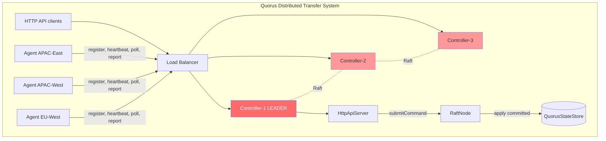
```mermaid
flowchart TD
    subgraph System[Quorus Distributed Transfer System]
        CL[HTTP API clients] --> LB[Load Balancer]
        LB --> C1[Controller-1 LEADER]
        LB --> C2[Controller-2]
        LB --> C3[Controller-3]
        C1 -.Raft.- C2 -.Raft.- C3
        C1 --> API[HttpApiServer]
        API -->|submitCommand| RN[RaftNode]
        RN -->|apply committed| SM[(QuorusStateStore)]
        AE[Agent APAC-East] & AW[Agent APAC-West] & EU[Agent EU-West] -->|register, heartbeat, poll, report| LB
    end

    style C1 fill:#ff6b6b,color:#fff
    style C2 fill:#ff9999
    style C3 fill:#ff9999
```

#### Figure 1 Component Mapping

The following table maps each component in Figure 1 to its concrete implementation and module location:

| Figure 1 Component | Implementation Class | Module | Description |
|--------------------|---------------------|--------|-------------|
| Controller-1/2/3 | `QuorusControllerVerticle` | `quorus-controller` | Raft node with embedded HTTP API |
| HttpApiServer | `HttpApiServer` | `quorus-controller` | REST API; writes are leader-only |
| RaftNode | `RaftNode` | `quorus-controller` | Election, replication, commit, snapshots |
| QuorusStateStore | `QuorusStateStore` | `quorus-controller` | Raft-replicated state (jobs, attempts, events, agents, assignments, queue, routes, metadata) |
| Agent APAC-East/West/EU | `QuorusAgent` | `quorus-agent` | Polls the controller for its assignments, executes transfers via protocol adapters |
| Load Balancer | nginx (external) | — | Routes requests to the controller cluster |

### Module Structure

The system is organized into multiple Maven modules with **controller-first architecture**. The arrows are Maven dependencies; a dashed arrow is a dependency the main code does not use.

##### Figure 2: Module Dependencies

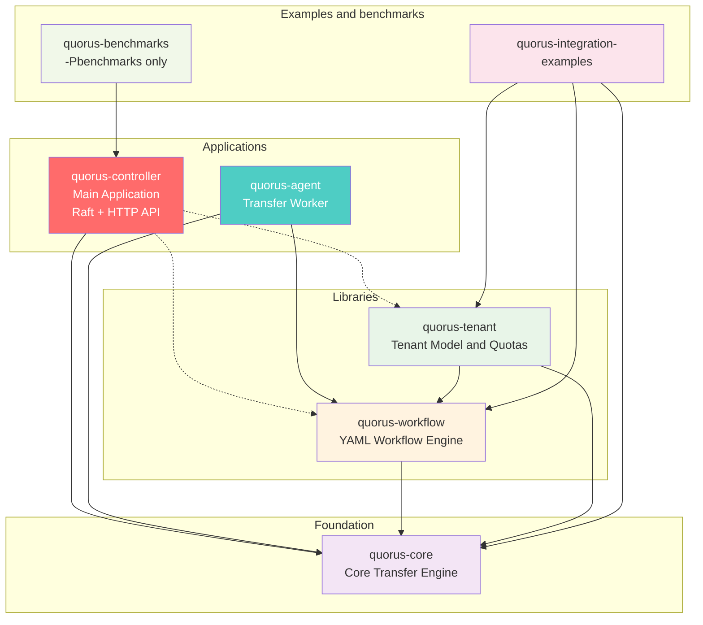
```mermaid
graph TB
    subgraph "Applications"
        QCT[quorus-controller<br/>Main Application<br/>Raft + HTTP API]
        QAG[quorus-agent<br/>Transfer Worker]
    end
    
    subgraph "Libraries"
        QW[quorus-workflow<br/>YAML Workflow Engine]
        QT[quorus-tenant<br/>Tenant Model and Quotas]
    end
    
    subgraph "Foundation"
        QC[quorus-core<br/>Core Transfer Engine]
    end
    
    subgraph "Examples and benchmarks"
        QIE[quorus-integration-examples]
        QB[quorus-benchmarks<br/>-Pbenchmarks only]
    end
    
    QCT --> QC
    QCT -.-> QW
    QCT -.-> QT
    QAG --> QC
    QAG --> QW
    QW --> QC
    QT --> QC
    QT --> QW
    QIE --> QC
    QIE --> QW
    QIE --> QT
    QB --> QCT

    style QCT fill:#ff6b6b,color:#fff
    style QAG fill:#4ecdc4,color:#fff
    style QW fill:#fff3e0
    style QT fill:#e8f5e8
    style QC fill:#f3e5f5
    style QIE fill:#fce4ec
    style QB fill:#f1f8e9
```

#### Module Responsibilities

**Applications** (standalone processes with `main()`):
- **quorus-controller**: Main executable application with embedded HTTP API and Raft consensus
- **quorus-agent**: Distributed transfer worker that polls the controller for its assignments, executes HTTP/HTTPS, FTP/FTPS, SFTP, SMB/CIFS and NFS transfers, sends heartbeats

**Libraries** (embedded in applications or called in-process):
- **quorus-core**: Core transfer engine and protocol adapters
- **quorus-workflow**: YAML-based workflow parsing and in-process execution engine
- **quorus-tenant**: In-process tenant model, hierarchy and quota checks; not an identity boundary

**Examples and benchmarks**:
- **quorus-integration-examples**: Usage examples and integration patterns, including the workflow examples (there is no separate `quorus-workflow-examples` module)
- **quorus-benchmarks**: Benchmark harness, built only with the `benchmarks` profile

## Module Configuration Architecture

**Status: Current.** Checked against `AppConfig`, `AgentConfig`, `QuorusConfiguration` and `LayeredProperties` on 2026-10-03. The former text of this section (a singleton `AppConfig.get()` and file-system locations) is archived section G.

### Configuration classes

| Module | Packaged resource | Config class | Covers |
|--------|-------------------|--------------|--------|
| `quorus-core` | `quorus.properties` | `QuorusConfiguration` | Transfer engine, network timeouts, file handling, protocol settings |
| `quorus-controller` | `quorus-controller.properties` | `AppConfig` | Node identity, HTTP, security and TLS, Raft cluster and storage, snapshots, telemetry |
| `quorus-agent` | `quorus-agent.properties` | `AgentConfig` | Agent identity and tenant, controller URL, transfers, heartbeat, job polling |

Each class is an ordinary per-instance object, not a singleton: callers construct it with a profile name and a `Properties` of explicit overrides, for example `new AppConfig(profile, overrides)`. Instances are isolated from each other, which is what lets tests run several controllers in one JVM.

### Loading order

Each instance applies four layers; a later layer wins:

1. the packaged resource on the classpath (`quorus-controller.properties`, `quorus-agent.properties` or `quorus.properties`; required);
2. the optional profile resource on the classpath (`quorus-controller-<profile>.properties`, `quorus-agent-<profile>.properties` or `quorus-<profile>.properties`), loaded only when the profile is not `default`;
3. environment variables;
4. the explicit overrides passed to the constructor.

There are no file-system search locations (no working-directory, `~/.quorus/` or `/etc/quorus/` files), and JVM system properties are deliberately not a configuration source. The shipped `QuorusControllerApplication` and `QuorusAgent` start with the `default` profile and no overrides, so a deployed process is configured by its packaged resource plus environment variables.

### Environment variable names

A property's environment name is the key in upper case with `.` and `-` replaced by `_` (`LayeredProperties.environmentKey`):

| Property | Environment variable | Packaged default |
|----------|---------------------|------------------|
| `quorus.node.id` | `QUORUS_NODE_ID` | empty; required for a multi-node cluster |
| `quorus.http.port` | `QUORUS_HTTP_PORT` | `8080` |
| `quorus.raft.port` | `QUORUS_RAFT_PORT` | `9080` |
| `quorus.cluster.nodes` | `QUORUS_CLUSTER_NODES` | empty (single node) |
| `quorus.cluster.api-endpoints` | `QUORUS_CLUSTER_API_ENDPOINTS` | empty (no leader hint); `node1=https://host1:8443,...` |
| `quorus.agent.controller.url` | `QUORUS_AGENT_CONTROLLER_URL` | `https://localhost:8080/api/v1`; a comma-separated list for a cluster |
| `quorus.agent.registration.retry-interval-ms` | `QUORUS_AGENT_REGISTRATION_RETRY_INTERVAL_MS` | `5000` |
| `quorus.raft.election-timeout-ms` | `QUORUS_RAFT_ELECTION_TIMEOUT_MS` | `5000` |
| `quorus.raft.heartbeat-interval-ms` | `QUORUS_RAFT_HEARTBEAT_INTERVAL_MS` | `1000` |
| `quorus.raft.storage.path` | `QUORUS_RAFT_STORAGE_PATH` | empty (`./data/raft/<nodeId>`) |
| `quorus.security.profile` | `QUORUS_SECURITY_PROFILE` | `production` |
| `quorus.agent.heartbeat.interval-ms` | `QUORUS_AGENT_HEARTBEAT_INTERVAL_MS` | `30000` |

There is no Raft bind-host property. `AgentConfig` also accepts a fixed set of legacy unprefixed names (for example `AGENT_ID`, `CONTROLLER_URL`, `HEARTBEAT_INTERVAL`); the documented `QUORUS_AGENT_*` name wins when both are set. The controller's `AppConfig` has no legacy names; `quorus-controller/docker-entrypoint.sh`, which mapped some, was removed on 2026-10-03 because the image never ran it (register `ENG-20`).

### Validation

`AppConfig.validate()` fails startup on inconsistent values, for example a non-positive interval, a stall window not greater than the freshness window, or a Raft storage type other than `raftlog`. The production security profile additionally refuses to start without its TLS and identity material (see the [Security Deployment Guide](../../docs/QUORUS_SECURITY_DEPLOYMENT_GUIDE.md)).

## Deployment Configurations

**Status: Current.** Checked against `docker/compose/` on 2026-10-03. Both topologies below set `QUORUS_SECURITY_PROFILE=development` with TLS and security disabled; they are development topologies, not production ones. `docker/compose/docker-compose-tls-example.yml` shows the production profile with mutual TLS. The [Docker guide](../../docker/README.md) is the supported reference for building the jars on the host, choosing a compose topology and starting it. (`docker/start.ps1` is an older launcher that does not build the jars; prefer the commands in the Docker guide.)

### Single-Controller Development Configuration
```bash
# Build the jars on the host first (docker/build-runtime.ps1 or .sh), then:
docker compose -f docker/compose/docker-compose-single-controller.yml up -d --build
```
- **Single controller** with embedded HTTP API
- **Minimal resource usage** for development
- **Quick startup** and testing
- **Port**: http://localhost:8080

### Three-Controller Configuration
```bash
# Build the jars on the host first, then the controller-first cluster with load balancing:
docker compose -f docker/compose/docker-compose-controller-first.yml up -d --build
```
- **3 Quorus Controllers** (containers `quorus-controller1`–`3`, node IDs `controller1`–`3`) with embedded `HttpApiServer`
- **`nginx` load balancer** in front of the three controllers. `GET /health` on port 8080 is answered by nginx itself and says nothing about the controllers (`docker/compose/nginx/nginx.conf`; register `ENG-18`)
- **Raft consensus** via `GrpcRaftTransport` (port 9080) for data consistency, with `QUORUS_RAFT_ELECTION_TIMEOUT_MS=3000` and `QUORUS_RAFT_HEARTBEAT_INTERVAL_MS=500`
- **Fault tolerance**: Any single Quorus Controller can fail; remaining 2 maintain quorum
- **Endpoints**:
  - `nginx` Load Balancer: http://localhost:8080
  - `quorus-controller1`: http://localhost:8081
  - `quorus-controller2`: http://localhost:8082
  - `quorus-controller3`: http://localhost:8083

## Controller-First Architecture

**Status: Partly current.** The controller structure, Raft transport, leader election, controller functions, data protection and HTTP–Raft coupling are current except where marked; routes are partly current.

### Core Design Philosophy

The controller-first architecture places the Quorus Controller at the center of the system, with the HTTP API embedded directly inside each controller.

**Controller-First Design:**
```
QuorusControllerVerticle ─┬─ HttpApiServer (Embedded HTTP Interface, port 8080)
                          ├─ GrpcRaftServer + GrpcRaftTransport (Raft Protocol, port 9080)
                          └─ RaftNode (Consensus) ── QuorusStateStore (RaftLogApplicator)
```

`QuorusControllerApplication.main` builds the configuration and deploys `QuorusControllerVerticle`.

Each Quorus Controller (`quorus-controller1`, `quorus-controller2`, `quorus-controller3`) is a self-contained process running `QuorusControllerVerticle`, which starts both the HTTP API and the Raft consensus engine in the same JVM.

### Benefits of Controller-First Design

1. **Self-Contained Deployment**: Each Quorus Controller runs the same controller and API artifact
2. **Quorum Fault Tolerance**: A healthy, durably configured 3-node cluster can continue metadata writes with 2 available nodes
3. **Architectural Clarity**: Each Quorus Controller owns its `HttpApiServer` and `RaftNode`
4. **Operational Simplicity**: Single Docker container per Quorus Controller
5. **Interface Flexibility**: `HttpApiServer` can be extended with gRPC, WebSocket, etc.

### Routes

**Status: Partly current.** The 500-line route-trigger design that stood here (route principles, startup validation, trigger evaluation flow, controller-agent-route architecture and the route-based transfer sequence) is archived section H: none of it runs.

**Current.** A route is replicated configuration. `RouteConfiguration` (`quorus-core`) carries a route ID, name, description, source agent ID and location, destination agent ID and location, a `TriggerConfiguration`, a `RouteStatus` and string options. The controller stores routes in `QuorusStateStore` through `RouteCommand` (`Create`, `Update`, `Delete`, `Suspend`, `Resume`, `UpdateStatus`) and serves them at `POST`/`GET /api/v1/routes`, `GET`/`PUT`/`DELETE /api/v1/routes/{routeId}`, and `PUT /api/v1/routes/{routeId}/suspend` and `/resume`. `TriggerType` declares `EVENT`, `TIME`, `INTERVAL`, `BATCH`, `SIZE` and `COMPOSITE`; `RouteStatus` declares `CONFIGURED`, `ACTIVE`, `TRIGGERED`, `TRANSFERRING`, `SUSPENDED`, `DEGRADED`, `FAILED` and `DELETED`.

**Target** (register `ARCH-04`; [specification §8.1](../../docs/QUORUS_ARCHITECTURE_SPECIFICATION.md#81-routes)). Nothing evaluates a trigger: no evaluator, cron scheduler, file watcher or batch accumulator is wired into controller startup, no route is validated against live agents at startup, and no backup-agent failover exists. A route's source and destination agent fields do not create an agent-to-agent data channel; the current data plane is single-agent execution ([specification §7](../../docs/QUORUS_ARCHITECTURE_SPECIFICATION.md#7-canonical-data-plane)), and agent-to-agent streaming is a non-goal until it has its own specification. A route evaluator, when built, must run on the leader only, deduplicate triggers, survive leader change, and use the governed service-connection authority that production transfers already use.

### Raft Consensus Implementation

The Quorus controller implements a distributed consensus system based on the Raft algorithm to ensure high availability, consistency, and fault tolerance across the controller cluster. Every controller-managed record, including route configurations, is replicated across the controller quorum. The engine is the in-repository `RaftNode` on Vert.x, with `raftlog-core` 1.2.0 as its write-ahead log; [ADR-0011](../architecture-decisions/ADR-0011-CONSENSUS-VIA-QRAFT-GENERIC-ENGINE.md) replaces it with the generic QRaft engine (plan items `CE-01` to `CE-11`).

##### Figure 7: Raft Cluster Architecture

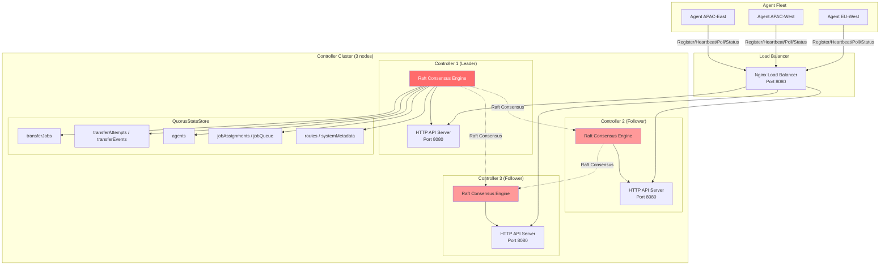
```mermaid
graph TB
    subgraph "Load Balancer"
        LB[Nginx Load Balancer<br/>Port 8080]
    end

    subgraph "Controller Cluster (3 nodes)"
        subgraph "Controller 1 (Leader)"
            C1_RAFT[Raft Consensus Engine]
            C1_HTTP[HTTP API Server<br/>Port 8080]
            C1_RAFT --> C1_HTTP
        end

        subgraph "Controller 2 (Follower)"
            C2_RAFT[Raft Consensus Engine]
            C2_HTTP[HTTP API Server<br/>Port 8080]
            C2_RAFT --> C2_HTTP
        end

        subgraph "Controller 3 (Follower)"
            C3_RAFT[Raft Consensus Engine]
            C3_HTTP[HTTP API Server<br/>Port 8080]
            C3_RAFT --> C3_HTTP
        end

        C1_RAFT -.->|Raft Consensus| C2_RAFT
        C1_RAFT -.->|Raft Consensus| C3_RAFT
        C2_RAFT -.->|Raft Consensus| C3_RAFT

        subgraph "QuorusStateStore"
            RS1[transferJobs]
            RS2[transferAttempts / transferEvents]
            RS3[agents]
            RS4[jobAssignments / jobQueue]
            RS5[routes / systemMetadata]
        end

        C1_RAFT --> RS1
        C1_RAFT --> RS2
        C1_RAFT --> RS3
        C1_RAFT --> RS4
        C1_RAFT --> RS5
    end

    LB --> C1_HTTP
    LB --> C2_HTTP
    LB --> C3_HTTP

    subgraph "Agent Fleet"
        A1[Agent APAC-East]
        A2[Agent APAC-West]
        A3[Agent EU-West]
    end

    A1 -->|Register/Heartbeat/Poll/Status| LB
    A2 -->|Register/Heartbeat/Poll/Status| LB
    A3 -->|Register/Heartbeat/Poll/Status| LB

    style C1_RAFT fill:#ff6b6b,color:#fff
    style C2_RAFT fill:#ff9999
    style C3_RAFT fill:#ff9999
```

Every node applies committed entries to its own `QuorusStateStore`; the diagram draws the arrows from the leader only. Agents pull their work; the controller never pushes to an agent.

**Key Features:**
- **Leader Election**: Automatic leader election using Raft consensus algorithm
- **Log Replication**: All state changes replicated across quorum members
- **Fault Tolerance**: Tolerates ⌊(N−1)/2⌋ failures in an N-node cluster
- **Split-Brain Prevention**: Quorum-based decision making prevents split-brain scenarios
- **Consistent State**: Committed writes are strongly ordered; reads served by a follower may be stale ([specification §5.4](../../docs/QUORUS_ARCHITECTURE_SPECIFICATION.md#54-read-consistency))
- **Snapshots and catch-up**: `RaftNode` takes snapshots of `QuorusStateStore`, compacts the log, and sends `InstallSnapshot` to followers that are too far behind

**Quorum Configuration:**
- **Minimum Nodes**: 3 controllers for basic HA (tolerates 1 failure)
- **Five nodes** tolerate 2 failures; this needs a separately configured static five-node cluster (`docker/compose/docker-compose-5node.yml` is an example)
- **Odd Numbers**: Always use odd number of controllers for proper quorum
- **Geographic Distribution (Target)**: Controllers distributed across availability zones; not evidenced
- **Network Partitioning**: The majority partition can elect a leader and accept writes; a minority partition cannot

**Controller Services:**

| Service | Implementation | Module | Description |
|---------|----------------|--------|-------------|
| HTTP API | `HttpApiServer` | `quorus-controller` | REST endpoints for agents and clients |
| Raft Consensus | `RaftNode` | `quorus-controller` | Leader election, log replication, snapshots |
| Replicated state | `QuorusStateStore` | `quorus-controller` | Applies committed commands; implements `RaftLogApplicator` |
| Job Assignment (not running) | `JobAssignmentService` | `quorus-controller` | Scheduler and assignment-timeout monitor; never constructed (`ENG-01`) |
| Agent Selection (not running) | `AgentSelectionService` | `quorus-controller` | Tenant, pool and zone-aware agent selection; never constructed (`ENG-01`) |

The workflow engine (`SimpleWorkflowEngine`) and tenant service (`SimpleTenantService`) are not controller services; they run in-process wherever an application calls them.

### Raft Transport Layer

The `RaftTransport` interface defines the communication layer for Raft consensus messages between controller nodes:

```java
public interface RaftTransport {
    void start(Consumer<RaftMessage> messageHandler);
    Future<Void> stop();
    Future<VoteResponse> sendVoteRequest(String targetId, VoteRequest request);
    Future<AppendEntriesResponse> sendAppendEntries(String targetId, AppendEntriesRequest request);
    Future<InstallSnapshotResponse> sendInstallSnapshot(String targetId, InstallSnapshotRequest request);
    default void setRaftNode(RaftNode node) {}
}
```

`Future` here is the Vert.x `io.vertx.core.Future`; the interface goes with the in-repository engine when QRaft replaces it ([ADR-0011](../architecture-decisions/ADR-0011-CONSENSUS-VIA-QRAFT-GENERIC-ENGINE.md)).

#### RaftMessage Sealed Interface

The `RaftMessage` sealed interface provides compile-time type safety for Raft protocol messages:

```java
public sealed interface RaftMessage {
    record Vote(VoteRequest request) implements RaftMessage {}
    record AppendEntries(AppendEntriesRequest request) implements RaftMessage {}
}
```

**Benefits of Sealed Interfaces:**
- **Exhaustive pattern matching**: Compiler ensures all message types are handled
- **Type safety**: No runtime `instanceof` checks needed
- **Modern Java idiom**: Leverages sealed types and pattern matching under the Java 27 baseline

**Usage in RaftNode:**
```java
private void handleMessage(RaftMessage message) {
    switch (message) {
        case RaftMessage.Vote vote -> handleVoteRequest(vote.request());
        case RaftMessage.AppendEntries ae -> handleAppendEntriesRequest(ae.request());
    }
}
```

`InstallSnapshot` is not a `RaftMessage` variant: `GrpcRaftServer` calls `RaftNode.handleInstallSnapshot` directly.

#### Transport Implementation Status

| Transport | Status | Class | Description |
|-----------|--------|-------|-------------|
| **gRPC** | ✅ Implemented | `GrpcRaftTransport` | Active Raft transport; production security and durability gates remain open |
| **In-Memory** | ✅ Implemented | `InMemoryTransportSimulator` | For unit testing (in test folder) |

#### gRPC Transport Implementation (Production)

The `GrpcRaftTransport` provides high-performance, type-safe communication using Protocol Buffers:

**Key Features:**
- **Protocol Buffers**: Strongly-typed message definitions via `raft.proto`
- **gRPC Netty Client**: High-performance HTTP/2 transport
- **Connection Pooling**: Reuses gRPC channels for cluster nodes via `ConcurrentHashMap`
- **TLS**: TLS 1.3 mutual authentication when `quorus.security.raft.tls.enabled` is true (the packaged default), configured by `RaftTlsConfig`; `RaftPeerAuthorizationInterceptor` checks inbound peers. Peer certificates are not yet bound to the configured node identities (`SEC-04`), and revocation is checked on inbound RPCs only (`SEC-10`)
- **Vert.x Integration**: Converts gRPC `ListenableFuture` to Vert.x `Future` using Guava callbacks

**Server Component:** `GrpcRaftServer` handles incoming Raft RPC requests and delegates to `RaftNode`.

**Proto Definition (`quorus-controller/src/main/proto/raft.proto`, abridged):**
```protobuf
service RaftService {
  rpc RequestVote (VoteRequest) returns (VoteResponse) {}
  rpc AppendEntries (AppendEntriesRequest) returns (AppendEntriesResponse) {}
  rpc InstallSnapshot (InstallSnapshotRequest) returns (InstallSnapshotResponse) {}
}

message LogEntry {
  int64 term = 1;
  int64 index = 2;
  bytes data = 3; // Command payload serialized
}
```

Replicated commands are encoded by `ProtobufCommandCodec` using `commands.proto`.

**Usage:**
```java
// In QuorusControllerVerticle
GrpcRaftTransport transport = new GrpcRaftTransport(vertx, nodeId, peerAddresses,
        raftPoolSize, raftQueueSize, raftTlsConfig);
GrpcRaftServer server = new GrpcRaftServer(vertx, raftPort, node, raftTlsConfig, trustState);
server.start();
```

#### In-Memory Transport Implementation (Test Utility)

The `InMemoryTransportSimulator` (in test folder) provides fast, deterministic transport for unit testing:

**Features:**
- **Static Registry**: Global `ConcurrentHashMap` for node discovery
- **Configurable Latency**: `setChaosConfig(minLatencyMs, maxLatencyMs, dropRate)`
- **Packet Drop Simulation**: Configurable drop rate for chaos testing
- **Direct Method Calls**: No network overhead, all nodes in same JVM

**Location:** `quorus-controller/src/test/java/dev/mars/quorus/controller/raft/InMemoryTransportSimulator.java`

#### Transport Selection Guide

| Transport | Use Case | Pros | Cons |
|-----------|----------|------|------|
| **gRPC** | Production & Development | High performance, type-safe, efficient | Requires HTTP/2 support |
| **In-Memory** | Unit testing | Fast, configurable chaos, no network | Test folder only |

### Leader Election Process

The 3-node Quorus Controller cluster (`quorus-controller1`, `quorus-controller2`, `quorus-controller3`) implements the Raft consensus algorithm for leader election, ensuring strong consistency and fault tolerance. The leader election process is critical for maintaining cluster coordination and preventing split-brain scenarios. The walkthrough below was checked against `RaftNode` on 2026-10-03; the optimisation strategies and most of the metric names further down are target state and are marked so.

#### Election States and Transitions

Each Quorus Controller's `RaftNode` operates in one of three states:

- **FOLLOWER**: Default state; receives `AppendEntries` heartbeats from the LEADER and responds to `RequestVote` requests
- **CANDIDATE**: Transitional state during election; requests votes from the other two Quorus Controllers
- **LEADER**: Coordinates cluster operations; sends `AppendEntries` heartbeats via `GrpcRaftTransport` to maintain leadership

#### Election Timing and Randomization

**Election Timeout Configuration (set via `QUORUS_RAFT_ELECTION_TIMEOUT_MS` and `QUORUS_RAFT_HEARTBEAT_INTERVAL_MS`, properties `quorus.raft.election-timeout-ms` and `quorus.raft.heartbeat-interval-ms`):**
- Election timeout is deployment-specific
- The repository compose topologies use a `3000ms` election timeout and a `500ms` heartbeat interval
- The packaged defaults, and the controller image's environment defaults, are a `5000ms` election timeout and a `1000ms` heartbeat interval
- Purpose: Prevent simultaneous elections and reduce split votes

**Timeout Behavior:**
- FOLLOWER Quorus Controllers reset their election timer on each valid `AppendEntries` heartbeat
- Each timer is drawn at random between the configured election timeout and twice that value (`RaftNode.resetElectionTimer`); if it expires without a heartbeat, the FOLLOWER's `RaftNode` transitions to CANDIDATE
- The random spread staggers elections across `quorus-controller1`, `quorus-controller2`, `quorus-controller3`

#### Detailed Election Algorithm

**Phase 1: Election Initiation**
1. **Timeout Trigger**: A FOLLOWER Quorus Controller's election timer expires without receiving an `AppendEntries` heartbeat
2. **State Transition**: The `RaftNode` transitions from FOLLOWER to CANDIDATE
3. **Term Increment**: Current Raft term is incremented by 1
4. **Self-Vote**: The CANDIDATE Quorus Controller votes for itself
5. **Durable Vote**: The new term and self-vote are persisted to Raft storage before any `RequestVote` is sent; if the write fails the node falls back to FOLLOWER
6. **Timer Reset**: New randomized election timeout is set

**Phase 2: Vote Request Process**
1. **Vote Request Creation**: The CANDIDATE's `RaftNode` creates a `RequestVote` message with:
   - `term`: Current Raft term number
   - `candidateId`: This Quorus Controller's `QUORUS_NODE_ID` (e.g., "controller1")
   - `lastLogIndex`: Index of candidate's last Raft log entry
   - `lastLogTerm`: Term of candidate's last Raft log entry

2. **Parallel Vote Requests**: `GrpcRaftTransport` sends `RequestVote` to the other two Quorus Controllers
3. **Vote Collection**: The CANDIDATE waits for `VoteResponse` messages

**Phase 3: Vote Evaluation**
Each Quorus Controller receiving a `RequestVote` evaluates:
1. **Term Validation**: Request term >= this Quorus Controller's current term
2. **Vote Availability**: Haven't voted for another CANDIDATE in this term
3. **Log Currency**: CANDIDATE's Raft log is at least as up-to-date as this Quorus Controller's log
4. **Response**: Send `VoteResponse` with granted/denied decision via `GrpcRaftTransport`

**Phase 4: Leadership Determination**
1. **Majority Calculation**: CANDIDATE needs `(3 / 2) + 1 = 2` votes (including self-vote)
2. **Vote Counting**: `RaftNode` atomic counter tracks received votes
3. **Leadership Transition**: If 2 votes achieved, the CANDIDATE Quorus Controller becomes LEADER
4. **State Initialization**: The new LEADER's `RaftNode` initializes `nextIndex` and `matchIndex` for the two FOLLOWER Quorus Controllers

#### Election Scenarios and Edge Cases

The two diagrams below use a five-node cluster (a separately configured static membership, as in `docker-compose-5node.yml`) to show majorities more clearly; with three nodes the majority is two.

**Successful Election:**
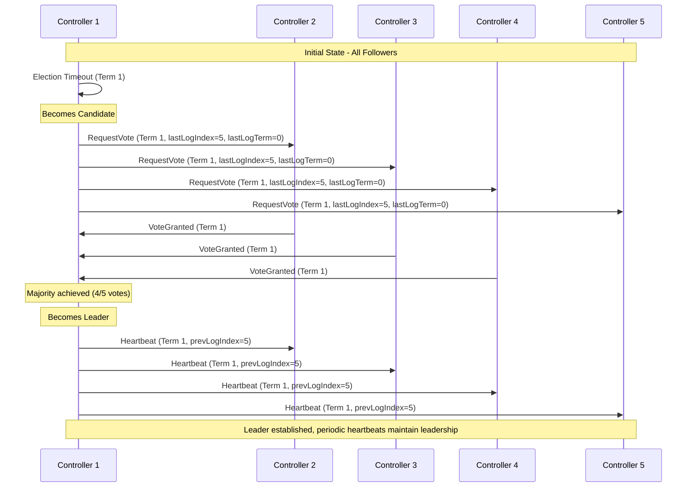
```mermaid
sequenceDiagram
    participant C1 as Controller 1
    participant C2 as Controller 2
    participant C3 as Controller 3
    participant C4 as Controller 4
    participant C5 as Controller 5

    Note over C1,C5: Initial State - All Followers
    C1->>C1: Election Timeout (Term 1)
    Note over C1: Becomes Candidate
    C1->>C2: RequestVote (Term 1, lastLogIndex=5, lastLogTerm=0)
    C1->>C3: RequestVote (Term 1, lastLogIndex=5, lastLogTerm=0)
    C1->>C4: RequestVote (Term 1, lastLogIndex=5, lastLogTerm=0)
    C1->>C5: RequestVote (Term 1, lastLogIndex=5, lastLogTerm=0)

    C2->>C1: VoteGranted (Term 1)
    C3->>C1: VoteGranted (Term 1)
    C4->>C1: VoteGranted (Term 1)
    Note over C1: Majority achieved (4/5 votes)
    Note over C1: Becomes Leader

    C1->>C2: Heartbeat (Term 1, prevLogIndex=5)
    C1->>C3: Heartbeat (Term 1, prevLogIndex=5)
    C1->>C4: Heartbeat (Term 1, prevLogIndex=5)
    C1->>C5: Heartbeat (Term 1, prevLogIndex=5)

    Note over C1,C5: Leader established, periodic heartbeats maintain leadership
```

**Split Vote Scenario:**
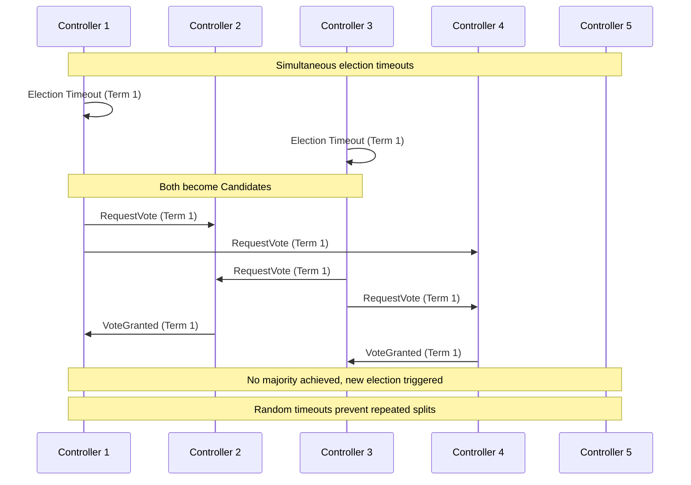
```mermaid
sequenceDiagram
    participant C1 as Controller 1
    participant C2 as Controller 2
    participant C3 as Controller 3
    participant C4 as Controller 4
    participant C5 as Controller 5

    Note over C1,C5: Simultaneous election timeouts
    C1->>C1: Election Timeout (Term 1)
    C3->>C3: Election Timeout (Term 1)

    Note over C1,C3: Both become Candidates
    C1->>C2: RequestVote (Term 1)
    C1->>C4: RequestVote (Term 1)
    C3->>C2: RequestVote (Term 1)
    C3->>C4: RequestVote (Term 1)

    C2->>C1: VoteGranted (Term 1)
    C4->>C3: VoteGranted (Term 1)

    Note over C1,C5: No majority achieved, new election triggered
    Note over C1,C5: Random timeouts prevent repeated splits
```

#### Failure Scenarios and Recovery

**Leader Failure Detection:**
1. **Heartbeat Monitoring**: Followers expect heartbeats according to the configured heartbeat interval
2. **Failure Detection**: Missing heartbeats beyond the configured election window triggers election
3. **Automatic Recovery**: New leader election timing depends on deployment configuration and network conditions
4. **Service Continuity**: Brief write disruption during leader change is expected

**Network Partition Handling:**
- **Majority Partition**: Continues normal operations with new leader if needed
- **Minority Partition**: Cannot elect a leader or commit; its API rejects writes with `503 NOT_LEADER` or `NO_LEADER`, and any reads it serves may be stale (there is no explicit read-only mode)
- **Partition Healing**: Minority nodes automatically rejoin majority partition
- **Split-Brain Prevention**: Quorum requirement prevents dual leadership

**Node Recovery Process:**
1. **Rejoining Cluster**: Recovered node recovers its term, vote, log and latest snapshot from local Raft storage and starts as follower
2. **Log Synchronization**: Receives missing log entries from current leader, or an `InstallSnapshot` if the leader has compacted them
3. **State Reconciliation**: Updates local state to match cluster consensus
4. **Full Participation**: Resumes normal voting and operation handling

#### Performance Characteristics

**Election Performance Metrics:**
- **Election Duration**: Configuration-dependent; use deployment-specific timeout settings as the planning baseline
- **Availability Impact**: Dependent on election timeout, heartbeat interval, and network conditions
- **Throughput**: No impact on read operations, brief pause for writes during leader transition
- **Scalability**: Election behavior depends on quorum size, timing configuration, and network stability

**Optimization Strategies (Target; none is implemented in `RaftNode`):**
- **Pre-Vote Phase**: Optional pre-election to reduce disruptions
- **Priority Elections**: Higher priority nodes can trigger faster elections
- **Lease-Based Leadership**: Reduce election frequency with leader leases
- **Batch Heartbeats**: Optimize network usage with batched communications

#### Monitoring and Observability

**Metrics recorded today** (OpenTelemetry instrument names; Prometheus shows them with `_` for `.`):
- `quorus.cluster.state`, `quorus.cluster.is_leader`: Raft role of this node
- `quorus.cluster.term`: Current term
- `quorus.cluster.commit_index`, `quorus.cluster.last_applied`, `quorus.cluster.log_size`: Replication progress
- `quorus.raft.rpc.vote_requests`, `quorus.raft.rpc.append_entries`, `quorus.raft.rpc.total`: Raft RPC counts
- `quorus.raft.snapshot.total`, `quorus.raft.snapshot.duration`, `quorus.raft.install_snapshot.sent.total`, `quorus.raft.install_snapshot.received.total`: Snapshot activity

**Target metrics** (not recorded today): election count and duration, leader changes, and missed heartbeats per follower.

**Health Indicators:**
- **Stable Leadership**: Low frequency of leader changes indicates healthy cluster
- **Election Frequency**: High election rate may indicate network issues or node instability
- **Vote Success Rate**: Percentage of successful vote requests indicates network health
- **Heartbeat Regularity**: Consistent heartbeat intervals show stable leadership

**Alerting Thresholds:**
- **Critical**: No leader elected for > 5 seconds
- **Warning**: > 3 leader changes per minute
- **Info**: Election duration > 1 second

**Troubleshooting Guide:**
1. **Frequent Elections**: Check network connectivity and node health
2. **Split Votes**: Repeated split votes suggest an election timeout too close to network or storage latency; Raft does not depend on synchronized clocks
3. **Slow Elections**: Investigate network latency and node performance
4. **Failed Elections**: Check quorum size (need 2 of 3 Quorus Controllers) and container availability

### Quorus Controller Functions and Responsibilities

The Quorus Controller (`quorus-controller` module) serves as the **distributed coordination engine** for the entire Quorus file transfer system. Each Quorus Controller (e.g., `quorus-controller1`) is a self-contained Docker container that combines `RaftNode` consensus, `QuorusStateStore` replicated state, and `HttpApiServer` API capabilities.

#### Core Quorus Controller Functions

**1. Distributed Consensus (`RaftNode` + `GrpcRaftTransport`)**
- **Leader Election**: Automatically elects a LEADER from `quorus-controller1`, `quorus-controller2`, `quorus-controller3`
- **Log Replication**: Ensures all Quorus Controllers have consistent Raft command logs via `AppendEntries`
- **Consensus**: Guarantees majority (2 of 3) agreement before a command is committed and applied to `QuorusStateStore`
- **Fault Tolerance**: Continues operating if 1 Quorus Controller fails (2 of 3 = quorum)

**2. Replicated State (`QuorusStateStore`)**
- **Transfer Job Management**: Creates, updates, and tracks transfer jobs, their attempts and their ordered events
- **Quorus Agent Records**: Registrations, capabilities, status and heartbeat timestamps
- **Assignments, Queue and Routes**: Job assignments, the job queue, and route configurations
- **System Metadata**: Key–value metadata, including the service-connection and secret-reference registry
- **State Persistence**: Supplies snapshots to `RaftNode` and restores from them

**3. Job Scheduling & Coordination (Target, register `ENG-01` with `P2-01`)**
- **Job Assignment**: Today a caller assigns a job with `POST /api/v1/assignments`; no controller component assigns jobs by itself
- **Load Balancing**: Not implemented; `AgentSelectionService` exists but is never constructed
- **Progress Tracking (Current)**: Records transfer status and progress from agents' reports to `POST /api/v1/jobs/{jobId}/status` (sent by the agent's `JobStatusReportingService`)
- **Failure Handling**: Lease expiry, reassignment and rescheduling are not automated (`P2-01`, `P2-08`)

**4. Quorus Agent Fleet Management**
- **Agent Registration (Current)**: Commits registrations sent by the agent's `AgentRegistrationService`
- **Heartbeat Processing (Current)**: Commits heartbeats sent by the agent's `HeartbeatService`; nothing on the controller yet marks an agent unhealthy when heartbeats stop
- **Capability Management (Current)**: Records the protocols and limits each agent declares
- **Fleet Coordination (Target)**: Enrollment, drain, upgrade, quarantine and revocation ([specification §10.7](../../docs/QUORUS_ARCHITECTURE_SPECIFICATION.md#107-secure-agent-build-and-deployment-lifecycle))

**5. `HttpApiServer`**
- **Health Monitoring**: `/health`, `/health/live` and `/health/ready` report node health and Raft state
- **API Endpoints**: REST APIs for transfers, attempts, progress and events, assignments, agents, routes, service connections, secret references and security; there are no workflow resources
- **Cluster Status**: `/status` and `/raft/status`; the richer `/api/v1/cluster` resource is required by the canonical REST specification but is not implemented today
- **Metrics**: `/metrics` serves Prometheus metrics (`quorus_cluster_*`, `quorus_raft_*`, `quorus_jobs_*`, `quorus_agents_*`, `quorus_routes_*`)

#### Quorus Controller Architecture Diagram

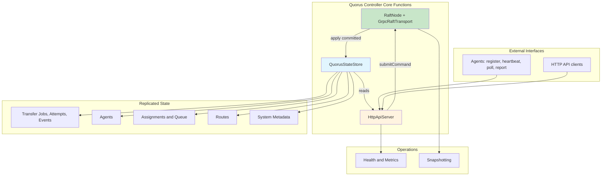
```mermaid
graph TB
    subgraph "Quorus Controller Core Functions"
        RAFT[RaftNode + GrpcRaftTransport]
        SM[QuorusStateStore]
        API[HttpApiServer]

        API -->|submitCommand| RAFT
        RAFT -->|apply committed| SM
        SM -->|reads| API
    end

    subgraph "Replicated State"
        TJ[Transfer Jobs, Attempts, Events]
        AG[Agents]
        AS[Assignments and Queue]
        RT[Routes]
        SYS[System Metadata]

        SM --> TJ
        SM --> AG
        SM --> AS
        SM --> RT
        SM --> SYS
    end

    subgraph "Operations"
        MON[Health and Metrics]
        SNAP[Snapshotting]

        API --> MON
        RAFT --> SNAP
    end

    subgraph "External Interfaces"
        AGENTS[Agents: register, heartbeat, poll, report]
        CLIENTS[HTTP API clients]

        AGENTS --> API
        CLIENTS --> API
    end

    style RAFT fill:#c8e6c9
    style SM fill:#e1f5fe
    style API fill:#fff3e0
```

### Data Protection and Consistency Guarantees

The controller protects its coordination metadata through Raft consensus: committed commands are ordered, replicated to a majority and durable on each node's Raft storage. This is not an unconditional no-loss guarantee (see the end of this section). Which state Raft owns is defined normatively in [specification §5.2](../../docs/QUORUS_ARCHITECTURE_SPECIFICATION.md#52-state-ownership).

#### Data Classification and Protection Levels

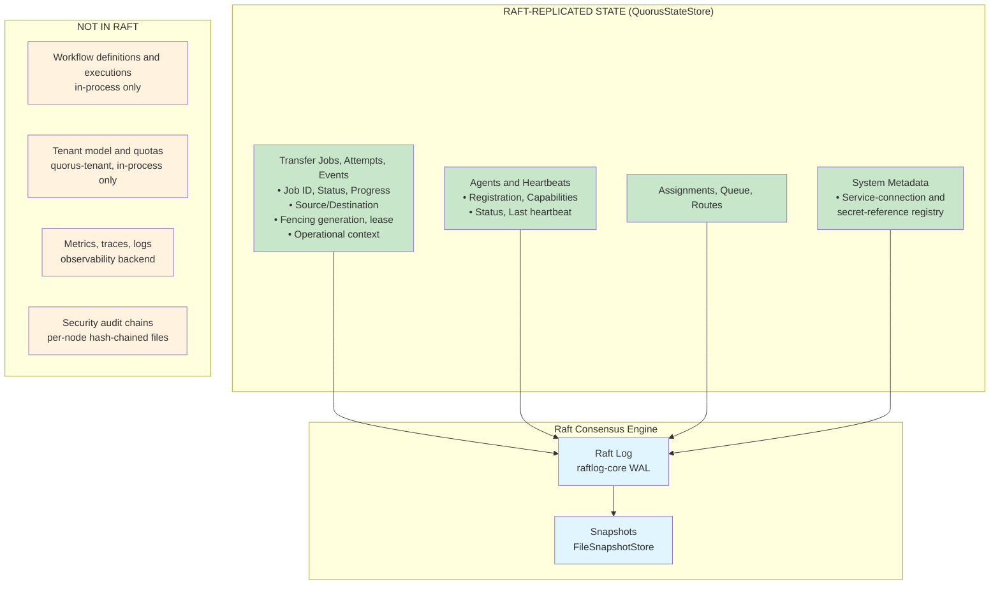
```mermaid
graph TB
    subgraph "RAFT-REPLICATED STATE (QuorusStateStore)"
        TJ[Transfer Jobs, Attempts, Events<br/>• Job ID, Status, Progress<br/>• Source/Destination<br/>• Fencing generation, lease<br/>• Operational context]
        AG[Agents and Heartbeats<br/>• Registration, Capabilities<br/>• Status, Last heartbeat]
        AS[Assignments, Queue, Routes]
        SM[System Metadata<br/>• Service-connection and<br/>secret-reference registry]
    end

    subgraph "NOT IN RAFT"
        WF[Workflow definitions and executions<br/>in-process only]
        TC[Tenant model and quotas<br/>quorus-tenant, in-process only]
        RT[Metrics, traces, logs<br/>observability backend]
        AUD[Security audit chains<br/>per-node hash-chained files]
    end

    subgraph "Raft Consensus Engine"
        LOG[Raft Log<br/>raftlog-core WAL]
        SNAP[Snapshots<br/>FileSnapshotStore]
    end

    TJ --> LOG
    AG --> LOG
    AS --> LOG
    SM --> LOG

    LOG --> SNAP

    style TJ fill:#c8e6c9
    style AG fill:#c8e6c9
    style AS fill:#c8e6c9
    style SM fill:#c8e6c9
    style WF fill:#fff3e0
    style TC fill:#fff3e0
    style RT fill:#fff3e0
    style AUD fill:#fff3e0
    style LOG fill:#e1f5fe
    style SNAP fill:#e1f5fe
```

#### Raft-Replicated Data

**Transfer Job Data** (`TransferJobSnapshot`, abridged; the class has further fields for the governed service connection, policy digest, agent pool and resolved addresses):
```java
public class TransferJobSnapshot implements Serializable {
    private final String jobId;
    private final String sourceUri;
    private final String destinationPath;
    private final TransferStatus status;
    private final long bytesTransferred;
    private final long totalBytes;
    private final Instant startTime;
    private final Instant lastUpdateTime;
    private final Instant lastProgressAt;
    private final String errorMessage;
    private final String tenantId;
    private final TransferOperationalContext operationalContext;
}
```

**Protected Information:**
- **Job Assignments and Attempts**: Which agent is handling which transfer, under which attempt, fencing generation and lease
- **Transfer Status**: `PENDING`, `IN_PROGRESS`, `COMPLETED`, `FAILED`, `CANCELLED`, `PAUSED`
- **Progress Tracking**: Bytes transferred, last-progress time
- **Error Information**: Failure reasons
- **Metadata**: Source/destination paths, timing information, operational context
- **Agent Records**: Registration, capabilities, status and heartbeat timestamps — heartbeats are committed through Raft today ([specification §5.2](../../docs/QUORUS_ARCHITECTURE_SPECIFICATION.md#52-state-ownership))
- **Routes**: Route configurations and lifecycle status

**System Metadata:**
- **Registry**: Versioned service connections and opaque secret references (never secret values)
- **Other metadata**: Key–value settings supplied at startup or by commands

Workflow definitions, workflow executions and tenant configuration are **not** replicated: the workflow engine and tenant service run in-process and the controller does not use them.

#### Data Loss Prevention Mechanisms

**1. Raft Log Replication**

`RaftNode` keeps the current term, vote and log in memory and persists them through `RaftStorage`, implemented by `RaftLogStorageAdapter` over `raftlog-core` 1.2.0 (fsync on by default, `quorus.raft.storage.fsync`). On restart it recovers term, vote and log from that storage.

**Process:**
1. **Command Submission**: All state changes go through Raft as commands (`RaftNode.submitCommand`)
2. **Log Replication**: Commands are replicated to a majority of nodes (2 of 3, or 3 of 5)
3. **Commit Confirmation**: Only committed when majority acknowledges
4. **State Application**: Commands applied to `QuorusStateStore` only after commit

**2. Snapshot Protection**

`QuorusStateStore.takeSnapshot()` serialises every map (jobs, agents, metadata, assignments, queue, routes, attempts, active attempts, events) and the last applied index into a `QuorusSnapshot` with Jackson:
```java
@Override
public byte[] takeSnapshot() {
    QuorusSnapshot snapshot = new QuorusSnapshot();
    snapshot.setTransferJobs(new ConcurrentHashMap<>(transferJobs));
    snapshot.setAgents(new ConcurrentHashMap<>(agents));
    snapshot.setSystemMetadata(new ConcurrentHashMap<>(systemMetadata));
    // ... job assignments, job queue, routes, transfer attempts,
    //     active attempt by job, transfer events
    snapshot.setLastAppliedIndex(lastAppliedIndex.get());
    return objectMapper.writeValueAsBytes(snapshot);
}
```

**Benefits:**
- **Periodic snapshots**: `RaftNode` takes a snapshot when more than `quorus.raft.snapshot.threshold` entries (default 10000) have been applied since the last one
- **Fast Recovery**: Lagging or new followers receive an `InstallSnapshot`
- **Log Compaction**: Reduces storage requirements; WAL prefix deletion follows durable snapshot publication ([specification §5.5](../../docs/QUORUS_ARCHITECTURE_SPECIFICATION.md#55-persistence-requirements))
- **Consistency**: Snapshots are point-in-time consistent

#### Failure Scenarios and Data Protection

**Scenario 1: Quorus Controller Failure**
```
Before Failure: 3 Quorus Controllers have transfer job "TJ-123" status = "IN_PROGRESS"
quorus-controller2 Fails: 2 Quorus Controllers still have transfer job "TJ-123" status = "IN_PROGRESS"
Result:         No committed metadata loss, assuming durable correctly mounted storage on the majority
```

**Scenario 2: Network Partition**
```
Partition A: 2 Quorus Controllers (majority) - Can continue operations
Partition B: 1 Quorus Controller (minority) - Rejects writes; any reads it serves may be stale
Result:      Majority partition can preserve committed metadata consistency under the stated storage assumptions
```

**Scenario 3: LEADER Quorus Controller Failure During Write**
```
1. LEADER quorus-controller1 receives: "Update TJ-123 status to COMPLETED"
2. LEADER replicates via AppendEntries to quorus-controller2 (majority: 2 of 3)
3. LEADER fails before responding to client
4. New LEADER elected (quorus-controller2 or quorus-controller3) with the committed change
Result: Committed metadata remains recoverable under the stated quorum and durable-storage assumptions
```

The client in Scenario 3 sees a failure or timeout although the change committed. Retrying safely needs idempotency keys, which do not exist yet (`ARCH-05`, `P2-04`).

#### What Data is NOT Protected

**Important Clarification: File Content is NOT Stored in Quorus Controllers**
The Quorus Controllers do **NOT** store the actual file data being transferred. They only store:
- **Metadata** about transfers
- **Coordination** information
- **Status** and progress tracking

**Not Raft Protected:**
- **Real-time Performance Metrics**: Exported to the observability backend; can be regenerated from current state
- **Agent-local state**: Active protocol sessions and staging files on the agent
- **Security audit records**: Written by each controller to its own hash-chained files, not replicated
- **Runtime revocations**: Node-local and volatile (`DR-Q2`)

#### Business Impact of Data Protection

**With Raft Protection (via `RaftNode` and `QuorusStateStore`):**
- ✅ No lost committed transfer jobs, under the quorum and durable-storage assumptions
- ✅ Consistent job assignment records across controllers
- ✅ Reliable progress records for what agents have reported
- ⚠️ Duplicate transfers are still possible: consensus protects the assignment metadata but not the external side effect, and automatic reassignment, destination fencing and reconciliation are incomplete ([specification §6.2](../../docs/QUORUS_ARCHITECTURE_SPECIFICATION.md#62-delivery-semantics))

**Without Raft Protection:**
- ❌ Transfer jobs could disappear
- ❌ Duplicate transfers possible
- ❌ Inconsistent job assignments

The Quorus Controller cluster is intended to preserve committed coordination metadata through quorum replication. This is not an unconditional no-loss guarantee: durable storage, correct volume mounting, snapshots, restore testing, quorum, and the release gates in the canonical architecture specification are required.

### HttpApiServer-RaftNode Relationship and Coupling

The Quorus architecture implements a **loosely coupled** relationship between the `HttpApiServer` and the `RaftNode` cluster. Each Quorus Controller (`quorus-controller1`, `quorus-controller2`, `quorus-controller3`) runs both components in the same JVM via `QuorusControllerVerticle`.

#### Architectural Separation

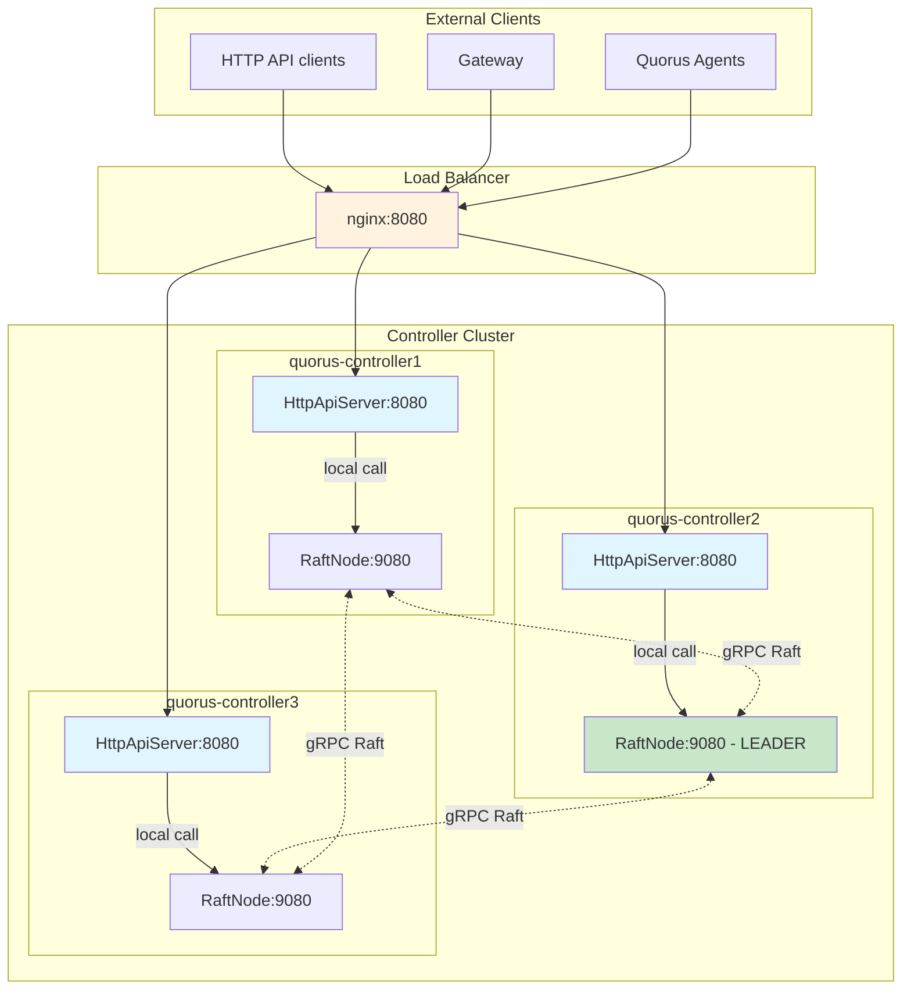
```mermaid
graph TB
    subgraph "External Clients"
        CLI[HTTP API clients]
        WEB[Gateway]
        AGENT[Quorus Agents]
    end

    subgraph "Load Balancer"
        LB[nginx:8080]
    end

    subgraph "Controller Cluster"
        subgraph "quorus-controller1"
            H1[HttpApiServer:8080]
            R1[RaftNode:9080]
        end
        subgraph "quorus-controller2"
            H2[HttpApiServer:8080]
            R2[RaftNode:9080 - LEADER]
        end
        subgraph "quorus-controller3"
            H3[HttpApiServer:8080]
            R3[RaftNode:9080]
        end
    end

    CLI --> LB
    WEB --> LB
    AGENT --> LB

    LB --> H1
    LB --> H2
    LB --> H3

    H1 -->|local call| R1
    H2 -->|local call| R2
    H3 -->|local call| R3

    R1 <-.->|gRPC Raft| R2
    R2 <-.->|gRPC Raft| R3
    R1 <-.->|gRPC Raft| R3

    style R2 fill:#c8e6c9
    style H1 fill:#e1f5fe
    style H2 fill:#e1f5fe
    style H3 fill:#e1f5fe
    style LB fill:#fff3e0
```

#### Loose Coupling Characteristics

**1. Leader Discovery**

When `HttpApiServer` receives a write request on a FOLLOWER, the `LeaderGuardHandler` in its router chain rejects it, and the client or trusted routing tier retries against the leader. Abridged from `LeaderGuardHandler`:

```java
@Override
public void handle(RoutingContext ctx) {
    String path = ctx.request().path();
    // Only API writes are guarded; health, metrics, Raft status and reads pass,
    // as do the two node-local security writes
    if (!isWriteMethod(ctx) || !isApiPath(path) || isNodeLocalWrite(ctx, path)) {
        ctx.next();
        return;
    }
    if (raftNode.isLeader()) {
        ctx.next();
        return;
    }
    String leaderId = raftNode.getLeaderId();
    ctx.response().putHeader("Retry-After", "1");
    if (leaderId != null && !leaderId.isEmpty()) {
        String leaderEndpoint = apiEndpoints.get(leaderId);  // from quorus.cluster.api-endpoints
        if (leaderEndpoint != null) {
            ctx.response().putHeader("X-Quorus-Leader", leaderEndpoint);
        }
        ctx.fail(QuorusApiException.notLeader(leaderId));   // 503, code NOT_LEADER
    } else {
        ctx.fail(QuorusApiException.noLeader());            // 503, code NO_LEADER
    }
}
```

`GlobalErrorHandler` turns the failure into an `application/problem+json` body carrying the code and the leader ID. No redirect is sent. An agent configured with every controller sends the refused write to the leader named in `X-Quorus-Leader`, if that is one of its configured controllers, or else to the next one. On the leader, the handler builds a `RaftCommand` and calls `raftNode.submitCommand(command)`, which completes when the command is committed and applied.

The node-local exemption means `PUT /api/v1/security/trust/revocations` and `POST /api/v1/security/authorization/check` work on followers, which the per-node revocation procedure needs (register `SEC-09`).

**2. Automatic Failover**

When the LEADER fails, each follower's election timer stops being reset by heartbeats and fires. Abridged from `RaftNode`:

```java
private void resetElectionTimer() {
    if (electionTimerId != -1) {
        vertx.cancelTimer(electionTimerId);
    }
    long timeout = electionTimeoutMs + (long) (Math.random() * electionTimeoutMs);
    electionTimerId = vertx.setTimer(timeout, id -> startElection());
}

private void startElection() {
    state = State.CANDIDATE;
    currentTerm++;
    votedFor = nodeId;
    // Persist term + self vote, then requestVotes() via GrpcRaftTransport
}
```

**3. Request Routing via nginx**

The `nginx` load balancer at port 8080 distributes requests across all three Quorus Controllers (`docker/compose/nginx/nginx.conf`, abridged). It is not leader-aware, so writes that reach a follower get `503 NOT_LEADER` ([specification §9.2](../../docs/QUORUS_ARCHITECTURE_SPECIFICATION.md#92-client-and-load-balancer-requirements)):

```nginx
upstream quorus_controllers {
    server controller1:8080 max_fails=3 fail_timeout=30s;
    server controller2:8080 max_fails=3 fail_timeout=30s;
    server controller3:8080 max_fails=3 fail_timeout=30s;
}
```

#### Benefits of Controller-First Architecture

**Resilience:**
- Each Quorus Controller is self-contained with embedded `HttpApiServer`
- Automatic leader election when a controller fails (2 of 3 = quorum)
- No separate API layer that could become a single point of failure

**Scalability:**
- Size the static controller membership before startup; live add/remove operations require a future dynamic-membership design
- `nginx` passively stops routing to a controller after repeated failures (`max_fails=3`); it is not leader-aware
- Each controller handles both HTTP and Raft traffic

**Simplicity:**
- One deployment artifact (`quorus-controller`) instead of separate API + controller
- Single JVM per controller reduces operational complexity
- `QuorusControllerVerticle` starts both servers in the correct order

**Testability:**
- Each Quorus Controller can be tested in isolation
- Docker Compose easily spins up 3-node cluster for integration tests
- Health endpoints (`/health`) provide cluster status visibility

#### Communication Patterns

**Intra-Cluster (Raft Protocol via gRPC, port 9080):**
- `AppendEntries` — LEADER replicates log entries to FOLLOWERs
- `RequestVote` — CANDIDATEs request votes during elections
- `InstallSnapshot` — LEADER sends a snapshot to a follower whose missing entries were compacted
- Handled by `GrpcRaftTransport` and `GrpcRaftServer`

**Client-to-Controller (HTTP REST, port 8080):**
- Current transfer, assignment, agent, and route requests; workflow REST resources are required by the canonical REST specification but are not registered today
- Handled by `HttpApiServer` inside each Quorus Controller
- Follower writes return `503 NOT_LEADER`; follower reads may be stale unless the required consistency contract is implemented

**Agent-to-Controller (HTTP REST, port 8080):**
- `POST /api/v1/agents/register` — Alpha agent registration at startup
- `POST /api/v1/agents/heartbeat` — Periodic heartbeats from `HeartbeatService`
- `GET /api/v1/agents/{agentId}/jobs` — Job polling by `JobPollingService`
- `POST /api/v1/jobs/{jobId}/status` — Attempt-aware status and progress reports by `JobStatusReportingService`

## Reliability and Health Monitoring

**Status: Partly current.** The endpoints, health JSON and metric names are current (checked against `HealthHandler`, `ReadinessHandler` and the OpenTelemetry instruments on 2026-10-03); the fault-tolerance patterns are mostly target. The former "System Reliability Improvements" changelog is archived section I.

### Health Monitoring Architecture

#### Multi-Level Health Checks

**Application Level (controller):**
- `/health` - Overall node health: Raft running, free disk space (at least 100 MB) and memory; `503` with status `DEGRADED` otherwise
- `/health/ready` - Readiness: Raft running and a leader known; `503` otherwise
- `/health/live` - Process liveness
- `/status` and `/raft/status` - Node and Raft status

**Infrastructure Level:**
- Docker container health checks (the image and compose files probe `/health/live`)
- Load balancer health probes (see the nginx caveat under [Deployment Configurations](#deployment-configurations))
- Kubernetes probes: none are shipped; Quorus provides no Kubernetes manifests

**Cluster Level:**
- Raft consensus health
- Leader election status
- Node connectivity (Target: not reported by any endpoint today)

#### Health Check Response Format

`GET /health` (from `HealthHandler`; disk and memory are refreshed every 30 seconds on a worker thread):

```json
{
  "status": "UP",
  "version": "1.0.0-alpha",
  "timestamp": "2026-10-03T10:30:00Z",
  "nodeId": "controller1",
  "raft": {
    "state": "LEADER",
    "term": 3,
    "commitIndex": 1287,
    "isLeader": true,
    "leaderId": "controller1"
  },
  "checks": {
    "raftCluster": "UP",
    "diskSpace": "UP",
    "memory": "UP"
  }
}
```

There is no database check: the controller has no database. `diskSpace` and `memory` report `WARNING` rather than `DOWN` when low.

#### Transfer Engine Health Monitoring

**Current, in-process only.** `TransferEngine.getHealthCheck()` returns a `TransferEngineHealthCheck` (`quorus-core`, package `monitoring`) that aggregates a `ProtocolHealthCheck` per registered protocol, with status `UP`, `DOWN` or `DEGRADED`:

```java
TransferEngineHealthCheck healthCheck = transferEngine.getHealthCheck();
// Overall status plus per-protocol ProtocolHealthCheck entries and system metrics
```

The controller does not run a transfer engine, so this is not part of its `/health`. The per-protocol statistics behind it come from the JVM-wide `TransferTelemetryMetrics` singleton, so engines that share a JVM see each other's protocols (register `ENG-11`). There is no `TransferMetrics` class and no `getProtocolMetrics` method.

#### Monitoring Integration

**Metrics recorded today** (OpenTelemetry instrument names; the Prometheus exporter shows them with `_` for `.` and may add unit suffixes):
- Controller cluster and Raft: `quorus.cluster.state`, `quorus.cluster.term`, `quorus.cluster.is_leader`, `quorus.cluster.commit_index`, `quorus.raft.rpc.*`, `quorus.raft.snapshot.*`
- Controller state: `quorus.jobs.total`, `quorus.jobs.queued`, `quorus.jobs.assignments`, `quorus.agents.total`, `quorus.routes.total`
- Security: `quorus.security.certificate.seconds_remaining`, `quorus.security.certificate.rejection.total`, `quorus.security.trust_bundle.update.total`
- Agent: `quorus.agent.heartbeats.total`, `quorus.agent.registrations.total`, `quorus.agent.jobs.polled`, `quorus.agent.jobs.completed`, `quorus.agent.jobs.failed`, `quorus.agent.transfers.bytes.total`
- Transfer engine: `quorus.transfer.total`, `quorus.transfer.completed`, `quorus.transfer.failed`, `quorus.transfer.bytes.total`, `quorus.transfer.duration.seconds`, `quorus.transfer.throughput.bytes_per_second`, `quorus.transfer.active`

**Target metrics** (not recorded today): a controller health-status gauge, leader-election counts, heartbeat-processing duration and a protocol-health gauge.

**Grafana Dashboards:** the compose observability stacks provision Grafana with Prometheus, Tempo and Loki data sources (see the [Docker guide](../../docker/README.md)); the dashboard set is development material, not a supported operations view.

**Log Aggregation:**
- Structured logging with correlation IDs (`CorrelationIdHandler`)
- Centralized log collection via Promtail
- Log analysis and alerting via Loki

### Fault Tolerance Patterns

#### Circuit Breaker Pattern
**Target.** No circuit breaker is implemented.

#### Bulkhead Pattern
**Partly current.** Raft gRPC I/O runs on a bounded pool (`quorus.raft.io.pool-size`), and the transfer engine limits concurrent transfers. Broader isolation between heartbeats, transfers and registrations is target.

#### Retry with Backoff
**Current, limited.** `SimpleTransferEngine` retries a failed transfer up to its configured maximum, waiting `n × retryDelayMs` before attempt `n` (linear, not exponential, and without jitter). Classified retry policy is target (`P2-05`).

#### Graceful Degradation
**Target.** Beyond quorum tolerance and the health statuses above, no degraded operating mode is defined.

## Agent-Controller Communication Protocol

**Status: Partly current.** Endpoints, intervals and the pull model are current (checked against `HttpApiServer` and the agent services on 2026-10-03); controller-side failure detection is target.

### Agent Endpoints

The agent talks to the controller over HTTP(S) only; the controller never calls the agent. The request and response schemas are defined by the [OpenAPI contract](../../quorus-controller/src/main/resources/openapi/quorus-controller-v1.yaml), not by this document; the YAML payload sketches that stood here are archived section J.

| Purpose | Endpoint | Agent class |
|---|---|---|
| Registration at startup | `POST /api/v1/agents/register` | `AgentRegistrationService` |
| Heartbeat (default every 30 s, `QUORUS_AGENT_HEARTBEAT_INTERVAL_MS`) | `POST /api/v1/agents/heartbeat` | `HeartbeatService` |
| Polling for assigned work (default every 10 s) | `GET /api/v1/agents/{agentId}/jobs` | `JobPollingService` |
| Status and progress reports | `POST /api/v1/jobs/{jobId}/status` | `JobStatusReportingService` |

Registration and each heartbeat are committed through Raft as `AgentCommand.Register` and `AgentCommand.Heartbeat`, so agent records and heartbeat timestamps are replicated state. The heartbeat handler echoes a supplied `sequenceNumber` as `acknowledgedSequenceNumber`; it does not validate or persist sequence numbers.

### Communication Flow

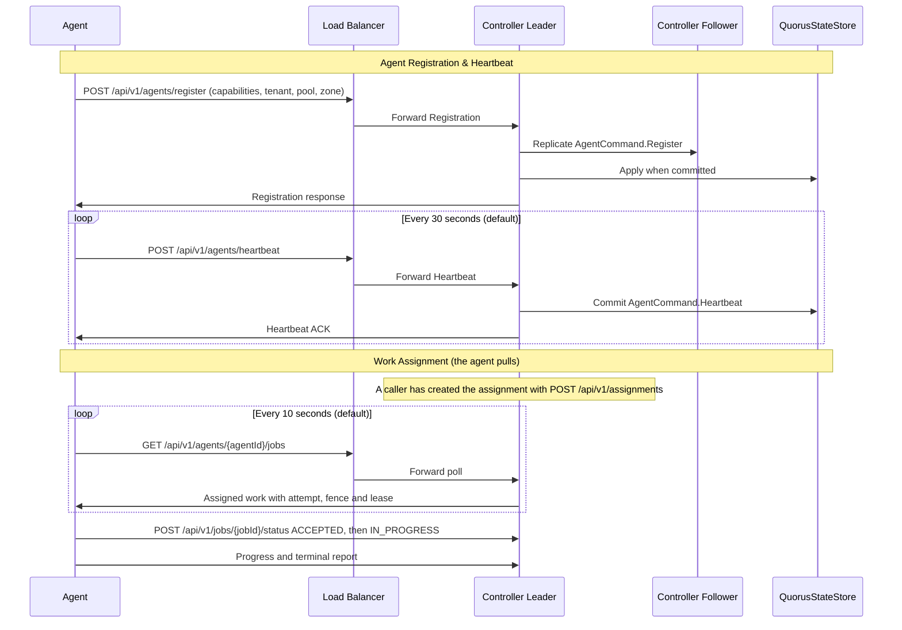
```mermaid
sequenceDiagram
    participant A as Agent
    participant LB as Load Balancer
    participant C1 as Controller Leader
    participant C2 as Controller Follower
    participant SS as QuorusStateStore

    Note over A,SS: Agent Registration & Heartbeat
    A->>LB: POST /api/v1/agents/register (capabilities, tenant, pool, zone)
    LB->>C1: Forward Registration
    C1->>C2: Replicate AgentCommand.Register
    C1->>SS: Apply when committed
    C1->>A: Registration response

    loop Every 30 seconds (default)
        A->>LB: POST /api/v1/agents/heartbeat
        LB->>C1: Forward Heartbeat
        C1->>SS: Commit AgentCommand.Heartbeat
        C1->>A: Heartbeat ACK
    end

    Note over A,SS: Work Assignment (the agent pulls)
    Note over C1: A caller has created the assignment with POST /api/v1/assignments
    loop Every 10 seconds (default)
        A->>LB: GET /api/v1/agents/{agentId}/jobs
        LB->>C1: Forward poll
        C1->>A: Assigned work with attempt, fence and lease
    end
    A->>C1: POST /api/v1/jobs/{jobId}/status ACCEPTED, then IN_PROGRESS
    A->>C1: Progress and terminal report
```

A write that reaches a follower is rejected with `503 NOT_LEADER` rather than forwarded, and the agent sends it again to the leader; the diagram shows the leader for simplicity. An agent whose registration no controller can take keeps trying; it stops only when a controller rejects the registration.

### Failure Detection and Recovery

**Heartbeat Monitoring:**
- **Heartbeat Interval (Current)**: 30 seconds by default (`QUORUS_AGENT_HEARTBEAT_INTERVAL_MS`)
- **Timeout Threshold (Target)**: Nothing on the controller marks an agent unhealthy or unreachable when heartbeats stop; heartbeat age is a target telemetry signal ([specification §12.8](../../docs/QUORUS_ARCHITECTURE_SPECIFICATION.md#128-infrastructure-telemetry))
- **Agent shutdown (Current)**: The agent waits a bounded time for its job threads, stops its health endpoint and deregisters with `DELETE /api/v1/agents/{agentId}`. The controller commits the deregistration through Raft and refuses it (`409`) while the agent holds an active assignment or attempt. An agent that finished assignments still reference is kept with status `deregistered` and gets no work until it registers again; an agent nothing references is removed. The agent logs any other answer, including `404`, as a failure
- **Health Checks (Target)**: The controller does not probe agents

**Failure Scenarios:**
- **Agent Failure**: Active work requires reconciliation; duplicate-safe automatic redistribution is not implemented
- **Network Partition**: An agent continues its current transfer; its reports fail until it can reach the leader again, and it retries an unacknowledged report at most three times before logging `Q-REPORT-UNRESOLVED`
- **Controller Failure**: Automatic leader election; writes pause until a new leader is elected
- **Partial Failure (Target)**: No degraded operating mode is defined

**Recovery Mechanisms:**
- **Automatic Recovery**: Attempt leases and fencing are implemented, but automatic duplicate-safe redistribution remains blocked until expiry scheduling, safe reassignment, destination enforcement, and reconciliation are implemented (`P2-01`, `P2-07`, `P2-08`)
- **State Persistence**: Job, attempt and assignment state is replicated in `QuorusStateStore` and survives controller failures under the quorum and storage assumptions
- **Backpressure (Target)**: No automatic throttling of overloaded agents; each agent bounds its own concurrent transfers

## Quorus Agent Fleet Management

**Status: Target**, apart from registration, heartbeats, polling and reporting described above. Fleet lifecycle requirements are in [specification §10.7](../../docs/QUORUS_ARCHITECTURE_SPECIFICATION.md#107-secure-agent-build-and-deployment-lifecycle); automatic assignment is register `ENG-01`.

Quorus Agents (`quorus-agent` module) are the transfer workers in the Quorus system. They poll the Quorus Controller cluster for their assignments, execute file transfers via protocol adapters (HTTP/HTTPS, FTP/FTPS, SFTP, SMB/CIFS, NFS), and report status back. In the target design the controller cluster manages the fleet and assigns jobs to agents based on capabilities, location, and health status; today it records the fleet and a caller makes each assignment.

### Quorus Agent Lifecycle Management

The diagram is the target lifecycle. The states actually recorded are the `AgentStatus` values `REGISTERING`, `HEALTHY`, `ACTIVE`, `IDLE`, `DEGRADED`, `OVERLOADED`, `MAINTENANCE`, `DRAINING`, `UNREACHABLE` and `FAILED`, reported by the agent itself; no controller logic moves an agent between them.

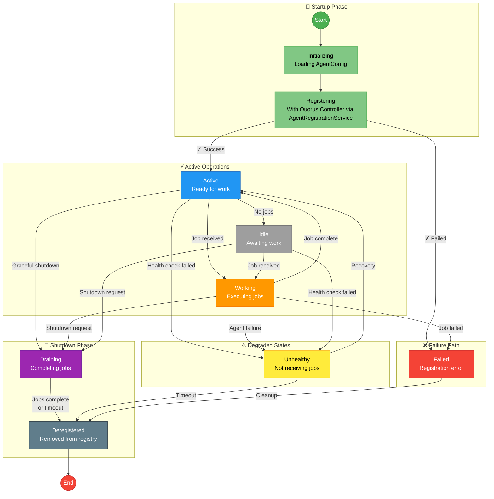
```mermaid
flowchart TB
    subgraph STARTUP ["🚀 Startup Phase"]
        START(("Start")) --> INIT["Initializing<br/>Loading AgentConfig"]
        INIT --> REG["Registering<br/>With Quorus Controller via AgentRegistrationService"]
    end

    subgraph ACTIVE_OPS ["⚡ Active Operations"]
        REG -->|"✓ Success"| ACTIVE["Active<br/>Ready for work"]
        ACTIVE -->|"Job received"| WORKING["Working<br/>Executing jobs"]
        ACTIVE -->|"No jobs"| IDLE["Idle<br/>Awaiting work"]
        WORKING -->|"Job complete"| ACTIVE
        IDLE -->|"Job received"| WORKING
    end

    subgraph DEGRADED ["⚠️ Degraded States"]
        ACTIVE -->|"Health check failed"| UNHEALTHY["Unhealthy<br/>Not receiving jobs"]
        WORKING -->|"Agent failure"| UNHEALTHY
        IDLE -->|"Health check failed"| UNHEALTHY
        UNHEALTHY -->|"Recovery"| ACTIVE
    end

    subgraph SHUTDOWN ["🛑 Shutdown Phase"]
        ACTIVE -->|"Graceful shutdown"| DRAINING["Draining<br/>Completing jobs"]
        WORKING -->|"Shutdown request"| DRAINING
        IDLE -->|"Shutdown request"| DRAINING
        DRAINING -->|"Jobs complete<br/>or timeout"| DEREG["Deregistered<br/>Removed from registry"]
        UNHEALTHY -->|"Timeout"| DEREG
    end

    subgraph FAILURE ["❌ Failure Path"]
        REG -->|"✗ Failed"| FAILED["Failed<br/>Registration error"]
        WORKING -->|"Job failed"| FAILED
        FAILED -->|"Cleanup"| DEREG
    end

    DEREG --> STOP(("End"))

    style START fill:#4CAF50,stroke:#2E7D32,color:#fff
    style STOP fill:#f44336,stroke:#c62828,color:#fff
    style ACTIVE fill:#2196F3,stroke:#1565C0,color:#fff
    style WORKING fill:#FF9800,stroke:#EF6C00,color:#fff
    style IDLE fill:#9E9E9E,stroke:#616161,color:#fff
    style UNHEALTHY fill:#FFEB3B,stroke:#F9A825,color:#000
    style DRAINING fill:#9C27B0,stroke:#6A1B9A,color:#fff
    style FAILED fill:#f44336,stroke:#c62828,color:#fff
    style DEREG fill:#607D8B,stroke:#37474F,color:#fff
    style INIT fill:#81C784,stroke:#4CAF50,color:#000
    style REG fill:#81C784,stroke:#4CAF50,color:#000
```

**Agent States (target lifecycle):**
- **Initializing**: Agent starting up, loading configuration
- **Registering**: Attempting registration with controller quorum
- **Active**: Ready to receive and execute transfer jobs
- **Working**: Currently executing one or more transfer jobs
- **Idle**: No active jobs, available for new work
- **Draining**: Graceful shutdown in progress, completing current jobs
- **Unhealthy**: Failed health checks, not receiving new jobs
- **Deregistered**: Removed from agent registry, or kept with status `deregistered` while its transfer history references it

### Dynamic Scaling and Load Balancing

**Target** (register `ENG-01`): no controller component distributes work today; `AgentSelectionService`, which would apply tenant, pool, zone, capacity and protocol rules, is never constructed.

**Intelligent Work Distribution:**
- **Route Assignment**: Agents assigned to routes based on capabilities and location
- **Capacity-Based**: Jobs assigned based on available agent capacity within routes
- **Location-Aware**: Prefer agents closer to source/destination when defining routes
- **Protocol-Specific**: Route jobs to agents with required protocol support
- **Load Balancing**: Even distribution across available agents serving same route endpoint
- **Affinity Rules**: Support for agent affinity and anti-affinity in route configurations

**Scaling Strategies:**
- **Horizontal Scaling**: Add more agents to increase route endpoint capacity
- **Vertical Scaling**: Upgrade agent resources (CPU, memory, bandwidth)
- **Geographic Scaling**: Deploy agents across multiple data centers for regional routes
- **Protocol Scaling**: Specialized agents for specific protocol requirements in routes
- **Route Failover**: Backup agents configured for critical routes

**Resource Optimization:**
- **CPU Utilization**: Monitor and optimize CPU usage across Quorus Agents
- **Memory Management**: Efficient memory allocation for concurrent transfers
- **Bandwidth Utilization**: Maximize network bandwidth usage
- **Storage Optimization**: Efficient temporary storage management

## Scalability Architecture

**Status: Target.** Measured results, where they exist, are in the [benchmark specification](../performance/QUORUS_PERFORMANCE_BENCHMARKS.md) and its results log, not here.

### Performance Targets

**Quorus Agent Fleet Capacity:**

The figures below are target workloads that require reproducible benchmark and failure evidence; they are not current supported-scale guarantees.
- **Agent Support**: 100+ Quorus Agents per Quorus Controller cluster
- **Concurrent Transfers**: 10,000+ simultaneous transfers across fleet
- **Heartbeat Processing**: 1,000+ heartbeats/second through `POST /api/v1/agents/heartbeat` (each heartbeat is a Raft commit today)
- **Job Throughput**: 100+ jobs/second assignment and completion
- **Geographic Distribution**: Multi-region Quorus Agent deployment support

**Quorus Controller Cluster Performance:**
- **Request Throughput**: 10,000+ requests/second via `HttpApiServer`
- **State Replication**: Sub-100ms replication latency via `GrpcRaftTransport`
- **Leader Election**: Sub-5 second failover time (bounded below by `QUORUS_RAFT_ELECTION_TIMEOUT_MS`; the timer is drawn between one and two times that value)
- **Memory Usage**: Efficient in-memory state management in `QuorusStateStore`
- **Disk I/O**: Optimized persistent storage for Raft logs

### Horizontal Scaling Strategies

**Quorus Controller Scaling:**
- **Quorum Expansion**: Future capability requiring safe dynamic-membership semantics; current membership is static
- **Read Replicas**: Target-state query scaling with an explicit read-consistency and staleness contract
- **Sharding**: Target-state partitioning of agents across controller clusters with explicit ownership and transfer-routing semantics
- **Federation**: Target-state multi-cluster design requiring identity, policy, consistency, recovery, and cross-cluster operational contracts

**Quorus Agent Scaling:**
- **Linear Scaling**: Add Quorus Agents to linearly increase transfer capacity
- **Auto-Scaling**: Target-state provisioning based on demand, constrained by secure enrollment, signed artifacts, policy, drain, and revocation
- **Elastic Scaling**: Target-state scale-down that preserves active-attempt and reconciliation safety
- **Burst Capacity**: Temporary capacity increases for peak loads

**Storage Scaling:**
- **Distributed Storage**: Scale storage independently of compute
- **Replication**: Multi-replica storage for high availability
- **Partitioning**: Partition data across multiple storage nodes
- **Caching**: Intelligent caching for frequently accessed data

### Network Architecture

**High Availability Networking:**
- **Load Balancers**: `nginx` load balancer that stops routing to a controller after repeated failures (current in the compose topology); leader-aware routing is target
- **Network Redundancy**: Multiple network paths between Quorus Controllers and Quorus Agents
- **Bandwidth Aggregation**: Combine multiple network interfaces
- **Quality of Service**: Network QoS for transfer prioritization

**Security and Isolation:**
- **Network Segmentation (Target)**: Isolated networks per tenant; the compose topologies use one shared network
- **Implemented control-plane encryption**: the production profile requires TLS 1.3 mutual authentication for controller HTTP and Raft, and agents support certificate-authenticated HTTPS
- **Implemented identity boundary**: trusted gateway subjects and direct certificate bindings resolve callers before tenant, role, and scope policy is evaluated
- **Remaining deployment boundary**: corporate PKI accreditation, agent enrollment and rotation, peer-to-node binding, and complete telemetry/evidence transport validation remain open; see [Architecture Specification §3](../../docs/QUORUS_ARCHITECTURE_SPECIFICATION.md#3-capability-status) and the [Security Deployment Guide](../../docs/QUORUS_SECURITY_DEPLOYMENT_GUIDE.md)

## Core Components

**Status: Partly current.** Classes checked against the source on 2026-10-03; features marked *Target* do not exist yet.

### 1. Transfer Engine (`quorus-core`)

The `quorus-core` module provides the foundation for file transfer capabilities. It runs in the agent (and in any application that calls it directly), not in the controller.

**Key Components:**
- `TransferEngine` / `SimpleTransferEngine`: Main interface for transfer operations; blocking, one transfer per calling thread under a concurrency limit
- `TransferProtocol`: Pluggable protocol implementations registered by `ProtocolFactory` (`HttpTransferProtocol` for `http`/`https`, `FtpTransferProtocol` for `ftp`/`ftps`, `SftpTransferProtocol`, `SmbTransferProtocol` for `smb`/`cifs`, `NfsTransferProtocol`)
- `ProgressTracker`: Progress monitoring
- `ChecksumCalculator`: Checksum calculation
- `TransferEngineHealthCheck`, `ProtocolHealthCheck`: In-process health reporting

**Features:**
- **Internal network protocols** (HTTP/HTTPS, SMB/CIFS, NFS, FTP/FTPS, SFTP)
- **Concurrent transfer management** under a configured concurrency limit
- **Retry mechanisms** with linear backoff (`n × retryDelayMs`)
- **Progress tracking** with bytes transferred and rate
- **Integrity verification before success (Target, `P2-06`)**: checksums can be calculated, but a transfer is not yet refused success on a mismatch
- **Network-aware routing (Target)** for internal path selection

### 2. Multi-Tenant Management (quorus-tenant)

**Partly current.** Target-state enterprise multi-tenancy with authenticated isolation and resource management. Today `quorus-tenant` is an in-process library the controller does not use; the controller's tenant boundary is the identity-derived tenant check (see [Multi-Tenancy and YAML Workflow Schemas](#multi-tenancy-and-yaml-workflow-schemas)).

**Key Components (current):**
- `TenantService` / `SimpleTenantService`: Tenant lifecycle, hierarchy, effective configuration
- `ResourceManagementService` / `SimpleResourceManagementService`: Usage tracking and transfer-request validation against quotas
- `Tenant`, `TenantConfiguration`, `ResourceUsage`: Model

**Features:**
- Hierarchical tenant structure (current, in-process)
- Resource quotas and limits (current, in-process; not enforced by the controller)
- Data isolation strategies (Target)
- Cross-tenant security controls (Target)
- Compliance and governance (Target)

### 3. YAML Workflow Engine (quorus-workflow)

**Current.** Declarative workflow definition and in-process execution system.

**Key Components:**
- `WorkflowDefinitionParser` / `YamlWorkflowDefinitionParser`: YAML parsing and validation, with `WorkflowSchemaValidator`
- `WorkflowEngine` / `SimpleWorkflowEngine`: Workflow execution orchestration
- `DependencyGraph`: Dependency analysis, cycle detection and topological ordering
- `VariableResolver`: `{{name}}` substitution

**Features:**
- Declarative YAML definitions
- Group dependencies with `parallelism`-bounded rounds
- Conditional execution (Target: `condition` expressions are parsed and variable-resolved but never evaluated, register `ENG-14`)
- Dry run and virtual run modes
- Variable substitution

## Multi-Tenancy and YAML Workflow Schemas

**Status: Target** for multi-tenancy beyond the current checks; **Current** reference elsewhere for YAML.

- **Multi-tenancy.** The multi-tenant architecture that stood here (tenant, workflow, security and storage service interfaces, cross-tenant workflows, data-sharing agreements) is archived section K; most of its interfaces do not exist. What exists: `quorus-tenant` holds the `Tenant` and `TenantConfiguration` model with a parent–child hierarchy, `TenantService`/`SimpleTenantService` and `ResourceManagementService`/`SimpleResourceManagementService`, all in-process and used by no controller code. Tenant enforcement in the controller is the identity-derived tenant check on transfers, agents, assignments and routes ([specification §3](../../docs/QUORUS_ARCHITECTURE_SPECIFICATION.md#3-capability-status), "Authenticated tenant derivation and tenant checks"). The tenant-governance requirements are in [Tenant, Quota, Policy, and Resource Governance](#tenant-quota-policy-and-resource-governance) above.
- **YAML schemas.** The workflow YAML examples that stood here (`kind: Transfer`, `kind: TransferGroup`, tenant blocks, `${date:…}` and `${env:…}` built-ins) are archived section L because the parser does not accept them. The accepted syntax is documented in the [YAML Syntax Guide](../../docs/QUORUS_YAML_SYNTAX_GUIDE.md).

## Workflow Engine Architecture

**Status: Current**, except where marked. Checked against `quorus-workflow` on 2026-10-03. The engine runs in-process in whatever application calls it (today the integration examples); the controller does not run it and has no workflow REST resources, and durable distributed workflow execution is target ([specification §8.2](../../docs/QUORUS_ARCHITECTURE_SPECIFICATION.md#82-workflows)). The former "Transfer Process Flow" sequence diagrams are archived section M.

### Core Components

#### 1. YAML Parser & Validator
```java
// Package dev.mars.quorus.workflow; implemented by YamlWorkflowDefinitionParser
public interface WorkflowDefinitionParser {
    WorkflowDefinition parse(Path yamlFile) throws WorkflowParseException;
    WorkflowDefinition parseFromString(String yamlContent) throws WorkflowParseException;
    ValidationResult validate(WorkflowDefinition definition);
    DependencyGraph buildDependencyGraph(List<WorkflowDefinition> definitions) throws WorkflowParseException;
    ValidationResult validateSchema(String yamlContent);
}
```

#### 2. Workflow Engine
```java
public interface WorkflowEngine {
    // Blocking: each returns the finished execution (RT-04)
    WorkflowExecution execute(WorkflowDefinition definition, ExecutionContext context) throws InterruptedException;
    WorkflowExecution dryRun(WorkflowDefinition definition, ExecutionContext context) throws InterruptedException;
    WorkflowExecution virtualRun(WorkflowDefinition definition, ExecutionContext context) throws InterruptedException;

    // Monitoring and control
    WorkflowStatus getStatus(String executionId);
    boolean cancel(String executionId);   // stops a running execution; it ends CANCELLED
    void shutdown();
}
```

#### 3. Dependency Graph

There is no `DependencyResolver` interface. `DependencyGraph` (a class) holds the transfer groups and their `dependsOn` edges and provides `addGroup`, `getDependencies`, `hasCycles` and `topologicalSort()`; `SimpleWorkflowEngine` runs the sorted groups in rounds of at most `parallelism` groups whose dependencies have run.

#### 4. Variable Resolver

`VariableResolver` is a class, not an interface. It substitutes `{{name}}` in strings, transfer definitions, groups and whole workflow definitions. A name is looked up in the context variables, then the global variables (the workflow's `variables`), then the process environment, then JVM system properties. There are no built-in functions such as `${date:…}`, `${env:…}` or `${file:…}`, and nested references are resolved in one pass only (a reference inside a variable's value stays literal) and references to earlier transfer results are not supported.

```java
public class VariableResolver {
    public VariableResolver(Map<String, Object> globalVariables) { ... }
    public VariableResolver withContext(Map<String, Object> contextVariables) { ... }
    public String resolve(String template) throws VariableResolutionException { ... }
    public WorkflowDefinition resolve(WorkflowDefinition workflow) throws VariableResolutionException { ... }
}
```

### Execution Modes

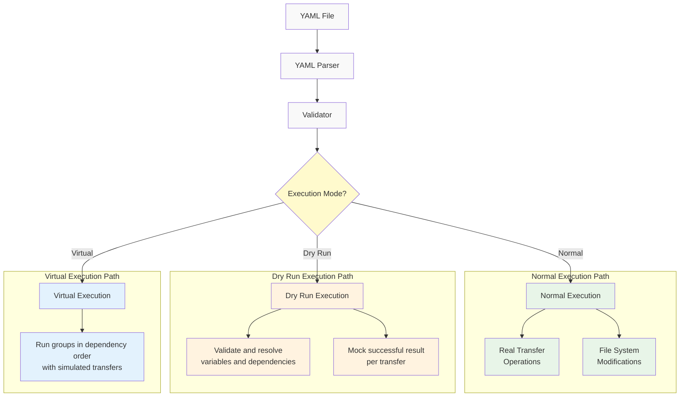
```mermaid
graph TD
    YF[YAML File] --> VP[YAML Parser]
    VP --> VV[Validator]
    VV --> DR{Execution Mode?}

    DR -->|Normal| NE[Normal Execution]
    DR -->|Dry Run| DRE[Dry Run Execution]
    DR -->|Virtual| VE[Virtual Execution]

    subgraph "Normal Execution Path"
        NE --> RTO[Real Transfer<br/>Operations]
        NE --> FSM[File System<br/>Modifications]
    end

    subgraph "Dry Run Execution Path"
        DRE --> VSV[Validate and resolve<br/>variables and dependencies]
        DRE --> RWE[Mock successful result<br/>per transfer]
    end

    subgraph "Virtual Execution Path"
        VE --> STM[Run groups in dependency order<br/>with simulated transfers]
    end

    %% Styling
    style YF fill:#f9f9f9
    style VP fill:#f9f9f9
    style VV fill:#f9f9f9
    style DR fill:#fffacd

    style NE fill:#e8f5e8
    style RTO fill:#e8f5e8
    style FSM fill:#e8f5e8

    style DRE fill:#fff3e0
    style VSV fill:#fff3e0
    style RWE fill:#fff3e0

    style VE fill:#e3f2fd
    style STM fill:#e3f2fd
```

A definition's `execution.dryRun` or `execution.virtualRun` flag can only make a run safer: a dry run wins over a virtual run, and both over a normal run.

#### 1. Normal Execution
- Full transfer execution through the core transfer engine with real network operations
- File system modifications
- Workflow metrics and logging

#### 2. Dry Run
- Parse, validate, resolve variables and order dependencies
- Record a mock successful result for every transfer without starting any transfer
- Connectivity checks (Target): a dry run does not contact any endpoint

#### 3. Virtual Run
- Run the groups in dependency order, honouring `parallelism`, with each transfer simulated (about 100 ms) and no transfer started
- Performance estimation and resource-usage prediction (Target): not implemented

## Design Principles

**Status: Target.** Principles for the target design. Modularity and declarative YAML workflows exist today; the corporate integrations named below (directory services, SIEM, corporate monitoring and notification systems) do not.

### 1. Internal Network Optimization
- **High-throughput transfers** leveraging corporate network bandwidth
- **Protocol selection** optimized for internal network characteristics
- **Network-aware routing** for optimal internal path selection
- **Corporate infrastructure integration** (AD, PKI, monitoring)

### 2. Modularity
- Clear separation between core engine and enterprise features
- Pluggable architecture for protocols and storage
- Independent module development and testing
- **Corporate system integration** modules

### 3. Multi-Tenancy for Corporate Structure
- **Department and team-based** tenant isolation
- **Corporate hierarchy** alignment with organizational structure
- **Resource quotas** based on business unit allocations
- **Cost center integration** for chargeback and reporting

### 4. Declarative Configuration
- **YAML-based workflow definitions** for corporate data operations
- **Infrastructure-as-code** approach for corporate governance
- **Version-controlled** transfer configurations in corporate repositories
- **Corporate approval workflows** for configuration changes

### 5. Target-State Enterprise Security
- **Corporate directory integration** (Active Directory, LDAP)
- **Certificate-based authentication** using corporate PKI
- **Network-level security** through corporate firewalls and VLANs
- **Data classification** and handling for corporate data governance
- **Audit logging** integrated with corporate SIEM systems

### 6. Corporate Observability
- **Corporate monitoring system** integration (Splunk, DataDog, etc.)
- **Real-time progress tracking** with corporate dashboard integration
- **Alerting** through corporate notification systems (Exchange, Teams)
- **Compliance reporting** for corporate audit requirements

## Operational Improvements

**Status: Partly current.** Build, image, environment variables, endpoints and log commands checked on 2026-10-03; the [Docker guide](../../docker/README.md) is the operational reference and wins where this section is briefer.

### Deployment Automation

#### Docker Compose Configurations

Build the jars on the host first; images copy the host-built jar and never run Maven ([Docker guide](../../docker/README.md#building-images)):

```bash
./docker/build-runtime.ps1        # or: sh docker/build-runtime.sh
```

**Three-controller cluster with load balancing (development security profile):**
```bash
docker compose -f docker/compose/docker-compose-controller-first.yml up -d --build

# Services started:
# - 3 controller nodes (ports 8081-8083)
# - nginx load balancer (port 8080); not leader-aware
# - Container health checks on /health/live
```

**Single-controller development setup:**
```bash
docker compose -f docker/compose/docker-compose-single-controller.yml up -d --build

# Services started:
# - Single controller with embedded API on port 8080
```

**Logging stack:**
```bash
docker compose -f docker/compose/docker-compose-loki.yml up -d

# Services started:
# - Loki for log aggregation
# - Promtail for log collection
# - Grafana for visualization (port 3010)
# - Prometheus for metrics
```

The compose files list every topology, including the five-node, full-network, mutual-TLS and observability stacks. `docker/start.ps1` is an older launcher that does not build the jars; prefer the commands above.

#### Build and Deployment Pipeline

**Maven Build Configuration:**
- **Shade Plugin**: Creates executable JAR with all dependencies
- **Main Class**: `dev.mars.quorus.controller.QuorusControllerApplication`
- **Health Checks**: Integrated Docker health monitoring on `/health/live`
- **Single-Stage Image**: The image copies the jar built on the host; Java and Maven never run inside Docker

**Docker Configuration:**
```dockerfile
# Single-stage runtime image. It copies the controller jar built and tested on the host;
# Maven and javac never run inside Docker. Build the jar first with docker/build-runtime.*.
ARG RUNTIME_IMAGE=amazoncorretto:27.0.0-alpine3.24
FROM ${RUNTIME_IMAGE}
RUN apk add --no-cache curl
RUN addgroup -g 1001 quorus && \
    adduser -D -s /bin/sh -u 1001 -G quorus quorus
WORKDIR /app
COPY quorus-controller/target/quorus-controller-*.jar app.jar
RUN mkdir -p /app/logs /app/data && \
    chown -R quorus:quorus /app
USER quorus
EXPOSE 8080 9080
# Health check follows the configured HTTP transport; the HTTPS probe presents a client
# certificate because production HTTP requires mutual TLS.
HEALTHCHECK --interval=10s --timeout=5s --start-period=15s --retries=3 \
    CMD if [ "${QUORUS_SECURITY_HTTP_TLS_ENABLED:-true}" = "true" ]; then \
      curl --fail --silent --show-error --insecure \
        --cert "${QUORUS_HEALTHCHECK_CLIENT_CERTIFICATE:-$QUORUS_SECURITY_HTTP_TLS_CERTIFICATE}" \
        --key "${QUORUS_HEALTHCHECK_CLIENT_PRIVATE_KEY:-$QUORUS_SECURITY_HTTP_TLS_PRIVATE_KEY}" \
        "https://localhost:${QUORUS_HTTP_PORT}/health/live"; \
      else \
        curl --fail --silent --show-error "http://localhost:${QUORUS_HTTP_PORT}/health/live"; \
      fi
CMD ["sh", "-c", "java $JAVA_OPTS -jar app.jar"]
```

The full file, including the environment defaults, is `quorus-controller/Dockerfile`. It has no `ENTRYPOINT`.

### Configuration Management

#### Environment Variables

**Controller Configuration** (as set by `docker-compose-controller-first.yml` for `controller1`, abridged; names follow [Module Configuration Architecture](#module-configuration-architecture)):
```bash
QUORUS_NODE_ID=controller1              # Unique node identifier
QUORUS_RAFT_PORT=9080                   # Raft gRPC port (there is no Raft bind-host variable)
QUORUS_HTTP_PORT=8080                   # HTTP API port (HttpApiServer)
QUORUS_CLUSTER_NODES=controller1=controller1:9080,controller2=controller2:9080,controller3=controller3:9080
QUORUS_RAFT_ELECTION_TIMEOUT_MS=3000    # Raft election timeout (packaged default 5000)
QUORUS_RAFT_HEARTBEAT_INTERVAL_MS=500   # Raft heartbeat interval (packaged default 1000)
QUORUS_RAFT_STORAGE_PATH=/app/data/raft # Mounted durable volume
QUORUS_SECURITY_PROFILE=development     # The packaged default is production
JAVA_OPTS=-Xmx512m -Xms256m             # JVM configuration
```

The unprefixed `ELECTION_TIMEOUT_MS` and `HEARTBEAT_INTERVAL_MS` are not read by the controller.

**Load Balancer Configuration:**
```nginx
upstream quorus_controllers {
    server controller1:8080 max_fails=3 fail_timeout=30s;
    server controller2:8080 max_fails=3 fail_timeout=30s;
    server controller3:8080 max_fails=3 fail_timeout=30s;
}
```

### Monitoring and Observability

#### Comprehensive Health Monitoring

**Health Check Endpoints (served by `HttpApiServer`):**
- `/health` - Quorus Controller health including Raft state (LEADER/FOLLOWER/CANDIDATE)
- `/health/ready` - Service readiness (Raft running and a leader known)
- `/health/live` - Process liveness
- `/status` - Detailed status information
- `/raft/status` - Raft state
- `/metrics` - Prometheus metrics (`quorus_cluster_*`, `quorus_raft_*`); with telemetry enabled the Prometheus exporter also listens on port 9464

**Key Metrics Tracked:**
- Quorus Controller cluster health (`quorus_cluster_state`, `quorus_cluster_is_leader`)
- Raft consensus status (`quorus_cluster_term`, `quorus_cluster_commit_index`)
- Controller state counts (`quorus_jobs_*`, `quorus_agents_total`, `quorus_routes_total`)
- Agent and transfer metrics, exported by the agent process (`quorus_agent_*`, `quorus_transfer_*`)

#### Log Aggregation

**Structured Logging:**
- Pattern-formatted console logs with MDC fields (node ID, Raft role and term, request ID)
- A JSON rolling-file appender at `/app/logs/controller.json` for machine parsing
- Correlation IDs for request tracing

**Centralized Collection:**
- Promtail collects container logs labelled `logging=promtail`
- Loki for log storage and indexing
- Grafana for log visualization
- Alert rules for critical events (Target)

### Operational Scripts

#### Management Commands

Use `docker compose` directly (see the [Docker guide](../../docker/README.md)):

```bash
docker compose -f docker/compose/docker-compose-controller-first.yml ps       # status
docker compose -f docker/compose/docker-compose-controller-first.yml logs -f  # logs
docker compose -f docker/compose/docker-compose-controller-first.yml down     # stop
```

The PowerShell helpers under `docker/scripts/` and `docker/test-data/` (`send-heartbeat.ps1`, `check-agents.ps1`, `demo-logging.ps1`, `test-transfers.ps1`, `start-full-network.ps1`) do not work against the current topologies (register `ENG-19`).

#### Troubleshooting Tools

**Health Validation:**
```bash
# Check individual controller health (development topology, plain HTTP)
curl http://localhost:8081/health
curl http://localhost:8082/health
curl http://localhost:8083/health

# Through the load balancer: /health is answered by nginx itself (ENG-18);
# /health/ready reaches a controller
curl http://localhost:8080/health/ready
```

**Log Analysis:**
```bash
# View controller logs
docker logs quorus-controller1 --tail 50

# View load balancer logs
docker logs quorus-loadbalancer --tail 50
```

### Performance Optimization

**Target.** General guidance, not measured configuration; measured baselines are in the [benchmark specification](../performance/QUORUS_PERFORMANCE_BENCHMARKS.md).

#### Resource Configuration

**JVM Tuning:**
- Heap size optimization based on load
- Garbage collection tuning for low latency
- JIT compilation optimization

**Network Optimization:**
- Connection pooling for Raft communication (current: one gRPC channel per peer, bounded I/O pool)
- HTTP keep-alive for API connections
- Load balancer connection limits

**Storage Optimization:**
- Persistent volumes for data durability (current: named volumes at `/app/data` in the compose files)
- Log rotation and cleanup policies
- Backup and recovery procedures

## Future Enhancements

**Status: Target.** None of the items below is planned in the implementation plan unless the plan says so.

**Advanced Protocol Support:**
- Additional protocols (S3, Azure Blob, Google Cloud Storage) *(expanded from "FTP, SFTP, S3")*
- Protocol-specific optimizations and features
- Custom protocol plugin architecture *(expanded from "Custom protocol development SDK")*
- Protocol conversion and transformation

**Advanced Workflow Features:**
- Conditional execution and loops in workflows *(expanded from "loops, conditions")*
- Dynamic workflow generation and templating
- Workflow versioning and rollback capabilities
- Advanced dependency management with complex conditions
- Real-time workflow modification and updates

**Machine Learning and AI:**
- Transfer optimization using machine learning *(expanded from "Machine learning for optimization")*
- Predictive failure detection and prevention
- Intelligent routing and path selection
- Bandwidth optimization algorithms
- Performance prediction and capacity planning

**Advanced Security and Governance:**
- End-to-end encryption with key rotation
- Advanced audit trails and compliance reporting *(expanded from "Advanced governance and compliance")*
- Integration with enterprise identity systems *(expanded from "Integration with enterprise systems")*
- Zero-trust security model implementation
- Advanced threat detection and response

**Performance Optimizations:**
- Transfer acceleration techniques (compression, deduplication)
- Intelligent caching and prefetching strategies
- Advanced bandwidth management and QoS
- Multi-path transfer optimization
- Real-time streaming transfers with low latency *(expanded from "Real-time streaming transfers")*

**Cloud-Native Features:**
- Kubernetes operator for automated deployment
- Service mesh integration (Istio, Linkerd)
- Cloud provider native integrations
- Serverless transfer execution options
- Governed container-based agent deployment (an agent image exists for development topologies today)

## Related Documents

**Status: Current.**

- **[Canonical Architecture Specification](../../docs/QUORUS_ARCHITECTURE_SPECIFICATION.md)** - Current guarantees, boundaries, and release requirements
- **[Canonical REST API Specification](../../docs/QUORUS_REST_API_SPECIFICATION.md)** - Complete control, operations, security, and administration API contract
- **[Enterprise Implementation Plan](../task/QUORUS_ENTERPRISE_IMPLEMENTATION_PLAN.md)** - Phased delivery, dependencies, verification, and exit gates
- **[Outstanding Work Register](../task/QUORUS_OUTSTANDING_WORK_REGISTER.md)** - Every open task cited here (`ENG-*`, `SEC-*`, `ARCH-*`, `P2-*`, `RT-*`, `CE-*`)
- **[OpenAPI contract](../../quorus-controller/src/main/resources/openapi/quorus-controller-v1.yaml)** - The current HTTP API, also served at `GET /api/v1/openapi.yaml`
- **[YAML Syntax Guide](../../docs/QUORUS_YAML_SYNTAX_GUIDE.md)** - Accepted workflow syntax
- **[Docker guide](../../docker/README.md)** - Building images and running the compose topologies
- **[ADR-0011](../architecture-decisions/ADR-0011-CONSENSUS-VIA-QRAFT-GENERIC-ENGINE.md)** and **[ADR-0012](../architecture-decisions/ADR-0012-JAVA-RUNTIME-AND-STRUCTURED-CONCURRENCY.md)** - Consensus via QRaft; the controller off Vert.x
- **[Archived sections](../archive/QUORUS_SYSTEM_DESIGN_ARCHIVED_SECTIONS.md)** - Sections removed from this document in version 4.0, kept verbatim

## Conclusion

**Status: Partly current.**

The Quorus comprehensive system design describes a target foundation for enterprise file-transfer operations with:

### Core Architectural Strengths

- **Controller-First Architecture**: Self-contained nodes with static membership in the current runtime
- **Distributed Consensus**: Raft-based coordination; committed writes are strongly ordered, follower reads may be stale
- **High Availability Target**: Load-balanced deployment, leader election, proven durable storage, and recovery gates
- **Multi-tenant Target**: Authenticated isolation, organizational hierarchy, quotas, and policy
- **Declarative Workflows**: YAML-based infrastructure-as-code approach

### Operational Excellence

- **Transfer Operations Monitoring**: Per-transfer progress, deadlines, risk, stalls, attempts, integrity, publication, alerts, and timelines
- **Deployment Governance**: Signed artifacts, configuration promotion, controlled rollout, drain, rollback, and evidence
- **Fault-Tolerance Target**: Tested quorum, storage, reconciliation, backup, restore, and degraded-operation behavior
- **Performance Evidence**: Reproducible workload-specific validation against release gates
- **Enterprise Security Target**: Identity, authorization, TLS/mTLS, service trust, secret references, agent lifecycle, and audit

### Scalability and Reliability

- **Controller Scaling**: Static membership sized before startup; live membership change remains future work
- **Quorus Agent Fleet Management**: Target capacity must be supported by measured scheduling, telemetry, identity, and rollout evidence
- **Fault Recovery**: Controller recovery plus conservative transfer reconciliation until duplicate-safe reassignment is implemented
- **Load Distribution**: `nginx` load balancer spreads requests across the controllers; leader-aware routing is target
- **Data Consistency**: Strongly ordered committed state via `RaftNode` and `QuorusStateStore` across `quorus-controller1`, `quorus-controller2`, `quorus-controller3`
- **Work Distribution (Target)**: No assignment scheduler runs yet (`ENG-01`); assignments are made through `POST /api/v1/assignments`

The modular design is intended to scale from simple single-tenant deployments to complex multi-tenant enterprise scenarios. Current guarantees, supported scale, and production release gates are defined only by the canonical architecture specification and its verification evidence.
