# Quorus Comprehensive System Design

**Version:** 2.3  
**Date:** 26 August 2025  
**Author:** Mark Andrew Ray-Smith Cityline Ltd  
**Updated:** 2026-02-01  

## Technology Stack

| Technology | Version | Purpose |
|------------|---------|---------|
| **Java** | 21 (LTS) | Runtime platform with virtual threads support |
| **Vert.x** | 5.0.2 | Reactive toolkit for HTTP server, event bus, and async operations |
| **gRPC** | 1.68.1 | High-performance RPC for Raft consensus transport |
| **Protocol Buffers** | 3.25.5 | Binary serialization for Raft messages |
| **Jackson** | 2.18.2 | JSON serialization for REST API |
| **JUnit** | 5.10.1 | Testing framework |
| **TestContainers** | 2.0.2 | Docker-based integration testing |
| **Maven** | 3.9+ | Build and dependency management |

## Overview

Quorus is an enterprise-grade **route-based distributed file transfer system** designed for high reliability, scalability, and multi-tenant operation within corporate network environments. The system uses predefined transfer routes as the primary configuration method, where the central controller manages route definitions between agents (e.g., "Agent A → Agent B"). The system is optimized for internal corporate network transfers, providing both route-based configurations and declarative YAML-based workflow definitions for complex file transfer orchestration with comprehensive multi-tenancy support.

## Executive Synopsis

- **Mission & Scope**: Provide secure, controller-first orchestration for high-throughput, internal corporate transfers spanning data-center sync, departmental distribution, ETL staging, and compliance-driven backups. Transfers are orchestrated through predefined routes that define source and destination agents, with multiple trigger mechanisms (event-based, time-based, interval-based, batch-based). Reliability is anchored by Raft consensus, while extensibility comes from REST APIs plus declarative YAML workflows and route configurations.
- **Platform Pillars**: (1) Workflow engine with dependency graphs, dry/virtual runs, and templating. (2) Multi-tenant governance with hierarchical quotas and policy inheritance. (3) Real-time observability through Prometheus/Grafana/Splunk hooks, predictive ETAs, and Loki-based log aggregation. (4) Zero-trust security posture using TLS 1.3, AES-256, OAuth2/JWT, MFA, PKI, and audit-ready telemetry that maps to SOX, GDPR, HIPAA, PCI, and ISO 27001 controls.
- **Controller-First Architecture**: Every controller node embeds the HTTP API, Raft engine, scheduler, and state machine—removing the API-first bottleneck, offering sub-second failover, and enabling horizontal scale by simply adding nodes to the quorum.
- **Module Snapshot**:

  | Module | Purpose | Key Classes |
  |--------|---------|-------------|
  | `quorus-core` | Transfer primitives, protocol adapters (`HttpTransferProtocol`, `SftpTransferProtocol`, `FtpTransferProtocol`, `SmbTransferProtocol`), `SimpleTransferEngine` with Vert.x `WorkerExecutor` | `TransferEngine`, `ProtocolFactory`, `TransferJob`, `TransferRequest` |
  | `quorus-workflow` | YAML parsing via `YamlWorkflowDefinitionParser`, validation with `WorkflowSchemaValidator`, dependency resolution via `DependencyGraph` | `WorkflowEngine`, `SimpleWorkflowEngine`, `WorkflowDefinition`, `TransferGroup` |
  | `quorus-tenant` | Tenant registry, quotas via `ResourceManagementService`, hierarchical tenant model | `TenantService`, `SimpleTenantService`, `Tenant`, `TenantConfiguration` |
  | `quorus-controller` | Vert.x 5 verticle runtime with gRPC Raft transport, `RaftNode` consensus, embedded `HttpApiServer` | `QuorusControllerVerticle`, `GrpcRaftTransport`, `GrpcRaftServer`, `QuorusStateMachine` |
  | `quorus-agent` | Distributed transfer worker that polls controller for jobs, executes file transfers via protocol adapters, sends heartbeats and status reports | `QuorusAgent`, `JobPollingService`, `TransferExecutionService`, `HeartbeatService`, `AgentRegistrationService` |
  | `quorus-integration-examples` | Runnable demos for transfers, workflows, validation scenarios | Generates representative corporate datasets for testing |
  | `docker/agents`, `docker/compose/*` | Production-like agent fleet, transfer servers, and observability stack | Validates multi-region agents, real protocols (FTP/SFTP/HTTP/SMB), and failover |

### Primary Use Cases

Quorus is designed primarily for **internal corporate network file transfers**, including:

- **Data center to data center** transfers within the same organization
- **Department to department** file sharing and data distribution
- **Application to application** data synchronization across internal systems
- **Backup and archival** operations within corporate infrastructure
- **ETL pipeline** data movement between internal databases and storage systems
- **Multi-tenant SaaS** file operations within controlled network environments
- **Hybrid cloud** transfers between on-premises and private cloud infrastructure

The system is architected to leverage the **high bandwidth, low latency, and trusted security** characteristics of internal corporate networks while providing enterprise-grade reliability, monitoring, and governance.

## System Architecture

### Controller-First Architecture

Quorus follows a **controller-first architecture** where each Quorus Controller (e.g., `quorus-controller1`, `quorus-controller2`, `quorus-controller3`) is a self-contained process with an embedded `HttpApiServer`. This design provides natural scaling, fault tolerance, and eliminates single points of failure.

#### Core Design Principles

1. **Controller Ownership**: Each Quorus Controller owns its `HttpApiServer` as an embedded capability
2. **Self-Contained Processes**: Each Quorus Controller container is independently deployable and scalable
3. **Distributed Consensus**: Raft consensus (via `RaftNode` and `GrpcRaftTransport`) ensures data consistency across the 3-node Quorus Controller cluster
4. **Natural Scaling**: Add/remove Quorus Controller containers without architectural changes
5. **No Single Point of Failure**: Any single Quorus Controller can fail; the remaining 2 maintain quorum

### High-Level Distributed Architecture

The diagram below shows how Quorus organizes its distributed file transfer system into three tiers: **Clients**, **Control Plane**, and **Agent Fleet**.

#### Architectural Tiers

| Tier | Components | Responsibility |
|------|------------|----------------|
| **Clients** | CLI, REST API, Web Dashboard, YAML workflows | Submit transfer requests and workflow definitions to the Quorus Controller cluster |
| **Control Plane** | 3-node Quorus Controller cluster (`quorus-controller1`, `quorus-controller2`, `quorus-controller3`) | Leader election via `RaftNode`, state replication via `GrpcRaftTransport`, workflow orchestration, agent coordination |
| **Agent Fleet** | Quorus Agents deployed across regions (APAC-East, APAC-West, EU, etc.) | Execute file transfers using protocol adapters (`HttpTransferProtocol`, `SftpTransferProtocol`, `FtpTransferProtocol`, `SmbTransferProtocol`) |

#### Request Flow

1. **Client Request**: A CLI command, REST API call, or YAML workflow submission arrives at the `nginx` load balancer (port 8080)
2. **Load Balancer Routing**: `nginx` forwards the request to one of the three Quorus Controllers (`quorus-controller1:8080`, `quorus-controller2:8080`, or `quorus-controller3:8080`)
3. **Leader Handling**: If the request reaches a FOLLOWER, its `HttpApiServer` returns HTTP 307 (redirect) to the LEADER. Only the LEADER's `RaftNode` can accept write operations.
4. **State Replication**: The LEADER appends the operation to its Raft log and replicates it to `quorus-controller2` and `quorus-controller3` via `GrpcRaftTransport` (port 9080)
5. **Commit & Apply**: Once 2 of 3 controllers acknowledge the entry, the LEADER commits it. `QuorusStateMachine.apply()` updates the replicated state stores.
6. **Agent Assignment**: The Workflow Engine (`YamlWorkflowDefinitionParser`, `DependencyGraph`) assigns transfer jobs to Quorus Agents based on region, available capacity, and protocol support
7. **Transfer Execution**: Quorus Agents poll for jobs via `GET /agents/{id}/jobs`, execute transfers using `SimpleTransferEngine`, and report status via `POST /agents/{id}/status`

#### Embedded Services (Inside Each Quorus Controller)

Each Quorus Controller container runs `QuorusControllerVerticle`, which starts both `HttpApiServer` (port 8080) and `GrpcRaftServer` (port 9080). The embedded services share the same JVM:

| Service | Class/Module | Purpose |
|---------|--------------|---------|
| Workflow Engine | `YamlWorkflowDefinitionParser`, `DependencyGraph` (`quorus-workflow`) | Parses YAML workflow definitions, resolves transfer dependencies |
| Transfer Orchestration | `SimpleTransferEngine` (`quorus-core`) | Coordinates transfer execution, tracks progress |
| Agent Management | `AgentRegistryService` | Tracks registered Quorus Agents, assigns jobs based on region/capacity |
| Tenant Management | `SimpleTenantService` (`quorus-tenant`) | Multi-tenancy, quota enforcement, resource isolation |
| Monitoring & Metrics | `TelemetryConfig`, OpenTelemetry | Prometheus metrics (`:9464/metrics`), OTLP tracing |

#### Replicated State (Raft Consensus)

The following state stores are replicated across all three Quorus Controllers via `QuorusStateMachine`:

| State Store | Field in `QuorusStateMachine` | Contents | Updated By |
|-------------|------------------------------|----------|------------|
| Transfer Jobs | `transferJobs` | `Map<String, TransferJobSnapshot>` — job ID, status, source URI, destination path | `TransferJobCommand.CREATE`, `TransferJobCommand.UPDATE_STATUS` |
| Agents | `agents` | `Map<String, AgentInfo>` — agent ID, endpoint, region, protocols, capacity | `AgentCommand.REGISTER`, `AgentCommand.UPDATE_HEARTBEAT` |
| Job Assignments | `jobAssignments` | `Map<String, JobAssignment>` — assignment ID, job ID, agent ID, status | `JobAssignmentCommand.ASSIGN`, `JobAssignmentCommand.COMPLETE` |
| Job Queue | `jobQueue` | `Map<String, QueuedJob>` — queued jobs with priority | `JobQueueCommand.ENQUEUE`, `JobQueueCommand.DEQUEUE` |
| System Metadata | `systemMetadata` | `Map<String, String>` — version, environment, configuration | `SystemMetadataCommand.SET` |

#### Agent Fleet (Geo-Distributed)

Quorus Agents are stateless workers deployed close to data sources/destinations. The diagram shows agents in three regions:

| Region | Example Agents | Purpose |
|--------|----------------|---------|
| APAC-East | `agent-east-01`, `agent-east-02` | Transfers involving AWS S3 (ap-east-1), Asia-Pacific East data centers |
| APAC-West | `agent-west-01`, `agent-west-02` | Transfers involving GCP (asia-west1), Asia-Pacific West data centers |
| EU | `agent-eu-01`, `agent-eu-N` | GDPR-compliant transfers, European data residency |

Agents communicate with the Quorus Controller cluster via:
- **Registration**: `POST /agents/register` (once at startup)
- **Heartbeat**: `POST /agents/heartbeat` (every 30 seconds via `HeartbeatService`)
- **Job Polling**: `GET /agents/{id}/jobs` (every 10 seconds via `JobPollingService`)
- **Status Reporting**: `POST /agents/{id}/status` (per-job progress via `JobStatusReportingService`)

##### Figure 1: Quorus System Overview


#### Figure 1 Component Mapping

The following table maps each component in Figure 1 to its concrete implementation and module location:

| Figure 1 Component | Implementation Class | Module | Description |
|--------------------|---------------------|--------|-------------|
| Controller-1/2/3 | `QuorusControllerVerticle` | `quorus-controller` | Raft node with embedded HTTP API |
| Workflow Engine | `SimpleWorkflowEngine` | `quorus-workflow` | YAML parsing, dependency resolution, execution |
| Job Assignment | `JobAssignmentService` | `quorus-controller` | Assigns transfer jobs to available agents |
| Tenant Service | `SimpleTenantService` | `quorus-tenant` | Multi-tenant quotas and isolation |
| State Machine | `QuorusStateMachine` | `quorus-controller` | Raft-replicated state (agents, jobs, assignments) |
| Agent APAC-East/West/EU | `QuorusAgent` | `quorus-agent` | Polls controller, executes transfers via protocol adapters |
| Load Balancer | nginx (external) | — | Routes requests to controller cluster |

### Module Structure

The system is organized into multiple Maven modules with **controller-first architecture**:

##### Figure 2: Module Dependencies


#### Module Responsibilities

**Applications** (standalone processes with `main()`):
- **quorus-controller**: Main executable application with embedded HTTP API and Raft consensus
- **quorus-agent**: Distributed transfer worker that polls controller for jobs, executes SFTP/FTP/HTTP/SMB transfers, sends heartbeats

**Libraries** (embedded in applications):
- **quorus-core**: Core transfer engine and protocol adapters
- **quorus-workflow**: YAML-based workflow parsing and execution engine
- **quorus-tenant**: Multi-tenant management, quotas, and isolation

**Examples**:
- **quorus-integration-examples**: Usage examples and integration patterns
- **quorus-workflow-examples**: Workflow definition examples

## Module Configuration Architecture

Each Quorus module follows a standardized configuration pattern with externalized properties files that support environment variable overrides. This design ensures consistent configuration management across the system while allowing deployment-specific customization.

### Configuration Design Principles

1. **Module-Specific Properties**: Each module has its own properties file in `src/main/resources/`
2. **Environment Variable Override**: All properties can be overridden via environment variables
3. **Sensible Defaults**: Missing configuration files fall back to reasonable defaults
4. **Startup Logging**: All configuration properties are logged at startup for debugging

### Configuration Files by Module

| Module | Properties File | Config Class | Description |
|--------|-----------------|--------------|-------------|
| `quorus-core` | `quorus.properties` | `QuorusConfiguration` | Core transfer engine, protocols, network settings |
| `quorus-controller` | `quorus-controller.properties` | `AppConfig` | Raft consensus, HTTP API, cluster coordination, telemetry |
| `quorus-agent` | `quorus-agent.properties` | `AgentConfig` | Agent identity, controller connection, job polling, heartbeat |

### Configuration Class Pattern

Each module implements a singleton configuration class following this pattern:

```java
public final class AppConfig {
    private static final AppConfig INSTANCE = new AppConfig();
    
    public static AppConfig get() {
        return INSTANCE;
    }
    
    public String getString(String key, String defaultValue) {
        // 1. Check QUORUS_XXX environment variable
        // 2. Check properties file
        // 3. Return default value
    }
    
    public int getInt(String key, int defaultValue) { ... }
    public boolean getBoolean(String key, boolean defaultValue) { ... }
}
```

### Key Configuration Categories

#### Controller Configuration (`quorus-controller.properties`)
- **Node Identity**: Unique cluster node identifier
- **HTTP Server**: Port and host bindings for REST API
- **Raft Cluster**: Consensus port and cluster node topology
- **Job Assignment**: Timing intervals for job processing
- **Telemetry**: OpenTelemetry and Prometheus endpoints

#### Agent Configuration (`quorus-agent.properties`)
- **Agent Identity**: Unique agent identifier, region, datacenter
- **Controller Connection**: URL for controller API communication
- **Transfer Settings**: Max concurrent transfers, supported protocols
- **Heartbeat**: Interval for health reporting to controller
- **Job Polling**: Timing for job queue polling

#### Core Configuration (`quorus.properties`)
- **Transfer Engine**: Concurrent transfers, retries, buffer sizes
- **Network**: Connection and read timeouts
- **File Handling**: Max file size, checksum algorithm, temp directory
- **Protocol Settings**: SFTP/FTP/SMB port and buffer configurations

### Environment Variable Override Pattern

Properties are converted to environment variables using this pattern:
- Convert to uppercase
- Replace dots (`.`) with underscores (`_`)

| Property | Environment Variable |
|----------|---------------------|
| `quorus.http.port` | `QUORUS_HTTP_PORT` |
| `quorus.node.id` | `QUORUS_NODE_ID` |
| `quorus.cluster.nodes` | `QUORUS_CLUSTER_NODES` |
| `quorus.agent.heartbeat.interval-ms` | `QUORUS_AGENT_HEARTBEAT_INTERVAL_MS` |

### Configuration Loading Order

1. **Classpath** - Packaged in JAR (`src/main/resources/`)
2. **Working directory** - Runtime override files
3. **Home directory** - User-specific settings (`~/.quorus/`)
4. **System directory** - System-wide settings (`/etc/quorus/`)

Later sources override earlier ones, enabling flexible deployment customization without modifying packaged JARs.

### Backward Compatibility

The configuration system maintains backward compatibility:
- Environment variables always override properties files
- Missing config files fall back to sensible defaults
- No breaking changes to existing deployments

## Deployment Configurations

Quorus supports multiple deployment configurations to meet different operational requirements:

### Development Configuration
```bash
# Single-node development setup
.\start.ps1 cluster
```
- **Single controller** with embedded HTTP API
- **Minimal resource usage** for development
- **Quick startup** and testing
- **Port**: http://localhost:8080

### Production Configuration
```bash
# Controller-first cluster with load balancing
.\start.ps1 controllers
```
- **3 Quorus Controllers** (`quorus-controller1`, `quorus-controller2`, `quorus-controller3`) with embedded `HttpApiServer`
- **`nginx` load balancer** for high availability (routes to healthy Quorus Controllers)
- **Raft consensus** via `GrpcRaftTransport` (port 9080) for data consistency
- **Fault tolerance**: Any single Quorus Controller can fail; remaining 2 maintain quorum
- **Endpoints**:
  - `nginx` Load Balancer: http://localhost:8080
  - `quorus-controller1`: http://localhost:8081
  - `quorus-controller2`: http://localhost:8082
  - `quorus-controller3`: http://localhost:8083

## Controller-First Architecture

### Core Design Philosophy

The controller-first architecture places the Quorus Controller at the center of the system, with the HTTP API embedded directly inside each controller.

**Controller-First Design:**
```
QuorusControllerVerticle (Main) ─┬─ HttpApiServer (Embedded HTTP Interface, port 8080)
                                 ├─ GrpcRaftServer (Raft Protocol, port 9080)
                                 └─ RaftNode (Consensus State Machine)
```

Each Quorus Controller (`quorus-controller1`, `quorus-controller2`, `quorus-controller3`) is a self-contained process running `QuorusControllerVerticle`, which starts both the HTTP API and the Raft consensus engine in the same JVM.

### Benefits of Controller-First Design

1. **Natural Scaling**: Each Quorus Controller (`quorus-controller1`, etc.) is independently scalable
2. **Fault Tolerance**: No single point of failure; 2 of 3 Quorus Controllers maintain quorum
3. **Architectural Clarity**: Each Quorus Controller owns its `HttpApiServer` and `RaftNode`
4. **Operational Simplicity**: Single Docker container per Quorus Controller
5. **Interface Flexibility**: `HttpApiServer` can be extended with gRPC, WebSocket, etc.

### Route-Based Architecture

Quorus implements a **route-based transfer orchestration** model where predefined routes are stored in the central controller's configuration repository.

#### Core Route Principles

1. **Route Definitions**: Routes define source agent, destination agent, and trigger conditions
2. **Controller Repository**: Central configuration repository stores all route definitions
3. **Startup Validation**: Controller validates all agents in routes are active before route activation
4. **Multiple Trigger Types**: Routes support diverse trigger mechanisms:
   - **Event-based**: File appearance/modification in monitored locations
   - **Time-based**: Scheduled transfers with cron expressions
   - **Interval-based**: Periodic transfers (every N minutes/hours)
   - **Batch-based**: Transfer when N files accumulate
   - **Size-based**: Transfer when cumulative file size reaches threshold
   - **Manual**: On-demand triggers via API or command
   - **External**: Triggered by external systems or events
   - **Composite**: Multiple conditions with AND/OR logic
5. **Automatic Orchestration**: Files transferred automatically when trigger conditions met
6. **Health Monitoring**: Continuous monitoring of route status and agent health
7. **Failover Support**: Automatic failover to backup agents when primary agents fail

#### Route Configuration Example

```yaml
apiVersion: v1
kind: RouteConfiguration
metadata:
  name: crm-to-warehouse
  description: CRM data export to data warehouse
  
spec:
  source:
    agent: agent-crm-001
    location: /corporate-data/crm/export/
    
  destination:
    agent: agent-warehouse-001
    location: /corporate-data/warehouse/import/
    
  trigger:
    type: EVENT_BASED
    events:
      - FILE_CREATED
      - FILE_MODIFIED
    filters:
      pattern: "*.json"
      minSize: 1KB
      
  options:
    validation:
      checksumAlgorithm: SHA-256
      verifyIntegrity: true
    retry:
      maxAttempts: 3
      backoff: EXPONENTIAL
    monitoring:
      alertOnFailure: true
      logLevel: INFO
```

#### Route Lifecycle

The following state diagram shows how a route transitions through its lifecycle, from initial configuration to active operation, including failure handling and administrative controls.

##### Figure 3: Route Lifecycle State Machine


##### Lifecycle Stages Explained

**1. Startup Validation** — When `QuorusControllerVerticle` starts on any Quorus Controller (`quorus-controller1`, `quorus-controller2`, `quorus-controller3`), it loads route definitions from workflow YAML files via `YamlWorkflowDefinitionParser`. Each route is validated before activation:

| State | Description | Transition Conditions |
|-------|-------------|----------------------|
| `Configured` | Route definition loaded from workflow YAML file | Automatically transitions to `Validating` on controller startup |
| `Validating` | Controller begins validation sequence | — |
| `ValidatingSource` | Controller checks if the source Quorus Agent (e.g., `agent-crm-001`) is registered and responsive via `HeartbeatService` | `Source Agent OK` → proceed; `Source Agent Unreachable` → `Failed` |
| `ValidatingDest` | Controller checks if the destination Quorus Agent (e.g., `agent-warehouse-001`) is registered and responsive | `Destination Agent OK` → `Active`; `Destination Agent Unreachable` → `Failed` |

**2. Normal Operation** — Once validated, the route enters the active trigger evaluation loop:

| State | Description | Transition Conditions |
|-------|-------------|----------------------|
| `Active` | Route is operational; trigger conditions are continuously evaluated | Trigger check runs at configured interval (e.g., every 10 seconds) |
| `Evaluating` | Trigger engine checks if conditions are met (file appeared, cron matched, batch threshold reached, etc.) | `Conditions Met` → `Triggered`; `Conditions Not Met` → return to `Active` |
| `Triggered` | Conditions satisfied; route initiates transfer job | Immediately transitions to `Transferring` |
| `Transferring` | Transfer in progress via `SimpleTransferEngine` on the assigned Quorus Agent | `Transfer Complete` → `Active`; `Transfer Error` → `Retrying` |
| `Retrying` | Transfer failed; controller schedules retry with exponential backoff | `Retry Attempt` → `Transferring`; `Max Retries Exceeded` → `Failed` |

**3. Degraded Operation** — When agent health issues are detected:

| State | Description | Transition Conditions |
|-------|-------------|----------------------|
| `Degraded` | Source or destination Quorus Agent stopped sending heartbeats (missed 3+ consecutive heartbeats) | Controller checks for backup agent |
| `FailoverCheck` | Controller looks for a configured backup agent in the route's `failover.backupAgent` field | `Backup Available` → `FailoverActive`; `No Backup Available` → `Failed` |
| `FailoverActive` | Backup Quorus Agent is now handling transfers for this route | Transitions to `Active` once backup is confirmed healthy |

**4. Administrative Controls** — Manual intervention states:

| State | Description | Transition Conditions |
|-------|-------------|----------------------|
| `Suspended` | Route paused by operator via REST API (`PUT /routes/{id}/suspend`) | `Manual Resume` via `PUT /routes/{id}/resume` → `Active` |
| `Failed` | Route cannot operate (agent unreachable, max retries exceeded, no backup available) | `Configuration Update` (fix and redeploy) → `Configured`; `Manual Intervention` → `Suspended` |

##### Example: CRM Export Route Lifecycle

1. **Startup**: `quorus-controller1` (LEADER) loads route `crm-to-warehouse` from workflow YAML via `YamlWorkflowDefinitionParser`
2. **Validation**: Controller pings `agent-crm-001` (source) — ✅ healthy; pings `agent-warehouse-001` (destination) — ✅ healthy
3. **Active**: Route enters trigger evaluation loop (EVENT type — watching `/corporate-data/crm/export/`)
4. **Trigger**: New file `customers-2026-02-01.json` appears in source directory
5. **Transfer**: Controller assigns job to `agent-crm-001`; agent transfers file via `SftpTransferProtocol` to `agent-warehouse-001`
6. **Complete**: Transfer verified; route returns to `Active` state, waiting for next file event

#### Route Trigger Evaluation Flow

The Trigger Evaluation Engine runs inside the LEADER Quorus Controller (`quorus-controller1`, `quorus-controller2`, or `quorus-controller3` — whichever is currently LEADER). It continuously evaluates trigger conditions for all active routes and initiates transfers when conditions are met.

##### Trigger Types

| Trigger Type | Evaluator | Description | Example Use Case |
|--------------|-----------|-------------|------------------|
| **EVENT** | Event Monitor | Watches source directory for file system events (create, modify, delete) | Real-time CRM export: transfer each new file immediately |
| **TIME** | Cron Scheduler | Triggers at specific times using cron expressions | Nightly backup: `0 2 * * *` (2:00 AM daily) |
| **INTERVAL** | Interval Timer | Triggers after a fixed time period elapses | Log collection: every 15 minutes |
| **BATCH** | File Counter | Triggers when file count reaches threshold (with optional max wait timeout) | Report distribution: when 100 files accumulate or 1 hour passes |
| **SIZE** | Size Accumulator | Triggers when cumulative file size reaches threshold (with optional max wait timeout) | Data warehouse load: when 1 GB of data accumulates or 4 hours pass |
| **COMPOSITE** | Composite Logic | Combines multiple conditions with AND/OR logic | Complex workflows: (TIME AND EVENT) OR MANUAL |

##### Evaluation Flow by Trigger Type

**EVENT Trigger** (Real-time file watching)
```
Event Monitor → File Event Detected? → (No) → continue monitoring
                     ↓ (Yes)
              Matches Filters? → (No) → continue monitoring
                     ↓ (Yes)
              TRIGGER TRANSFER
```
The Event Monitor uses file system watchers (via Quorus Agent's `JobPollingService`) to detect new files. Filter patterns (e.g., `*.json`, `customer-*.csv`) are applied before triggering.

**TIME Trigger** (Cron-based scheduling)
```
Cron Scheduler → Cron Match? → (No) → wait until next check
                      ↓ (Yes)
               TRIGGER TRANSFER
```
The Cron Scheduler evaluates cron expressions (e.g., `0 2 * * *` for 2:00 AM daily). Standard cron syntax is supported with second-level precision.

**INTERVAL Trigger** (Fixed period)
```
Interval Timer → Interval Elapsed? → (No) → continue waiting
                       ↓ (Yes)
                TRIGGER TRANSFER
```
Simple periodic transfers. Example: `intervalMinutes: 15` triggers every 15 minutes regardless of file activity.

**BATCH Trigger** (File count threshold)
```
File Counter → File Count >= Threshold? → (Yes) → TRIGGER TRANSFER
                       ↓ (No)
              Max Wait Exceeded? → (Yes) → TRIGGER TRANSFER
                       ↓ (No)
              continue accumulating
```
Batches files until either the count threshold is met OR the maximum wait time expires (prevents indefinite accumulation).

**SIZE Trigger** (Cumulative size threshold)
```
Size Accumulator → Total Size >= Threshold? → (Yes) → TRIGGER TRANSFER
                          ↓ (No)
                  Max Wait Exceeded? → (Yes) → TRIGGER TRANSFER
                          ↓ (No)
                  continue accumulating
```
Similar to BATCH, but based on cumulative file size (e.g., `sizeThresholdMB: 1024` for 1 GB).

**COMPOSITE Trigger** (Combined conditions)
```
Composite Logic → Composite Logic Met? → (Yes) → TRIGGER TRANSFER
                         ↓ (No)
                 continue evaluating
```
Combines multiple conditions. Example: `(TIME:weekday AND EVENT:*.csv) OR MANUAL` — triggers on weekdays when CSV files appear, or on manual request.

##### Configuration Examples

**EVENT Trigger Configuration:**
```yaml
trigger:
  type: EVENT
  event:
    patterns: ["*.json", "*.csv"]
    excludePatterns: ["*.tmp", "*.partial"]
    debounceMs: 500  # Wait 500ms after last event before triggering
```

**TIME Trigger Configuration:**
```yaml
trigger:
  type: TIME
  schedule:
    cron: "0 2 * * *"      # 2:00 AM daily
    timezone: "GMT"
```

**BATCH Trigger Configuration:**
```yaml
trigger:
  type: BATCH
  batch:
    fileCountThreshold: 100
    maxWaitMinutes: 60     # Trigger after 1 hour even if threshold not reached
```

**COMPOSITE Trigger Configuration:**
```yaml
trigger:
  type: COMPOSITE
  composite:
    operator: OR
    conditions:
      - type: TIME
        schedule:
          cron: "0 6 * * 1-5"  # 6 AM on weekdays
      - type: EVENT
        event:
          patterns: ["urgent-*.json"]
```

##### Figure 4: Trigger Evaluation Flow


#### Controller-Agent-Route Architecture

The diagram below shows the complete Quorus architecture: the 3-node Quorus Controller cluster (Control Plane), the workflow definitions (loaded from YAML files), and the geo-distributed Quorus Agent fleet executing transfers.

##### Control Plane Components

| Component | Description |
|-----------|-------------|
| **Controller Cluster** | Three Quorus Controllers (`quorus-controller1`, `quorus-controller2`, `quorus-controller3`) running Raft consensus. Only the LEADER evaluates triggers and assigns jobs; FOLLOWERs replicate state and can become LEADER if the current LEADER fails. |
| **Workflow Definitions** | Transfer routes are defined in YAML workflow files and parsed by `YamlWorkflowDefinitionParser`. When a workflow is submitted, it creates transfer jobs that are stored in `QuorusStateMachine.transferJobs`. |

##### Example Workflow Routes

The diagram shows four example routes defined in workflow YAML files:

| Route | Trigger Type | Source Agent | Destination Agent | Description |
|-------|--------------|--------------|-------------------|-------------|
| `CRM→Warehouse` | ⚡ EVENT | `agent-crm-001` (APAC-East) | `agent-warehouse-001` (APAC-East) | Real-time export: transfers each new file from CRM system to data warehouse |
| `App→Backup` | 🕐 TIME (2AM) | `agent-app-001` (APAC-East) | `agent-backup-001` (APAC-West) | Nightly backup: transfers application data to backup site at 2:00 AM |
| `Logs→Archive` | 🔄 INTERVAL (15m) | `agent-logs-001` (APAC-West) | `agent-archive-001` (EU-West) | Periodic collection: transfers collected logs to archive every 15 minutes |
| `Reports→Dist` | 📦 BATCH (100) | `agent-reports-001` (EU-West) | `agent-dist-001` (EU-West) | Batch distribution: transfers reports when 100 files accumulate |

##### Agent Fleet (Geo-Distributed)

Quorus Agents are deployed close to data sources and destinations to minimize transfer latency and respect data residency requirements:

| Region | Agents | Watched Directories | Purpose |
|--------|--------|---------------------|---------|
| **APAC-East** | `agent-crm-001`, `agent-warehouse-001`, `agent-app-001` | `/crm/export/`, `/warehouse/import/`, `/app/data/` | Primary business applications — CRM exports, warehouse imports, application data |
| **APAC-West** | `agent-backup-001`, `agent-logs-001` | `/backup/nightly/`, `/logs/collected/` | Disaster recovery and log aggregation site |
| **EU-West** | `agent-archive-001`, `agent-reports-001`, `agent-dist-001` | `/archive/logs/`, `/reports/generated/`, `/distribution/` | GDPR-compliant archive storage and report distribution |

##### Route-to-Agent Mapping

Each route connects exactly one source agent to one destination agent:

```
Route: CRM→Warehouse
  Source:      agent-crm-001       (/crm/export/)        [APAC-East]
  Destination: agent-warehouse-001 (/warehouse/import/)  [APAC-East]
  
Route: App→Backup
  Source:      agent-app-001       (/app/data/)          [APAC-East]
  Destination: agent-backup-001    (/backup/nightly/)    [APAC-West]  ← Cross-region for DR
  
Route: Logs→Archive
  Source:      agent-logs-001      (/logs/collected/)    [APAC-West]
  Destination: agent-archive-001   (/archive/logs/)      [EU-West]  ← Cross-region for compliance
  
Route: Reports→Dist
  Source:      agent-reports-001   (/reports/generated/) [EU-West]
  Destination: agent-dist-001      (/distribution/)      [EU-West]
```

##### Communication Flow

1. **Raft Consensus (gRPC, port 9080)**: `quorus-controller1` ↔ `quorus-controller2` ↔ `quorus-controller3` — Leader election, log replication, route configuration sync
2. **Agent Heartbeats (HTTP, port 8080)**: Each Quorus Agent sends `POST /agents/heartbeat` to the controller cluster every 30 seconds via `HeartbeatService`
3. **Job Assignment (HTTP, port 8080)**: When a route triggers, the LEADER creates a transfer job; the source agent fetches it via `GET /agents/{id}/jobs` (polled by `JobPollingService`)
4. **Transfer Execution**: Source agent reads file, transfers via `SimpleTransferEngine` using the appropriate protocol adapter (`SftpTransferProtocol`, `HttpTransferProtocol`, etc.)
5. **Status Reporting (HTTP, port 8080)**: Source agent reports progress/completion via `POST /agents/{id}/status` (sent by `JobStatusReportingService`)

##### Figure 5: Controller-Agent-Route Architecture


#### Route-Based Transfer Sequence

##### Figure 6: Route-Based Transfer Sequence


### Raft Consensus Implementation

The Quorus controller implements a distributed consensus system based on the Raft algorithm to ensure high availability, consistency, and fault tolerance across the controller cluster. Route configurations are replicated across the controller quorum to ensure consistency.

##### Figure 7: Raft Cluster Architecture


**Key Features:**
- **Leader Election**: Automatic leader election using Raft consensus algorithm
- **Log Replication**: All state changes replicated across quorum members
- **Fault Tolerance**: Tolerates (N-1)/2 failures in N-node cluster
- **Split-Brain Prevention**: Quorum-based decision making prevents split-brain scenarios
- **Consistent State**: Strong consistency guarantees for all cluster operations

**Quorum Configuration:**
- **Minimum Nodes**: 3 controllers for basic HA (tolerates 1 failure)
- **Recommended**: 5 controllers for production environments (tolerates 2 failures)
- **Odd Numbers**: Always use odd number of controllers for proper quorum
- **Geographic Distribution**: Controllers distributed across availability zones
- **Network Partitioning**: Handles network partitions gracefully with majority rule

**Controller Services:**

| Service | Implementation | Module | Description |
|---------|----------------|--------|-------------|
| Workflow | `SimpleWorkflowEngine` | `quorus-workflow` | YAML parsing, validation, execution |
| Job Assignment | `JobAssignmentService` | `quorus-controller` | Job-to-agent assignment and scheduling |
| Agent Selection | `AgentSelectionService` | `quorus-controller` | Selects best agent based on capacity, region, protocols |
| Tenant | `SimpleTenantService` | `quorus-tenant` | Multi-tenant configuration and isolation |
| HTTP API | `HttpApiServer` | `quorus-controller` | REST endpoints for agents and clients |
| Raft Consensus | `RaftNode` | `quorus-controller` | Leader election, log replication |
| State Machine | `QuorusStateMachine` | `quorus-controller` | Replicated state storage |

### Raft Transport Layer (v2.2)

> **Updated in v2.2**: The Raft transport layer uses gRPC as the production transport with Vert.x 5 reactive patterns.

The `RaftTransport` interface defines the communication layer for Raft consensus messages between controller nodes:

```java
public interface RaftTransport {
    void start(Consumer<Object> messageHandler);
    void stop();
    Future<VoteResponse> sendVoteRequest(String targetId, VoteRequest request);
    Future<AppendEntriesResponse> sendAppendEntries(String targetId, AppendEntriesRequest request);
    default void setRaftNode(RaftNode node) {}
}
```

#### Transport Implementation Status

| Transport | Status | Class | Description |
|-----------|--------|-------|-------------|
| **gRPC** | ✅ Implemented | `GrpcRaftTransport` | Production-ready, high-performance |
| **In-Memory** | ✅ Implemented | `InMemoryTransportSimulator` | For unit testing (in test folder) |

#### gRPC Transport Implementation (Production)

The `GrpcRaftTransport` provides high-performance, type-safe communication using Protocol Buffers:

**Key Features:**
- **Protocol Buffers**: Strongly-typed message definitions via `raft.proto`
- **gRPC Netty Client**: High-performance HTTP/2 transport
- **Connection Pooling**: Reuses gRPC channels for cluster nodes via `ConcurrentHashMap`
- **Vert.x Integration**: Converts gRPC `ListenableFuture` to Vert.x `Future` using Guava callbacks

**Server Component:** `GrpcRaftServer` handles incoming Raft RPC requests and delegates to `RaftNode`.

**Proto Definition (`quorus-controller/src/main/proto/raft.proto`):**
```protobuf
service RaftService {
  rpc RequestVote (VoteRequest) returns (VoteResponse);
  rpc AppendEntries (AppendEntriesRequest) returns (AppendEntriesResponse);
}

message LogEntry {
  int64 term = 1;
  int64 index = 2;
  bytes data = 3;  // Command payload serialized
}
```

**Usage:**
```java
// In QuorusControllerVerticle
GrpcRaftTransport transport = new GrpcRaftTransport(vertx, nodeId, peerAddresses);
GrpcRaftServer server = new GrpcRaftServer(vertx, raftPort, raftNode);
server.start();
```

#### In-Memory Transport Implementation (Test Utility)

The `InMemoryTransportSimulator` (in test folder) provides fast, deterministic transport for unit testing:

**Features:**
- **Static Registry**: Global `ConcurrentHashMap` for node discovery
- **Configurable Latency**: `setChaosConfig(minLatencyMs, maxLatencyMs, dropRate)`
- **Packet Drop Simulation**: Configurable drop rate for chaos testing
- **Direct Method Calls**: No network overhead, all nodes in same JVM

**Location:** `quorus-controller/src/test/java/dev/mars/quorus/controller/raft/InMemoryTransportSimulator.java`

#### Transport Selection Guide

| Transport | Use Case | Pros | Cons |
|-----------|----------|------|------|
| **gRPC** | Production & Development | High performance, type-safe, efficient | Requires HTTP/2 support |
| **In-Memory** | Unit testing | Fast, configurable chaos, no network | Test folder only |

### Leader Election Process

The 3-node Quorus Controller cluster (`quorus-controller1`, `quorus-controller2`, `quorus-controller3`) implements the Raft consensus algorithm for leader election, ensuring strong consistency and fault tolerance. The leader election process is critical for maintaining cluster coordination and preventing split-brain scenarios.

#### Election States and Transitions

Each Quorus Controller's `RaftNode` operates in one of three states:

- **FOLLOWER**: Default state; receives `AppendEntries` heartbeats from the LEADER and responds to `RequestVote` requests
- **CANDIDATE**: Transitional state during election; requests votes from the other two Quorus Controllers
- **LEADER**: Coordinates cluster operations; sends `AppendEntries` heartbeats via `GrpcRaftTransport` to maintain leadership

#### Election Timing and Randomization

**Election Timeout Configuration (set via `ELECTION_TIMEOUT_MS` and `HEARTBEAT_INTERVAL_MS`):**
- Base election timeout: 150-300ms (configurable; default 3000ms in `docker-compose-controller-first.yml`)
- Randomized timeout: `baseTimeout + random(0, baseTimeout)`
- Heartbeat interval: 50ms (typically 1/3 of election timeout; default 500ms in production)
- Purpose: Prevents simultaneous elections and reduces split votes

**Timeout Behavior:**
- FOLLOWER Quorus Controllers reset their election timer on each valid `AppendEntries` heartbeat
- If no heartbeat received within `ELECTION_TIMEOUT_MS`, the FOLLOWER's `RaftNode` transitions to CANDIDATE
- Random jitter ensures elections are staggered across `quorus-controller1`, `quorus-controller2`, `quorus-controller3`

#### Detailed Election Algorithm

**Phase 1: Election Initiation**
1. **Timeout Trigger**: A FOLLOWER Quorus Controller's election timer expires without receiving an `AppendEntries` heartbeat
2. **State Transition**: The `RaftNode` transitions from FOLLOWER to CANDIDATE
3. **Term Increment**: Current Raft term is incremented by 1
4. **Self-Vote**: The CANDIDATE Quorus Controller votes for itself
5. **Timer Reset**: New randomized election timeout is set

**Phase 2: Vote Request Process**
1. **Vote Request Creation**: The CANDIDATE's `RaftNode` creates a `RequestVote` message with:
   - `term`: Current Raft term number
   - `candidateId`: This Quorus Controller's `QUORUS_NODE_ID` (e.g., "controller1")
   - `lastLogIndex`: Index of candidate's last Raft log entry
   - `lastLogTerm`: Term of candidate's last Raft log entry

2. **Parallel Vote Requests**: `GrpcRaftTransport` sends `RequestVote` to the other two Quorus Controllers
3. **Vote Collection**: The CANDIDATE waits for `VoteResponse` messages

**Phase 3: Vote Evaluation**
Each Quorus Controller receiving a `RequestVote` evaluates:
1. **Term Validation**: Request term >= this Quorus Controller's current term
2. **Vote Availability**: Haven't voted for another CANDIDATE in this term
3. **Log Currency**: CANDIDATE's Raft log is at least as up-to-date as this Quorus Controller's log
4. **Response**: Send `VoteResponse` with granted/denied decision via `GrpcRaftTransport`

**Phase 4: Leadership Determination**
1. **Majority Calculation**: CANDIDATE needs `(3 / 2) + 1 = 2` votes (including self-vote)
2. **Vote Counting**: `RaftNode` atomic counter tracks received votes
3. **Leadership Transition**: If 2 votes achieved, the CANDIDATE Quorus Controller becomes LEADER
4. **State Initialization**: The new LEADER's `RaftNode` initializes `nextIndex` and `matchIndex` for the two FOLLOWER Quorus Controllers

#### Election Scenarios and Edge Cases

**Successful Election:**


**Split Vote Scenario:**


#### Failure Scenarios and Recovery

**Leader Failure Detection:**
1. **Heartbeat Monitoring**: Followers expect heartbeats every 50ms
2. **Failure Detection**: Missing 3+ consecutive heartbeats triggers election
3. **Automatic Recovery**: New leader elected within 150-300ms
4. **Service Continuity**: Minimal disruption to ongoing operations

**Network Partition Handling:**
- **Majority Partition**: Continues normal operations with new leader if needed
- **Minority Partition**: Cannot elect leader, enters read-only mode
- **Partition Healing**: Minority nodes automatically rejoin majority partition
- **Split-Brain Prevention**: Quorum requirement prevents dual leadership

**Node Recovery Process:**
1. **Rejoining Cluster**: Recovered node starts as follower
2. **Log Synchronization**: Receives missing log entries from current leader
3. **State Reconciliation**: Updates local state to match cluster consensus
4. **Full Participation**: Resumes normal voting and operation handling

#### Performance Characteristics

**Election Performance Metrics:**
- **Election Duration**: Typically 150-300ms under normal conditions
- **Availability Impact**: < 1 second service interruption during leader change
- **Throughput**: No impact on read operations, brief pause for writes
- **Scalability**: Election time increases logarithmically with cluster size

**Optimization Strategies:**
- **Pre-Vote Phase**: Optional pre-election to reduce disruptions
- **Priority Elections**: Higher priority nodes can trigger faster elections
- **Lease-Based Leadership**: Reduce election frequency with leader leases
- **Batch Heartbeats**: Optimize network usage with batched communications

#### Monitoring and Observability

**Key Metrics for Leader Election:**
- `raft.election.count`: Total number of elections initiated
- `raft.election.duration_ms`: Time taken for successful elections
- `raft.leader.changes`: Frequency of leadership changes
- `raft.vote.requests_sent`: Number of vote requests sent per election
- `raft.vote.requests_received`: Number of vote requests received
- `raft.heartbeat.missed`: Count of missed heartbeats per follower
- `raft.term.current`: Current term number across cluster

**Health Indicators:**
- **Stable Leadership**: Low frequency of leader changes indicates healthy cluster
- **Election Frequency**: High election rate may indicate network issues or node instability
- **Vote Success Rate**: Percentage of successful vote requests indicates network health
- **Heartbeat Regularity**: Consistent heartbeat intervals show stable leadership

**Alerting Thresholds:**
- **Critical**: No leader elected for > 5 seconds
- **Warning**: > 3 leader changes per minute
- **Info**: Election duration > 1 second

**Troubleshooting Guide:**
1. **Frequent Elections**: Check network connectivity and node health
2. **Split Votes**: Verify clock synchronization across nodes
3. **Slow Elections**: Investigate network latency and node performance
4. **Failed Elections**: Check quorum size (need 2 of 3 Quorus Controllers) and container availability

### Quorus Controller Functions and Responsibilities

The Quorus Controller (`quorus-controller` module) serves as the **distributed coordination engine** for the entire Quorus file transfer system. Each Quorus Controller (e.g., `quorus-controller1`) is a self-contained Docker container that combines `RaftNode` consensus, `QuorusStateMachine` state management, and `HttpApiServer` API capabilities.

#### Core Quorus Controller Functions

**1. Distributed Consensus (`RaftNode` + `GrpcRaftTransport`)**
- **Leader Election**: Automatically elects a LEADER from `quorus-controller1`, `quorus-controller2`, `quorus-controller3`
- **Log Replication**: Ensures all Quorus Controllers have consistent Raft command logs via `AppendEntries`
- **Consensus**: Guarantees majority (2 of 3) agreement before applying changes to `QuorusStateMachine`
- **Fault Tolerance**: Continues operating if 1 Quorus Controller fails (2 of 3 = quorum)

**2. State Machine Management (`QuorusStateMachine`)**
- **Transfer Job Management**: Creates, updates, and tracks Quorus file transfer jobs
- **Quorus Agent Fleet Management**: Registers, monitors, and coordinates Quorus Agents
- **System Metadata**: Maintains cluster configuration and settings
- **State Persistence**: Takes snapshots and handles recovery

**3. Job Scheduling & Coordination**
- **Job Assignment**: Assigns transfer jobs to appropriate Quorus Agents
- **Load Balancing**: Distributes work across available Quorus Agents
- **Progress Tracking**: Monitors transfer job status and progress via `JobStatusReportingService`
- **Failure Handling**: Reschedules failed transfers

**4. Quorus Agent Fleet Management**
- **Agent Registration**: Onboards new Quorus Agents via `AgentRegistrationService`
- **Heartbeat Processing**: Monitors Quorus Agent health via `HeartbeatService`
- **Capability Management**: Tracks what protocols each Quorus Agent supports (SFTP, FTP, HTTP, SMB)
- **Fleet Coordination**: Manages the entire Quorus Agent ecosystem

**5. `HttpApiServer`**
- **Health Monitoring**: `/health` endpoint provides Quorus Controller cluster health and Raft state
- **API Endpoints**: REST APIs for workflow submission, agent registration, job management
- **Cluster Status**: `/api/v1/cluster/status` reports which Quorus Controller is LEADER, current term, all node states
- **Metrics**: `/metrics` provides Prometheus metrics (`quorus_cluster_*`, `quorus_raft_*`)

#### Quorus Controller Architecture Diagram


### Data Protection and Consistency Guarantees

The controller implements comprehensive data protection through Raft consensus, ensuring no loss of critical operational metadata while maintaining strong consistency across the distributed cluster.

#### Data Classification and Protection Levels

```mermaid
graph TB
    subgraph "STRONGLY CONSISTENT DATA (Raft Protected)"
        TJ[Transfer Jobs<br/>• Job ID, Status<br/>• Source/Destination<br/>• Progress, Errors<br/>• Assignment Info]
        SM[System Metadata<br/>• Configuration<br/>• Version Info<br/>• Cluster Settings]
        WF[Workflow Definitions<br/>• YAML Configs<br/>• Dependencies<br/>• Execution State]
        TC[Tenant Config<br/>• Permissions<br/>• Quotas<br/>• Settings]
    end

    subgraph "EVENTUALLY CONSISTENT DATA (Not Raft Protected)"
        AH[Agent Heartbeats<br/>• Health Status<br/>• Capacity Info<br/>• Performance Metrics]
        RT[Real-time Metrics<br/>• Transfer Rates<br/>• Resource Usage<br/>• Temporary Stats]
    end

    subgraph "Raft Consensus Engine"
        LOG[Raft Log<br/>Replicated Commands]
        SNAP[Snapshots<br/>Periodic State Backup]
    end

    TJ --> LOG
    SM --> LOG
    WF --> LOG
    TC --> LOG

    LOG --> SNAP

    style TJ fill:#c8e6c9
    style SM fill:#c8e6c9
    style WF fill:#c8e6c9
    style TC fill:#c8e6c9
    style AH fill:#fff3e0
    style RT fill:#fff3e0
    style LOG fill:#e1f5fe
    style SNAP fill:#e1f5fe
```



#### Strongly Consistent Data (Raft Protected)

**Transfer Job Data:**
```java
public class TransferJobSnapshot implements Serializable {
    private final String jobId;
    private final String sourceUri;
    private final String destinationPath;
    private final TransferStatus status;
    private final long bytesTransferred;
    private final long totalBytes;
    private final Instant startTime;
    private final String errorMessage;
}
```

**Protected Information:**
- **Job Assignments**: Which agent is handling which transfer
- **Transfer Status**: PENDING, IN_PROGRESS, COMPLETED, FAILED
- **Progress Tracking**: Bytes transferred, completion percentage
- **Error Information**: Failure reasons and recovery state
- **Metadata**: Source/destination paths, timing information

**System Metadata:**
- **Configuration**: Cluster settings and operational parameters
- **Version Information**: System version and compatibility data
- **Cluster Settings**: Node configurations and network topology

**Workflow Definitions:**
- **YAML Configurations**: Complete workflow specifications
- **Dependencies**: Inter-job dependencies and sequencing
- **Execution State**: Current workflow execution status

#### Data Loss Prevention Mechanisms

**1. Raft Log Replication**
```java
// PERSISTENT STATE - In production, persisted to stable storage
private final AtomicLong currentTerm = new AtomicLong(0);
private volatile String votedFor = null;
private final List<LogEntry> log = new CopyOnWriteArrayList<>();
```

**Process:**
1. **Command Submission**: All state changes go through Raft as commands
2. **Log Replication**: Commands are replicated to majority of nodes (3 out of 5)
3. **Commit Confirmation**: Only committed when majority acknowledges
4. **State Application**: Commands applied to state machine only after commit

**2. Snapshot Protection**
```java
@Override
public byte[] takeSnapshot() {
    QuorusSnapshot snapshot = new QuorusSnapshot();
    snapshot.setTransferJobs(new ConcurrentHashMap<>(transferJobs));
    snapshot.setSystemMetadata(new ConcurrentHashMap<>(systemMetadata));
    snapshot.setLastAppliedIndex(lastAppliedIndex.get());

    byte[] data = objectMapper.writeValueAsBytes(snapshot);
    logger.info("Created snapshot with " + transferJobs.size() + " transfer jobs");
    return data;
}
```

**Benefits:**
- **Periodic Backups**: Complete state snapshots taken regularly
- **Fast Recovery**: New nodes can catch up quickly
- **Log Compaction**: Reduces storage requirements
- **Consistency**: Snapshots are point-in-time consistent

#### Failure Scenarios and Data Protection

**Scenario 1: Quorus Controller Failure**
```
Before Failure: 3 Quorus Controllers have transfer job "TJ-123" status = "IN_PROGRESS"
quorus-controller2 Fails: 2 Quorus Controllers still have transfer job "TJ-123" status = "IN_PROGRESS"
Result:         NO DATA LOSS - Majority (2 of 3) still has the data
```

**Scenario 2: Network Partition**
```
Partition A: 2 Quorus Controllers (majority) - Can continue operations
Partition B: 1 Quorus Controller (minority) - Becomes read-only
Result:      NO DATA LOSS - Majority partition maintains consistency
```

**Scenario 3: LEADER Quorus Controller Failure During Write**
```
1. LEADER quorus-controller1 receives: "Update TJ-123 status to COMPLETED"
2. LEADER replicates via AppendEntries to quorus-controller2 (majority: 2 of 3)
3. LEADER fails before responding to client
4. New LEADER elected (quorus-controller2 or quorus-controller3) with the committed change
Result: NO DATA LOSS - Change was committed to majority via QuorusStateMachine
```

#### What Data is NOT Protected

**Important Clarification: File Content is NOT Stored in Quorus Controllers**
The Quorus Controllers do **NOT** store the actual file data being transferred. They only store:
- **Metadata** about transfers
- **Coordination** information
- **Status** and progress tracking

**Eventually Consistent Data (Not Raft Protected):**
- **Quorus Agent Heartbeats**: Can be lost and recovered through re-registration via `AgentRegistrationService`
- **Real-time Performance Metrics**: Can be regenerated from current state
- **Temporary Status Information**: Rebuilt during normal operations
- **Cache Data**: Reconstructed as needed

#### Business Impact of Data Protection

**With Raft Protection (via `RaftNode` and `QuorusStateMachine`):**
- ✅ No lost transfer jobs
- ✅ No duplicate transfers
- ✅ Consistent job assignments to Quorus Agents
- ✅ Reliable progress tracking
- ✅ Audit trail preservation

**Without Raft Protection:**
- ❌ Transfer jobs could disappear
- ❌ Duplicate transfers possible
- ❌ Inconsistent job assignments
- ❌ Lost progress information
- ❌ Broken audit trails

The Quorus Controller cluster ensures that the **"brain" of the system** (the coordination and tracking data) is never lost, providing enterprise-grade reliability for Quorus file transfer operations while maintaining strong consistency across `quorus-controller1`, `quorus-controller2`, and `quorus-controller3`.

### HttpApiServer-RaftNode Relationship and Coupling

The Quorus architecture implements a **loosely coupled** relationship between the `HttpApiServer` and the `RaftNode` cluster. Each Quorus Controller (`quorus-controller1`, `quorus-controller2`, `quorus-controller3`) runs both components in the same JVM via `QuorusControllerVerticle`.

#### Architectural Separation


#### Loose Coupling Characteristics

**1. Leader Discovery**

When `HttpApiServer` receives a write request on a FOLLOWER, it must forward to the LEADER:

```java
/**
 * HttpApiServer checks if local RaftNode is LEADER before processing writes.
 * If not LEADER, returns HTTP 307 redirect to the current LEADER.
 */
private void handleWriteRequest(RoutingContext ctx) {
    if (raftNode.getState() != RaftNode.State.LEADER) {
        String leaderUrl = raftNode.getLeaderHttpUrl();
        ctx.response()
            .setStatusCode(307)
            .putHeader("Location", leaderUrl + ctx.request().uri())
            .end();
        return;
    }
    // Process write on LEADER
    raftNode.propose(command).onComplete(ar -> { ... });
}
```

**2. Automatic Failover**

When the LEADER fails, `RaftNode` on each Quorus Controller detects the missing heartbeats and triggers an election:

```java
// Inside RaftNode election timeout handler
private void onElectionTimeout() {
    if (state == State.FOLLOWER && !receivedHeartbeat) {
        logger.info("No heartbeat from LEADER, starting election for term {}", currentTerm + 1);
        becomeCandidate();
        requestVotes();  // via GrpcRaftTransport to other controllers
    }
}
```

**3. Request Routing via nginx**

The `nginx` load balancer at port 8080 distributes requests across all three Quorus Controllers:

```nginx
upstream quorus_controllers {
    server quorus-controller1:8080;
    server quorus-controller2:8080;
    server quorus-controller3:8080;
}
```

#### Benefits of Controller-First Architecture

**Resilience:**
- Each Quorus Controller is self-contained with embedded `HttpApiServer`
- Automatic leader election when a controller fails (2 of 3 = quorum)
- No separate API layer that could become a single point of failure

**Scalability:**
- Add more Quorus Controllers to the cluster for increased capacity
- `nginx` automatically routes to healthy controllers
- Each controller handles both HTTP and Raft traffic

**Simplicity:**
- One deployment artifact (`quorus-controller`) instead of separate API + controller
- Single JVM per controller reduces operational complexity
- `QuorusControllerVerticle` starts both servers in the correct order

**Testability:**
- Each Quorus Controller can be tested in isolation
- Docker Compose easily spins up 3-node cluster for integration tests
- Health endpoints (`/health`) provide cluster status visibility

#### Communication Patterns

**Intra-Cluster (Raft Protocol via gRPC, port 9080):**
- `AppendEntries` — LEADER replicates log entries to FOLLOWERs
- `RequestVote` — CANDIDATEs request votes during elections
- Handled by `GrpcRaftTransport` and `GrpcRaftServer`

**Client-to-Controller (HTTP REST, port 8080):**
- Workflow submissions, transfer requests, agent registration
- Handled by `HttpApiServer` inside each Quorus Controller
- Write requests redirected to LEADER; reads can be served by any controller

**Agent-to-Controller (HTTP REST, port 8080):**
- `POST /agents/register` — Agent registration at startup
- `POST /agents/heartbeat` — Periodic heartbeats from `HeartbeatService`
- `GET /agents/{id}/jobs` — Job polling by `JobPollingService`
- `POST /agents/{id}/status` — Status reporting by `JobStatusReportingService`

## Reliability and Health Monitoring

### System Reliability Improvements

The controller-first architecture includes several critical reliability improvements that address common failure modes in distributed systems:

#### Health Check Configuration
**Problem Resolved**: Docker health checks were using incorrect endpoints (`/q/health` vs `/health`)
**Solution**: Standardized health endpoints across all components
**Impact**: Accurate container health reporting and proper load balancer routing

```yaml
# Corrected health check configuration
healthcheck:
  test: ["CMD", "curl", "-f", "http://localhost:8080/health"]
  interval: 10s
  timeout: 5s
  retries: 3
  start_period: 30s
```

#### Sequence Number Persistence
**Problem Resolved**: In-memory sequence number tracking caused heartbeat rejection after restarts
**Solution**: Enhanced sequence number validation with restart detection
**Impact**: Graceful handling of controller restarts without agent re-registration

```java
// Enhanced sequence number validation
if (lastSeqNum == null) {
    // First heartbeat from this agent since server startup
    logger.info("First heartbeat received from agent " + agentId +
               " since server startup, sequence: " + request.getSequenceNumber());
}
```

#### Load Balancer Integration
**Problem Resolved**: Single point of failure with single API endpoint
**Solution**: Nginx load balancer with health-aware routing
**Impact**: High availability with automatic failover to healthy controllers

```nginx
upstream quorus_controllers {
    server controller1:8080 max_fails=3 fail_timeout=30s;
    server controller2:8080 max_fails=3 fail_timeout=30s;
    server controller3:8080 max_fails=3 fail_timeout=30s;
}
```

### Health Monitoring Architecture

#### Multi-Level Health Checks

**Application Level:**
- `/health` - Overall application health
- `/health/ready` - Readiness for traffic
- `/health/live` - Process liveness

**Infrastructure Level:**
- Docker container health checks
- Load balancer health probes
- Kubernetes readiness/liveness probes (when applicable)

**Cluster Level:**
- Raft consensus health
- Leader election status
- Node connectivity

#### Health Check Response Format

```json
{
  "status": "UP",
  "timestamp": "2025-08-26T10:30:00Z",
  "checks": {
    "raft": {
      "status": "UP",
      "nodeId": "controller1",
      "state": "LEADER",
      "clusterSize": 3,
      "healthyNodes": 3
    },
    "database": {
      "status": "UP",
      "connectionPool": "healthy"
    },
    "storage": {
      "status": "UP",
      "diskSpace": "85% available"
    }
  }
}
```

#### Transfer Engine Health Monitoring (v2.1)

> **New in v2.1**: Enhanced health check capabilities with protocol-level monitoring and transfer metrics.

**TransferEngineHealthCheck:**
Aggregates health status from all transfer protocols and provides system-level diagnostics:

```java
TransferEngineHealthCheck healthCheck = transferEngine.getHealthCheck();
// Returns: UP, DOWN, or DEGRADED status with per-protocol details
```

**Response Format:**
```json
{
  "status": "UP",
  "timestamp": "2026-01-11T10:30:00Z",
  "message": "Transfer engine operational",
  "protocols": [
    {
      "protocol": "http",
      "status": "UP",
      "message": "HTTP protocol healthy"
    },
    {
      "protocol": "sftp",
      "status": "DEGRADED",
      "message": "High failure rate: 15%"
    }
  ],
  "summary": {
    "totalProtocols": 4,
    "healthyProtocols": 3,
    "unhealthyProtocols": 1
  }
}
```

**ProtocolHealthCheck:**
Per-protocol health status with diagnostic details:
- `UP` - Protocol is healthy and operational
- `DOWN` - Protocol is not operational
- `DEGRADED` - Protocol is operational but experiencing issues

**TransferMetrics:**
Thread-safe metrics collection for each protocol:
- Transfer counts (total, successful, failed, active)
- Byte throughput and transfer rates
- Duration statistics (min, max, average)
- Error breakdown by type
- Success rate calculation

```java
TransferMetrics metrics = transferEngine.getProtocolMetrics("sftp");
Map<String, Object> metricsMap = metrics.toMap();
// Includes: totalTransfers, successRate, bytesPerSecond, averageDurationMs, etc.
```

#### Monitoring Integration

**Prometheus Metrics:**
- `quorus_controller_health_status`
- `quorus_raft_leader_elections_total`
- `quorus_heartbeat_processing_duration`
- `quorus_agent_registration_total`
- `quorus_transfer_total` (v2.1)
- `quorus_transfer_bytes_total` (v2.1)
- `quorus_protocol_health_status` (v2.1)

**Grafana Dashboards:**
- Controller cluster overview
- Agent fleet status
- Transfer job metrics
- System performance
- Protocol health dashboard (v2.1)

**Log Aggregation:**
- Structured logging with correlation IDs
- Centralized log collection via Promtail
- Log analysis and alerting via Loki

### Fault Tolerance Patterns

#### Circuit Breaker Pattern
Implemented for external service calls to prevent cascade failures.

#### Bulkhead Pattern
Resource isolation between different types of operations (heartbeats, transfers, registrations).

#### Retry with Exponential Backoff
Automatic retry for transient failures with intelligent backoff strategies.

#### Graceful Degradation
System continues operating with reduced functionality during partial failures.

## Agent-Controller Communication Protocol

### Agent Registration Protocol

Agents must register with the controller quorum before participating in transfer operations. The registration process establishes agent capabilities, resources, and location information.

```yaml
# Agent Registration Message
registration:
  agentId: "agent-001"
  hostname: "transfer-agent-001.corp.com"
  version: "1.0.0"
  capabilities:
    protocols: ["http", "https", "sftp", "smb", "ftp"]
    maxConcurrentTransfers: 10
    maxBandwidthMbps: 1000
    supportedFeatures: ["chunked-transfer", "resume", "compression"]
  resources:
    cpu:
      cores: 4
      architecture: "x86_64"
    memory:
      totalMB: 8192
      availableMB: 6144
    storage:
      totalGB: 1024
      availableGB: 512
    network:
      interfaces: ["eth0", "eth1"]
      totalBandwidthMbps: 1000
  location:
    datacenter: "dc-east-1"
    zone: "zone-a"
    region: "apac-east"
    tags: ["production", "high-bandwidth"]
  security:
    certificateFingerprint: "sha256:abc123..."
    supportedAuthMethods: ["certificate", "token"]
```

### Heartbeat Protocol

Agents send regular heartbeat messages to maintain their registration and report current status, capacity, and health metrics.

```yaml
# Heartbeat Message (every 30 seconds)
heartbeat:
  agentId: "agent-001"
  timestamp: "2024-01-15T10:30:00Z"
  sequenceNumber: 12345
  status: "active"  # active, busy, draining, unhealthy
  currentJobs: 3
  availableCapacity: 7
  metrics:
    cpu:
      usage: 45.2
      loadAverage: [1.2, 1.5, 1.8]
    memory:
      usage: 62.1
      available: 3072
    network:
      utilization: 23.4
      bytesTransferred: 1073741824
    transfers:
      active: 3
      completed: 127
      failed: 2
  health:
    diskSpace: "healthy"
    networkConnectivity: "healthy"
    systemLoad: "normal"
  lastJobCompletion: "2024-01-15T10:28:45Z"
  nextMaintenanceWindow: "2024-01-16T02:00:00Z"
```

### Communication Flow


### Failure Detection and Recovery

**Heartbeat Monitoring:**
- **Heartbeat Interval**: 30 seconds
- **Timeout Threshold**: 90 seconds (3 missed heartbeats)
- **Grace Period**: 30 seconds for graceful shutdown
- **Health Checks**: Active health probes every 60 seconds

**Failure Scenarios:**
- **Agent Failure**: Jobs redistributed to healthy agents
- **Network Partition**: Agents continue current jobs, new jobs queued
- **Controller Failure**: Automatic leader election, minimal disruption
- **Partial Failure**: Degraded mode operation with reduced capacity

**Recovery Mechanisms:**
- **Automatic Recovery**: Failed jobs automatically redistributed to healthy Quorus Agents
- **Graceful Shutdown**: 30-second drain period for active transfers
- **State Persistence**: Job state persisted in `QuorusStateMachine` for recovery after failures
- **Backpressure**: Automatic throttling when Quorus Agents are overloaded

## Quorus Agent Fleet Management

Quorus Agents (`quorus-agent` module) are the transfer workers in the Quorus system. They poll the Quorus Controller cluster for jobs, execute file transfers via protocol adapters (SFTP, FTP, HTTP, SMB), and report status back. The Quorus Controller cluster manages the fleet and assigns jobs to Quorus Agents based on capabilities, location, and health status.

### Quorus Agent Lifecycle Management

```mermaid
flowchart TB
    subgraph STARTUP ["🚀 Startup Phase"]
        START(("Start")) --> INIT["Initializing<br/>Loading AgentConfig"]
        INIT --> REG["Registering<br/>With Quorus Controller via AgentRegistrationService"]
    end

    subgraph ACTIVE_OPS ["⚡ Active Operations"]
        REG -->|"✓ Success"| ACTIVE["Active<br/>Ready for work"]
        ACTIVE -->|"Job received"| WORKING["Working<br/>Executing jobs"]
        ACTIVE -->|"No jobs"| IDLE["Idle<br/>Awaiting work"]
        WORKING -->|"Job complete"| ACTIVE
        IDLE -->|"Job received"| WORKING
    end

    subgraph DEGRADED ["⚠️ Degraded States"]
        ACTIVE -->|"Health check failed"| UNHEALTHY["Unhealthy<br/>Not receiving jobs"]
        WORKING -->|"Agent failure"| UNHEALTHY
        IDLE -->|"Health check failed"| UNHEALTHY
        UNHEALTHY -->|"Recovery"| ACTIVE
    end

    subgraph SHUTDOWN ["🛑 Shutdown Phase"]
        ACTIVE -->|"Graceful shutdown"| DRAINING["Draining<br/>Completing jobs"]
        WORKING -->|"Shutdown request"| DRAINING
        IDLE -->|"Shutdown request"| DRAINING
        DRAINING -->|"Jobs complete<br/>or timeout"| DEREG["Deregistered<br/>Removed from registry"]
        UNHEALTHY -->|"Timeout"| DEREG
    end

    subgraph FAILURE ["❌ Failure Path"]
        REG -->|"✗ Failed"| FAILED["Failed<br/>Registration error"]
        WORKING -->|"Job failed"| FAILED
        FAILED -->|"Cleanup"| DEREG
    end

    DEREG --> STOP(("End"))

    style START fill:#4CAF50,stroke:#2E7D32,color:#fff
    style STOP fill:#f44336,stroke:#c62828,color:#fff
    style ACTIVE fill:#2196F3,stroke:#1565C0,color:#fff
    style WORKING fill:#FF9800,stroke:#EF6C00,color:#fff
    style IDLE fill:#9E9E9E,stroke:#616161,color:#fff
    style UNHEALTHY fill:#FFEB3B,stroke:#F9A825,color:#000
    style DRAINING fill:#9C27B0,stroke:#6A1B9A,color:#fff
    style FAILED fill:#f44336,stroke:#c62828,color:#fff
    style DEREG fill:#607D8B,stroke:#37474F,color:#fff
    style INIT fill:#81C784,stroke:#4CAF50,color:#000
    style REG fill:#81C784,stroke:#4CAF50,color:#000
```



**Agent States:**
- **Initializing**: Agent starting up, loading configuration
- **Registering**: Attempting registration with controller quorum
- **Active**: Ready to receive and execute transfer jobs
- **Working**: Currently executing one or more transfer jobs
- **Idle**: No active jobs, available for new work
- **Draining**: Graceful shutdown in progress, completing current jobs
- **Unhealthy**: Failed health checks, not receiving new jobs
- **Deregistered**: Removed from agent registry

### Dynamic Scaling and Load Balancing

**Intelligent Work Distribution:**
- **Route Assignment**: Agents assigned to routes based on capabilities and location
- **Capacity-Based**: Jobs assigned based on available agent capacity within routes
- **Location-Aware**: Prefer agents closer to source/destination when defining routes
- **Protocol-Specific**: Route jobs to agents with required protocol support
- **Load Balancing**: Even distribution across available agents serving same route endpoint
- **Affinity Rules**: Support for agent affinity and anti-affinity in route configurations

**Scaling Strategies:**
- **Horizontal Scaling**: Add more agents to increase route endpoint capacity
- **Vertical Scaling**: Upgrade agent resources (CPU, memory, bandwidth)
- **Geographic Scaling**: Deploy agents across multiple data centers for regional routes
- **Protocol Scaling**: Specialized agents for specific protocol requirements in routes
- **Route Failover**: Backup agents configured for critical routes

**Resource Optimization:**
- **CPU Utilization**: Monitor and optimize CPU usage across Quorus Agents
- **Memory Management**: Efficient memory allocation for concurrent transfers
- **Bandwidth Utilization**: Maximize network bandwidth usage
- **Storage Optimization**: Efficient temporary storage management

## Scalability Architecture

### Performance Targets

**Quorus Agent Fleet Capacity:**
- **Agent Support**: 100+ Quorus Agents per Quorus Controller cluster
- **Concurrent Transfers**: 10,000+ simultaneous transfers across fleet
- **Heartbeat Processing**: 1,000+ heartbeats/second via `HeartbeatService`
- **Job Throughput**: 100+ jobs/second assignment and completion
- **Geographic Distribution**: Multi-region Quorus Agent deployment support

**Quorus Controller Cluster Performance:**
- **Request Throughput**: 10,000+ requests/second via `HttpApiServer`
- **State Replication**: Sub-100ms replication latency via `GrpcRaftTransport`
- **Leader Election**: Sub-5 second failover time (`ELECTION_TIMEOUT_MS`)
- **Memory Usage**: Efficient in-memory state management in `QuorusStateMachine`
- **Disk I/O**: Optimized persistent storage for Raft logs

### Horizontal Scaling Strategies

**Quorus Controller Scaling:**
- **Quorum Expansion**: Add Quorus Controllers to increase availability (e.g., 3 → 5 nodes)
- **Read Replicas**: Read-only replicas for query load distribution
- **Sharding**: Partition Quorus Agents across multiple Quorus Controller clusters
- **Federation**: Multiple Quorus Controller clusters for different regions/tenants

**Quorus Agent Scaling:**
- **Linear Scaling**: Add Quorus Agents to linearly increase transfer capacity
- **Auto-Scaling**: Automatic Quorus Agent provisioning based on demand
- **Elastic Scaling**: Dynamic scaling up/down based on workload
- **Burst Capacity**: Temporary capacity increases for peak loads

**Storage Scaling:**
- **Distributed Storage**: Scale storage independently of compute
- **Replication**: Multi-replica storage for high availability
- **Partitioning**: Partition data across multiple storage nodes
- **Caching**: Intelligent caching for frequently accessed data

### Network Architecture

**High Availability Networking:**
- **Load Balancers**: `nginx` load balancer with failover to healthy Quorus Controllers
- **Network Redundancy**: Multiple network paths between Quorus Controllers and Quorus Agents
- **Bandwidth Aggregation**: Combine multiple network interfaces
- **Quality of Service**: Network QoS for transfer prioritization

**Security and Isolation:**
- **Network Segmentation**: Isolated Docker networks for different tenants
- **Encryption**: End-to-end TLS encryption for all communications
- **Authentication**: Mutual TLS authentication between Quorus Controllers and Quorus Agents
- **Authorization**: Fine-grained access control and permissions

## Core Components

### 1. Transfer Engine (`quorus-core`)

The `quorus-core` module provides the foundation for file transfer capabilities.

**Key Components:**
- `TransferEngine` / `SimpleTransferEngine`: Main interface for transfer operations
- `TransferProtocol`: Pluggable protocol implementations (`HttpTransferProtocol`, `SftpTransferProtocol`, `FtpTransferProtocol`, `SmbTransferProtocol`)
- `ProgressTracker`: Real-time progress monitoring
- `ChecksumCalculator`: File integrity verification

**Features:**
- **Internal network protocols** (HTTP/HTTPS, SMB/CIFS, NFS, FTP/SFTP)
- **High-throughput transfers** optimized for corporate network bandwidth
- **Concurrent transfer management** with intelligent scheduling
- **Retry mechanisms** with exponential backoff for network resilience
- **Progress tracking** with rate calculation and bandwidth utilization
- **SHA-256 integrity verification** for data consistency
- **Thread-safe operations** for multi-tenant environments
- **Network-aware routing** for optimal internal path selection

### 2. Multi-Tenant Management (quorus-tenant)

Enterprise-grade multi-tenancy with isolation and resource management.

**Key Components:**
- `TenantService`: Tenant lifecycle management
- `ResourceManagementService`: Quota and usage tracking
- `TenantSecurityService`: Authentication and authorization
- `TenantAwareStorageService`: Storage isolation

**Features:**
- Hierarchical tenant structure
- Resource quotas and limits
- Data isolation strategies
- Cross-tenant security controls
- Compliance and governance

### 3. YAML Workflow Engine (quorus-workflow)

Declarative workflow definition and execution system.

**Key Components:**
- `WorkflowDefinitionParser`: YAML parsing and validation
- `WorkflowEngine`: Workflow execution orchestration
- `DependencyResolver`: Dependency analysis and planning
- `VariableResolver`: Variable substitution and templating

**Features:**
- Declarative YAML definitions
- Complex dependency management
- Conditional execution
- Dry run and virtual run modes
- Variable substitution and templating

## Multi-Tenancy Architecture

### Core Multi-Tenancy Concepts

#### 1. Tenant
A logical isolation boundary representing an organization, department, or business unit with its own:
- Configuration and policies
- Resource quotas and limits
- Security boundaries
- Workflow definitions
- Execution history and metrics

#### 2. Tenant Hierarchy
Support for nested tenants (e.g., Company → Department → Team) with inheritance of policies and quotas.

#### 3. Tenant Isolation Levels
- **Logical Isolation**: Shared infrastructure with data separation
- **Physical Isolation**: Dedicated resources per tenant
- **Hybrid Isolation**: Mix of shared and dedicated resources

### Multi-Tenant System Architecture


#### 1. Tenant Management Service
```java
// New package: dev.mars.quorus.tenant
public interface TenantService {
    // Tenant lifecycle
    Tenant createTenant(TenantConfiguration config);
    Tenant updateTenant(String tenantId, TenantConfiguration config);
    void deleteTenant(String tenantId);
    
    // Tenant discovery
    Tenant getTenant(String tenantId);
    List<Tenant> getChildTenants(String parentTenantId);
    TenantHierarchy getTenantHierarchy(String tenantId);
    
    // Resource management
    ResourceQuota getResourceQuota(String tenantId);
    ResourceUsage getResourceUsage(String tenantId);
    boolean checkResourceLimit(String tenantId, ResourceType type, long amount);
}
```

#### 2. Multi-Tenant Workflow Engine
```java
public interface MultiTenantWorkflowEngine extends WorkflowEngine {
    // Tenant-aware execution
    WorkflowExecution execute(WorkflowDefinition definition, TenantContext context);
    
    // Cross-tenant operations
    WorkflowExecution executeCrossTenant(WorkflowDefinition definition, 
                                       List<TenantContext> tenants);
    
    // Tenant isolation
    List<WorkflowExecution> getExecutions(String tenantId);
    WorkflowMetrics getMetrics(String tenantId, TimeRange range);
}
```

#### 3. Tenant-Aware Security Service
```java
public interface TenantSecurityService {
    // Authentication
    TenantPrincipal authenticate(String tenantId, AuthenticationToken token);
    
    // Authorization
    boolean authorize(TenantPrincipal principal, String resource, String action);
    
    // Data protection
    EncryptionKey getTenantEncryptionKey(String tenantId);
    String encryptForTenant(String tenantId, String data);
    String decryptForTenant(String tenantId, String encryptedData);
    
    // Cross-tenant security
    boolean isCrossTenantAllowed(String sourceTenant, String targetTenant);
    DataSharingAgreement getDataSharingAgreement(String tenant1, String tenant2);
}
```

#### 4. Resource Management Service
```java
public interface ResourceManagementService {
    // Quota management
    boolean reserveResources(String tenantId, ResourceRequest request);
    void releaseResources(String tenantId, ResourceRequest request);
    
    // Usage tracking
    void recordUsage(String tenantId, ResourceUsage usage);
    ResourceMetrics getUsageMetrics(String tenantId, TimeRange range);
    
    // Billing and cost allocation
    CostReport generateCostReport(String tenantId, TimeRange range);
    void allocateCosts(String tenantId, TransferExecution execution);
}
```

## YAML Workflow System

### Core Concepts

#### 1. Transfer Definition
A single file transfer operation with source, destination, and metadata.

#### 2. Transfer Group
A collection of related transfers that can be executed with dependencies, sequencing, and shared configuration.

#### 3. Transfer Workflow
A higher-level orchestration of transfer groups with complex dependency trees, triggers, and conditional execution.

#### 4. Transfer Plan
The resolved execution plan after dependency analysis and validation.

### YAML Schema Design

#### Single Transfer Definition

```yaml
# transfer-internal-data.yaml
apiVersion: quorus.dev/v1
kind: Transfer
metadata:
  name: internal-data-sync
  description: "Sync customer data from CRM to data warehouse"
  tenant: acme-corp              # Tenant identifier
  namespace: finance             # Sub-tenant/namespace
  labels:
    environment: production
    priority: high
    team: data-ops
    dataClassification: confidential
    costCenter: "CC-12345"
    networkZone: "internal-dmz"
  annotations:
    created-by: "john.doe@company.com"
    ticket: "JIRA-12345"

spec:
  source:
    # Internal corporate API endpoint
    uri: "https://crm-internal.acme-corp.local/api/customers/export"
    protocol: https
    authentication:
      type: service-account      # Internal service account
      serviceAccount: "quorus-data-sync"
    headers:
      X-Internal-Service: "quorus"
      X-Data-Classification: "${metadata.labels.dataClassification}"
      X-Network-Zone: "${metadata.labels.networkZone}"
    timeout: 300s
    # Internal network optimization
    networkOptimization:
      useInternalRouting: true
      preferredDataCenter: "dc-east-1"

  destination:
    # Internal corporate storage path
    path: "/corporate-storage/data-warehouse/customers/customers-${date:yyyy-MM-dd}.json"
    protocol: nfs                # Internal NFS mount
    createDirectories: true
    permissions: "640"           # Corporate security standard
    # Corporate encryption standards
    encryption:
      enabled: true
      algorithm: "AES-256-GCM"
      keySource: "corporate-kms"
      keyId: "${tenant.security.keyManagement.keyId}"

  validation:
    expectedSize:
      min: 10MB                  # Larger internal datasets
      max: 5GB
    checksum:
      algorithm: "SHA-256"
      required: true
    # Internal data quality checks
    dataQuality:
      validateSchema: true
      schemaVersion: "v2.1"
      rejectOnValidationFailure: true

  retry:
    maxAttempts: 5               # More retries for internal reliability
    backoff: exponential
    initialDelay: 500ms          # Faster retry for internal network
    maxDelay: 10s

  # Corporate monitoring integration
  monitoring:
    enabled: true
    progressReporting: true
    metricsEnabled: true
    alertOnFailure: true
    # Corporate monitoring systems
    integrations:
      splunk: true
      datadog: true
      corporateSOC: true
    tags:
      tenant: "${tenant.id}"
      namespace: "${metadata.namespace}"
      costCenter: "${metadata.labels.costCenter}"
      networkZone: "${metadata.labels.networkZone}"
      dataClassification: "${metadata.labels.dataClassification}"
```

#### Transfer Group Definition

```yaml
# backup-workflow.yaml
apiVersion: quorus.dev/v1
kind: TransferGroup
metadata:
  name: daily-backup-workflow
  description: "Daily backup workflow for critical data"
  tenant: acme-corp
  namespace: finance
  labels:
    schedule: daily
    criticality: high

spec:
  # Execution strategy
  execution:
    strategy: sequential  # sequential, parallel, mixed
    maxConcurrency: 3
    timeout: 3600s
    continueOnError: false
    
  # Shared configuration
  defaults:
    retry:
      maxAttempts: 3
      backoff: exponential
    monitoring:
      progressReporting: true
      
  # Variable definitions
  variables:
    BACKUP_DATE: "${date:yyyy-MM-dd}"
    BACKUP_ROOT: "${tenant.storage.root}/backup/${BACKUP_DATE}"
    AUTH_TOKEN: "${env:API_TOKEN}"
    
  # Transfer definitions
  transfers:
    - name: user-data
      source:
        uri: "https://api.company.com/users/export"
        headers:
          Authorization: "${AUTH_TOKEN}"
      destination:
        path: "${BACKUP_ROOT}/users.json"
      dependsOn: []
      
    - name: order-data
      source:
        uri: "https://api.company.com/orders/export"
        headers:
          Authorization: "${AUTH_TOKEN}"
      destination:
        path: "${BACKUP_ROOT}/orders.json"
      dependsOn: ["user-data"]  # Wait for user-data to complete
      
    - name: analytics-data
      source:
        uri: "https://analytics.company.com/export"
      destination:
        path: "${BACKUP_ROOT}/analytics.json"
      dependsOn: ["user-data", "order-data"]
      condition: "${user-data.success} && ${order-data.success}"
      
  # Post-execution actions
  onSuccess:
    - action: notify
      target: "slack://data-ops-channel"
      message: "Daily backup completed successfully"
    - action: cleanup
      target: "/backup"
      retentionDays: 30
      
  onFailure:
    - action: notify
      target: "email://ops-team@company.com"
      message: "Daily backup failed: ${error.message}"
    - action: rollback
      strategy: deletePartial
```

#### Multi-Tenant Workflow Definition

```yaml
# multi-tenant-workflow.yaml
apiVersion: quorus.dev/v1
kind: TransferWorkflow
metadata:
  name: cross-tenant-data-sync
  tenant: enterprise            # Parent tenant

spec:
  # Multi-tenant execution
  tenants:
    - name: acme-corp
      namespace: finance
      role: source              # source, destination, both

    - name: partner-corp
      namespace: shared-data
      role: destination

  # Tenant-specific execution policies
  execution:
    isolation: logical          # logical, physical, hybrid
    crossTenantAllowed: true
    approvalRequired: true
    dryRun: false
    virtualRun: false
    parallelism: 5
    timeout: 7200s

  # Cross-tenant security
  security:
    # Data sharing agreements
    dataSharing:
      agreements: ["DSA-2024-001"]
      dataClassification: "internal"
      retentionPolicy: "30d"

    # Cross-tenant authentication
    authentication:
      federatedAuth: true
      trustedTenants: ["partner-corp"]

  # Environment-specific variables
  environments:
    production:
      SOURCE_DB: "prod-db.company.com"
      TARGET_STORAGE: "s3://prod-backup"
    staging:
      SOURCE_DB: "staging-db.company.com"
      TARGET_STORAGE: "s3://staging-backup"

  groups:
    - name: extract-acme-data
      tenant: acme-corp
      namespace: finance
      transferGroup:
        spec:
          transfers:
            - name: customer-export
              source:
                uri: "${acme-corp.api.endpoint}/customers"
                authentication:
                  type: tenant-oauth2
              destination:
                path: "${shared.storage}/acme-customers.json"

    - name: sync-to-partner
      tenant: partner-corp
      namespace: shared-data
      dependsOn: ["extract-acme-data"]
      condition: "${acme-corp.dataSharing.approved}"
      transferGroup:
        spec:
          transfers:
            - name: partner-import
              source:
                path: "${shared.storage}/acme-customers.json"
              destination:
                uri: "${partner-corp.api.endpoint}/import"
                authentication:
                  type: tenant-oauth2

  # Workflow triggers
  triggers:
    - name: schedule
      type: cron
      schedule: "0 2 * * *"  # Daily at 2 AM
      timezone: "GMT"

    - name: file-watcher
      type: fileSystem
      path: "/incoming/trigger.flag"
      action: create

  # Validation rules
  validation:
    - name: source-connectivity
      type: connectivity
      targets: ["${SOURCE_DB}"]

    - name: storage-capacity
      type: diskSpace
      path: "/staging"
      required: 10GB

    - name: dependency-check
      type: yamlDependencies
      recursive: true
```

### Tenant Configuration

```yaml
# tenant-config.yaml
apiVersion: quorus.dev/v1
kind: TenantConfiguration
metadata:
  name: acme-corp
  namespace: enterprise
  labels:
    tier: premium
    region: apac-east-1
    industry: finance

spec:
  # Tenant hierarchy
  hierarchy:
    parent: null  # Root tenant
    children: ["acme-corp-finance", "acme-corp-hr", "acme-corp-it"]

  # Resource quotas and limits
  resources:
    quotas:
      # Transfer limits
      maxConcurrentTransfers: 50
      maxDailyTransfers: 1000
      maxMonthlyDataTransfer: 10TB
      maxFileSize: 5GB

      # Storage limits
      maxStorageUsage: 1TB
      maxRetentionDays: 365

      # Compute limits
      maxCpuCores: 16
      maxMemoryGB: 64
      maxBandwidthMbps: 1000

    # Resource allocation strategy
    allocation:
      strategy: shared  # shared, dedicated, hybrid
      priority: high    # low, medium, high, critical

  # Security policies
  security:
    # Network access controls
    networking:
      allowedSourceCIDRs: ["10.0.0.0/8", "192.168.0.0/16"]
      allowedDestinations: ["s3://acme-corp-*", "/data/acme-corp/*"]
      requireVPN: true
      allowCrossRegion: false

    # Authentication and authorization
    authentication:
      provider: "oauth2"  # oauth2, saml, ldap, api-key
      endpoint: "https://auth.acme-corp.com"

    authorization:
      rbac:
        enabled: true
        defaultRole: "transfer-user"
        adminRole: "transfer-admin"

    # Data protection
    dataProtection:
      encryptionAtRest: true
      encryptionInTransit: true
      encryptionAlgorithm: "AES-256"
      keyManagement: "aws-kms"  # aws-kms, azure-kv, vault

  # Compliance and governance
  governance:
    # Data classification
    dataClassification:
      defaultLevel: "internal"
      allowedLevels: ["public", "internal", "confidential"]

    # Audit and compliance
    audit:
      enabled: true
      retentionDays: 2555  # 7 years
      exportFormat: "json"

    compliance:
      frameworks: ["SOX", "GDPR", "HIPAA"]
      dataResidency: "apac-east-1"
      crossBorderTransfer: false

  # Monitoring and alerting
  monitoring:
    # Metrics collection
    metrics:
      enabled: true
      granularity: "1m"
      retention: "90d"

    # Alerting configuration
    alerting:
      channels:
        - type: "slack"
          webhook: "https://hooks.slack.com/acme-corp"
        - type: "email"
          recipients: ["ops@acme-corp.com"]
        - type: "webhook"
          endpoint: "https://monitoring.acme-corp.com/alerts"

      thresholds:
        errorRate: 5%
        quotaUsage: 80%
        transferLatency: 30s

  # Workflow defaults
  defaults:
    # Default retry policy
    retry:
      maxAttempts: 3
      backoff: exponential
      initialDelay: 1s

    # Default validation
    validation:
      checksumRequired: true
      sizeValidation: true

    # Default monitoring
    monitoring:
      progressReporting: true
      metricsEnabled: true
```

## Workflow Engine Architecture

### Core Components

#### 1. YAML Parser & Validator
```java
// New package: dev.mars.quorus.workflow
public interface WorkflowDefinitionParser {
    WorkflowDefinition parse(Path yamlFile) throws WorkflowParseException;
    ValidationResult validate(WorkflowDefinition definition);
    DependencyGraph buildDependencyGraph(List<WorkflowDefinition> definitions);
}
```

#### 2. Workflow Engine
```java
public interface WorkflowEngine {
    WorkflowExecution execute(WorkflowDefinition definition, ExecutionContext context);
    WorkflowExecution dryRun(WorkflowDefinition definition, ExecutionContext context);
    WorkflowExecution virtualRun(WorkflowDefinition definition, ExecutionContext context);

    // Monitoring and control
    WorkflowStatus getStatus(String executionId);
    boolean pause(String executionId);
    boolean resume(String executionId);
    boolean cancel(String executionId);
}
```

#### 3. Dependency Resolver
```java
public interface DependencyResolver {
    ExecutionPlan resolve(List<WorkflowDefinition> definitions);
    ValidationResult validateDependencies(DependencyGraph graph);
    List<WorkflowDefinition> getExecutionOrder(DependencyGraph graph);
}
```

#### 4. Variable Resolver
```java
public interface VariableResolver {
    String resolve(String expression, ExecutionContext context);
    Map<String, String> resolveAll(Map<String, String> variables, ExecutionContext context);

    // Built-in functions
    // ${date:yyyy-MM-dd} -> current date
    // ${env:VAR_NAME} -> environment variable
    // ${file:path/to/file} -> file content
    // ${transfer.result.checksum} -> result from previous transfer
}
```

### Execution Modes


#### 1. Normal Execution
- Full transfer execution with real network operations
- File system modifications
- Complete monitoring and logging

#### 2. Dry Run
- Validate YAML syntax and semantics
- Check dependencies and connectivity
- Simulate execution without actual transfers
- Report what would be executed

#### 3. Virtual Run
- Simulate transfers with mock data
- Test workflow logic and dependencies
- Performance estimation
- Resource usage prediction

## Transfer Process Flow

### Route-Based Transfer Flow


### Workflow-Based Transfer Flow


## Data Models

### Route Configuration Models

#### Route Definition
```java
public class RouteConfiguration {
    private String routeId;
    private String name;
    private String description;
    private AgentEndpoint source;
    private AgentEndpoint destination;
    private RouteTrigger trigger;
    private RouteOptions options;
    private RouteStatus status;
    private String tenantId;
    // ... other fields
}

public class AgentEndpoint {
    private String agentId;
    private String location;  // Path or URL to monitor/target
    private Map<String, String> parameters;
}

public class RouteTrigger {
    private TriggerType type;  // EVENT, TIME, INTERVAL, BATCH, SIZE, MANUAL, EXTERNAL, COMPOSITE
    private Map<String, Object> configuration;
    // Event-based: file patterns, events (CREATE, MODIFY, DELETE)
    // Time-based: cron expression
    // Interval-based: period duration
    // Batch-based: file count threshold
    // Size-based: size threshold
}

public enum RouteStatus {
    CONFIGURED,
    VALIDATING,
    ACTIVE,
    TRIGGERED,
    TRANSFERRING,
    DEGRADED,
    SUSPENDED,
    FAILED
}
```

### Core Domain Models

#### Transfer Request
```java
public class TransferRequest {
    private String requestId;
    private URI sourceUri;
    private Path destinationPath;
    private String protocol;
    private String tenantId;
    private String namespace;
    private Map<String, String> metadata;
    private long expectedSize;
    private String expectedChecksum;
    // ... other fields
}
```

#### Transfer Job
```java
public class TransferJob {
    private String jobId;
    private TransferRequest request;
    private TransferStatus status;
    private long bytesTransferred;
    private long totalBytes;
    private Instant startTime;
    private String actualChecksum;
    private String tenantId;
    // ... other fields
}
```

### Multi-Tenant Models

#### Tenant Configuration
```java
public class TenantConfiguration {
    private String tenantId;
    private String parentTenantId;
    private ResourceQuota resourceQuota;
    private SecurityPolicy securityPolicy;
    private ComplianceSettings compliance;
    private Map<String, String> variables;
    // ... other fields
}
```

### Workflow Models

#### Workflow Definition
```java
public class WorkflowDefinition {
    private String name;
    private String tenantId;
    private String namespace;
    private ExecutionStrategy execution;
    private List<TransferGroupDefinition> groups;
    private Map<String, String> variables;
    private List<TenantContext> tenants;
    // ... other fields
}
```

## Data Isolation Strategies

### 1. Database-Level Isolation
```sql
-- Tenant-aware schema design
CREATE TABLE transfers (
    id UUID PRIMARY KEY,
    tenant_id VARCHAR(255) NOT NULL,
    namespace VARCHAR(255),
    request_data JSONB,
    status VARCHAR(50),
    created_at TIMESTAMP DEFAULT NOW(),

    -- Tenant isolation constraints
    CONSTRAINT fk_tenant FOREIGN KEY (tenant_id) REFERENCES tenants(id),
    INDEX idx_tenant_namespace (tenant_id, namespace)
);

-- Row-level security
CREATE POLICY tenant_isolation ON transfers
    FOR ALL TO application_role
    USING (tenant_id = current_setting('app.current_tenant'));
```

### 2. Storage Isolation
```java
public class TenantAwareStorageService {
    private final String getTenantStorageRoot(String tenantId) {
        return String.format("/data/tenants/%s", tenantId);
    }

    private final void validateTenantAccess(String tenantId, Path path) {
        String tenantRoot = getTenantStorageRoot(tenantId);
        if (!path.startsWith(tenantRoot)) {
            throw new SecurityException("Cross-tenant storage access denied");
        }
    }
}
```

### 3. Network Isolation
```yaml
# Kubernetes NetworkPolicy example
apiVersion: networking.k8s.io/v1
kind: NetworkPolicy
metadata:
  name: tenant-isolation
spec:
  podSelector:
    matchLabels:
      tenant: acme-corp
  policyTypes:
  - Ingress
  - Egress
  ingress:
  - from:
    - podSelector:
        matchLabels:
          tenant: acme-corp
  egress:
  - to:
    - podSelector:
        matchLabels:
          tenant: acme-corp
```

## Enterprise Features

### 1. Governance & Compliance
```yaml
governance:
  approvals:
    required: true
    approvers: ["data-ops-lead", "security-team"]

  compliance:
    dataClassification: confidential
    retentionPolicy: 7years
    encryptionRequired: true
    auditLogging: true

  security:
    allowedSources: ["*.company.com", "trusted-partner.com"]
    allowedDestinations: ["s3://company-*", "/backup/*"]
    requiresVPN: true
```

### 2. Resource Management
```yaml
resources:
  limits:
    maxConcurrentTransfers: 10
    maxBandwidth: 100MB/s
    maxDiskUsage: 1TB

  quotas:
    dailyTransferLimit: 1TB
    monthlyTransferLimit: 30TB

  scheduling:
    priority: high
    preferredHours: "02:00-06:00"
    blackoutWindows: ["12:00-13:00"]
```

### 3. Monitoring & Alerting
```yaml
monitoring:
  metrics:
    - transferRate
    - errorRate
    - queueDepth
    - resourceUtilization

  alerts:
    - name: transfer-failure
      condition: "errorRate > 5%"
      severity: critical
      channels: ["slack", "email", "pagerduty"]

    - name: slow-transfer
      condition: "transferRate < 1MB/s"
      severity: warning
      channels: ["slack"]
```

## Security Architecture

### Authentication
- **Enterprise directory integration** (Active Directory, LDAP)
- **Single Sign-On (SSO)** with corporate identity providers (SAML, OAuth2)
- **Service account authentication** for automated internal systems
- **Certificate-based authentication** for high-security internal transfers
- **Tenant-specific authentication** configuration for multi-tenant deployments

### Authorization
- **Role-based access control (RBAC)** integrated with corporate directory
- **Department and team-based** access controls
- **Data classification-aware** permissions (confidential, internal, public)
- **Network segment-based** access controls for internal zones
- **Fine-grained resource access** controls for sensitive data

### Data Protection
- **Encryption at rest** using corporate key management systems
- **TLS encryption** optimized for internal network performance
- **Data classification** and handling policies for corporate data
- **Network-level encryption** for high-security internal transfers
- **Tenant-specific encryption** keys for multi-tenant isolation

### Internal Network Security
- **Network segmentation** awareness and routing
- **Corporate firewall** integration and rule management
- **VPN and private network** support for remote sites
- **Internal certificate authority** integration
- **Network monitoring** and intrusion detection integration

### Audit & Compliance
- **Corporate audit system** integration
- **Compliance framework** support (SOX, GDPR, HIPAA, PCI-DSS)
- **Data lineage tracking** for internal data movement
- **Regulatory reporting** for internal data governance
- **Tenant-isolated audit trails** for multi-tenant compliance

## Configuration Management

### Hierarchical Configuration
```yaml
# Global defaults (system-level)
global:
  defaults:
    retry:
      maxAttempts: 3
    security:
      encryptionRequired: true

# Tenant-level overrides
tenant:
  acme-corp:
    defaults:
      retry:
        maxAttempts: 5  # Override global
      security:
        encryptionAlgorithm: "AES-256-GCM"  # Add tenant-specific

    # Namespace-level overrides
    namespaces:
      finance:
        defaults:
          retry:
            maxAttempts: 7  # Override tenant
          validation:
            checksumRequired: true  # Add namespace-specific
```

### Variable Resolution with Tenancy
```yaml
variables:
  # System variables
  system:
    version: "1.0.0"
    region: "apac-east-1"

  # Tenant variables
  tenant:
    id: "acme-corp"
    name: "ACME Corporation"
    storage:
      root: "/data/tenants/acme-corp"
      backup: "s3://acme-corp-backup"
    api:
      endpoint: "https://api.acme-corp.com"

  # Namespace variables
  namespace:
    name: "finance"
    costCenter: "CC-12345"
    approver: "finance-lead@acme-corp.com"
```

## Deployment Architecture

### Corporate Network Deployment with Controller Quorum

```mermaid
graph TD
    %% External Access Layer
    CORP[Corporate Network<br/>Internal Traffic] --> VIP[Virtual IP<br/>Failover]
    VIP --> LB[Internal Load Balancer<br/>F5/HAProxy Cluster]

    %% Controller Quorum Layer
    subgraph "Controller Quorum (Multi-AZ)"
        direction TB
        LB --> C1[Controller Leader<br/>AZ-1]
        LB --> C2[Controller Follower<br/>AZ-2]
        LB --> C3[Controller Follower<br/>AZ-3]

        C1 -.->|Raft Consensus| C2
        C1 -.->|Raft Consensus| C3
        C2 -.->|Raft Consensus| C3
    end

    %% Distributed State Layer
    subgraph "Distributed State (Multi-AZ)"
        PG[(PostgreSQL Cluster<br/>Primary + 2 Replicas)]
        REDIS[(Redis Cluster<br/>6 Nodes)]
        ETCD[(etcd Cluster<br/>Agent Registry)]
    end

    %% Agent Fleet
    subgraph "Agent Fleet (Geographic Distribution)"
        subgraph "DC-East Agents"
            AE1[Agent E1<br/>HTTP/SFTP]
            AE2[Agent E2<br/>SMB/FTP]
            AE3[Agent EN...<br/>Multi-Protocol]
        end

        subgraph "DC-West Agents"
            AW1[Agent W1<br/>HTTP/SFTP]
            AW2[Agent W2<br/>SMB/FTP]
            AW3[Agent WN...<br/>Multi-Protocol]
        end

        subgraph "Cloud Agents"
            AC1[Agent C1<br/>HTTP/SFTP]
            AC2[Agent C2<br/>SMB/FTP]
            AC3[Agent CN...<br/>Multi-Protocol]
        end
    end

    %% Controller to State connections
    C1 --> PG
    C1 --> REDIS
    C1 --> ETCD
    C2 --> PG
    C2 --> REDIS
    C2 --> ETCD
    C3 --> PG
    C3 --> REDIS
    C3 --> ETCD

    %% Controller to Agent connections
    C1 -.->|Work Distribution| AE1
    C1 -.->|Work Distribution| AE2
    C1 -.->|Work Distribution| AE3
    C1 -.->|Work Distribution| AW1
    C1 -.->|Work Distribution| AW2
    C1 -.->|Work Distribution| AW3
    C1 -.->|Work Distribution| AC1
    C1 -.->|Work Distribution| AC2
    C1 -.->|Work Distribution| AC3

    %% Agent heartbeats
    AE1 -.->|Heartbeat| LB
    AE2 -.->|Heartbeat| LB
    AE3 -.->|Heartbeat| LB
    AW1 -.->|Heartbeat| LB
    AW2 -.->|Heartbeat| LB
    AW3 -.->|Heartbeat| LB
    AC1 -.->|Heartbeat| LB
    AC2 -.->|Heartbeat| LB
    AC3 -.->|Heartbeat| LB

    %% Corporate Integration
    subgraph "Corporate Services"
        AD[Active Directory<br/>Corporate LDAP]
        VAULT[Corporate Vault<br/>Key Management]
        CA[Corporate PKI<br/>Certificate Authority]
        NAS[Corporate NAS<br/>File Storage]
        NFS[NFS Mounts<br/>Department Shares]
    end

    %% Corporate Monitoring
    subgraph "Corporate Monitoring"
        PROM[Prometheus<br/>Corporate Monitoring]
        SPLUNK[Splunk<br/>Corporate SIEM]
        GRAF[Grafana<br/>Corporate Dashboards]
        ALERT[AlertManager]
        EMAIL[Corporate Email<br/>Exchange/O365]
    end

    %% Integration connections
    C1 --> AD
    C1 --> VAULT
    C1 --> CA
    AE1 --> NAS
    AE2 --> NFS
    AW1 --> NAS
    AW2 --> NFS
    AC1 --> NAS
    AC2 --> NFS

    %% Monitoring connections
    PROM --> C1
    PROM --> C2
    PROM --> C3
    PROM --> AE1
    PROM --> AW1
    PROM --> AC1
    SPLUNK --> PROM
    GRAF --> PROM
    ALERT --> PROM
    ALERT --> EMAIL

    %% Styling
    style C1 fill:#e3f2fd
    style C2 fill:#e8f5e8
    style C3 fill:#e8f5e8
    style AE1 fill:#fff3e0
    style AE2 fill:#fff3e0
    style AE3 fill:#fff3e0
    style AW1 fill:#fff3e0
    style AW2 fill:#fff3e0
    style AW3 fill:#fff3e0
    style AC1 fill:#fff3e0
    style AC2 fill:#fff3e0
    style AC3 fill:#fff3e0
        INTERNAL[Internal Zone<br/>Data Sources]
        SECURE[Secure Zone<br/>Sensitive Data]
    end

    %% Styling by Corporate Zone
    style CORP fill:#f0f0f0
    style LB fill:#f0f0f0
    style ING fill:#f0f0f0

    style QE fill:#e8f5e8
    style WE fill:#fff3e0
    style TS fill:#e3f2fd

    style PG fill:#f3e5f5
    style REDIS fill:#f3e5f5
    style SAN fill:#f3e5f5

    style PROM fill:#fce4ec
    style SPLUNK fill:#fce4ec
    style GRAF fill:#fce4ec
    style ALERT fill:#fce4ec

    style VAULT fill:#f1f8e9
    style CA fill:#f1f8e9

    style AD fill:#fff8e1
    style NAS fill:#fff8e1
    style NFS fill:#fff8e1
    style EMAIL fill:#fff8e1
```
```yaml
# Kubernetes deployment example
apiVersion: apps/v1
kind: Deployment
metadata:
  name: quorus-engine
spec:
  replicas: 3
  selector:
    matchLabels:
      app: quorus-engine
  template:
    metadata:
      labels:
        app: quorus-engine
    spec:
      containers:
      - name: quorus-engine
        image: quorus/engine:latest
        resources:
          requests:
            memory: "512Mi"
            cpu: "500m"
          limits:
            memory: "1Gi"
            cpu: "1000m"
        env:
        - name: QUORUS_TENANT_ID
          valueFrom:
            fieldRef:
              fieldPath: metadata.labels['tenant']
```

### Distributed State Management

The enhanced Quorus architecture implements distributed state management to ensure consistency, availability, and partition tolerance across the controller quorum and agent fleet.

#### State Distribution Strategy


**State Categories:**

1. **Strongly Consistent State** (Raft Consensus):
   - Job assignments and status
   - Tenant configurations
   - Workflow definitions
   - System configuration

2. **Eventually Consistent State** (Gossip/Cache):
   - Agent heartbeats and status
   - Performance metrics
   - Capacity information
   - Health status

3. **Local State** (Agent-specific):
   - Active transfer progress
   - Local resource utilization
   - Temporary file state
   - Protocol-specific state

#### High Availability Configuration

**Controller Quorum:**
- **Minimum**: 3 controllers (tolerates 1 failure)
- **Recommended**: 5 controllers (tolerates 2 failures)
- **Geographic Distribution**: Controllers across availability zones
- **Network Partitioning**: Majority quorum required for operations

**Data Persistence:**
- **PostgreSQL Cluster**: Primary + 2 synchronous replicas
- **Redis Cluster**: 6 nodes (3 masters + 3 replicas)
- **etcd Cluster**: 3-5 nodes for agent registry
- **Backup Strategy**: Automated backups with point-in-time recovery

**Failure Scenarios:**
- **Single Controller Failure**: Automatic leader election, <5s downtime
- **Database Failure**: Automatic failover to replica, <30s downtime
- **Network Partition**: Majority partition continues operation
- **Agent Failure**: Jobs redistributed, no data loss

### Database Schema

```mermaid
erDiagram
    TENANTS {
        varchar id PK
        varchar parent_id FK
        jsonb configuration
        timestamp created_at
        timestamp updated_at
    }

    TRANSFERS {
        uuid id PK
        varchar tenant_id FK
        varchar namespace
        jsonb request_data
        varchar status
        bigint bytes_transferred
        bigint total_bytes
        varchar checksum
        timestamp created_at
        timestamp completed_at
    }

    WORKFLOW_EXECUTIONS {
        uuid id PK
        varchar tenant_id FK
        varchar namespace
        jsonb workflow_definition
        jsonb execution_plan
        varchar status
        timestamp created_at
        timestamp completed_at
    }

    TRANSFER_GROUPS {
        uuid id PK
        uuid workflow_execution_id FK
        varchar name
        jsonb group_definition
        varchar status
        timestamp created_at
    }

    RESOURCE_USAGE {
        uuid id PK
        varchar tenant_id FK
        varchar resource_type
        bigint amount_used
        bigint quota_limit
        timestamp recorded_at
    }

    AUDIT_LOGS {
        uuid id PK
        varchar tenant_id FK
        varchar action
        varchar resource_type
        varchar resource_id
        jsonb details
        timestamp created_at
    }

    TENANTS ||--o{ TENANTS : "parent-child"
    TENANTS ||--o{ TRANSFERS : "owns"
    TENANTS ||--o{ WORKFLOW_EXECUTIONS : "owns"
    TENANTS ||--o{ RESOURCE_USAGE : "tracks"
    TENANTS ||--o{ AUDIT_LOGS : "logs"
    WORKFLOW_EXECUTIONS ||--o{ TRANSFER_GROUPS : "contains"
    TRANSFER_GROUPS ||--o{ TRANSFERS : "includes"
```

```sql
-- Core tables
CREATE TABLE tenants (
    id VARCHAR(255) PRIMARY KEY,
    parent_id VARCHAR(255),
    configuration JSONB,
    created_at TIMESTAMP DEFAULT NOW(),
    updated_at TIMESTAMP DEFAULT NOW(),
    FOREIGN KEY (parent_id) REFERENCES tenants(id)
);

CREATE TABLE transfers (
    id UUID PRIMARY KEY,
    tenant_id VARCHAR(255) NOT NULL,
    namespace VARCHAR(255),
    request_data JSONB,
    status VARCHAR(50),
    bytes_transferred BIGINT DEFAULT 0,
    total_bytes BIGINT,
    checksum VARCHAR(255),
    created_at TIMESTAMP DEFAULT NOW(),
    completed_at TIMESTAMP,
    FOREIGN KEY (tenant_id) REFERENCES tenants(id)
);

CREATE TABLE workflow_executions (
    id UUID PRIMARY KEY,
    tenant_id VARCHAR(255) NOT NULL,
    namespace VARCHAR(255),
    workflow_definition JSONB,
    execution_plan JSONB,
    status VARCHAR(50),
    created_at TIMESTAMP DEFAULT NOW(),
    completed_at TIMESTAMP,
    FOREIGN KEY (tenant_id) REFERENCES tenants(id)
);

CREATE TABLE transfer_groups (
    id UUID PRIMARY KEY,
    workflow_execution_id UUID NOT NULL,
    name VARCHAR(255),
    group_definition JSONB,
    status VARCHAR(50),
    created_at TIMESTAMP DEFAULT NOW(),
    FOREIGN KEY (workflow_execution_id) REFERENCES workflow_executions(id)
);

CREATE TABLE resource_usage (
    id UUID PRIMARY KEY,
    tenant_id VARCHAR(255) NOT NULL,
    resource_type VARCHAR(100),
    amount_used BIGINT,
    quota_limit BIGINT,
    recorded_at TIMESTAMP DEFAULT NOW(),
    FOREIGN KEY (tenant_id) REFERENCES tenants(id)
);

CREATE TABLE audit_logs (
    id UUID PRIMARY KEY,
    tenant_id VARCHAR(255) NOT NULL,
    action VARCHAR(100),
    resource_type VARCHAR(100),
    resource_id VARCHAR(255),
    details JSONB,
    created_at TIMESTAMP DEFAULT NOW(),
    FOREIGN KEY (tenant_id) REFERENCES tenants(id)
);
```


## Design Principles

### 1. Internal Network Optimization
- **High-throughput transfers** leveraging corporate network bandwidth
- **Protocol selection** optimized for internal network characteristics
- **Network-aware routing** for optimal internal path selection
- **Corporate infrastructure integration** (AD, PKI, monitoring)

### 2. Modularity
- Clear separation between core engine and enterprise features
- Pluggable architecture for protocols and storage
- Independent module development and testing
- **Corporate system integration** modules

### 3. Multi-Tenancy for Corporate Structure
- **Department and team-based** tenant isolation
- **Corporate hierarchy** alignment with organizational structure
- **Resource quotas** based on business unit allocations
- **Cost center integration** for chargeback and reporting

### 4. Declarative Configuration
- **YAML-based workflow definitions** for corporate data operations
- **Infrastructure-as-code** approach for corporate governance
- **Version-controlled** transfer configurations in corporate repositories
- **Corporate approval workflows** for configuration changes

### 5. Enterprise-Grade Security
- **Corporate directory integration** (Active Directory, LDAP)
- **Certificate-based authentication** using corporate PKI
- **Network-level security** through corporate firewalls and VLANs
- **Data classification** and handling for corporate data governance
- **Audit logging** integrated with corporate SIEM systems

### 6. Corporate Observability
- **Corporate monitoring system** integration (Splunk, DataDog, etc.)
- **Real-time progress tracking** with corporate dashboard integration
- **Alerting** through corporate notification systems (Exchange, Teams)
- **Compliance reporting** for corporate audit requirements

## Security Architecture

```mermaid
graph TD
    USER[User/System] --> AUTH{Authentication}

    AUTH -->|OAuth2/SAML/LDAP| AUTHZ[Authorization<br/>RBAC & Policies]

    AUTHZ --> APP[Application Layer<br/>Quorus Services]

    APP --> DATA[Data Layer<br/>Encrypted Storage]

    subgraph "Security Controls"
        NET[Network Security<br/>TLS, VPN, Firewall]
        TENANT[Tenant Isolation<br/>Multi-Tenant Security]
        AUDIT[Audit & Compliance<br/>Logging & Monitoring]
    end

    APP -.-> NET
    APP -.-> TENANT
    APP -.-> AUDIT

    subgraph "External Security Services"
        VAULT[HashiCorp Vault<br/>Key Management]
        SIEM[SIEM System<br/>Security Monitoring]
        CA[Certificate Authority<br/>PKI Management]
    end

    DATA -.-> VAULT
    AUDIT -.-> SIEM
    NET -.-> CA

    style USER fill:#f0f0f0
    style AUTH fill:#e8f5e8
    style AUTHZ fill:#fff3e0
    style APP fill:#e3f2fd
    style DATA fill:#f3e5f5
    style NET fill:#fce4ec
    style TENANT fill:#f1f8e9
    style AUDIT fill:#fff8e1
    style VAULT fill:#e0f2f1
    style SIEM fill:#f9fbe7
    style CA fill:#fef7ff
```

### Security Layer Details

#### Authentication Layer
- **OAuth2 Provider** - Modern token-based authentication
- **SAML Provider** - Enterprise SSO integration
- **LDAP Provider** - Directory service authentication
- **API Key Authentication** - Service-to-service authentication

#### Authorization Layer
- **Role-Based Access Control (RBAC)** - User role management
- **Attribute-Based Access Control (ABAC)** - Fine-grained permissions
- **Policy Engine** - Centralized policy management
- **Permission Manager** - Access control enforcement

#### Data Protection Layer
- **Encryption at Rest** - Database and file encryption
- **Encryption in Transit** - TLS/mTLS for all communications
- **Key Management Service** - Centralized key management
- **Hardware Security Module** - Secure key storage

#### Network Security Layer
- **TLS/mTLS** - Secure communication protocols
- **VPN Gateway** - Secure network access
- **Firewall Rules** - Network traffic filtering
- **Network Policies** - Kubernetes network isolation

#### Audit & Compliance Layer
- **Audit Logging** - Comprehensive activity logging
- **Compliance Monitor** - Regulatory compliance tracking
- **Data Residency** - Geographic data controls
- **Retention Policies** - Data lifecycle management

#### Tenant Isolation Layer
- **Tenant Isolation** - Multi-tenant data separation
- **Row Level Security** - Database-level isolation
- **Namespace Isolation** - Kubernetes namespace separation
- **Quota Management** - Resource usage controls

## Internal Network Optimizations

### Corporate Network Characteristics

Quorus is designed to leverage the unique characteristics of internal corporate networks:

#### **High Bandwidth Availability**
- **Gigabit/10Gb Ethernet** standard in corporate environments
- **Dedicated network segments** for data transfer operations
- **Quality of Service (QoS)** policies for prioritizing transfer traffic
- **Network bandwidth reservation** for critical transfer operations

#### **Low Latency Communications**
- **Sub-millisecond latency** within data centers
- **Predictable network paths** through corporate routing
- **Optimized TCP window sizing** for internal network characteristics
- **Connection pooling** for frequently accessed internal services

#### **Trusted Network Environment**
- **Reduced encryption overhead** where appropriate within secure zones
- **Certificate-based authentication** for internal service-to-service communication
- **Network-level security** through corporate firewalls and VLANs
- **Simplified authentication** using corporate directory services

### Internal Protocol Optimizations

#### **SMB/CIFS Protocol Support**
```yaml
source:
  uri: "smb://fileserver.corp.local/shares/data/export.csv"
  protocol: smb
  authentication:
    type: kerberos
    domain: "CORP"
  options:
    smbVersion: "3.1.1"
    directIO: true
    largeBuffers: true
```

#### **NFS Protocol Support**
```yaml
source:
  uri: "nfs://storage.corp.local/exports/data"
  protocol: nfs
  options:
    nfsVersion: "4.1"
    rsize: 1048576      # 1MB read buffer
    wsize: 1048576      # 1MB write buffer
    tcp: true
```

#### **Internal HTTP Optimizations**
```yaml
source:
  uri: "http://internal-api.corp.local/data/export"
  protocol: http
  options:
    keepAlive: true
    connectionPoolSize: 50
    tcpNoDelay: true
    bufferSize: 65536
    compressionEnabled: false  # Skip compression on fast internal networks
```

### Corporate Integration Features

#### **Active Directory Integration**
- **Seamless authentication** using corporate credentials
- **Group-based authorization** aligned with corporate structure
- **Service account management** for automated transfers
- **Audit trail integration** with corporate security systems

#### **Corporate Storage Integration**
- **SAN/NAS connectivity** for high-performance storage access
- **Storage tiering** awareness for optimal placement
- **Backup integration** with corporate backup systems
- **Disaster recovery** coordination with corporate DR plans

#### **Network Monitoring Integration**
- **SNMP integration** with corporate network monitoring
- **Bandwidth utilization** reporting to network operations
- **Network path optimization** based on corporate topology
- **Traffic shaping** coordination with network QoS policies

## Scalability & Performance

### Horizontal Scaling
- Stateless service design
- Load balancing across instances
- Distributed execution coordination

### Resource Management
- Configurable concurrency limits
- Resource quotas per tenant
- Dynamic resource allocation

### Performance Optimization
- Efficient buffer management
- Connection pooling
- Asynchronous I/O operations

## Monitoring & Observability

### Metrics
- Transfer performance metrics
- Resource utilization tracking
- Error rates and latency measurements

### Logging
- Structured logging with correlation IDs
- Tenant-scoped log aggregation
- Configurable log levels

### Alerting
- Threshold-based alerting
- Tenant-specific notification channels
- Integration with external monitoring systems

## Error Handling & Recovery

### Retry Mechanisms
- Exponential backoff strategies
- Configurable retry limits
- Circuit breaker patterns

### Failure Recovery
- Graceful degradation
- Automatic failover
- Manual recovery procedures

### Error Reporting
- Structured error messages
- Error categorization and classification
- Integration with monitoring systems

## Operational Improvements

### Deployment Automation

#### Docker Compose Configurations

**Controller-First Production Setup:**
```bash
# Start production cluster with load balancing
.\start.ps1 controllers

# Services started:
# - 3 Controller nodes (ports 8081-8083)
# - Nginx load balancer (port 8080)
# - Health monitoring enabled
# - Automatic failover configured
```

**Development Setup:**
```bash
# Start single-node development environment
.\start.ps1 cluster

# Services started:
# - Single controller with embedded API
# - Minimal resource usage
# - Quick startup for development
```

**Logging and Monitoring:**
```bash
# Start comprehensive logging stack
.\start.ps1 logging

# Services started:
# - Loki for log aggregation
# - Promtail for log collection
# - Grafana for visualization
# - Prometheus for metrics
```

#### Build and Deployment Pipeline

**Maven Build Configuration:**
- **Shade Plugin**: Creates executable JAR with all dependencies
- **Main Class**: `dev.mars.quorus.controller.QuorusControllerApplication`
- **Health Checks**: Integrated Docker health monitoring
- **Multi-Stage Build**: Optimized Docker images

**Docker Configuration:**
```dockerfile
# Multi-stage build for optimized images
FROM openjdk:17-jre-slim
COPY target/quorus-controller-*.jar app.jar
HEALTHCHECK CMD curl -f http://localhost:${HTTP_PORT}/health
CMD ["sh", "-c", "java $JAVA_OPTS -jar app.jar"]
```

### Configuration Management

#### Environment Variables

**Controller Configuration:**
```bash
QUORUS_NODE_ID=controller1              # Unique node identifier
QUORUS_RAFT_HOST=0.0.0.0               # Raft gRPC binding host
QUORUS_RAFT_PORT=9080                   # Raft gRPC communication port
QUORUS_HTTP_PORT=8080                   # HTTP API port (HttpApiServer)
QUORUS_CLUSTER_NODES=controller1=controller1:9080,controller2=controller2:9080,controller3=controller3:9080
ELECTION_TIMEOUT_MS=3000               # Raft election timeout
HEARTBEAT_INTERVAL_MS=500              # Raft heartbeat interval
JAVA_OPTS=-Xmx512m -Xms256m            # JVM configuration
```

**Load Balancer Configuration:**
```nginx
upstream quorus_controllers {
    server controller1:8080 max_fails=3 fail_timeout=30s;
    server controller2:8080 max_fails=3 fail_timeout=30s;
    server controller3:8080 max_fails=3 fail_timeout=30s;
}
```

### Monitoring and Observability

#### Comprehensive Health Monitoring

**Health Check Endpoints (served by `HttpApiServer`):**
- `/health` - Quorus Controller health including Raft state (LEADER/FOLLOWER/CANDIDATE)
- `/health/ready` - Service readiness
- `/health/live` - Process liveness
- `/status` - Detailed status information
- `/metrics` - Prometheus metrics (`quorus_cluster_*`, `quorus_raft_*`)

**Key Metrics Tracked:**
- Quorus Controller cluster health (`quorus_cluster_state`, `quorus_cluster_is_leader`)
- Raft consensus status (`quorus_cluster_term`, `quorus_cluster_commit_index`)
- Quorus Agent heartbeat processing
- Transfer job throughput
- System resource utilization

#### Log Aggregation

**Structured Logging:**
- JSON format for machine parsing
- Correlation IDs for request tracing
- Contextual information for debugging
- Performance metrics embedded

**Centralized Collection:**
- Promtail agents on all nodes
- Loki for log storage and indexing
- Grafana for log visualization
- Alert rules for critical events

### Operational Scripts

#### Management Commands

**Service Management:**
```bash
# Start services
.\start.ps1 controllers    # Production cluster
.\start.ps1 cluster       # Development
.\start.ps1 logging       # Monitoring stack

# Service status
.\start.ps1 status        # Show all service status

# Stop services
.\start.ps1 stop          # Stop all services
```

**Testing and Validation:**
```bash
# Test scripts in docker/test-data/
.\send-heartbeat.ps1      # Send test heartbeats
.\check-agents.ps1        # Check agent status
.\demo-logging.ps1        # Demonstrate logging
```

#### Troubleshooting Tools

**Health Validation:**
```bash
# Check individual controller health
curl http://localhost:8081/health
curl http://localhost:8082/health
curl http://localhost:8083/health

# Check load balancer
curl http://localhost:8080/health
```

**Log Analysis:**
```bash
# View controller logs
docker logs quorus-controller1 --tail 50

# View load balancer logs
docker logs quorus-loadbalancer --tail 50
```

### Performance Optimization

#### Resource Configuration

**JVM Tuning:**
- Heap size optimization based on load
- Garbage collection tuning for low latency
- JIT compilation optimization

**Network Optimization:**
- Connection pooling for Raft communication
- HTTP keep-alive for API connections
- Load balancer connection limits

**Storage Optimization:**
- Persistent volumes for data durability
- Log rotation and cleanup policies
- Backup and recovery procedures

## Future Enhancements

**Advanced Protocol Support:**
- Additional protocols (S3, Azure Blob, Google Cloud Storage) *(expanded from "FTP, SFTP, S3")*
- Protocol-specific optimizations and features
- Custom protocol plugin architecture *(expanded from "Custom protocol development SDK")*
- Protocol conversion and transformation

**Advanced Workflow Features:**
- Conditional execution and loops in workflows *(expanded from "loops, conditions")*
- Dynamic workflow generation and templating
- Workflow versioning and rollback capabilities
- Advanced dependency management with complex conditions
- Real-time workflow modification and updates

**Machine Learning and AI:**
- Transfer optimization using machine learning *(expanded from "Machine learning for optimization")*
- Predictive failure detection and prevention
- Intelligent routing and path selection
- Bandwidth optimization algorithms
- Performance prediction and capacity planning

**Advanced Security and Governance:**
- End-to-end encryption with key rotation
- Advanced audit trails and compliance reporting *(expanded from "Advanced governance and compliance")*
- Integration with enterprise identity systems *(expanded from "Integration with enterprise systems")*
- Zero-trust security model implementation
- Advanced threat detection and response

**Performance Optimizations:**
- Transfer acceleration techniques (compression, deduplication)
- Intelligent caching and prefetching strategies
- Advanced bandwidth management and QoS
- Multi-path transfer optimization
- Real-time streaming transfers with low latency *(expanded from "Real-time streaming transfers")*

**Cloud-Native Features:**
- Kubernetes operator for automated deployment
- Service mesh integration (Istio, Linkerd)
- Cloud provider native integrations
- Serverless transfer execution options
- Container-based agent deployment

## File Organization

### Project Structure Overview

```mermaid
graph TD
    subgraph "Quorus Project Structure"
        ROOT[quorus/<br/>Parent Project]

        subgraph "Core Modules"
            CORE[quorus-core/<br/>Core Transfer Engine]
            TENANT[quorus-tenant/<br/>Multi-Tenant Management]
            WORKFLOW[quorus-workflow/<br/>YAML Workflow Engine]
        end

        subgraph "Example Modules"
            EXAMPLES[quorus-integration-examples/<br/>Usage Examples]
            WEXAMPLES[quorus-workflow-examples/<br/>Workflow Examples]
        end

        subgraph "Documentation"
            DOCS[docs/<br/>Documentation]
        end
    end

    ROOT --> CORE
    ROOT --> TENANT
    ROOT --> WORKFLOW
    ROOT --> EXAMPLES
    ROOT --> WEXAMPLES
    ROOT --> DOCS

    style ROOT fill:#e1f5fe
    style CORE fill:#e8f5e8
    style TENANT fill:#fff3e0
    style WORKFLOW fill:#e3f2fd
    style EXAMPLES fill:#fce4ec
    style WEXAMPLES fill:#f1f8e9
    style DOCS fill:#f3e5f5
```

### Module Details

#### Core Modules
```
quorus-core/                    # Core transfer engine
├── src/main/java/dev/mars/quorus/
│   ├── core/                   # Domain models
│   ├── transfer/               # Transfer engine
│   ├── protocol/               # Protocol handlers
│   ├── storage/                # File management
│   └── config/                 # Configuration
└── src/test/java/              # Unit tests

quorus-tenant/                  # Multi-tenant management
├── src/main/java/dev/mars/quorus/tenant/
│   ├── model/                  # Tenant models
│   ├── service/                # Tenant services
│   ├── security/               # Multi-tenant security
│   └── resource/               # Resource management
└── src/test/java/              # Unit tests

quorus-workflow/                # YAML workflow engine
├── src/main/java/dev/mars/quorus/workflow/
│   ├── definition/             # YAML models
│   ├── parser/                 # YAML parsing
│   ├── engine/                 # Workflow engine
│   └── resolver/               # Dependency resolution
└── src/test/java/              # Unit tests
```

#### Example Modules
```
quorus-integration-examples/    # Usage examples
├── src/main/java/dev/mars/quorus/examples/
│   └── BasicTransferExample.java
└── README.md

quorus-workflow-examples/       # Workflow examples
├── basic/                      # Simple examples
├── enterprise/                 # Complex workflows
└── templates/                  # Reusable templates
```

#### Documentation
```
docs/                           # Documentation
├── quorus-comprehensive-system-design.md
├── quorus-implementation-plan.md
└── README.md
```

## Related Documents

- **[API Documentation](api-documentation.md)** - REST API specifications (future)

## Conclusion

The Quorus comprehensive system design provides a robust foundation for enterprise-grade file transfer operations with:

### Core Architectural Strengths

- **Controller-First Architecture**: Natural scaling with self-contained nodes
- **Distributed Consensus**: Raft-based coordination for strong consistency
- **High Availability**: Load-balanced deployment with automatic failover
- **Multi-tenant Support**: Complex organizational structures and isolation
- **Declarative Workflows**: YAML-based infrastructure-as-code approach

### Operational Excellence

- **Comprehensive Monitoring**: Multi-level health checks and observability
- **Deployment Automation**: Multiple configurations for different environments
- **Fault Tolerance**: No single points of failure with graceful degradation
- **Performance Optimization**: Tuned for high-throughput operations
- **Enterprise Security**: Authentication, authorization, and compliance frameworks

### Scalability and Reliability

- **Horizontal Scaling**: Add/remove Quorus Controllers without downtime (e.g., 3 → 5 nodes)
- **Quorus Agent Fleet Management**: Support for 100+ Quorus Agents with intelligent scheduling
- **Fault Recovery**: Automatic detection and recovery from Quorus Controller or Agent failures
- **Load Distribution**: `nginx` load balancer routes to healthy Quorus Controllers
- **Data Consistency**: Strong consistency guarantees via `RaftNode` and `QuorusStateMachine` across `quorus-controller1`, `quorus-controller2`, `quorus-controller3`

The modular design ensures maintainability and extensibility while meeting the demanding requirements of enterprise environments. The Quorus system is designed to scale from simple single-tenant deployments to complex multi-tenant enterprise scenarios with thousands of users and petabytes of data transfer, providing a solid foundation for mission-critical file transfer operations.
```
