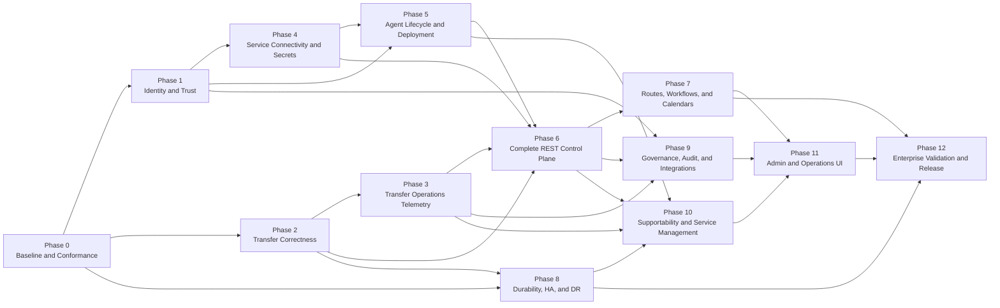

# Quorus Enterprise Implementation Plan

**Version:** 1.21  
**Date:** 2026-09-04  
**Author:** Mark Ray-Smith — Cityline Ltd  
**License:** Apache 2.0  
**Status:** Active — remediation checkpoint open; M0 durability and Phase 4 acceptance reopened; Phase 1 complete; Phases 2 and 3 in progress  
**Scope:** Enterprise control plane, transfer operations, security, governance, deployment, and user interfaces

## 1. Purpose and Authority

This plan defines the phased implementation path from the current Quorus alpha baseline to an evidence-backed enterprise release. It turns the requirements in the following documents into sequenced engineering work:

- [Quorus Architecture Specification](../../docs/QUORUS_ARCHITECTURE_SPECIFICATION.md)
- [Quorus REST API Specification](../../docs/QUORUS_REST_API_SPECIFICATION.md)
- [Quorus Comprehensive System Design](../design/QUORUS_SYSTEM_DESIGN.md)
- [Quorus HTTP API Reference](../../docs/QUORUS_API_REFERENCE.md)

The architecture and REST API specifications remain normative. This plan controls delivery order and exit evidence; it does not weaken a canonical requirement. Historical completion markers in older plans do not close current conformance gaps.

Calendar dates are deliberately not assigned until team size, deployment platform, enterprise identity provider, secrets provider, evidence-retention platform, and pilot scope are agreed. Relative size indicates expected breadth, not a commitment:

- **S:** contained change with limited schema and operational impact;
- **M:** cross-module capability with API, persistence, and test changes;
- **L:** platform workstream with security, migration, failure, and operational implications;
- **XL:** multiple coordinated workstreams or an enterprise release milestone.

## 2. Delivery Principles

Every phase follows these rules:

1. **Security and operations are product behavior.** They are not deferred documentation or deployment concerns.
2. **Transfer-process outcomes come first.** Infrastructure signals support transfer progress, deadlines, integrity, publication, and recovery.
3. **Raft remains authoritative.** New authoritative controller state is introduced through versioned commands, snapshots, migrations, and invariants.
4. **File bytes stay out of controllers and REST.** Agents connect directly to governed enterprise services.
5. **Secrets remain external.** Quorus stores opaque references and redacted metadata only.
6. **Current and target behavior stay distinct.** Documentation and OpenAPI coverage change in the same delivery as implementation.
7. **Failure paths are first-class.** Quorum loss, retries, stale agents, timeouts, partial files, lost acknowledgements, and rollback are tested before success claims.
8. **Backward compatibility is explicit.** Raft entries, snapshots, APIs, configuration, workflow definitions, and agent protocols have version and migration rules.
9. **No phase is complete on code alone.** Tests, audit, telemetry, runbooks, threat-model updates, migration, and operator evidence are part of the exit gate.
10. **The user interface uses public contracts.** It receives no private database, filesystem, Raft, or controller-internal access.
11. **Test-driven delivery is mandatory.** Every behavior-changing slice starts with an externally meaningful failing test, advances through the smallest implementation that makes it pass, and is refactored only while the focused and regression suites remain green. Tests added after implementation are characterization or regression tests and MUST NOT be represented as TDD evidence.

## 3. Current Baseline

The current baseline provides:

- Java 25 and Vert.x 5 modules;
- direct transfer execution through protocol adapters;
- YAML workflow parsing and in-process workflow execution;
- controller-local HTTP with Raft-replicated transfer, assignment, agent, and route commands;
- agent registration, heartbeat, work polling, execution, and compatibility status reporting;
- health, Raft status, aggregate metrics, and selected OpenTelemetry instrumentation;
- tenant models, quota services, route models, and supporting examples.

The baseline does not yet justify protected enterprise production use. Phase 1 established the authenticated identity and TLS/mTLS foundation, and the completed Phase 2 slices established authoritative attempt fencing and atomic report application. Critical blockers still include certificate lifecycle automation, automatic lease expiry and safe reassignment, destination-side fencing and reconciliation, incomplete transfer operations telemetry, uncontrolled service connectivity, incomplete agent trust lifecycle, and incomplete REST coverage.

## 4. Target Release Milestones

### Remediation checkpoint — 2026-09-04

**Full-suite verification follow-up — 2026-09-05:** The reported Docker startup
errors were fixed by explicit development settings in the plaintext test fixtures.
The election timeout exposed concurrent same-term vote grants in Quorus: retain the
node's owning Vert.x context and serialize vote decisions through metadata persistence.
Two new tests retain intended behavioral red; the focused vote/transport/restart
regression passes 19 tests. The rebuilt Docker fixtures also pass their focused run.
The complete JDK 25 working-tree command
`mvn.cmd --fail-at-end clean verify '-Dtest.excludedGroups='` now passes all seven
reactor entries and five JaCoCo gates: 2,414 passed, zero failures/errors, two existing
explicitly disabled network tests. Integration Examples has no tests. See
[the full-suite remediation evidence](../evidence/full-suite-error-remediation-2026-09-05.md).
This advances local verification, but R4, remaining R5 work and R6 final-revision,
isolated-checkout and deployment acceptance remain open. Changes are uncommitted.

**2026-09-05 execution update:** R2/R3 are committed in `28f0530`. The current environment
contains RaftLog as a sister project at `../raftlog` relative to the Quorus root
(`C:\Users\mraysmit\dev\idea-projects\raftlog`), with its own Maven reactor. Quorus
consumes its `raftlog-core` artifact; the sister project must be built/installed separately.
The external dependency/API gap is now resolved by the newly implemented and published RaftLog 1.2.0 from `1c5af80` (`v1.2.0`): it supplies prefix compaction after caller-owned durable snapshots. All 41 selected Quorus storage/snapshot/restart tests passed against the new artifact. RaftLog's full Windows and Linux reactors passed 319 cases (three Windows skips; no Linux skips). This is separate evidence from the unsubstantiated historical `db59859` build. See the [release handover](../evidence/raftlog-validation-handover-2026-09-05.md#implemented-capability-and-release--2026-09-05). R4/R5/R6 still require their remaining verification; neither full Quorus acceptance nor power-loss durability is implied.
Independent R5 path, TLS,
redirect, entrypoint, builder-default, FTPS-policy and worker-thread fixes retain TDD
evidence in [the current execution record](../evidence/remediation-r4-r6-2026-09-05.md).
R5 and R6 are not complete; deployment/power-loss acceptance is not implied by local tests.

**External-library-only correction:** the remaining internal RocksDB and memory storage implementations, backend factory branches, convenience API and RocksDB JNI dependency have been removed. Configuration now accepts only `raftlog`; storage-dependent tests use the external adapter and isolated temporary paths. Seven behavioral tests first proved that the old factory/configuration still admitted internal backends, then passed after removal. The 93-test focused regression and final clean controller verification (520 tests, no failures/errors/skips, JaCoCo gate passed) are green. The shaded JAR contains the external library WAL and no removed internal storage classes or RocksDB JNI. Commands, hashes and test-count accounting are recorded in the existing [Raft evidence record](../evidence/raft-log-tdd-evidence-2026-09-04.json). This corrects the incomplete earlier removal without closing R2–R6 or the outstanding R1 production durability gates.

The historical results below are retained, but do not authorize release of the snapshot-compaction behavior at `ffc3e64`: WAL prefix deletion is durable while adapter snapshots are only in memory at that revision. R1 replaces that behavior with durable snapshots and recovery checks; implementation evidence and outstanding deployment gates are recorded below. Existing persistent environments have not been inventoried; preserve their storage before recovery or rollback. Code rollback cannot recover already deleted WAL records.

Execute the following slices in order under Section 6.1, retaining intended behavioral red failures before production changes:

| Slice | Scope and acceptance gate | Status |
|---|---|---|
| R1 — Durable snapshots | Snapshot, compact, close, construct fresh storage, and recover state and coordinates; three-controller restart; interrupted publication, corruption, retained tails, and concurrent log mutations. Keep raftlog-core as the only WAL. | Code remediation verified on Windows; container-recreation, production-filesystem and power-loss acceptance remain open |
| R2 — Tenant isolation | Collision-free versioned registry keys, ownership validation, HTTP CRUD/list boundaries, replicated migration and restart; ambiguous legacy ownership fails closed. | Implementation complete — 546 tests pass in final clean controller verify, no failures/errors/skips; JaCoCo gate passed; deployment acceptance remains under R1/R6 |
| R3 — Pre-execution failures | Authorization/secret/path rejection reaches the correct terminal attempt state without artificial IN_PROGRESS; preserve sequencing/fencing and reconcile uncertain acknowledgements. | Implementation complete — clean affected-reactor verify and JaCoCo gates pass; Windows symlink skip covered by passing Linux path-policy tests |
| R4 — Non-blocking DNS | Slow DNS cannot block unrelated HTTP requests; bounded resolution, overload/timeout handling, default-deny egress and address pinning remain enforced. | Open — dependency/API blocker resolved; retained draft still needs behavioral red and implementation |
| R5 — Handover closure | Confirm and disposition every remaining handover item, including entrypoints, defaults, path/port/TLS behavior, trust updates, codecs, compatibility, and retention. | In progress — independent fixes evidenced; controller-dependent work and remaining disposition open |
| R6 — Final acceptance | Clean isolated-worktree reactor verify at the final revision, configured JaCoCo gates, protocol/security/restart tests, migration/runbook/specification alignment and retained evidence. | Current working-tree full reactor passes, including Docker/slow tests and five coverage gates; final-revision isolated verification and remaining release/deployment gates stay open |

**R1 implementation evidence:** 14 new tests: 11 exposed missing behavior before their fixes, and three are explicitly recorded as characterization. Seven red/green stages cover recovery and mutation ordering, including interrupted installation followed by a second restart. The final clean controller run passes 530 tests with no failures, errors or skips and meets its JaCoCo gate; the separately enabled slow cluster suite passes four tests. An earlier seven-module clean reactor passed before the last interruption-recovery fixes; it is not represented as a final-revision reactor result. Commands, failure excerpts, timestamps, log hashes, source hashes and limitations are retained in [Raft TDD evidence](../evidence/raft-log-tdd-evidence-2026-09-04.json). R2 progress is recorded below; no remaining slice or production acceptance gate is closed by the R1 result.

The two Raft regression cases without preserved red evidence remain historical process deviations requiring explicit disposition, not historical TDD. The earlier raftlog prefix API's compile-only red also does not satisfy the behavioral-red mandate; its historical record is preserved, not retroactively relabelled. No waiver is inferred from earlier Phase 0/1 approvals. The later full-reactor result recorded by `ffc3e64` corrects the earlier review's verification chronology, but does not cover the missing snapshot/restart behavior. Completion of this checkpoint requires all applicable gates, not a green build alone.

**R2 implementation evidence:** versioned tenant/resource keys, exact-owner reads and
authoritative writes replace the ambiguous legacy namespace. The first successful v2
registry mutation migrates validated legacy records atomically through Raft. Conflicts
and incomplete ownership fail closed; command/snapshot schema 3 fences older binaries.
Twenty-two cases retain intended behavioral red before fixes; one HTTP outcome, two
three-controller restart variants and one schema-2 snapshot compatibility case are
separately identified as characterization/regression.
The corrected focused suite passes 37 tests. Final clean controller verification passes
546 tests with no failures, errors or skips and meets the JaCoCo gate. Commands, hashes, the failed cluster-test
sequencing run and final verification are retained in the existing
[Phase 4 evidence](../evidence/phase4-tdd-evidence-2026-09-03.json).
Follow the [coordinated upgrade procedure](../../docs/QUORUS_SECURITY_DEPLOYMENT_GUIDE.md#11-registry-isolation-upgrade-and-recovery);
no deployed data has been changed. R3 progress is recorded below.

**R3 implementation evidence:** preparation failure reports now use the acknowledged
attempt state. The controller atomically fails the accepted attempt, assignment and
pending transfer without a synthetic start transition. Transient acknowledgement
failures replay the identical report, bounded to three sends; definitive rejection or
unresolved start acknowledgement does not authorize execution or a guessed next report.
Repeated polls are suppressed per fenced attempt, and executable request construction
precedes the start report. Sixteen new cases retain intended behavioral red; one new
cancellation case is characterization. The first focused run passes 98 tests; the
extended agent regression passes 44. Clean affected-reactor verification passes 2,357
tests with no failures/errors and one existing Windows symlink-permission skip; all
five module JaCoCo gates pass. Both unchanged path-policy tests then pass against the
verified artifacts in a pinned Java 25 Linux container, with no skips or aborts.
Commands, initial assertion corrections, hashes and limitations are retained under
`remediationR3` in the existing [Phase 4 evidence](../evidence/phase4-tdd-evidence-2026-09-03.json).
The [reconciliation procedure](../../docs/QUORUS_SECURITY_DEPLOYMENT_GUIDE.md#12-pre-execution-failure-and-acknowledgement-reconciliation)
distinguishes bounded replay from outstanding durable outbox, automatic lease recovery
and destination reconciliation work in Phase 2. R4 is the next remediation slice; the
remaining release gates are not waived.

| Milestone | Completed phases | Release meaning |
|---|---|---|
| **M0 — Reproducible Alpha Baseline** | Phase 0 — historically complete; durability acceptance reopened by R1 | Clean, repeatable functional baseline with corrected lifecycle and durability defects. The existing [Phase 0 release manifest](../evidence/phase0-release-evidence.json) proves green verification, not test-first sequencing. The [TDD assessment and remediation record](../evidence/tdd-remediation-2026-09-01.json) retains the retrospective characterization and the approved historical process deviation. |
| **M1 — Secure Transfer Core** | Phases 1–2 | Authenticated control plane and explainable, fenced transfer attempts |
| **M2 — Operational Beta** | Phases 3–5 | Critical transfers are observable; services and agents have governed trust lifecycles |
| **M3 — Enterprise Control Plane** | Phases 6–8 | Complete API, automated route/workflow operation, and evidenced recovery behavior |
| **M4 — Enterprise Operations Candidate** | Phases 9–11 | Governance, integrations, supportability, and role-specific user interfaces are available |
| **M5 — Enterprise Release Candidate** | Phase 12 | All release gates pass in a representative pilot environment |

No milestone may be described as production ready solely because its feature list is complete.

## 5. Phase Dependency Map

Phases 1 and 2 may run in parallel after Phase 0 if their shared identity, command-versioning, and API decisions are agreed first. Phase 8 can begin early as a separate durability workstream but cannot finish until the attempt reconciliation model exists.

## 6. Cross-Cutting Definition of Done

A capability is complete only when all applicable items are satisfied:

- domain model and state transitions are specified;
- Raft command and snapshot schemas are versioned;
- referential, tenant, state, and authorization invariants are enforced during authoritative state application;
- safe migration and rollback behavior is documented and tested;
- OpenAPI 3.1 paths, schemas, scopes, examples, and problem responses are updated;
- idempotency, concurrency, leader, quorum-loss, and retry behavior is tested;
- unit, component, integration, protocol, multi-node, security, and failure tests pass as applicable;
- metrics, traces, domain events, audit events, alert conditions, and redaction are implemented;
- runbooks cover normal operation, expected failure, recovery, rollback, and escalation;
- threat model and data-flow diagrams are updated;
- no secret values appear in state, logs, telemetry, fixtures, exports, or support bundles;
- current documentation distinguishes implemented behavior from the remaining target state;
- measurable exit evidence is retained with build, configuration, environment, and artifact digests.

### 6.1 Mandatory TDD delivery protocol

Every implementation slice MUST use and retain the following sequence:

1. **Specify:** identify one externally observable behavior, its security and tenant context, failure behavior, and acceptance boundary.
2. **Red:** add the smallest unit, component, or external-path behavioral test that expresses the behavior; execute it before production implementation and retain output proving it failed for the intended missing behavior rather than environment or fixture failure.
3. **Green:** implement the smallest coherent end-to-end change that makes the new test pass; retain the focused green output.
4. **Refactor:** remove duplication and align architecture without changing behavior; rerun the focused test and affected module suite.
5. **Regress:** run the applicable unit, integration, protocol, multi-node, security, contract, and documentation lanes. A phase cannot close with an unresolved failure or a green result inferred from an isolated retry.

The mandatory evidence record for each slice contains:

- stable slice identifier and linked requirement or gap;
- acceptance statement written before implementation;
- test file and external entry point exercised;
- red command, timestamp, revision or patch identity, expected failure, and captured output;
- green command, timestamp, revision or patch identity, and captured output;
- refactor summary and focused plus affected-suite results;
- test classification: unit, component, external-path behavioral, integration, protocol, multi-node, security, contract, or failure injection;
- confirmation that request bodies, credentials, keys, and sensitive payloads were not captured in evidence.

For asynchronous behavior, tests MUST use the project-standard Vert.x test facilities. Awaitility, Java executor/latch orchestration, sleeps used as synchronization, and equivalent non-Vert.x polling are not permitted in new or remediated tests. External-path tests MUST enter through the same HTTP, agent, protocol, or cluster boundary used by a real caller. Direct method tests remain useful but cannot independently satisfy the behavioral-test gate.

Existing implementation for which no preserved red stage exists can only receive **retrospective characterization**. It requires an explicit process-deviation record and cannot be relabelled as historical TDD. All subsequent changes to that behavior return to the mandatory red-green-refactor protocol.

## 7. Phase 0 — Baseline, Conformance, and Delivery Controls

**Size:** L  
**Milestone:** M0  
**Status:** Complete — functional verification and code-side TDD remediation passed; historical process deviation approved on 2026-09-02  
**Primary gaps:** `ARCH-01`, `ARCH-05`, `ARCH-06`, `ARCH-07`, `API-01`, `API-12`

### Objective

Create one reproducible, durable, end-to-end distributed transfer path and the engineering controls needed to change authoritative state safely.

### Scope

1. Establish a clean Java 25 build and test baseline across all active modules.
2. Correct the agent success lifecycle so `ACCEPTED -> IN_PROGRESS -> COMPLETED` is observable and legal.
3. Enforce transfer, agent, assignment, route, and tenant referential invariants inside state-machine application.
4. Resolve and test the controller data path and container volume alignment.
5. Inventory every current endpoint and create the initial OpenAPI 3.1 contract.
6. Introduce standard problem responses, correlation identifiers, request limits, and redaction rules.
7. Define command, snapshot, API, configuration, workflow, and agent-protocol versioning policy.
8. Establish CI lanes for unit, integration, protocol, multi-node, security, documentation, and contract checks.
9. Add architecture-decision records for event storage, progress checkpointing, identity boundary, secret providers, and deployment ownership.

### Deliverables

- reproducible build instructions and locked toolchain baseline;
- one automated tenant-scoped transfer from submission through assignment, acceptance, running, progress, completion, persistence, restart, and API verification;
- corrected persistent-volume deployment and restart evidence;
- authoritative invariant test suite, including missing references and cross-tenant commands;
- initial OpenAPI document containing every registered path;
- standard error and correlation contract on current endpoints;
- schema-version registry and compatibility test harness;
- release evidence manifest that records code revision, build, artifacts, configuration, tests, and environment.

### Verification

- clean checkout build passes twice without relying on previous local artifacts;
- three-controller test commits a transfer, restarts all controllers, and recovers the same authoritative state;
- invalid and cross-tenant commands produce no state change on any node;
- agent success emits `IN_PROGRESS` before `COMPLETED`;
- all registered paths match OpenAPI and all declared current paths are registered;
- documentation link, header, fence, endpoint, and current-versus-required checks run in CI.

### Exit gate

M0 functional behavior is achieved when the reference transfer path is repeatable, durable, state-machine invariant tests pass, and the current API is machine-described. Vert.x-native retrospective behavioral coverage and the characterization record now exist. The unavoidable process deviation for the original unrecorded red-green sequence was approved as a historical risk on 2026-09-02 without relabelling the work as TDD-compliant. No external untrusted exposure is permitted at the M0 boundary.

## 8. Phase 1 — Enterprise Identity, Authorization, and Transport Trust

**Size:** XL  
**Milestone:** contributes to M1  
**Status:** Complete — repository implementation and technical exit gate passed; historical TDD process deviation approved on 2026-09-02  
**Primary gaps:** `ARCH-03`, `ARCH-08`, `ARCH-13`, `API-02`

### Objective

Establish authenticated and encrypted trust boundaries for human callers, service integrations, controllers, and agents.

### Implementation checkpoint — 2026-09-01

> **TDD compliance notice:** The initial security foundation was implemented before a preserved failing external-path test suite existed. Its retrospective tests cannot be relabelled as historical TDD evidence. Every subsequent Phase 1 behavior-changing slice followed Section 6.1 and retained its red and green evidence. The initial process deviation was approved as a historical risk on 2026-09-02; that approval closes the governance item but does not rewrite the implementation history.

Implemented in the current Phase 1 workstream:

- trusted-gateway plus protected-hop assertion boundary selected and ADR-0003 updated;
- fail-closed production security configuration and explicit warned development compatibility mode;
- TLS 1.3 client-certificate authentication for controller HTTP;
- TLS 1.3 mutual authentication for Raft server and peer clients;
- certificate-authenticated agent controller clients with hostname verification;
- human, service-integration, controller, agent, deployment, operator, administrator, security, and auditor identity/role vocabulary;
- deterministic scope and tenant/environment policy decisions with stable denial codes;
- uniform HTTP authentication and authorization middleware;
- authenticated tenant derivation and item/collection isolation for transfers, agents, assignments, jobs, and routes;
- agent identity self-binding for registration, heartbeat, polling, and status reporting;
- `security/me` plus query and request-body authorization-explanation resources;
- runtime trust-policy version and certificate-expiry observation through REST and OpenTelemetry;
- atomic certificate-serial revocation updates shared by HTTP and Raft and re-evaluated on every request or RPC, including established TLS connections;
- controlled old/new certificate overlap coverage for controller HTTP, Raft peers, and agent clients, followed by explicit old-certificate revocation;
- redacted append-only, fsync'd, SHA-256 hash-chained authentication, authorization, mutation-completion, privileged-read, certificate-lifecycle, and security-configuration audit;
- fail-closed audit-chain verification at startup and separate operational plus retained evidence chains;
- security deployment guidance and certificate incident runbook.

External validation and governance items retained after the code-side Phase 1 gate:

- the initial Phase 0/Phase 1 TDD process deviation was approved by project authority on 2026-09-02 and remains recorded in the evidence rather than being relabelled as compliant history;
- deployment-specific validation with the selected corporate PKI, enterprise gateway, secrets platform, controller topology, agent estate, and evidence collector, scheduled for the enterprise validation phase;
- enterprise searchable audit service, WORM retention, SIEM integration, and signed export, which remain Phase 9 capabilities rather than claims about the local Phase 1 evidence files.

Checkpoint verification on 2026-09-01:

- remediation-focused run: 2 shared Vert.x test-facility tests, 3 live controller HTTP security tests, 1 live Raft mTLS test, and 2 live agent TLS tests passed;
- a full-reactor run exposed that cross-module TLS fixtures were incorrectly assumed to be ordinary filesystem resources; the fixture loader was changed to materialize classpath resources safely from either directories or packaged test JARs, and the 6 external security-boundary tests then passed;
- the first two clean regression attempts exposed Docker-health false negatives for the FTP and FTPS containers after the services were already accepting protocol connections; this was remediated test-first by retaining the failed runs as the red stage, replacing redundant container-health gating with three consecutive mapped-port FTP `220` readiness responses, and passing all 14 FTP/FTPS integration tests as the focused green stage;
- the runtime trust and revocation slice retained a failing 6-test run before implementation, then passed 10 focused HTTP, Raft, and agent boundary tests after the shared runtime trust state, REST resources, enforcement, audit, and telemetry were implemented;
- the retained audit-evidence slice first failed on modified-chain acceptance and missing dual-sink behavior, then passed all 3 focused audit-chain tests after startup verification and retained-evidence fan-out were implemented;
- the expanded Phase 1 security and contract run passed 22 tests: 17 controller tests and 5 agent tests, with zero failures or errors;
- definitive `mvn -o clean verify`: 2,237 tests passed with zero failures, errors, or skips across all seven reactor modules (core 1,491; workflow 134; tenant 64; controller 462; agent 86; integration examples 0).

Coverage-gate remediation completed on 2026-09-02:

- controller Surefire now preserves the JaCoCo agent argument while adding the required Java modules; the prior configuration silently replaced the agent argument and therefore produced no controller execution data;
- the existing 60% line-coverage minimum remains unchanged and applies to every authored controller package;
- only protoc-generated Java and gRPC bindings are excluded from coverage accounting, while live gRPC transport tests continue to exercise that boundary;
- retrospective Vert.x behavioral coverage now exercises controller deployment, packaged configuration, telemetry bootstrap, assignment lifecycle through Raft, file storage, and RocksDB storage; these tests characterize existing production behavior and are not presented as historical TDD evidence;
- the authoritative five-module clean verification passed 2,163 tests with zero failures, errors, or skips (core 1,491; workflow 134; tenant 64; controller 474);
- JaCoCo analyzed 143 authored controller classes and reported 79.0% line coverage and 60.2% branch coverage; the lowest authored package is 60.1%, above the unchanged 60.0% package gate;
- two existing asynchronous tests exposed instrumented-suite timing assumptions; their assertions and production behavior were retained while their setup/convergence deadlines were aligned to the established 15-second integration-test window, followed by a 17-test focused green run and the clean reactor pass.

Completed retrospective remediation for the implemented checkpoint:

- real HTTP TLS/mTLS acceptance and rejection through `HttpApiServer`;
- trusted-gateway assertion acceptance, missing/forged assertion rejection, and direct certificate binding;
- authenticated tenant derivation and cross-tenant rejection through live HTTP resources;
- effective-identity resource through live HTTP requests;
- successful and failed privileged-read records through the configured audit sink;
- agent-to-controller trust and client-certificate behavior through a real TLS server;
- Raft peer trust and unknown-certificate rejection through a live gRPC boundary;
- replacement of Phase 0 Awaitility polling introduced by the baseline work with Vert.x futures and test contexts;
- shared test-only TLS material, packaged-resource-safe fixture loading, and Vert.x-native asynchronous test utilities available to controller and agent modules;
- protocol-level FTP and FTPS readiness detection proven by a retained red-green regression slice rather than Docker health-state timing.

The Phase 0 and initial Phase 1 process deviation recorded in the TDD assessment was approved as a historical risk on 2026-09-02. Authorization explanation, live decision and completion audit, agent hostname mismatch, plaintext-production rejection, HTTP/Raft/agent certificate overlap, active-connection revocation, and retained audit integrity have executable regression evidence. Phase 1 is complete, but the approved deviation does not convert the initial retrospective checkpoint into TDD-compliant history.

### Scope

1. Select the enterprise identity boundary: trusted gateway plus protected identity assertions, or controller-native OIDC validation where required.
2. Define human, service integration, controller, agent, and deployment identities.
3. Implement TLS for controller HTTP and mutual TLS for Raft and agent control traffic.
4. Implement certificate validation, hostname verification, trust bundles, expiry monitoring, rotation, and revocation.
5. Introduce the canonical scopes and resource-policy evaluation model.
6. Derive tenant and environment scope from trusted identity rather than caller-supplied fields.
7. Add RBAC and ABAC enforcement for tenant, business service, environment, action, resource ownership, and data classification.
8. Establish separation-of-duties roles and time-bounded privileged elevation.
9. Create the immutable audit-event foundation for authentication, authorization, denial, mutation, and privileged reads.
10. Make insecure development profiles explicit, visibly warned, disabled by default, and impossible in production profiles.

### Deliverables

- identity and trust-boundary architecture decision;
- TLS/mTLS configuration, trust-bundle handling, and automated certificate rotation tests;
- `security/me` and authorization-explanation API foundations;
- policy engine with stable decisions and denial codes;
- authenticated tenant derivation and uniform authorization middleware;
- controller, agent, service-integration, operator, administrator, security, auditor, and deployment roles;
- immutable redacted audit-event schema;
- security deployment guide and certificate incident runbooks.

### Verification

- unauthenticated, expired, revoked, wrong-tenant, wrong-environment, and wrong-role calls fail closed;
- Raft peers reject unknown or revoked controller identities;
- agents reject untrusted controllers and controllers reject untrusted agents;
- authorization is enforced on collections, item resources, streams, exports, and actions;
- certificate rotation occurs without unauthorized overlap or loss of active trusted control;
- production profile cannot enable disabled verification or plaintext control traffic.

### Exit gate

Every production trust-boundary connection is authenticated, encrypted, peer-verified, authorized, and audited. Tenant identity is no longer derived solely from request content.

**Gate result — 2026-09-02:** Complete for the repository implementation and representative live-boundary fixtures. The historical process deviation is approved and retained in the evidence. Corporate-environment accreditation remains deferred to Phase 12, so this result is not a production-readiness claim.

## 9. Phase 2 — Transfer Attempts, Fencing, Integrity, and Reconciliation

**Size:** XL  
**Milestone:** M1  
**Primary gaps:** `ARCH-02`, `ARCH-05`, `ARCH-06`, `ARCH-17`, `API-03`, `API-07`, `API-12`
**Status:** In progress — authoritative attempts, atomic assignment, the fenced agent poll/report protocol, and atomic multi-entity lifecycle reporting implemented on 2026-09-02; lease automation, integrity, publication, idempotent submission, retry policy, and reconciliation remain open  

### Objective

Make distributed transfer outcomes explainable and safe under retries, failover, delayed agents, lost acknowledgements, and uncertain publication.

### Implementation checkpoint — 2026-09-02

Four Phase 2 vertical slices were delivered with retained red-green evidence before production implementation:

- immutable attempt identity, attempt number, agent, tenant, lease, fencing generation, report sequence, lifecycle state, progress, outcome, and timestamps;
- authoritative offer, ordered report, exact-retry, lease-renewal, and replacement-fencing commands in replicated state;
- stale-fence, stale-sequence, sequence-gap, invalid-transition, progress-regression, tenant-mismatch, and invalid-outcome rejection;
- terminal-report retry after a lost response, without reopening the released active fence;
- immutable attempt history and active-fence recovery in state snapshots;
- version 2 protobuf command and snapshot contracts while retaining readers for legacy version 0 and version 1 data;
- exhaustive sealed-command dispatch and protobuf round-trip coverage;
- tenant-checked `GET /api/v1/transfers/{jobId}/attempts` and `GET /api/v1/transfers/{jobId}/attempts/{attemptId}` read resources, governed by `transfers:read` and synchronized with OpenAPI and endpoint discovery.
- atomic creation of an assignment and its first authoritative attempt in one replicated command, including a configured initial lease and deterministic attempt identity in the command payload;
- agent polling responses that carry `attemptId`, `fencingGeneration`, `leaseExpiresAt`, and the last accepted report sequence;
- agent status reports that require `attemptId`, `expectedState`, `fencingGeneration`, and a monotonically increasing `reportSequence`;
- agent execution that obtains acknowledged `ACCEPTED` and `IN_PROGRESS` transitions before reporting `COMPLETED` or `FAILED`;
- rejection of missing expected state, stale fencing generations, stale or gapped report sequences, invalid transitions, and reports or renewals after lease expiry;
- conflict translation through the live HTTP boundary and OpenAPI synchronization for the implemented assignment and agent protocol.
- atomic application of each attempt-aware lifecycle report across attempt, assignment, transfer status, and transfer progress in one replicated command, with all validation completed before any state is mutated;
- exact retry of a terminal report through the live HTTP boundary after a lost response, returning the committed success without advancing the sequence or reopening the active fence.

This checkpoint does not close Phase 2. Automatic lease expiry and reassignment, lease renewal through the external agent protocol, mutation coverage for the specialized assignment actions, submission idempotency, retry classification, integrity verification, staged publication, reconciliation, protocol capability enforcement, and migration tooling remain required by the exit gate.

Evidence is recorded in [Phase 2 TDD evidence](../evidence/phase2-tdd-evidence-2026-09-02.json). The pre-slice clean seven-module verification passed 2,257 tests with no failures. Clean affected-module verification after the delivered slices passed 490 controller tests and 87 agent tests with all JaCoCo checks met; four supplemental core model tests also passed. The next full clean gate must include at least 2,270 tests, subject to intentional test-suite changes.

### Scope

1. Introduce immutable transfer attempts with `attemptId`, agent, sequence, lease, fencing generation, and outcome.
2. Define canonical transfer and attempt state machines with validated transitions.
3. Implement assignment offer, accept, reject, start, progress, complete, fail, cancel, and lease-renew actions.
4. Persist expected state, report sequence, and fencing token checks in authoritative application.
5. Add idempotency keys to submission and retriable control operations.
6. Define retry classification, maximum attempts, maximum elapsed time, backoff, jitter, and terminal conditions.
7. Add destination staging, integrity verification, publication, overwrite, partial-file, and cleanup policies.
8. Implement reconciliation for lease expiry, agent disappearance, controller failover, timeout, lost completion, and ambiguous publication.
9. Define protocol-specific retry and resume safety; fail unsupported capabilities before execution.
10. Migrate existing jobs and assignments to the versioned attempt model.

### Deliverables

- versioned transfer, attempt, assignment, lease, integrity, and publication schemas;
- attempt-aware agent protocol and REST resources;
- lease scheduler and authoritative fencing validation;
- idempotency store scoped to identity, tenant, request fingerprint, and expiry;
- staged publication abstraction with protocol capability checks;
- reconciliation service and operator actions;
- immutable attempt history and classified terminal reasons;
- migration and rollback tooling for existing snapshots and records.

### Verification

- delayed or partitioned agents cannot update or publish after losing the active fence;
- duplicate submission with the same idempotency fingerprint returns the original result;
- reuse of an idempotency key with different content fails;
- controller failover during each lifecycle transition produces one authoritative outcome;
- integrity failure never becomes `SUCCEEDED`;
- publication uncertainty becomes `RECONCILIATION_REQUIRED`, not an assumed success or blind retry;
- crash, network partition, lost response, lease expiry, and duplicate-report tests pass;
- every terminal transfer has complete attempt and publication evidence.

### Exit gate

Quorus can safely explain what ran, where it ran, which attempt is authoritative, what was published, and what requires reconciliation. It still does not claim exactly-once external execution.

## 10. Phase 3 — Critical Transfer Operations Telemetry and Alerting

**Size:** XL  
**Milestone:** contributes to M2  
**Primary gaps:** `ARCH-11`, `ARCH-12`, `API-03`, `API-04`
**Status:** In progress — started on 2026-09-02 by explicit direction while the remaining Phase 2 lease automation, publication, integrity, retry-policy, and reconciliation work stays open; Phase 3 work MUST NOT claim or depend on those unfinished guarantees  

### Objective

Give technology operations teams a current, end-to-end operational view of every critical and time-sensitive transfer.

### Implementation checkpoint — 2026-09-02

The initial vertical slices were delivered test-first through the real controller HTTP boundary and are recorded in the [Phase 3 TDD evidence manifest](../evidence/phase3-tdd-evidence-2026-09-02.json). The first retained red test proved that submission rejected required operational context before implementation (`temp/phase3-progress-http-red-final.txt`); the green path now commits business service, owner, criticality, environment, processing date, expected start, required completion, and runbook context through Raft and exposes tenant-checked `GET /api/v1/transfers/{jobId}/progress` with source-size semantics, percent complete, active attempt and agent, retry count, deadline state, and qualified rate/ETA output (`temp/phase3-progress-http-green.txt`). The second red/green cycle proved and corrected the false use of generic lifecycle update time as progress telemetry, so a transfer with no increasing-byte report is now explicitly `UNKNOWN` and has no invented last-progress time (`temp/phase3-missing-telemetry-red-final.txt`, `temp/phase3-missing-telemetry-green.txt`). The third cycle replaced fixed freshness/stall constants with validated controller policy, used that policy to classify stale telemetry, and discloses the effective windows and source to operators (`temp/phase3-progress-policy-red.txt`, `temp/phase3-progress-policy-green.txt`). The first-slice focused cross-module regression passed 50 core tests and 84 controller tests (`temp/phase3-progress-regression.txt`). The earlier clean checkpoint passed all 493 tests and all JaCoCo gates with 79.3% line and 59.6% branch coverage (`temp/phase3-controller-clean-verify-final.txt`).

The fourth cycle added the first deterministic, tenant-checked `TRANSFER_SUBMITTED` event through `GET /api/v1/transfers/{jobId}/events`, with the ledger included in controller snapshots (`temp/phase3-event-ledger-red.txt`, `temp/phase3-event-ledger-green.txt`; 32 focused tests passed). The fifth cycle added `TRANSFER_ASSIGNED` with attempt and agent identity and proved ordered event recovery across a real snapshot reset/restore boundary. Its first red exposed and corrected an unintended serialized helper property before the retained behavioral red demonstrated the missing assignment event (`temp/phase3-event-offer-restore-red.txt`, `temp/phase3-event-offer-red-final.txt`, `temp/phase3-event-offer-restore-green.txt`). A separate red/green vocabulary cycle aligned the event name with the project’s established canonical standard (`temp/phase3-event-vocabulary-red.txt`, `temp/phase3-event-vocabulary-green.txt`). The sixth cycle added atomic `TRANSFER_ACCEPTED`, `TRANSFER_STARTED`, and `TRANSFER_PROGRESS` events, including authoritative attempt, agent, byte, total-size, and report-sequence context (`temp/phase3-lifecycle-events-red.txt`, `temp/phase3-lifecycle-events-green.txt`; 34 focused tests passed).

The final clean controller retry passed 495 tests with no failures, errors, or skips; JaCoCo reported 79.5% line and 59.7% branch coverage and all configured gates passed (`temp/phase3-controller-clean-verify-events-retry.txt`). The immediately preceding clean attempt reached 489 tests before the three-node `LeaderGuardHandlerTest` fixture exceeded its 15-second startup wait; the same fixture passed on the clean retry, so the non-reproducing timeout is retained rather than hidden (`temp/phase3-controller-clean-verify-events.txt`).

The seventh red/green cycle proved the configured active-transfer stall boundary through the tenant-checked progress API. A stalled transfer now exposes a stable `conditionSince` derived from its last real byte advancement plus the governed stall window, together with `stallDurationSeconds` for operator triage (`temp/phase3-active-stall-red.txt`, `temp/phase3-active-stall-green.txt`; 7 focused tests passed).

The clean controller gate after the stall slice passed all 496 tests with no failures, errors, or skips. JaCoCo reported 79.8% line and 60.2% branch coverage, and every configured coverage check passed (`temp/phase3-controller-clean-verify-stall.txt`).

This checkpoint does not close Phase 3. The remaining lifecycle event vocabulary, durable stall detection/event emission, throughput windows, calibrated ETA confidence, configurable deadline-risk prediction, operational query collections, timelines, resumable streaming, alerts, retention, archival, and service-level reporting remain open.

### Scope

1. Extend transfer context with business service, owner, criticality, environment, processing date, expected start, required completion time, and runbook.
2. Define the ordered transfer event vocabulary and event schema.
3. Separate authoritative lifecycle events from high-frequency telemetry samples and define retention for both.
4. Implement monotonic progress, throughput windows, ETA, confidence, telemetry freshness, and unknown-size behavior.
5. Implement deadline risk, late, stalled, degraded, and unknown conditions independently of lifecycle state.
6. Build transfer timeline, attempt, integrity, publication, and reconciliation read models.
7. Implement durable event query and resumable filtered server-sent event delivery.
8. Implement actionable alert policy, deduplication, acknowledgement, suppression, escalation, resolution, and notification-delivery evidence.
9. Control metrics cardinality and protect the control plane from slow consumers and event floods.
10. Add service-level reports for timeliness, success, retry, integrity, publication, alert response, and telemetry completeness.

### Deliverables

- transfer context and deadline model;
- domain event ledger and operational read models;
- progress, ETA, risk, stall, degradation, and telemetry-freshness engines;
- critical, at-risk, late, stalled, and degraded query APIs;
- alert resources and notification-delivery state;
- resumable event stream with gap notification and backpressure;
- operator runbooks and alert policy catalogue;
- retention, archival, and performance design for events and samples.

### Verification

- test transfers of known and unknown size produce correct progress semantics;
- lost telemetry becomes `UNKNOWN` or `DEGRADED`, never zero progress;
- stalled and deadline-risk transfers are detected within the configured policy window;
- timeline order remains correct across retries, controller failover, and agent restart;
- event replay resumes from the last acknowledged event and explicitly reports retention gaps;
- slow consumers cannot exhaust controller memory;
- every critical alert has owner, evidence, deadline impact, runbook, delivery state, and acknowledgement history.

### Exit gate

Operations can detect, understand, own, and act on a critical transfer before its deadline is missed. Infrastructure monitoring alone is not accepted as completion.

## 11. Phase 4 — Governed Service Connections, Egress, and Secrets

**Size:** XL  
**Milestone:** contributes to M2  
**Primary gaps:** `ARCH-08`, `ARCH-14`, `ARCH-17`, `API-06`  
**Status:** Complete — delivered on 2026-09-03 under the mandatory TDD gate  

### Implementation checkpoint — 2026-09-03

Phase 4 was delivered and then security-remediated as test-first vertical slices spanning the public API, authoritative state, scheduler, shared policy engine, agent execution boundary, local filesystem boundary, external secret resolution, and protocol adapters. Tenant-scoped service aliases hold redacted ownership, service identity, protocol, endpoint, network zone, path, direction, agent-pool, environment, classification, egress, and trust policy. Secret references are opaque Raft-backed metadata; the first production provider is Vault KV v2. Policy is enforced before dispatch and repeated by the executing agent, including deployment-configured pool and network-zone checks, policy version and digest checks, DNS pin comparison, resolved-address/CIDR validation, port, remote path, direction, tenant, and agent-local root checks before the secret provider is contacted. The controller binds those attributes to the authenticated agent's registered record for scheduling and job access; secure enrollment and deployment-authority binding of that record remains Phase 5.

Production transfer submission requires a service alias, remote path, and agent pool. Direct URIs remain an explicitly development-only compatibility mode, and URI user-info is rejected before request mapping or Raft submission. A redacted migration scanner inventories legacy credential-bearing values without echoing credentials. Runtime credentials exist only in agent memory, are excluded from serialization, are wiped on close, and are never returned by the API. The controller exposes service-connection, secret-reference, validation, and security-event resources with explicit scopes and step-up enforcement for mutations.

Trust and protocol behavior fail closed: SFTP uses managed SHA-256 host-key pins and strict checking with password or ephemeral private-key authentication; HTTPS disables redirects and supports only Basic or Bearer authentication; FTPS protects control and data channels and supports password authentication. Governed HTTPS, FTPS, and SFTP connect their actual sockets to an address approved by the agent's repeated DNS policy. TLS adapters retain the original hostname for SNI and verification, perform normal PKIX, match approved CA identifiers against the validated chain including the selected trust anchor normally omitted by the server, apply optional leaf pins, and enforce the TLS floor. The staged validation model distinguishes policy-only validation from an optional bounded active route probe. Submission emits authorization evidence; last-use is emitted only after agent policy and secret resolution; time-based secret expiry is durably transitioned and audited before denial.

Retained red evidence covers the original delivery plus remediation of local filesystem escape, queued-endpoint substitution, destination URI credentials, pool/zone placement, socket-address binding, active route probing, omitted-root CA approval, authorization/use event semantics, and durable time-based secret expiry. The final clean seven-module reactor reported 2,303 tests with 2,302 passed, zero failures or errors, and one environment-limited skip (core 1,512; workflow 134; tenant 64; controller 502; agent 91; integration examples 0), generated every configured JaCoCo report, and passed every coverage gate. The skipped Windows symbolic-link escape case requires link-creation privilege unavailable on this host; canonical existing-parent escape and configured-root boundary coverage passed. Exact red/green commands, results, and the environment limitation are recorded in [Phase 4 TDD evidence](../evidence/phase4-tdd-evidence-2026-09-03.json).

### Objective

Ensure that agents connect only to approved enterprise services using verified peer identities, permitted network paths, and externally managed secrets.

### Scope

1. Implement tenant-scoped service connection aliases stored as authoritative redacted metadata.
2. Define protocol, endpoint, port, network zone, paths, transfer direction, allowed agent pools, owner, environment, and classification policy.
3. Integrate at least one enterprise secrets provider through opaque references.
4. Add trust policy for TLS certificates, approved CAs, hostname verification, SSH host keys, and pinned fingerprints.
5. Enforce default-deny egress, DNS and resolved-address policy, redirect restrictions, ports, protocols, and path scopes.
6. Enforce policy before secret retrieval and again on the executing agent before connection.
7. Implement validation and staged connection tests with redacted DNS, route, negotiation, identity, authentication, and authorization results.
8. Remove credential-bearing URI behavior from production flows and migration paths.
9. Add rotation, expiry, last-use, failure, revocation, and trust-change events.
10. Harden SFTP, HTTPS, FTPS, SMB/CIFS, and NFS adapters against their protocol-specific trust requirements.

### Deliverables

- service connection, trust, egress, and secret-reference schemas;
- service connection and secret-reference REST resources;
- secrets-provider service provider interface and first production provider;
- controller and agent policy-enforcement components;
- connection-validation and test operations;
- managed known-hosts or host-key pinning for SFTP;
- URI credential detector and migration tooling;
- security events, audit evidence, and incident runbooks.

### Verification

- unapproved aliases, hosts, resolved addresses, redirects, ports, protocols, paths, and agent pools fail before secret retrieval;
- unknown or changed SSH host keys fail closed;
- invalid TLS chains and hostnames fail closed;
- secret values never appear in API, Raft state, snapshots, logs, traces, metrics, fixtures, or support bundles;
- revoked or rotated secrets and trust material take effect within the defined interval;
- DNS rebinding and server-side request-forgery tests fail safely.

### Exit gate

Every production service connection has explicit ownership, identity verification, network and path policy, secret reference, audit history, and tested failure behavior.

## 12. Phase 5 — Secure Agent Enrollment, Deployment, and Fleet Operations

**Size:** XL  
**Milestone:** M2  
**Primary gaps:** `ARCH-15`, `ARCH-16`, `API-05`

### Objective

Make every agent artifact and workload identifiable, attestable, governable, safely upgradeable, and revocable.

### Scope

1. Build reproducible signed agent artifacts with digest, SBOM, provenance, and vulnerability result.
2. Implement artifact admission policy and approved-version catalogue.
3. Replace unrestricted alpha registration with constrained short-lived enrollment.
4. Bind unique agent identity to tenant, environment, pool, capabilities, and effective service policy.
5. Add posture, version, certificate expiry, configuration version, capacity, and capability reporting.
6. Implement drain, resume, quarantine, identity rotation, revocation, and decommissioning.
7. Implement staged deployments with canary selection, health gates, failure thresholds, pause, resume, and rollback.
8. Harden agent runtime: non-root, minimal image, read-only filesystem where practical, restricted temporary storage, bounded resources, and default-deny network policy.
9. Define compatibility negotiation between controller, agent protocol, configuration, and artifact version.
10. Add compromised-agent incident and emergency-revocation procedures.

### Deliverables

- signed build pipeline, SBOM, provenance, and admission policy;
- agent enrollment, inventory, posture, event, and effective-policy resources;
- rollout and deployment operation resources;
- drain, rotation, quarantine, revocation, rollback, and decommissioning workflows;
- hardened reference container and orchestration policies;
- fleet compatibility and upgrade matrix;
- fleet security dashboards as API read models, not UI-only logic.

### Verification

- unsigned, altered, incompatible, or policy-rejected artifacts cannot enroll or run;
- enrollment authority is short-lived, constrained, single-purpose, and revocable;
- compromised identity loses controller and service access within the target interval;
- drain prevents new assignments and accounts for every active attempt;
- failed canary pauses rollout automatically;
- rollback restores an approved version without losing authoritative assignment evidence;
- decommissioning requires drain and revocation and preserves retained audit history.

### Exit gate

The fleet can be securely admitted, operated, upgraded, rolled back, isolated, and removed through supported APIs without direct host administration.

## 13. Phase 6 — Complete REST Control Plane and Integration Contract

**Size:** XL  
**Milestone:** contributes to M3  
**Primary gaps:** `ARCH-18`, `API-01`, `API-03`, `API-08`, `API-09`, `API-11`, `API-12`, `API-13`, `API-14`

### Objective

Complete the supported, versioned interface for every system control and observation required by automation, operations, security, audit, and future user interfaces.

### Scope

1. Consolidate transfer, attempt, telemetry, service connection, agent, and security APIs delivered by earlier phases.
2. Add workflow definition, validation, plan, execution, step, event, and control resources.
3. Add tenant, hierarchy, quota, reservation, usage, and effective-policy resources.
4. Add route validation, activation, execution history, and event resources.
5. Add audit query and evidence-export resources.
6. Add cluster, replication, snapshot, and redacted effective-configuration resources.
7. Complete idempotency, ETag, precondition, pagination, filtering, sorting, field selection, asynchronous operation, stable problem, rate-limit, and quota conventions.
8. Implement leader discovery and explicit read consistency.
9. Implement version, compatibility, deprecation, retention, and event-replay contracts.
10. Generate client libraries and consumer-driven contract tests for approved integration languages.

### Deliverables

- complete OpenAPI 3.1 contract and reusable schemas;
- implementation coverage report for every declared endpoint;
- generated clients and compatibility suite;
- standard API middleware for identity, scope, correlation, idempotency, concurrency, rate limits, audit, leader state, and errors;
- API lifecycle and deprecation policy;
- integration developer guide and reference environments.

### Verification

- every implemented capability maps to a documented API operation or event;
- operators need no database, shell, filesystem, or undocumented endpoint access;
- every collection and item path passes tenant and ownership isolation tests;
- followers, quorum loss, stale preconditions, duplicate requests, throttling, and async cancellation return the documented behavior;
- generated clients pass against the running controller;
- API examples validate automatically against schemas;
- file bytes and secret values cannot enter or leave through the REST contract.

### Exit gate

The REST and event contracts are sufficient to operate and integrate the platform without privileged internal access. `ARCH-18` and the required API coverage gaps can be closed only at this gate.

## 14. Phase 7 — Route, Workflow, Scheduling, and Business-Calendar Automation

**Size:** L  
**Milestone:** contributes to M3  
**Primary gaps:** `ARCH-04`, `API-08`, `API-10`

### Objective

Turn route and workflow definitions into validated, versioned, governed, observable execution services.

### Scope

1. Implement autonomous route evaluator lifecycle and readiness.
2. Support manual, schedule, interval, event, and approved file-arrival triggers.
3. Add idempotent trigger identity and duplicate-event suppression.
4. Validate service connections, agent capabilities, policies, variables, dependencies, and evaluator readiness before activation.
5. Persist immutable route and workflow versions and pin executions to exact versions.
6. Implement workflow execution records, step dependencies, linked transfers, pause, cancel, retry, and reconciliation.
7. Add dry-run and virtual-plan behavior without external side effects.
8. Implement processing dates, market holidays, time zones, daylight-saving rules, cut-offs, blackout windows, maintenance windows, and exception calendars.
9. Implement controlled backfill and reprocessing with approval and publication protection.
10. Connect execution deadlines and escalation policy to Phase 3 transfer operations.

### Deliverables

- route evaluator service and readiness signal;
- versioned route and workflow repositories;
- trigger, schedule, calendar, and duplicate-suppression services;
- execution, step, event, and control APIs;
- activation and validation gate;
- backfill and reprocessing operation with approval hooks;
- financial-services calendar test fixtures and runbooks.

### Verification

- no route reports active unless evaluator, policy, services, and capabilities are ready;
- duplicate trigger delivery creates one execution;
- daylight-saving changes, holidays, cut-offs, and exception calendars produce deterministic schedules;
- dry-run and plan modes perform no external side effects or secret disclosure;
- reprocessing cannot overwrite or duplicate a previously published result without explicit policy and approval;
- workflow cancellation and retry preserve complete step and transfer history.

### Exit gate

Routes and workflows execute autonomously and predictably under governed schedules and business calendars, with full transfer-level operational visibility.

## 15. Phase 8 — Durability, High Availability, Backup, and Disaster Recovery

**Size:** XL  
**Milestone:** M3  
**Primary gaps:** `ARCH-07`, `ARCH-10`, `API-13`, `API-14`

### Objective

Prove that authoritative state, active transfer knowledge, configuration, and evidence can survive realistic controller and site failures within declared recovery objectives.

### Scope

1. Define supported static topologies, failure domains, quorum rules, storage classes, and latency limits.
2. Automate snapshot creation, integrity verification, retention, encryption, replication, and restore.
3. Define backup scope for Raft state, audit evidence, event data, configuration, and deployment metadata.
4. Test one-node loss, leader loss, quorum loss, corrupt log, corrupt snapshot, full-cluster loss, and accidental deletion.
5. Define and measure RPO and RTO for each data class.
6. Implement reconciliation of active transfers after controller recovery.
7. Implement controller and agent rolling compatibility tests, upgrade, pause, rollback, and mixed-version limits.
8. Add disaster declaration, maintenance mode, degraded mode, restore, and return-to-service runbooks.
9. Automate scheduled restore exercises and evidence capture.
10. Decide whether dynamic Raft membership is required for the first enterprise release.

### Dynamic membership decision

The first enterprise release MAY retain documented static membership if supported topologies, replacement, backup, restore, and recovery meet requirements. Live node add/remove MUST remain unavailable unless joint-consensus membership, compatibility, recovery, audit, and rollback are implemented and tested as a separate Phase 8B workstream.

### Deliverables

- durability and recovery architecture;
- supported topology and storage matrix;
- snapshot, backup, restore, integrity, and retention automation;
- RPO/RTO definitions and measurement harness;
- full-cluster recovery environment and runbooks;
- mixed-version and rolling-upgrade compatibility suite;
- scheduled disaster-recovery exercise and evidence report;
- optional dynamic-membership design and go/no-go decision.

### Verification

- committed state survives every supported single-node and leader-loss scenario;
- snapshot restore recreates the same authoritative state and resource versions;
- corrupt artifacts fail validation and cannot silently replace good state;
- full-cluster restore meets declared RPO/RTO in a clean environment;
- recovered active transfers become safely resumed, failed, or reconciliation-required according to evidence;
- upgrade and rollback preserve API, Raft, snapshot, and agent compatibility;
- disaster exercise requires no undocumented data manipulation.

### Exit gate

Availability and durability claims are supported by repeatable failure and restore evidence, not topology diagrams alone.

## 16. Phase 9 — Governance, Audit, Evidence, and Enterprise Integrations

**Size:** XL  
**Milestone:** contributes to M4  
**Primary gaps:** `API-11` plus governance requirements in the main design

### Objective

Provide accountable change control, immutable evidence, data governance, and integration with enterprise security and operations ecosystems.

### Scope

1. Complete immutable audit search, retention, archival, integrity, and signed export.
2. Implement data classification, metadata masking, residency, retention, legal hold, and defensible deletion policy.
3. Implement four-eyes approval for configured high-risk actions.
4. Add time-bounded emergency access and emergency-change workflow.
5. Integrate audit and security events with at least one SIEM platform.
6. Integrate actionable alerts with at least one on-call or incident platform.
7. Integrate change and incident evidence with an ITSM platform.
8. Add governed webhooks and event subscriptions with signing, replay protection, retry, throttling, and dead-letter handling.
9. Add CMDB or service-catalogue synchronization for ownership, criticality, environment, and dependencies.
10. Define compliance-control mappings without claiming certification.

### Deliverables

- immutable audit query and signed export service;
- retention, legal-hold, deletion, residency, classification, and masking policies;
- approval, privileged elevation, and emergency-change resources;
- SIEM, ITSM, on-call, webhook, and service-catalogue connectors;
- notification routing, deduplication, escalation, acknowledgement, suppression, delivery, and dead-letter evidence;
- control-evidence catalogue and assessment guide.

### Verification

- audit events cannot be mutated through supported interfaces;
- exports contain filter, schema, authorization context, digest, count, expiry, and retrieval audit;
- a requester cannot approve their own protected action;
- expired approvals and emergency authority cannot be reused;
- legal hold prevents governed deletion while preserving tenant isolation;
- connector failure is observable, retried safely, and dead-lettered without losing the underlying event;
- webhook signature, replay, tenant isolation, and destination policy tests pass;
- compliance documentation clearly distinguishes control evidence from certification.

### Exit gate

Security, operational, change, and transfer evidence is searchable, exportable, integrity-protected, retained, and integrated with the enterprise operating model.

## 17. Phase 10 — Configuration, Supportability, Capacity, and Service Management

**Size:** L  
**Milestone:** contributes to M4

### Objective

Make the platform reproducible, diagnosable, maintainable, and capacity-managed without unsafe privileged access.

### Scope

1. Implement configuration schema, candidate validation, redacted effective view, source, version, reloadability, and drift state.
2. Implement configuration-as-code promotion through environments without copying secrets.
3. Add maintenance windows, emergency changes, controlled degraded mode, and maintenance mode.
4. Build redacted support bundles with integrity, access, expiry, and audit.
5. Correlate API, controller, agent, service connection, transfer, alert, and notification evidence.
6. Add capacity models for queues, agent pools, bandwidth, temporary storage, controllers, event retention, and exports.
7. Add service-level reports and ownership/runbook completeness checks.
8. Implement tenant usage, forecasting, showback, and optional chargeback data.
9. Add compatibility, certificate, secret-rotation, artifact, configuration, and retention-expiry forecasts.
10. Produce operator, security, support, deployment, backup, restore, and incident runbooks.

### Deliverables

- configuration schema, validation, effective-view, and drift APIs;
- signed environment-promotion workflow;
- maintenance and degraded-mode controls;
- redacted support-bundle operation;
- capacity forecasting and service-level read models;
- tenant usage and allocation reports;
- runbook catalogue tied to business services and alerts;
- readiness review for user-interface implementation.

### Verification

- effective configuration can be explained without exposing secrets;
- drift from the approved version is detected and alerted;
- support bundles contain sufficient evidence for a reference incident and no secret values;
- capacity alerts fire before configured saturation thresholds;
- maintenance mode prevents unsafe new work while accounting for active attempts;
- environment promotion preserves approved policy and uses environment-local secret references;
- every critical service and alert has an owner and accessible runbook.

### Exit gate

Operations and support can reproduce configuration, diagnose incidents, forecast capacity, and execute maintenance without controller shell or storage access.

## 18. Phase 11 — Administration and Operations User Interfaces

**Size:** XL  
**Milestone:** M4

### Objective

Provide role-specific enterprise interfaces using only the supported REST and event contracts.

### Scope

1. Create a shared design system, accessibility baseline, navigation model, and permission-aware component model.
2. Implement technology-operations views for critical, at-risk, late, stalled, degraded, failed, and reconciliation-required transfers.
3. Implement transfer detail with end-to-end timeline, attempts, progress, deadline, integrity, publication, alerts, and audit context.
4. Implement route and workflow definition, validation, activation, schedule, calendar, execution, and reprocessing views.
5. Implement agent fleet inventory, posture, drain, deployment, upgrade, rollback, quarantine, rotation, and revocation views.
6. Implement service connection, trust, policy, secret-reference metadata, validation, and connection-test views.
7. Implement tenant, quota, usage, policy, ownership, and capacity views.
8. Implement alert acknowledgement, suppression, escalation, notification, and incident linkage.
9. Implement approval queues, audit search, evidence export, configuration drift, cluster state, snapshot, backup, restore, and deployment views.
10. Implement security-administrator, auditor, platform-administrator, application-owner, transfer-operator, and support role experiences.

### UI constraints

- no private controller, database, Raft, filesystem, or deployment-platform access;
- authorization is enforced server-side; hiding controls is not authorization;
- every mutation uses idempotency and preconditions where required;
- stale, local, bounded, and linearizable read state is visibly distinguished;
- secrets are never rendered or retrieved;
- destructive and high-risk actions show impact, reason, approval, and resulting operation;
- accessibility meets the agreed enterprise standard;
- large lists use server pagination, filtering, and saved operational views;
- real-time views tolerate disconnect, resume from event position, and expose telemetry gaps.

### Deliverables

- operator console and administration interface;
- role-specific navigation and saved views;
- accessibility and usability test suite;
- UI/API contract tests;
- audit and correlation coverage for every mutation;
- operational training, guided incident scenarios, and user documentation.

### Verification

- each role sees only authorized tenants, resources, fields, and actions;
- complete reference incidents can be detected, investigated, owned, controlled, and evidenced through the UI;
- disconnect and event-stream gap behavior is clear and recoverable;
- concurrent edits produce visible precondition conflicts rather than silent overwrite;
- four-eyes actions cannot be self-approved;
- UI actions and automation produce the same API and audit behavior;
- accessibility and high-volume performance targets pass.

### Exit gate

Representative operators, security administrators, auditors, application owners, and support staff can complete their approved workflows without internal-system access.

## 19. Phase 12 — Enterprise Validation, Pilot, and Release Candidate

**Size:** XL  
**Milestone:** M5

### Objective

Prove the complete platform in a representative enterprise environment and produce the evidence required for a release decision.

### Scope

1. Freeze release-candidate APIs, schemas, configuration, artifact versions, and compatibility matrix.
2. Execute end-to-end functional, security, isolation, performance, scale, soak, recovery, upgrade, rollback, and disaster tests.
3. Run threat-model review, dependency and container scanning, penetration testing, and remediation.
4. Execute financial-services pilot scenarios with critical deadlines, business calendars, retries, failures, and incident response.
5. Validate service connections across every supported protocol and trust mode.
6. Validate multi-tenant isolation across API, state, events, metrics, exports, support bundles, and UI.
7. Validate backup, restore, RPO, RTO, reconciliation, and evidence retention.
8. Conduct operational readiness, support readiness, security readiness, and change-approval reviews.
9. Train operators and execute game days without engineering intervention.
10. Record accepted risks, deferred capabilities, support boundaries, and release decision.

### Reference pilot scenarios

- daily settlement file with a hard completion deadline and escalating risk;
- clearing-house inbound file with duplicate submission and lost acknowledgement;
- outbound regulatory report with integrity verification and atomic publication;
- SFTP host-key rotation and unexpected changed-key rejection;
- agent compromise followed by quarantine, revocation, reassignment decision, and evidence export;
- leader loss during progress reporting and during destination publication;
- secrets rotation during an active processing window;
- workflow scheduled across holiday and daylight-saving boundaries;
- quorum loss followed by full restore and transfer reconciliation;
- failed agent rollout followed by automatic pause and controlled rollback;
- cross-tenant attack attempts across list, item, stream, export, and UI paths;
- SIEM, ITSM, on-call, and webhook delivery failure with retry and dead-letter evidence.

### Deliverables

- signed artifact inventory, SBOMs, provenance, and vulnerability disposition;
- OpenAPI coverage and generated-client compatibility report;
- security, isolation, penetration, and threat-model report;
- transfer correctness and failure-injection report;
- performance, scale, and soak report with workload and environment details;
- backup, restore, RPO, RTO, and disaster-recovery report;
- agent rollout, upgrade, rollback, rotation, and revocation report;
- operational telemetry and alert-detection report;
- audit, retention, legal-hold, and evidence-export report;
- accessibility, usability, and role-workflow report;
- known limitations, accepted risks, and go/no-go record.

### Verification

- every critical architecture and API gap has linked implementation and test evidence;
- every applicable high gap is closed or explicitly blocks release;
- all reference pilot scenarios pass in the representative enterprise environment;
- security, operations, support, audit, application-owner, and technology-risk reviewers accept the evidence relevant to their responsibilities;
- game-day participants complete detection, investigation, control, recovery, escalation, and evidence workflows without undocumented engineering intervention;
- the published supported-feature matrix matches the running release candidate and contains no target-state capability claims;
- unresolved risks have named owners, explicit impact, expiry or review date, and release authority approval.

### Exit gate

The enterprise release candidate is approved only when all critical canonical gaps are closed, applicable high gaps are closed or explicitly release-blocking, measurable release gates pass, pilot stakeholders accept the operating model, and no undocumented privileged procedure is required.

## 20. Workstreams and Ownership Model

Named individuals are assigned during delivery planning. At minimum, each phase requires accountable ownership for:

| Workstream | Responsibilities |
|---|---|
| Architecture | State ownership, consistency, failure semantics, ADRs, compatibility, and gap closure |
| Transfer engine | Protocol behavior, attempts, integrity, publication, retry, resume, and large-file safety |
| Controller and Raft | Commands, invariants, snapshots, leader behavior, durability, and recovery |
| Agent | Execution protocol, identity, posture, telemetry, drain, deployment, and hardening |
| API and integration | OpenAPI, REST conventions, clients, events, connectors, and compatibility |
| Security | Identity, authorization, PKI, service trust, secrets, threat model, scanning, and incident response |
| Operations and SRE | Telemetry, alerts, SLOs, capacity, runbooks, backup, restore, DR, and readiness |
| Tenant and governance | Hierarchy, quotas, policy, usage, approvals, audit, retention, and evidence |
| Workflow and scheduling | Definitions, execution, triggers, calendars, backfill, and dependency behavior |
| User experience | Operator and administrator research, design system, accessibility, UI, and workflow validation |
| Quality engineering | Contract, isolation, protocol, failure, scale, soak, security, upgrade, and recovery automation |
| Product and domain | Financial-services scenarios, priorities, acceptance, operating model, and pilot coordination |

Architecture, security, operations, quality, and product/domain owners participate in every phase gate; they are not final-phase reviewers.

## 21. Gap-to-Phase Traceability

| Gap | Delivery phase |
|---|---|
| `ARCH-01` Agent omits `IN_PROGRESS` | Phase 0, completed structurally in Phase 2 |
| `ARCH-02` No attempt lease or fencing | Phase 2 |
| `ARCH-03` No authenticated identity boundary | Phase 1 |
| `ARCH-04` Route trigger evaluator not wired | Phase 7 |
| `ARCH-05` Retriable writes lack idempotency and leader discovery | Phases 0, 2, and 6 |
| `ARCH-06` Assignment reference and tenant invariants incomplete | Phases 0 and 1 |
| `ARCH-07` Persistent controller path and volume not proven | Phases 0 and 8 |
| `ARCH-08` SFTP host-key verification disabled | Closed in Phase 4, supported by Phase 1 trust foundations |
| `ARCH-09` HTTP adapter buffers full payload | Phase 4 protocol hardening and Phase 12 scale validation |
| `ARCH-10` Dynamic membership absent | Phase 8 decision or optional Phase 8B |
| `ARCH-11` Transfer operations telemetry incomplete | Phase 3 |
| `ARCH-12` Operational business context absent | Phase 3 |
| `ARCH-13` TLS/mTLS boundary incomplete | Phase 1 |
| `ARCH-14` Service alias, egress, verification, and secret policy absent | Closed in Phase 4 |
| `ARCH-15` Agent identity lifecycle incomplete | Phase 5 |
| `ARCH-16` Governed agent deployment absent | Phase 5 |
| `ARCH-17` Credential-bearing production transfer paths | Closed for active production transfer paths in Phase 4; later route/workflow activation must use the same governed model |
| `ARCH-18` REST coverage incomplete | Phase 6, with incremental delivery in Phases 1–5 |
| `API-01` OpenAPI and path coverage absent | Phases 0 and 6 |
| `API-02` Authenticated scope enforcement absent | Phase 1 |
| `API-03` Transfer lifecycle and evidence resources absent | Phases 2, 3, and 6 |
| `API-04` Operational risk and alert APIs absent | Phase 3 |
| `API-05` Secure agent lifecycle API absent | Phase 5 |
| `API-06` Service connection and secret-reference API absent | Closed in Phase 4 |
| `API-07` Assignment lease and fencing contract absent | Phase 2 |
| `API-08` Workflow REST resources absent | Phases 6 and 7 |
| `API-09` Tenant and quota REST resources absent | Phase 6 |
| `API-10` Route validation and execution history absent | Phase 7 |
| `API-11` Audit query and export API absent | Phases 6 and 9 |
| `API-12` Standard reliability conventions absent | Phases 0, 2, and 6 |
| `API-13` Cluster and configuration administration incomplete | Phases 6, 8, and 10 |
| `API-14` Compatibility, retention, export, and replay incomplete | Phases 3, 6, 8, and 9 |

## 22. Backlog Classification

Every implementation item is classified as one of:

- **Release blocker:** required to close a critical or applicable high gap;
- **Phase blocker:** prevents the current phase exit gate;
- **Pilot blocker:** required for the agreed representative pilot;
- **Enterprise follow-on:** valuable but not required for the first supported enterprise release;
- **Research:** requires architecture or product decision before commitment.

The following should default to enterprise follow-on unless the pilot requires them:

- dynamic Raft membership;
- agent-to-agent streaming;
- S3, Azure Blob, and Google Cloud Storage adapters;
- multi-cluster federation;
- automatic controller sharding;
- additional secrets, SIEM, ITSM, scheduler, and notification providers beyond the first supported integration in each category;
- advanced chargeback and cost optimization.

Deferral MUST be explicit and must not leave documentation implying that the feature is current.

## 23. Plan Governance

At the end of each phase:

1. update the architecture and API conformance tables;
2. link evidence for every exit criterion;
3. remove a gap only when implementation, tests, migrations, operations, and documentation agree;
4. review accepted risks and dependencies;
5. record scope changes through an architecture or product decision;
6. publish current-versus-required endpoint coverage;
7. confirm that the next phase assumptions remain valid;
8. obtain architecture, security, operations, quality, and product/domain sign-off.

The plan is revised when requirements or implementation evidence change. Revision history MUST describe changes to sequencing, scope, exit gates, or release meaning.
