# OpenTelemetry Integration & Testing Plan

**Version:** 2.0  
**Author:** Mark Andrew Ray-Smith Cityline Ltd  
**Date:** 2026-01-26  

## Table of Contents

1. [Overview](#overview)
2. [Controller Migration Status (Phases 1-5 Complete)](#controller-migration-status-phases-1-5-complete)
3. [Module Analysis: System-Wide Observability](#module-analysis-system-wide-observability)
4. [Existing Infrastructure Analysis](#existing-infrastructure-analysis)
5. [Testing Strategy](#testing-strategy)
6. [Implementation Plan](#implementation-plan)
   - [Test Phase 1: Docker Compose Configuration](#test-phase-1-docker-compose-configuration-for-opentelemetry-stack)
   - [Test Phase 2: OpenTelemetry Collector Configuration](#test-phase-2-opentelemetry-collector-configuration)
   - [Test Phase 3: Prometheus Configuration](#test-phase-3-prometheus-scrape-configuration)
   - [Test Phase 4: Integration Test Implementation](#test-phase-4-integration-test-implementation)
   - [Test Phase 5: Test Execution Scripts](#test-phase-5-test-execution-script)
7. [Future Migration Phases](#future-migration-phases)
   - [Phase 6: quorus-agent Telemetry](#phase-6-quorus-agent-telemetry-future)
   - [Phase 7: quorus-tenant Standardization](#phase-7-quorus-tenant-standardization-future)
   - [Phase 8: quorus-core Protocol Telemetry](#phase-8-quorus-core-protocol-telemetry-future---critical)
   - [Phase 9: quorus-workflow Observability](#phase-9-quorus-workflow-observability-future---high)
8. [Test Scenarios](#test-scenarios)
9. [Expected Outcomes](#expected-outcomes)
10. [Troubleshooting Guide](#troubleshooting-guide)

---

## Overview

This document consolidates the OpenTelemetry migration plan and integration testing strategy for the Quorus distributed file transfer system. It covers both the **completed migration** of the quorus-controller module (Phases 1-5) and the **proposed future work** for remaining modules (Phases 6-9), along with comprehensive integration testing using real containerized services.

### Migration Goals

1. **Replace Manual Metrics**: Replace custom metrics implementation with industry-standard OpenTelemetry
2. **Enable Distributed Tracing**: Implement trace propagation across HTTP requests and async operations
3. **Standard Export Formats**: Support Prometheus scraping and OTLP export for traces
4. **Vert.x 5 Integration**: Leverage Vert.x OpenTelemetry integration for reactive stack observability
5. **Production Readiness**: Ensure observability stack is ready for mid-2026 production launch

### Testing Goals

1. **Validate Metrics Export**: Ensure all custom Raft metrics are properly exported via Prometheus
2. **Validate Distributed Tracing**: Confirm HTTP requests generate proper trace spans with correct propagation
3. **Validate Observability Stack**: Verify integration between controllers, OTel Collector, Prometheus, and Jaeger
4. **Automated Testing**: Provide repeatable, automated tests that can run in CI/CD pipelines
5. **Real Service Testing**: Use actual containerized services (not mocks) for high-fidelity testing

### Important Notes

> [!IMPORTANT]
> **Metric Naming Convention Change**: Metric names have changed from manual implementation to OpenTelemetry semantic conventions:
> - Old: `quorus_cluster_state` (Prometheus format)
> - New: `quorus.cluster.state` (OTel semantic conventions, converted to `quorus_cluster_state` by Prometheus exporter)
>
> **JSON Output**: The original `/metrics` endpoint's JSON output (Accept: application/json) is deprecated in favor of standard Prometheus text format. If backward compatibility is required, JSON reconstruction must be implemented manually.

---

## Controller Migration Status (Phases 1-5 Complete)

The OpenTelemetry migration for **quorus-controller** is complete as of January 26, 2026. Here's a summary of the work completed:

### ✅ Phase 1: Dependencies & Infrastructure (COMPLETE)

**Objective**: Enable OpenTelemetry libraries in the project.

**Implementation:**
- ✅ Added OpenTelemetry BOM 1.34.1 to root `pom.xml`
- ✅ Added `vertx-opentelemetry` dependency (from Vert.x BOM 5.0.2)
- ✅ Added `opentelemetry-sdk` 1.34.1
- ✅ Added `opentelemetry-exporter-otlp` 1.34.1 for trace export
- ✅ Added `opentelemetry-exporter-prometheus` 1.34.1-alpha for metrics

**Verification:**
```bash
mvn clean compile -pl quorus-controller -DskipTests -q
# Result: Successful compilation, no dependency conflicts
```

**Files Modified:**
- [pom.xml](../../pom.xml) - Added OpenTelemetry BOM in dependencyManagement
- [quorus-controller/pom.xml](../../quorus-controller/pom.xml) - Added 4 OpenTelemetry dependencies

---

### ✅ Phase 2: Telemetry Service Implementation (COMPLETE)

**Objective**: Create the core service responsible for the OTel SDK lifecycle.

**Implementation:**
- ✅ Created `TelemetryConfig.java` - Static configuration class for OpenTelemetry SDK
- ✅ Implemented `configure(VertxOptions)` method for Vert.x integration
- ✅ Configured `SdkMeterProvider` with PrometheusHttpServer on port 9464
- ✅ Configured `SdkTracerProvider` with OtlpGrpcSpanExporter
- ✅ Set resource attributes (service.name="quorus-controller")
- ✅ Integrated with Vert.x via `OpenTelemetryOptions`

**Key Code:**
```java
// TelemetryConfig.java
public static VertxOptions configure(VertxOptions options) {
    Resource resource = Resource.getDefault().toBuilder()
        .put(ResourceAttributes.SERVICE_NAME, "quorus-controller")
        .build();
    
    // Prometheus metrics on port 9464
    PrometheusHttpServer prometheusServer = PrometheusHttpServer.builder()
        .setPort(9464)
        .build();
    
    SdkMeterProvider meterProvider = SdkMeterProvider.builder()
        .registerMetricReader(prometheusServer)
        .setResource(resource)
        .build();
    
    // OTLP trace export
    OtlpGrpcSpanExporter spanExporter = OtlpGrpcSpanExporter.builder()
        .setEndpoint("http://localhost:4317")
        .build();
    
    SdkTracerProvider tracerProvider = SdkTracerProvider.builder()
        .addSpanProcessor(BatchSpanProcessor.builder(spanExporter).build())
        .setResource(resource)
        .build();
    
    OpenTelemetrySdk openTelemetry = OpenTelemetrySdk.builder()
        .setTracerProvider(tracerProvider)
        .setMeterProvider(meterProvider)
        .buildAndRegisterGlobal();
    
    options.setTracingOptions(new OpenTelemetryOptions(openTelemetry));
    return options;
}
```

**Files Created:**
- [quorus-controller/src/main/java/dev/mars/quorus/controller/observability/TelemetryConfig.java](../../quorus-controller/src/main/java/dev/mars/quorus/controller/observability/TelemetryConfig.java)

**Verification:**
- ✅ Unit test confirms GlobalOpenTelemetry is configured
- ✅ Test counter creation succeeds without errors
- ✅ PrometheusHttpServer starts on port 9464

---

### ✅ Phase 3: Metrics Migration - Cluster & Raft (COMPLETE)

**Objective**: Instrument the core Raft components with OpenTelemetry metrics.

**Implementation:**
- ✅ Instrumented `RaftNode.java` with 5 asynchronous gauges
- ✅ Used `GlobalOpenTelemetry.getMeter("quorus-controller")` for meter instance
- ✅ Metrics update automatically based on Raft state changes

**Metrics Implemented:**

| Metric Name | Type | Description | Values |
|-------------|------|-------------|--------|
| `quorus.cluster.state` | Gauge | Current Raft state | 0=FOLLOWER, 1=CANDIDATE, 2=LEADER |
| `quorus.cluster.term` | Gauge | Current Raft term | Integer (monotonic) |
| `quorus.cluster.commit_index` | Gauge | Last committed log index | Integer |
| `quorus.cluster.last_applied` | Gauge | Last applied log index | Integer |
| `quorus.cluster.is_leader` | Gauge | Boolean leader status | 1=leader, 0=not leader |

**Key Code:**
```java
// RaftNode.java
private final Meter meter = GlobalOpenTelemetry.getMeter("quorus-controller");

// State gauge
private final ObservableLongGauge stateGauge = meter
    .gaugeBuilder("quorus.cluster.state")
    .setDescription("Current Raft state (0=FOLLOWER, 1=CANDIDATE, 2=LEADER)")
    .setUnit("state")
    .buildWithCallback(measurement -> 
        measurement.record(currentState.ordinal()));
```

**Files Modified:**
- [quorus-controller/src/main/java/dev/mars/quorus/controller/raft/RaftNode.java](../../quorus-controller/src/main/java/dev/mars/quorus/controller/raft/RaftNode.java)

**Verification:**
```bash
# Start controller and query metrics
curl http://localhost:9464/metrics | grep quorus_cluster

# Result: All 5 metrics present in Prometheus format
quorus_cluster_state 2.0
quorus_cluster_term 3.0
quorus_cluster_is_leader 1.0
```

---

### ✅ Phase 4: Handler Integration (COMPLETE)

**Objective**: Refactor MetricsHandler to proxy to OpenTelemetry's Prometheus endpoint.

**Implementation:**
- ✅ Simplified `MetricsHandler.java` from 267 lines to 50 lines (82% reduction)
- ✅ Changed from manual metrics collection to HTTP proxy pattern
- ✅ Uses Vert.x `WebClient` to forward requests to port 9464
- ✅ Removed 217 lines of manual metric collection code

**Before (Manual Metrics):**
```java
// 267 lines of manual collection
Map<String, Object> metrics = new HashMap<>();
metrics.put("cluster.state", raftNode.getState());
metrics.put("cluster.term", raftNode.getCurrentTerm());
// ... 260 more lines ...
```

**After (OpenTelemetry Proxy):**
```java
// 50 lines - simple proxy
@Override
public void handle(RoutingContext ctx) {
    webClient.get(9464, "localhost", "/metrics")
        .send()
        .onSuccess(response -> ctx.response()
            .setStatusCode(response.statusCode())
            .end(response.bodyAsString()))
        .onFailure(err -> ctx.fail(500, err));
}
```

**Files Modified:**
- [quorus-controller/src/main/java/dev/mars/quorus/controller/http/handler/MetricsHandler.java](../../quorus-controller/src/main/java/dev/mars/quorus/controller/http/handler/MetricsHandler.java)

**Net Code Change:**
- 421 deletions, 284 insertions = **-137 lines** (code simplification)

**Verification:**
```bash
# Query via original endpoint
curl http://localhost:8081/metrics

# Result: Returns Prometheus format from port 9464
# TYPE quorus_cluster_state gauge
quorus_cluster_state 2.0
```

---

### ✅ Phase 5: Full Tracing Enablement (COMPLETE)

**Objective**: Enable distributed tracing for HTTP requests via Vert.x integration.

**Implementation:**
- ✅ Integrated `TelemetryConfig.configure()` in `QuorusControllerApplication.main()`
- ✅ Created `VertxOptions` and passed to `Vertx.vertx(options)`
- ✅ Tracing automatically enabled for all Vert.x HTTP requests
- ✅ Trace context propagation via W3C Trace Context headers

**Key Code:**
```java
// QuorusControllerApplication.java
public static void main(String[] args) {
    // Create and configure Vert.x with OpenTelemetry
    VertxOptions options = new VertxOptions();
    options = TelemetryConfig.configure(options);
    Vertx vertx = Vertx.vertx(options);
    
    // Deploy controller verticle
    vertx.deployVerticle(new QuorusControllerVerticle())
        .onSuccess(id -> logger.info("Controller deployed: {}", id))
        .onFailure(err -> logger.error("Deployment failed", err));
}
```

**Files Modified:**
- [quorus-controller/src/main/java/dev/mars/quorus/controller/QuorusControllerApplication.java](../../quorus-controller/src/main/java/dev/mars/quorus/controller/QuorusControllerApplication.java)

**Trace Propagation:**
- Vert.x automatically creates spans for HTTP server requests
- W3C Trace Context headers (`traceparent`, `tracestate`) are propagated
- OTLP exporter sends spans to `http://localhost:4317` (OTel Collector/Jaeger)

**Verification:**
```bash
# Make HTTP request
curl http://localhost:8081/api/v1/status

# Check Jaeger UI: http://localhost:16686
# Result: Trace visible with HTTP request span
```

---

### Migration Summary

**Completed Work (January 2026):**
- ✅ All 5 phases complete for quorus-controller
- ✅ Code compiles successfully
- ✅ Metrics endpoint functional on port 9464
- ✅ Distributed tracing enabled
- ✅ Net code reduction: -137 lines (simplification achieved)

**Production Readiness:**
- ✅ Ready for mid-2026 production launch
- ✅ Prometheus scraping configured
- ✅ Jaeger trace collection operational
- ⏳ Integration tests pending (Test Phases 1-5 below)

---

## Module Analysis: System-Wide Observability
3. [Existing Infrastructure Analysis](#existing-infrastructure-analysis)
4. [Testing Strategy](#testing-strategy)
5. [Implementation Plan](#implementation-plan)
   - [Phase 1: Docker Compose Configuration](#phase-1-docker-compose-configuration-for-opentelemetry-stack)
   - [Phase 2: OpenTelemetry Collector Configuration](#phase-2-opentelemetry-collector-configuration)
   - [Phase 3: Prometheus Configuration](#phase-3-prometheus-scrape-configuration)
   - [Phase 4: Integration Test Implementation](#phase-4-integration-test-implementation)
   - [Phase 5: Test Execution Scripts](#phase-5-test-execution-script)
   - [Phase 6: quorus-agent Telemetry (Future)](#phase-6-quorus-agent-telemetry-future)
   - [Phase 7: quorus-tenant Standardization (Future)](#phase-7-quorus-tenant-standardization-future)
6. [Test Scenarios](#test-scenarios)
7. [Expected Outcomes](#expected-outcomes)
8. [Troubleshooting Guide](#troubleshooting-guide)

---

## Overview

This document outlines a comprehensive plan to create integration tests for validating the OpenTelemetry (OTel) implementation in the Quorus distributed file transfer system. The tests will use real containerized services to validate metrics collection, distributed tracing, and the complete observability stack integration.

### Goals

1. **Validate Metrics Export**: Ensure all custom Raft metrics are properly exported via Prometheus
2. **Validate Distributed Tracing**: Confirm HTTP requests generate proper trace spans with correct propagation
3. **Validate Observability Stack**: Verify integration between controllers, OTel Collector, Prometheus, and Jaeger
4. **Automated Testing**: Provide repeatable, automated tests that can run in CI/CD pipelines
5. **Real Service Testing**: Use actual containerized services (not mocks) for high-fidelity testing

### Architecture

```mermaid
flowchart TB
    subgraph TestEnv["Test Environment"]
        direction TB
        
        subgraph Controllers["Quorus Controllers"]
            direction LR
            C1["Controller 1<br/>OTel SDK<br/>• Metrics<br/>• Traces<br/>Port 9464"]
            C2["Controller 2<br/>OTel SDK<br/>• Metrics<br/>• Traces<br/>Port 9465"]
            C3["Controller 3<br/>OTel SDK<br/>• Metrics<br/>• Traces<br/>Port 9466"]
        end
        
        subgraph OTelCollector["OpenTelemetry Collector"]
            direction TB
            Receivers["Receivers<br/>• OTLP gRPC :4317<br/>• OTLP HTTP :4318"]
            Processors["Processors<br/>• Batch<br/>• Resource<br/>• Memory Limiter"]
            Exporters["Exporters<br/>• Prometheus :8889<br/>• OTLP/Jaeger<br/>• Logging"]
            
            Receivers --> Processors --> Exporters
        end
        
        subgraph Backends["Observability Backends"]
            direction LR
            Prometheus["Prometheus<br/>Port 9090<br/>UI + API"]
            Jaeger["Jaeger<br/>Port 16686<br/>Trace UI"]
        end
        
        subgraph TestSuite["Integration Test Suite"]
            direction TB
            Tests["• TestContainers orchestration<br/>• 7 test scenarios<br/>• Metrics validation<br/>• Trace validation"]
        end
        
        C1 & C2 & C3 -->|"OTLP gRPC :4317"| Receivers
        C1 & C2 & C3 -.->|"Direct Scrape :9464-9466"| Prometheus
        Exporters -->|"Prometheus Format :8889"| Prometheus
        Exporters -->|"OTLP :4317"| Jaeger
        
        TestSuite -.->|"HTTP Requests"| Controllers
        TestSuite -.->|"Query Metrics"| Prometheus
        TestSuite -.->|"Query Traces"| Jaeger
        TestSuite -.->|"Health Check"| OTelCollector
    end
    
    style Controllers fill:#e3f2fd
    style OTelCollector fill:#fff3e0
    style Backends fill:#f3e5f5
    style TestSuite fill:#e8f5e9
    style C1 fill:#bbdefb
    style C2 fill:#bbdefb
    style C3 fill:#bbdefb
    style Prometheus fill:#e1bee7
    style Jaeger fill:#e1bee7
```



---

## Module Analysis: Agent & Tenant Observability

### Current State Assessment

> **📅 Updated: 2026-01-28** - Assessment verified against actual codebase.

The OpenTelemetry migration is **more advanced than originally documented**:

- ✅ **quorus-controller** (Phases 1-5): COMPLETE - All metrics, tracing, and configuration in place
- ✅ **quorus-agent** (Phase 6): COMPLETE - 12 metrics + tracing + TelemetryConfig implemented ahead of schedule
- ⚠️ **quorus-tenant** (Phase 7): PARTIAL - TenantMetrics (7 metrics) exists, but logging still uses JUL
- ⚠️ **quorus-core** (Phase 8): PARTIAL - TransferTelemetryMetrics exists alongside old TransferMetrics (needs cleanup)
- ⚠️ **quorus-workflow** (Phase 9): PARTIAL - WorkflowMetrics (9 metrics) exists, but logging still uses JUL
- ❌ **Integration Tests**: NOT STARTED - Docker/OTel Collector infrastructure not created

### Module Comparison

| Aspect | quorus-controller | quorus-agent | quorus-tenant | quorus-core | quorus-workflow | quorus-api |
|--------|------------------|--------------|---------------|-------------|-----------------|------------|
| **Type** | Standalone app | Standalone app | Library | Library | Library | Standalone (deprecated) |
| **Deployment** | Cluster nodes | Edge locations | In controller | In agent/API | In API/controller | Standalone (legacy) |
| **Logging** | SLF4J ✅ | SLF4J ✅ | JUL ❌ | SLF4J ✅ | JUL ❌ | SLF4J ✅ |
| **OTel Status** | ✅ Complete | ✅ Complete | ⚠️ Metrics Only | ⚠️ Dual (Old+New) | ⚠️ Metrics Only | ❌ None (deprecated) |
| **Metrics** | 5 Raft gauges | 12 agent metrics | 7 tenant metrics | Both manual + OTel | 9 workflow metrics | None |
| **Tracing** | ✅ Vert.x | ✅ Vert.x | ❌ None | ❌ None | ❌ None | ❌ None |
| **Priority** | ✅ Done | ✅ Done | ⚠️ Logging Migration | ⚠️ Remove Old Metrics | ⚠️ Logging Migration | N/A (EOL) |

---

### quorus-agent Analysis

**Purpose:** Standalone file transfer execution agent that registers with the controller cluster and performs actual file transfers.

#### Architecture & Services

- **Deployment Model:** Deployed on edge locations (servers, workstations) to access local file systems
- **Reactive Architecture:** Uses Vert.x 5 with event loop-based timers (no `ScheduledExecutorService`)
- **Core Services:**
  - `AgentRegistrationService` - Registers with controller cluster
  - `HeartbeatService` - Sends periodic health status every N milliseconds
  - `JobPollingService` - Polls controller for pending transfer jobs (10-second interval)
  - `TransferExecutionService` - Executes file transfers using protocol adapters (HTTP, SFTP, FTP, SMB)
  - `JobStatusReportingService` - Reports transfer completion/failure back to controller
  - `HealthService` - HTTP health endpoint on agent port

#### Current Logging Approach

**Framework:** SLF4J API with Logback Classic 1.4.14 ✅

```java
private static final Logger logger = LoggerFactory.getLogger(QuorusAgent.class);
```

**Log Levels:**
- `DEBUG` - Heartbeat confirmations, job polling results
- `INFO` - Service lifecycle (start/stop), registration events
- `WARN` - HTTP failures, heartbeat failures, parsing errors
- `ERROR` - Exception handling for polling, heartbeat, transfer failures

**Contextual Information:**
- Agent ID in all log statements
- Vert.x instance identity hash for debugging
- Sequence numbers for heartbeats
- Job IDs for transfer tracking

#### Current Telemetry Approach

**Push-Based Metrics:** Embedded in heartbeat JSON payload sent to controller via HTTP POST:

```java
Map<String, Object> metrics = new HashMap<>();
metrics.put("memoryUsed", runtime.totalMemory() - runtime.freeMemory());
metrics.put("memoryTotal", runtime.totalMemory());
metrics.put("memoryMax", runtime.maxMemory());
metrics.put("cpuCores", runtime.availableProcessors());
metrics.put("currentJobs", 0);
metrics.put("availableCapacity", config.getMaxConcurrentTransfers());
```

**Limitations:**
- ❌ No distributed tracing integration
- ❌ No local Prometheus metrics endpoint
- ❌ No standardized metric names (uses generic Map structure)
- ❌ Limited observability into transfer performance
- ❌ No OpenTelemetry SDK integration
- ✅ Centralized collection via controller (reduces agent complexity)

---

### quorus-tenant Analysis

**Purpose:** Multi-tenant management library providing tenant isolation, hierarchical organization, and resource management.

#### Architecture & Services

- **Deployment Model:** Library module embedded in controller (not standalone)
- **Core Services:**
  - `TenantService` - CRUD operations for tenant lifecycle (create, update, delete, suspend, activate)
  - `ResourceManagementService` - Resource quotas, usage tracking, validation
- **Tenant Hierarchy:** Supports parent-child relationships with configuration inheritance
- **Resource Governance:**
  - Concurrent transfer limits per tenant
  - Daily data volume quotas (GB)
  - Bandwidth throttling (Mbps)
  - Storage quotas
  - Burst capacity support
- **Status Management:** ACTIVE, SUSPENDED, INACTIVE, DELETED
- **Thread-Safety:** Uses `ConcurrentHashMap` for in-memory storage (production would use persistent backend)

#### Current Logging Approach

**Framework:** Java Util Logging (JUL) ❌ **INCONSISTENT**

```java
private static final Logger logger = Logger.getLogger(SimpleTenantService.class.getName());
```

**⚠️ Problem:** Different logging framework from controller and agent (SLF4J vs JUL)

**Log Levels:**
- `INFO` - Tenant CRUD operations, status changes, resource operations
- `FINE` - Usage recording (debug level)
- `SEVERE` - Validation errors, operational failures

**Log Examples:**
```java
logger.info("Created tenant: " + tenantId + " (" + name + ")");
logger.info("Updated tenant: " + tenantId);
logger.info("Updated tenant status: " + tenantId + " -> " + status);
```

#### Current Telemetry Approach

**Data-Oriented Metrics:** Domain model includes usage tracking via `ResourceUsage` class:

```java
// Current usage metrics
private long concurrentTransfers;
private long dataVolumeBytes;

// Daily usage metrics
private long dailyTransferCount;
private long dailyDataVolumeBytes;

// Historical metrics
private long peakBandwidthMbps;
private Instant lastTransferTime;
```

**Limitations:**
- ❌ Uses JUL instead of SLF4J (should be standardized)
- ❌ No OpenTelemetry metrics integration
- ❌ No distributed tracing for tenant operations
- ❌ ResourceUsage metrics are passive (stored in objects, not exported to observability stack)
- ❌ No real-time quota violation alerting
- ✅ Rich domain model for quota enforcement

---

### Gap Analysis Summary

#### Immediate Gaps (Phases 1-5 Complete)

✅ **quorus-controller:** Fully instrumented with OpenTelemetry
- 5 Raft metrics exported via Prometheus
- Distributed tracing enabled via Vert.x OpenTelemetry integration
- OTLP span export to Jaeger configured
- Metrics endpoint on port 9464

❌ **quorus-agent:** No OpenTelemetry instrumentation
- Critical gap: Transfer operations are not traced end-to-end
- Missing metrics: Transfer duration, bytes transferred, error rates
- No local metrics endpoint for agent health monitoring
- Heartbeat metrics are insufficient for operational visibility

❌ **quorus-tenant:** Inconsistent logging + No telemetry
- Logging framework mismatch (JUL vs SLF4J)
- No metrics export for quota usage/violations
- No visibility into tenant operation performance
- ResourceUsage data is not exposed to monitoring systems

#### Impact Assessment

| Impact | Description | Affects |
|--------|-------------|---------|
| **Critical** | Cannot trace file transfers end-to-end across controller → agent → **protocol execution** | Users, SRE teams, Protocol debugging |
| **Critical** | **quorus-core has manual metrics (`TransferMetrics`) not integrated with OTel** | Observability stack fragmentation |
| **High** | No transfer performance metrics exported to Prometheus (latency, throughput, success rate) | Operations, Dashboards |
| **High** | No workflow execution metrics or tracing for complex orchestrations | Multi-step workflows |
| **Medium** | No tenant quota violation alerts or metrics | Multi-tenant deployments |
| **Medium** | Inconsistent logging (JUL vs SLF4J) makes log aggregation complex | Log analysis tools |
| **Low** | Agent health metrics only via heartbeat (not pull-based) | Monitoring systems |
| **N/A** | quorus-api is deprecated and being phased out | Legacy migration |

---

### quorus-core Analysis (NEW - CRITICAL)

**Purpose:** Core transfer engine library providing protocol adapters and transfer orchestration used by agents, API, and integration examples.

#### Architecture & Components

- **Deployment Model:** Library module embedded in quorus-agent and quorus-api
- **Reactive Architecture:** Uses Vert.x 5 WorkerExecutor for blocking I/O operations
- **Core Classes:**
  - `SimpleTransferEngine` - Main transfer orchestration with job queue
  - `ProtocolFactory` - Creates protocol-specific adapters
  - `HttpTransferProtocol` - HTTP/HTTPS transfers using Vert.x WebClient
  - `SftpTransferProtocol` - SFTP transfers using JSch library
  - `FtpTransferProtocol` - FTP/FTPS transfers
  - `SmbTransferProtocol` - SMB/CIFS transfers
  - `NetworkTopologyService` - Network discovery and optimal path calculation
  - `ConnectionPoolService` - Connection pooling for protocols
  - `TransferMetrics` - **Manual metrics collection** (NOT OpenTelemetry)
  - `TransferEngineHealthCheck` - Health monitoring
  - `ProtocolHealthCheck` - Per-protocol health checks

#### Current Logging Approach

**Framework:** Java Util Logging (JUL) ❌ **INCONSISTENT**

```java
import java.util.logging.Logger;
private static final Logger logger = Logger.getLogger(SimpleTransferEngine.class.getName());
```

**⚠️ Problem:** Different from controller (SLF4J), creates log aggregation challenges

**Log Levels:**
- `INFO` - Transfer lifecycle, engine startup/shutdown
- `WARNING` - Deprecated constructors, network discovery failures
- `SEVERE` - Transfer execution failures, critical errors
- `FINE` - Cached network information, detailed debugging

#### Current Telemetry Approach

**Manual Metrics Collection via `TransferMetrics` class:**

```java
public class TransferMetrics {
    // Transfer counters (LongAdder for thread safety)
    private final LongAdder totalTransfers;
    private final LongAdder successfulTransfers;
    private final LongAdder failedTransfers;
    private final AtomicLong activeTransfers;
    
    // Byte counters
    private final LongAdder totalBytesTransferred;
    
    // Duration tracking
    private final LongAdder totalDurationMs;
    private final AtomicLong minDurationMs;
    private final AtomicLong maxDurationMs;
    
    // Error tracking by type
    private final Map<String, LongAdder> errorCounts;
    
    // Per-protocol metrics instances
    private final Map<String, TransferMetrics> protocolMetrics;
}
```

**Metrics Recording Points:**
```java
// In SimpleTransferEngine.executeTransfer()
metrics.recordTransferStart();

// On success
metrics.recordTransferSuccess(bytesTransferred, duration);

// On failure
metrics.recordTransferFailure(errorType);
```

**Limitations:**
- ❌ Metrics stored in-memory only (not exported)
- ❌ No Prometheus scrape endpoint
- ❌ No integration with OpenTelemetry SDK
- ❌ Cannot query metrics from external monitoring systems
- ❌ Metrics lost on process restart
- ❌ No distributed tracing for protocol operations
- ✅ Thread-safe collection using concurrent data structures
- ✅ Per-protocol granularity

**Health Checks:**
```java
// TransferEngineHealthCheck.java - Manual health monitoring
public HealthCheckResult performCheck() {
    if (activeTransfers > maxConcurrentTransfers) {
        return HealthCheckResult.unhealthy("Too many active transfers");
    }
    return HealthCheckResult.healthy();
}
```

---

### quorus-workflow Analysis (NEW - HIGH PRIORITY)

**Purpose:** YAML-based workflow engine for declarative file transfer orchestration with dependency resolution, parallel execution, and multi-mode support (dry run, virtual run, actual run).

#### Architecture & Components

- **Deployment Model:** Library module used by quorus-api and quorus-controller
- **Reactive Architecture:** Uses Vert.x WorkerExecutor for async workflow execution
- **Core Classes:**
  - `SimpleWorkflowEngine` - Main workflow execution engine
  - `YamlWorkflowDefinitionParser` - Parses YAML workflow files
  - `WorkflowSchemaValidator` - JSON schema validation
  - `DependencyGraph` - Resolves transfer group dependencies
  - `VariableResolver` - SpEL-based template variable resolution
  - `ExecutionContext` - Tracks workflow execution state
  - `TransferGroup` - Represents a group of related transfers
  - `WorkflowExecution` - Execution tracking and status

#### Current Logging Approach

**Framework:** Java Util Logging (JUL) ❌ **INCONSISTENT**

```java
import java.util.logging.Logger;
private static final Logger logger = Logger.getLogger(SimpleWorkflowEngine.class.getName());
```

**Log Levels:**
- `INFO` - Workflow start/completion, execution mode changes, group validation
- `WARNING` - Unsupported operations (pause/resume), virtual run interruptions
- `SEVERE` - Workflow execution failures
- `FINE` - Detailed workflow execution context

**Log Examples:**
```java
logger.info("Starting workflow execution: " + executionId + " in mode: " + mode);
logger.info("Workflow execution completed: " + executionId + " with status: " + finalStatus);
logger.info("Performing dry run validation");
logger.info("Performing virtual run simulation with parallel execution");
```

#### Current Telemetry Approach

**No Metrics or Tracing:** Workflow engine has no instrumentation

**Missing Observability:**
- ❌ No workflow execution duration tracking
- ❌ No metrics for dry run vs virtual run vs actual run
- ❌ No dependency graph resolution metrics
- ❌ No parallel execution monitoring
- ❌ No workflow failure rate tracking
- ❌ No transfer group execution metrics
- ❌ No distributed tracing across workflow steps

**Complex Operations Requiring Visibility:**
- Workflow execution modes (dry/virtual/actual)
- Dependency resolution and ordering
- Parallel vs sequential execution
- Workflow cancellation and cleanup
- Variable resolution and templating
- Schema validation performance

---

### quorus-api Analysis (DEPRECATED)

**Purpose:** Legacy REST API layer using Vert.x 5 + Weld CDI (being phased out in favor of controller-first architecture).

#### Deprecation Status

⚠️ **IMPORTANT:** This module is being replaced by embedded HTTP API in quorus-controller

**From System Design Document:**
> "Controller-first architecture where each controller is a self-contained node with embedded HTTP API capabilities"
>
> "Legacy API-first architecture (deprecated): API Layer (Main) → Controller (Embedded Library)"

#### Current State

- **Logging:** SLF4J + Logback ✅ (consistent)
- **Framework:** Vert.x 5 HTTP server + Weld CDI for dependency injection
- **Resources:** `TransferResource`, `AgentRegistrationResource`, `HealthResource`
- **Services:** `DistributedTransferService`, `AgentRegistryService`, `ControllerDiscoveryService`
- **Telemetry Status:** ❌ No OpenTelemetry instrumentation

#### Repurposing Consideration: Admin UI Module

**Future Possibility:** The quorus-api module could potentially be repurposed as a dedicated admin/management UI rather than being fully retired.

**Option A: Repurpose as quorus-admin-ui**

Instead of completely retiring quorus-api, it could be transformed into a management console:

```
quorus-api (current) → quorus-admin-ui (future)
- Remove: Redundant REST endpoints (use controller API instead)
- Add: Web-based admin dashboard (React/Vue/Angular SPA)
- Add: WebSocket support for real-time monitoring
- Add: Static file serving for UI assets
- Keep: Authentication/authorization layer
- Keep: CDI infrastructure for service integration
```

**Architecture Options:**

**1. Standalone Admin UI (Recommended)**
```
┌─────────────────────────────────────────┐
│         quorus-admin-ui                 │
│  ┌───────────────────────────────────┐  │
│  │   Frontend (SPA)                  │  │
│  │   - React/Vue Dashboard           │  │
│  │   - Prometheus/Grafana embedded   │  │
│  │   - WebSocket for live updates    │  │
│  └───────────────────────────────────┘  │
│  ┌───────────────────────────────────┐  │
│  │   Backend (Vert.x + CDI)          │  │
│  │   - Static file server            │  │
│  │   - WebSocket server              │  │
│  │   - Proxy to controller cluster   │  │
│  │   - Authentication/Session mgmt   │  │
│  └───────────────────────────────────┘  │
└─────────────────────────────────────────┘
           │ HTTP/WS
           ▼
    ┌────────────────┐
    │ Load Balancer  │
    └────────────────┘
           │
           ▼
    ┌─────────────────────────┐
    │  Controller Cluster     │
    │  (Embedded HTTP API)    │
    └─────────────────────────┘
```

**Benefits:**
- ✅ Separate deployment lifecycle from controllers
- ✅ Can scale independently for large admin teams
- ✅ Easier to add UI-specific features (charting, dashboards)
- ✅ Maintains separation of concerns
- ✅ Can leverage existing quorus-api infrastructure

**2. Embedded in Controller**
```
Each controller serves admin UI directly
- Simpler deployment (fewer components)
- But: Multiple UI instances need sync/session management
- Complexity increases with cluster size
```

**Admin UI Feature Set (Future Vision):**

**Dashboard:**
- Real-time cluster health (controller nodes, Raft status)
- Active transfers map (source → destination visualization)
- Agent fleet status and capacity
- Transfer throughput graphs (Prometheus integration)
- Queue depth and SLA compliance metrics

**Management:**
- Route configuration (CRUD operations)
- Agent registration and decommissioning
- Workflow definition editor (YAML with validation)
- Tenant management (quotas, hierarchy, policies)
- User/role management (RBAC)

**Monitoring:**
- Live transfer monitoring (WebSocket updates)
- Error logs and failure analysis
- Prometheus metrics browser
- Jaeger trace viewer integration
- Audit log viewer

**Operations:**
- Manual transfer triggering
- Workflow execution (dry run, virtual run, actual run)
- Agent health checks and diagnostics
- Controller leadership election status
- Database operations (backup/restore)

**Technology Stack for Admin UI:**

```xml
<!-- Frontend -->
- React/Vue/Angular (SPA framework)
- Chart.js/D3.js (visualization)
- Monaco Editor (YAML/JSON editing)
- WebSocket client for real-time updates

<!-- Backend (Vert.x 5) -->
- vertx-web (HTTP server + routing)
- vertx-web-client (proxy to controllers)
- vertx-auth-jwt (authentication)
- vertx-bridge-common (WebSocket/EventBus)

<!-- Observability Integration -->
- Prometheus client for metrics scraping
- Jaeger UI embedded iframe
- Grafana embedded dashboards
```

**OpenTelemetry for Admin UI:**

If repurposed, quorus-admin-ui would need its own telemetry:

```java
// Metrics for admin UI operations
quorus.admin.login.attempts - Counter by status (success/failure)
quorus.admin.active_sessions - Gauge of logged-in users
quorus.admin.api_requests - Counter by endpoint and status
quorus.admin.websocket_connections - Gauge of active WS connections
quorus.admin.route_operations - Counter by operation (create/update/delete)

// Traces for admin operations
Span: admin.route.create
  └─ Span: controller.api.post_route
      └─ Span: raft.replicate
```

#### Migration Path

**Phase 1: Assessment (Q1 2026 - Pre-Production)**
- ✅ Document existing quorus-api architecture
- ✅ Identify components to keep vs remove
- ⏳ User research: What admin features are needed?
- ⏳ Technology selection: Frontend framework choice
- ⏳ Decision: Keep module for future admin UI or retire completely

**Phase 2: Production Launch (Q2-Q3 2026)**
- Mark quorus-api as deprecated (production uses controller-first)
- Maintain minimal stability for existing deployments
- Monitor operator feedback on management needs
- Document CLI-based admin workflows

**Phase 3: Post-Production Assessment (Q4 2026)**
- Analyze operational pain points from 6 months of production use
- Determine if admin UI justifies development effort
- If needed: Create prototype admin dashboard
- If not needed: Schedule module retirement

**Phase 4: Admin UI Development (2027 - If Justified)**
- Rename module: quorus-api → quorus-admin-ui
- Remove redundant REST endpoints
- Add production SPA dashboard (React/Vue)
- Implement authentication (JWT/RBAC)
- WebSocket integration for real-time updates
- Integrate with controller cluster

**Phase 5: Advanced Features (2027-2028+)**
- Embedded Prometheus/Grafana/Jaeger viewers
- Complete feature set (routes, agents, workflows, tenants)
- Advanced workflow designer (drag-and-drop)
- Multi-cluster management
- Mobile companion app (if needed)

#### Decision: Keep or Retire?

**Option A: Full Retirement**
- Delete quorus-api module after production stabilization
- Admin operations via CLI or direct controller API calls
- Use external tools (Grafana, Jaeger UI) for monitoring
- Simpler architecture, fewer components
- **Timeline:** Delete in Q1 2027 if no admin UI needed

**Option B: Repurpose as Admin UI**
- Rename to quorus-admin-ui post-production
- Transform into dedicated management console
- Provides better UX for operators
- More complex, requires ongoing UI development
- **Timeline:** Start development Q4 2026 if operators request it

**Recommendation:** 
- **Q1-Q2 2026 (Pre-Launch):** Finalize controller-first architecture, mark quorus-api deprecated
- **Q2-Q3 2026 (Production Launch):** Launch with CLI + controller APIs, external monitoring tools
- **Q4 2026 (Post-Launch Review):** Evaluate 6 months of operational feedback
  - If operators struggle with CLI → Proceed with admin UI
  - If CLI is sufficient → Schedule module retirement
- **2027+ (Based on Decision):** Either build quorus-admin-ui or delete quorus-api

**Current Action (January 2026):**
- Mark quorus-api as deprecated but **do not delete**
- Document as "Under evaluation for admin UI repurposing"
- Focus on production-ready controller OpenTelemetry (Phases 1-5 ✅)
- Monitor production feedback post-launch (mid-2026)
- Revisit decision in Q4 2026 based on real operational experience

---

## Existing Infrastructure Analysis

### ✅ Already Available

The Quorus project already has significant testing infrastructure that can be leveraged:

#### 1. TestContainers Integration
- **Location**: `quorus-controller/src/test/java/dev/mars/quorus/controller/raft/*Test.java`
- **Existing Tests**:
  - `DockerRaftClusterTest.java` - Multi-node cluster testing
  - `NetworkPartitionTest.java` - Network failure simulation
  - `AdvancedNetworkTest.java` - Complex network scenarios
  - `ConfigurableRaftClusterTest.java` - Configurable test setups

**Example Pattern**:
```java
@Testcontainers
public class DockerRaftClusterTest {
    @Container
    static ComposeContainer environment = new ComposeContainer(
        new File("src/test/resources/docker-compose-test.yml"))
        .withExposedService("controller1", 8080, Wait.forHttp("/health"))
        // ... more configuration
}
```

#### 2. Docker Compose Configurations
- **Location**: `docker/compose/`
- **Available Configurations**:
  - `docker-compose.yml` - 3-node cluster
  - `docker-compose-5node.yml` - 5-node cluster
  - `docker-compose-full-network.yml` - Complete network with agents
  - `docker-compose-loki.yml` - Logging stack (Loki, Promtail, Grafana)
  - `docker-compose-network-test.yml` - Network testing setup

#### 3. Prometheus Configuration
- **Location**: `docker/logging/prometheus/prometheus.yml`
- **Current Setup**: Already configured to scrape controller metrics
- **Scrape Jobs**:
  ```yaml
  - job_name: 'quorus-controllers'
    static_configs:
      - targets: ['controller1:8080', 'controller2:8080', 'controller3:8080']
    metrics_path: '/metrics'
    scrape_interval: 5s
  ```

#### 4. Loki/Grafana Stack
- **Location**: `docker/compose/docker-compose-loki.yml`
- **Components**:
  - Grafana Loki (log aggregation)
  - Promtail (log collection)
  - Grafana (visualization)
  - Prometheus (metrics)

#### 5. HTTP Client Utilities
- **Current Usage**: All existing tests use `java.net.http.HttpClient`
- **Pattern**: Consistent HTTP request/response handling with JSON parsing

### 🆕 What We Need to Add

To complete the OpenTelemetry testing infrastructure:

1. **OpenTelemetry Collector Container**
   - Receives OTLP data from controllers
   - Exports to Prometheus and Jaeger
   - Provides health check endpoint

2. **Jaeger Backend**
   - Receives traces from OTel Collector
   - Provides UI for trace visualization
   - Exposes API for programmatic trace queries

3. **OTel-Specific Test Suite**
   - Validates metrics endpoint accessibility
   - Verifies metric presence and values
   - Tests distributed tracing
   - Validates end-to-end observability stack

4. **Configuration Files**
   - OTel Collector configuration
   - Prometheus scrape configuration for OTel endpoints
   - Test-specific Docker Compose file

5. **Test Execution Scripts**
   - Automated test runner
   - Environment setup/teardown
   - Clear success/failure reporting

---

## Testing Strategy

### Test Levels

The integration testing strategy follows multiple levels of validation:

#### Level 1: Direct Metrics Endpoint Testing
- **Target**: Controller's Prometheus metrics endpoint (port 9464)
- **Validation**: HTTP 200 response, Prometheus text format
- **Purpose**: Verify metrics are being exposed correctly

#### Level 2: Metric Content Validation
- **Target**: Parse metrics output
- **Validation**: Presence and correctness of all Quorus metrics
- **Purpose**: Ensure all custom metrics are registered and reporting

#### Level 3: Prometheus Integration Testing
- **Target**: Prometheus server scraping metrics
- **Validation**: Query Prometheus API for Quorus metrics
- **Purpose**: Verify the complete scraping pipeline works

#### Level 4: Distributed Tracing Validation
- **Target**: HTTP requests generating traces
- **Validation**: Traces appear in Jaeger with correct structure
- **Purpose**: Validate tracing instrumentation and export

#### Level 5: End-to-End Stack Validation
- **Target**: Complete observability stack
- **Validation**: Data flows from controllers → OTel Collector → backends
- **Purpose**: Ensure production-like observability

### Test Execution Flow


---

## Implementation Plan

This section covers the **integration testing infrastructure** for validating the OpenTelemetry implementation. These tests use TestContainers with Docker Compose to create a complete observability stack.

> **Note**: This is separate from the migration phases (1-5) which are complete. These are integration tests to validate the migration.

---

### Standard Observability Stack (Grafana + Tempo + Prometheus + Loki)

> **Updated: 2026-01-29** - Full Grafana observability stack implemented

The standard observability stack provides a production-ready visualization layer for all telemetry data. This stack replaces the simpler Jaeger-only configuration for comprehensive observability.

#### Stack Components

| Component | Version | Purpose | Port |
|-----------|---------|---------|------|
| **Grafana** | 10.3.1 | Unified dashboard & visualization | 3000 |
| **Tempo** | 2.3.1 | Distributed tracing backend | 3200 |
| **Prometheus** | 2.49.1 | Metrics storage & querying | 9090 |
| **Loki** | 2.9.3 | Log aggregation | 3100 |
| **OTel Collector** | 0.96.0 | Telemetry routing & processing | 4317 (gRPC), 4318 (HTTP) |

#### Architecture

```
+------------------+     OTLP/gRPC      +------------------+
|  Quorus          | -----------------> |  OTel Collector  |
|  Controller/     |     :4317          |  (aggregation)   |
|  Agent           |                    +--------+---------+
+------------------+                             |
                                                 | Routes to backends
                    +----------------------------+----------------------------+
                    |                            |                            |
                    v                            v                            v
           +----------------+          +----------------+           +----------------+
           |    Tempo       |          |   Prometheus   |           |     Loki       |
           |   (traces)     |          |   (metrics)    |           |    (logs)      |
           |    :3200       |          |     :9090      |           |    :3100       |
           +-------+--------+          +-------+--------+           +-------+--------+
                   |                           |                            |
                   +---------------------------+----------------------------+
                                               |
                                               v
                                      +----------------+
                                      |    Grafana     |
                                      |  (dashboards)  |
                                      |     :3000      |
                                      +----------------+
```

#### Files Created

| File | Purpose |
|------|---------|
| `docker/compose/docker-compose-observability.yml` | Main compose file |
| `docker/compose/otel-collector-config.yaml` | Collector routing config |
| `docker/compose/tempo-config.yaml` | Tempo distributed tracing config |
| `docker/compose/prometheus-observability.yml` | Prometheus scrape config |
| `docker/compose/loki-config.yaml` | Loki log aggregation config |
| `docker/compose/grafana/provisioning/datasources/datasources.yaml` | Auto-configured datasources |
| `docker/compose/grafana/provisioning/dashboards/dashboards.yaml` | Dashboard provisioning |
| `docker/compose/grafana/provisioning/dashboards/json/quorus-controller.json` | Controller dashboard |
| `docker/start-observability.ps1` | PowerShell startup script |

#### Quick Start

```powershell
# Start the observability stack
cd docker
.\start-observability.ps1

# Access points:
#   Grafana:    http://localhost:3000 (admin/admin)
#   Prometheus: http://localhost:9090
#   Tempo:      http://localhost:3200

# Stop the stack
.\start-observability.ps1 -Down

# View logs
.\start-observability.ps1 -Logs
```

#### Configuring Quorus to Send Telemetry

Set these environment variables before running Quorus components:

```bash
# For OTLP export to the collector
export OTEL_EXPORTER_OTLP_ENDPOINT=http://localhost:4317
export OTEL_METRICS_EXPORTER=otlp
export OTEL_TRACES_EXPORTER=otlp
export OTEL_SERVICE_NAME=quorus-controller
```

Or via Java system properties:

```bash
java -Dotel.exporter.otlp.endpoint=http://localhost:4317 \
     -Dotel.metrics.exporter=otlp \
     -Dotel.traces.exporter=otlp \
     -Dotel.service.name=quorus-controller \
     -jar quorus-controller.jar
```

#### Grafana Features

**Pre-configured Datasources:**
- **Prometheus** - Metrics queries with PromQL
- **Tempo** - Trace exploration with TraceQL
- **Loki** - Log queries with LogQL

**Trace-to-Logs Correlation:**
The Tempo datasource is configured to link traces to Loki logs via `traceId`:
```yaml
tracesToLogsV2:
  datasourceUid: loki
  filterByTraceID: true
  filterBySpanID: true
```

**Trace-to-Metrics Correlation:**
Service maps and span metrics are generated from traces:
```yaml
tracesToMetrics:
  datasourceUid: prometheus
serviceMap:
  datasourceUid: prometheus
```

#### Dashboard: Quorus Controller Overview

The pre-provisioned dashboard (`quorus-controller.json`) includes:
- **Cluster State** - Current Raft state (FOLLOWER/CANDIDATE/LEADER)
- **Raft Term** - Current consensus term
- **Commit Index** - Log replication progress
- **Log Size** - Raft log entries count
- **Raft Metrics Over Time** - Time series graphs
- **HTTP Request Latency** - API performance metrics

#### Comparison: Standard Stack vs. Jaeger-Only

| Aspect | Jaeger-Only | Grafana Stack |
|--------|-------------|---------------|
| **Traces** | Yes (Jaeger UI) | Yes (Tempo + Grafana) |
| **Metrics** | Prometheus (separate) | Unified in Grafana |
| **Logs** | None | Loki integration |
| **Correlation** | Manual | Automatic trace-log-metric links |
| **Dashboards** | Limited | Rich, customizable |
| **Alerting** | None | Grafana Alerting |
| **Long-term Storage** | Memory only | Persistent volumes |

---

### Test Phase 1: Docker Compose Configuration for OpenTelemetry Stack

**File**: `docker/compose/docker-compose-otel-test.yml`

This configuration creates a complete test environment with:
- 3 Quorus controllers with OpenTelemetry enabled
- OpenTelemetry Collector for metrics and trace aggregation
- Jaeger for distributed tracing backend
- Prometheus for metrics storage and querying

```yaml
version: '3.8'

services:
  # OpenTelemetry Collector
  otel-collector:
    image: otel/opentelemetry-collector-contrib:0.91.0
    container_name: quorus-otel-collector
    command: ["--config=/etc/otel-collector-config.yaml"]
    volumes:
      - ../logging/otel-collector/config.yaml:/etc/otel-collector-config.yaml
    ports:
      - "4317:4317"   # OTLP gRPC receiver
      - "4318:4318"   # OTLP HTTP receiver
      - "8888:8888"   # Prometheus metrics (collector's own metrics)
      - "8889:8889"   # Prometheus exporter (Quorus metrics)
      - "13133:13133" # Health check
    networks:
      - otel-test
    healthcheck:
      test: ["CMD", "wget", "--spider", "-q", "http://localhost:13133/"]
      interval: 10s
      timeout: 5s
      retries: 5

  # Jaeger for trace visualization
  jaeger:
    image: jaegertracing/all-in-one:1.52
    container_name: quorus-jaeger
    environment:
      - COLLECTOR_OTLP_ENABLED=true
      - SPAN_STORAGE_TYPE=memory
    ports:
      - "16686:16686" # Jaeger UI
      - "14250:14250" # gRPC
      - "4317"        # OTLP gRPC (internal)
    networks:
      - otel-test
    healthcheck:
      test: ["CMD", "wget", "--spider", "-q", "http://localhost:16686/"]
      interval: 10s
      timeout: 5s
      retries: 5

  # Prometheus for metrics scraping
  prometheus:
    image: prom/prometheus:v2.48.0
    container_name: quorus-prometheus
    command:
      - '--config.file=/etc/prometheus/prometheus.yml'
      - '--storage.tsdb.path=/prometheus'
      - '--web.enable-lifecycle'
    volumes:
      - ../logging/prometheus/otel-test-config.yml:/etc/prometheus/prometheus.yml
    ports:
      - "9090:9090"
    networks:
      - otel-test
    healthcheck:
      test: ["CMD", "wget", "--spider", "-q", "http://localhost:9090/-/ready"]
      interval: 10s
      timeout: 5s
      retries: 5

  # Controller 1 (with OTel)
  controller1:
    build:
      context: ../../quorus-controller
      dockerfile: Dockerfile
    container_name: quorus-test-controller1
    hostname: controller1
    environment:
      - NODE_ID=controller1
      - HTTP_PORT=8080
      - RAFT_PORT=9080
      - CLUSTER_NODES=controller1=controller1:9080,controller2=controller2:9080,controller3=controller3:9080
      - OTEL_EXPORTER_OTLP_ENDPOINT=http://otel-collector:4317
      - OTEL_METRICS_EXPORTER=otlp
      - OTEL_TRACES_EXPORTER=otlp
      - OTEL_SERVICE_NAME=quorus-controller
    ports:
      - "8081:8080"
      - "9464:9464"  # Prometheus metrics from OTel SDK
    depends_on:
      otel-collector:
        condition: service_healthy
    networks:
      - otel-test
    healthcheck:
      test: ["CMD", "curl", "-f", "http://localhost:8080/health"]
      interval: 10s
      timeout: 5s
      retries: 5
      start_period: 30s

  # Controller 2
  controller2:
    build:
      context: ../../quorus-controller
      dockerfile: Dockerfile
    container_name: quorus-test-controller2
    hostname: controller2
    environment:
      - NODE_ID=controller2
      - HTTP_PORT=8080
      - RAFT_PORT=9080
      - CLUSTER_NODES=controller1=controller1:9080,controller2=controller2:9080,controller3=controller3:9080
      - OTEL_EXPORTER_OTLP_ENDPOINT=http://otel-collector:4317
      - OTEL_METRICS_EXPORTER=otlp
      - OTEL_TRACES_EXPORTER=otlp
      - OTEL_SERVICE_NAME=quorus-controller
    ports:
      - "8082:8080"
      - "9465:9464"
    depends_on:
      otel-collector:
        condition: service_healthy
    networks:
      - otel-test
    healthcheck:
      test: ["CMD", "curl", "-f", "http://localhost:8080/health"]
      interval: 10s
      timeout: 5s
      retries: 5
      start_period: 30s

  # Controller 3
  controller3:
    build:
      context: ../../quorus-controller
      dockerfile: Dockerfile
    container_name: quorus-test-controller3
    hostname: controller3
    environment:
      - NODE_ID=controller3
      - HTTP_PORT=8080
      - RAFT_PORT=9080
      - CLUSTER_NODES=controller1=controller1:9080,controller2=controller2:9080,controller3=controller3:9080
      - OTEL_EXPORTER_OTLP_ENDPOINT=http://otel-collector:4317
      - OTEL_METRICS_EXPORTER=otlp
      - OTEL_TRACES_EXPORTER=otlp
      - OTEL_SERVICE_NAME=quorus-controller
    ports:
      - "8083:8080"
      - "9466:9464"
    depends_on:
      otel-collector:
        condition: service_healthy
    networks:
      - otel-test
    healthcheck:
      test: ["CMD", "curl", "-f", "http://localhost:8080/health"]
      interval: 10s
      timeout: 5s
      retries: 5
      start_period: 30s

networks:
  otel-test:
    driver: bridge
    ipam:
      config:
        - subnet: 172.30.0.0/16
```

**Key Configuration Details**:

1. **Network Isolation**: Custom `otel-test` network ensures test isolation
2. **Health Checks**: All services have health checks for proper startup sequencing
3. **Port Mapping**: Exposes all necessary ports for external access during testing
4. **Environment Variables**: Configures OTLP endpoints for automatic trace/metric export
5. **Service Dependencies**: Controllers wait for collector to be healthy before starting

---

### Test Phase 2: OpenTelemetry Collector Configuration

**File**: `docker/logging/otel-collector/config.yaml`

The collector acts as a central aggregation point for all telemetry data:

```yaml
# OpenTelemetry Collector Configuration for Quorus Testing
# Receives OTLP data from controllers and exports to Prometheus and Jaeger

receivers:
  # OTLP receiver for metrics and traces
  otlp:
    protocols:
      grpc:
        endpoint: 0.0.0.0:4317
      http:
        endpoint: 0.0.0.0:4318
        cors:
          allowed_origins:
            - "*"

processors:
  # Batch processor to reduce network overhead
  batch:
    timeout: 10s
    send_batch_size: 1024
    send_batch_max_size: 2048
  
  # Add/modify resource attributes
  resource:
    attributes:
      - key: service.name
        value: quorus-controller
        action: insert
      - key: deployment.environment
        value: test
        action: insert
      - key: service.version
        from_attribute: version
        action: insert

  # Memory limiter to prevent OOM
  memory_limiter:
    check_interval: 1s
    limit_mib: 512
    spike_limit_mib: 128

exporters:
  # Export traces to Jaeger
  otlp/jaeger:
    endpoint: jaeger:4317
    tls:
      insecure: true

  # Export metrics to Prometheus
  prometheus:
    endpoint: "0.0.0.0:8889"
    namespace: quorus
    const_labels:
      environment: test

  # Logging exporter for debugging
  logging:
    loglevel: debug
    sampling_initial: 5
    sampling_thereafter: 200

  # OTLP exporter for potential forwarding
  otlp:
    endpoint: localhost:4317
    tls:
      insecure: true

service:
  # Configure telemetry for the collector itself
  telemetry:
    logs:
      level: debug
    metrics:
      level: detailed
      address: 0.0.0.0:8888

  # Define data pipelines
  pipelines:
    # Traces pipeline
    traces:
      receivers: [otlp]
      processors: [memory_limiter, batch, resource]
      exporters: [otlp/jaeger, logging]
    
    # Metrics pipeline
    metrics:
      receivers: [otlp]
      processors: [memory_limiter, batch, resource]
      exporters: [prometheus, logging]

  # Extensions for health checks and monitoring
  extensions: []
```

**Configuration Highlights**:

1. **Dual Protocol Support**: Both gRPC and HTTP OTLP receivers
2. **Efficient Processing**: Batching and memory limiting prevent resource exhaustion
3. **Resource Attribution**: Automatically adds service metadata to all telemetry
4. **Dual Export**: Traces to Jaeger, metrics to Prometheus
5. **Debug Logging**: Helps troubleshoot data flow issues during testing
6. **Health Monitoring**: Collector exposes its own metrics on port 8888

---

### Test Phase 3: Prometheus Scrape Configuration

**File**: `docker/logging/prometheus/otel-test-config.yml`

Prometheus needs to scrape from multiple sources in the test environment:

```yaml
# Prometheus Configuration for OpenTelemetry Testing
# Scrapes metrics from controllers and OTel Collector

global:
  scrape_interval: 5s
  evaluation_interval: 5s
  external_labels:
    cluster: 'quorus-test'
    environment: 'integration-test'

# Alerting configuration (optional for tests)
alerting:
  alertmanagers:
    - static_configs:
        - targets: []

# Load rules (optional for tests)
rule_files:
  # - "alerts.yml"

# Scrape configurations
scrape_configs:
  # Scrape Prometheus metrics directly from controllers (port 9464)
  # This is the PrometheusHttpServer from the OTel SDK
  - job_name: 'quorus-controllers-direct'
    static_configs:
      - targets: 
          - 'controller1:9464'
          - 'controller2:9464'
          - 'controller3:9464'
        labels:
          component: 'controller'
          source: 'otel-sdk'
    scrape_interval: 5s
    scrape_timeout: 4s
    metrics_path: '/metrics'

  # Scrape from OTel Collector's Prometheus exporter
  # This provides metrics that went through the collector pipeline
  - job_name: 'otel-collector-quorus-metrics'
    static_configs:
      - targets: ['otel-collector:8889']
        labels:
          component: 'otel-collector'
          source: 'collector-export'
    scrape_interval: 5s
    scrape_timeout: 4s
    metrics_path: '/metrics'

  # Collector's own internal metrics
  - job_name: 'otel-collector-internal'
    static_configs:
      - targets: ['otel-collector:8888']
        labels:
          component: 'otel-collector'
          source: 'internal'
    scrape_interval: 10s
    metrics_path: '/metrics'

  # Prometheus itself
  - job_name: 'prometheus'
    static_configs:
      - targets: ['localhost:9090']
    scrape_interval: 10s

  # Jaeger metrics (if available)
  - job_name: 'jaeger'
    static_configs:
      - targets: ['jaeger:14269']
    scrape_interval: 10s
    metrics_path: '/metrics'
```

**Scrape Job Breakdown**:

| Job | Target | Purpose | Interval |
|-----|--------|---------|----------|
| `quorus-controllers-direct` | Controller ports 9464 | Direct OTel SDK metrics | 5s |
| `otel-collector-quorus-metrics` | Collector port 8889 | Pipeline-processed metrics | 5s |
| `otel-collector-internal` | Collector port 8888 | Collector health metrics | 10s |
| `prometheus` | Self | Prometheus metrics | 10s |
| `jaeger` | Jaeger metrics port | Jaeger health metrics | 10s |

---

### Test Phase 4: Integration Test Implementation

**File**: `quorus-controller/src/test/java/dev/mars/quorus/controller/observability/OpenTelemetryIntegrationTest.java`

This comprehensive test suite validates the entire OpenTelemetry integration:

```java
/*
 * Copyright 2026 Mark Andrew Ray-Smith Cityline Ltd
 *
 * Licensed under the Apache License, Version 2.0 (the "License");
 * you may not use this file except in compliance with the License.
 * You may obtain a copy of the License at
 *
 *     http://www.apache.org/licenses/LICENSE-2.0
 *
 * Unless required by applicable law or agreed to in writing, software
 * distributed under the License is distributed on an "AS IS" BASIS,
 * WITHOUT WARRANTIES OR CONDITIONS OF ANY KIND, either express or implied.
 * See the License for the specific language governing permissions and
 * limitations under the License.
 */

package dev.mars.quorus.controller.observability;

import com.fasterxml.jackson.databind.JsonNode;
import com.fasterxml.jackson.databind.ObjectMapper;
import org.junit.jupiter.api.*;
import org.testcontainers.containers.ComposeContainer;
import org.testcontainers.containers.wait.strategy.Wait;
import org.testcontainers.junit.jupiter.Container;
import org.testcontainers.junit.jupiter.Testcontainers;

import java.io.File;
import java.net.URI;
import java.net.http.HttpClient;
import java.net.http.HttpRequest;
import java.net.http.HttpResponse;
import java.time.Duration;
import java.util.ArrayList;
import java.util.List;
import java.util.logging.Logger;

import static org.awaitility.Awaitility.await;
import static org.junit.jupiter.api.Assertions.*;

/**
 * Comprehensive integration tests for OpenTelemetry metrics and tracing.
 * Uses real containers to validate the complete observability stack.
 * 
 * Test Coverage:
 * 1. Prometheus metrics endpoint accessibility
 * 2. Quorus custom metrics presence and format
 * 3. Metric value validation
 * 4. Prometheus scraping functionality
 * 5. Distributed trace generation
 * 6. Trace structure and propagation
 * 7. OpenTelemetry Collector health
 * 
 * @author Mark Andrew Ray-Smith Cityline Ltd
 * @since 2026-01-26
 * @version 1.0
 */
@Testcontainers
@TestMethodOrder(MethodOrderer.OrderAnnotation.class)
@DisplayName("OpenTelemetry Integration Tests")
public class OpenTelemetryIntegrationTest {

    private static final Logger logger = Logger.getLogger(OpenTelemetryIntegrationTest.class.getName());
    private static final ObjectMapper mapper = new ObjectMapper();
    private static final HttpClient httpClient = HttpClient.newBuilder()
            .connectTimeout(Duration.ofSeconds(10))
            .build();

    @Container
    static ComposeContainer environment = new ComposeContainer(
            new File("docker/compose/docker-compose-otel-test.yml"))
            // Wait for OTel Collector
            .withExposedService("otel-collector", 4317)
            .withExposedService("otel-collector", 13133, 
                Wait.forHttp("/").forStatusCode(200))
            // Wait for Jaeger
            .withExposedService("jaeger", 16686, 
                Wait.forHttp("/").forStatusCode(200))
            // Wait for Prometheus
            .withExposedService("prometheus", 9090, 
                Wait.forHttp("/-/ready").forStatusCode(200))
            // Wait for Controllers with health checks
            .withExposedService("controller1", 8080, 
                Wait.forHttp("/health").forStatusCode(200).withStartupTimeout(Duration.ofMinutes(2)))
            .withExposedService("controller2", 8080, 
                Wait.forHttp("/health").forStatusCode(200).withStartupTimeout(Duration.ofMinutes(2)))
            .withExposedService("controller3", 8080, 
                Wait.forHttp("/health").forStatusCode(200).withStartupTimeout(Duration.ofMinutes(2)))
            .withStartupTimeout(Duration.ofMinutes(5));

    private static String prometheusUrl;
    private static String jaegerUrl;
    private static List<String> controllerUrls;
    private static List<String> metricsUrls;

    @BeforeAll
    static void setupEndpoints() {
        logger.info("Setting up test endpoints...");
        
        // Prometheus endpoint
        int prometheusPort = environment.getServicePort("prometheus", 9090);
        prometheusUrl = "http://localhost:" + prometheusPort;
        logger.info("Prometheus URL: " + prometheusUrl);

        // Jaeger endpoint
        int jaegerPort = environment.getServicePort("jaeger", 16686);
        jaegerUrl = "http://localhost:" + jaegerPort;
        logger.info("Jaeger URL: " + jaegerUrl);

        // Controller endpoints
        controllerUrls = new ArrayList<>();
        metricsUrls = new ArrayList<>();
        for (int i = 1; i <= 3; i++) {
            String serviceName = "controller" + i;
            int httpPort = environment.getServicePort(serviceName, 8080);
            int metricsPort = environment.getServicePort(serviceName, 9464);
            
            String controllerUrl = "http://localhost:" + httpPort;
            String metricsUrl = "http://localhost:" + metricsPort;
            
            controllerUrls.add(controllerUrl);
            metricsUrls.add(metricsUrl);
            
            logger.info(String.format("Controller %d - HTTP: %s, Metrics: %s", i, controllerUrl, metricsUrl));
        }

        // Wait for metrics to be available
        logger.info("Waiting for metrics to be available...");
        await().atMost(Duration.ofSeconds(60))
                .pollInterval(Duration.ofSeconds(5))
                .until(() -> {
                    try {
                        HttpRequest request = HttpRequest.newBuilder()
                                .uri(URI.create(metricsUrls.get(0) + "/metrics"))
                                .build();
                        HttpResponse<String> response = httpClient.send(request, 
                                HttpResponse.BodyHandlers.ofString());
                        boolean ready = response.statusCode() == 200 && 
                                       response.body().contains("quorus_cluster");
                        if (ready) {
                            logger.info("Metrics are now available!");
                        }
                        return ready;
                    } catch (Exception e) {
                        return false;
                    }
                });
    }

    @Test
    @Order(1)
    @DisplayName("Test 1: Prometheus Metrics Endpoint is Accessible")
    void testPrometheusMetricsEndpoint() throws Exception {
        logger.info("Running Test 1: Prometheus Metrics Endpoint Accessibility");
        
        for (int i = 0; i < metricsUrls.size(); i++) {
            String url = metricsUrls.get(i) + "/metrics";
            HttpRequest request = HttpRequest.newBuilder()
                    .uri(URI.create(url))
                    .header("Accept", "text/plain")
                    .build();

            HttpResponse<String> response = httpClient.send(request, 
                    HttpResponse.BodyHandlers.ofString());

            assertEquals(200, response.statusCode(), 
                    "Controller " + (i + 1) + " metrics endpoint should return HTTP 200");
            
            String body = response.body();
            assertTrue(body.contains("# HELP"), 
                    "Response should contain Prometheus metrics format headers");
            assertTrue(body.contains("# TYPE"),
                    "Response should contain Prometheus TYPE directives");
            
            logger.info("✓ Controller " + (i + 1) + " metrics endpoint is accessible");
        }
    }

    @Test
    @Order(2)
    @DisplayName("Test 2: Quorus Cluster Metrics are Present")
    void testQuorusClusterMetrics() throws Exception {
        logger.info("Running Test 2: Quorus Cluster Metrics Presence");
        
        String url = metricsUrls.get(0) + "/metrics";
        HttpRequest request = HttpRequest.newBuilder()
                .uri(URI.create(url))
                .build();

        HttpResponse<String> response = httpClient.send(request, 
                HttpResponse.BodyHandlers.ofString());
        String metrics = response.body();

        // Verify all expected Quorus metrics are present
        String[] expectedMetrics = {
            "quorus_cluster_state",
            "quorus_cluster_term",
            "quorus_cluster_commit_index",
            "quorus_cluster_last_applied",
            "quorus_cluster_is_leader"
        };

        for (String metric : expectedMetrics) {
            assertTrue(metrics.contains(metric), 
                    "Metric '" + metric + "' should be present in metrics output");
            logger.info("✓ Found metric: " + metric);
        }
        
        logger.info("All expected Quorus metrics are present");
    }

    @Test
    @Order(3)
    @DisplayName("Test 3: Metric Values are Valid")
    void testMetricValues() throws Exception {
        logger.info("Running Test 3: Metric Value Validation");
        
        // Wait for leader election
        await().atMost(Duration.ofSeconds(30))
                .pollInterval(Duration.ofSeconds(2))
                .until(() -> hasLeaderMetric());

        String url = metricsUrls.get(0) + "/metrics";
        HttpRequest request = HttpRequest.newBuilder()
                .uri(URI.create(url))
                .build();

        HttpResponse<String> response = httpClient.send(request, 
                HttpResponse.BodyHandlers.ofString());
        String metrics = response.body();

        // Parse metrics to verify values
        String[] lines = metrics.split("\n");
        boolean foundLeaderMetric = false;
        boolean foundTermMetric = false;
        boolean foundStateMetric = false;

        for (String line : lines) {
            if (line.startsWith("quorus_cluster_is_leader")) {
                String value = line.split("\\s+")[1];
                int isLeader = (int) Double.parseDouble(value);
                assertTrue(isLeader == 0 || isLeader == 1, 
                        "is_leader should be 0 or 1, got: " + isLeader);
                foundLeaderMetric = true;
                logger.info("✓ is_leader value is valid: " + isLeader);
            }
            
            if (line.startsWith("quorus_cluster_term")) {
                String value = line.split("\\s+")[1];
                long term = (long) Double.parseDouble(value);
                assertTrue(term >= 0, "Term should be >= 0, got: " + term);
                foundTermMetric = true;
                logger.info("✓ cluster_term value is valid: " + term);
            }
            
            if (line.startsWith("quorus_cluster_state")) {
                String value = line.split("\\s+")[1];
                int state = (int) Double.parseDouble(value);
                assertTrue(state >= 0 && state <= 2, 
                        "state should be 0-2 (FOLLOWER/CANDIDATE/LEADER), got: " + state);
                foundStateMetric = true;
                logger.info("✓ cluster_state value is valid: " + state);
            }
        }

        assertTrue(foundLeaderMetric, "Should find is_leader metric with value");
        assertTrue(foundTermMetric, "Should find term metric with value");
        assertTrue(foundStateMetric, "Should find state metric with value");
    }

    @Test
    @Order(4)
    @DisplayName("Test 4: Prometheus Can Scrape Metrics")
    void testPrometheusScrapesMetrics() throws Exception {
        logger.info("Running Test 4: Prometheus Scraping Validation");
        
        // Wait for Prometheus to scrape at least once
        await().atMost(Duration.ofSeconds(30))
                .pollInterval(Duration.ofSeconds(5))
                .until(() -> prometheusHasQuorusMetrics());

        // Query Prometheus for Quorus metrics
        String query = prometheusUrl + "/api/v1/query?query=quorus_cluster_state";
        HttpRequest request = HttpRequest.newBuilder()
                .uri(URI.create(query))
                .build();

        HttpResponse<String> response = httpClient.send(request, 
                HttpResponse.BodyHandlers.ofString());
        
        assertEquals(200, response.statusCode(), 
                "Prometheus query should return HTTP 200");
        
        JsonNode json = mapper.readTree(response.body());
        assertEquals("success", json.get("status").asText(),
                "Prometheus query status should be 'success'");
        
        JsonNode results = json.get("data").get("result");
        assertTrue(results.size() > 0, 
                "Prometheus should have scraped quorus_cluster_state metric from at least one controller");
        
        logger.info("✓ Prometheus successfully scraped " + 
                results.size() + " instances of quorus_cluster_state");
    }

    @Test
    @Order(5)
    @DisplayName("Test 5: HTTP Requests Generate Traces")
    void testHttpTracingEnabled() throws Exception {
        logger.info("Running Test 5: Trace Generation Validation");
        
        // Make several HTTP requests to generate traces
        logger.info("Generating test traces by making HTTP requests...");
        for (int i = 0; i < 5; i++) {
            HttpRequest request = HttpRequest.newBuilder()
                    .uri(URI.create(controllerUrls.get(0) + "/health"))
                    .build();
            httpClient.send(request, HttpResponse.BodyHandlers.ofString());
            Thread.sleep(500);
        }

        // Wait for traces to be exported and processed
        logger.info("Waiting for traces to be exported to Jaeger...");
        Thread.sleep(5000);

        // Query Jaeger for traces
        String query = jaegerUrl + "/api/traces?service=quorus-controller&limit=20";
        HttpRequest request = HttpRequest.newBuilder()
                .uri(URI.create(query))
                .build();

        HttpResponse<String> response = httpClient.send(request, 
                HttpResponse.BodyHandlers.ofString());
        
        assertEquals(200, response.statusCode(),
                "Jaeger API should return HTTP 200");
        
        JsonNode json = mapper.readTree(response.body());
        JsonNode traces = json.get("data");
        
        assertTrue(traces != null && traces.size() > 0, 
                "Should find traces for quorus-controller service in Jaeger");
        
        logger.info("✓ Found " + traces.size() + " traces in Jaeger");
    }

    @Test
    @Order(6)
    @DisplayName("Test 6: Traces Have Proper Structure")
    void testTraceStructure() throws Exception {
        logger.info("Running Test 6: Trace Structure Validation");
        
        // Make an HTTP request
        HttpRequest request = HttpRequest.newBuilder()
                .uri(URI.create(controllerUrls.get(0) + "/health"))
                .build();
        HttpResponse<String> apiResponse = httpClient.send(request, 
                HttpResponse.BodyHandlers.ofString());
        
        logger.info("Made test request, response: " + apiResponse.statusCode());
        
        // Wait for trace export
        Thread.sleep(3000);

        // Get latest traces
        String query = jaegerUrl + "/api/traces?service=quorus-controller&limit=1";
        HttpRequest traceRequest = HttpRequest.newBuilder()
                .uri(URI.create(query))
                .build();

        HttpResponse<String> response = httpClient.send(traceRequest, 
                HttpResponse.BodyHandlers.ofString());
        
        JsonNode json = mapper.readTree(response.body());
        JsonNode traces = json.get("data");
        
        if (traces != null && traces.size() > 0) {
            JsonNode firstTrace = traces.get(0);
            JsonNode spans = firstTrace.get("spans");
            
            assertTrue(spans != null && spans.size() > 0, 
                    "Trace should have at least one span");
            
            JsonNode firstSpan = spans.get(0);
            assertTrue(firstSpan.has("spanID"), "Span should have spanID");
            assertTrue(firstSpan.has("traceID"), "Span should have traceID");
            assertTrue(firstSpan.has("operationName"), 
                    "Span should have operationName");
            
            logger.info("✓ Trace structure is valid");
            logger.info("  - Trace ID: " + firstTrace.get("traceID").asText());
            logger.info("  - Number of spans: " + spans.size());
            logger.info("  - Operation: " + firstSpan.get("operationName").asText());
        } else {
            logger.warning("No traces found for structure validation (may need more time for export)");
        }
    }

    @Test
    @Order(7)
    @DisplayName("Test 7: OTel Collector is Receiving Data")
    void testCollectorReceivesData() throws Exception {
        logger.info("Running Test 7: OTel Collector Health Check");
        
        int collectorHealthPort = environment.getServicePort("otel-collector", 13133);
        String healthUrl = "http://localhost:" + collectorHealthPort;

        HttpRequest request = HttpRequest.newBuilder()
                .uri(URI.create(healthUrl))
                .build();

        HttpResponse<String> response = httpClient.send(request, 
                HttpResponse.BodyHandlers.ofString());
        
        assertEquals(200, response.statusCode(), 
                "OTel Collector health endpoint should return HTTP 200");
        
        logger.info("✓ OTel Collector is healthy and receiving data");
        
        // Also check collector's own metrics
        int collectorMetricsPort = environment.getServicePort("otel-collector", 8888);
        String metricsUrl = "http://localhost:" + collectorMetricsPort + "/metrics";
        
        HttpRequest metricsRequest = HttpRequest.newBuilder()
                .uri(URI.create(metricsUrl))
                .build();
        
        HttpResponse<String> metricsResponse = httpClient.send(metricsRequest,
                HttpResponse.BodyHandlers.ofString());
        
        assertEquals(200, metricsResponse.statusCode(),
                "Collector metrics endpoint should be accessible");
        
        String metrics = metricsResponse.body();
        assertTrue(metrics.contains("otelcol_receiver"),
                "Collector should expose receiver metrics");
        
        logger.info("✓ OTel Collector is exposing its own metrics");
    }

    // Helper methods
    private boolean hasLeaderMetric() {
        try {
            String url = metricsUrls.get(0) + "/metrics";
            HttpRequest request = HttpRequest.newBuilder()
                    .uri(URI.create(url))
                    .build();
            HttpResponse<String> response = httpClient.send(request, 
                    HttpResponse.BodyHandlers.ofString());
            return response.statusCode() == 200 && 
                   response.body().contains("quorus_cluster_is_leader");
        } catch (Exception e) {
            return false;
        }
    }

    private boolean prometheusHasQuorusMetrics() {
        try {
            String query = prometheusUrl + 
                    "/api/v1/query?query=quorus_cluster_state";
            HttpRequest request = HttpRequest.newBuilder()
                    .uri(URI.create(query))
                    .build();
            HttpResponse<String> response = httpClient.send(request, 
                    HttpResponse.BodyHandlers.ofString());
            
            if (response.statusCode() != 200) return false;
            
            JsonNode json = mapper.readTree(response.body());
            JsonNode results = json.get("data").get("result");
            return results != null && results.size() > 0;
        } catch (Exception e) {
            return false;
        }
    }
}
```

---

### Test Phase 5: Test Execution Script

**File**: `docker/scripts/test-otel-integration.ps1`

PowerShell script for automated test execution:

```powershell
#!/usr/bin/env pwsh
<#
.SYNOPSIS
    Executes OpenTelemetry integration tests for Quorus controllers
.DESCRIPTION
    This script builds the project and runs the comprehensive OTel integration
    test suite using real containerized services (Prometheus, Jaeger, OTel Collector)
.EXAMPLE
    .\test-otel-integration.ps1
.NOTES
    Author: Mark Andrew Ray-Smith Cityline Ltd
    Date: 2026-01-26
#>

[CmdletBinding()]
param(
    [switch]$SkipBuild,
    [switch]$Verbose,
    [switch]$KeepContainers
)

# Set error action preference
$ErrorActionPreference = "Stop"

# Banner
Write-Host ""
Write-Host "═══════════════════════════════════════════════════════════" -ForegroundColor Cyan
Write-Host "  Quorus OpenTelemetry Integration Test Suite" -ForegroundColor Cyan
Write-Host "═══════════════════════════════════════════════════════════" -ForegroundColor Cyan
Write-Host ""

# Navigate to project root
$scriptPath = Split-Path -Parent $MyInvocation.MyCommand.Path
$projectRoot = Split-Path -Parent (Split-Path -Parent $scriptPath)
Set-Location $projectRoot

Write-Host "Project Root: $projectRoot" -ForegroundColor Gray
Write-Host ""

# Build the project
if (-not $SkipBuild) {
    Write-Host "Building project..." -ForegroundColor Yellow
    
    if ($Verbose) {
        mvn clean package -DskipTests
    } else {
        mvn clean package -DskipTests -q
    }
    
    if ($LASTEXITCODE -ne 0) {
        Write-Host "✗ Build failed!" -ForegroundColor Red
        exit 1
    }
    Write-Host "✓ Build successful" -ForegroundColor Green
    Write-Host ""
} else {
    Write-Host "Skipping build (using existing artifacts)" -ForegroundColor Yellow
    Write-Host ""
}

# Run the integration test
Write-Host "Running OpenTelemetry integration tests..." -ForegroundColor Yellow
Write-Host "This may take several minutes as containers are started..." -ForegroundColor Gray
Write-Host ""

$testStartTime = Get-Date

if ($Verbose) {
    mvn test -Dtest=OpenTelemetryIntegrationTest -pl quorus-controller
} else {
    mvn test -Dtest=OpenTelemetryIntegrationTest -pl quorus-controller 2>&1 | ForEach-Object {
        if ($_ -match "Running Test \d+:" -or 
            $_ -match "✓" -or 
            $_ -match "Tests run:" -or
            $_ -match "BUILD") {
            Write-Host $_
        }
    }
}

$testEndTime = Get-Date
$duration = $testEndTime - $testStartTime

Write-Host ""

# Check test results
if ($LASTEXITCODE -eq 0) {
    Write-Host "═══════════════════════════════════════════════════════════" -ForegroundColor Green
    Write-Host "  ✓ All OpenTelemetry tests PASSED!" -ForegroundColor Green
    Write-Host "═══════════════════════════════════════════════════════════" -ForegroundColor Green
    Write-Host ""
    Write-Host "Test Duration: $($duration.ToString('mm\:ss'))" -ForegroundColor Gray
    Write-Host ""
    Write-Host "Access the observability stack:" -ForegroundColor Cyan
    Write-Host "  Prometheus: http://localhost:9090" -ForegroundColor White
    Write-Host "  Jaeger UI:  http://localhost:16686" -ForegroundColor White
    Write-Host "  Controller Metrics: http://localhost:9464/metrics" -ForegroundColor White
    Write-Host ""
    
    if (-not $KeepContainers) {
        Write-Host "Cleaning up containers..." -ForegroundColor Yellow
        docker-compose -f docker/compose/docker-compose-otel-test.yml down -v 2>&1 | Out-Null
        Write-Host "✓ Containers removed" -ForegroundColor Green
    } else {
        Write-Host "Containers are still running (use --KeepContainers to keep them)" -ForegroundColor Yellow
        Write-Host "To stop: docker-compose -f docker/compose/docker-compose-otel-test.yml down" -ForegroundColor Gray
    }
    
    exit 0
} else {
    Write-Host "═══════════════════════════════════════════════════════════" -ForegroundColor Red
    Write-Host "  ✗ OpenTelemetry tests FAILED!" -ForegroundColor Red
    Write-Host "═══════════════════════════════════════════════════════════" -ForegroundColor Red
    Write-Host ""
    Write-Host "Check the logs above for details" -ForegroundColor Yellow
    Write-Host "View test logs: quorus-controller/target/surefire-reports/" -ForegroundColor Gray
    Write-Host ""
    Write-Host "Troubleshooting:" -ForegroundColor Cyan
    Write-Host "  1. Check container logs: docker-compose -f docker/compose/docker-compose-otel-test.yml logs" -ForegroundColor White
    Write-Host "  2. Verify services are running: docker-compose -f docker/compose/docker-compose-otel-test.yml ps" -ForegroundColor White
    Write-Host "  3. Check Prometheus: http://localhost:9090/targets" -ForegroundColor White
    Write-Host "  4. Check Jaeger: http://localhost:16686" -ForegroundColor White
    Write-Host ""
    
    if (-not $KeepContainers) {
        Write-Host "Cleaning up containers..." -ForegroundColor Yellow
        docker-compose -f docker/compose/docker-compose-otel-test.yml down -v 2>&1 | Out-Null
        Write-Host "✓ Containers removed" -ForegroundColor Green
    }
    
    exit 1
}
```

**Script Features**:
- **Build Management**: Optional build skipping for faster iteration
- **Verbose Mode**: Detailed output for debugging
- **Container Lifecycle**: Automatic cleanup with option to keep containers
- **Clear Reporting**: Color-coded success/failure messages
- **Duration Tracking**: Shows how long tests took
- **Troubleshooting Guidance**: Helpful tips on failure

---

## Test Scenarios

The integration test suite validates 7 key scenarios:

### Test 1: Prometheus Metrics Endpoint Accessibility
**Purpose**: Verify the OTel SDK's PrometheusHttpServer is running and accessible

**What it tests**:
- HTTP 200 response from port 9464
- Prometheus text format compliance
- Proper HELP and TYPE directives

**Success Criteria**: All 3 controllers expose metrics on their respective ports

---

### Test 2: Quorus Cluster Metrics Presence
**Purpose**: Ensure all custom Raft metrics are registered and exported

**What it tests**:
- `quorus_cluster_state` - Current Raft state (0=FOLLOWER, 1=CANDIDATE, 2=LEADER)
- `quorus_cluster_term` - Current Raft term
- `quorus_cluster_commit_index` - Current commit index
- `quorus_cluster_last_applied` - Last applied log index
- `quorus_cluster_is_leader` - Boolean leader flag

**Success Criteria**: All 5 metrics appear in the metrics output

---

### Test 3: Metric Value Validation
**Purpose**: Verify metrics report sensible, valid values

**What it tests**:
- `is_leader` is 0 or 1
- `term` is >= 0
- `state` is 0, 1, or 2
- Leader election has occurred (at least one node has is_leader=1)

**Success Criteria**: All values pass validation rules

---

### Test 4: Prometheus Scraping Functionality
**Purpose**: Confirm Prometheus successfully scrapes and stores metrics

**What it tests**:
- Prometheus `/api/v1/query` API works
- Query returns results for `quorus_cluster_state`
- At least one controller's metrics are scraped

**Success Criteria**: Prometheus query returns non-empty result set

---

### Test 5: Distributed Trace Generation
**Purpose**: Validate HTTP requests create traces

**What it tests**:
- HTTP requests trigger trace span creation
- Spans are exported via OTLP
- Jaeger receives and stores traces
- Service name is correctly set

**Success Criteria**: Jaeger API returns traces for `quorus-controller` service

---

### Test 6: Trace Structure Validation
**Purpose**: Ensure traces have proper OpenTelemetry structure

**What it tests**:
- Spans have spanID
- Spans have traceID
- Spans have operationName
- Trace-span relationship is correct

**Success Criteria**: Retrieved trace has all required fields

---

### Test 7: OTel Collector Health
**Purpose**: Verify the collector is operational and processing data

**What it tests**:
- Collector health endpoint returns 200
- Collector exposes its own metrics
- Receiver metrics indicate data flow

**Success Criteria**: Health check passes and collector metrics are accessible

---

## Phase 8: quorus-core Protocol Telemetry (Future - CRITICAL)

### Objective

Replace manual `TransferMetrics` collection with OpenTelemetry SDK instrumentation for the core transfer engine and protocol adapters. This is **critical** as quorus-core is the actual execution layer for all file transfers.

### Step 1: Logging Framework Migration

**Replace Java Util Logging (JUL) with SLF4J:**

```xml
<!-- In quorus-core/pom.xml -->
<dependencies>
    <!-- Add SLF4J API -->
    <dependency>
        <groupId>org.slf4j</groupId>
        <artifactId>slf4j-api</artifactId>
        <version>2.0.9</version>
    </dependency>
</dependencies>
```

**Update All Logging Statements:**

```java
// OLD (JUL)
import java.util.logging.Logger;
private static final Logger logger = Logger.getLogger(SimpleTransferEngine.class.getName());
logger.info("Transfer submitted: " + jobId);
logger.log(Level.SEVERE, "Transfer failed", e);

// NEW (SLF4J)
import org.slf4j.Logger;
import org.slf4j.LoggerFactory;
private static final Logger logger = LoggerFactory.getLogger(SimpleTransferEngine.class);
logger.info("Transfer submitted: {}", jobId);
logger.error("Transfer failed", e);
```

### Step 2: OpenTelemetry Dependencies

```xml
<!-- Add to quorus-core/pom.xml -->
<dependencies>
    <!-- OpenTelemetry API -->
    <dependency>
        <groupId>io.opentelemetry</groupId>
        <artifactId>opentelemetry-api</artifactId>
        <version>1.34.1</version>
    </dependency>
    
    <!-- OpenTelemetry SDK (for standalone testing) -->
    <dependency>
        <groupId>io.opentelemetry</groupId>
        <artifactId>opentelemetry-sdk</artifactId>
        <version>1.34.1</version>
        <scope>provided</scope> <!-- Provided by agent/controller -->
    </dependency>
</dependencies>
```

### Step 3: Replace TransferMetrics with OpenTelemetry

**Before (Manual Metrics):**
```java
public class TransferMetrics {
    private final LongAdder totalTransfers = new LongAdder();
    private final LongAdder successfulTransfers = new LongAdder();
    private final AtomicLong activeTransfers = new AtomicLong(0);
    // ... manual counters
}
```

**After (OpenTelemetry):**
```java
// In SimpleTransferEngine.java
import io.opentelemetry.api.GlobalOpenTelemetry;
import io.opentelemetry.api.metrics.*;
import io.opentelemetry.api.common.AttributeKey;
import io.opentelemetry.api.common.Attributes;

public class SimpleTransferEngine implements TransferEngine {
    
    private final Meter meter = GlobalOpenTelemetry.getMeter("quorus-core");
    
    // Active transfers gauge
    private final AtomicLong activeTransfersCount = new AtomicLong(0);
    private final ObservableLongGauge activeTransfersGauge = meter
        .gaugeBuilder("quorus.transfer.active")
        .setDescription("Number of active file transfers")
        .setUnit("transfers")
        .buildWithCallback(measurement -> 
            measurement.record(activeTransfersCount.get()));
    
    // Transfer completion counter
    private final LongCounter transferCompletedCounter = meter
        .counterBuilder("quorus.transfer.completed")
        .setDescription("Total completed transfers")
        .setUnit("transfers")
        .build();
    
    // Bytes transferred counter
    private final LongCounter bytesTransferredCounter = meter
        .counterBuilder("quorus.transfer.bytes")
        .setDescription("Total bytes transferred")
        .setUnit("bytes")
        .build();
    
    // Transfer duration histogram
    private final DoubleHistogram transferDurationHistogram = meter
        .histogramBuilder("quorus.transfer.duration")
        .setDescription("Transfer duration in seconds")
        .setUnit("s")
        .build();
    
    // Protocol-specific metrics
    private final LongCounter protocolErrorCounter = meter
        .counterBuilder("quorus.protocol.errors")
        .setDescription("Protocol-specific error count")
        .setUnit("errors")
        .build();
    
    // Queue metrics
    private final ObservableLongGauge queuedTransfersGauge = meter
        .gaugeBuilder("quorus.transfer.queued")
        .setDescription("Number of queued transfers waiting for execution")
        .setUnit("transfers")
        .buildWithCallback(measurement -> 
            measurement.record(activeJobs.size() - activeTransfersCount.get()));
}
```

### Step 4: Instrumentation Points

**Transfer Execution:**
```java
// In SimpleTransferEngine.executeTransfer()
private Future<TransferResult> executeTransfer(TransferJob job) {
    activeTransfersCount.incrementAndGet();
    
    Instant startTime = Instant.now();
    String protocol = job.getRequest().getProtocol().toLowerCase();
    
    return protocolFactory.createProtocol(job.getRequest().getProtocol())
        .compose(proto -> proto.transfer(job.getRequest()))
        .onSuccess(result -> {
            activeTransfersCount.decrementAndGet();
            
            Duration duration = Duration.between(startTime, Instant.now());
            long bytes = result.getBytesTransferred();
            
            // Record metrics
            transferCompletedCounter.add(1, Attributes.of(
                AttributeKey.stringKey("protocol"), protocol,
                AttributeKey.stringKey("status"), "success"
            ));
            
            bytesTransferredCounter.add(bytes, Attributes.of(
                AttributeKey.stringKey("protocol"), protocol
            ));
            
            transferDurationHistogram.record(duration.toMillis() / 1000.0, Attributes.of(
                AttributeKey.stringKey("protocol"), protocol,
                AttributeKey.stringKey("status"), "success"
            ));
        })
        .onFailure(err -> {
            activeTransfersCount.decrementAndGet();
            
            transferCompletedCounter.add(1, Attributes.of(
                AttributeKey.stringKey("protocol"), protocol,
                AttributeKey.stringKey("status"), "failure"
            ));
            
            protocolErrorCounter.add(1, Attributes.of(
                AttributeKey.stringKey("protocol"), protocol,
                AttributeKey.stringKey("error_type"), err.getClass().getSimpleName()
            ));
        });
}
```

**Protocol-Specific Tracing:**
```java
// In HttpTransferProtocol.java
import io.opentelemetry.api.GlobalOpenTelemetry;
import io.opentelemetry.api.trace.*;
import io.opentelemetry.context.Scope;

public class HttpTransferProtocol implements TransferProtocol {
    
    private final Tracer tracer = GlobalOpenTelemetry.getTracer("quorus-core");
    
    @Override
    public Future<TransferResult> transfer(TransferRequest request) {
        // Create span for HTTP transfer
        Span span = tracer.spanBuilder("http.transfer")
            .setAttribute("http.method", "GET")
            .setAttribute("http.url", request.getSourcePath())
            .setAttribute("transfer.size", request.getExpectedSize())
            .startSpan();
        
        try (Scope scope = span.makeCurrent()) {
            return webClient.get(request.getSourcePath())
                .send()
                .compose(response -> {
                    span.setAttribute("http.status_code", response.statusCode());
                    
                    if (response.statusCode() == 200) {
                        return writeToDestination(response.body(), request.getDestinationPath());
                    } else {
                        span.setStatus(StatusCode.ERROR, "HTTP " + response.statusCode());
                        return Future.failedFuture("HTTP error: " + response.statusCode());
                    }
                })
                .onSuccess(result -> {
                    span.setAttribute("transfer.bytes", result.getBytesTransferred());
                    span.setStatus(StatusCode.OK);
                    span.end();
                })
                .onFailure(err -> {
                    span.recordException(err);
                    span.setStatus(StatusCode.ERROR, err.getMessage());
                    span.end();
                });
        }
    }
}
```

**Similar instrumentation for:**
- `SftpTransferProtocol`
- `FtpTransferProtocol`
- `SmbTransferProtocol`

### Expected Metrics

| Metric Name | Type | Description | Labels |
|-------------|------|-------------|--------|
| `quorus.transfer.active` | Gauge | Active transfers | - |
| `quorus.transfer.queued` | Gauge | Queued transfers | - |
| `quorus.transfer.completed` | Counter | Completed transfers | `protocol`, `status` |
| `quorus.transfer.bytes` | Counter | Bytes transferred | `protocol` |
| `quorus.transfer.duration` | Histogram | Transfer duration (s) | `protocol`, `status` |
| `quorus.protocol.errors` | Counter | Protocol errors | `protocol`, `error_type` |

### Distributed Tracing Spans

**Transfer Execution Trace:**
```
Span 1: transfer.execute (SimpleTransferEngine)
  └─ Span 2: http.transfer (HttpTransferProtocol)
      ├─ Span 3: http.download (Vert.x WebClient)
      └─ Span 4: file.write (Local filesystem)
```

### Benefits

1. **Protocol Performance:** Per-protocol metrics (HTTP vs SFTP vs FTP vs SMB)
2. **Error Analysis:** Detailed error tracking with protocol context
3. **Capacity Planning:** Queue depth and active transfer monitoring
4. **SLA Compliance:** Transfer duration histograms for SLA validation
5. **Distributed Tracing:** Full visibility into protocol operations
6. **Standardization:** Replaces manual metrics with industry-standard OTel

### Integration Notes

- `quorus-core` is a library, so it uses `GlobalOpenTelemetry` configured by the parent application (agent or controller)
- No separate metrics endpoint - metrics exported via agent/controller endpoints
- Tracing context automatically propagated through Vert.x reactive chains

---

## Phase 9: quorus-workflow Observability (Future - HIGH)

### Objective

Add OpenTelemetry instrumentation to the workflow engine for visibility into complex multi-step file transfer orchestrations.

### Step 1: Logging Framework Migration

**Replace JUL with SLF4J** (same process as Phase 8)

### Step 2: Workflow Execution Metrics

```java
// In SimpleWorkflowEngine.java
import io.opentelemetry.api.GlobalOpenTelemetry;
import io.opentelemetry.api.metrics.*;

public class SimpleWorkflowEngine implements WorkflowEngine {
    
    private final Meter meter = GlobalOpenTelemetry.getMeter("quorus-workflow");
    
    // Active workflow executions
    private final ObservableLongGauge activeWorkflowsGauge = meter
        .gaugeBuilder("quorus.workflow.active")
        .setDescription("Number of active workflow executions")
        .setUnit("workflows")
        .buildWithCallback(measurement -> 
            measurement.record(activeExecutions.size()));
    
    // Workflow completions
    private final LongCounter workflowCompletedCounter = meter
        .counterBuilder("quorus.workflow.completed")
        .setDescription("Completed workflow executions")
        .setUnit("workflows")
        .build();
    
    // Workflow duration
    private final DoubleHistogram workflowDurationHistogram = meter
        .histogramBuilder("quorus.workflow.duration")
        .setDescription("Workflow execution duration in seconds")
        .setUnit("s")
        .build();
    
    // Transfer group metrics
    private final LongCounter transferGroupCounter = meter
        .counterBuilder("quorus.workflow.transfer_groups")
        .setDescription("Number of transfer groups executed")
        .setUnit("groups")
        .build();
    
    // Dependency resolution
    private final DoubleHistogram dependencyResolutionHistogram = meter
        .histogramBuilder("quorus.workflow.dependency_resolution")
        .setDescription("Dependency graph resolution time in seconds")
        .setUnit("s")
        .build();
}
```

### Step 3: Workflow Execution Tracing

```java
// In SimpleWorkflowEngine.executeWorkflow()
import io.opentelemetry.api.trace.*;

private final Tracer tracer = GlobalOpenTelemetry.getTracer("quorus-workflow");

public Future<WorkflowExecution> executeWorkflow(WorkflowDefinition workflow, Map<String, Object> variables) {
    
    Span workflowSpan = tracer.spanBuilder("workflow.execute")
        .setAttribute("workflow.name", workflow.getName())
        .setAttribute("workflow.mode", context.getMode().name())
        .setAttribute("workflow.groups", workflow.getTransferGroups().size())
        .startSpan();
    
    try (Scope scope = workflowSpan.makeCurrent()) {
        
        // Dependency resolution span
        Span depSpan = tracer.spanBuilder("workflow.resolve_dependencies").startSpan();
        DependencyGraph graph = buildDependencyGraph(workflow);
        depSpan.setAttribute("dependencies.count", graph.getEdgeCount());
        depSpan.end();
        
        // Execute groups
        return executeTransferGroups(graph, context)
            .onSuccess(execution -> {
                workflowSpan.setAttribute("workflow.status", execution.getStatus().name());
                workflowSpan.setStatus(StatusCode.OK);
                
                // Record metrics
                workflowCompletedCounter.add(1, Attributes.of(
                    AttributeKey.stringKey("mode"), context.getMode().name(),
                    AttributeKey.stringKey("status"), "success"
                ));
            })
            .onFailure(err -> {
                workflowSpan.recordException(err);
                workflowSpan.setStatus(StatusCode.ERROR);
                
                workflowCompletedCounter.add(1, Attributes.of(
                    AttributeKey.stringKey("mode"), context.getMode().name(),
                    AttributeKey.stringKey("status"), "failure"
                ));
            })
            .onComplete(ar -> workflowSpan.end());
    }
}
```

### Expected Metrics

| Metric Name | Type | Description | Labels |
|-------------|------|-------------|--------|
| `quorus.workflow.active` | Gauge | Active workflows | - |
| `quorus.workflow.completed` | Counter | Completed workflows | `mode`, `status` |
| `quorus.workflow.duration` | Histogram | Workflow duration (s) | `mode`, `status` |
| `quorus.workflow.transfer_groups` | Counter | Transfer groups executed | `mode` |
| `quorus.workflow.dependency_resolution` | Histogram | Dependency resolution time (s) | - |

### Distributed Tracing Workflow

**Complex Workflow Trace:**
```
Span 1: workflow.execute (SimpleWorkflowEngine)
  ├─ Span 2: workflow.resolve_dependencies
  ├─ Span 3: workflow.group.execute (group-1)
  │   ├─ Span 4: transfer.execute (transfer-1)
  │   └─ Span 5: transfer.execute (transfer-2)
  ├─ Span 6: workflow.group.execute (group-2) [depends on group-1]
  │   └─ Span 7: transfer.execute (transfer-3)
  └─ Span 8: workflow.group.execute (group-3) [parallel with group-2]
      └─ Span 9: transfer.execute (transfer-4)
```

### Benefits

1. **Workflow Visibility:** See entire multi-step workflow execution
2. **Dependency Analysis:** Understand dependency resolution performance
3. **Parallel Execution:** Monitor parallel transfer group performance
4. **Mode Tracking:** Compare dry run vs virtual run vs actual run metrics
5. **Failure Diagnosis:** Trace which group/transfer caused workflow failure

---

## Future Migration Phases

The following phases represent planned work for extending OpenTelemetry instrumentation to other Quorus modules. These are prioritized based on operational impact and production readiness timeline.

### Timeline Overview

| Phase | Module | Priority | Target Timeline | Status |
|-------|--------|----------|-----------------|--------|
| 1-5 | quorus-controller | ✅ Complete | Q1 2026 | Done |
| Test 1-5 | Integration Testing | 🔶 High | Q1-Q2 2026 | In Progress |
| 6 | quorus-agent | 🔴 Critical | Q2-Q3 2026 | Post-Launch |
| 7 | quorus-tenant | 🟡 Medium | Q3 2026 | Post-Launch |
| 8 | quorus-core | 🔴 Critical | Q2-Q3 2026 | Post-Launch |
| 9 | quorus-workflow | 🟡 High | Q3-Q4 2026 | Post-Launch |
| - | quorus-api | ⚪ N/A | TBD/Deprecated | Under Review |

**Production Launch:** Mid-2026 with Phases 1-5 complete

**Post-Launch Assessment:** Q4 2026 - Evaluate operational needs and prioritize Phases 6-9 based on production feedback

---

## Phase 6: quorus-agent Telemetry (Future)

### Objective

Instrument the quorus-agent module with OpenTelemetry to enable distributed tracing of file transfers and comprehensive agent metrics.

### Dependencies

```xml
<!-- Add to quorus-agent/pom.xml -->
<dependencies>
    <!-- Vert.x OpenTelemetry Integration -->
    <dependency>
        <groupId>io.vertx</groupId>
        <artifactId>vertx-opentelemetry</artifactId>
    </dependency>
    
    <!-- OpenTelemetry SDK -->
    <dependency>
        <groupId>io.opentelemetry</groupId>
        <artifactId>opentelemetry-sdk</artifactId>
        <version>1.34.1</version>
    </dependency>
    
    <!-- OTLP Exporter for Traces -->
    <dependency>
        <groupId>io.opentelemetry</groupId>
        <artifactId>opentelemetry-exporter-otlp</artifactId>
        <version>1.34.1</version>
    </dependency>
    
    <!-- Prometheus Exporter -->
    <dependency>
        <groupId>io.opentelemetry</groupId>
        <artifactId>opentelemetry-exporter-prometheus</artifactId>
        <version>1.34.1-alpha</version>
    </dependency>
</dependencies>
```

### Instrumentation Points

#### 1. Transfer Metrics

```java
// In TransferExecutionService.java
private final Meter meter = GlobalOpenTelemetry.getMeter("quorus-agent");

// Active transfers gauge
private final ObservableLongGauge activeTransfersGauge = meter
    .gaugeBuilder("quorus.agent.transfer.active")
    .setDescription("Number of currently active transfers")
    .setUnit("transfers")
    .buildWithCallback(measurement -> 
        measurement.record(currentTransfers.get()));

// Transfer completion counter
private final LongCounter transferCompletedCounter = meter
    .counterBuilder("quorus.agent.transfer.completed")
    .setDescription("Total number of completed transfers")
    .setUnit("transfers")
    .build();

// Transfer bytes counter
private final LongCounter transferBytesCounter = meter
    .counterBuilder("quorus.agent.transfer.bytes")
    .setDescription("Total bytes transferred")
    .setUnit("bytes")
    .build();

// Transfer duration histogram
private final DoubleHistogram transferDurationHistogram = meter
    .histogramBuilder("quorus.agent.transfer.duration")
    .setDescription("Transfer duration in seconds")
    .setUnit("s")
    .build();

// Usage example in transfer completion
public void onTransferComplete(TransferResult result) {
    long durationMs = result.getEndTime() - result.getStartTime();
    
    transferCompletedCounter.add(1, 
        Attributes.of(
            AttributeKey.stringKey("status"), result.getStatus().name(),
            AttributeKey.stringKey("protocol"), result.getProtocol()
        ));
    
    transferBytesCounter.add(result.getBytesTransferred(),
        Attributes.of(AttributeKey.stringKey("protocol"), result.getProtocol()));
    
    transferDurationHistogram.record(durationMs / 1000.0,
        Attributes.of(
            AttributeKey.stringKey("status"), result.getStatus().name(),
            AttributeKey.stringKey("protocol"), result.getProtocol()
        ));
}
```

#### 2. Job Polling Metrics

```java
// In JobPollingService.java
private final LongCounter jobsPollCounter = meter
    .counterBuilder("quorus.agent.jobs.poll")
    .setDescription("Number of job poll requests")
    .setUnit("requests")
    .build();

private final ObservableLongGauge pendingJobsGauge = meter
    .gaugeBuilder("quorus.agent.jobs.pending")
    .setDescription("Number of pending jobs from last poll")
    .setUnit("jobs")
    .buildWithCallback(measurement -> 
        measurement.record(lastPollPendingCount.get()));

private final DoubleHistogram pollDurationHistogram = meter
    .histogramBuilder("quorus.agent.poll.duration")
    .setDescription("Job polling duration in seconds")
    .setUnit("s")
    .build();
```

#### 3. Resource Metrics

```java
// In HeartbeatService.java
private final Runtime runtime = Runtime.getRuntime();

private final ObservableLongGauge memoryUsedGauge = meter
    .gaugeBuilder("quorus.agent.memory.used")
    .setDescription("JVM memory used in bytes")
    .setUnit("bytes")
    .buildWithCallback(measurement -> 
        measurement.record(runtime.totalMemory() - runtime.freeMemory()));

private final ObservableLongGauge memoryTotalGauge = meter
    .gaugeBuilder("quorus.agent.memory.total")
    .setDescription("JVM total memory in bytes")
    .setUnit("bytes")
    .buildWithCallback(measurement -> 
        measurement.record(runtime.totalMemory()));

private final ObservableLongGauge capacityAvailableGauge = meter
    .gaugeBuilder("quorus.agent.capacity.available")
    .setDescription("Available transfer capacity")
    .setUnit("transfers")
    .buildWithCallback(measurement -> 
        measurement.record(config.getMaxConcurrentTransfers() - currentTransfers.get()));
```

#### 4. Distributed Tracing

```java
// In QuorusAgent.java
public class QuorusAgent {
    
    public QuorusAgent(Vertx vertx, AgentConfiguration config) {
        // Configure OpenTelemetry for Vert.x
        VertxOptions options = new VertxOptions();
        options = AgentTelemetryConfig.configure(options, config);
        
        // Use the configured Vert.x instance
        this.vertx = Vertx.vertx(options);
        // ... rest of initialization
    }
}

// In AgentTelemetryConfig.java (new class)
public class AgentTelemetryConfig {
    
    public static VertxOptions configure(VertxOptions options, AgentConfiguration config) {
        Resource resource = Resource.getDefault().toBuilder()
            .put(ResourceAttributes.SERVICE_NAME, "quorus-agent")
            .put(ResourceAttributes.SERVICE_INSTANCE_ID, config.getAgentId())
            .build();
        
        // OTLP exporter for traces
        OtlpGrpcSpanExporter spanExporter = OtlpGrpcSpanExporter.builder()
            .setEndpoint("http://otel-collector:4317")
            .build();
        
        SdkTracerProvider tracerProvider = SdkTracerProvider.builder()
            .addSpanProcessor(BatchSpanProcessor.builder(spanExporter).build())
            .setResource(resource)
            .build();
        
        // Prometheus exporter for metrics
        PrometheusHttpServer prometheusServer = PrometheusHttpServer.builder()
            .setPort(9464)  // Same port as controller for consistency
            .build();
        
        SdkMeterProvider meterProvider = SdkMeterProvider.builder()
            .registerMetricReader(prometheusServer)
            .setResource(resource)
            .build();
        
        OpenTelemetrySdk openTelemetry = OpenTelemetrySdk.builder()
            .setTracerProvider(tracerProvider)
            .setMeterProvider(meterProvider)
            .buildAndRegisterGlobal();
        
        // Integrate with Vert.x
        options.setTracingOptions(new OpenTelemetryOptions(openTelemetry));
        
        return options;
    }
}
```

### Expected Metrics

After Phase 6 implementation, agents will expose:

| Metric Name | Type | Description | Labels |
|-------------|------|-------------|--------|
| `quorus.agent.transfer.active` | Gauge | Active transfers | - |
| `quorus.agent.transfer.completed` | Counter | Completed transfers | `status`, `protocol` |
| `quorus.agent.transfer.bytes` | Counter | Bytes transferred | `protocol` |
| `quorus.agent.transfer.duration` | Histogram | Transfer duration (s) | `status`, `protocol` |
| `quorus.agent.jobs.poll` | Counter | Poll requests | `status` |
| `quorus.agent.jobs.pending` | Gauge | Pending jobs | - |
| `quorus.agent.poll.duration` | Histogram | Poll latency (s) | - |
| `quorus.agent.memory.used` | Gauge | JVM memory used (bytes) | - |
| `quorus.agent.memory.total` | Gauge | JVM memory total (bytes) | - |
| `quorus.agent.capacity.available` | Gauge | Available capacity | - |

### Distributed Tracing Scenarios

**End-to-End Transfer Trace:**
```
Span 1: Controller receives transfer request (quorus-controller)
  └─ Span 2: Controller assigns job to agent (quorus-controller)
      └─ Span 3: Agent polls and receives job (quorus-agent)
          └─ Span 4: Agent executes file transfer (quorus-agent)
              ├─ Span 5: Source file read (quorus-agent)
              └─ Span 6: Destination file write (quorus-agent)
          └─ Span 7: Agent reports status to controller (quorus-agent)
              └─ Span 8: Controller updates job status (quorus-controller)
```

### Benefits

1. **End-to-End Visibility**: Complete trace from API request → job assignment → transfer execution
2. **Performance Insights**: Transfer duration, throughput, bottleneck identification
3. **Error Tracking**: Failed transfers with full context (protocol, file size, duration)
4. **Capacity Planning**: Real-time agent capacity and utilization metrics
5. **SLA Monitoring**: Transfer SLA compliance tracking

---

## Phase 7: quorus-tenant Standardization (Future)

### Objective

Standardize logging framework and add OpenTelemetry instrumentation for tenant management operations.

### Step 1: Logging Framework Migration

**Replace Java Util Logging (JUL) with SLF4J:**

```xml
<!-- In quorus-tenant/pom.xml -->
<dependencies>
    <!-- Add SLF4J API -->
    <dependency>
        <groupId>org.slf4j</groupId>
        <artifactId>slf4j-api</artifactId>
        <version>2.0.9</version>
    </dependency>
    
    <!-- JUL to SLF4J bridge (optional, for gradual migration) -->
    <dependency>
        <groupId>org.slf4j</groupId>
        <artifactId>jul-to-slf4j</artifactId>
        <version>2.0.9</version>
    </dependency>
</dependencies>
```

**Update Logging Statements:**

```java
// OLD (JUL)
import java.util.logging.Logger;
private static final Logger logger = Logger.getLogger(SimpleTenantService.class.getName());
logger.info("Created tenant: " + tenantId);

// NEW (SLF4J)
import org.slf4j.Logger;
import org.slf4j.LoggerFactory;
private static final Logger logger = LoggerFactory.getLogger(SimpleTenantService.class);
logger.info("Created tenant: {} ({})", tenantId, name);
```

### Step 2: OpenTelemetry Metrics

**Tenant Lifecycle Metrics:**

```java
// In SimpleTenantService.java
private final Meter meter = GlobalOpenTelemetry.getMeter("quorus-tenant");

// Tenant count by status
private final ObservableLongGauge tenantCountGauge = meter
    .gaugeBuilder("quorus.tenant.count")
    .setDescription("Number of tenants by status")
    .setUnit("tenants")
    .buildWithCallback(measurement -> {
        Map<TenantStatus, Long> counts = countTenantsByStatus();
        counts.forEach((status, count) -> 
            measurement.record(count, 
                Attributes.of(AttributeKey.stringKey("status"), status.name())));
    });

// Tenant operations counter
private final LongCounter tenantOperationsCounter = meter
    .counterBuilder("quorus.tenant.operations")
    .setDescription("Tenant operations count")
    .setUnit("operations")
    .build();

// Usage example
@Override
public Tenant createTenant(Tenant tenant) throws TenantServiceException {
    Tenant created = performCreate(tenant);
    
    tenantOperationsCounter.add(1, 
        Attributes.of(
            AttributeKey.stringKey("operation"), "create",
            AttributeKey.stringKey("status"), "success"
        ));
    
    return created;
}
```

**Resource Quota Metrics:**

```java
// In SimpleResourceManagementService.java

// Quota usage gauge
private final ObservableLongGauge quotaUsageGauge = meter
    .gaugeBuilder("quorus.tenant.quota.usage")
    .setDescription("Current quota usage by tenant and resource type")
    .setUnit("1")
    .buildWithCallback(measurement -> {
        tenantUsage.forEach((tenantId, usage) -> {
            measurement.record(usage.getConcurrentTransfers(),
                Attributes.of(
                    AttributeKey.stringKey("tenant_id"), tenantId,
                    AttributeKey.stringKey("resource_type"), "concurrent_transfers"
                ));
            measurement.record(usage.getDataVolumeBytes(),
                Attributes.of(
                    AttributeKey.stringKey("tenant_id"), tenantId,
                    AttributeKey.stringKey("resource_type"), "data_volume_bytes"
                ));
        });
    });

// Quota limit gauge
private final ObservableLongGauge quotaLimitGauge = meter
    .gaugeBuilder("quorus.tenant.quota.limit")
    .setDescription("Quota limits by tenant and resource type")
    .setUnit("1")
    .buildWithCallback(measurement -> {
        tenants.forEach((tenantId, config) -> {
            measurement.record(config.getMaxConcurrentTransfers(),
                Attributes.of(
                    AttributeKey.stringKey("tenant_id"), tenantId,
                    AttributeKey.stringKey("resource_type"), "concurrent_transfers"
                ));
            measurement.record(config.getDailyDataLimitBytes(),
                Attributes.of(
                    AttributeKey.stringKey("tenant_id"), tenantId,
                    AttributeKey.stringKey("resource_type"), "daily_data_limit_bytes"
                ));
        });
    });

// Quota violations counter
private final LongCounter quotaViolationsCounter = meter
    .counterBuilder("quorus.tenant.quota.violations")
    .setDescription("Number of quota violations")
    .setUnit("violations")
    .build();

// Usage example
private void checkQuotaViolation(String tenantId, ResourceUsage usage) {
    if (usage.exceedsQuota()) {
        quotaViolationsCounter.add(1,
            Attributes.of(
                AttributeKey.stringKey("tenant_id"), tenantId,
                AttributeKey.stringKey("quota_type"), "daily_data_limit"
            ));
        throw new QuotaExceededException(tenantId);
    }
}
```

**Hierarchical Tenant Metrics:**

```java
// Tenant hierarchy depth
private final DoubleHistogram hierarchyDepthHistogram = meter
    .histogramBuilder("quorus.tenant.hierarchy.depth")
    .setDescription("Depth of tenant hierarchy trees")
    .setUnit("levels")
    .build();

// Children count gauge
private final ObservableLongGauge childrenCountGauge = meter
    .gaugeBuilder("quorus.tenant.children.count")
    .setDescription("Number of child tenants")
    .setUnit("tenants")
    .buildWithCallback(measurement -> {
        tenants.values().stream()
            .filter(t -> t.getParentTenantId() != null)
            .forEach(tenant -> 
                measurement.record(tenant.getChildTenantIds().size(),
                    Attributes.of(AttributeKey.stringKey("parent_tenant_id"), 
                                  tenant.getParentTenantId())));
    });
```

### Expected Metrics

| Metric Name | Type | Description | Labels |
|-------------|------|-------------|--------|
| `quorus.tenant.count` | Gauge | Tenant count | `status` |
| `quorus.tenant.operations` | Counter | Tenant operations | `operation`, `status` |
| `quorus.tenant.quota.usage` | Gauge | Current quota usage | `tenant_id`, `resource_type` |
| `quorus.tenant.quota.limit` | Gauge | Quota limits | `tenant_id`, `resource_type` |
| `quorus.tenant.quota.violations` | Counter | Quota violations | `tenant_id`, `quota_type` |
| `quorus.tenant.hierarchy.depth` | Histogram | Hierarchy depth | - |
| `quorus.tenant.children.count` | Gauge | Child tenant count | `parent_tenant_id` |

### Integration Notes

Since `quorus-tenant` is a library module embedded in the controller:

1. **Shared Meter Instance**: Use the same `Meter` from controller's `GlobalOpenTelemetry`
2. **No Separate Endpoint**: Tenant metrics export via controller's Prometheus endpoint (port 9464)
3. **Verticle Deployment**: Deploy `SimpleTenantService` as a Vert.x Verticle for thread-safe operations
4. **Resource Labeling**: Use controller's resource attributes (service.name="quorus-controller")

### Benefits

1. **Logging Consistency**: Uniform SLF4J logging across all modules
2. **Quota Monitoring**: Real-time visibility into tenant quota usage and violations
3. **Capacity Planning**: Identify tenants approaching limits before violations occur
4. **Multi-Tenant Analytics**: Understand tenant distribution, hierarchy complexity
5. **SLA Compliance**: Track per-tenant resource consumption against SLAs

---

## Expected Outcomes

### On Success

When all tests pass, you should see:

```
═══════════════════════════════════════════════════════════
  ✓ All OpenTelemetry tests PASSED!
═══════════════════════════════════════════════════════════

Test Duration: 03:45

Access the observability stack:
  Prometheus: http://localhost:9090
  Jaeger UI:  http://localhost:16686
  Controller Metrics: http://localhost:9464/metrics

✓ Containers removed
```

### Test Output Details

Each test produces detailed logging:

```
Running Test 1: Prometheus Metrics Endpoint Accessibility
✓ Controller 1 metrics endpoint is accessible
✓ Controller 2 metrics endpoint is accessible
✓ Controller 3 metrics endpoint is accessible

Running Test 2: Quorus Cluster Metrics Presence
✓ Found metric: quorus_cluster_state
✓ Found metric: quorus_cluster_term
✓ Found metric: quorus_cluster_commit_index
✓ Found metric: quorus_cluster_last_applied
✓ Found metric: quorus_cluster_is_leader
All expected Quorus metrics are present

Running Test 3: Metric Value Validation
✓ is_leader value is valid: 1
✓ cluster_term value is valid: 2
✓ cluster_state value is valid: 2

Running Test 4: Prometheus Scraping Validation
✓ Prometheus successfully scraped 3 instances of quorus_cluster_state

Running Test 5: Trace Generation Validation
Generating test traces by making HTTP requests...
Waiting for traces to be exported to Jaeger...
✓ Found 5 traces in Jaeger

Running Test 6: Trace Structure Validation
Made test request, response: 200
✓ Trace structure is valid
  - Trace ID: 4bf92f3577b34da6a3ce929d0e0e4736
  - Number of spans: 3
  - Operation: GET /health

Running Test 7: OTel Collector Health Check
✓ OTel Collector is healthy and receiving data
✓ OTel Collector is exposing its own metrics

Tests run: 7, Failures: 0, Errors: 0, Skipped: 0
```

### Metrics Validation

You can manually verify metrics by visiting:

**Direct Controller Metrics** (port 9464):
```
curl http://localhost:9464/metrics

# HELP quorus_cluster_state Current Raft state (0=FOLLOWER, 1=CANDIDATE, 2=LEADER)
# TYPE quorus_cluster_state gauge
quorus_cluster_state 2.0

# HELP quorus_cluster_term Current Raft term
# TYPE quorus_cluster_term gauge
quorus_cluster_term 3.0

# HELP quorus_cluster_is_leader Whether this node is the leader (1=Yes, 0=No)
# TYPE quorus_cluster_is_leader gauge
quorus_cluster_is_leader 1.0
```

**Prometheus UI** (http://localhost:9090):
- Navigate to Graph
- Query: `quorus_cluster_state`
- Should show data from all 3 controllers

**Jaeger UI** (http://localhost:16686):
- Search for service: `quorus-controller`
- Should see traces with HTTP operations
- Click on a trace to see span details

---

## Troubleshooting Guide

### Common Issues and Solutions

#### Issue: "Build failed"

**Symptoms**:
```
✗ Build failed!
```

**Solutions**:
1. Check Java version: `java -version` (should be 21+)
2. Clean Maven cache: `mvn clean -U`
3. Check for compilation errors in project
4. Ensure all dependencies are accessible

---

#### Issue: "Containers not starting"

**Symptoms**:
```
Container startup timeout
Could not connect to service
```

**Solutions**:
1. Check Docker is running: `docker ps`
2. Free up ports: `docker-compose -f docker/compose/docker-compose-otel-test.yml down -v`
3. Check available resources (memory, disk)
4. View container logs: `docker-compose -f docker/compose/docker-compose-otel-test.yml logs`

---

#### Issue: "Metrics not found"

**Symptoms**:
```
Test 2 failed: Metric 'quorus_cluster_state' not found
```

**Solutions**:
1. Check controller logs: `docker logs quorus-test-controller1`
2. Verify OpenTelemetry SDK initialization
3. Manually curl the metrics endpoint: `curl http://localhost:9464/metrics`
4. Check for Java exceptions in controller startup

---

#### Issue: "Prometheus not scraping"

**Symptoms**:
```
Test 4 failed: Prometheus query returned empty results
```

**Solutions**:
1. Check Prometheus targets: http://localhost:9090/targets
2. Verify scrape configuration in Prometheus
3. Check network connectivity: `docker network inspect otel-test_default`
4. Review Prometheus logs: `docker logs quorus-prometheus`

---

#### Issue: "No traces in Jaeger"

**Symptoms**:
```
Test 5 failed: Should find traces for quorus-controller service
```

**Solutions**:
1. Verify OTLP endpoint environment variable is set
2. Check OTel Collector logs: `docker logs quorus-otel-collector`
3. Verify Jaeger is receiving data: `docker logs quorus-jaeger`
4. Increase wait time (traces may take longer to export)
5. Check network connectivity between services

---

#### Issue: "OTel Collector unhealthy"

**Symptoms**:
```
Test 7 failed: OTel Collector health endpoint returned 500
```

**Solutions**:
1. Check collector configuration: `docker/logging/otel-collector/config.yaml`
2. Verify YAML syntax is correct
3. Check collector logs: `docker logs quorus-otel-collector`
4. Ensure all required ports are available
5. Restart collector: `docker restart quorus-otel-collector`

---

### Debug Mode

For detailed troubleshooting, run with verbose output:

```powershell
.\docker\scripts\test-otel-integration.ps1 -Verbose -KeepContainers
```

This will:
- Show full Maven output
- Keep containers running after tests
- Allow manual inspection of services

**Manual Service Checks**:

```powershell
# Check all containers
docker-compose -f docker/compose/docker-compose-otel-test.yml ps

# View specific logs
docker logs quorus-test-controller1
docker logs quorus-otel-collector
docker logs quorus-prometheus
docker logs quorus-jaeger

# Execute commands in containers
docker exec quorus-test-controller1 curl http://localhost:8080/health
docker exec quorus-test-controller1 curl http://localhost:9464/metrics

# Check networks
docker network inspect otel-test_otel-test
```

---

### Cleanup

If tests fail and containers are left running:

```powershell
# Stop and remove all test containers
docker-compose -f docker/compose/docker-compose-otel-test.yml down -v

# Remove orphaned volumes
docker volume prune

# Remove orphaned networks
docker network prune
```

---

## Next Steps

After implementing this testing plan:

1. **Integrate into CI/CD**: Add to GitHub Actions or Azure Pipelines
2. **Performance Baselines**: Establish acceptable metric ranges
3. **Alert Rules**: Define Prometheus alerting rules based on metrics
4. **Dashboard Creation**: Build Grafana dashboards for Quorus metrics
5. **Load Testing**: Validate metrics under load
6. **Chaos Testing**: Combine with network partition tests

---

## References

- [OpenTelemetry Java SDK Documentation](https://opentelemetry.io/docs/instrumentation/java/)
- [Prometheus Metric Types](https://prometheus.io/docs/concepts/metric_types/)
- [Jaeger Architecture](https://www.jaegertracing.io/docs/latest/architecture/)
- [TestContainers](https://www.testcontainers.org/)
- [Quorus Docker Testing README](../docs/QUORUS-DOCKER-TESTING-README.md)

---

## Implementation Task Grid

Track progress on all OpenTelemetry migration, testing, and critical fixes. Check off tasks as you complete them.

### Phase 1-5: Controller Migration (COMPLETED ✅)

| Task | Status | Priority | Target Date | Notes |
|------|--------|----------|-------------|-------|
| Phase 1: Setup OpenTelemetry dependencies | ✅ Complete | CRITICAL | Q4 2025 | Added SDK 1.34.1, OTLP exporter, Prometheus exporter |
| Phase 2: Static configuration class (TelemetryConfig) | ✅ Complete | CRITICAL | Q4 2025 | Created static configure() method |
| Phase 3: Integrate into QuorusControllerApplication | ✅ Complete | CRITICAL | Q4 2025 | Added TelemetryConfig.configure() |
| Phase 4: Add 5 Raft metrics to RaftNode | ✅ Complete | CRITICAL | Q4 2025 | state, term, commit_index, last_applied, is_leader |
| Phase 5: Refactor MetricsHandler | ✅ Complete | CRITICAL | Q4 2025 | Reduced from 267→50 lines, proxy to port 9464 |

### Test Phases: Integration Testing (PENDING)

| Task | Status | Priority | Target Date | Notes |
|------|--------|----------|-------------|-------|
| Test Phase 1: Create Docker Compose config | ⬜ Pending | HIGH | Q1 2026 | 3 controllers, Prometheus, Jaeger, OTel Collector |
| Test Phase 2: Create OTel Collector config | ⬜ Pending | HIGH | Q1 2026 | Pipeline: receivers, processors, exporters |
| Test Phase 3: Create Prometheus scrape config | ⬜ Pending | HIGH | Q1 2026 | Scrape 3 controller instances on port 9464 |
| Test Phase 4: Write integration test class | ⬜ Pending | HIGH | Q1 2026 | 5 test methods using TestContainers |
| Test Phase 5: Create test execution script | ⬜ Pending | MEDIUM | Q1 2026 | PowerShell script with colored output |

### Critical Pre-Production Fixes (MUST FIX BEFORE MID-2026 LAUNCH)

| Task | Status | Priority | Target Date | Notes |
|------|--------|----------|-------------|-------|
| Implement Raft persistence (Custom WAL) | ⬜ Pending | 🔴 CRITICAL | Q1 2026 | RocksDB-backed WAL, snapshot support |
| Add Raft log compaction/snapshotting | ⬜ Pending | 🔴 CRITICAL | Q1 2026 | Prevent infinite memory growth |
| Replace Apache HttpClient with Vert.x WebClient (agent) | ⬜ Pending | 🔴 CRITICAL | Q1 2026 | Fix blocking I/O on event loop |
| Add TransferProtocol.abort() method | ⬜ Pending | 🔴 CRITICAL | Q2 2026 | Hard cancellation for transfers |
| Implement InstallSnapshot RPC | ⬜ Pending | 🔴 CRITICAL | Q2 2026 | For catching up lagging followers |
| Add gRPC TLS encryption | ⬜ Pending | 🟡 HIGH | Q2 2026 | Secure Raft communication |
| Replace Java Serialization with Protobuf | ⬜ Pending | 🟡 HIGH | Q2 2026 | Version-safe state machine replication |
| Fix tenant module synchronized bottleneck | ⬜ Pending | 🟠 MEDIUM | Q2 2026 | Use ReadWriteLock or ConcurrentHashMap |

### Phase 6: quorus-agent Migration (COMPLETED ✅)

| Task | Status | Priority | Target Date | Notes |
|------|--------|----------|-------------|-------|
| Add OpenTelemetry dependencies to agent POM | ✅ Complete | 🟡 HIGH | Q1 2026 | vertx-opentelemetry, SDK, OTLP exporter, Prometheus exporter |
| Create AgentTelemetryConfig class | ✅ Complete | 🟡 HIGH | Q1 2026 | Static configure() with OTLP + Prometheus |
| Add 12 agent metrics (AgentMetrics.java) | ✅ Complete | 🟡 HIGH | Q1 2026 | status, heartbeats, registrations, jobs, transfers, uptime |
| Integrate into QuorusAgent | ✅ Complete | 🟡 HIGH | Q1 2026 | TelemetryConfig.configure() in constructor |
| Vert.x tracing integration | ✅ Complete | 🟡 HIGH | Q1 2026 | OpenTelemetryOptions configured |
| Instrument AgentRegistrationService | ⬜ Pending | 🟢 LOW | Q3 2026 | Additional service-level tracing |
| Instrument HeartbeatService | ⬜ Pending | 🟢 LOW | Q3 2026 | Additional service-level tracing |
| Instrument JobPollingService | ⬜ Pending | 🟢 LOW | Q3 2026 | Additional service-level tracing |

### Phase 7: quorus-tenant Migration (PARTIAL ⚠️)

| Task | Status | Priority | Target Date | Notes |
|------|--------|----------|-------------|-------|
| Add OpenTelemetry dependencies | ✅ Complete | 🟠 MEDIUM | Q1 2026 | opentelemetry-api added to pom.xml |
| Add 7 tenant metrics (TenantMetrics.java) | ✅ Complete | 🟠 MEDIUM | Q1 2026 | total, active, created, deleted, quota violations, reservations, releases |
| Standardize logging to SLF4J | ⬜ **Pending** | 🟠 MEDIUM | Q1 2026 | SimpleTenantService, SimpleResourceManagementService, TenantMetrics still use JUL |
| Integrate TenantMetrics into services | ⬜ Pending | 🟠 MEDIUM | Q2 2026 | Wire up metrics recording in service methods |
| Export via controller endpoint | ✅ Complete | 🟠 MEDIUM | Q1 2026 | Uses GlobalOpenTelemetry from controller |

### Phase 8: quorus-core Migration (PARTIAL ⚠️)

| Task | Status | Priority | Target Date | Notes |
|------|--------|----------|-------------|-------|
| Standardize logging to SLF4J | ✅ Complete | 🟡 HIGH | Q1 2026 | Main classes (SimpleTransferEngine, protocols) use SLF4J |
| Add OpenTelemetry dependencies | ✅ Complete | 🟡 HIGH | Q1 2026 | opentelemetry-api added to pom.xml |
| Create TransferTelemetryMetrics class | ✅ Complete | 🟡 HIGH | Q1 2026 | 9 metrics: active, total, completed, failed, cancelled, bytes, duration, throughput, retries |
| Remove old manual TransferMetrics | ⬜ **Pending** | 🟡 HIGH | Q1 2026 | Old TransferMetrics.java still exists and used |
| Integrate new metrics into SimpleTransferEngine | ⬜ Pending | 🟡 HIGH | Q2 2026 | Wire up TransferTelemetryMetrics calls |
| Add protocol adapter metrics | ⬜ Pending | 🟠 MEDIUM | Q3 2026 | Per-protocol counters |
| Instrument SimpleTransferEngine tracing | ⬜ Pending | 🟠 MEDIUM | Q3 2026 | Tracing for transfer lifecycle |
| Instrument protocol adapters tracing | ⬜ Pending | 🟠 MEDIUM | Q3 2026 | HTTP, SFTP, FTP, SMB tracing |

### Phase 9: quorus-workflow Migration (PARTIAL ⚠️)

| Task | Status | Priority | Target Date | Notes |
|------|--------|----------|-------------|-------|
| Add OpenTelemetry dependencies | ✅ Complete | 🟠 MEDIUM | Q1 2026 | opentelemetry-api added to pom.xml |
| Create WorkflowMetrics class | ✅ Complete | 🟠 MEDIUM | Q1 2026 | 9 metrics: active, total, completed, failed, cancelled, steps, duration, transfers_per_workflow |
| Standardize logging to SLF4J | ⬜ **Pending** | 🟠 MEDIUM | Q1 2026 | SimpleWorkflowEngine, WorkflowMetrics still use JUL |
| Integrate WorkflowMetrics into engine | ⬜ Pending | 🟠 MEDIUM | Q2 2026 | Wire up metrics recording in SimpleWorkflowEngine |
| Add dependency graph metrics | ⬜ Pending | 🟢 LOW | Q4 2026 | graph_size, cycles_detected, depth |
| Instrument SimpleWorkflowEngine tracing | ⬜ Pending | 🟢 LOW | Q4 2026 | Tracing for workflow execution |
| Instrument YamlWorkflowDefinitionParser | ⬜ Pending | 🟢 LOW | Q4 2026 | Tracing for YAML parsing |

### Admin UI Decision (POST-LAUNCH)

| Task | Status | Priority | Target Date | Notes |
|------|--------|----------|-------------|-------|
| Production launch | ⬜ Pending | 🔴 CRITICAL | Mid-2026 | Go-live with current modules |
| Collect 6 months operational feedback | ⬜ Pending | 🟡 HIGH | Q4 2026 | Understand operator needs |
| Decide: Retire or repurpose quorus-api | ⬜ Pending | 🟠 MEDIUM | Q4 2026 | Full retirement vs admin UI |
| If repurpose: Design admin UI architecture | ⬜ Pending | 🟠 MEDIUM | Q1 2027 | Standalone vs embedded decision |
| If repurpose: Implement quorus-admin-ui | ⬜ Pending | 🟠 MEDIUM | Q2-Q3 2027 | React/Vue + WebSocket + Prometheus |

### Summary Progress

| Category | Total Tasks | Completed | Pending | % Complete |
|----------|-------------|-----------|---------|------------|
| **Controller Migration (Phases 1-5)** | 5 | 5 | 0 | 100% ✅ |
| **Integration Testing (Test Phases 1-5)** | 5 | 0 | 5 | 0% |
| **Critical Pre-Production Fixes** | 8 | 0 | 8 | 0% 🔴 |
| **Agent Migration (Phase 6)** | 8 | 5 | 3 | 63% ✅ |
| **Tenant Migration (Phase 7)** | 5 | 3 | 2 | 60% ⚠️ |
| **Core Migration (Phase 8)** | 8 | 3 | 5 | 38% ⚠️ |
| **Workflow Migration (Phase 9)** | 7 | 2 | 5 | 29% ⚠️ |
| **Admin UI Decision** | 5 | 0 | 5 | 0% |
| **TOTAL** | **51** | **18** | **33** | **35%** |

### Priority Legend

- 🔴 **CRITICAL**: Must complete before mid-2026 production launch (blocks go-live)
- 🟡 **HIGH**: Important for production operations (complete Q3 2026)
- 🟠 **MEDIUM**: Enhances observability (complete Q4 2026)
- 🟢 **LOW**: Nice to have (post-2026)

### Next Immediate Actions (Q1 2026)

#### OpenTelemetry Completion Tasks (Priority Order)

1. ⬜ **Migrate quorus-tenant logging to SLF4J** - 3 files need update (SimpleTenantService, SimpleResourceManagementService, TenantMetrics)
2. ⬜ **Migrate quorus-workflow logging to SLF4J** - 2 files need update (SimpleWorkflowEngine, WorkflowMetrics)
3. ⬜ **Remove old TransferMetrics.java from quorus-core** - Replace with TransferTelemetryMetrics integration
4. ⬜ **Wire TenantMetrics into SimpleTenantService** - Call recordTenantCreated/Deleted/Suspended/Activated
5. ⬜ **Wire WorkflowMetrics into SimpleWorkflowEngine** - Call recordWorkflowStarted/Completed/Failed
6. ⬜ **Create OTel integration test infrastructure** - Test Phases 1-5 (Docker Compose, Collector, Tests)

#### Critical Pre-Production Fixes (Blocking Production)

1. ⬜ **Implement Raft persistence** - Custom WAL with RocksDB
2. ⬜ **Add Raft log compaction** - Prevent infinite memory growth
3. ⬜ **Implement InstallSnapshot RPC** - For catching up lagging followers

---

**Document Status**: Updated Based on Code Review  
**Last Updated**: 2026-01-28  
**Version**: 2.1
