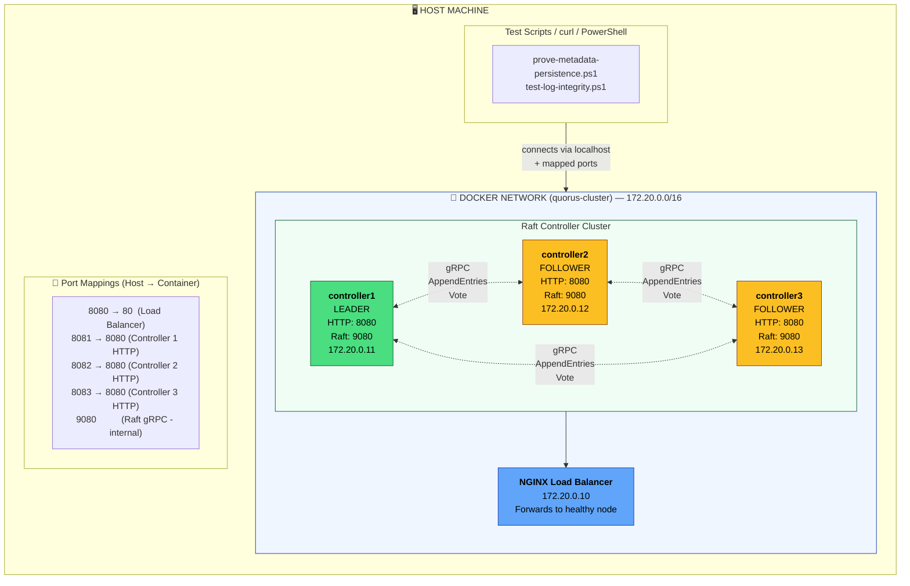

# Quorus Raft Cluster Testing Guide

**Version:** 1.0  
**Date:** 2026-02-01  
**Author:** Mark Andrew Ray-Smith Cityline Ltd  

This guide explains how to run and test the 3-node Quorus Controller cluster defined in `docker/compose/docker-compose-controller-first.yml`. The cluster uses Raft consensus for leader election, workflow metadata replication, and fault-tolerant coordination.

---

## Table of Contents

1. [Quick Start](#quick-start)
2. [Architecture Overview](#architecture-overview)
3. [Cluster Configuration](#cluster-configuration)
4. [Raft Consensus Endpoints](#raft-consensus-endpoints)
5. [Running Cluster Tests](#running-cluster-tests)
6. [Observability Stack](#observability-stack)
7. [Leader Election Validation](#leader-election-validation)
8. [Troubleshooting](#troubleshooting)
9. [Test Progress](#test-progress)

---

## Quick Start

### 1. Set M2_REPO Environment Variable (first time only)

The Quorus controller depends on `raftlog-core`, a local library not available on Maven Central. Docker needs access to your local Maven repository to find this dependency during the build.

**Windows (PowerShell):**
```powershell
# Set permanently
[System.Environment]::SetEnvironmentVariable("M2_REPO", "$env:USERPROFILE/.m2/repository", "User")
$env:M2_REPO = "$env:USERPROFILE/.m2/repository"

# Verify
Write-Host "M2_REPO = $env:M2_REPO"
```

**Linux / macOS (Bash):**
```bash
# Add to ~/.bashrc or ~/.zshrc for persistence
echo 'export M2_REPO="$HOME/.m2/repository"' >> ~/.bashrc
source ~/.bashrc

# Verify
echo "M2_REPO = $M2_REPO"
```

### 2. Build Controller Image (~3-4 minutes first time)

Compiles the Java controller code and packages it into a Docker image. This creates a self-contained container with the Raft consensus engine, HTTP API, and all dependencies.

```powershell
cd c:\Users\mraysmit\dev\idea-projects\quorus
docker build --no-cache -t quorus-controller:latest -f quorus-controller/Dockerfile .
```

### 3. Start 3-Node Quorus Controller Cluster

Launches the `quorus-controller1`, `quorus-controller2`, and `quorus-controller3` containers. They discover each other via the `QUORUS_CLUSTER_NODES` environment variable and form a Raft cluster. One Quorus Controller will be elected leader; the other two become followers.

```powershell
cd docker\compose
docker-compose -f docker-compose-controller-first.yml up -d
```

### 4. Verify Cluster Health

Checks that `quorus-controller1`, `quorus-controller2`, and `quorus-controller3` are running and healthy. The health check confirms each Quorus Controller's `HttpApiServer` is responding on port 8080.

```powershell
# Wait for leader election (~15 seconds)
Start-Sleep -Seconds 15

# Check container health
docker ps --filter "name=quorus-controller" --format "table {{.Names}}\t{{.Status}}"
```

**Expected output:**
```
NAMES                STATUS
quorus-controller3   Up 15 seconds (healthy)
quorus-controller2   Up 15 seconds (healthy)
quorus-controller1   Up 15 seconds (healthy)
```

### 5. Verify Leader Election

Queries `quorus-controller1`'s `/health` endpoint (via port 8081) to confirm Raft consensus is working. The response shows which Quorus Controller is the leader, the current Raft term, and log replication status (`commitIndex`/`lastApplied`).

```powershell
curl -s http://localhost:8081/health | ConvertFrom-Json | Select-Object -ExpandProperty checks | Select-Object -ExpandProperty raft
```

### 6. Stop Cluster (when done)

Stops all containers and removes their volumes. The `-v` flag cleans up persistent data so the next start begins fresh.

```powershell
cd docker\compose
docker-compose -f docker-compose-controller-first.yml down -v
```

### Quick Reference

| Container | Host Port | Container Port | Raft Port | IP Address |
|-----------|-----------|----------------|-----------|------------|
| `quorus-controller1` | 8081 | 8080 | 9080 | 172.20.0.11 |
| `quorus-controller2` | 8082 | 8080 | 9080 | 172.20.0.12 |
| `quorus-controller3` | 8083 | 8080 | 9080 | 172.20.0.13 |
| `nginx` (load balancer) | 8080 | 80 | - | 172.20.0.10 |

---

## Architecture Overview



**Legend:** 🟢 Quorus Controller (LEADER) | 🟡 Quorus Controller (FOLLOWER) | 🔵 `nginx` load balancer

### Why Raft Consensus for Quorus?

| Benefit | Quorus Use Case |
|---------|----------------|
| **Leader Election** | When a Quorus Controller fails, another is automatically elected to handle workflow submissions and agent coordination |
| **State Replication** | Workflow definitions, agent registrations, and transfer job state are replicated across all three controllers |
| **Fault Tolerance** | The cluster continues operating if one Quorus Controller crashes (2 of 3 controllers = quorum) |
| **Consistency** | All controllers see the same workflow and agent state, preventing duplicate job assignments |

### Quorus Controller Raft States

| State | Behavior in Quorus |
|-------|--------------------|
| `FOLLOWER` | Receives replicated workflow/agent data from the leader; redirects API requests to the leader; votes in elections |
| `CANDIDATE` | Requesting votes from other controllers to become the new leader (transient state during elections) |
| `LEADER` | Accepts workflow submissions via `HttpApiServer`, replicates state to followers, coordinates agent job assignments |

---

## Cluster Configuration

### Docker Compose File

**Location:** `docker/compose/docker-compose-controller-first.yml`

This file defines the entire 3-node cluster, including network settings, volume mounts, health checks, and startup dependencies. Each controller is built from the same Dockerfile but configured with unique node identities.

### Quorus Controller Configuration

Each Quorus Controller (`quorus-controller1`, `quorus-controller2`, `quorus-controller3`) receives environment variables that configure its identity and cluster membership.

```yaml
controller1:
  build:
    context: ../..
    dockerfile: quorus-controller/Dockerfile
  container_name: quorus-controller1
  hostname: controller1
  environment:
    - QUORUS_NODE_ID=controller1
    - QUORUS_RAFT_HOST=0.0.0.0
    - QUORUS_RAFT_PORT=9080
    - QUORUS_HTTP_PORT=8080
    - QUORUS_CLUSTER_NODES=controller1=controller1:9080,controller2=controller2:9080,controller3=controller3:9080
    - ELECTION_TIMEOUT_MS=3000
    - HEARTBEAT_INTERVAL_MS=500
```

### Quorus Controller Identity Parameters

| Parameter | Example | Description |
|-----------|---------|-------------|
| `QUORUS_NODE_ID` | controller1 | Unique identifier for this Quorus Controller in the cluster |
| `QUORUS_RAFT_HOST` | 0.0.0.0 | Bind address for `GrpcRaftServer` (0.0.0.0 = all interfaces) |
| `QUORUS_RAFT_PORT` | 9080 | Port for Raft gRPC communication between Quorus Controllers |
| `QUORUS_HTTP_PORT` | 8080 | Port for `HttpApiServer` (REST API and `/health` endpoint) |
| `QUORUS_CLUSTER_NODES` | controller1=...:9080,... | Comma-separated list of all Quorus Controllers (name=host:port) |

### Raft Timing Parameters

| Parameter | Default | Description |
|-----------|---------|-------------|
| `ELECTION_TIMEOUT_MS` | 3000 | Time (ms) before a FOLLOWER Quorus Controller starts an election |
| `HEARTBEAT_INTERVAL_MS` | 500 | Interval (ms) at which the LEADER sends `AppendEntries` heartbeats |

**Rule:** Election timeout should be >> heartbeat interval (typically 5-10x).

### Network Configuration

The cluster uses a custom Docker bridge network with a defined subnet, allowing containers to communicate using predictable IP addresses and hostnames.

```yaml
networks:
  quorus-cluster:
    driver: bridge
    ipam:
      config:
        - subnet: 172.20.0.0/16
```

| Setting | Value | Purpose |
|---------|-------|---------|
| `driver: bridge` | bridge | Creates an isolated virtual network. Containers can communicate with each other but are isolated from the host's network unless ports are explicitly mapped. |
| `ipam` | (IP Address Management) | Configures how Docker assigns IP addresses to containers on this network. |
| `subnet: 172.20.0.0/16` | 172.20.0.0/16 | Reserves a private IP range (172.20.0.1 – 172.20.255.254). The `/16` means 65,534 usable addresses. |

**Why fixed IPs matter for Quorus Controllers:**
- `quorus-controller1`, `quorus-controller2`, `quorus-controller3` get IPs `172.20.0.11`, `172.20.0.12`, `172.20.0.13`
- Quorus Controllers can reliably reach each other via `GrpcRaftTransport` even after container restarts
- DNS resolution (`controller1`, `controller2`, `controller3`) also works via Docker's embedded DNS
- Avoids issues where dynamic IP assignment could break the `QUORUS_CLUSTER_NODES` membership list

**Container IP Assignments:**

| Container | Fixed IP | Assigned via |
|-----------|----------|--------------|
| `nginx` | 172.20.0.10 | `ipv4_address` in `docker-compose-controller-first.yml` |
| `quorus-controller1` | 172.20.0.11 | `ipv4_address` in `docker-compose-controller-first.yml` |
| `quorus-controller2` | 172.20.0.12 | `ipv4_address` in `docker-compose-controller-first.yml` |
| `quorus-controller3` | 172.20.0.13 | `ipv4_address` in `docker-compose-controller-first.yml` |

---

## Raft Consensus Endpoints

### Health Endpoint (includes Raft state)

Each Quorus Controller (`quorus-controller1`, `quorus-controller2`, `quorus-controller3`) exposes a `/health` endpoint that reports both application health and Raft consensus state.

```powershell
curl -s http://localhost:8081/health | ConvertFrom-Json
```

**Response:**
```json
{
  "status": "UP",
  "checks": {
    "raft": {
      "state": "LEADER",
      "nodeId": "controller1",
      "term": 1,
      "commitIndex": 42,
      "lastApplied": 42
    }
  }
}
```

**Response Fields Explained:**

| Field | Example | Description |
|-------|---------|-------------|
| `status` | "UP" | Overall health of this Quorus Controller. "UP" means the `HttpApiServer` is responding and the Raft consensus engine is operational. |
| `state` | "LEADER" | This controller's Raft role: `LEADER` (accepts writes), `FOLLOWER` (replicates from leader), or `CANDIDATE` (election in progress). |
| `nodeId` | "controller1" | This controller's identifier, matching the `QUORUS_NODE_ID` environment variable set in `docker-compose-controller-first.yml`. |
| `term` | 1 | Raft election term. Increments when a new election occurs (e.g., after leader failure). All controllers in a healthy cluster report the same term. |
| `commitIndex` | 42 | Highest Raft log index replicated to a majority of controllers (2 of 3). Committed entries (workflows, agent state) are durable. |
| `lastApplied` | 42 | Highest Raft log index applied to the `QuorusStateMachine`. Should equal `commitIndex` when this controller is caught up. |

**Interpreting the values:**

- **`commitIndex` = `lastApplied`**: This Quorus Controller is fully caught up; all committed entries have been applied to its `QuorusStateMachine`.
- **`commitIndex` > `lastApplied`**: This Quorus Controller is still applying committed entries (transient state during catch-up).
- **Different `term` values across Quorus Controllers**: A new leader election is in progress or just completed.
- **Multiple Quorus Controllers report `LEADER`**: Split-brain condition (temporary); the Quorus Controller with the higher term will win.

> **What are committed entries?**  
> When a workflow is submitted via `curl` or the Quorus API, the LEADER Quorus Controller appends it to its Raft log and replicates it to the FOLLOWER Quorus Controllers. An entry becomes **committed** once the LEADER confirms it has been written to a majority (2 of 3 Quorus Controllers). Only committed entries are guaranteed to survive failures—they will never be lost or overwritten. The `commitIndex` tracks the highest such entry. Once committed, the entry is then **applied** to the `QuorusStateMachine` (the actual workflow/agent data store), which is tracked by `lastApplied`.
>
> **Example:** Submitting a Quorus workflow YAML to the 3-node Quorus Controller cluster:
> 1. `curl -X POST http://localhost:8080/api/v1/workflows -d @daily-export.yaml` → the `nginx` container (port 8080) routes to the current Quorus Controller leader
> 2. The leader's `HttpApiServer` (running inside `quorus-controller1`, `quorus-controller2`, or `quorus-controller3`) receives the request
> 3. The leader's `RaftNode` appends `{workflowId: "wf-123", name: "daily-export", transfers: [...]}` to its Raft log at index 43
> 4. The leader's `GrpcRaftTransport` sends the entry to the other two Quorus Controllers via `AppendEntries` gRPC (port 9080)
> 5. One follower's `RaftNode` writes to its log and acknowledges → majority reached (2 of 3 controllers)
> 6. The leader updates `commitIndex` to 43 → entry is now **committed** and durable
> 7. The leader's `QuorusStateMachine` applies the entry (`lastApplied` = 43) and responds with `201 Created`
> 8. Follower `QuorusStateMachine` instances apply the entry when they learn of the new `commitIndex`

### Cluster Status Endpoint

```powershell
curl -s http://localhost:8081/api/v1/cluster/status | ConvertFrom-Json
```

### Metrics Endpoint

```powershell
curl -s http://localhost:8081/metrics | Select-String "quorus"
```

**Quorus Raft Metrics (exported by each controller):**
```
quorus_cluster_state         # This controller's Raft state: 0=FOLLOWER, 1=CANDIDATE, 2=LEADER
quorus_cluster_term          # Current Raft election term (same across healthy cluster)
quorus_cluster_is_leader     # 1 if this controller is leader, 0 otherwise
quorus_cluster_commit_index  # Highest log index committed (replicated to 2+ controllers)
quorus_cluster_last_applied  # Highest log index applied to QuorusStateMachine
quorus_cluster_log_size      # Total Raft log entries (workflows, agent state, etc.)
quorus_raft_rpc_ratio_total  # gRPC calls between controllers (AppendEntries, RequestVote)
```

### Quorus Controller API Endpoints

These endpoints are served by the `HttpApiServer` class running inside the `quorus-controller1`, `quorus-controller2`, and `quorus-controller3` containers. Access via the `nginx` load balancer (port 8080) or directly to a specific Quorus Controller (ports 8081-8083).

**How `HttpApiServer` works inside each container:**

Each Quorus Controller container runs a single Java process (`QuorusControllerVerticle`) that starts two servers:

1. **`HttpApiServer`** (port 8080 inside container) — A Vert.x HTTP server that handles REST API requests. It provides the `/health`, `/metrics`, and `/api/v1/*` endpoints. When a request arrives (e.g., `POST /api/v1/workflows`), the `HttpApiServer` forwards it to the local `RaftNode`. If this Quorus Controller is the LEADER, it processes the request; if it's a FOLLOWER, it can redirect or reject the write.

2. **`GrpcRaftServer`** (port 9080 inside container) — A gRPC server that handles Raft protocol messages (`AppendEntries`, `RequestVote`) from the other two Quorus Controllers. This is how the 3-node cluster maintains consensus.

**Access patterns:**

| Access Method | URL | Use Case |
|---------------|-----|----------|
| Via `nginx` load balancer | `http://localhost:8080/...` | Production usage; `nginx` routes to a healthy Quorus Controller |
| Direct to `quorus-controller1` | `http://localhost:8081/...` | Testing/debugging a specific node |
| Direct to `quorus-controller2` | `http://localhost:8082/...` | Testing/debugging a specific node |
| Direct to `quorus-controller3` | `http://localhost:8083/...` | Testing/debugging a specific node |

**Endpoint Reference:**

| Endpoint | Method | Description |
|----------|--------|-------------|
| `/health` | GET | Controller health including Raft state (as shown above) |
| `/metrics` | GET | Prometheus metrics (prefixed with `quorus_`) |
| `/api/v1/cluster/status` | GET | Raft cluster status: leader ID, term, all node states |
| `/api/v1/agents` | GET | Quorus Agents currently registered with this cluster |
| `/api/v1/workflows` | POST | Submit a Quorus workflow YAML for execution |

---

## Running Cluster Tests

### Prerequisites

1. Docker Desktop running
2. `M2_REPO` environment variable set (see Quick Start step 1)
3. `quorus-controller:latest` image built: `docker images | Select-String quorus-controller`
4. 3-node Quorus Controller cluster started via `docker-compose-controller-first.yml` (see Quick Start)

### Validate Leader Election

```powershell
# Run the metadata persistence proof script
.\scripts\prove-metadata-persistence.ps1
```

**Expected output:**
```
=== PROOF: METADATA PERSISTENCE DURING LEADER CHANGES ===

🔍 Step 1: Capturing initial cluster state...
  controller1: LEADER
  controller2: FOLLOWER
  controller3: FOLLOWER

✅ Leader found: controller1
```

### Test Log Integrity

```powershell
.\scripts\test-log-integrity.ps1
```

### Manual Leader Election Test

```powershell
# 1. Find current leader
foreach ($port in 8081, 8082, 8083) {
    $health = curl -s "http://localhost:$port/health" | ConvertFrom-Json
    $state = $health.checks.raft.state
    Write-Host "Port $port : $state"
}

# 2. Stop the leader (assume controller1 is leader)
docker stop quorus-controller1

# 3. Wait for new election (~5 seconds)
Start-Sleep -Seconds 5

# 4. Check new leader
foreach ($port in 8082, 8083) {
    $health = curl -s "http://localhost:$port/health" | ConvertFrom-Json
    $state = $health.checks.raft.state
    Write-Host "Port $port : $state"
}

# 5. Restart stopped Quorus Controller
docker start quorus-controller1
```

### View Raft Logs

```powershell
.\scripts\view-raft-logs.ps1

# Or directly
docker logs quorus-controller1 2>&1 | Select-String "LEADER|FOLLOWER|CANDIDATE|term|vote"
```

---

## Observability Stack

### Start with Full Observability

```powershell
# Start observability first
cd docker\compose
docker-compose -f docker-compose-observability.yml up -d

# Wait for services
Start-Sleep -Seconds 30

# Start 3-node Quorus Controller cluster
docker-compose -f docker-compose-controller-first.yml up -d

# Connect Prometheus to Quorus Controller network
docker network connect compose_quorus-cluster quorus-prometheus

# Reload Prometheus config
curl -X POST http://localhost:9090/-/reload
```

### Observability Services

| Service | Port | Purpose | URL |
|---------|------|---------|-----|
| Grafana | 3000 | Dashboards | http://localhost:3000 |
| Prometheus | 9090 | Metrics | http://localhost:9090 |
| Loki | 3100 | Log aggregation | http://localhost:3100 |
| Tempo | 3200 | Distributed tracing | http://localhost:3200 |
| OTLP Collector | 4317/4318 | Telemetry | gRPC/HTTP |

### Grafana Access

- **URL:** http://localhost:3000
- **Username:** admin
- **Password:** admin
- **Dashboard:** Quorus Controller

### Prometheus Queries

```promql
# Current Raft state per Quorus Controller (0=FOLLOWER, 1=CANDIDATE, 2=LEADER)
quorus_cluster_state{job="quorus-controllers-compose"}

# Which Quorus Controller is leader (value = 1)
quorus_cluster_is_leader{job="quorus-controllers-compose"} == 1

# Current Raft term across Quorus Controllers
quorus_cluster_term{job="quorus-controllers-compose"}

# gRPC traffic between Quorus Controllers (AppendEntries, RequestVote)
rate(quorus_raft_rpc_ratio_total[1m])
```

---

## Leader Election Validation

### Test Scenarios

#### Scenario 1: Clean Cluster Start

1. Start the 3-node Quorus Controller cluster via `docker-compose-controller-first.yml`
2. Expect: One controller becomes LEADER within `ELECTION_TIMEOUT_MS` (3 seconds)
3. Verify: The other two controllers are FOLLOWERs, receiving heartbeats from the leader

```powershell
docker-compose -f docker-compose-controller-first.yml up -d
Start-Sleep -Seconds 15

# Count leaders (should be exactly 1)
$leaders = 0
foreach ($port in 8081, 8082, 8083) {
    $state = (curl -s "http://localhost:$port/health" | ConvertFrom-Json).checks.raft.state
    if ($state -eq "LEADER") { $leaders++ }
}
Write-Host "Leaders: $leaders (expected: 1)"
```

#### Scenario 2: Leader Failure

1. Stop the current leader container (`docker stop quorus-controller1` if controller1 is leader)
2. Expect: Remaining controllers detect missing heartbeats; new election within `ELECTION_TIMEOUT_MS` (3 seconds)
3. Verify: One of controller2/controller3 becomes the new LEADER; workflow submissions continue via `nginx` load balancer

```powershell
# Stop leader (assume controller1)
docker stop quorus-controller1
Start-Sleep -Seconds 5

# Verify new leader elected
foreach ($port in 8082, 8083) {
    $state = (curl -s "http://localhost:$port/health" | ConvertFrom-Json).checks.raft.state
    Write-Host "Port $port : $state"
}
```

#### Scenario 3: Leader Rejoins

1. Restart the stopped controller (`docker start quorus-controller1`)
2. Expect: The restarted controller rejoins as a FOLLOWER (it has a stale term)
3. Verify: Controller syncs Raft log from current leader; `commitIndex` and `lastApplied` converge

```powershell
docker start quorus-controller1
Start-Sleep -Seconds 10

# Original leader should now be FOLLOWER
$state = (curl -s "http://localhost:8081/health" | ConvertFrom-Json).checks.raft.state
Write-Host "controller1 state: $state (expected: FOLLOWER)"
```

#### Scenario 4: Network Partition (minority isolation)

1. Disconnect one controller from the Docker network: `docker network disconnect compose_quorus-cluster quorus-controller3`
2. Expect: The remaining two controllers (controller1, controller2) maintain quorum; workflow submissions continue
3. Isolated controller3: Cannot become leader (cannot reach quorum); returns to FOLLOWER when reconnected

---

## Troubleshooting

### Common Issues

#### Containers Start But No Leader Elected

**Symptom:** All three controllers stuck as FOLLOWER or CANDIDATE; `/health` endpoint never shows a LEADER.

**Cause:** Controllers cannot reach each other on gRPC port 9080 (used by `GrpcRaftTransport` for Raft communication).

**Fix:**
```powershell
# Check if nodes see each other
docker exec quorus-controller1 ping -c 1 controller2
docker exec quorus-controller1 ping -c 1 controller3

# Check Raft port connectivity
docker exec quorus-controller1 nc -zv controller2 9080
```

#### `peers={}` in Controller Logs

**Symptom:** Controllers start but logs show `peers={}` — no other controllers discovered.

**Cause:** The `QUORUS_CLUSTER_NODES` environment variable is missing or malformed in `docker-compose-controller-first.yml`.

**Fix:** Ensure docker-compose uses:
```yaml
environment:
  - QUORUS_NODE_ID=controller1           # NOT: NODE_ID
  - QUORUS_CLUSTER_NODES=...             # NOT: CLUSTER_NODES
```

#### Docker Build Fails - "raftlog-core not found"

**Symptom:** Maven cannot find `dev.mars.raftlog:raftlog-core:1.0`

**Fix:**
```powershell
# Verify M2_REPO is set
Write-Host "M2_REPO = $env:M2_REPO"

# Verify raftlog-core exists
Test-Path "$env:M2_REPO/dev/mars/raftlog/raftlog-core/1.0/raftlog-core-1.0.jar"

# If missing, build raftlog first
cd path/to/raftlog
mvn clean install -DskipTests
```

#### Split Brain (Multiple Leaders)

**Symptom:** More than one controller reports `"state": "LEADER"` in `/health` response.

**Cause:** A network partition was resolved; the old leader hasn't yet received a heartbeat with a higher term.

**Fix:** This is transient (typically <1 second). The controller with the lower `term` will step down when it receives an `AppendEntries` with a higher term. If persistent:
```powershell
# Check terms - highest term wins
foreach ($port in 8081, 8082, 8083) {
    $raft = (curl -s "http://localhost:$port/health" | ConvertFrom-Json).checks.raft
    Write-Host "Port $port : State=$($raft.state), Term=$($raft.term)"
}

# Restart the stale leader
docker restart quorus-controller1
```

#### Port Conflicts

**Fix:**
```powershell
netstat -ano | Select-String ":808[0-3]"
# Kill conflicting process or change docker-compose ports
```

### View Container Logs

```powershell
# All controllers
docker-compose -f docker-compose-controller-first.yml logs -f

# Specific controller
docker logs -f quorus-controller1

# Filter for Raft events
docker logs quorus-controller1 2>&1 | Select-String "LEADER|election|term|vote"
```

---

## Test Progress

### Validation Summary

| Test | Status | Description |
|------|--------|-------------|
| Cluster Start | ✅ | `quorus-controller1`, `quorus-controller2`, `quorus-controller3` start and form Raft cluster |
| Leader Election | ✅ | Single Quorus Controller elected LEADER within `ELECTION_TIMEOUT_MS` |
| Follower Heartbeats | ✅ | FOLLOWER Quorus Controllers receive `AppendEntries` from LEADER |
| Leader Failover | ✅ | New LEADER elected when current LEADER container stops |
| Controller Rejoin | ✅ | Restarted Quorus Controller syncs Raft log and becomes FOLLOWER |
| Metrics Export | ✅ | All `quorus_cluster_*` metrics visible in Prometheus |
| Log Replication | ✅ | Workflow and agent state replicated to all three Quorus Controllers |

### Key Files

| File | Purpose |
|------|---------|
| `docker/compose/docker-compose-controller-first.yml` | 3-node cluster definition |
| `docker/compose/docker-compose-observability.yml` | Prometheus, Grafana, Loki, Tempo |
| `scripts/prove-metadata-persistence.ps1` | Leader election test script |
| `scripts/test-log-integrity.ps1` | Log replication validation |
| `scripts/view-raft-logs.ps1` | Filter Raft-related logs |
| `quorus-controller/src/main/java/.../RaftNode.java` | Raft consensus implementation |
| `quorus-controller/src/main/java/.../GrpcRaftTransport.java` | gRPC transport layer |

### Validated Capabilities

- ✅ Quorus Controller leader election completes within 3 seconds (`ELECTION_TIMEOUT_MS`)
- ✅ LEADER sends `AppendEntries` heartbeats every 500ms (`HEARTBEAT_INTERVAL_MS`)
- ✅ FOLLOWER Quorus Controller triggers election after 3 seconds without heartbeat
- ✅ Quorus Controller cluster survives 1 container failure (2 of 3 = quorum)
- ✅ `quorus_cluster_*` Prometheus metrics exported correctly
- ✅ Grafana nodeGraph visualization of Quorus Controller cluster working
- ✅ Quorus Controller log aggregation via Loki operational
