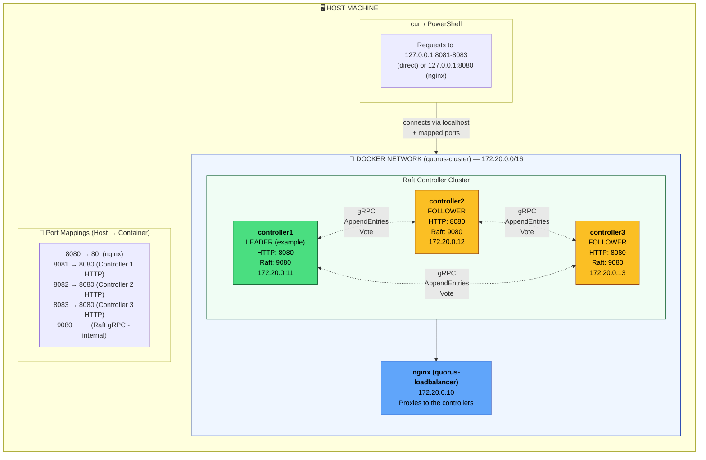

# Quorus Raft Cluster Testing Guide

**Version:** 1.1  
**Date:** 2026-10-03  
**Author:** Mark Ray-Smith — Cityline Ltd  
**License:** Apache 2.0  
**Status:** Engineering testing reference  
**Scope:** Static three-controller development cluster

This guide explains how to run and check the three-controller Quorus cluster defined in
`docker/compose/docker-compose-controller-first.yml`. The cluster uses Raft consensus for leader
election and replicated controller commands. Current authoritative state includes agents, transfers,
assignments, and routes; the current HTTP server does not register workflow REST resources.

This is a development test guide, not a secure production deployment baseline: the compose file
disables security and TLS. The canonical runtime, security, consistency, and API contracts are
[QUORUS_ARCHITECTURE_SPECIFICATION.md](../../docs/QUORUS_ARCHITECTURE_SPECIFICATION.md) and
[QUORUS_REST_API_SPECIFICATION.md](../../docs/QUORUS_REST_API_SPECIFICATION.md). The automated Docker
suites are described in the [Testing Guide](QUORUS_TESTING_README.md#4-tests-that-need-docker).

---

## Table of Contents

1. [Quick Start](#quick-start)
2. [Architecture Overview](#architecture-overview)
3. [Cluster Configuration](#cluster-configuration)
4. [Raft Consensus Endpoints](#raft-consensus-endpoints)
5. [Running Cluster Tests](#running-cluster-tests)
6. [Observability Stack](#observability-stack)
7. [Leader Election Validation](#leader-election-validation)
8. [Troubleshooting](#troubleshooting)
9. [Key Files](#key-files)

---

## Quick Start

Run the commands from the repository root unless a step changes directory.

### 1. Build the Controller Jar on the Host

The controller image only packages the jar that Maven built on the host; nothing is compiled inside
Docker. Maven resolves every dependency on the host, including `io.github.mraysmit:raftlog-core:1.2.0`
from Maven Central.

```powershell
./docker/build-runtime.ps1        # Bash: docker/build-runtime.sh
```

This runs `mvn clean package -pl quorus-controller,quorus-agent -am -DskipTests` and checks that
`quorus-controller/target/quorus-controller-1.0-SNAPSHOT.jar` exists.

### 2. Start the Three-Controller Cluster

```powershell
cd docker/compose
docker compose -f docker-compose-controller-first.yml up -d --build
```

Each controller service builds its image from `quorus-controller/Dockerfile`, which copies the host-built
jar; `--build` makes sure the image holds the jar you just built. The command starts
`quorus-controller1`, `quorus-controller2`, `quorus-controller3` and the `nginx` load balancer
(`quorus-loadbalancer`). The controllers find each other through `QUORUS_CLUSTER_NODES` and elect one
leader.

### 3. Check Container Health

The compose health check calls `curl -f http://localhost:8080/health/live` inside each controller,
every 10 seconds after a 30-second start period.

```powershell
docker ps --filter "name=quorus-" --format "table {{.Names}}\t{{.Status}}"
```

**Expected output** once the checks pass:
```
NAMES                 STATUS
quorus-loadbalancer   Up 40 seconds (healthy)
quorus-controller3    Up 40 seconds (healthy)
quorus-controller2    Up 40 seconds (healthy)
quorus-controller1    Up 40 seconds (healthy)
```

### 4. Check Leader Election

Query each controller directly on ports 8081–8083. `/health` returns the Raft view in a top-level
`raft` object.

```powershell
foreach ($port in 8081, 8082, 8083) {
    $h = Invoke-RestMethod "http://localhost:$port/health"
    "{0}: {1} term={2} leader={3}" -f $h.nodeId, $h.raft.state, $h.raft.term, $h.raft.leaderId
}
```

```bash
for port in 8081 8082 8083; do
  curl -s "http://localhost:$port/health" | jq -c '{nodeId, state: .raft.state, term: .raft.term, leader: .raft.leaderId}'
done
```

Do not use `http://localhost:8080/health` for this. Port 8080 is nginx, whose `location = /health`
answers `200 healthy` itself without asking any controller.

### 5. Stop the Cluster

```powershell
cd docker/compose
docker compose -f docker-compose-controller-first.yml down -v
```

`-v` removes the named data and log volumes, so the next start begins with empty Raft state. Omit it to
keep the state.

### Quick Reference

| Container | Host Port | Container Port | Raft Port | IP Address |
|-----------|-----------|----------------|-----------|------------|
| `quorus-controller1` | 127.0.0.1:8081 | 8080 | 9080 | 172.20.0.11 |
| `quorus-controller2` | 127.0.0.1:8082 | 8080 | 9080 | 172.20.0.12 |
| `quorus-controller3` | 127.0.0.1:8083 | 8080 | 9080 | 172.20.0.13 |
| `quorus-loadbalancer` (nginx) | 127.0.0.1:8080 | 80 | - | 172.20.0.10 |

---

## Architecture Overview


```mermaid
flowchart TB
    subgraph HOST["🖥️ HOST MACHINE"]
        direction TB
        
        subgraph TESTS["curl / PowerShell"]
            T1["Requests to 127.0.0.1:8081-8083<br/>(direct) or 127.0.0.1:8080 (nginx)"]
        end
        
        TESTS -->|"connects via localhost<br/>+ mapped ports"| DOCKER
        
        subgraph DOCKER["🐳 DOCKER NETWORK (quorus-cluster) — 172.20.0.0/16"]
            direction TB
            
            subgraph CLUSTER["Raft Controller Cluster"]
                direction LR
                C1["<b>controller1</b><br/>LEADER (example)<br/>HTTP: 8080<br/>Raft: 9080<br/>172.20.0.11"]
                C2["<b>controller2</b><br/>FOLLOWER<br/>HTTP: 8080<br/>Raft: 9080<br/>172.20.0.12"]
                C3["<b>controller3</b><br/>FOLLOWER<br/>HTTP: 8080<br/>Raft: 9080<br/>172.20.0.13"]
            end
            
            C1 <-.->|"gRPC<br/>AppendEntries<br/>Vote"| C2
            C2 <-.->|"gRPC<br/>AppendEntries<br/>Vote"| C3
            C1 <-.->|"gRPC<br/>AppendEntries<br/>Vote"| C3
            
            LB["<b>nginx (quorus-loadbalancer)</b><br/>172.20.0.10<br/>Proxies to the controllers"]
            
            CLUSTER --> LB
        end
        
        subgraph PORTS["📡 Port Mappings (Host → Container)"]
            direction LR
            PM["8080 → 80 &nbsp;(nginx)<br/>8081 → 8080 (Controller 1 HTTP)<br/>8082 → 8080 (Controller 2 HTTP)<br/>8083 → 8080 (Controller 3 HTTP)<br/>9080 &nbsp;&nbsp;&nbsp;&nbsp;&nbsp;&nbsp;&nbsp;&nbsp;&nbsp;(Raft gRPC - internal)"]
        end
    end
    
    style C1 fill:#4ade80,stroke:#166534,color:#000
    style C2 fill:#fbbf24,stroke:#92400e,color:#000
    style C3 fill:#fbbf24,stroke:#92400e,color:#000
    style LB fill:#60a5fa,stroke:#1e40af,color:#000
    style CLUSTER fill:#f0fdf4,stroke:#166534
    style DOCKER fill:#eff6ff,stroke:#1e40af
```

**Legend:** 🟢 Quorus Controller (LEADER; any controller can win the election) | 🟡 Quorus Controller (FOLLOWER) | 🔵 `nginx` load balancer

### Why Raft Consensus for Quorus?

| Benefit | Quorus Use Case |
|---------|----------------|
| **Leader Election** | When a Quorus Controller fails, another is automatically elected to handle supported writes and agent coordination |
| **State Replication** | Agent, transfer, assignment, and route commands are replicated across the controllers |
| **Fault Tolerance** | The cluster continues operating if one Quorus Controller crashes (2 of 3 controllers = quorum) |
| **Consistency** | Committed controller commands are applied in Raft order; this does not by itself provide duplicate-safe external transfer execution |

### Quorus Controller Raft States

| State | Behavior in Quorus |
|-------|--------------------|
| `FOLLOWER` | Receives replicated commands, returns `503 NOT_LEADER` for writes, and votes in elections |
| `CANDIDATE` | Requesting votes from other controllers to become the new leader (transient state during elections) |
| `LEADER` | Accepts supported writes via `HttpApiServer`, replicates commands to followers, and coordinates agent assignments |

---

## Cluster Configuration

### Docker Compose File

**Location:** `docker/compose/docker-compose-controller-first.yml`

This file defines the three controllers, the nginx load balancer, the network, named volumes and health
checks. Every controller service builds its image from `quorus-controller/Dockerfile`, which copies the
host-built jar; each is configured with its own node identity.

### Quorus Controller Configuration

Environment of `controller1` (the other two differ only in `QUORUS_NODE_ID`, host port and IP):

```yaml
controller1:
  build:
    context: ../..
    dockerfile: quorus-controller/Dockerfile
  container_name: quorus-controller1
  hostname: controller1
  environment:
    - QUORUS_NODE_ID=controller1
    - QUORUS_RAFT_PORT=9080
    - QUORUS_HTTP_PORT=8080
    - QUORUS_SECURITY_PROFILE=development
    - QUORUS_SECURITY_ENABLED=false
    - QUORUS_SECURITY_ALLOW_INSECURE=true
    - QUORUS_SECURITY_HTTP_TLS_ENABLED=false
    - QUORUS_SECURITY_RAFT_TLS_ENABLED=false
    - QUORUS_RAFT_STORAGE_PATH=/app/data/raft
    - QUORUS_CLUSTER_NODES=controller1=controller1:9080,controller2=controller2:9080,controller3=controller3:9080
    - QUORUS_RAFT_ELECTION_TIMEOUT_MS=3000
    - QUORUS_RAFT_HEARTBEAT_INTERVAL_MS=500
    - JAVA_OPTS=-Xmx512m -Xms256m
```

The image has no entrypoint script: it runs `java $JAVA_OPTS -jar app.jar`. Its `ENV` sets
`QUORUS_HTTP_HOST=0.0.0.0`, so the HTTP API listens on all container interfaces.

### Quorus Controller Identity Parameters

| Parameter | Example | Description |
|-----------|---------|-------------|
| `QUORUS_NODE_ID` | controller1 | Unique identifier for this Quorus Controller in the cluster |
| `QUORUS_RAFT_PORT` | 9080 | Port for Raft gRPC communication between Quorus Controllers |
| `QUORUS_HTTP_PORT` | 8080 | Port for `HttpApiServer` (REST API and `/health` endpoints) |
| `QUORUS_HTTP_HOST` | 0.0.0.0 | HTTP bind address (set by the image; the packaged default is `127.0.0.1`) |
| `QUORUS_CLUSTER_NODES` | controller1=...:9080,... | Comma-separated list of all Quorus Controllers (name=host:port) |
| `QUORUS_RAFT_STORAGE_PATH` | /app/data/raft | WAL, metadata and snapshot directory, on the named volume mounted at `/app/data` |

### Raft Timing Parameters

| Parameter | Packaged default | `controller-first` | JUnit Docker fixtures | Description |
|-----------|------------------|--------------------|-----------------------|-------------|
| `QUORUS_RAFT_ELECTION_TIMEOUT_MS` | 5000 | 3000 | 1500 | Base time (ms) before a FOLLOWER starts an election |
| `QUORUS_RAFT_HEARTBEAT_INTERVAL_MS` | 1000 | 500 | 300 | Interval (ms) at which the LEADER sends `AppendEntries` heartbeats |

The packaged defaults come from `quorus-controller.properties` and the image `ENV`. Each value can be
overridden by the environment variable shown.

**Rule:** Election timeout should be much larger than the heartbeat interval (typically 5–10×).

### Network Configuration

The cluster uses a custom Docker bridge network with a defined subnet, allowing containers to communicate using predictable IP addresses and hostnames.

```yaml
networks:
  quorus-cluster:
    driver: bridge
    ipam:
      config:
        - subnet: 172.20.0.0/16
```

| Setting | Value | Purpose |
|---------|-------|---------|
| `driver: bridge` | bridge | Creates an isolated virtual network. Containers can communicate with each other but are isolated from the host's network unless ports are explicitly mapped. |
| `ipam` | (IP Address Management) | Configures how Docker assigns IP addresses to containers on this network. |
| `subnet: 172.20.0.0/16` | 172.20.0.0/16 | Reserves a private IP range (172.20.0.1 – 172.20.255.254). The `/16` means 65,534 usable addresses. |

**Why fixed IPs matter for Quorus Controllers:**
- `quorus-controller1`, `quorus-controller2`, `quorus-controller3` get IPs `172.20.0.11`, `172.20.0.12`, `172.20.0.13`
- Quorus Controllers can reliably reach each other via `GrpcRaftTransport` even after container restarts
- DNS resolution (`controller1`, `controller2`, `controller3`) also works via Docker's embedded DNS
- Avoids issues where dynamic IP assignment could break the `QUORUS_CLUSTER_NODES` membership list

**Container IP Assignments:**

| Container | Fixed IP | Assigned via |
|-----------|----------|--------------|
| `quorus-loadbalancer` | 172.20.0.10 | `ipv4_address` in `docker-compose-controller-first.yml` |
| `quorus-controller1` | 172.20.0.11 | `ipv4_address` in `docker-compose-controller-first.yml` |
| `quorus-controller2` | 172.20.0.12 | `ipv4_address` in `docker-compose-controller-first.yml` |
| `quorus-controller3` | 172.20.0.13 | `ipv4_address` in `docker-compose-controller-first.yml` |

---

## Raft Consensus Endpoints

### Health Endpoint (includes Raft state)

Each Quorus Controller exposes `/health`, which reports the node's Raft view and its local checks.
`HealthHandler` builds the response.

```powershell
Invoke-RestMethod http://localhost:8081/health | ConvertTo-Json
```

**Response:**
```json
{
  "status": "UP",
  "version": "1.0.0-alpha",
  "timestamp": "2026-10-03T09:15:42.123Z",
  "nodeId": "controller1",
  "raft": {
    "state": "LEADER",
    "term": 1,
    "commitIndex": 42,
    "isLeader": true,
    "leaderId": "controller1"
  },
  "checks": {
    "raftCluster": "UP",
    "diskSpace": "UP",
    "memory": "UP"
  }
}
```

**Response Fields Explained:**

| Field | Example | Description |
|-------|---------|-------------|
| `status` | "UP" | `UP` when every check passes; otherwise `DEGRADED`, with HTTP status 503 |
| `nodeId` | "controller1" | This controller's identifier, from `QUORUS_NODE_ID` |
| `raft.state` | "LEADER" | This controller's Raft role: `LEADER`, `FOLLOWER` or `CANDIDATE` |
| `raft.term` | 1 | Raft election term. Increments when a new election occurs. All controllers in a settled cluster report the same term |
| `raft.commitIndex` | 42 | Highest Raft log index this controller knows to be committed (replicated to a majority) |
| `raft.isLeader` | true | Whether this controller is the leader |
| `raft.leaderId` | "controller1" | The leader this controller knows of; `null` while none is known |
| `checks.raftCluster` | "UP" | `UP` while the Raft node is running, else `DOWN` |
| `checks.diskSpace`, `checks.memory` | "UP" | Background local checks; `WARNING` when a threshold is crossed |

There is no `checks.raft` object and no applied index in `/health`. The highest applied index is exported
as the metric `quorus_cluster_last_applied` (see [Metrics Endpoint](#metrics-endpoint)).

**Interpreting the values:**

- **Same `raft.term` and `raft.leaderId` on every controller, exactly one `LEADER`**: the cluster is
  settled.
- **Different `raft.term` values across Quorus Controllers**: a new leader election is in progress or
  just completed.
- **A follower's `raft.commitIndex` below the leader's**: the follower is catching up; it should
  converge within a few heartbeats.
- **Multiple Quorus Controllers report `LEADER`**: a stale leader from an older term that has not yet
  heard from the new one (temporary); the controller with the higher term wins.

> **What are committed entries?**  
> When a supported controller mutation is accepted, the LEADER appends its command to the Raft log and replicates it to the FOLLOWER controllers. An entry becomes **committed** once a majority acknowledges it. The `commitIndex` tracks the highest committed entry. Once committed, the entry is applied to the controller state (`QuorusStateStore`), which the `quorus_cluster_last_applied` metric tracks.
>
> **Example:** Submitting a tenant-scoped transfer to the 3-node Quorus Controller cluster:
> 1. `POST /api/v1/transfers` reaches the current Quorus Controller leader
> 2. The leader's `HttpApiServer` (running inside `quorus-controller1`, `quorus-controller2`, or `quorus-controller3`) receives the request
> 3. The leader's `RaftNode` appends the transfer creation command to its Raft log at index 43
> 4. The leader's `GrpcRaftTransport` sends the entry to the other two Quorus Controllers via `AppendEntries` gRPC (port 9080)
> 5. One follower's `RaftNode` writes to its log and acknowledges → majority reached (2 of 3 controllers)
> 6. The leader updates `commitIndex` to 43 → entry is now **committed** and durable
> 7. The leader applies the entry to `QuorusStateStore` and responds with `201 Created`
> 8. Followers apply the entry when they learn of the new `commitIndex`

### Cluster Status Endpoint

```powershell
Invoke-RestMethod http://localhost:8081/raft/status
```

Returns `nodeId`, `state`, `currentTerm`, `isLeader`, `isRunning` and, when a leader is known,
`leaderId` (from `ClusterHandler`). Note that the term field is `currentTerm` here and `raft.term` in
`/health`.

### Metrics Endpoint

```powershell
(Invoke-WebRequest http://localhost:8081/metrics).Content -split "`n" | Select-String "quorus_cluster|quorus_raft"
```

**Quorus Raft Metrics (exported by each controller):**
```
quorus_cluster_state         # This controller's Raft state: 0=FOLLOWER, 1=CANDIDATE, 2=LEADER
quorus_cluster_term          # Current Raft election term (same across healthy cluster)
quorus_cluster_is_leader     # 1 if this controller is leader, 0 otherwise
quorus_cluster_commit_index  # Highest log index committed (replicated to 2+ controllers)
quorus_cluster_last_applied  # Highest log index applied to the controller state
quorus_cluster_log_size      # Total Raft log entries
quorus_raft_rpc_ratio_total  # gRPC calls between controllers (AppendEntries, RequestVote)
```

### Quorus Controller API Endpoints

These endpoints are served by the `HttpApiServer` class running inside the `quorus-controller1`, `quorus-controller2`, and `quorus-controller3` containers. Access them through nginx (port 8080) or directly on a specific Quorus Controller (ports 8081-8083).

**How `HttpApiServer` works inside each container:**

Each Quorus Controller container runs a single Java process (`QuorusControllerApplication`, which deploys `QuorusControllerVerticle`) that starts two servers:

1. **`HttpApiServer`** (port 8080 inside container) — A Vert.x HTTP server that handles REST API requests. It provides health, metrics, Raft status, and the currently registered `/api/v1/*` endpoints. When a supported write arrives, the leader proposes it to Raft; a follower returns `503 NOT_LEADER` and does not redirect it.

2. **`GrpcRaftServer`** (port 9080 inside container) — A gRPC server that handles Raft protocol messages (`AppendEntries`, `RequestVote`) from the other two Quorus Controllers. This is how the 3-node cluster maintains consensus.

**Access patterns:**

| Access Method | URL | Use Case |
|---------------|-----|----------|
| Via `nginx` (`quorus-loadbalancer`) | `http://localhost:8080/...` | Development cluster testing through the repository load balancer. `/health` here is nginx's own check; other paths, including `/health/live` and `/health/ready`, are proxied to a controller |
| Direct to `quorus-controller1` | `http://localhost:8081/...` | Testing/debugging a specific node |
| Direct to `quorus-controller2` | `http://localhost:8082/...` | Testing/debugging a specific node |
| Direct to `quorus-controller3` | `http://localhost:8083/...` | Testing/debugging a specific node |

**Endpoint Reference:**

| Endpoint | Method | Description |
|----------|--------|-------------|
| `/health` | GET | Controller health including the Raft view (as shown above) |
| `/health/live`, `/health/ready` | GET | Liveness and readiness probes |
| `/metrics` | GET | Prometheus metrics (prefixed with `quorus_`) |
| `/raft/status` | GET | This controller's Raft status |
| `/api/v1/agents` | GET | Quorus Agents currently registered with this cluster |
| `/api/v1/transfers` | POST | Submit a tenant-scoped transfer request |

---

## Running Cluster Tests

### Automated Docker Suites (JUnit)

The repeatable cluster tests are the `docker`-tagged classes in `quorus-controller`
(`DockerRaftClusterTest`, `ConfigurableRaftClusterTest`, `NetworkPartitionTest`,
`AdvancedNetworkTest`, `ContainerRecreationDurabilityTest`, `ContainerImageBaselineTest`). They do not
use `docker-compose-controller-first.yml`: they build a `quorus-controller:test` image from the
host-built jar and start their own 3-node and 5-node clusters from
`quorus-controller/src/test/resources/`. Build the jars first, then run them without `clean`:

```powershell
./docker/build-runtime.ps1
mvn test -pl quorus-controller -am '-Dtest.excludedGroups=' -Dgroups=docker
```

See the [Testing Guide](QUORUS_TESTING_README.md#42-docker-tagged-controller-tests) for what each class
covers, including the R1-1 container-recreation test and its `docker-compose-3node-durable.yml`
fixture.

### Manual Checks Against `controller-first`

**Prerequisites:**

1. Docker running
2. Host jars built with `docker/build-runtime` (Quick Start step 1)
3. The cluster started with `docker compose -f docker-compose-controller-first.yml up -d --build`

The helper scripts `scripts/prove-metadata-persistence.ps1`, `scripts/test-log-integrity.ps1` and
`scripts/view-raft-logs.ps1` do not work against this cluster: they expect five controllers on ports
8081–8085, and `prove-metadata-persistence.ps1` and `view-raft-logs.ps1` read `checks.raft`, which
`/health` does not return (register item `ENG-19`). Use the commands below instead.

### Manual Leader Election Test

```powershell
function Get-RaftView([int[]]$ports) {
    foreach ($port in $ports) {
        try {
            $h = Invoke-RestMethod "http://localhost:$port/health" -TimeoutSec 3
            "{0} (:{1}) {2} term={3}" -f $h.nodeId, $port, $h.raft.state, $h.raft.term
        } catch { "(:$port) unreachable" }
    }
}

# 1. Find the current leader
Get-RaftView 8081, 8082, 8083

# 2. Stop the leader (here controller1)
docker stop quorus-controller1

# 3. Wait for the new election (election timeout is 3000 ms in this topology)
Start-Sleep -Seconds 5

# 4. Check the new leader
Get-RaftView 8082, 8083

# 5. Restart the stopped Quorus Controller; it rejoins as FOLLOWER
docker start quorus-controller1
```

### View Raft Logs

```powershell
docker logs quorus-controller1 2>&1 | Select-String "LEADER|FOLLOWER|CANDIDATE|term|vote"
```

---

## Observability Stack

### Start with Full Observability

```powershell
# Start observability first
cd docker/compose
docker compose -f docker-compose-observability.yml up -d

# Wait for services
Start-Sleep -Seconds 30

# Start 3-node Quorus Controller cluster
docker compose -f docker-compose-controller-first.yml up -d --build

# Connect Prometheus to the controller network (compose project "compose" when started from docker/compose)
docker network connect compose_quorus-cluster quorus-prometheus

# Reload Prometheus config
curl -X POST http://localhost:9090/-/reload
```

### Observability Services

| Service | Port | Purpose | URL |
|---------|------|---------|-----|
| Grafana | 3000 | Dashboards | http://localhost:3000 |
| Prometheus | 9090 | Metrics | http://localhost:9090 |
| Loki | 3100 | Log aggregation | http://localhost:3100 |
| Tempo | 3200 | Distributed tracing | http://localhost:3200 |
| OTLP Collector | 4317/4318 | Telemetry | gRPC/HTTP |

### Grafana Access

- **URL:** http://localhost:3000
- **Username:** admin
- **Password:** admin (development default from `docker-compose-observability.yml`)
- **Dashboard:** Quorus Controller

### Prometheus Queries

```promql
# Current Raft state per Quorus Controller (0=FOLLOWER, 1=CANDIDATE, 2=LEADER)
quorus_cluster_state{job="quorus-controllers-compose"}

# Which Quorus Controller is leader (value = 1)
quorus_cluster_is_leader{job="quorus-controllers-compose"} == 1

# Current Raft term across Quorus Controllers
quorus_cluster_term{job="quorus-controllers-compose"}

# Applied index lag per controller
quorus_cluster_commit_index{job="quorus-controllers-compose"} - quorus_cluster_last_applied{job="quorus-controllers-compose"}

# gRPC traffic between Quorus Controllers (AppendEntries, RequestVote)
rate(quorus_raft_rpc_ratio_total[1m])
```

---

## Leader Election Validation

The snippets below use the `Get-RaftView` function from
[Manual Leader Election Test](#manual-leader-election-test), or read `raft.state` from `/health`
directly.

### Test Scenarios

#### Scenario 1: Clean Cluster Start

1. Start the 3-node Quorus Controller cluster via `docker-compose-controller-first.yml`
2. Expect: One controller becomes LEADER shortly after start (election timeout 3000 ms here)
3. Verify: The other two controllers are FOLLOWERs and report the same `raft.term` and `raft.leaderId`

```powershell
cd docker/compose
docker compose -f docker-compose-controller-first.yml up -d --build
Start-Sleep -Seconds 15

# Count leaders (should be exactly 1)
$leaders = 0
foreach ($port in 8081, 8082, 8083) {
    if ((Invoke-RestMethod "http://localhost:$port/health").raft.state -eq "LEADER") { $leaders++ }
}
Write-Host "Leaders: $leaders (expected: 1)"
```

#### Scenario 2: Leader Failure

1. Stop the current leader container (`docker stop quorus-controller1` if controller1 is leader)
2. Expect: The remaining controllers miss heartbeats and elect a new leader after the election timeout
3. Verify: One of controller2/controller3 becomes the new LEADER; supported writes resume after client retry against the new leader

```powershell
# Stop leader (assume controller1)
docker stop quorus-controller1
Start-Sleep -Seconds 5

# Verify new leader elected
foreach ($port in 8082, 8083) {
    $h = Invoke-RestMethod "http://localhost:$port/health"
    Write-Host "Port $port : $($h.raft.state) (leader $($h.raft.leaderId))"
}
```

#### Scenario 3: Leader Rejoins

1. Restart the stopped controller (`docker start quorus-controller1`)
2. Expect: The restarted controller rejoins as a FOLLOWER (it has a stale term)
3. Verify: Its `raft.term` and `raft.commitIndex` converge with the leader's

```powershell
docker start quorus-controller1
Start-Sleep -Seconds 10

# Original leader should now be FOLLOWER
$h = Invoke-RestMethod "http://localhost:8081/health"
Write-Host "controller1 state: $($h.raft.state) term=$($h.raft.term) commitIndex=$($h.raft.commitIndex) (expected: FOLLOWER)"
```

#### Scenario 4: Network Partition (minority isolation)

1. Disconnect one controller from the Docker network: `docker network disconnect compose_quorus-cluster quorus-controller3`
2. Expect: The remaining two controllers (controller1, controller2) maintain quorum; supported writes can continue through the leader
3. Isolated controller3: Cannot become leader (cannot reach quorum); returns to FOLLOWER when reconnected with `docker network connect compose_quorus-cluster quorus-controller3`

The automated equivalents of these scenarios are in `DockerRaftClusterTest` (start, election, leader
failure, partition recovery) and `NetworkPartitionTest` (majority partition, split-brain prevention,
recovery).

---

## Troubleshooting

### Common Issues

#### Containers Start But No Leader Elected

**Symptom:** All three controllers stay FOLLOWER or CANDIDATE; no `/health` response shows a LEADER.

**Cause:** Controllers cannot reach each other on gRPC port 9080 (used by `GrpcRaftTransport` for Raft communication), or `QUORUS_CLUSTER_NODES` is wrong.

**Fix:**
```powershell
# Name resolution and network reachability between controllers (curl is in the image)
docker exec quorus-controller1 curl -s http://controller2:8080/health/live
docker exec quorus-controller1 curl -s http://controller3:8080/health/live

# Raft connection errors
docker logs quorus-controller1 2>&1 | Select-String "9080|UNAVAILABLE|peers="
```

#### `peers={}` in Controller Logs

**Symptom:** The startup line `Cluster configuration: nodeId=..., peers={}` shows no other controllers.

**Cause:** The `QUORUS_CLUSTER_NODES` environment variable is missing or malformed in `docker-compose-controller-first.yml`.

**Fix:** Ensure docker-compose uses:
```yaml
environment:
  - QUORUS_NODE_ID=controller1           # NOT: NODE_ID
  - QUORUS_CLUSTER_NODES=...             # NOT: CLUSTER_NODES
```

#### Image Build Fails: Controller Jar Not Found

**Symptom:** `docker compose ... up --build` fails at `COPY quorus-controller/target/quorus-controller-*.jar app.jar`.

**Cause:** The host-built jar does not exist. The image never compiles Java or runs Maven.

**Fix:** Run `docker/build-runtime.ps1` (or `docker/build-runtime.sh`) from the repository root, then
rebuild. Maven dependency problems, including `raftlog-core`, appear in that host build, not in Docker.

#### Split Brain (Multiple Leaders)

**Symptom:** More than one controller reports `raft.state` = `LEADER` in its `/health` response.

**Cause:** A network partition was resolved; the old leader hasn't yet received a heartbeat with a higher term.

**Fix:** This is transient. The controller with the lower `term` steps down when it receives an `AppendEntries` with a higher term. If it persists:
```powershell
# Check terms - highest term wins
foreach ($port in 8081, 8082, 8083) {
    $raft = (Invoke-RestMethod "http://localhost:$port/health").raft
    Write-Host "Port $port : State=$($raft.state), Term=$($raft.term)"
}

# Restart the stale leader
docker restart quorus-controller1
```

#### Port Conflicts

**Fix:**
```powershell
netstat -ano | Select-String ":808[0-3]"
# Stop the conflicting process or change the docker compose ports
```

### View Container Logs

```powershell
# All controllers
docker compose -f docker-compose-controller-first.yml logs -f

# Specific controller
docker logs -f quorus-controller1

# Filter for Raft events
docker logs quorus-controller1 2>&1 | Select-String "LEADER|election|term|vote"
```

---

## Key Files

| File | Purpose |
|------|---------|
| `docker/compose/docker-compose-controller-first.yml` | 3-node development cluster with nginx |
| `docker/compose/nginx/nginx.conf` | nginx upstream and `/health` rule |
| `docker/compose/docker-compose-observability.yml` | Prometheus, Grafana, Loki, Tempo, OTLP collector |
| `docker/build-runtime.ps1`, `docker/build-runtime.sh` | Host build of the controller and agent jars |
| `quorus-controller/Dockerfile` | Runtime image that packages the host-built jar |
| `quorus-controller/src/test/resources/docker-compose-*.yml` | Fixtures for the JUnit Docker suites |
| `quorus-controller/src/main/java/.../raft/RaftNode.java` | Raft consensus implementation |
| `quorus-controller/src/main/java/.../raft/GrpcRaftTransport.java` | gRPC transport layer |
| `quorus-controller/src/main/java/.../http/handlers/HealthHandler.java` | `/health` response |
| `quorus-controller/src/main/java/.../http/handlers/ClusterHandler.java` | `/raft/status` response |
