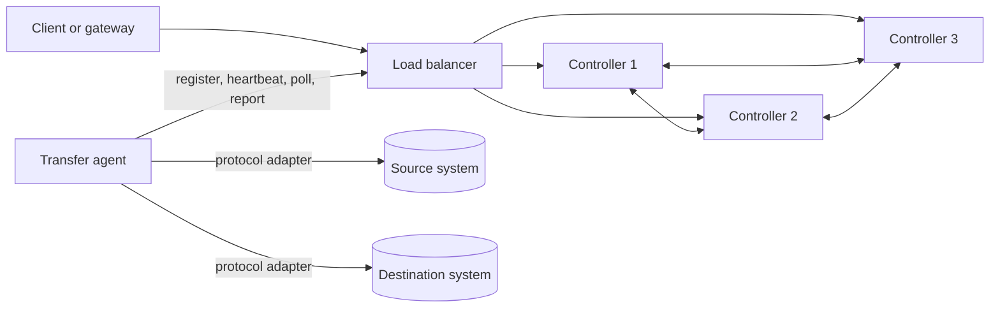
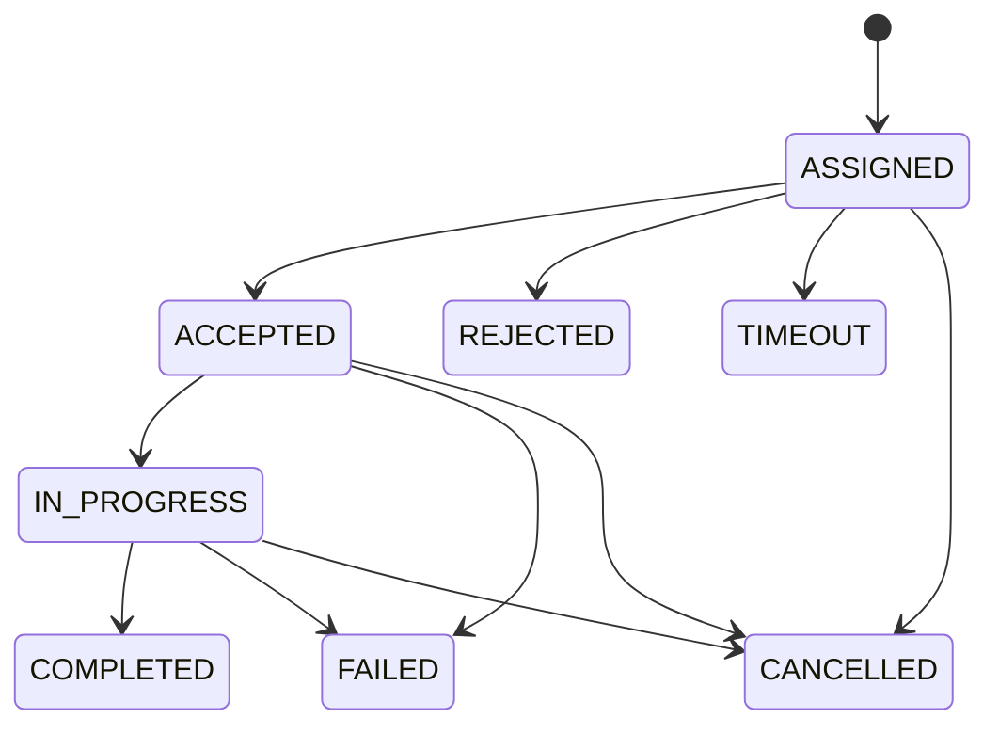

# Quorus Architecture Specification

**Version:** 1.2  
**Date:** 2026-09-01  
**Author:** Mark Ray-Smith — Cityline Ltd  
**License:** Apache 2.0  
**Status:** Canonical and normative  
**Scope:** Current alpha architecture and production release requirements

## 1. Purpose

This document is the authoritative architecture specification for Quorus. It defines:

- the implemented system boundary;
- the ownership and consistency model for state;
- the controller-agent transfer contract;
- the operational monitoring, observability, and telemetry contract for critical transfers;
- the supported availability and delivery semantics;
- the security boundary;
- the conditions that must be met before production claims are made.

The larger `docs-design/design/QUORUS_SYSTEM_DESIGN.md` document is a non-normative target-state vision. Where it conflicts with this specification, this specification takes precedence.

The terms **MUST**, **MUST NOT**, **SHOULD**, **SHOULD NOT**, and **MAY** describe architectural requirements. A requirement marked as a known conformance gap is not implemented yet and blocks the release level stated for that gap.

## 2. Product Boundary

Quorus is a Java 25 and Vert.x 5 file-transfer platform with two execution modes:

1. **Direct execution:** an application invokes `quorus-core` or `quorus-workflow` in-process.
2. **Distributed execution:** controller nodes coordinate work through Raft-replicated metadata and agents execute transfers.

Quorus controllers coordinate file transfers. They do not store or relay file contents. File bytes remain in source, destination, or agent-local staging systems.

### 2.1 Current goals

- Give technology operations teams an accurate, timely, end-to-end view of every critical and time-sensitive transfer.
- Detect transfers that are late, stalled, degraded, retrying, or at risk of missing their required completion time.
- Establish authenticated, authorized, encrypted, and auditable connections between Quorus, its agents, and enterprise services.
- Deploy, upgrade, rotate, revoke, and decommission agents through a controlled enterprise lifecycle.
- Deterministic, durable control-plane state through Raft.
- Tenant-scoped agent registration, assignment, and status reporting.
- Protocol-isolated file transfer execution on agents.
- Declarative workflow parsing and execution.
- Observable controller, consensus, agent, and transfer behavior.

### 2.2 Current non-goals

- Exactly-once execution of arbitrary external side effects.
- Dynamic Raft membership changes.
- An agent-to-agent streaming protocol.
- A built-in identity provider or secrets vault.
- PostgreSQL, Redis, or etcd as controller state authorities.
- Compliance certification merely by deploying Quorus.

## 3. Capability Status

The status values in this table are normative:

- **Implemented:** present in the active runtime and usable within documented limits.
- **Partial:** present, but missing a required behavior or production guarantee.
- **Planned:** not part of the current runtime contract.

| Capability | Status | Current boundary |
|---|---|---|
| Core transfer engine | Implemented | Reactive execution through `SimpleTransferEngine` |
| HTTP/HTTPS, FTP/FTPS, SFTP, SMB/CIFS, NFS adapters | Implemented | Adapter features differ; resume is not generally available |
| YAML workflow parsing and dependency execution | Implemented | Conditions are carried as resolved strings; there is no general condition engine |
| Controller HTTP API | Implemented | Production profile requires TLS 1.3 client certificates, trusted identity resolution, policy middleware, and audit decisions; writes remain leader-only |
| Complete REST control and operations interface | Partial | The live API covers a subset of the canonical transfer, workflow, tenant, service-connectivity, agent-lifecycle, security, audit, and administration contract |
| Raft log, snapshots, and replicated controller state | Implemented | Membership is static and every node needs durable local storage |
| Agent registration, heartbeat, polling, and reporting | Implemented | Agent control clients support certificate-authenticated HTTPS with hostname verification; enrollment and rotation lifecycle remains incomplete |
| Transfer, assignment, and route CRUD | Implemented | CRUD does not imply autonomous route execution |
| Transfer-process metrics | Partial | Aggregate job counts, bytes, and duration exist; continuous progress, deadline risk, stall detection, and an end-to-end operational timeline are incomplete |
| Per-transfer operational telemetry and alerting | Planned | Required for critical and time-sensitive production transfers |
| Enterprise service connectivity controls | Planned | Endpoint policy, secret references, service identity verification, and egress enforcement are incomplete |
| Secure agent provisioning and deployment lifecycle | Planned | Unique identity enrollment, image signing, attestation, rotation, revocation, and controlled upgrade are required |
| Authenticated tenant derivation and tenant checks | Partial | HTTP transfer, agent, assignment, and route access is constrained by the verified identity; uniform state-machine enforcement remains incomplete |
| Distributed assignment lifecycle | Partial | The production agent omits the required `IN_PROGRESS` acknowledgement |
| Automatic route trigger evaluation | Planned | Route configuration and lifecycle state exist; no trigger service is wired into controller startup |
| Agent-to-agent file streaming | Planned | No protocol or endpoints are defined in the active runtime |
| Automatic job fencing and idempotent destination publication | Planned | Required before automatic failover/reassignment can claim duplicate-safe behavior |
| Authentication and authorization foundation | Partial | Mutual TLS, trusted gateway assertions, direct certificate bindings, stable policy decisions, effective-identity APIs, and hash-chained decision and HTTP completion audit are implemented; rotation automation and complete enterprise evidence services remain open |
| Dynamic controller membership | Planned | Live 3-to-5 or 5-to-3 membership changes are unsupported |
| PostgreSQL, Redis, or etcd controller state | Planned | These systems are not part of the canonical architecture |
| S3, Azure Blob, and Google Cloud Storage adapters | Planned | Not registered by the current protocol factory |
| Compliance certification | Planned | Security controls and operational evidence must be assessed separately |

## 4. Runtime Architecture

### 4.1 Controller responsibilities

Each controller process owns:

- one embedded Vert.x HTTP API;
- one Raft node;
- one gRPC Raft transport/server;
- one in-memory materialized state store rebuilt from the Raft log and snapshots;
- health, readiness, status, and metrics endpoints.

Only the elected leader accepts control-plane writes. Followers replicate committed commands and may serve explicitly stale-tolerant reads.

### 4.2 Agent responsibilities

An agent:

- belongs to exactly one configured tenant;
- registers capabilities with the controller;
- sends periodic heartbeats;
- polls for assignments addressed to its agent ID;
- executes the transfer through a local protocol adapter;
- reports assignment status and progress;
- refuses assignments addressed to another agent.

Agents are operationally replaceable but are not entirely stateless while a transfer is active. Active streams, staging files, checksums, and protocol sessions are local ephemeral state.

### 4.3 Module boundaries

| Module | Normative responsibility |
|---|---|
| `quorus-core` | Transfer domain objects, protocol adapters, transfer execution primitives |
| `quorus-workflow` | Workflow parsing, validation, variable resolution, dependency planning and execution |
| `quorus-tenant` | Tenant and quota domain services; it does not provide authenticated identity |
| `quorus-controller` | HTTP control plane, consensus, durable metadata and assignment coordination |
| `quorus-agent` | Controller communication and data-plane execution |
| `quorus-integration-examples` | Demonstrations only; not a production runtime dependency |

## 5. Authoritative State and Consistency

### 5.1 Source-of-truth rule

The committed Raft log plus its snapshots are the sole authority for controller-managed state. The maps in `QuorusStateStore` are materialized views of committed Raft commands.

PostgreSQL, Redis, etcd, metrics stores, log stores, and dashboards MUST NOT be treated as authoritative controller state unless a later architecture decision replaces this section and defines migration and transaction semantics.

### 5.2 State ownership

| State | Authority | Durability | Consistency | Notes |
|---|---|---|---|---|
| Transfer jobs | Raft | Log and snapshot | Strong for committed writes | Does not include file bytes |
| Job assignments | Raft | Log and snapshot | Strong for committed writes | State transitions MUST be validated during command application |
| Job queue | Raft | Log and snapshot | Strong for committed writes | In-memory service caches are non-authoritative |
| Agent registrations | Raft | Log and snapshot | Strong for committed writes | Tenant and capabilities are durable metadata |
| Agent heartbeat timestamps/status | Raft in the current implementation | Log and snapshot | Strong for committed writes | A future coalesced liveness plane requires a separate decision |
| Route configurations and route lifecycle status | Raft | Log and snapshot | Strong for committed writes | Automatic trigger evaluation is not implemented |
| System metadata | Raft | Log and snapshot | Strong for committed writes | Secrets MUST NOT be stored here |
| Active protocol sessions and staging files | Agent-local | Ephemeral unless the adapter documents otherwise | Local only | Reconciled after restart/failure |
| File contents | External source/destination systems | Owned externally | Protocol-specific | Never persisted in the controller quorum |
| Metrics, traces, and logs | Observability backend | Operational retention | Non-authoritative | Must not drive correctness decisions alone |

### 5.3 Command invariants

Every replicated command MUST be deterministic and MUST enforce invariants at state-machine application time, not only in an HTTP handler. At minimum:

- referenced jobs and agents MUST exist before an assignment is created;
- job, agent, and assignment tenant IDs MUST match;
- assignment transitions MUST compare the expected committed status;
- terminal states MUST NOT be overwritten by later non-idempotent transitions;
- duplicate create requests MUST either be idempotent or return a deterministic conflict;
- timestamps used for correctness MUST be supplied in the command rather than generated independently by each follower.

### 5.4 Read consistency

Committed Raft writes are strongly ordered. This does not make every HTTP read linearizable.

- A read served from a follower is a **stale-tolerant read** and may lag the leader.
- A client requiring read-after-write or linearizable behavior MUST read from the leader.
- Until a leader-aware read route or Raft `ReadIndex` equivalent exists, the public API MUST NOT advertise all reads as strongly consistent.
- Responses SHOULD identify the serving node, its role, term, and applied index so clients can evaluate freshness.

### 5.5 Persistence requirements

- Every production controller MUST use a durable storage backend and an explicitly mounted storage path.
- A blank storage path MUST be treated as invalid or replaced with the documented durable default.
- Memory storage is test-only.
- A controller MUST recover its term, vote, log, snapshot, and applied state after container recreation.
- Backups MUST be validated by restore tests; copying a live directory without a storage-specific consistency procedure is not sufficient.

### 5.6 Membership

Controller membership is static in the current architecture. All nodes MUST start with the same node set and network identities.

Live expansion or contraction is unsupported because joint-consensus membership change is not implemented. Documentation MUST NOT claim that adding a controller container automatically changes quorum membership.

## 6. Distributed Transfer Contract

### 6.1 Current lifecycle

The canonical assignment lifecycle is:

The executing agent MUST receive acknowledgement of `ACCEPTED`, then acknowledgement of `IN_PROGRESS`, before it performs an externally visible destination commit. `COMPLETED` is valid only from `IN_PROGRESS`.

The current production agent reports `ACCEPTED` and then `COMPLETED` without reporting `IN_PROGRESS`. This is a release-blocking conformance gap.

### 6.2 Delivery semantics

Quorus MUST NOT claim exactly-once execution. Consensus protects assignment metadata; it cannot by itself prevent a partitioned or delayed agent from performing an external side effect.

The production target is **at-least-once execution with idempotent publication**:

- a job has a stable `jobId`;
- each execution has a unique `attemptId` and monotonically increasing fencing generation;
- only an unexpired assignment lease permits destination publication;
- a destination commit must reject an older fencing generation where the destination supports fencing;
- retries use a new attempt while retaining the same job identity;
- completion reporting is idempotent for the same job and attempt;
- reconciliation decides the outcome when the destination commit succeeds but the completion acknowledgement is lost.

The `attemptId`, lease, and fencing generation are not present in the complete current runtime path. Automatic reassignment MUST remain conservative until they are implemented.

### 6.3 Destination publication

Where the destination supports rename or move, adapters SHOULD:

1. write to a staging name scoped by `jobId` and `attemptId`;
2. calculate and verify the configured checksum;
3. confirm the assignment lease/fencing generation;
4. atomically publish the final name;
5. report `COMPLETED` idempotently.

Where atomic publication or fencing is unavailable, the adapter MUST declare weaker semantics. The controller MUST expose those semantics to callers instead of claiming duplicate-free transfer.

### 6.4 Failure behavior

| Failure | Required behavior |
|---|---|
| Controller leader failure before commit | Client receives failure/timeout and may retry with the same idempotency key |
| Leader failure after commit but before response | Retry returns the committed result rather than creating a duplicate |
| Agent disappears before `IN_PROGRESS` | Assignment may expire and be reassigned |
| Agent disappears during transfer | Controller waits for lease expiry; a new attempt uses a higher fencing generation |
| Agent completes destination write but loses acknowledgement | Reconciliation inspects the attempt and destination evidence before retrying |
| Minority controller partition | Minority rejects writes; stale reads must be identified as such |
| Destination cannot support atomic publish | Adapter reports weaker semantics and cleanup requirements |

## 7. Canonical Data Plane

The current distributed data plane is single-agent execution:

1. A client or internal service creates a transfer job.
2. The leader commits the job and assignment through Raft.
3. The assigned agent polls `GET /api/v1/agents/:agentId/jobs`.
4. The agent accepts the assignment and executes source-to-destination transfer through its local protocol adapters.
5. The agent reports status through the controller API.

Controllers MUST NOT proxy file bytes. The active protocol does not include controller-initiated `/configure-monitor`, `/validate-location`, or `/initiate-transfer` calls to agents, and it does not include source-agent-to-destination-agent streaming.

Route fields that name source and destination agents are replicated configuration only in the current alpha. They do not establish an agent-to-agent data channel. A future dual-agent protocol requires a separate specification covering:

- mutual authentication and authorization;
- connection establishment across NAT and firewalls;
- flow control and backpressure;
- resume offsets and chunk identity;
- end-to-end integrity;
- lease and fencing propagation;
- compatibility and protocol version negotiation.

Credentials and private keys MUST be supplied to the executing agent through deployment-time secret mechanisms. They MUST NOT appear in route definitions, transfer jobs, Raft logs, metrics, or ordinary logs.

## 8. Routes and Workflows

### 8.1 Routes

Implemented route behavior is limited to:

- configuration validation;
- CRUD through the controller API;
- Raft replication and snapshots;
- lifecycle status updates such as suspend and resume.

Autonomous event, cron, interval, batch, size, and composite trigger evaluation is not part of the current runtime. Route documentation MUST identify these trigger types as schema/target-state capability until an evaluator, leader-only scheduling, deduplication, recovery, and tests are wired into controller startup.

### 8.2 Workflows

Workflow execution is an in-process library capability. A workflow definition can parse variables and dependencies and run transfer groups through the core engine. This MUST NOT be described as automatically equivalent to durable distributed route orchestration.

Durable distributed workflow execution requires replicated workflow instance state, deterministic scheduling, retry identity, and recovery after leader change. Those behaviors need a separate conformance decision before being advertised.

## 9. HTTP and Leader Routing Contract

### 9.1 Current behavior

- Mutating `/api/*` requests are accepted only by the Raft leader.
- A follower returns `503` with error code `NOT_LEADER` and the known leader ID.
- If no leader is known, the controller returns `503` with `NO_LEADER`.
- The implementation does not issue HTTP 307 redirects.
- Health, metrics, and stale-tolerant reads may be served by followers.

### 9.2 Client and load-balancer requirements

- A production load balancer SHOULD route writes only to the leader.
- If the load balancer is not leader-aware, clients MUST retry `NOT_LEADER` and transient `NO_LEADER` responses with bounded exponential backoff and jitter.
- Every retriable create operation MUST carry an idempotency key before automatic retries are enabled.
- A leader ID is not necessarily a client-routable address. The discovery contract MUST translate it through an approved service address.
- Read endpoints MUST document whether stale follower reads are acceptable.

Idempotency keys and a complete leader discovery route are current conformance gaps.

## 10. Enterprise Security, Service Connectivity, and Agent Deployment

### 10.1 Current security statement

Phase 1 now provides the active security foundation:

- the production controller profile requires TLS 1.3 mutual authentication and refuses to start without readable certificate, private-key, trust-bundle, identity-source, and audit-path configuration;
- human and service identities may be asserted only by an explicitly allowlisted gateway certificate over the mutually authenticated hop;
- agents and other direct workloads are resolved from exact certificate-subject bindings;
- controller-to-controller Raft uses TLS 1.3 mutual authentication, and agent clients use certificate-authenticated HTTPS with hostname verification;
- authorization middleware applies stable scope and tenant/environment decisions to every protected controller route;
- transfer, agent, assignment, and route handlers derive or validate tenant ownership against the verified identity, including collection filtering and agent self-binding;
- a shared runtime trust state re-evaluates certificate serial revocation on every controller HTTP request and Raft RPC, including established TLS connections;
- certificate lifetime and trust-policy version are observable through REST and OpenTelemetry, and controlled old/new certificate overlap is covered for HTTP, Raft, and agent clients;
- authentication, authorization, protected completion, certificate-lifecycle, and security-configuration events are written to separate operational and retained append-only, fsync'd, SHA-256 hash chains whose existing records are verified at startup;
- `/api/v1/security/me`, `/api/v1/security/authorization/explain`, `/api/v1/security/authorization/check`, `/api/v1/security/trust`, and `/api/v1/security/trust/revocations` expose the implemented identity, policy, and runtime trust controls.

The Phase 1 repository technical gate is complete against representative live HTTP, Raft, and agent TLS boundaries. This is not corporate-environment accreditation. The selected corporate PKI, gateway, secrets platform, evidence collector, production controller topology, and agent estate still require deployment-specific validation. In addition:

- agents do not yet have a complete certificate enrollment, rotation, revocation, and attestation lifecycle;
- protocol credentials can be represented in connection URIs;
- SFTP disables strict host-key checking in production code;
- route and transfer inputs do not yet constitute a centrally enforced destination and egress policy.

Quorus therefore MUST NOT yet be represented as enterprise production-ready merely because the Phase 1 code gate passed. Corporate PKI issuance, external identity validation and MFA at the trusted gateway, secrets management, encryption at rest, production rotation operations, WORM/SIEM evidence services, and regulatory controls remain deployment or later-phase responsibilities and require independent evidence.

### 10.2 Trust zones and connection flows

Every connection crossing a process, host, cluster, tenant, or network-zone boundary MUST have an explicit identity, authentication mechanism, authorization policy, encryption policy, endpoint-verification method, and audit trail.

| Connection | Current alpha behavior | Production requirement |
|---|---|---|
| User/application → gateway | External to Quorus | Enterprise authentication, TLS, authorization, request limits, audit, and tenant derivation |
| Gateway/load balancer → controller HTTP | TLS 1.3 mTLS; assertion headers accepted only from exact trusted gateway subjects; runtime serial revocation and overlap tests | Validate the selected gateway, PKI, rotation process, and assertion policy in the deployment environment |
| Controller → controller Raft gRPC | TLS 1.3 mTLS with hostname verification, configured controller trust bundle, per-RPC runtime revocation, and overlap tests | Validate no-quorum-loss rotation and revocation against the deployed topology and cluster PKI |
| Agent → controller | HTTPS mTLS client support, exact certificate-subject identity binding, agent/tenant self-authorization, controller-side runtime serial revocation, and overlap/hostname tests | Add constrained enrollment, short-lived identity, replay controls, managed renewal, and posture lifecycle |
| Controller → agent | No production job-push or data-plane connection | No inbound agent control path is assumed; any future push protocol requires a separate authenticated specification |
| Agent → source/destination service | Protocol adapter connects using the supplied endpoint and credentials | Policy-approved endpoint, least-privilege service identity, encrypted protocol where supported, remote identity verification, and auditable secret retrieval |
| Controller/agent → secret manager | Not integrated as a canonical runtime dependency | Workload-identity-authenticated retrieval of short-lived or rotated secrets; no secret values in control-plane state |
| Controller/agent → telemetry backend | Backend-specific | Encrypted authenticated export with tenant, confidentiality, retention, and redaction controls |
| Deployment platform → agent | Compose or platform-specific | Approved signed artifact, pinned digest, workload identity, immutable configuration, deployment audit, and controlled rollout |

Network location or an “internal” label MUST NOT be treated as authentication.

### 10.3 Service connection policy

An agent is a privileged enterprise integration component because it can read from and write to business services. Its connectivity MUST be constrained by policy rather than by arbitrary user-supplied URIs.

For each tenant, route, and environment, policy MUST define:

- permitted source and destination service identities or aliases;
- allowed DNS names, IP ranges, ports, protocols, and network zones;
- whether the endpoint is readable, writable, or both;
- allowed path, share, bucket, or namespace prefixes;
- approved authentication and encryption methods;
- required server certificate, host key, CA, or fingerprint policy;
- approved proxy, gateway, private endpoint, or firewall path;
- connection, idle, retry, and data-volume limits;
- whether cross-region, cross-environment, or cross-classification movement is permitted.

Production transfer requests SHOULD reference an approved service alias and secret reference, not embed raw connection details. The controller MUST resolve and authorize the alias before assignment, and the agent MUST enforce the resulting policy again before connecting. DNS resolution MUST NOT allow a permitted name to redirect the agent to a forbidden address or network zone.

Agents SHOULD use outbound-initiated connections to controllers and enterprise services. Agent health endpoints MUST be limited to the local orchestrator or approved monitoring network and MUST NOT expose a public control or data-plane surface.

Default-deny egress is the production baseline. A transfer to an unapproved endpoint, port, path, protocol, or network zone MUST fail before any service credential is retrieved or connection is opened. Denials MUST produce a security audit event without disclosing secret material.

### 10.4 Protocol security requirements

Protocol adapters MUST declare their security capabilities and fail closed when a route requires a control they cannot provide.

| Protocol | Production security requirement |
|---|---|
| HTTPS | TLS with hostname verification, approved trust roots, minimum protocol/cipher policy, redirect restrictions, and bounded response handling |
| HTTP | Prohibited for sensitive or cross-zone transfers unless a documented exception and compensating network control exist |
| SFTP | Strict host-key verification using managed known-hosts data or pinned fingerprints; approved authentication algorithms and keys |
| FTPS | Certificate and hostname verification for control and data channels; protected data channel required |
| FTP | Prohibited for credentials or sensitive data outside an explicitly approved isolated network exception |
| SMB/CIFS | SMB 3.x, signing and encryption where required, server identity validation, and least-privilege share/path access |
| NFS | Secure mount and network-zone policy enforced outside or alongside the adapter; export identity and path restrictions documented |

Protocol downgrade, certificate bypass, unknown SFTP host keys, changed host keys, unapproved redirects, and insecure fallback MUST fail closed in production profiles. Development-only insecure behavior MUST be explicitly named, disabled by default, visibly logged, and impossible to enable accidentally in a production profile.

### 10.5 Identity and secret lifecycle

Every controller, agent, gateway, and service connection MUST use a distinct identity appropriate to its role. Shared fleet-wide agent credentials are prohibited.

Agent identity lifecycle MUST include:

1. a short-lived, single-use bootstrap or platform workload identity;
2. enrollment against an approved controller or enterprise identity service;
3. binding of identity to agent ID, tenant, environment, deployment, and permitted capabilities;
4. issuance of a short-lived certificate or equivalent credential;
5. automatic rotation before expiry;
6. immediate revocation after compromise, decommissioning, tenant change, or unauthorized configuration drift;
7. controller rejection of expired, revoked, duplicated, or incorrectly bound identities.

Service credentials MUST be referenced by opaque secret identifiers and retrieved only by the authorized executing agent. Secret values MUST NOT appear in:

- route definitions or transfer request bodies;
- URI user-info fields;
- Raft commands, logs, or snapshots;
- metrics, traces, operational events, or error responses;
- container images or ordinary configuration files.

Secrets SHOULD be short-lived and scoped to the exact service, tenant, path, and operation. Rotation MUST NOT require rebuilding the agent image. Secret access and rotation failures MUST be audited and alerted without logging the secret.

### 10.6 Agent authorization and isolation

The authenticated agent identity MUST be authorized for:

- exactly one tenant unless an explicitly reviewed multi-tenant agent profile exists;
- its declared environment and network zone;
- approved protocols and adapter capabilities;
- approved source and destination service aliases;
- specific routes, paths, and operations where practical;
- configured concurrency, bandwidth, file-size, and scheduling limits.

The controller MUST derive agent and tenant identity from the authenticated connection and MUST reject conflicting identifiers in request bodies. The agent MUST reject work whose signed or integrity-protected assignment does not match its authenticated identity and policy.

Production, non-production, and different tenant trust domains SHOULD use separate credentials and SHOULD use separate certificate authorities or policy namespaces where the enterprise risk model requires it. A compromised development agent MUST NOT be able to register with or access production services.

### 10.7 Secure agent build and deployment lifecycle

Agents MUST be deployed as controlled enterprise workloads, not as manually copied executables with shared configuration.

#### Build and release

- Builds MUST be reproducible from reviewed source and pinned dependencies.
- The agent artifact or container image MUST have an SBOM, vulnerability scan, provenance, and approved signature.
- Deployments MUST pin an immutable version or image digest; mutable `latest` tags are prohibited in production.
- Release approval MUST record source revision, artifact digest, dependency inventory, security scan result, and compatibility range.

#### Runtime hardening

- Run as a dedicated non-root operating-system or workload identity.
- Use a read-only application filesystem with dedicated, quota-controlled staging storage.
- Do not mount container-engine sockets, controller data, unrelated host paths, or broad enterprise shares.
- Apply resource limits, process restrictions, platform security profiles, and default-deny ingress and egress rules.
- Synchronize time from an approved source because certificates, leases, audit events, deadlines, and event ordering depend on it.
- Mount credentials through the platform secret mechanism and prevent them from entering environment dumps or diagnostic bundles.
- Separate transfer staging, logs, and configuration with explicit ownership and retention.

#### Enrollment and readiness

An agent MUST NOT become eligible for assignments until it has:

- verified its artifact and runtime configuration;
- obtained and presented a valid workload identity;
- registered with the authorized tenant and environment;
- passed controller compatibility and policy checks;
- proved access only to its approved network destinations;
- loaded required trust roots or host keys;
- confirmed telemetry and audit export;
- passed health and secure-readiness checks.

Readiness MUST fail when mandatory identity, trust, secret, policy, or telemetry controls are unavailable.

#### Upgrade, drain, and rollback

- Upgrades MUST use a controlled rolling or replacement strategy with explicit capacity protection.
- An agent MUST enter drain mode and stop accepting new work before termination or security-sensitive upgrade.
- Active transfer behavior during drain MUST be defined: complete within a limit, checkpoint safely, or cancel without publishing a partial final file.
- Compatibility MUST be checked before the new version receives work.
- Rollback MUST use an approved signed version and MUST NOT restore revoked credentials or insecure configuration.
- Emergency security patches MUST have an auditable expedited path.

#### Revocation and decommissioning

Decommissioning MUST drain work, revoke agent identity, revoke or rotate accessible service secrets, remove controller registration and network policy, clean staging data according to retention policy, and retain an audit record. A removed agent MUST be unable to reconnect or complete a fenced transfer.

### 10.8 Security audit and detection

Security audit events MUST cover:

- agent enrollment, registration, identity rotation, revocation, and decommissioning;
- deployment, configuration, version, digest, policy, and trust-store changes;
- authentication and authorization success or failure;
- service alias resolution and egress policy allow or deny decisions;
- secret reference access and rotation outcome;
- remote certificate or host-key verification outcome;
- insecure protocol or downgrade attempts;
- cross-tenant, cross-environment, or unauthorized route attempts;
- repeated registration, replay, identity collision, or unusual connection behavior;
- security-driven drain, quarantine, or transfer cancellation.

Security alerts MUST identify the affected agent, tenant, environment, service alias, route or transfer when applicable, policy decision, actor or workload identity, and response action. Sensitive values remain redacted.

### 10.9 Threats in scope

| Threat | Required control |
|---|---|
| Tenant ID spoofing | Derive tenant from authenticated identity and enforce again during state application |
| Rogue or cloned agent | Unique short-lived identity, enrollment authorization, attestation, collision detection, and revocation |
| Compromised agent lateral movement | Least privilege, single-tenant binding, default-deny egress, service aliases, network segmentation, and quarantine |
| Malicious URI or server-side request forgery | Approved endpoint catalog, DNS/IP validation, redirect restrictions, and policy enforcement before secret retrieval |
| Service impersonation or man-in-the-middle | TLS/mTLS, hostname verification, host-key verification, pinned trust policy, and fail-closed adapters |
| Secret disclosure through state or telemetry | Opaque secret references, redaction, schema rejection, and automated leakage tests |
| Unsigned or vulnerable agent image | Pinned digest, signature and provenance verification, SBOM, vulnerability policy, and admission control |
| Replayed write or enrollment request | Idempotency key, nonce or bounded replay window, authenticated request, and single-use bootstrap identity |
| Stale agent committing after reassignment | Lease plus fencing generation and revocation-aware destination publication |
| Compromised follower serving stale data | Explicit read consistency and authenticated transport |
| Cross-environment trust reuse | Separate credentials and policy domains; production authorization rejects non-production identity |
| Insecure rollback | Signed approved rollback artifact, compatibility check, and no restoration of revoked credentials or configuration |

Compliance names MUST be used only after controls, evidence, retention, operating procedures, and external assessment are defined. Architecture diagrams alone do not establish compliance.

## 11. Availability and Failure Model

- A three-node controller cluster tolerates one unavailable controller while a majority can communicate.
- A five-node cluster tolerates two unavailable controllers, but deploying five nodes requires a separately configured static five-node cluster.
- Loss of quorum stops writes.
- Leader election time depends on election timeout, heartbeat interval, network delay, storage delay, and client retry behavior.
- File content availability depends on external source and destination systems, not the controller quorum.
- Agent failure can interrupt a transfer. Safe automatic reassignment depends on the lease/fencing contract in Section 6.
- “No single point of failure” MUST be scoped to controller metadata coordination; load balancers, gateways, storage mounts, DNS, certificate authorities, and source/destination systems require their own availability design.

## 12. Transfer Operations Monitoring, Observability, and Telemetry

### 12.1 Primary operational outcome

The primary observability outcome is not merely to prove that Quorus infrastructure is healthy. It is to let the technology operations team determine, in real time:

- which critical transfers are expected, queued, active, late, stalled, retrying, completed, or failed;
- whether an active transfer is progressing fast enough to meet its required completion time;
- where a transfer is blocked and which system or team owns the next action;
- whether the transferred file was verified and published successfully;
- what business process, tenant, route, workflow, source, and destination are affected;
- what happened across every attempt, including controller or agent failover;
- whether intervention is required before the business deadline is breached.

A green controller health check MUST NOT be interpreted as a healthy file-transfer service when a critical transfer is late, stalled, unverified, or unpublished.

### 12.2 Operational identity and service context

Every production transfer MUST have enough context for an operator to understand its impact without searching application logs or source code. The operational record MUST include:

- stable `jobId`, `assignmentId`, `attemptId`, and correlation or trace ID;
- tenant, route, workflow, and transfer name where applicable;
- executing agent and protocol;
- sanitized source and destination identifiers;
- business service or process name;
- criticality or priority;
- expected start time and required completion time or an explicitly recorded absence of a deadline;
- owning support team, escalation policy, and runbook reference;
- total bytes when known and checksum or integrity policy;
- creation, queue, assignment, acceptance, start, last-progress, publication, and terminal timestamps.

Secrets, credentials, access tokens, private keys, and secret-bearing URIs MUST NOT appear in this context.

Business service, deadline, ownership, and escalation metadata are not complete in the current job model. They are production requirements, not current capability claims.

### 12.3 Canonical transfer event timeline

Each state change and significant data-plane event MUST produce a structured operational event. At minimum, the event vocabulary is:

| Event | Operational meaning |
|---|---|
| `TRANSFER_SUBMITTED` | Transfer accepted into the control plane |
| `TRANSFER_QUEUED` | Waiting for an eligible agent or capacity |
| `TRANSFER_ASSIGNED` | Agent and attempt selected |
| `TRANSFER_ACCEPTED` | Agent acknowledged ownership |
| `TRANSFER_STARTED` | Data-plane execution entered `IN_PROGRESS` |
| `TRANSFER_PROGRESS` | Monotonic progress sample received |
| `TRANSFER_STALLED` | No qualifying progress within the configured threshold |
| `TRANSFER_DEADLINE_AT_RISK` | Current ETA or remaining work predicts a completion-time breach |
| `TRANSFER_RETRY_SCHEDULED` | A new attempt is planned, including reason and backoff |
| `TRANSFER_RECONCILING` | Controller is resolving an uncertain destination outcome |
| `TRANSFER_CHECKSUM_VERIFIED` | Configured integrity verification passed |
| `TRANSFER_PUBLISHED` | Final destination publication succeeded |
| `TRANSFER_COMPLETED` | Controller committed the valid terminal success state |
| `TRANSFER_FAILED` | Terminal failure committed, with normalized cause |
| `TRANSFER_CANCELLED` | Cancellation committed, including actor and reason |

Every event MUST contain event time, observed time, identifiers from Section 12.2, current state, prior state where applicable, and a normalized outcome or reason. Events MUST be ordered per job and attempt with a monotonic sequence number. Replayed events MUST be identifiable and safe for consumers to deduplicate.

The committed controller state remains authoritative. Telemetry events describe and explain that state; they do not replace it.

### 12.4 Progress, throughput, ETA, and deadline risk

An active transfer MUST report progress at a configurable cadence appropriate to its criticality and expected duration. Progress MUST include:

- cumulative bytes transferred;
- total bytes when known and completion percentage when derivable;
- interval and rolling-average throughput;
- time of the last successful byte advancement;
- elapsed transfer time;
- estimated completion time with an indication when the estimate is unavailable or low confidence;
- remaining deadline slack when a required completion time exists;
- retry count and current attempt number.

Progress values MUST be monotonic within an attempt. A heartbeat from an agent does not count as transfer progress. A transfer is stalled when bytes, records, or another protocol-specific progress unit has not advanced within its configured stall threshold.

ETA calculation SHOULD use recent observed throughput and SHOULD avoid presenting a precise estimate until enough samples exist. Deadline-risk evaluation MUST distinguish:

- not started by the expected start time;
- queued too long to meet the deadline;
- active but progressing too slowly;
- stalled;
- retrying with insufficient remaining time;
- complete at the agent but not verified, published, or committed at the controller.

### 12.5 Telemetry signals and correlation

Quorus MUST use the three telemetry signal types deliberately:

- **Metrics:** low-cardinality fleet, tenant, route, protocol, state, and outcome aggregates used for trends, SLOs, and alert evaluation.
- **Structured events/logs:** per-transfer operational timeline and failure evidence, keyed by the stable identifiers in Section 12.2.
- **Traces:** controller, assignment, agent, protocol, verification, publication, and reporting spans for one transfer attempt.

Unbounded values such as `jobId`, file name, complete URI, checksum, and error message MUST NOT be metric labels. They belong in structured events, logs, or trace attributes subject to security and retention controls.

The operational event pipeline MUST preserve correlation across retries and failovers: `jobId` identifies the business transfer, while `attemptId` identifies one execution. Dashboards and investigations MUST show both.

### 12.6 Operations views

The supported operations view MUST provide:

1. **Critical transfer board:** expected, in-flight, late, failed, and deadline-at-risk transfers ordered by urgency and business impact.
2. **Transfer timeline:** all control-plane and data-plane events for one job across every attempt.
3. **Route/workflow health:** success rate, completion-time distribution, lateness, queue delay, throughput, retries, and recurrent failure causes.
4. **Dependency view:** upstream and downstream workflow steps blocked by a transfer.
5. **Capacity view:** agent availability, active work, queue age, protocol saturation, and destination-specific constraints.

Infrastructure dashboards remain necessary, but they are supporting views rather than the main indicator of service success.

### 12.7 Alerting and escalation

Alerts MUST be actionable and based on transfer-process risk. Required alert classes include:

- critical transfer not started by its expected start time;
- queue age threatens the required completion time;
- no progress beyond the stall threshold;
- ETA predicts a deadline breach;
- repeated retry or exhausted retry policy;
- agent loss while a critical transfer is active;
- checksum mismatch or incomplete verification;
- destination publication failure or uncertain outcome;
- completion reported by the agent but not committed by the controller;
- missed required completion time;
- telemetry silence for an otherwise active critical transfer.

Every alert MUST include transfer identity, business service, criticality, current state, bytes and percentage where known, last-progress time, throughput, ETA, deadline slack, source and destination context, current attempt, normalized failure reason, owning team, runbook, and correlation link.

Alerts SHOULD warn before a deadline breach when the available evidence supports prediction. They MUST emit a breach alert when the required completion time is missed. Alert deduplication MUST group repeated symptoms for the same job and attempt without hiding a material state change.

### 12.8 Infrastructure telemetry

The runtime also exposes health, readiness, status, Raft status, and Prometheus metrics. Supporting infrastructure telemetry SHOULD include:

- serving controller ID, role, term, commit index, and applied index;
- command submission and commit latency;
- leader changes and write rejections;
- Raft log and snapshot size;
- agent heartbeat age and assignment lease age;
- protocol connection, timeout, and resource saturation signals;
- retry, reconciliation, fencing rejection, and duplicate-publication counters.

Infrastructure telemetry MUST correlate to affected transfers where possible. Metrics and logs remain diagnostic evidence and MUST NOT be used as an alternative source of truth for job state.

## 13. Release SLOs and Verification Gates

These are acceptance gates, not claims about the current alpha. A gate must have a repeatable automated test and retained result before it can be marked achieved.

| Area | Required measurable gate | Current status |
|---|---|---|
| End-to-end lifecycle | 1,000 consecutive assigned test transfers reach exactly one valid terminal controller state | Not achieved; `IN_PROGRESS` gap |
| Critical-transfer context | 100% of critical production transfer records include business service, owner, criticality, expected start, required completion time, and runbook | Not implemented in the current job model |
| Lifecycle event completeness | 100% of committed assignment transitions emit one deduplicable, correlated operational event with job and attempt identity | Not yet evidenced |
| Progress freshness | At least 99.9% of active critical transfers have a progress observation no older than `2 ×` their configured reporting interval | Not achieved end to end |
| Stall detection | 100% of injected transfer stalls raise an operational event and alert within `stall threshold + one alert evaluation interval` | Not implemented |
| Deadline monitoring | 100% of configured deadline breaches alert no later than one alert evaluation interval after breach; predictive risk alerts are measured separately | Not implemented |
| Terminal-state visibility | 99.9% of committed terminal states appear in the operations view within one configured telemetry publication interval | Not yet evidenced |
| Timeline correlation | 100% of retries and failovers retain one `jobId` and distinct `attemptId` values across events, logs, and traces | Blocked by missing attempt model |
| Single-controller durability | Zero committed control-state loss across 100 controller container recreation tests using the documented volume | Not yet evidenced |
| Leader failover | Write service resumes within `2 × configured election timeout + client retry interval` in 99% of 100 induced leader failures | Not yet evidenced |
| Duplicate-safe publication | Zero duplicate final publications across 1,000 induced agent/controller failure windows | Blocked by missing lease/fencing protocol |
| Tenant isolation | 100% of cross-tenant registration, assignment, polling, status, route, and transfer mutation tests are rejected | Partial |
| Authentication boundary | 100% of protected API and agent requests without valid identity are rejected | Blocked by external/built-in authentication integration |
| Encrypted trust flows | 100% of production gateway, controller, Raft, agent, service, secret-manager, and telemetry connections satisfy their configured encryption and peer-verification policy | Not implemented end to end |
| Agent identity lifecycle | 100% of production agents use a unique approved identity; expired, revoked, cloned, or incorrectly bound identities receive no assignments | Not implemented |
| Service egress policy | 100% of unapproved service aliases, DNS/IP targets, ports, protocols, paths, redirects, and network zones are denied before secret retrieval | Not implemented |
| Secret containment | Automated scans find zero secret values in request bodies, Raft state, logs, metrics, traces, images, and diagnostic bundles across the security test suite | Not achieved while URI credentials are supported |
| Agent artifact admission | 100% of production agents run an approved signed digest with verified provenance, SBOM, and vulnerability-policy result | Deployment-platform integration not implemented |
| Secure readiness | 100% of agents missing mandatory identity, trust, policy, secret-manager, or audit-export controls remain ineligible for assignments | Not implemented |
| Agent drain and upgrade | In 100 induced upgrades, draining agents accept zero new jobs and publish zero unauthorized partial final files | Not yet evidenced |
| Revocation | 100% of revoked agents are rejected within the configured revocation propagation limit and cannot publish a newly fenced attempt | Not implemented |
| SFTP identity | Unknown and changed host keys fail in 100% of protocol tests | Not achieved while host-key checking is disabled |
| Large HTTP transfer memory | Ten concurrent files larger than the agent heap complete with bounded streaming memory and no full-file buffering | Not achieved by the current HTTP adapter |
| Static three-node formation | 100 consecutive clean starts elect exactly one leader and agree on membership | Test evidence required |
| Snapshot recovery | Restored state hash equals committed pre-restart state in 100 consecutive snapshot/replay tests | Test evidence required |

Capacity figures such as requests per second, heartbeats per second, concurrent transfers, number of agents, or petabytes transferred MUST be published only with:

- workload and file-size distribution;
- hardware, JVM, storage, and network configuration;
- protocol mix and concurrency;
- p50, p95, and p99 latency;
- error and retry rates;
- benchmark source and reproducible invocation.

## 14. Known Conformance Gaps

| ID | Priority | Gap | Release consequence |
|---|---|---|---|
| ARCH-01 | Critical | Agent omits `IN_PROGRESS` before reporting `COMPLETED` | Blocks distributed success lifecycle |
| ARCH-02 | Critical | No attempt lease or fencing generation | Blocks duplicate-safe automatic reassignment |
| ARCH-03 | Critical | No authenticated API/agent identity boundary | Blocks untrusted or production multi-tenant exposure |
| ARCH-11 | Critical | No complete per-transfer operational event, progress, deadline, stall, and alerting model | Blocks use for critical, highly time-sensitive production transfers |
| ARCH-13 | Critical | Controller HTTP, Raft, and agent control connections lack a complete production TLS/mTLS identity boundary | Blocks secure enterprise deployment |
| ARCH-14 | Critical | No centrally enforced service alias, egress, endpoint-verification, and secret-reference policy | Allows agents to become an uncontrolled path to enterprise services |
| ARCH-15 | Critical | No complete agent enrollment, identity rotation, revocation, attestation, and quarantine lifecycle | Blocks trusted fleet operation and incident response |
| ARCH-18 | Critical | The live REST API covers only a subset of the canonical control, transfer-operations, security, connectivity, agent-lifecycle, and administration contract | Blocks supported enterprise operation and complete external integration |
| ARCH-04 | High | Route trigger evaluator is not wired | Route trigger types remain planned |
| ARCH-05 | High | Retriable writes lack idempotency keys and leader discovery | Blocks transparent HA write routing |
| ARCH-06 | High | Assignment referential/tenant invariants are not uniformly enforced in state application | Blocks strong tenant-isolation claim |
| ARCH-07 | High | Persistent controller path and deployment volume must be proven aligned | Blocks durability claim for container recreation |
| ARCH-08 | High | SFTP host-key verification is disabled | Blocks secure SFTP deployment |
| ARCH-12 | High | Job model lacks business service, operational owner, expected start, required completion time, and runbook context | Blocks actionable operations monitoring and escalation |
| ARCH-16 | High | No canonical signed-artifact admission, hardened runtime, controlled drain, upgrade, rollback, and decommissioning process | Blocks governed enterprise agent deployment |
| ARCH-17 | High | Protocol credentials may be carried in URI user-info rather than opaque secret references | Risks secret replication, logging, disclosure, and weak rotation |
| ARCH-09 | Medium | HTTP adapter buffers complete payloads | Blocks bounded-memory large-file claim |
| ARCH-10 | Medium | Dynamic Raft membership is absent | Blocks live controller scale-out claims |

This table SHOULD be updated whenever implementation changes. A gap is removed only when code, automated verification, and relevant operational documentation agree.

## 15. Architecture Decisions

The following decisions are effective with this specification:

1. Raft log and snapshots are the only authoritative controller state.
2. Controller maps are materialized state, not independent databases.
3. PostgreSQL, Redis, and etcd are outside the canonical current architecture.
4. The current data plane is agent polling plus single-agent protocol execution.
5. Agent-to-agent streaming is not an implicit route feature.
6. Follower writes return `503`; HTTP 307 redirection is not the current contract.
7. Follower reads may be stale and are not automatically linearizable.
8. Distributed execution must not claim exactly-once behavior.
9. Automatic reassignment requires lease, fencing, and reconciliation semantics.
10. Tenant fields are not identities; protected deployment requires authenticated principals.
11. Raft membership is static.
12. Performance and compliance statements require evidence before publication.
13. File-transfer process health is the primary operational observability outcome; infrastructure health is supporting evidence.
14. Critical transfers require correlated per-job and per-attempt events, progress freshness, deadline risk, actionable alerts, and an operator-facing timeline.
15. Every process, host, tenant, environment, and network-zone crossing requires explicit identity, authorization, encryption, peer verification, and audit.
16. Agents use unique workload identities, default-deny network policy, approved service aliases, and opaque secret references.
17. Production agent artifacts are signed, pinned, scanned, attestable, hardened, and deployed through controlled drain, rollout, rollback, revocation, and decommissioning procedures.
18. Raw service credentials are prohibited in transfer URIs, controller state, telemetry, images, and ordinary configuration.
19. The versioned REST API is the complete supported control, operations, security, and administration interface; operators and integrations must not require internal storage or undocumented endpoints.
20. OpenAPI 3.1 is the machine-readable REST contract, and current implementation coverage is reported explicitly rather than inferred from target-state resources.
21. File bytes and secret values never pass through the REST API; transfers use governed service aliases and opaque secret references.

## 16. Related Documents

- [Architecture quickstart](QUORUS_ARCHITECTURE_QUICKSTART.md) — concise implementation snapshot
- [REST API specification](QUORUS_REST_API_SPECIFICATION.md) — complete normative control, operations, security, and administration contract
- [Enterprise implementation plan](../docs-design/task/QUORUS_ENTERPRISE_IMPLEMENTATION_PLAN.md) — phased delivery, verification, and exit gates
- [HTTP API reference](QUORUS_API_REFERENCE.md) — active HTTP endpoints and payloads
- [Cluster startup guide](QUORUS_CLUSTER_STARTUP_GUIDE.md) — supported startup and deployment guidance
- [Codebase and documentation review, 2026-08-31](QUORUS_CODEBASE_AND_DOCUMENTATION_REVIEW_2026-08-31.md) — point-in-time implementation review
- [Comprehensive system design](../docs-design/design/QUORUS_SYSTEM_DESIGN.md) — non-normative target-state vision
