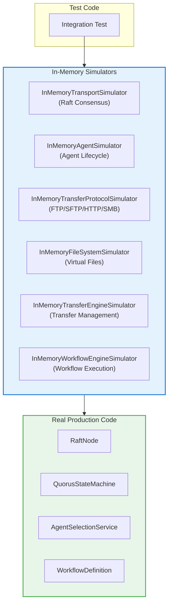
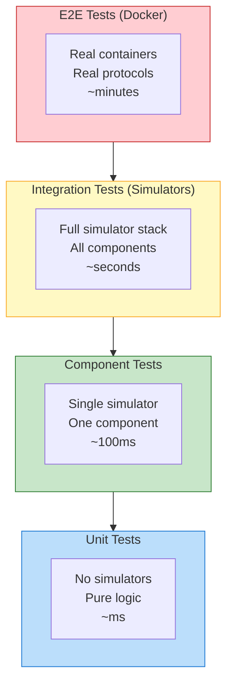

# Quorus In-Memory Simulators Design Document

**Version:** 1.0  
**Author:** Mark Andrew Ray-Smith Cityline Ltd  
**Date:** 2026-01-22  


## Executive Summary

This document proposes a suite of in-memory simulators for the Quorus distributed file transfer system. These simulators enable comprehensive testing without external dependencies (Docker containers, network services, file systems), providing faster test execution, deterministic behavior, and sophisticated chaos engineering capabilities.

## Background

### Current Testing Approach

| Test Type | Dependencies | Execution Time | Determinism |
|-----------|--------------|----------------|-------------|
| Unit Tests | None | ~milliseconds | ✅ High |
| In-Memory Integration | `InMemoryTransportSimulator` | ~seconds | ✅ High |
| Docker Integration | Docker, TestContainers | ~30+ seconds | ⚠️ Medium |
| Full E2E | Docker, Protocol Servers | ~minutes | ❌ Low |

### Problem Statement

Testing Quorus end-to-end currently requires:
- Docker containers for FTP, SFTP, HTTP servers
- Real network connections
- Real file system operations
- Significant setup/teardown time

This leads to:
- Slow CI/CD pipelines
- Flaky tests due to network/timing issues
- Difficulty testing edge cases and failure scenarios
- Resource-intensive test environments

### Solution: In-Memory Simulator Suite

A comprehensive suite of simulators that implement the same interfaces as production components, enabling:
- **100x faster** test execution
- **Deterministic** behavior
- **Controllable** failure injection
- **No external dependencies**

## Architecture Overview



## Simulator Specifications

---

## 1. InMemoryTransportSimulator (Existing)

**Status:** ✅ Implemented  
**Location:** `quorus-controller/src/test/java/.../raft/InMemoryTransportSimulator.java`  
**Interface:** `RaftTransport`

### Purpose

Simulates Raft consensus network communication without real TCP/gRPC connections.

### Features

| Feature | Description |
|---------|-------------|
| Message Routing | Global registry for node-to-node communication |
| Network Partitions | Simulate AWS AZ outages, switch failures |
| Latency Simulation | Configurable min/max latency |
| Packet Drop | Simulate lossy networks |
| Message Reordering | Out-of-order delivery |
| Bandwidth Throttling | Simulate slow WAN links |
| Failure Modes | CRASH, BYZANTINE, SLOW, FLAKY |

### Reference Documentation

See [QUORUS_IN_MEMORY_TRANSPORT_SIMULATOR.md](QUORUS_IN_MEMORY_TRANSPORT_SIMULATOR.md)

---

## 2. InMemoryTransferProtocolSimulator

**Status:** 🔵 Proposed  
**Location:** `quorus-core/src/test/java/.../protocol/InMemoryTransferProtocolSimulator.java`  
**Interface:** `TransferProtocol`

### Purpose

Simulates file transfer protocols (FTP, SFTP, HTTP, SMB) without real network connections or protocol servers.

### Interface

```java
public interface TransferProtocol {
    String getProtocolName();
    boolean canHandle(TransferRequest request);
    TransferResult transfer(TransferRequest request, TransferContext context);
    Future<TransferResult> transferReactive(TransferRequest request, TransferContext context);
    boolean supportsResume();
    boolean supportsPause();
    long getMaxFileSize();
}
```

### Design

```java
public class InMemoryTransferProtocolSimulator implements TransferProtocol {
    
    // Configuration
    private final String protocolName;
    private final InMemoryFileSystemSimulator fileSystem;
    
    // Chaos Engineering
    private long minLatencyMs = 0;
    private long maxLatencyMs = 0;
    private double failureRate = 0.0;
    private long simulatedBytesPerSecond = Long.MAX_VALUE;
    private ProtocolFailureMode failureMode = ProtocolFailureMode.NONE;
    
    // Transfer simulation
    private int progressUpdateIntervalMs = 100;
    private boolean supportsResume = true;
    private boolean supportsPause = true;
    
    public enum ProtocolFailureMode {
        NONE,                    // Normal operation
        AUTH_FAILURE,            // Authentication fails
        CONNECTION_TIMEOUT,      // Connection times out
        CONNECTION_REFUSED,      // Server refuses connection
        FILE_NOT_FOUND,          // Source file doesn't exist
        PERMISSION_DENIED,       // No read/write permission
        DISK_FULL,              // Destination disk full
        TRANSFER_INTERRUPTED,    // Transfer interrupted mid-way
        CHECKSUM_MISMATCH,      // File corruption detected
        SLOW_TRANSFER,          // Very slow transfer speed
        FLAKY_CONNECTION        // Intermittent disconnections
    }
}
```

### Key Features

#### Virtual File System Integration

```java
// Simulator works with InMemoryFileSystemSimulator
InMemoryFileSystemSimulator fs = new InMemoryFileSystemSimulator();
fs.createFile("/source/test.txt", "Hello, World!".getBytes());

InMemoryTransferProtocolSimulator protocol = new InMemoryTransferProtocolSimulator("sftp", fs);
TransferRequest request = TransferRequest.builder()
    .sourceUri(URI.create("sftp://server/source/test.txt"))
    .destinationPath(Path.of("/dest/test.txt"))
    .build();

TransferResult result = protocol.transfer(request, context);
// File now exists in virtual file system at /dest/test.txt
```

#### Realistic Progress Simulation

```java
// Configure realistic transfer speed
protocol.setSimulatedBytesPerSecond(10_000_000); // 10 MB/s
protocol.setProgressUpdateIntervalMs(100);       // Update every 100ms

// For a 100MB file, transfer takes ~10 seconds with progress events
context.setProgressCallback(progress -> {
    System.out.printf("Progress: %d%% (%d/%d bytes)%n",
        progress.getPercentComplete(),
        progress.getBytesTransferred(),
        progress.getTotalBytes());
});
```

#### Failure Injection

```java
// Simulate authentication failure
protocol.setFailureMode(ProtocolFailureMode.AUTH_FAILURE);
// Next transfer will fail with "Authentication failed"

// Simulate transfer interrupted at 50%
protocol.setFailureMode(ProtocolFailureMode.TRANSFER_INTERRUPTED);
protocol.setFailureAtPercent(50);
// Transfer fails at 50% with partial file

// Simulate random failures
protocol.setFailureRate(0.1); // 10% failure rate
```

#### Protocol-Specific Behavior

```java
// FTP-specific simulation
InMemoryTransferProtocolSimulator ftpProtocol = 
    InMemoryTransferProtocolSimulator.ftp(fileSystem)
        .withActiveMode(true)
        .withBinaryMode(true)
        .build();

// SFTP-specific simulation
InMemoryTransferProtocolSimulator sftpProtocol = 
    InMemoryTransferProtocolSimulator.sftp(fileSystem)
        .withKeyAuthentication(true)
        .withCompression(true)
        .build();

// HTTP-specific simulation
InMemoryTransferProtocolSimulator httpProtocol = 
    InMemoryTransferProtocolSimulator.http(fileSystem)
        .withRangeRequests(true)
        .withCompression(true)
        .build();
```

### API Reference

| Method | Description |
|--------|-------------|
| `setFailureMode(ProtocolFailureMode)` | Set failure mode for next transfer |
| `setFailureRate(double)` | Set random failure probability (0.0-1.0) |
| `setFailureAtPercent(int)` | Fail transfer at specific progress percentage |
| `setSimulatedBytesPerSecond(long)` | Set simulated transfer speed |
| `setLatencyConfig(long min, long max)` | Set connection latency range |
| `setProgressUpdateIntervalMs(int)` | Set progress callback interval |
| `reset()` | Reset all chaos configuration |

### Test Examples

```java
@Test
void testSftpTransferSuccess() {
    InMemoryFileSystemSimulator fs = new InMemoryFileSystemSimulator();
    fs.createFile("/remote/data.csv", testData);
    
    InMemoryTransferProtocolSimulator sftp = new InMemoryTransferProtocolSimulator("sftp", fs);
    sftp.setSimulatedBytesPerSecond(1_000_000); // 1 MB/s
    
    TransferResult result = sftp.transfer(request, context);
    
    assertThat(result.isSuccessful()).isTrue();
    assertThat(fs.fileExists("/local/data.csv")).isTrue();
    assertThat(result.getDuration()).isGreaterThan(Duration.ofMillis(100));
}

@Test
void testTransferWithAuthFailure() {
    InMemoryTransferProtocolSimulator sftp = new InMemoryTransferProtocolSimulator("sftp", fs);
    sftp.setFailureMode(ProtocolFailureMode.AUTH_FAILURE);
    
    assertThatThrownBy(() -> sftp.transfer(request, context))
        .isInstanceOf(TransferException.class)
        .hasMessageContaining("Authentication failed");
}

@Test
void testResumeAfterInterruption() {
    InMemoryTransferProtocolSimulator http = new InMemoryTransferProtocolSimulator("http", fs);
    http.setFailureMode(ProtocolFailureMode.TRANSFER_INTERRUPTED);
    http.setFailureAtPercent(50);
    
    // First attempt fails at 50%
    assertThatThrownBy(() -> http.transfer(request, context))
        .isInstanceOf(TransferException.class);
    
    // Resume from checkpoint
    http.setFailureMode(ProtocolFailureMode.NONE);
    TransferResult result = http.transfer(request, context);
    
    assertThat(result.isSuccessful()).isTrue();
    assertThat(result.getResumedFromBytes()).isEqualTo(fileSize / 2);
}
```

---

## 3. InMemoryAgentSimulator

**Status:** 🔵 Proposed  
**Location:** `quorus-controller/src/test/java/.../agent/InMemoryAgentSimulator.java`  
**Simulates:** Complete Quorus Agent lifecycle

### Purpose

Simulates a Quorus agent without HTTP communication, enabling testing of:
- Agent registration and discovery
- Job assignment and load balancing
- Heartbeat monitoring
- Agent failure scenarios

### Design

```java
public class InMemoryAgentSimulator {
    
    // Agent identity
    private final String agentId;
    private final AgentCapabilities capabilities;
    private final AgentNetworkInfo networkInfo;
    
    // State
    private AgentState state = AgentState.STOPPED;
    private final Map<String, JobExecution> activeJobs = new ConcurrentHashMap<>();
    private final AtomicLong lastHeartbeat = new AtomicLong();
    
    // Controller connection (in-memory)
    private QuorusStateMachine stateMachine;
    
    // Chaos Engineering
    private AgentFailureMode failureMode = AgentFailureMode.NONE;
    private long jobExecutionDelayMs = 0;
    private double jobFailureRate = 0.0;
    
    public enum AgentState {
        STOPPED,
        REGISTERING,
        ACTIVE,
        BUSY,
        DRAINING,
        CRASHED
    }
    
    public enum AgentFailureMode {
        NONE,                   // Normal operation
        REGISTRATION_FAILURE,   // Cannot register with controller
        HEARTBEAT_TIMEOUT,      // Stop sending heartbeats
        JOB_REJECTION,          // Reject all job assignments
        JOB_FAILURE,            // Fail all jobs
        SLOW_EXECUTION,         // Execute jobs very slowly
        CRASH_DURING_JOB,       // Crash mid-job execution
        MEMORY_EXHAUSTED,       // Simulate OOM
        NETWORK_PARTITION       // Cannot reach controller
    }
}
```

### Key Features

#### Direct Controller Integration

```java
// Create agent that talks directly to state machine (no HTTP)
InMemoryAgentSimulator agent = new InMemoryAgentSimulator("agent-001")
    .withCapabilities(new AgentCapabilities()
        .supportedProtocols(Set.of("sftp", "http", "ftp"))
        .maxConcurrentTransfers(5)
        .maxTransferSize(10_000_000_000L))
    .withRegion("us-east-1")
    .withDatacenter("dc-1");

// Connect to controller's state machine
agent.connectToController(stateMachine);

// Start agent (registers with controller)
agent.start();

// Agent is now visible in stateMachine.getAgents()
```

#### Job Execution Simulation

```java
// Configure job execution behavior
agent.setJobExecutionDelayMs(5000);  // Jobs take 5 seconds
agent.setProgressUpdateIntervalMs(1000); // Update every second

// Agent automatically:
// 1. Polls for pending jobs
// 2. Accepts jobs
// 3. Reports IN_PROGRESS with progress updates
// 4. Reports COMPLETED or FAILED
```

#### Heartbeat Simulation

```java
// Normal heartbeat behavior
agent.setHeartbeatIntervalMs(5000);
agent.start();
// Agent sends heartbeats every 5 seconds

// Simulate heartbeat timeout (agent appears dead)
agent.setFailureMode(AgentFailureMode.HEARTBEAT_TIMEOUT);
// Controller will mark agent as unhealthy after timeout
```

#### Multi-Agent Testing

```java
// Create multiple agents with different capabilities
List<InMemoryAgentSimulator> agents = List.of(
    new InMemoryAgentSimulator("agent-us-east")
        .withRegion("us-east-1")
        .withCapabilities(sftpOnly),
    new InMemoryAgentSimulator("agent-us-west")
        .withRegion("us-west-2")
        .withCapabilities(allProtocols),
    new InMemoryAgentSimulator("agent-eu")
        .withRegion("eu-west-1")
        .withCapabilities(httpOnly)
);

// Start all agents
agents.forEach(a -> a.connectToController(stateMachine).start());

// Submit transfer job
TransferRequest request = TransferRequest.builder()
    .sourceUri(URI.create("sftp://server/file.txt"))
    .build();

// Agent selection service picks best agent based on:
// - Protocol support (SFTP)
// - Geographic proximity
// - Current load
```

### API Reference

| Method | Description |
|--------|-------------|
| `connectToController(QuorusStateMachine)` | Connect to controller (in-memory) |
| `start()` | Start agent (register + heartbeats) |
| `stop()` | Graceful shutdown |
| `crash()` | Simulate sudden crash |
| `setFailureMode(AgentFailureMode)` | Set failure mode |
| `setJobExecutionDelayMs(long)` | Set simulated job duration |
| `setJobFailureRate(double)` | Set random job failure rate |
| `getActiveJobs()` | Get currently executing jobs |
| `getState()` | Get agent state |

### Test Examples

```java
@Test
void testAgentRegistrationAndJobAssignment() {
    // Setup controller
    QuorusStateMachine stateMachine = new QuorusStateMachine();
    
    // Create and start agent
    InMemoryAgentSimulator agent = new InMemoryAgentSimulator("agent-001")
        .withCapabilities(sftpCapabilities)
        .connectToController(stateMachine);
    agent.start();
    
    // Verify registration
    await().atMost(Duration.ofSeconds(5))
        .until(() -> stateMachine.getAgents().containsKey("agent-001"));
    
    // Create job
    stateMachine.applyCommand(createTransferJobCommand("job-001"));
    stateMachine.applyCommand(assignJobCommand("job-001", "agent-001"));
    
    // Verify job execution
    await().atMost(Duration.ofSeconds(10))
        .until(() -> stateMachine.getJobAssignment("job-001:agent-001")
            .getStatus() == JobAssignmentStatus.COMPLETED);
}

@Test
void testAgentFailover() {
    // Start two agents
    InMemoryAgentSimulator primaryAgent = new InMemoryAgentSimulator("primary");
    InMemoryAgentSimulator backupAgent = new InMemoryAgentSimulator("backup");
    
    primaryAgent.connectToController(stateMachine).start();
    backupAgent.connectToController(stateMachine).start();
    
    // Assign job to primary
    stateMachine.applyCommand(assignJobCommand("job-001", "primary"));
    
    // Crash primary mid-execution
    await().until(() -> primaryAgent.getActiveJobs().size() > 0);
    primaryAgent.crash();
    
    // Job should be reassigned to backup
    await().atMost(Duration.ofSeconds(30))
        .until(() -> stateMachine.getJobAssignment("job-001:backup") != null);
}
```

---

## 4. InMemoryFileSystemSimulator

**Status:** 🔵 Proposed  
**Location:** `quorus-core/src/test/java/.../fs/InMemoryFileSystemSimulator.java`  
**Simulates:** File system operations

### Purpose

Provides a virtual file system for testing file transfers without touching real disk.

### Design

```java
public class InMemoryFileSystemSimulator {
    
    // Virtual file system
    private final Map<String, VirtualFile> files = new ConcurrentHashMap<>();
    private final Map<String, VirtualDirectory> directories = new ConcurrentHashMap<>();
    
    // Chaos Engineering
    private FileSystemFailureMode failureMode = FileSystemFailureMode.NONE;
    private long availableSpace = Long.MAX_VALUE;
    private long readDelayMs = 0;
    private long writeDelayMs = 0;
    
    public enum FileSystemFailureMode {
        NONE,
        DISK_FULL,
        READ_ONLY,
        PERMISSION_DENIED,
        IO_ERROR,
        FILE_LOCKED,
        CORRUPTED_DATA
    }
    
    // Virtual file representation
    public static class VirtualFile {
        private byte[] content;
        private long size;
        private Instant created;
        private Instant modified;
        private Set<FilePermission> permissions;
        private String owner;
        private boolean locked;
    }
}
```

### Key Features

#### File Operations

```java
InMemoryFileSystemSimulator fs = new InMemoryFileSystemSimulator();

// Create files
fs.createFile("/data/test.txt", "Hello, World!".getBytes());
fs.createFile("/data/large.bin", generateRandomBytes(100_000_000)); // 100MB

// Read files
byte[] content = fs.readFile("/data/test.txt");
InputStream stream = fs.openInputStream("/data/large.bin");

// Write files
fs.writeFile("/output/result.txt", resultBytes);
OutputStream out = fs.openOutputStream("/output/streaming.bin");

// Directory operations
fs.createDirectory("/data/subdir");
List<String> files = fs.listDirectory("/data");
boolean exists = fs.exists("/data/test.txt");

// File metadata
FileMetadata meta = fs.getMetadata("/data/test.txt");
// meta.size(), meta.created(), meta.modified(), meta.permissions()
```

#### Space Management

```java
// Simulate limited disk space
fs.setAvailableSpace(1_000_000_000); // 1GB available

// Large file write will fail with DISK_FULL
assertThatThrownBy(() -> 
    fs.writeFile("/huge.bin", new byte[2_000_000_000]))
    .hasMessageContaining("Disk full");

// Check available space
long available = fs.getAvailableSpace();
```

#### I/O Performance Simulation

```java
// Simulate slow disk
fs.setReadDelayMs(10);   // 10ms per read operation
fs.setWriteDelayMs(20);  // 20ms per write operation

// Simulate specific read/write speeds
fs.setReadBytesPerSecond(100_000_000);   // 100 MB/s read
fs.setWriteBytesPerSecond(50_000_000);   // 50 MB/s write
```

#### Failure Injection

```java
// Simulate disk full
fs.setFailureMode(FileSystemFailureMode.DISK_FULL);

// Simulate I/O error on specific file
fs.setFileFailureMode("/data/corrupted.bin", FileSystemFailureMode.IO_ERROR);

// Simulate file locking
fs.lockFile("/data/locked.txt");
assertThatThrownBy(() -> fs.openOutputStream("/data/locked.txt"))
    .hasMessageContaining("File locked");
```

### API Reference

| Method | Description |
|--------|-------------|
| `createFile(String path, byte[] content)` | Create a file with content |
| `readFile(String path)` | Read file content |
| `writeFile(String path, byte[] content)` | Write/overwrite file |
| `deleteFile(String path)` | Delete a file |
| `exists(String path)` | Check if file/directory exists |
| `createDirectory(String path)` | Create directory |
| `listDirectory(String path)` | List directory contents |
| `getMetadata(String path)` | Get file metadata |
| `setAvailableSpace(long bytes)` | Set available disk space |
| `setFailureMode(FileSystemFailureMode)` | Set failure mode |
| `lockFile(String path)` | Lock file for exclusive access |
| `clear()` | Clear all files |

---

## 5. InMemoryTransferEngineSimulator

**Status:** 🔵 Proposed  
**Location:** `quorus-core/src/test/java/.../transfer/InMemoryTransferEngineSimulator.java`  
**Interface:** `TransferEngine`

### Purpose

Simulates the transfer engine without real protocol implementations.

### Interface

```java
public interface TransferEngine {
    Future<TransferResult> submitTransfer(TransferRequest request);
    TransferJob getTransferJob(String jobId);
    boolean cancelTransfer(String jobId);
    boolean pauseTransfer(String jobId);
    boolean resumeTransfer(String jobId);
    int getActiveTransferCount();
    boolean shutdown(long timeoutSeconds);
    TransferEngineHealthCheck getHealthCheck();
    TransferMetrics getProtocolMetrics(String protocolName);
    Map<String, TransferMetrics> getAllProtocolMetrics();
}
```

### Design

```java
public class InMemoryTransferEngineSimulator implements TransferEngine {
    
    // Configuration
    private int maxConcurrentTransfers = 10;
    private final Map<String, SimulatedTransfer> transfers = new ConcurrentHashMap<>();
    
    // Chaos Engineering
    private TransferEngineFailureMode failureMode = TransferEngineFailureMode.NONE;
    private long defaultTransferDurationMs = 1000;
    private double transferFailureRate = 0.0;
    
    public enum TransferEngineFailureMode {
        NONE,
        QUEUE_FULL,
        ENGINE_OVERLOADED,
        ALL_TRANSFERS_FAIL,
        RANDOM_FAILURES,
        SLOW_PROCESSING
    }
    
    private class SimulatedTransfer {
        String jobId;
        TransferRequest request;
        TransferStatus status;
        long bytesTransferred;
        Instant startTime;
        ScheduledFuture<?> progressTask;
    }
}
```

### Key Features

#### Transfer Lifecycle Simulation

```java
InMemoryTransferEngineSimulator engine = new InMemoryTransferEngineSimulator();
engine.setMaxConcurrentTransfers(5);
engine.setDefaultTransferDurationMs(5000); // 5 second transfers

// Submit transfer
Future<TransferResult> future = engine.submitTransfer(request);

// Monitor progress
TransferJob job = engine.getTransferJob(request.getRequestId());
System.out.println("Status: " + job.getStatus());
System.out.println("Progress: " + job.getBytesTransferred() + "/" + job.getTotalBytes());

// Wait for completion
TransferResult result = future.toCompletionStage().toCompletableFuture().join();
```

#### Concurrency Control

```java
// Limit concurrent transfers
engine.setMaxConcurrentTransfers(3);

// Submit 10 transfers
List<Future<TransferResult>> futures = new ArrayList<>();
for (int i = 0; i < 10; i++) {
    futures.add(engine.submitTransfer(requests.get(i)));
}

// Only 3 execute at a time
assertThat(engine.getActiveTransferCount()).isLessThanOrEqualTo(3);
```

#### Pause/Resume/Cancel

```java
// Start long transfer
Future<TransferResult> future = engine.submitTransfer(largeFileRequest);

// Pause at 50%
await().until(() -> engine.getTransferJob(jobId).getProgress() >= 50);
engine.pauseTransfer(jobId);
assertThat(engine.getTransferJob(jobId).getStatus()).isEqualTo(TransferStatus.PAUSED);

// Resume
engine.resumeTransfer(jobId);
assertThat(engine.getTransferJob(jobId).getStatus()).isEqualTo(TransferStatus.IN_PROGRESS);

// Or cancel
engine.cancelTransfer(jobId);
assertThat(engine.getTransferJob(jobId).getStatus()).isEqualTo(TransferStatus.CANCELLED);
```

---

## 6. InMemoryWorkflowEngineSimulator

**Status:** 🔵 Proposed  
**Location:** `quorus-workflow/src/test/java/.../workflow/InMemoryWorkflowEngineSimulator.java`  
**Interface:** `WorkflowEngine`

### Purpose

Simulates workflow execution without real transfers.

### Interface

```java
public interface WorkflowEngine {
    Future<WorkflowExecution> execute(WorkflowDefinition definition, ExecutionContext context);
    Future<WorkflowExecution> dryRun(WorkflowDefinition definition, ExecutionContext context);
    Future<WorkflowExecution> virtualRun(WorkflowDefinition definition, ExecutionContext context);
    WorkflowStatus getStatus(String executionId);
    boolean pause(String executionId);
    boolean resume(String executionId);
    boolean cancel(String executionId);
    void shutdown();
}
```

### Design

```java
public class InMemoryWorkflowEngineSimulator implements WorkflowEngine {
    
    // Configuration
    private long stepExecutionDelayMs = 100;
    private final Map<String, WorkflowExecution> executions = new ConcurrentHashMap<>();
    
    // Chaos Engineering
    private WorkflowFailureMode failureMode = WorkflowFailureMode.NONE;
    private String failAtStep = null;
    private double stepFailureRate = 0.0;
    
    public enum WorkflowFailureMode {
        NONE,
        VALIDATION_FAILURE,
        STEP_FAILURE,
        DEPENDENCY_FAILURE,
        TIMEOUT,
        RESOURCE_UNAVAILABLE
    }
}
```

### Key Features

#### Step-by-Step Execution

```java
InMemoryWorkflowEngineSimulator engine = new InMemoryWorkflowEngineSimulator();
engine.setStepExecutionDelayMs(500); // Each step takes 500ms

// Execute workflow with callbacks
engine.setStepCallback((step, status) -> {
    System.out.println("Step " + step.getName() + ": " + status);
});

Future<WorkflowExecution> future = engine.execute(workflowDef, context);
// Step download-file: STARTED
// Step download-file: COMPLETED
// Step transform-data: STARTED
// Step transform-data: COMPLETED
// Step upload-result: STARTED
// Step upload-result: COMPLETED
```

#### Failure at Specific Step

```java
// Fail at specific step
engine.setFailAtStep("transform-data");
engine.setFailureMode(WorkflowFailureMode.STEP_FAILURE);

Future<WorkflowExecution> future = engine.execute(workflowDef, context);
// Step download-file: COMPLETED
// Step transform-data: FAILED
// Workflow: FAILED
```

---

## 7. InMemoryControllerClientSimulator

**Status:** 🔵 Proposed  
**Location:** `quorus-agent/src/test/java/.../client/InMemoryControllerClientSimulator.java`  
**Replaces:** HTTP clients in agent services

### Purpose

Replaces HTTP-based controller communication with direct method calls for testing agent services.

### Design

```java
public class InMemoryControllerClientSimulator {
    
    private QuorusStateMachine stateMachine;
    private HttpApiServer httpServer; // For extracting handlers
    
    // Simulated HTTP responses
    public CompletableFuture<HttpResponse> post(String path, Object body) {
        // Route to appropriate handler
        if (path.startsWith("/agents/register")) {
            return handleAgentRegistration(body);
        } else if (path.startsWith("/agents/") && path.endsWith("/heartbeat")) {
            return handleHeartbeat(body);
        }
        // ...
    }
    
    // Chaos Engineering
    private ClientFailureMode failureMode = ClientFailureMode.NONE;
    private long responseDelayMs = 0;
    
    public enum ClientFailureMode {
        NONE,
        CONNECTION_REFUSED,
        TIMEOUT,
        SERVER_ERROR_500,
        SERVICE_UNAVAILABLE_503,
        NETWORK_UNREACHABLE
    }
}
```

### Usage

```java
// Replace HTTP client with simulator
InMemoryControllerClientSimulator client = new InMemoryControllerClientSimulator(stateMachine);

// Use in agent services
AgentRegistrationService registrationService = new AgentRegistrationService(config, client);
JobPollingService pollingService = new JobPollingService(config, client);
HeartbeatService heartbeatService = new HeartbeatService(config, client);

// Services now communicate directly with state machine
registrationService.register();
List<PendingJob> jobs = pollingService.pollForJobs();
```

---

## Integration: Combining Simulators

### Full Stack In-Memory Test

```java
@Test
void testEndToEndFileTransfer() {
    // 1. Setup in-memory file system with source file
    InMemoryFileSystemSimulator fs = new InMemoryFileSystemSimulator();
    fs.createFile("/remote/data.csv", testData);
    
    // 2. Setup transfer protocol simulator
    InMemoryTransferProtocolSimulator sftpProtocol = 
        new InMemoryTransferProtocolSimulator("sftp", fs);
    sftpProtocol.setSimulatedBytesPerSecond(1_000_000);
    
    // 3. Setup transfer engine with simulated protocol
    InMemoryTransferEngineSimulator transferEngine = 
        new InMemoryTransferEngineSimulator();
    transferEngine.registerProtocol(sftpProtocol);
    
    // 4. Setup Raft cluster with in-memory transport
    InMemoryTransportSimulator.clearAllTransports();
    // ... setup 3-node cluster
    
    // 5. Setup agent simulator
    InMemoryAgentSimulator agent = new InMemoryAgentSimulator("agent-001")
        .withTransferEngine(transferEngine)
        .connectToController(stateMachine);
    agent.start();
    
    // 6. Submit transfer job via controller
    TransferRequest request = TransferRequest.builder()
        .sourceUri(URI.create("sftp://server/remote/data.csv"))
        .destinationPath(Path.of("/local/data.csv"))
        .build();
    
    stateMachine.applyCommand(createTransferJobCommand(request));
    stateMachine.applyCommand(assignJobCommand(request.getRequestId(), "agent-001"));
    
    // 7. Wait for completion
    await().atMost(Duration.ofSeconds(10))
        .until(() -> stateMachine.getTransferJob(request.getRequestId())
            .getStatus() == TransferStatus.COMPLETED);
    
    // 8. Verify file exists in virtual file system
    assertThat(fs.exists("/local/data.csv")).isTrue();
    assertThat(fs.readFile("/local/data.csv")).isEqualTo(testData);
}
```

### Chaos Test: Network Partition During Transfer

```java
@Test
void testTransferSurvivesNetworkPartition() {
    // Setup full stack with simulators
    // ...
    
    // Start transfer
    stateMachine.applyCommand(createTransferJobCommand(request));
    stateMachine.applyCommand(assignJobCommand(request.getRequestId(), "agent-001"));
    
    // Wait for transfer to start
    await().until(() -> agent.getActiveJobs().size() > 0);
    
    // Create network partition (agent isolated from controller)
    InMemoryTransportSimulator.createPartition(
        Set.of("controller-1", "controller-2", "controller-3"),
        Set.of("agent-001")
    );
    
    // Transfer should continue (agent has the job)
    await().atMost(Duration.ofSeconds(30))
        .until(() -> transferEngine.getTransferJob(request.getRequestId())
            .getStatus() == TransferStatus.COMPLETED);
    
    // Heal partition
    InMemoryTransportSimulator.healPartitions();
    
    // Agent should report completion
    await().atMost(Duration.ofSeconds(10))
        .until(() -> stateMachine.getTransferJob(request.getRequestId())
            .getStatus() == TransferStatus.COMPLETED);
}
```

---

## Test Pyramid with Simulators



| Level | Simulators Used | Coverage | Speed |
|-------|-----------------|----------|-------|
| **E2E** | None (real services) | Full system | ~minutes |
| **Integration** | All simulators | Cross-component | ~seconds |
| **Component** | Single simulator | One component | ~100ms |
| **Unit** | None | Pure logic | ~milliseconds |

---

## Implementation Roadmap

### Phase 1: Foundation (Current)
- ✅ `InMemoryTransportSimulator` - Implemented

### Phase 2: Transfer Stack
- 🔵 `InMemoryFileSystemSimulator` - 1 week
- 🔵 `InMemoryTransferProtocolSimulator` - 2 weeks

### Phase 3: Agent Stack  
- 🔵 `InMemoryAgentSimulator` - 2 weeks
- 🔵 `InMemoryControllerClientSimulator` - 1 week

### Phase 4: Engine Stack
- 🔵 `InMemoryTransferEngineSimulator` - 1 week
- 🔵 `InMemoryWorkflowEngineSimulator` - 2 weeks

### Phase 5: Integration
- Full stack integration tests
- Chaos engineering test suite
- Documentation and examples

---

## Benefits Summary

| Metric | Current (Docker) | With Simulators | Improvement |
|--------|------------------|-----------------|-------------|
| Test execution time | ~30 seconds | ~3 seconds | **10x faster** |
| CI/CD pipeline | ~10 minutes | ~2 minutes | **5x faster** |
| Test determinism | ~90% | ~99.9% | **More reliable** |
| Failure scenario coverage | Limited | Comprehensive | **Better coverage** |
| Resource requirements | High (Docker) | Low (memory only) | **Less resources** |
| Parallel test execution | Limited | Full | **More parallelism** |

---

## Appendix A: Interface Summary

| Simulator | Interface | Package |
|-----------|-----------|---------|
| `InMemoryTransportSimulator` | `RaftTransport` | `dev.mars.quorus.controller.raft` |
| `InMemoryTransferProtocolSimulator` | `TransferProtocol` | `dev.mars.quorus.protocol` |
| `InMemoryAgentSimulator` | (custom) | `dev.mars.quorus.agent` |
| `InMemoryFileSystemSimulator` | (custom) | `dev.mars.quorus.fs` |
| `InMemoryTransferEngineSimulator` | `TransferEngine` | `dev.mars.quorus.transfer` |
| `InMemoryWorkflowEngineSimulator` | `WorkflowEngine` | `dev.mars.quorus.workflow` |
| `InMemoryControllerClientSimulator` | (custom) | `dev.mars.quorus.client` |

---

## Appendix B: Chaos Engineering Features Matrix

| Feature | Transport | Protocol | Agent | FileSystem | Engine | Workflow |
|---------|:---------:|:--------:|:-----:|:----------:|:------:|:--------:|
| Latency simulation | ✅ | ✅ | ✅ | ✅ | ✅ | ✅ |
| Failure injection | ✅ | ✅ | ✅ | ✅ | ✅ | ✅ |
| Network partition | ✅ | - | ✅ | - | - | - |
| Random failures | ✅ | ✅ | ✅ | ✅ | ✅ | ✅ |
| Bandwidth throttling | ✅ | ✅ | - | ✅ | - | - |
| Message reordering | ✅ | - | - | - | - | - |
| Byzantine faults | ✅ | ✅ | - | ✅ | - | - |
| Resource exhaustion | - | - | ✅ | ✅ | ✅ | - |
