# InMemoryTransportSimulator - In-Memory Raft Transport for Testing

**Version:** 2.0  
**Author:** Mark Andrew Ray-Smith Cityline Ltd  
**Since:** 2026-01-05

## Overview

`InMemoryTransportSimulator` is a sophisticated test utility that implements the `RaftTransport` interface for in-memory Raft node communication. It enables Raft nodes to communicate without real network connections, making it ideal for unit testing, integration testing, and chaos engineering scenarios.

## Purpose

The primary purpose of `InMemoryTransportSimulator` is to provide:

1. **Fast Testing** - Eliminates network overhead for rapid test execution
2. **Deterministic Behavior** - Controlled message delivery without network variability
3. **Chaos Engineering** - Simulate network failures, partitions, and Byzantine faults
4. **Isolation** - Test Raft consensus logic independent of network infrastructure

## Why It's Reliable for Testing Real Quorus Services

### Identical Contract Implementation

The `InMemoryTransportSimulator` implements the **exact same `RaftTransport` interface** that production transports use:

```java
public interface RaftTransport {
    void start(Consumer<Object> messageHandler);
    void stop();
    Future<VoteResponse> sendVoteRequest(String targetId, VoteRequest request);
    Future<AppendEntriesResponse> sendAppendEntries(String targetId, AppendEntriesRequest request);
    default void setRaftNode(RaftNode node) {}
}
```

This means:
- **RaftNode doesn't know the difference** - The Raft consensus implementation (`RaftNode`) interacts with the transport through the interface, completely unaware whether it's talking to `InMemoryTransportSimulator`, `GrpcRaftTransport`, or `HttpRaftTransport`.
- **Same message types** - Uses the actual protobuf-generated `VoteRequest`, `VoteResponse`, `AppendEntriesRequest`, and `AppendEntriesResponse` classes.
- **Same Future-based async model** - Returns Vert.x `Future` objects just like production transports.

### Real Raft Logic Execution

When you test with `InMemoryTransportSimulator`, **all the real Raft code executes**:

| Component | What Runs |
|-----------|-----------|
| ✅ `RaftNode.start()` | Real leader election timers |
| ✅ `RaftNode.startElection()` | Real vote requesting logic |
| ✅ `RaftNode.handleVoteRequest()` | Real vote granting logic |
| ✅ `RaftNode.becomeLeader()` | Real state transition |
| ✅ `RaftNode.sendHeartbeats()` | Real heartbeat scheduling |
| ✅ `RaftNode.handleAppendEntries()` | Real log replication |
| ✅ `RaftNode.submitCommand()` | Real command submission |
| ✅ `QuorusStateMachine.apply()` | Real state machine updates |

> 🔄 **Only the network layer is simulated**

### Message Flow: How It Actually Works

Let's trace a complete vote request from Node A to Node B, showing exactly what code executes and why this provides confidence in your tests.

#### Step 1: Node A Starts an Election (REAL Production Code)

When a follower's election timeout expires, `RaftNode` starts an election. This is **real production code** that runs identically in tests and production:

```java
// Inside RaftNode.startElection() - REAL PRODUCTION CODE
private void startElection() {
    state = State.CANDIDATE;
    currentTerm++;
    votedFor = nodeId;  // Vote for self
    votesReceived.clear();
    votesReceived.add(nodeId);
    
    logger.info("Starting election for node: {} at term {}", nodeId, currentTerm);
    
    // Build the vote request with our log state
    VoteRequest voteRequest = VoteRequest.newBuilder()
            .setTerm(currentTerm)
            .setCandidateId(nodeId)
            .setLastLogIndex(log.getLastIndex())
            .setLastLogTerm(log.getLastTerm())
            .build();
    
    // Send vote requests to ALL other nodes in the cluster
    for (String targetNodeId : clusterNodes) {
        if (!targetNodeId.equals(nodeId)) {
            // THIS IS WHERE THE TRANSPORT IS CALLED
            // RaftNode doesn't know or care if it's in-memory or real network!
            Future<VoteResponse> future = transport.sendVoteRequest(targetNodeId, voteRequest);
            
            future.onSuccess(response -> handleVoteResponse(targetNodeId, response));
            future.onFailure(err -> logger.warn("Vote request to {} failed: {}", targetNodeId, err.getMessage()));
        }
    }
}
```

**Why this matters:** The `RaftNode` class has NO IDEA what transport implementation it's using. It just calls `transport.sendVoteRequest()`. Whether that goes over gRPC, HTTP, or in-memory - the Raft logic is identical.

#### Step 2: InMemoryTransportSimulator Routes the Message

The transport receives the request and must deliver it to the target node. Here's what happens inside `InMemoryTransportSimulator`:

```java
@Override
public Future<VoteResponse> sendVoteRequest(String targetNodeId, VoteRequest request) {
    Promise<VoteResponse> promise = Promise.promise();
    
    // Execute asynchronously (simulates real network async behavior)
    executor.execute(() -> {
        try {
            // ═══════════════════════════════════════════════════════════════
            // CHAOS CHECK 1: Is this node crashed?
            // ═══════════════════════════════════════════════════════════════
            // Simulates: Server process died, OS crash, power failure
            if (crashed) {
                promise.fail(new RuntimeException("Node crashed"));
                return;
            }
            
            // ═══════════════════════════════════════════════════════════════
            // CHAOS CHECK 2: Network partition?
            // ═══════════════════════════════════════════════════════════════
            // Simulates: AWS AZ failure, switch failure, firewall rule
            if (!canCommunicate(nodeId, targetNodeId)) {
                logger.debug("Network partition prevents {} → {}", nodeId, targetNodeId);
                promise.fail(new RuntimeException("Network partition"));
                return;
            }
            
            // ═══════════════════════════════════════════════════════════════
            // CHAOS CHECK 3: Random packet drop?
            // ═══════════════════════════════════════════════════════════════
            // Simulates: Lossy network, congestion, UDP packet loss
            if (dropRate > 0 && random.nextDouble() < dropRate) {
                logger.debug("Dropped VoteRequest {} → {}", nodeId, targetNodeId);
                promise.fail(new RuntimeException("Network packet dropped"));
                return;
            }

            // ═══════════════════════════════════════════════════════════════
            // LOOKUP: Find target node in global registry
            // ═══════════════════════════════════════════════════════════════
            // This is where in-memory transport differs from real network:
            // Instead of TCP connection, we lookup the target's transport instance
            InMemoryTransportSimulator targetTransport = transports.get(targetNodeId);
            
            if (targetTransport == null || !targetTransport.running) {
                // Simulates: Target server not started, DNS failure, wrong port
                promise.fail(new RuntimeException("Target node not available: " + targetNodeId));
                return;
            }

            // ═══════════════════════════════════════════════════════════════
            // CHAOS: Bandwidth throttling
            // ═══════════════════════════════════════════════════════════════
            // Simulates: Slow WAN link, bandwidth caps, traffic shaping
            int messageSize = request.getSerializedSize();
            applyThrottling(messageSize);

            // ═══════════════════════════════════════════════════════════════
            // CHAOS: Network latency simulation
            // ═══════════════════════════════════════════════════════════════
            // Simulates: Geographic distance, network hops, congestion
            // calculateDelay() returns different values based on failure mode:
            //   NORMAL: minLatencyMs to maxLatencyMs (e.g., 5-15ms)
            //   SLOW:   10x normal latency (e.g., 50-150ms)
            //   FLAKY:  50% chance of 5x latency
            long delay = calculateDelay();
            Thread.sleep(delay);

            // ═══════════════════════════════════════════════════════════════
            // CHAOS CHECK 4: Message reordering?
            // ═══════════════════════════════════════════════════════════════
            // Simulates: Out-of-order packet delivery, multi-path routing
            if (reorderingEnabled && random.nextDouble() < reorderProbability) {
                // Queue message for delayed delivery instead of immediate
                int reorderDelay = random.nextInt(maxReorderDelayMs);
                DelayedMessage delayed = new DelayedMessage(
                    System.currentTimeMillis() + delay + reorderDelay,
                    () -> deliverAndComplete(targetTransport, request, promise)
                );
                messageQueue.offer(delayed);
                return;
            }

            // ═══════════════════════════════════════════════════════════════
            // DELIVERY: Call target node's handler
            // ═══════════════════════════════════════════════════════════════
            // THIS IS THE KEY: We call the target's handleVoteRequest(),
            // which delegates to the REAL RaftNode.handleVoteRequest()
            VoteResponse response = targetTransport.handleVoteRequest(request);
            
            // ═══════════════════════════════════════════════════════════════
            // CHAOS CHECK 5: Byzantine corruption?
            // ═══════════════════════════════════════════════════════════════
            // Simulates: Memory corruption, malicious node, bit flips
            if (failureMode == FailureMode.BYZANTINE && 
                random.nextDouble() < byzantineCorruptionRate) {
                response = corruptVoteResponse(response);
                logger.debug("Corrupted response (Byzantine) {} → {}", targetNodeId, nodeId);
            }
            
            // Return the response to the caller
            promise.complete(response);
            
        } catch (Exception e) {
            promise.fail(e);
        }
    });
    
    return promise.future();
}
```

**Why this matters:** Every check in this method simulates a real failure mode. The actual message delivery (`targetTransport.handleVoteRequest(request)`) uses the REAL Raft logic.

#### Step 3: Target Transport Delegates to Real RaftNode

When `handleVoteRequest()` is called on the target transport, it delegates to the **real RaftNode**:

```java
// Inside InMemoryTransportSimulator - delegates to REAL RaftNode
private VoteResponse handleVoteRequest(VoteRequest request) {
    if (raftNode != null) {
        // ═══════════════════════════════════════════════════════════════
        // THIS CALLS THE REAL PRODUCTION CODE!
        // ═══════════════════════════════════════════════════════════════
        // raftNode.handleVoteRequest() is the SAME method that runs
        // in production with GrpcRaftTransport or HttpRaftTransport
        return raftNode.handleVoteRequest(request)
                       .toCompletionStage()
                       .toCompletableFuture()
                       .join();  // Block because transport is sync internally
    }
    
    // Fallback for tests that don't set up RaftNode
    logger.warn("RaftNode not set for transport {}, returning failure", nodeId);
    return VoteResponse.newBuilder()
            .setTerm(request.getTerm())
            .setVoteGranted(false)
            .build();
}
```

**Why this matters:** The transport is just a thin routing layer. All actual consensus logic happens in `RaftNode.handleVoteRequest()`.

#### Step 4: Real RaftNode Processes the Vote (REAL Production Code)

This is the **actual production Raft implementation** that runs:

```java
// Inside RaftNode.handleVoteRequest() - REAL PRODUCTION CODE
public Future<VoteResponse> handleVoteRequest(VoteRequest request) {
    return vertx.executeBlocking(() -> {
        synchronized (stateLock) {
            // ═══════════════════════════════════════════════════════════════
            // RAFT RULE: If request term > current term, become follower
            // ═══════════════════════════════════════════════════════════════
            // This is core Raft protocol - if we see a higher term,
            // we know there's a more recent election happening
            if (request.getTerm() > currentTerm) {
                logger.info("Node {} stepping down: received higher term {} > {}", 
                           nodeId, request.getTerm(), currentTerm);
                currentTerm = request.getTerm();
                state = State.FOLLOWER;
                votedFor = null;  // Reset vote for new term
            }
            
            // ═══════════════════════════════════════════════════════════════
            // RAFT RULE: Decide whether to grant vote
            // ═══════════════════════════════════════════════════════════════
            boolean voteGranted = false;
            
            // Condition 1: Request term must be >= our term
            // Condition 2: We haven't voted OR we already voted for this candidate
            // Condition 3: Candidate's log must be at least as up-to-date as ours
            if (request.getTerm() >= currentTerm && 
                (votedFor == null || votedFor.equals(request.getCandidateId())) &&
                isLogUpToDate(request.getLastLogIndex(), request.getLastLogTerm())) {
                
                votedFor = request.getCandidateId();
                voteGranted = true;
                resetElectionTimeout();  // They might become leader, reset our timeout
                
                logger.info("Node {} granted vote to {} for term {}", 
                           nodeId, request.getCandidateId(), request.getTerm());
            } else {
                logger.debug("Node {} denied vote to {} (term={}, votedFor={}, logOk={})",
                           nodeId, request.getCandidateId(), request.getTerm(), 
                           votedFor, isLogUpToDate(request.getLastLogIndex(), request.getLastLogTerm()));
            }
            
            // ═══════════════════════════════════════════════════════════════
            // Build and return the response
            // ═══════════════════════════════════════════════════════════════
            return VoteResponse.newBuilder()
                    .setTerm(currentTerm)
                    .setVoteGranted(voteGranted)
                    .build();
        }
    });
}

// Log comparison for election safety
private boolean isLogUpToDate(long lastLogIndex, long lastLogTerm) {
    long myLastTerm = log.getLastTerm();
    long myLastIndex = log.getLastIndex();
    
    // Raft paper Section 5.4.1: Election restriction
    // Candidate's log is up-to-date if:
    // 1. Its last log term is greater than ours, OR
    // 2. Terms are equal AND its log is at least as long as ours
    if (lastLogTerm > myLastTerm) return true;
    if (lastLogTerm == myLastTerm && lastLogIndex >= myLastIndex) return true;
    return false;
}
```

**Why this matters:** Every line of this code is production code. The term comparison, vote granting, log comparison - this is the heart of Raft consensus and it runs identically in tests.

#### Step 5: Response Returns Through Transport Chain


#### Step 6: Node A Becomes Leader (REAL Production Code)

```java
// Inside RaftNode - REAL PRODUCTION CODE
private void handleVoteResponse(String fromNode, VoteResponse response) {
    synchronized (stateLock) {
        // Only process if still a candidate
        if (state != State.CANDIDATE) return;
        
        // If response has higher term, step down
        if (response.getTerm() > currentTerm) {
            currentTerm = response.getTerm();
            state = State.FOLLOWER;
            votedFor = null;
            return;
        }
        
        // Count the vote
        if (response.getVoteGranted()) {
            votesReceived.add(fromNode);
            
            // Check for majority
            int majority = (clusterNodes.size() / 2) + 1;
            if (votesReceived.size() >= majority) {
                becomeLeader();
            }
        }
    }
}

private void becomeLeader() {
    state = State.LEADER;
    leaderId = nodeId;
    
    // Initialize nextIndex and matchIndex for all followers
    for (String node : clusterNodes) {
        nextIndex.put(node, log.getLastIndex() + 1);
        matchIndex.put(node, 0L);
    }
    
    logger.info("Node {} became LEADER for term {}", nodeId, currentTerm);
    
    // Start sending heartbeats immediately
    sendHeartbeats();
}
```

### Complete Flow Diagram

```mermaid
flowchart TB
    subgraph NodeA["NODE A - Candidate - REAL CODE"]
        A1["RaftNode.startElection()"]
        A2["• Become CANDIDATE<br/>• Increment term<br/>• Vote for self"]
        A3["transport.sendVoteRequest()"]
    end
    
    subgraph Transport1["IN-MEMORY TRANSPORT"]
        T1["Global Registry Lookup"]
        T2["CHAOS CHECKS:<br/>Crashed / Partition / Drop / Latency"]
    end
    
    subgraph NodeB["NODE B - Follower - REAL CODE"]
        B1["handleVoteRequest()"]
        B2["• Check term<br/>• Check votedFor<br/>• Check log<br/>• Grant/deny"]
        B3["VoteResponse {granted:true}"]
    end
    
    subgraph Transport2["IN-MEMORY TRANSPORT"]
        T3["BYZANTINE CHECK"]
    end
    
    subgraph NodeA2["NODE A - REAL CODE"]
        A4["handleVoteResponse()"]
        A5["• Count vote<br/>• Check majority<br/>• Become LEADER"]
    end
    
    A1 --> A2 --> A3
    A3 -->|"VoteRequest"| T1
    T1 --> T2
    T2 -->|"Deliver"| B1
    B1 --> B2 --> B3
    B3 --> T3
    T3 -->|"VoteResponse"| A4
    A4 --> A5
    
    style NodeA fill:#e3f2fd,stroke:#1976d2,stroke-width:2px
    style NodeA2 fill:#e3f2fd,stroke:#1976d2,stroke-width:2px
    style NodeB fill:#e3f2fd,stroke:#1976d2,stroke-width:2px
    style Transport1 fill:#fff3e0,stroke:#ff9800,stroke-width:2px
    style Transport2 fill:#fff3e0,stroke:#ff9800,stroke-width:2px
```



**Legend:** 🔵 Blue = REAL CODE (runs identically in production) | 🟠 Orange = SIMULATED (network layer only)

### Global Registry: Cross-Node Communication

The key to making in-memory testing work is the **global static registry**:

```java
// All transports register themselves on start
private static final Map<String, InMemoryTransportSimulator> transports = new ConcurrentHashMap<>();

@Override
public void start(Consumer<Object> messageHandler) {
    this.running = true;
    transports.put(nodeId, this);  // Register in global registry
}
```

This enables any node to find any other node:


**When node1 sends to node2:**
1. node1's transport looks up "node2" in registry
2. Gets node2's transport instance
3. Calls node2's `transport.handleVoteRequest()`
4. node2's transport delegates to node2's RaftNode

### Why Test Results Transfer to Production

| Aspect | In-Memory Transport | Production Transport | Same? |
|--------|---------------------|---------------------|-------|
| **Raft Algorithm** | Real `RaftNode` code | Real `RaftNode` code | ✅ Identical |
| **State Machine** | Real `QuorusStateMachine` | Real `QuorusStateMachine` | ✅ Identical |
| **Message Format** | Protobuf `VoteRequest`, etc. | Protobuf `VoteRequest`, etc. | ✅ Identical |
| **Async Model** | Vert.x `Future` | Vert.x `Future` | ✅ Identical |
| **Election Logic** | Real timers, real voting | Real timers, real voting | ✅ Identical |
| **Log Replication** | Real append entries | Real append entries | ✅ Identical |
| **Message Delivery** | In-memory direct call | TCP/gRPC/HTTP | ⚡ Faster |
| **Network Failures** | Simulated (configurable) | Real failures | ✅ More Controllable |

### What's Different (and Why It's Better for Testing)

```mermaid
flowchart TB
    subgraph Production["Production Network Stack"]
        direction TB
        P1["RaftNode<br/>(SAME CODE)"]
        P2["RaftTransport Interface"]
        P3["GrpcRaftTransport<br/>or HttpTransport"]
        P4["gRPC/HTTP Stack"]
        P5["TCP/IP Stack"]
        P6["Network Hardware"]
        P1 --- P2 --- P3 --- P4 --- P5 --- P6
        
        PD["❌ Drawbacks:<br/>• Slow (real network)<br/>• Non-deterministic<br/>• Port binding issues<br/>• Flaky tests"]
    end
    
    subgraph Test["Test In-Memory Stack"]
        direction TB
        T1["RaftNode<br/>(SAME CODE)"]
        T2["RaftTransport Interface"]
        T3["InMemoryTransportSimulator"]
        T4["Direct Method Call<br/>(No Network)"]
        T1 --- T2 --- T3 --- T4
        
        TB["✅ Benefits:<br/>• 100x faster<br/>• Deterministic<br/>• Controllable chaos<br/>• No port conflicts<br/>• Parallel test execution"]
    end
    
    style Production fill:#ffebee,stroke:#c62828,stroke-width:2px
    style Test fill:#e8f5e9,stroke:#2e7d32,stroke-width:2px
    style PD fill:#ffcdd2,stroke:#c62828
    style TB fill:#c8e6c9,stroke:#2e7d32
```



### Reliability Guarantees

The `InMemoryTransportSimulator` provides these guarantees that match production behavior:

1. **Message Ordering Within a Connection** - Messages from A→B are delivered in order (unless reordering is explicitly enabled for chaos testing)

2. **Asynchronous Delivery** - Messages are delivered asynchronously via executor, simulating real network behavior

3. **Failure Semantics** - Failed deliveries return failed `Future`, just like network failures in production

4. **Concurrent Safety** - Uses `ConcurrentHashMap` and thread-safe patterns for multi-threaded access

5. **Clean Shutdown** - `stop()` properly unregisters from global registry, preventing message delivery to stopped nodes

### Simulating Real-World Failure Scenarios

The chaos engineering features in `InMemoryTransportSimulator` are designed to simulate **real production failures** that Quorus will encounter:

| Real-World Failure | In-Memory Simulation | Why It Matters |
|-------------------|---------------------|----------------|
| **AWS AZ Outage** | `createPartition()` | Tests that majority partition continues operating |
| **Network Switch Failure** | `createPartition()` | Tests split-brain prevention |
| **Congested Network** | `setChaosConfig(100, 500, 0.0)` | Tests election timeout tuning |
| **Lossy WiFi/VPN** | `setChaosConfig(5, 15, 0.1)` | Tests retry logic |
| **Server Crash** | `setFailureMode(CRASH)` | Tests leader failover |
| **Corrupted Memory** | `setFailureMode(BYZANTINE)` | Tests Byzantine fault tolerance |
| **Overloaded Server** | `setFailureMode(SLOW)` | Tests timeout handling |
| **Flapping Network** | `setFailureMode(FLAKY)` | Tests stability under instability |
| **Out-of-Order Packets** | `setReorderingConfig()` | Tests message idempotency |
| **Bandwidth Limit** | `setThrottlingConfig()` | Tests large cluster behavior |

## Architecture


### Key Components

| Component | Description |
|-----------|-------------|
| **Global Registry** | Static `ConcurrentHashMap` storing all transport instances by node ID |
| **Network Partitions** | Static set tracking isolated node groups |
| **Message Queue** | `PriorityBlockingQueue` for message reordering simulation |
| **Executor** | Cached thread pool for asynchronous message delivery |

## Usage

### Basic Usage

```java
// Create transport for each node
InMemoryTransportSimulator transport1 = new InMemoryTransportSimulator("node1");
InMemoryTransportSimulator transport2 = new InMemoryTransportSimulator("node2");
InMemoryTransportSimulator transport3 = new InMemoryTransportSimulator("node3");

// Create Raft nodes with the transports
Set<String> clusterNodes = Set.of("node1", "node2", "node3");
RaftNode node1 = new RaftNode(vertx, "node1", clusterNodes, transport1, stateMachine, 500, 100);
RaftNode node2 = new RaftNode(vertx, "node2", clusterNodes, transport2, stateMachine, 500, 100);
RaftNode node3 = new RaftNode(vertx, "node3", clusterNodes, transport3, stateMachine, 500, 100);

// Start nodes
node1.start();
node2.start();
node3.start();

// Clean up after tests
InMemoryTransportSimulator.clearAllTransports();
```

### Single-Node Testing (Smoke Tests)

For quick infrastructure validation:

```java
// Single-node cluster automatically becomes leader
RaftTransport transport = new InMemoryTransportSimulator("smoke-test-node");
Set<String> clusterNodes = Set.of("smoke-test-node");
RaftNode raftNode = new RaftNode(vertx, "smoke-test-node", clusterNodes, transport, stateMachine, 500, 100);
raftNode.start();

// Wait for leader election
await().atMost(Duration.ofSeconds(5)).until(raftNode::isLeader);
```

## Chaos Engineering Features

### 1. Network Latency Simulation

```java
// Configure random latency between 50-150ms
transport.setChaosConfig(50, 150, 0.0);
```

| Parameter | Type | Description |
|-----------|------|-------------|
| `minLatencyMs` | int | Minimum latency in milliseconds |
| `maxLatencyMs` | int | Maximum latency in milliseconds |
| `dropRate` | double | Probability of dropping a packet (0.0 to 1.0) |

### 2. Packet Drop Simulation

```java
// 10% packet drop rate
transport.setChaosConfig(5, 15, 0.1);
```

### 3. Network Partitions

Network partitions are the most critical failure scenario for distributed consensus. Here's how `InMemoryTransportSimulator` simulates them reliably:

```java
// Static partition state shared by ALL transport instances
private static final Set<Set<String>> networkPartitions = ConcurrentHashMap.newKeySet();

// Create partition: {node1, node2} cannot communicate with {node3}
Set<String> partition1 = Set.of("node1", "node2");
Set<String> partition2 = Set.of("node3");
InMemoryTransportSimulator.createPartition(partition1, partition2);

// Test cluster behavior during partition...

// Heal partitions
InMemoryTransportSimulator.healPartitions();
```

#### How Partition Checking Works

```java
/**
 * Check if two nodes can communicate (not partitioned).
 * This is called on EVERY message send.
 */
private static boolean canCommunicate(String sourceId, String targetId) {
    if (networkPartitions.isEmpty()) {
        return true;  // No partitions = full connectivity
    }
    
    // Check if nodes are in different partitions
    for (Set<String> partition : networkPartitions) {
        boolean sourceInPartition = partition.contains(sourceId);
        boolean targetInPartition = partition.contains(targetId);
        
        // If one is in partition and other is not, they can't communicate
        if (sourceInPartition != targetInPartition) {
            return false;
        }
    }
    
    return true;  // Both in same partition or neither in any partition
}
```

#### Partition Scenarios

**Scenario 1: Majority Partition (3-2 Split)**


**Expected behavior:**
- Majority partition elects leader among node1/2/3
- Minority partition has no quorum, nodes remain followers
- Commands only succeed on majority side

---

**Scenario 2: Even Split (2-2-1)**


#### Why This Is Reliable

1. **Symmetric Blocking** - If A can't reach B, B can't reach A
2. **Immediate Effect** - Partition takes effect on next message send
3. **Atomic Operations** - Partition state is thread-safe with `ConcurrentHashMap`
4. **Heal Atomically** - `healPartitions()` removes all partitions at once

### 4. Message Reordering

```java
// Enable 20% message reordering with up to 200ms delay
transport.setReorderingConfig(true, 0.2, 200);
```

| Parameter | Type | Description |
|-----------|------|-------------|
| `enabled` | boolean | Whether reordering is enabled |
| `reorderProbability` | double | Probability a message will be reordered (0.0 to 1.0) |
| `maxReorderDelayMs` | int | Maximum delay for reordered messages |

### 5. Bandwidth Throttling

```java
// Limit to 1MB/second
transport.setThrottlingConfig(true, 1_000_000);
```

| Parameter | Type | Description |
|-----------|------|-------------|
| `enabled` | boolean | Whether throttling is enabled |
| `maxBytesPerSecond` | long | Maximum bytes per second |

### 6. Failure Modes

```java
// Set failure mode
transport.setFailureMode(FailureMode.CRASH, 0.0);

// Available failure modes:
// - NONE: Normal operation
// - CRASH: Node stops responding completely
// - BYZANTINE: Node sends corrupted responses
// - SLOW: Node responds with 10x latency
// - FLAKY: Node intermittently fails (50% chance of high latency)

// Recover from crash
transport.recoverFromCrash();
```

#### Failure Mode Details

| Mode | Behavior | Use Case |
|------|----------|----------|
| `NONE` | Normal operation | Baseline testing |
| `CRASH` | All requests fail with "Node crashed" | Test leader failover |
| `BYZANTINE` | Responses have corrupted terms and flipped success flags | Test Byzantine fault tolerance |
| `SLOW` | 10x normal latency | Test timeout handling |
| `FLAKY` | 50% chance of 5x latency | Test unstable network conditions |

## API Reference

### Constructor

```java
public InMemoryTransportSimulator(String nodeId)
```

Creates a new transport instance for the specified node ID.

### RaftTransport Interface Methods

| Method | Description |
|--------|-------------|
| `start(Consumer<Object> messageHandler)` | Start the transport and register in global registry |
| `stop()` | Stop the transport and unregister from global registry |
| `sendVoteRequest(String targetId, VoteRequest request)` | Send a vote request to another node |
| `sendAppendEntries(String targetId, AppendEntriesRequest request)` | Send append entries to another node |
| `setRaftNode(RaftNode node)` | Set the associated RaftNode for message handling |

### Configuration Methods

| Method | Description |
|--------|-------------|
| `setChaosConfig(int min, int max, double dropRate)` | Configure latency and packet drop |
| `setReorderingConfig(boolean, double, int)` | Configure message reordering |
| `setThrottlingConfig(boolean, long)` | Configure bandwidth throttling |
| `setFailureMode(FailureMode, double)` | Set failure mode and Byzantine corruption rate |
| `recoverFromCrash()` | Recover from CRASH failure mode |

### Static Methods

| Method | Description |
|--------|-------------|
| `createPartition(Set<String>, Set<String>)` | Create a network partition between two node groups |
| `healPartitions()` | Remove all network partitions |
| `getAllTransports()` | Get a copy of all registered transports |
| `clearAllTransports()` | Clear all transports and heal partitions |

## Test Examples

### Example 1: Basic Cluster Test

```java
@Test
void testLeaderElection() {
    InMemoryTransportSimulator.clearAllTransports();
    
    Map<String, InMemoryTransportSimulator> transports = new HashMap<>();
    Map<String, RaftNode> nodes = new HashMap<>();
    
    for (String nodeId : Set.of("node1", "node2", "node3")) {
        transports.put(nodeId, new InMemoryTransportSimulator(nodeId));
    }
    
    Set<String> clusterNodes = transports.keySet();
    for (String nodeId : clusterNodes) {
        RaftNode node = new RaftNode(vertx, nodeId, clusterNodes, 
                                     transports.get(nodeId), new QuorusStateMachine(), 500, 100);
        nodes.put(nodeId, node);
        node.start();
    }
    
    // Wait for leader election
    await().atMost(Duration.ofSeconds(10))
           .until(() -> nodes.values().stream().filter(RaftNode::isLeader).count() == 1);
    
    // Cleanup
    nodes.values().forEach(RaftNode::stop);
    InMemoryTransportSimulator.clearAllTransports();
}
```

### Example 2: Network Partition Test

```java
@Test
void testNetworkPartition() {
    // Setup 5-node cluster
    // ...
    
    // Create partition: majority (3 nodes) vs minority (2 nodes)
    InMemoryTransportSimulator.createPartition(
        Set.of("node1", "node2", "node3"),
        Set.of("node4", "node5")
    );
    
    // Majority partition should elect new leader
    await().atMost(Duration.ofSeconds(30))
           .until(() -> hasMajorityLeader(Set.of("node1", "node2", "node3")));
    
    // Heal partition
    InMemoryTransportSimulator.healPartitions();
    
    // Cluster should converge to single leader
    await().atMost(Duration.ofSeconds(30))
           .until(() -> exactlyOneLeader());
}
```

### Example 3: Chaos Engineering Test

```java
@Test
void testHighLatencyConditions() {
    // Configure all transports with high latency
    for (InMemoryTransportSimulator transport : transports.values()) {
        transport.setChaosConfig(100, 500, 0.0);  // 100-500ms latency
    }
    
    // Cluster should still reach consensus, just slower
    await().atMost(Duration.ofMinutes(2))
           .until(() -> hasExactlyOneLeader());
}

@Test
void testPacketLoss() {
    // Configure 10% packet loss
    for (InMemoryTransportSimulator transport : transports.values()) {
        transport.setChaosConfig(5, 15, 0.1);  // 10% drop rate
    }
    
    // Cluster should handle packet loss with retries
    await().atMost(Duration.ofMinutes(1))
           .until(() -> hasExactlyOneLeader());
}
```

## Best Practices

### 1. Always Clean Up

```java
@BeforeEach
void setUp() {
    InMemoryTransportSimulator.clearAllTransports();
}

@AfterEach
void tearDown() {
    // Stop all nodes
    nodes.values().forEach(RaftNode::stop);
    InMemoryTransportSimulator.clearAllTransports();
}
```

### 2. Use Appropriate Timeouts

The in-memory transport is fast, so use shorter election timeouts for tests:

```java
// Good for testing: 500ms election timeout, 100ms heartbeat
RaftNode node = new RaftNode(vertx, nodeId, clusterNodes, transport, stateMachine, 500, 100);
```

### 3. Isolate Tests

Each test should:
- Clear all transports before starting
- Create fresh transport and node instances
- Clean up after completion

### 4. Verify State Consistency

After chaos tests, always verify:
- Exactly one leader exists
- All nodes have consistent committed state
- No split-brain condition

## Comparison with Other Transports

| Feature | InMemoryTransportSimulator | GrpcRaftTransport | HttpRaftTransport |
|---------|----------------------|-------------------|-------------------|
| Network Required | ❌ No | ✅ Yes | ✅ Yes |
| Chaos Testing | ✅ Built-in | ❌ No | ❌ No |
| Production Ready | ❌ No | ✅ Yes | ✅ Yes |
| Test Speed | ⚡ Fast | 🐢 Slow | 🐢 Slow |
| Deterministic | ✅ Yes | ❌ No | ❌ No |
| Partition Simulation | ✅ Yes | ⚠️ Manual | ⚠️ Manual |

## Test Coverage and Confidence

### What You CAN Confidently Test

Using `InMemoryTransportSimulator`, you can fully validate:

| Component | Coverage | Confidence |
|-----------|----------|------------|
| **Leader Election** | 100% | ✅ High - Same algorithm runs |
| **Vote Granting Logic** | 100% | ✅ High - Real `handleVoteRequest()` |
| **Log Replication** | 100% | ✅ High - Real `handleAppendEntries()` |
| **State Machine Updates** | 100% | ✅ High - Real `QuorusStateMachine.apply()` |
| **Command Submission** | 100% | ✅ High - Real `submitCommand()` |
| **Partition Tolerance** | 100% | ✅ High - Accurate partition simulation |
| **Failure Recovery** | 100% | ✅ High - Same recovery logic |
| **Term Advancement** | 100% | ✅ High - Real term tracking |
| **Commit Index** | 100% | ✅ High - Real commit tracking |

### What You Should ADDITIONALLY Test with Docker

| Component | Why Docker | When |
|-----------|-----------|------|
| **Container Lifecycle** | Actual process start/stop | Before release |
| **Port Binding** | Real network interfaces | Before release |
| **Health Checks** | Docker health probes | Before release |
| **Resource Limits** | Memory/CPU constraints | Performance testing |
| **Real Latency** | Actual TCP/gRPC overhead | Performance testing |
| **TLS/Security** | Certificate handling | Security testing |

### Recommended Test Strategy

```mermaid
flowchart TB
    subgraph Pyramid[\"Test Pyramid for Quorus\"]
        direction TB
        
        subgraph Docker[\"Docker Integration Tests\"]
            D1[\"DockerRaftClusterTest<br/>• Real containers<br/>• Network simulation<br/>~30 seconds\"]
        end
        
        subgraph InMemory[\"In-Memory Integration Tests\"]
            I1[\"InfrastructureSmokeTest<br/>AgentJobManagementIntegrationTest<br/>~3-5 seconds each\"]
        end
        
        subgraph Unit[\"Unit Tests\"]
            U1[\"RaftNodeTest<br/>QuorusStateMachineTest<br/>~milliseconds\"]
        end
        
        Docker --> InMemory --> Unit
    end
    
    subgraph Schedule[\"Run Schedule\"]
        direction TB
        S1[\"🔄 Run frequently: Unit + In-Memory Integration < 10 seconds\"]
        S2[\"📝 Run on commit: + Docker Integration < 1 minute\"]
        S3[\"🌙 Run nightly: + Full chaos testing suite\"]
    end
    
    style Docker fill:#ffcdd2,stroke:#c62828,stroke-width:2px
    style InMemory fill:#fff9c4,stroke:#f9a825,stroke-width:2px
    style Unit fill:#c8e6c9,stroke:#2e7d32,stroke-width:2px
    style Schedule fill:#e3f2fd,stroke:#1976d2,stroke-width:1px
```

## File Location

```
quorus-controller/
└── src/test/java/dev/mars/quorus/controller/raft/
    └── InMemoryTransportSimulator.java
```

## Related Components

- [RaftTransport](../main/java/dev/mars/quorus/controller/raft/RaftTransport.java) - Transport interface
- [RaftNode](../main/java/dev/mars/quorus/controller/raft/RaftNode.java) - Raft consensus implementation
- [RaftChaosTest](RaftChaosTest.java) - Chaos testing suite using this transport
- [RaftFailureTest](RaftFailureTest.java) - Failure scenario tests
- [InfrastructureSmokeTest](../integration/InfrastructureSmokeTest.java) - Smoke tests using single-node transport

## Version History

| Version | Date | Changes |
|---------|------|---------|
| 1.0 | 2025-08-20 | Initial implementation |
| 2.0 | 2026-01-05 | Added chaos engineering features: message reordering, bandwidth throttling, failure modes |
