# Quorus Comprehensive System Design

**Version:** 1.0
**Date:** 25 October 2024
**Author:** Mark Andrew Ray-Smith Cityline Ltd

## Overview

Quorus is an enterprise-grade file transfer system designed for high reliability, scalability, and multi-tenant operation within corporate network environments. The system is optimized for internal corporate network transfers, providing both programmatic APIs and declarative YAML-based workflow definitions for complex file transfer orchestration with comprehensive multi-tenancy support.

### Primary Use Cases

Quorus is designed primarily for **internal corporate network file transfers**, including:

- **Data center to data center** transfers within the same organization
- **Department to department** file sharing and data distribution
- **Application to application** data synchronization across internal systems
- **Backup and archival** operations within corporate infrastructure
- **ETL pipeline** data movement between internal databases and storage systems
- **Multi-tenant SaaS** file operations within controlled network environments
- **Hybrid cloud** transfers between on-premises and private cloud infrastructure

The system is architected to leverage the **high bandwidth, low latency, and trusted security** characteristics of internal corporate networks while providing enterprise-grade reliability, monitoring, and governance.

## System Architecture

### High-Level Distributed Architecture

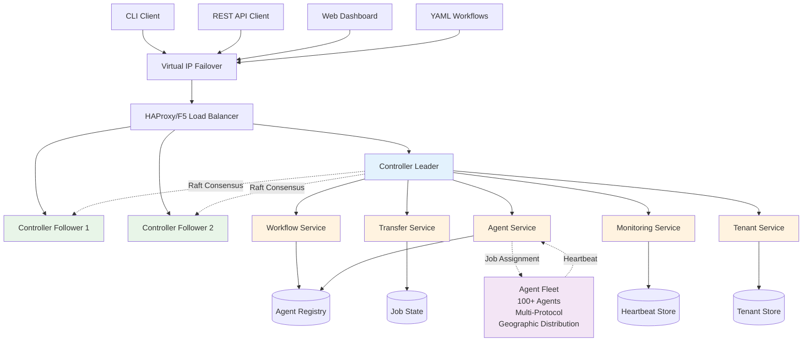

### Module Structure

The system is organized into multiple Maven modules for clear separation of concerns:

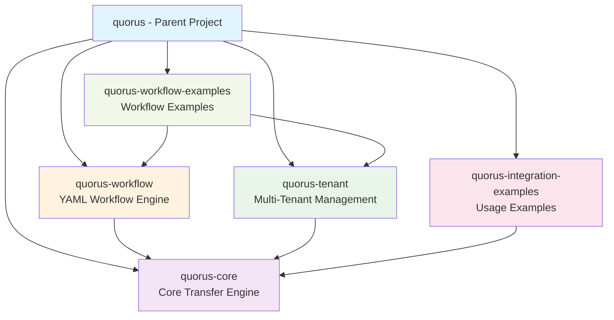

## Controller Quorum Architecture

### Raft Consensus Implementation

The Quorus controller layer implements a distributed consensus system based on the Raft algorithm to ensure high availability, consistency, and fault tolerance across the controller cluster.

```mermaid
graph TB
    subgraph "Controller Quorum (3-5 nodes)"
        C1[Controller 1<br/>Leader]
        C2[Controller 2<br/>Follower]
        C3[Controller 3<br/>Follower]
        C4[Controller 4<br/>Follower]
        C5[Controller 5<br/>Follower]

        C1 -.->|Raft Consensus| C2
        C1 -.->|Raft Consensus| C3
        C1 -.->|Raft Consensus| C4
        C1 -.->|Raft Consensus| C5

        subgraph "Replicated State"
            RS1[Agent Registry]
            RS2[Job Queue]
            RS3[Tenant Config]
            RS4[Workflow State]
        end

        C1 --> RS1
        C1 --> RS2
        C1 --> RS3
        C1 --> RS4
    end

    subgraph "Agent Fleet (100+ agents)"
        A1[Agent 1]
        A2[Agent 2]
        A3[Agent N...]
        A100[Agent 100+]
    end

    C1 -->|Work Distribution| A1
    C1 -->|Work Distribution| A2
    C1 -->|Work Distribution| A3
    C1 -->|Work Distribution| A100

    A1 -->|Heartbeat/Status| C1
    A2 -->|Heartbeat/Status| C1
    A3 -->|Heartbeat/Status| C1
    A100 -->|Heartbeat/Status| C1

    style C1 fill:#e3f2fd
    style C2 fill:#e8f5e8
    style C3 fill:#e8f5e8
    style C4 fill:#e8f5e8
    style C5 fill:#e8f5e8
```

**Key Features:**
- **Leader Election**: Automatic leader election using Raft consensus algorithm
- **Log Replication**: All state changes replicated across quorum members
- **Fault Tolerance**: Tolerates (N-1)/2 failures in N-node cluster
- **Split-Brain Prevention**: Quorum-based decision making prevents split-brain scenarios
- **Consistent State**: Strong consistency guarantees for all cluster operations

**Quorum Configuration:**
- **Minimum Nodes**: 3 controllers for basic HA (tolerates 1 failure)
- **Recommended**: 5 controllers for production environments (tolerates 2 failures)
- **Odd Numbers**: Always use odd number of controllers for proper quorum
- **Geographic Distribution**: Controllers distributed across availability zones
- **Network Partitioning**: Handles network partitions gracefully with majority rule

**Controller Services:**
- **Workflow Service**: YAML workflow parsing, validation, and orchestration
- **Transfer Service**: Transfer job management, scheduling, and lifecycle
- **Agent Service**: Agent registration, heartbeat processing, and lifecycle management
- **Monitoring Service**: System health monitoring, metrics collection, and alerting
- **Tenant Service**: Multi-tenant configuration management and isolation

### Leader Election Process

The Quorus controller cluster implements the Raft consensus algorithm for leader election, ensuring strong consistency and fault tolerance across the distributed system. The leader election process is critical for maintaining cluster coordination and preventing split-brain scenarios.

#### Election States and Transitions

Each controller node operates in one of three states:

- **Follower**: Default state, receives heartbeats from leader and responds to vote requests
- **Candidate**: Transitional state during election, requests votes from other nodes
- **Leader**: Coordinates cluster operations, sends heartbeats to maintain leadership

#### Election Timing and Randomization

**Election Timeout Configuration:**
- Base election timeout: 150-300ms (configurable)
- Randomized timeout: `baseTimeout + random(0, baseTimeout)`
- Heartbeat interval: 50ms (typically 1/3 of election timeout)
- Purpose: Prevents simultaneous elections and reduces split votes

**Timeout Behavior:**
- Followers reset their election timer on each valid heartbeat
- If no heartbeat received within timeout period, follower becomes candidate
- Random jitter ensures elections are staggered across nodes

#### Detailed Election Algorithm

**Phase 1: Election Initiation**
1. **Timeout Trigger**: Follower's election timer expires without receiving heartbeat
2. **State Transition**: Node transitions from FOLLOWER to CANDIDATE
3. **Term Increment**: Current term is incremented by 1
4. **Self-Vote**: Candidate votes for itself
5. **Timer Reset**: New randomized election timeout is set

**Phase 2: Vote Request Process**
1. **Vote Request Creation**: Candidate creates VoteRequest with:
   - `term`: Current term number
   - `candidateId`: Node's unique identifier
   - `lastLogIndex`: Index of candidate's last log entry
   - `lastLogTerm`: Term of candidate's last log entry

2. **Parallel Vote Requests**: Candidate sends VoteRequest to all other cluster nodes
3. **Vote Collection**: Candidate waits for VoteResponse messages

**Phase 3: Vote Evaluation**
Each node receiving a VoteRequest evaluates:
1. **Term Validation**: Request term >= current term
2. **Vote Availability**: Haven't voted for another candidate in this term
3. **Log Currency**: Candidate's log is at least as up-to-date as receiver's log
4. **Response**: Send VoteResponse with granted/denied decision

**Phase 4: Leadership Determination**
1. **Majority Calculation**: Candidate needs `(clusterSize / 2) + 1` votes
2. **Vote Counting**: Atomic counter tracks received votes
3. **Leadership Transition**: If majority achieved, candidate becomes LEADER
4. **State Initialization**: Leader initializes nextIndex and matchIndex for followers

#### Election Scenarios and Edge Cases

**Successful Election:**
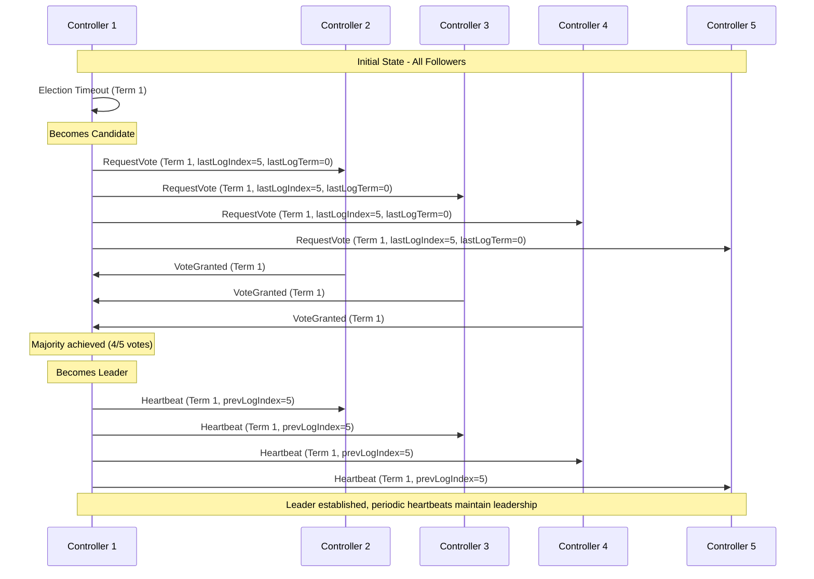

**Split Vote Scenario:**
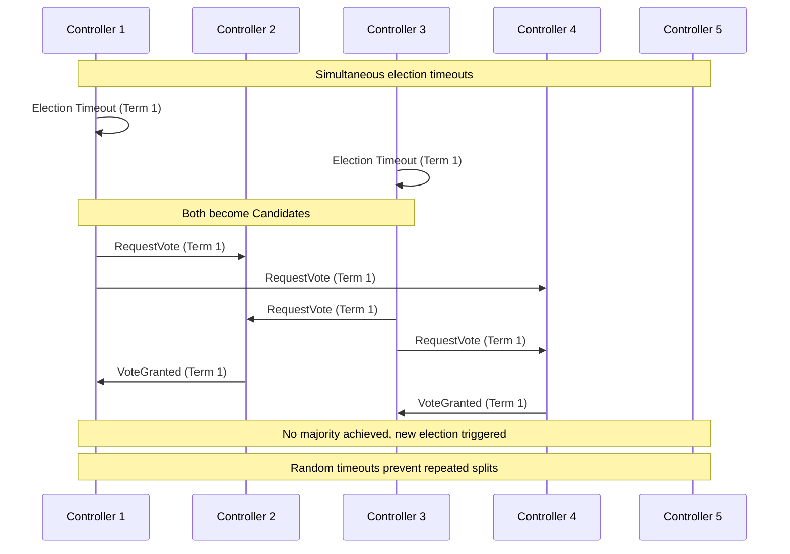

#### Failure Scenarios and Recovery

**Leader Failure Detection:**
1. **Heartbeat Monitoring**: Followers expect heartbeats every 50ms
2. **Failure Detection**: Missing 3+ consecutive heartbeats triggers election
3. **Automatic Recovery**: New leader elected within 150-300ms
4. **Service Continuity**: Minimal disruption to ongoing operations

**Network Partition Handling:**
- **Majority Partition**: Continues normal operations with new leader if needed
- **Minority Partition**: Cannot elect leader, enters read-only mode
- **Partition Healing**: Minority nodes automatically rejoin majority partition
- **Split-Brain Prevention**: Quorum requirement prevents dual leadership

**Node Recovery Process:**
1. **Rejoining Cluster**: Recovered node starts as follower
2. **Log Synchronization**: Receives missing log entries from current leader
3. **State Reconciliation**: Updates local state to match cluster consensus
4. **Full Participation**: Resumes normal voting and operation handling

#### Implementation Details

**Election Timer Management:**
```java
// Randomized election timeout prevents simultaneous elections
private void resetElectionTimer() {
    long timeout = electionTimeoutMs + (long) (Math.random() * electionTimeoutMs);
    electionTimer = scheduler.schedule(this::startElection, timeout, TimeUnit.MILLISECONDS);
}
```

**Vote Request Validation:**
```java
private boolean shouldGrantVote(VoteRequest request) {
    // Grant vote if:
    // 1. Request term >= current term
    // 2. Haven't voted in this term OR voting for same candidate
    // 3. Candidate's log is at least as up-to-date as ours
    return request.getTerm() >= currentTerm.get() &&
           (votedFor == null || votedFor.equals(request.getCandidateId())) &&
           isLogUpToDate(request.getLastLogIndex(), request.getLastLogTerm());
}
```

**Leadership Establishment:**
```java
private synchronized void becomeLeader() {
    if (state.compareAndSet(State.CANDIDATE, State.LEADER)) {
        // Initialize leader state for all followers
        long nextIndexValue = log.size();
        for (String nodeId : clusterNodes) {
            nextIndex.put(nodeId, nextIndexValue);
            matchIndex.put(nodeId, 0L);
        }

        // Start immediate heartbeats to establish authority
        startHeartbeats();
    }
}
```

#### Performance Characteristics

**Election Performance Metrics:**
- **Election Duration**: Typically 150-300ms under normal conditions
- **Availability Impact**: < 1 second service interruption during leader change
- **Throughput**: No impact on read operations, brief pause for writes
- **Scalability**: Election time increases logarithmically with cluster size

**Optimization Strategies:**
- **Pre-Vote Phase**: Optional pre-election to reduce disruptions
- **Priority Elections**: Higher priority nodes can trigger faster elections
- **Lease-Based Leadership**: Reduce election frequency with leader leases
- **Batch Heartbeats**: Optimize network usage with batched communications

#### Monitoring and Observability

**Key Metrics for Leader Election:**
- `raft.election.count`: Total number of elections initiated
- `raft.election.duration_ms`: Time taken for successful elections
- `raft.leader.changes`: Frequency of leadership changes
- `raft.vote.requests_sent`: Number of vote requests sent per election
- `raft.vote.requests_received`: Number of vote requests received
- `raft.heartbeat.missed`: Count of missed heartbeats per follower
- `raft.term.current`: Current term number across cluster

**Health Indicators:**
- **Stable Leadership**: Low frequency of leader changes indicates healthy cluster
- **Election Frequency**: High election rate may indicate network issues or node instability
- **Vote Success Rate**: Percentage of successful vote requests indicates network health
- **Heartbeat Regularity**: Consistent heartbeat intervals show stable leadership

**Alerting Thresholds:**
- **Critical**: No leader elected for > 5 seconds
- **Warning**: > 3 leader changes per minute
- **Info**: Election duration > 1 second

**Troubleshooting Guide:**
1. **Frequent Elections**: Check network connectivity and node health
2. **Split Votes**: Verify clock synchronization across nodes
3. **Slow Elections**: Investigate network latency and node performance
4. **Failed Elections**: Check quorum size and node availability

## Agent-Controller Communication Protocol

### Agent Registration Protocol

Agents must register with the controller quorum before participating in transfer operations. The registration process establishes agent capabilities, resources, and location information.

```yaml
# Agent Registration Message
registration:
  agentId: "agent-001"
  hostname: "transfer-agent-001.corp.com"
  version: "1.0.0"
  capabilities:
    protocols: ["http", "https", "sftp", "smb", "ftp"]
    maxConcurrentTransfers: 10
    maxBandwidthMbps: 1000
    supportedFeatures: ["chunked-transfer", "resume", "compression"]
  resources:
    cpu:
      cores: 4
      architecture: "x86_64"
    memory:
      totalMB: 8192
      availableMB: 6144
    storage:
      totalGB: 1024
      availableGB: 512
    network:
      interfaces: ["eth0", "eth1"]
      totalBandwidthMbps: 1000
  location:
    datacenter: "dc-east-1"
    zone: "zone-a"
    region: "us-east"
    tags: ["production", "high-bandwidth"]
  security:
    certificateFingerprint: "sha256:abc123..."
    supportedAuthMethods: ["certificate", "token"]
```

### Heartbeat Protocol

Agents send regular heartbeat messages to maintain their registration and report current status, capacity, and health metrics.

```yaml
# Heartbeat Message (every 30 seconds)
heartbeat:
  agentId: "agent-001"
  timestamp: "2024-01-15T10:30:00Z"
  sequenceNumber: 12345
  status: "active"  # active, busy, draining, unhealthy
  currentJobs: 3
  availableCapacity: 7
  metrics:
    cpu:
      usage: 45.2
      loadAverage: [1.2, 1.5, 1.8]
    memory:
      usage: 62.1
      available: 3072
    network:
      utilization: 23.4
      bytesTransferred: 1073741824
    transfers:
      active: 3
      completed: 127
      failed: 2
  health:
    diskSpace: "healthy"
    networkConnectivity: "healthy"
    systemLoad: "normal"
  lastJobCompletion: "2024-01-15T10:28:45Z"
  nextMaintenanceWindow: "2024-01-16T02:00:00Z"
```

### Communication Flow

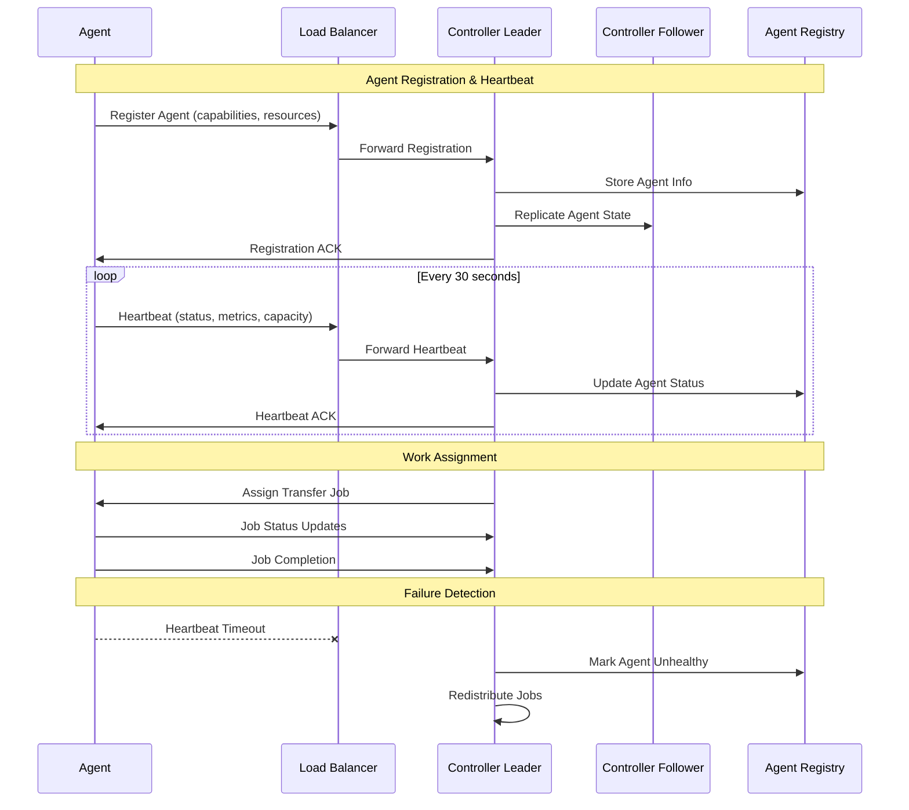

### Failure Detection and Recovery

**Heartbeat Monitoring:**
- **Heartbeat Interval**: 30 seconds
- **Timeout Threshold**: 90 seconds (3 missed heartbeats)
- **Grace Period**: 30 seconds for graceful shutdown
- **Health Checks**: Active health probes every 60 seconds

**Failure Scenarios:**
- **Agent Failure**: Jobs redistributed to healthy agents
- **Network Partition**: Agents continue current jobs, new jobs queued
- **Controller Failure**: Automatic leader election, minimal disruption
- **Partial Failure**: Degraded mode operation with reduced capacity

**Recovery Mechanisms:**
- **Automatic Recovery**: Failed jobs automatically redistributed
- **Graceful Shutdown**: 30-second drain period for active transfers
- **State Persistence**: Job state persisted for recovery after failures
- **Backpressure**: Automatic throttling when agents are overloaded

## Agent Fleet Management

### Agent Lifecycle Management

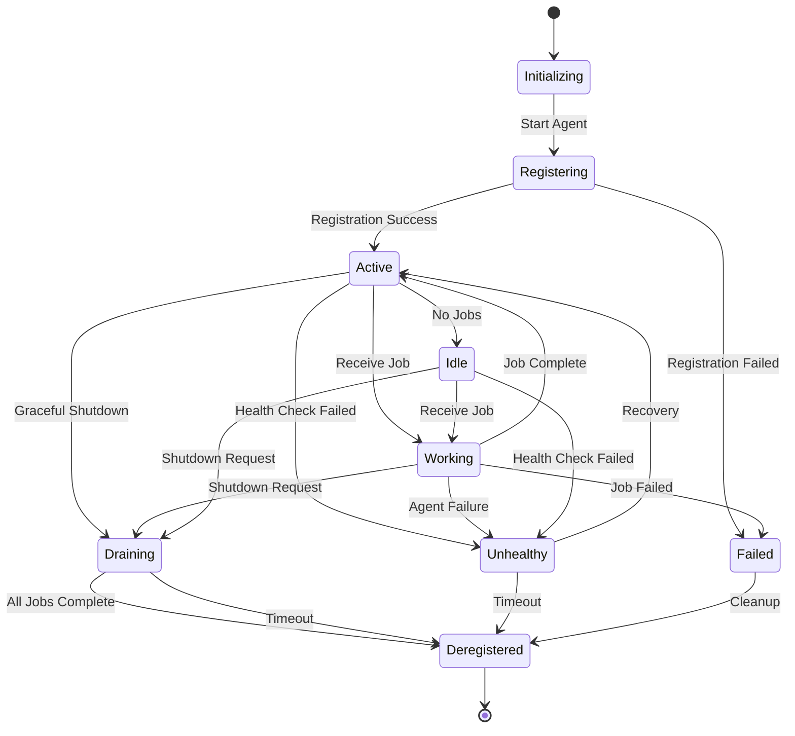

**Agent States:**
- **Initializing**: Agent starting up, loading configuration
- **Registering**: Attempting registration with controller quorum
- **Active**: Ready to receive and execute transfer jobs
- **Working**: Currently executing one or more transfer jobs
- **Idle**: No active jobs, available for new work
- **Draining**: Graceful shutdown in progress, completing current jobs
- **Unhealthy**: Failed health checks, not receiving new jobs
- **Deregistered**: Removed from agent registry

### Dynamic Scaling and Load Balancing

**Intelligent Work Distribution:**
- **Capacity-Based**: Jobs assigned based on available agent capacity
- **Location-Aware**: Prefer agents closer to source/destination
- **Protocol-Specific**: Route jobs to agents with required protocol support
- **Load Balancing**: Even distribution across available agents
- **Affinity Rules**: Support for agent affinity and anti-affinity

**Scaling Strategies:**
- **Horizontal Scaling**: Add more agents to increase capacity
- **Vertical Scaling**: Upgrade agent resources (CPU, memory, bandwidth)
- **Geographic Scaling**: Deploy agents across multiple data centers
- **Protocol Scaling**: Specialized agents for specific protocols

**Resource Optimization:**
- **CPU Utilization**: Monitor and optimize CPU usage across agents
- **Memory Management**: Efficient memory allocation for concurrent transfers
- **Bandwidth Utilization**: Maximize network bandwidth usage
- **Storage Optimization**: Efficient temporary storage management

## Scalability Architecture

### Performance Targets

**Agent Fleet Capacity:**
- **Agent Support**: 100+ agents per controller quorum
- **Concurrent Transfers**: 10,000+ simultaneous transfers across fleet
- **Heartbeat Processing**: 1,000+ heartbeats/second
- **Job Throughput**: 100+ jobs/second assignment and completion
- **Geographic Distribution**: Multi-region deployment support

**Controller Quorum Performance:**
- **Request Throughput**: 10,000+ requests/second
- **State Replication**: Sub-100ms replication latency
- **Leader Election**: Sub-5 second failover time
- **Memory Usage**: Efficient in-memory state management
- **Disk I/O**: Optimized persistent storage for logs

### Horizontal Scaling Strategies

**Controller Scaling:**
- **Quorum Expansion**: Add controllers to increase availability
- **Read Replicas**: Read-only replicas for query load distribution
- **Sharding**: Partition agents across multiple controller quorums
- **Federation**: Multiple quorums for different regions/tenants

**Agent Scaling:**
- **Linear Scaling**: Add agents to linearly increase transfer capacity
- **Auto-Scaling**: Automatic agent provisioning based on demand
- **Elastic Scaling**: Dynamic scaling up/down based on workload
- **Burst Capacity**: Temporary capacity increases for peak loads

**Storage Scaling:**
- **Distributed Storage**: Scale storage independently of compute
- **Replication**: Multi-replica storage for high availability
- **Partitioning**: Partition data across multiple storage nodes
- **Caching**: Intelligent caching for frequently accessed data

### Network Architecture

**High Availability Networking:**
- **Load Balancers**: Multiple load balancers with failover
- **Network Redundancy**: Multiple network paths between components
- **Bandwidth Aggregation**: Combine multiple network interfaces
- **Quality of Service**: Network QoS for transfer prioritization

**Security and Isolation:**
- **Network Segmentation**: Isolated networks for different tenants
- **Encryption**: End-to-end encryption for all communications
- **Authentication**: Mutual TLS authentication between components
- **Authorization**: Fine-grained access control and permissions

## Core Components

### 1. Transfer Engine (quorus-core)

The foundation of the system providing basic file transfer capabilities.

**Key Components:**
- `TransferEngine`: Main interface for transfer operations
- `TransferProtocol`: Pluggable protocol implementations
- `ProgressTracker`: Real-time progress monitoring
- `ChecksumCalculator`: File integrity verification

**Features:**
- **Internal network protocols** (HTTP/HTTPS, SMB/CIFS, NFS, FTP/SFTP)
- **High-throughput transfers** optimized for corporate network bandwidth
- **Concurrent transfer management** with intelligent scheduling
- **Retry mechanisms** with exponential backoff for network resilience
- **Progress tracking** with rate calculation and bandwidth utilization
- **SHA-256 integrity verification** for data consistency
- **Thread-safe operations** for multi-tenant environments
- **Network-aware routing** for optimal internal path selection

### 2. Multi-Tenant Management (quorus-tenant)

Enterprise-grade multi-tenancy with isolation and resource management.

**Key Components:**
- `TenantService`: Tenant lifecycle management
- `ResourceManagementService`: Quota and usage tracking
- `TenantSecurityService`: Authentication and authorization
- `TenantAwareStorageService`: Storage isolation

**Features:**
- Hierarchical tenant structure
- Resource quotas and limits
- Data isolation strategies
- Cross-tenant security controls
- Compliance and governance

### 3. YAML Workflow Engine (quorus-workflow)

Declarative workflow definition and execution system.

**Key Components:**
- `WorkflowDefinitionParser`: YAML parsing and validation
- `WorkflowEngine`: Workflow execution orchestration
- `DependencyResolver`: Dependency analysis and planning
- `VariableResolver`: Variable substitution and templating

**Features:**
- Declarative YAML definitions
- Complex dependency management
- Conditional execution
- Dry run and virtual run modes
- Variable substitution and templating

## Multi-Tenancy Architecture

### Core Multi-Tenancy Concepts

#### 1. Tenant
A logical isolation boundary representing an organization, department, or business unit with its own:
- Configuration and policies
- Resource quotas and limits
- Security boundaries
- Workflow definitions
- Execution history and metrics

#### 2. Tenant Hierarchy
Support for nested tenants (e.g., Company → Department → Team) with inheritance of policies and quotas.

#### 3. Tenant Isolation Levels
- **Logical Isolation**: Shared infrastructure with data separation
- **Physical Isolation**: Dedicated resources per tenant
- **Hybrid Isolation**: Mix of shared and dedicated resources

### Multi-Tenant System Architecture

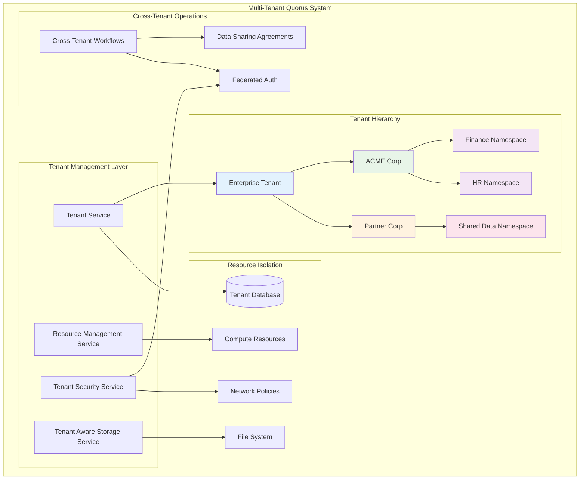

#### 1. Tenant Management Service
```java
// New package: dev.mars.quorus.tenant
public interface TenantService {
    // Tenant lifecycle
    Tenant createTenant(TenantConfiguration config);
    Tenant updateTenant(String tenantId, TenantConfiguration config);
    void deleteTenant(String tenantId);
    
    // Tenant discovery
    Tenant getTenant(String tenantId);
    List<Tenant> getChildTenants(String parentTenantId);
    TenantHierarchy getTenantHierarchy(String tenantId);
    
    // Resource management
    ResourceQuota getResourceQuota(String tenantId);
    ResourceUsage getResourceUsage(String tenantId);
    boolean checkResourceLimit(String tenantId, ResourceType type, long amount);
}
```

#### 2. Multi-Tenant Workflow Engine
```java
public interface MultiTenantWorkflowEngine extends WorkflowEngine {
    // Tenant-aware execution
    WorkflowExecution execute(WorkflowDefinition definition, TenantContext context);
    
    // Cross-tenant operations
    WorkflowExecution executeCrossTenant(WorkflowDefinition definition, 
                                       List<TenantContext> tenants);
    
    // Tenant isolation
    List<WorkflowExecution> getExecutions(String tenantId);
    WorkflowMetrics getMetrics(String tenantId, TimeRange range);
}
```

#### 3. Tenant-Aware Security Service
```java
public interface TenantSecurityService {
    // Authentication
    TenantPrincipal authenticate(String tenantId, AuthenticationToken token);
    
    // Authorization
    boolean authorize(TenantPrincipal principal, String resource, String action);
    
    // Data protection
    EncryptionKey getTenantEncryptionKey(String tenantId);
    String encryptForTenant(String tenantId, String data);
    String decryptForTenant(String tenantId, String encryptedData);
    
    // Cross-tenant security
    boolean isCrossTenantAllowed(String sourceTenant, String targetTenant);
    DataSharingAgreement getDataSharingAgreement(String tenant1, String tenant2);
}
```

#### 4. Resource Management Service
```java
public interface ResourceManagementService {
    // Quota management
    boolean reserveResources(String tenantId, ResourceRequest request);
    void releaseResources(String tenantId, ResourceRequest request);
    
    // Usage tracking
    void recordUsage(String tenantId, ResourceUsage usage);
    ResourceMetrics getUsageMetrics(String tenantId, TimeRange range);
    
    // Billing and cost allocation
    CostReport generateCostReport(String tenantId, TimeRange range);
    void allocateCosts(String tenantId, TransferExecution execution);
}
```

## YAML Workflow System

### Core Concepts

#### 1. Transfer Definition
A single file transfer operation with source, destination, and metadata.

#### 2. Transfer Group
A collection of related transfers that can be executed with dependencies, sequencing, and shared configuration.

#### 3. Transfer Workflow
A higher-level orchestration of transfer groups with complex dependency trees, triggers, and conditional execution.

#### 4. Transfer Plan
The resolved execution plan after dependency analysis and validation.

### YAML Schema Design

#### Single Transfer Definition

```yaml
# transfer-internal-data.yaml
apiVersion: quorus.dev/v1
kind: Transfer
metadata:
  name: internal-data-sync
  description: "Sync customer data from CRM to data warehouse"
  tenant: acme-corp              # Tenant identifier
  namespace: finance             # Sub-tenant/namespace
  labels:
    environment: production
    priority: high
    team: data-ops
    dataClassification: confidential
    costCenter: "CC-12345"
    networkZone: "internal-dmz"
  annotations:
    created-by: "john.doe@company.com"
    ticket: "JIRA-12345"

spec:
  source:
    # Internal corporate API endpoint
    uri: "https://crm-internal.acme-corp.local/api/customers/export"
    protocol: https
    authentication:
      type: service-account      # Internal service account
      serviceAccount: "quorus-data-sync"
    headers:
      X-Internal-Service: "quorus"
      X-Data-Classification: "${metadata.labels.dataClassification}"
      X-Network-Zone: "${metadata.labels.networkZone}"
    timeout: 300s
    # Internal network optimization
    networkOptimization:
      useInternalRouting: true
      preferredDataCenter: "dc-east-1"

  destination:
    # Internal corporate storage path
    path: "/corporate-storage/data-warehouse/customers/customers-${date:yyyy-MM-dd}.json"
    protocol: nfs                # Internal NFS mount
    createDirectories: true
    permissions: "640"           # Corporate security standard
    # Corporate encryption standards
    encryption:
      enabled: true
      algorithm: "AES-256-GCM"
      keySource: "corporate-kms"
      keyId: "${tenant.security.keyManagement.keyId}"

  validation:
    expectedSize:
      min: 10MB                  # Larger internal datasets
      max: 5GB
    checksum:
      algorithm: "SHA-256"
      required: true
    # Internal data quality checks
    dataQuality:
      validateSchema: true
      schemaVersion: "v2.1"
      rejectOnValidationFailure: true

  retry:
    maxAttempts: 5               # More retries for internal reliability
    backoff: exponential
    initialDelay: 500ms          # Faster retry for internal network
    maxDelay: 10s

  # Corporate monitoring integration
  monitoring:
    enabled: true
    progressReporting: true
    metricsEnabled: true
    alertOnFailure: true
    # Corporate monitoring systems
    integrations:
      splunk: true
      datadog: true
      corporateSOC: true
    tags:
      tenant: "${tenant.id}"
      namespace: "${metadata.namespace}"
      costCenter: "${metadata.labels.costCenter}"
      networkZone: "${metadata.labels.networkZone}"
      dataClassification: "${metadata.labels.dataClassification}"
```

#### Transfer Group Definition

```yaml
# backup-workflow.yaml
apiVersion: quorus.dev/v1
kind: TransferGroup
metadata:
  name: daily-backup-workflow
  description: "Daily backup workflow for critical data"
  tenant: acme-corp
  namespace: finance
  labels:
    schedule: daily
    criticality: high

spec:
  # Execution strategy
  execution:
    strategy: sequential  # sequential, parallel, mixed
    maxConcurrency: 3
    timeout: 3600s
    continueOnError: false
    
  # Shared configuration
  defaults:
    retry:
      maxAttempts: 3
      backoff: exponential
    monitoring:
      progressReporting: true
      
  # Variable definitions
  variables:
    BACKUP_DATE: "${date:yyyy-MM-dd}"
    BACKUP_ROOT: "${tenant.storage.root}/backup/${BACKUP_DATE}"
    AUTH_TOKEN: "${env:API_TOKEN}"
    
  # Transfer definitions
  transfers:
    - name: user-data
      source:
        uri: "https://api.company.com/users/export"
        headers:
          Authorization: "${AUTH_TOKEN}"
      destination:
        path: "${BACKUP_ROOT}/users.json"
      dependsOn: []
      
    - name: order-data
      source:
        uri: "https://api.company.com/orders/export"
        headers:
          Authorization: "${AUTH_TOKEN}"
      destination:
        path: "${BACKUP_ROOT}/orders.json"
      dependsOn: ["user-data"]  # Wait for user-data to complete
      
    - name: analytics-data
      source:
        uri: "https://analytics.company.com/export"
      destination:
        path: "${BACKUP_ROOT}/analytics.json"
      dependsOn: ["user-data", "order-data"]
      condition: "${user-data.success} && ${order-data.success}"
      
  # Post-execution actions
  onSuccess:
    - action: notify
      target: "slack://data-ops-channel"
      message: "Daily backup completed successfully"
    - action: cleanup
      target: "/backup"
      retentionDays: 30
      
  onFailure:
    - action: notify
      target: "email://ops-team@company.com"
      message: "Daily backup failed: ${error.message}"
    - action: rollback
      strategy: deletePartial
```

#### Multi-Tenant Workflow Definition

```yaml
# multi-tenant-workflow.yaml
apiVersion: quorus.dev/v1
kind: TransferWorkflow
metadata:
  name: cross-tenant-data-sync
  tenant: enterprise            # Parent tenant

spec:
  # Multi-tenant execution
  tenants:
    - name: acme-corp
      namespace: finance
      role: source              # source, destination, both

    - name: partner-corp
      namespace: shared-data
      role: destination

  # Tenant-specific execution policies
  execution:
    isolation: logical          # logical, physical, hybrid
    crossTenantAllowed: true
    approvalRequired: true
    dryRun: false
    virtualRun: false
    parallelism: 5
    timeout: 7200s

  # Cross-tenant security
  security:
    # Data sharing agreements
    dataSharing:
      agreements: ["DSA-2024-001"]
      dataClassification: "internal"
      retentionPolicy: "30d"

    # Cross-tenant authentication
    authentication:
      federatedAuth: true
      trustedTenants: ["partner-corp"]

  # Environment-specific variables
  environments:
    production:
      SOURCE_DB: "prod-db.company.com"
      TARGET_STORAGE: "s3://prod-backup"
    staging:
      SOURCE_DB: "staging-db.company.com"
      TARGET_STORAGE: "s3://staging-backup"

  groups:
    - name: extract-acme-data
      tenant: acme-corp
      namespace: finance
      transferGroup:
        spec:
          transfers:
            - name: customer-export
              source:
                uri: "${acme-corp.api.endpoint}/customers"
                authentication:
                  type: tenant-oauth2
              destination:
                path: "${shared.storage}/acme-customers.json"

    - name: sync-to-partner
      tenant: partner-corp
      namespace: shared-data
      dependsOn: ["extract-acme-data"]
      condition: "${acme-corp.dataSharing.approved}"
      transferGroup:
        spec:
          transfers:
            - name: partner-import
              source:
                path: "${shared.storage}/acme-customers.json"
              destination:
                uri: "${partner-corp.api.endpoint}/import"
                authentication:
                  type: tenant-oauth2

  # Workflow triggers
  triggers:
    - name: schedule
      type: cron
      schedule: "0 2 * * *"  # Daily at 2 AM
      timezone: "UTC"

    - name: file-watcher
      type: fileSystem
      path: "/incoming/trigger.flag"
      action: create

  # Validation rules
  validation:
    - name: source-connectivity
      type: connectivity
      targets: ["${SOURCE_DB}"]

    - name: storage-capacity
      type: diskSpace
      path: "/staging"
      required: 10GB

    - name: dependency-check
      type: yamlDependencies
      recursive: true
```

### Tenant Configuration

```yaml
# tenant-config.yaml
apiVersion: quorus.dev/v1
kind: TenantConfiguration
metadata:
  name: acme-corp
  namespace: enterprise
  labels:
    tier: premium
    region: us-east-1
    industry: finance

spec:
  # Tenant hierarchy
  hierarchy:
    parent: null  # Root tenant
    children: ["acme-corp-finance", "acme-corp-hr", "acme-corp-it"]

  # Resource quotas and limits
  resources:
    quotas:
      # Transfer limits
      maxConcurrentTransfers: 50
      maxDailyTransfers: 1000
      maxMonthlyDataTransfer: 10TB
      maxFileSize: 5GB

      # Storage limits
      maxStorageUsage: 1TB
      maxRetentionDays: 365

      # Compute limits
      maxCpuCores: 16
      maxMemoryGB: 64
      maxBandwidthMbps: 1000

    # Resource allocation strategy
    allocation:
      strategy: shared  # shared, dedicated, hybrid
      priority: high    # low, medium, high, critical

  # Security policies
  security:
    # Network access controls
    networking:
      allowedSourceCIDRs: ["10.0.0.0/8", "192.168.0.0/16"]
      allowedDestinations: ["s3://acme-corp-*", "/data/acme-corp/*"]
      requireVPN: true
      allowCrossRegion: false

    # Authentication and authorization
    authentication:
      provider: "oauth2"  # oauth2, saml, ldap, api-key
      endpoint: "https://auth.acme-corp.com"

    authorization:
      rbac:
        enabled: true
        defaultRole: "transfer-user"
        adminRole: "transfer-admin"

    # Data protection
    dataProtection:
      encryptionAtRest: true
      encryptionInTransit: true
      encryptionAlgorithm: "AES-256"
      keyManagement: "aws-kms"  # aws-kms, azure-kv, vault

  # Compliance and governance
  governance:
    # Data classification
    dataClassification:
      defaultLevel: "internal"
      allowedLevels: ["public", "internal", "confidential"]

    # Audit and compliance
    audit:
      enabled: true
      retentionDays: 2555  # 7 years
      exportFormat: "json"

    compliance:
      frameworks: ["SOX", "GDPR", "HIPAA"]
      dataResidency: "us-east-1"
      crossBorderTransfer: false

  # Monitoring and alerting
  monitoring:
    # Metrics collection
    metrics:
      enabled: true
      granularity: "1m"
      retention: "90d"

    # Alerting configuration
    alerting:
      channels:
        - type: "slack"
          webhook: "https://hooks.slack.com/acme-corp"
        - type: "email"
          recipients: ["ops@acme-corp.com"]
        - type: "webhook"
          endpoint: "https://monitoring.acme-corp.com/alerts"

      thresholds:
        errorRate: 5%
        quotaUsage: 80%
        transferLatency: 30s

  # Workflow defaults
  defaults:
    # Default retry policy
    retry:
      maxAttempts: 3
      backoff: exponential
      initialDelay: 1s

    # Default validation
    validation:
      checksumRequired: true
      sizeValidation: true

    # Default monitoring
    monitoring:
      progressReporting: true
      metricsEnabled: true
```

## Workflow Engine Architecture

### Core Components

#### 1. YAML Parser & Validator
```java
// New package: dev.mars.quorus.workflow
public interface WorkflowDefinitionParser {
    WorkflowDefinition parse(Path yamlFile) throws WorkflowParseException;
    ValidationResult validate(WorkflowDefinition definition);
    DependencyGraph buildDependencyGraph(List<WorkflowDefinition> definitions);
}
```

#### 2. Workflow Engine
```java
public interface WorkflowEngine {
    WorkflowExecution execute(WorkflowDefinition definition, ExecutionContext context);
    WorkflowExecution dryRun(WorkflowDefinition definition, ExecutionContext context);
    WorkflowExecution virtualRun(WorkflowDefinition definition, ExecutionContext context);

    // Monitoring and control
    WorkflowStatus getStatus(String executionId);
    boolean pause(String executionId);
    boolean resume(String executionId);
    boolean cancel(String executionId);
}
```

#### 3. Dependency Resolver
```java
public interface DependencyResolver {
    ExecutionPlan resolve(List<WorkflowDefinition> definitions);
    ValidationResult validateDependencies(DependencyGraph graph);
    List<WorkflowDefinition> getExecutionOrder(DependencyGraph graph);
}
```

#### 4. Variable Resolver
```java
public interface VariableResolver {
    String resolve(String expression, ExecutionContext context);
    Map<String, String> resolveAll(Map<String, String> variables, ExecutionContext context);

    // Built-in functions
    // ${date:yyyy-MM-dd} -> current date
    // ${env:VAR_NAME} -> environment variable
    // ${file:path/to/file} -> file content
    // ${transfer.result.checksum} -> result from previous transfer
}
```

### Execution Modes

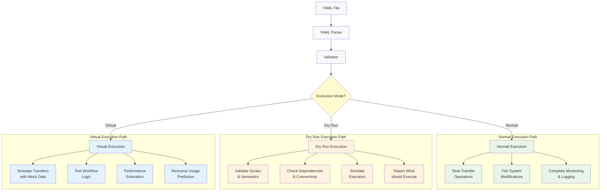

#### 1. Normal Execution
- Full transfer execution with real network operations
- File system modifications
- Complete monitoring and logging

#### 2. Dry Run
- Validate YAML syntax and semantics
- Check dependencies and connectivity
- Simulate execution without actual transfers
- Report what would be executed

#### 3. Virtual Run
- Simulate transfers with mock data
- Test workflow logic and dependencies
- Performance estimation
- Resource usage prediction

## Transfer Process Flow

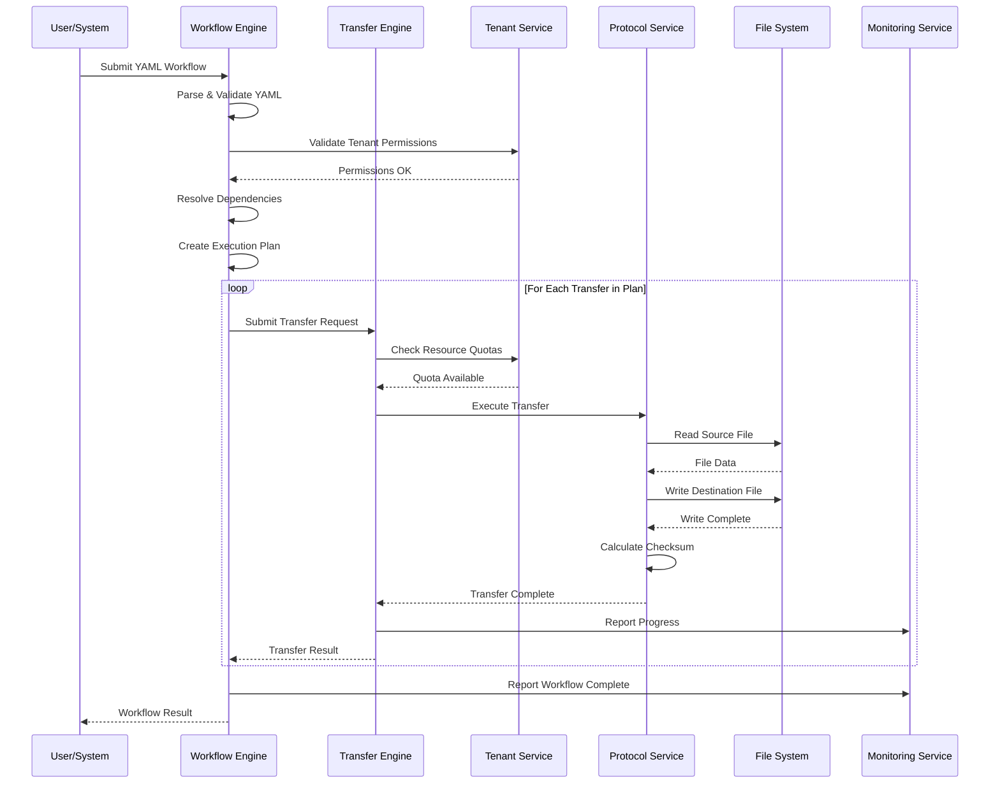

## Data Models

### Core Domain Models

#### Transfer Request
```java
public class TransferRequest {
    private String requestId;
    private URI sourceUri;
    private Path destinationPath;
    private String protocol;
    private String tenantId;
    private String namespace;
    private Map<String, String> metadata;
    private long expectedSize;
    private String expectedChecksum;
    // ... other fields
}
```

#### Transfer Job
```java
public class TransferJob {
    private String jobId;
    private TransferRequest request;
    private TransferStatus status;
    private long bytesTransferred;
    private long totalBytes;
    private Instant startTime;
    private String actualChecksum;
    private String tenantId;
    // ... other fields
}
```

### Multi-Tenant Models

#### Tenant Configuration
```java
public class TenantConfiguration {
    private String tenantId;
    private String parentTenantId;
    private ResourceQuota resourceQuota;
    private SecurityPolicy securityPolicy;
    private ComplianceSettings compliance;
    private Map<String, String> variables;
    // ... other fields
}
```

### Workflow Models

#### Workflow Definition
```java
public class WorkflowDefinition {
    private String name;
    private String tenantId;
    private String namespace;
    private ExecutionStrategy execution;
    private List<TransferGroupDefinition> groups;
    private Map<String, String> variables;
    private List<TenantContext> tenants;
    // ... other fields
}
```

## Data Isolation Strategies

### 1. Database-Level Isolation
```sql
-- Tenant-aware schema design
CREATE TABLE transfers (
    id UUID PRIMARY KEY,
    tenant_id VARCHAR(255) NOT NULL,
    namespace VARCHAR(255),
    request_data JSONB,
    status VARCHAR(50),
    created_at TIMESTAMP DEFAULT NOW(),

    -- Tenant isolation constraints
    CONSTRAINT fk_tenant FOREIGN KEY (tenant_id) REFERENCES tenants(id),
    INDEX idx_tenant_namespace (tenant_id, namespace)
);

-- Row-level security
CREATE POLICY tenant_isolation ON transfers
    FOR ALL TO application_role
    USING (tenant_id = current_setting('app.current_tenant'));
```

### 2. Storage Isolation
```java
public class TenantAwareStorageService {
    private final String getTenantStorageRoot(String tenantId) {
        return String.format("/data/tenants/%s", tenantId);
    }

    private final void validateTenantAccess(String tenantId, Path path) {
        String tenantRoot = getTenantStorageRoot(tenantId);
        if (!path.startsWith(tenantRoot)) {
            throw new SecurityException("Cross-tenant storage access denied");
        }
    }
}
```

### 3. Network Isolation
```yaml
# Kubernetes NetworkPolicy example
apiVersion: networking.k8s.io/v1
kind: NetworkPolicy
metadata:
  name: tenant-isolation
spec:
  podSelector:
    matchLabels:
      tenant: acme-corp
  policyTypes:
  - Ingress
  - Egress
  ingress:
  - from:
    - podSelector:
        matchLabels:
          tenant: acme-corp
  egress:
  - to:
    - podSelector:
        matchLabels:
          tenant: acme-corp
```

## Enterprise Features

### 1. Governance & Compliance
```yaml
governance:
  approvals:
    required: true
    approvers: ["data-ops-lead", "security-team"]

  compliance:
    dataClassification: confidential
    retentionPolicy: 7years
    encryptionRequired: true
    auditLogging: true

  security:
    allowedSources: ["*.company.com", "trusted-partner.com"]
    allowedDestinations: ["s3://company-*", "/backup/*"]
    requiresVPN: true
```

### 2. Resource Management
```yaml
resources:
  limits:
    maxConcurrentTransfers: 10
    maxBandwidth: 100MB/s
    maxDiskUsage: 1TB

  quotas:
    dailyTransferLimit: 1TB
    monthlyTransferLimit: 30TB

  scheduling:
    priority: high
    preferredHours: "02:00-06:00"
    blackoutWindows: ["12:00-13:00"]
```

### 3. Monitoring & Alerting
```yaml
monitoring:
  metrics:
    - transferRate
    - errorRate
    - queueDepth
    - resourceUtilization

  alerts:
    - name: transfer-failure
      condition: "errorRate > 5%"
      severity: critical
      channels: ["slack", "email", "pagerduty"]

    - name: slow-transfer
      condition: "transferRate < 1MB/s"
      severity: warning
      channels: ["slack"]
```

## Security Architecture

### Authentication
- **Enterprise directory integration** (Active Directory, LDAP)
- **Single Sign-On (SSO)** with corporate identity providers (SAML, OAuth2)
- **Service account authentication** for automated internal systems
- **Certificate-based authentication** for high-security internal transfers
- **Tenant-specific authentication** configuration for multi-tenant deployments

### Authorization
- **Role-based access control (RBAC)** integrated with corporate directory
- **Department and team-based** access controls
- **Data classification-aware** permissions (confidential, internal, public)
- **Network segment-based** access controls for internal zones
- **Fine-grained resource access** controls for sensitive data

### Data Protection
- **Encryption at rest** using corporate key management systems
- **TLS encryption** optimized for internal network performance
- **Data classification** and handling policies for corporate data
- **Network-level encryption** for high-security internal transfers
- **Tenant-specific encryption** keys for multi-tenant isolation

### Internal Network Security
- **Network segmentation** awareness and routing
- **Corporate firewall** integration and rule management
- **VPN and private network** support for remote sites
- **Internal certificate authority** integration
- **Network monitoring** and intrusion detection integration

### Audit & Compliance
- **Corporate audit system** integration
- **Compliance framework** support (SOX, GDPR, HIPAA, PCI-DSS)
- **Data lineage tracking** for internal data movement
- **Regulatory reporting** for internal data governance
- **Tenant-isolated audit trails** for multi-tenant compliance

## Configuration Management

### Hierarchical Configuration
```yaml
# Global defaults (system-level)
global:
  defaults:
    retry:
      maxAttempts: 3
    security:
      encryptionRequired: true

# Tenant-level overrides
tenant:
  acme-corp:
    defaults:
      retry:
        maxAttempts: 5  # Override global
      security:
        encryptionAlgorithm: "AES-256-GCM"  # Add tenant-specific

    # Namespace-level overrides
    namespaces:
      finance:
        defaults:
          retry:
            maxAttempts: 7  # Override tenant
          validation:
            checksumRequired: true  # Add namespace-specific
```

### Variable Resolution with Tenancy
```yaml
variables:
  # System variables
  system:
    version: "1.0.0"
    region: "us-east-1"

  # Tenant variables
  tenant:
    id: "acme-corp"
    name: "ACME Corporation"
    storage:
      root: "/data/tenants/acme-corp"
      backup: "s3://acme-corp-backup"
    api:
      endpoint: "https://api.acme-corp.com"

  # Namespace variables
  namespace:
    name: "finance"
    costCenter: "CC-12345"
    approver: "finance-lead@acme-corp.com"
```

## Deployment Architecture

### Corporate Network Deployment with Controller Quorum

```mermaid
graph TD
    %% External Access Layer
    CORP[Corporate Network<br/>Internal Traffic] --> VIP[Virtual IP<br/>Failover]
    VIP --> LB[Internal Load Balancer<br/>F5/HAProxy Cluster]

    %% Controller Quorum Layer
    subgraph "Controller Quorum (Multi-AZ)"
        direction TB
        LB --> C1[Controller Leader<br/>AZ-1]
        LB --> C2[Controller Follower<br/>AZ-2]
        LB --> C3[Controller Follower<br/>AZ-3]

        C1 -.->|Raft Consensus| C2
        C1 -.->|Raft Consensus| C3
        C2 -.->|Raft Consensus| C3
    end

    %% Distributed State Layer
    subgraph "Distributed State (Multi-AZ)"
        PG[(PostgreSQL Cluster<br/>Primary + 2 Replicas)]
        REDIS[(Redis Cluster<br/>6 Nodes)]
        ETCD[(etcd Cluster<br/>Agent Registry)]
    end

    %% Agent Fleet
    subgraph "Agent Fleet (Geographic Distribution)"
        subgraph "DC-East Agents"
            AE1[Agent E1<br/>HTTP/SFTP]
            AE2[Agent E2<br/>SMB/FTP]
            AE3[Agent EN...<br/>Multi-Protocol]
        end

        subgraph "DC-West Agents"
            AW1[Agent W1<br/>HTTP/SFTP]
            AW2[Agent W2<br/>SMB/FTP]
            AW3[Agent WN...<br/>Multi-Protocol]
        end

        subgraph "Cloud Agents"
            AC1[Agent C1<br/>HTTP/SFTP]
            AC2[Agent C2<br/>SMB/FTP]
            AC3[Agent CN...<br/>Multi-Protocol]
        end
    end

    %% Controller to State connections
    C1 --> PG
    C1 --> REDIS
    C1 --> ETCD
    C2 --> PG
    C2 --> REDIS
    C2 --> ETCD
    C3 --> PG
    C3 --> REDIS
    C3 --> ETCD

    %% Controller to Agent connections
    C1 -.->|Work Distribution| AE1
    C1 -.->|Work Distribution| AE2
    C1 -.->|Work Distribution| AE3
    C1 -.->|Work Distribution| AW1
    C1 -.->|Work Distribution| AW2
    C1 -.->|Work Distribution| AW3
    C1 -.->|Work Distribution| AC1
    C1 -.->|Work Distribution| AC2
    C1 -.->|Work Distribution| AC3

    %% Agent heartbeats
    AE1 -.->|Heartbeat| LB
    AE2 -.->|Heartbeat| LB
    AE3 -.->|Heartbeat| LB
    AW1 -.->|Heartbeat| LB
    AW2 -.->|Heartbeat| LB
    AW3 -.->|Heartbeat| LB
    AC1 -.->|Heartbeat| LB
    AC2 -.->|Heartbeat| LB
    AC3 -.->|Heartbeat| LB

    %% Corporate Integration
    subgraph "Corporate Services"
        AD[Active Directory<br/>Corporate LDAP]
        VAULT[Corporate Vault<br/>Key Management]
        CA[Corporate PKI<br/>Certificate Authority]
        NAS[Corporate NAS<br/>File Storage]
        NFS[NFS Mounts<br/>Department Shares]
    end

    %% Corporate Monitoring
    subgraph "Corporate Monitoring"
        PROM[Prometheus<br/>Corporate Monitoring]
        SPLUNK[Splunk<br/>Corporate SIEM]
        GRAF[Grafana<br/>Corporate Dashboards]
        ALERT[AlertManager]
        EMAIL[Corporate Email<br/>Exchange/O365]
    end

    %% Integration connections
    C1 --> AD
    C1 --> VAULT
    C1 --> CA
    AE1 --> NAS
    AE2 --> NFS
    AW1 --> NAS
    AW2 --> NFS
    AC1 --> NAS
    AC2 --> NFS

    %% Monitoring connections
    PROM --> C1
    PROM --> C2
    PROM --> C3
    PROM --> AE1
    PROM --> AW1
    PROM --> AC1
    SPLUNK --> PROM
    GRAF --> PROM
    ALERT --> PROM
    ALERT --> EMAIL

    %% Styling
    style C1 fill:#e3f2fd
    style C2 fill:#e8f5e8
    style C3 fill:#e8f5e8
    style AE1 fill:#fff3e0
    style AE2 fill:#fff3e0
    style AE3 fill:#fff3e0
    style AW1 fill:#fff3e0
    style AW2 fill:#fff3e0
    style AW3 fill:#fff3e0
    style AC1 fill:#fff3e0
    style AC2 fill:#fff3e0
    style AC3 fill:#fff3e0
        INTERNAL[Internal Zone<br/>Data Sources]
        SECURE[Secure Zone<br/>Sensitive Data]
    end

    %% Styling by Corporate Zone
    style CORP fill:#f0f0f0
    style LB fill:#f0f0f0
    style ING fill:#f0f0f0

    style QE fill:#e8f5e8
    style WE fill:#fff3e0
    style TS fill:#e3f2fd

    style PG fill:#f3e5f5
    style REDIS fill:#f3e5f5
    style SAN fill:#f3e5f5

    style PROM fill:#fce4ec
    style SPLUNK fill:#fce4ec
    style GRAF fill:#fce4ec
    style ALERT fill:#fce4ec

    style VAULT fill:#f1f8e9
    style CA fill:#f1f8e9

    style AD fill:#fff8e1
    style NAS fill:#fff8e1
    style NFS fill:#fff8e1
    style EMAIL fill:#fff8e1
```
```yaml
# Kubernetes deployment example
apiVersion: apps/v1
kind: Deployment
metadata:
  name: quorus-engine
spec:
  replicas: 3
  selector:
    matchLabels:
      app: quorus-engine
  template:
    metadata:
      labels:
        app: quorus-engine
    spec:
      containers:
      - name: quorus-engine
        image: quorus/engine:latest
        resources:
          requests:
            memory: "512Mi"
            cpu: "500m"
          limits:
            memory: "1Gi"
            cpu: "1000m"
        env:
        - name: QUORUS_TENANT_ID
          valueFrom:
            fieldRef:
              fieldPath: metadata.labels['tenant']
```

### Distributed State Management

The enhanced Quorus architecture implements distributed state management to ensure consistency, availability, and partition tolerance across the controller quorum and agent fleet.

#### State Distribution Strategy

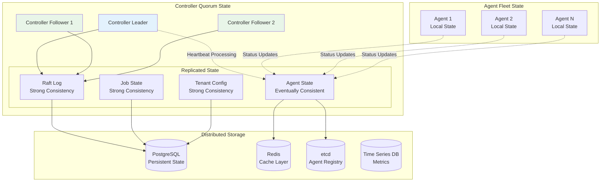

**State Categories:**

1. **Strongly Consistent State** (Raft Consensus):
   - Job assignments and status
   - Tenant configurations
   - Workflow definitions
   - System configuration

2. **Eventually Consistent State** (Gossip/Cache):
   - Agent heartbeats and status
   - Performance metrics
   - Capacity information
   - Health status

3. **Local State** (Agent-specific):
   - Active transfer progress
   - Local resource utilization
   - Temporary file state
   - Protocol-specific state

#### High Availability Configuration

**Controller Quorum:**
- **Minimum**: 3 controllers (tolerates 1 failure)
- **Recommended**: 5 controllers (tolerates 2 failures)
- **Geographic Distribution**: Controllers across availability zones
- **Network Partitioning**: Majority quorum required for operations

**Data Persistence:**
- **PostgreSQL Cluster**: Primary + 2 synchronous replicas
- **Redis Cluster**: 6 nodes (3 masters + 3 replicas)
- **etcd Cluster**: 3-5 nodes for agent registry
- **Backup Strategy**: Automated backups with point-in-time recovery

**Failure Scenarios:**
- **Single Controller Failure**: Automatic leader election, <5s downtime
- **Database Failure**: Automatic failover to replica, <30s downtime
- **Network Partition**: Majority partition continues operation
- **Agent Failure**: Jobs redistributed, no data loss

### Database Schema

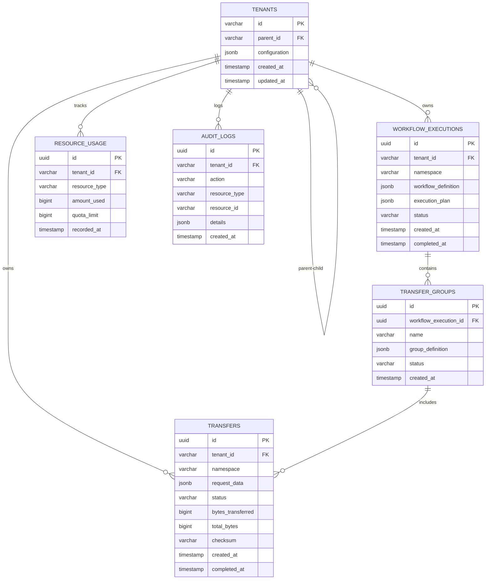

```sql
-- Core tables
CREATE TABLE tenants (
    id VARCHAR(255) PRIMARY KEY,
    parent_id VARCHAR(255),
    configuration JSONB,
    created_at TIMESTAMP DEFAULT NOW(),
    updated_at TIMESTAMP DEFAULT NOW(),
    FOREIGN KEY (parent_id) REFERENCES tenants(id)
);

CREATE TABLE transfers (
    id UUID PRIMARY KEY,
    tenant_id VARCHAR(255) NOT NULL,
    namespace VARCHAR(255),
    request_data JSONB,
    status VARCHAR(50),
    bytes_transferred BIGINT DEFAULT 0,
    total_bytes BIGINT,
    checksum VARCHAR(255),
    created_at TIMESTAMP DEFAULT NOW(),
    completed_at TIMESTAMP,
    FOREIGN KEY (tenant_id) REFERENCES tenants(id)
);

CREATE TABLE workflow_executions (
    id UUID PRIMARY KEY,
    tenant_id VARCHAR(255) NOT NULL,
    namespace VARCHAR(255),
    workflow_definition JSONB,
    execution_plan JSONB,
    status VARCHAR(50),
    created_at TIMESTAMP DEFAULT NOW(),
    completed_at TIMESTAMP,
    FOREIGN KEY (tenant_id) REFERENCES tenants(id)
);

CREATE TABLE transfer_groups (
    id UUID PRIMARY KEY,
    workflow_execution_id UUID NOT NULL,
    name VARCHAR(255),
    group_definition JSONB,
    status VARCHAR(50),
    created_at TIMESTAMP DEFAULT NOW(),
    FOREIGN KEY (workflow_execution_id) REFERENCES workflow_executions(id)
);

CREATE TABLE resource_usage (
    id UUID PRIMARY KEY,
    tenant_id VARCHAR(255) NOT NULL,
    resource_type VARCHAR(100),
    amount_used BIGINT,
    quota_limit BIGINT,
    recorded_at TIMESTAMP DEFAULT NOW(),
    FOREIGN KEY (tenant_id) REFERENCES tenants(id)
);

CREATE TABLE audit_logs (
    id UUID PRIMARY KEY,
    tenant_id VARCHAR(255) NOT NULL,
    action VARCHAR(100),
    resource_type VARCHAR(100),
    resource_id VARCHAR(255),
    details JSONB,
    created_at TIMESTAMP DEFAULT NOW(),
    FOREIGN KEY (tenant_id) REFERENCES tenants(id)
);
```


## Design Principles

### 1. Internal Network Optimization
- **High-throughput transfers** leveraging corporate network bandwidth
- **Protocol selection** optimized for internal network characteristics
- **Network-aware routing** for optimal internal path selection
- **Corporate infrastructure integration** (AD, PKI, monitoring)

### 2. Modularity
- Clear separation between core engine and enterprise features
- Pluggable architecture for protocols and storage
- Independent module development and testing
- **Corporate system integration** modules

### 3. Multi-Tenancy for Corporate Structure
- **Department and team-based** tenant isolation
- **Corporate hierarchy** alignment with organizational structure
- **Resource quotas** based on business unit allocations
- **Cost center integration** for chargeback and reporting

### 4. Declarative Configuration
- **YAML-based workflow definitions** for corporate data operations
- **Infrastructure-as-code** approach for corporate governance
- **Version-controlled** transfer configurations in corporate repositories
- **Corporate approval workflows** for configuration changes

### 5. Enterprise-Grade Security
- **Corporate directory integration** (Active Directory, LDAP)
- **Certificate-based authentication** using corporate PKI
- **Network-level security** through corporate firewalls and VLANs
- **Data classification** and handling for corporate data governance
- **Audit logging** integrated with corporate SIEM systems

### 6. Corporate Observability
- **Corporate monitoring system** integration (Splunk, DataDog, etc.)
- **Real-time progress tracking** with corporate dashboard integration
- **Alerting** through corporate notification systems (Exchange, Teams)
- **Compliance reporting** for corporate audit requirements

## Security Architecture

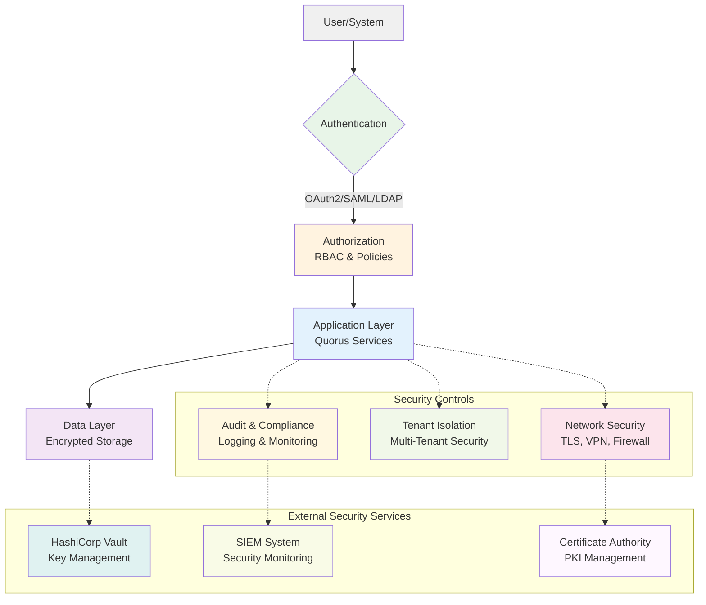

### Security Layer Details

#### Authentication Layer
- **OAuth2 Provider** - Modern token-based authentication
- **SAML Provider** - Enterprise SSO integration
- **LDAP Provider** - Directory service authentication
- **API Key Authentication** - Service-to-service authentication

#### Authorization Layer
- **Role-Based Access Control (RBAC)** - User role management
- **Attribute-Based Access Control (ABAC)** - Fine-grained permissions
- **Policy Engine** - Centralized policy management
- **Permission Manager** - Access control enforcement

#### Data Protection Layer
- **Encryption at Rest** - Database and file encryption
- **Encryption in Transit** - TLS/mTLS for all communications
- **Key Management Service** - Centralized key management
- **Hardware Security Module** - Secure key storage

#### Network Security Layer
- **TLS/mTLS** - Secure communication protocols
- **VPN Gateway** - Secure network access
- **Firewall Rules** - Network traffic filtering
- **Network Policies** - Kubernetes network isolation

#### Audit & Compliance Layer
- **Audit Logging** - Comprehensive activity logging
- **Compliance Monitor** - Regulatory compliance tracking
- **Data Residency** - Geographic data controls
- **Retention Policies** - Data lifecycle management

#### Tenant Isolation Layer
- **Tenant Isolation** - Multi-tenant data separation
- **Row Level Security** - Database-level isolation
- **Namespace Isolation** - Kubernetes namespace separation
- **Quota Management** - Resource usage controls

## Internal Network Optimizations

### Corporate Network Characteristics

Quorus is designed to leverage the unique characteristics of internal corporate networks:

#### **High Bandwidth Availability**
- **Gigabit/10Gb Ethernet** standard in corporate environments
- **Dedicated network segments** for data transfer operations
- **Quality of Service (QoS)** policies for prioritizing transfer traffic
- **Network bandwidth reservation** for critical transfer operations

#### **Low Latency Communications**
- **Sub-millisecond latency** within data centers
- **Predictable network paths** through corporate routing
- **Optimized TCP window sizing** for internal network characteristics
- **Connection pooling** for frequently accessed internal services

#### **Trusted Network Environment**
- **Reduced encryption overhead** where appropriate within secure zones
- **Certificate-based authentication** for internal service-to-service communication
- **Network-level security** through corporate firewalls and VLANs
- **Simplified authentication** using corporate directory services

### Internal Protocol Optimizations

#### **SMB/CIFS Protocol Support**
```yaml
source:
  uri: "smb://fileserver.corp.local/shares/data/export.csv"
  protocol: smb
  authentication:
    type: kerberos
    domain: "CORP"
  options:
    smbVersion: "3.1.1"
    directIO: true
    largeBuffers: true
```

#### **NFS Protocol Support**
```yaml
source:
  uri: "nfs://storage.corp.local/exports/data"
  protocol: nfs
  options:
    nfsVersion: "4.1"
    rsize: 1048576      # 1MB read buffer
    wsize: 1048576      # 1MB write buffer
    tcp: true
```

#### **Internal HTTP Optimizations**
```yaml
source:
  uri: "http://internal-api.corp.local/data/export"
  protocol: http
  options:
    keepAlive: true
    connectionPoolSize: 50
    tcpNoDelay: true
    bufferSize: 65536
    compressionEnabled: false  # Skip compression on fast internal networks
```

### Corporate Integration Features

#### **Active Directory Integration**
- **Seamless authentication** using corporate credentials
- **Group-based authorization** aligned with corporate structure
- **Service account management** for automated transfers
- **Audit trail integration** with corporate security systems

#### **Corporate Storage Integration**
- **SAN/NAS connectivity** for high-performance storage access
- **Storage tiering** awareness for optimal placement
- **Backup integration** with corporate backup systems
- **Disaster recovery** coordination with corporate DR plans

#### **Network Monitoring Integration**
- **SNMP integration** with corporate network monitoring
- **Bandwidth utilization** reporting to network operations
- **Network path optimization** based on corporate topology
- **Traffic shaping** coordination with network QoS policies

## Scalability & Performance

### Horizontal Scaling
- Stateless service design
- Load balancing across instances
- Distributed execution coordination

### Resource Management
- Configurable concurrency limits
- Resource quotas per tenant
- Dynamic resource allocation

### Performance Optimization
- Efficient buffer management
- Connection pooling
- Asynchronous I/O operations

## Monitoring & Observability

### Metrics
- Transfer performance metrics
- Resource utilization tracking
- Error rates and latency measurements

### Logging
- Structured logging with correlation IDs
- Tenant-scoped log aggregation
- Configurable log levels

### Alerting
- Threshold-based alerting
- Tenant-specific notification channels
- Integration with external monitoring systems

## Error Handling & Recovery

### Retry Mechanisms
- Exponential backoff strategies
- Configurable retry limits
- Circuit breaker patterns

### Failure Recovery
- Graceful degradation
- Automatic failover
- Manual recovery procedures

### Error Reporting
- Structured error messages
- Error categorization and classification
- Integration with monitoring systems

## Future Enhancements

### Phase 2 Implementation (Moved from Future to Active Development)
The following features have been moved from future enhancements to **Phase 2: Service Architecture & REST API** implementation:

**✅ Distributed Controller Architecture** - Now part of Phase 2.1
- Controller quorum with Raft consensus *(previously listed as "Distributed coordination with Raft consensus")*
- Agent-based transfer execution with fleet management
- Horizontal scaling capabilities with intelligent load balancing
- Multi-region deployment support with geographic distribution
- Advanced load balancing and failover mechanisms *(previously listed as "Global load balancing")*

**✅ Agent Fleet Management** - Now part of Phase 2.2
- Agent registration and heartbeat system
- Dynamic scaling and capacity management *(previously listed as "Advanced clustering capabilities")*
- Failure detection and automatic recovery
- Geographic and resource-aware job scheduling
- Agent lifecycle management with graceful shutdown

**✅ Enterprise Scalability** - Now part of Phase 2.3
- Support for 100+ agents per controller quorum
- 10,000+ concurrent transfers across fleet
- High-throughput heartbeat processing (1000+ heartbeats/second)
- Distributed state management with strong consistency
- Enterprise-grade monitoring and alerting integration

### Phase 3+ Future Features

**Advanced Protocol Support:**
- Additional protocols (S3, Azure Blob, Google Cloud Storage) *(expanded from "FTP, SFTP, S3")*
- Protocol-specific optimizations and features
- Custom protocol plugin architecture *(expanded from "Custom protocol development SDK")*
- Protocol conversion and transformation

**Advanced Workflow Features:**
- Conditional execution and loops in workflows *(expanded from "loops, conditions")*
- Dynamic workflow generation and templating
- Workflow versioning and rollback capabilities
- Advanced dependency management with complex conditions
- Real-time workflow modification and updates

**Machine Learning and AI:**
- Transfer optimization using machine learning *(expanded from "Machine learning for optimization")*
- Predictive failure detection and prevention
- Intelligent routing and path selection
- Bandwidth optimization algorithms
- Performance prediction and capacity planning

**Advanced Security and Governance:**
- End-to-end encryption with key rotation
- Advanced audit trails and compliance reporting *(expanded from "Advanced governance and compliance")*
- Integration with enterprise identity systems *(expanded from "Integration with enterprise systems")*
- Zero-trust security model implementation
- Advanced threat detection and response

**Performance Optimizations:**
- Transfer acceleration techniques (compression, deduplication)
- Intelligent caching and prefetching strategies
- Advanced bandwidth management and QoS
- Multi-path transfer optimization
- Real-time streaming transfers with low latency *(expanded from "Real-time streaming transfers")*

**Cloud-Native Features:**
- Kubernetes operator for automated deployment
- Service mesh integration (Istio, Linkerd)
- Cloud provider native integrations
- Serverless transfer execution options
- Container-based agent deployment

## Implementation Roadmap Update

### Phase 2: Service Architecture & REST API (Updated)

The implementation plan has been updated to include the distributed architecture enhancements:

**Milestone 2.1: Distributed Controller Architecture (Weeks 17-19)**
- Implement Raft consensus algorithm for controller quorum
- Agent registration and heartbeat system
- Distributed agent registry with failure detection
- Load balancer integration for high availability
- Controller leader election and failover mechanisms

**Milestone 2.2: Agent Fleet Management (Weeks 20-22)**
- Agent lifecycle management (register, heartbeat, deregister)
- Intelligent work distribution and load balancing
- Geographic and resource-aware job scheduling
- Agent health monitoring and automatic recovery
- Graceful shutdown and drain procedures

**Milestone 2.3: REST API & Client Integration (Weeks 23-24)**
- REST API for all controller operations
- Client SDKs and CLI tools
- Web dashboard for monitoring and management
- API documentation and OpenAPI specifications
- Integration testing with distributed architecture

### Success Criteria for Phase 2

**Scalability Targets:**
- Support 100+ agents per controller quorum
- Handle 10,000+ concurrent transfers across fleet
- Process 1,000+ heartbeats/second
- Achieve 100+ jobs/second assignment and completion
- Maintain <5 second failover time for controller failures

**Reliability Targets:**
- 99.9% uptime for controller quorum
- <30 second recovery time for agent failures
- Zero data loss during controller failover
- Automatic job redistribution on agent failure
- Graceful handling of network partitions

**Performance Targets:**
- <100ms latency for job assignment
- <1 second for agent registration
- <5 seconds for failure detection
- <10 seconds for job redistribution
- Linear scaling with agent additions

## File Organization

### Project Structure Overview

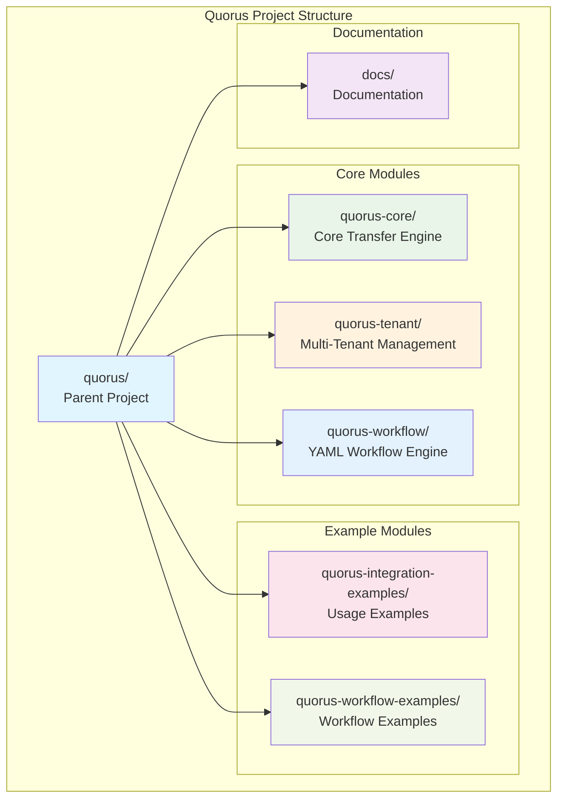

### Module Details

#### Core Modules
```
quorus-core/                    # Core transfer engine
├── src/main/java/dev/mars/quorus/
│   ├── core/                   # Domain models
│   ├── transfer/               # Transfer engine
│   ├── protocol/               # Protocol handlers
│   ├── storage/                # File management
│   └── config/                 # Configuration
└── src/test/java/              # Unit tests

quorus-tenant/                  # Multi-tenant management
├── src/main/java/dev/mars/quorus/tenant/
│   ├── model/                  # Tenant models
│   ├── service/                # Tenant services
│   ├── security/               # Multi-tenant security
│   └── resource/               # Resource management
└── src/test/java/              # Unit tests

quorus-workflow/                # YAML workflow engine
├── src/main/java/dev/mars/quorus/workflow/
│   ├── definition/             # YAML models
│   ├── parser/                 # YAML parsing
│   ├── engine/                 # Workflow engine
│   └── resolver/               # Dependency resolution
└── src/test/java/              # Unit tests
```

#### Example Modules
```
quorus-integration-examples/    # Usage examples
├── src/main/java/dev/mars/quorus/examples/
│   └── BasicTransferExample.java
└── README.md

quorus-workflow-examples/       # Workflow examples
├── basic/                      # Simple examples
├── enterprise/                 # Complex workflows
└── templates/                  # Reusable templates
```

#### Documentation
```
docs/                           # Documentation
├── quorus-comprehensive-system-design.md
├── quorus-implementation-plan.md
└── README.md
```

## Related Documents

- **[Implementation Plan](../quorus-integration-examples/quorus-implementation-plan.md)** - Detailed 52-week development roadmap with Gantt chart timeline, milestones, and deliverables
- **[API Documentation](api-documentation.md)** - REST API specifications (future)

## Conclusion

The Quorus comprehensive system design provides a solid foundation for enterprise-grade file transfer operations with:

- **Multi-tenant architecture** supporting complex organizational structures
- **Declarative YAML workflows** for infrastructure-as-code approach
- **Robust security framework** with authentication, authorization, and compliance
- **Scalable architecture** supporting horizontal scaling and high availability
- **Enterprise features** including governance, monitoring, and resource management

The modular design ensures maintainability and extensibility while meeting the demanding requirements of enterprise environments. The system is designed to grow from simple single-tenant deployments to complex multi-tenant enterprise scenarios with thousands of users and petabytes of data transfer.
```
