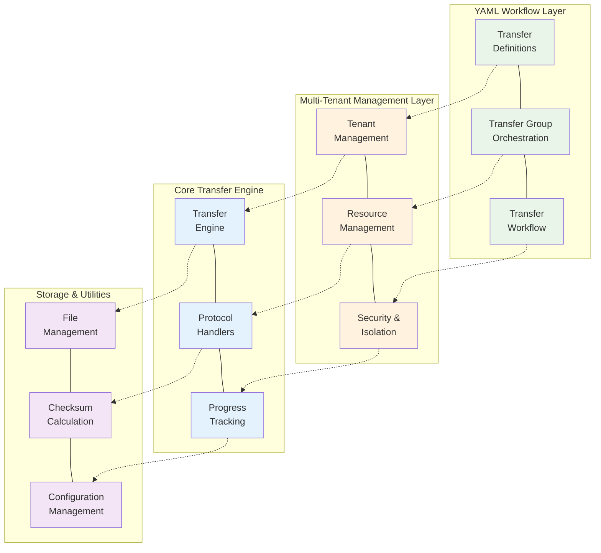
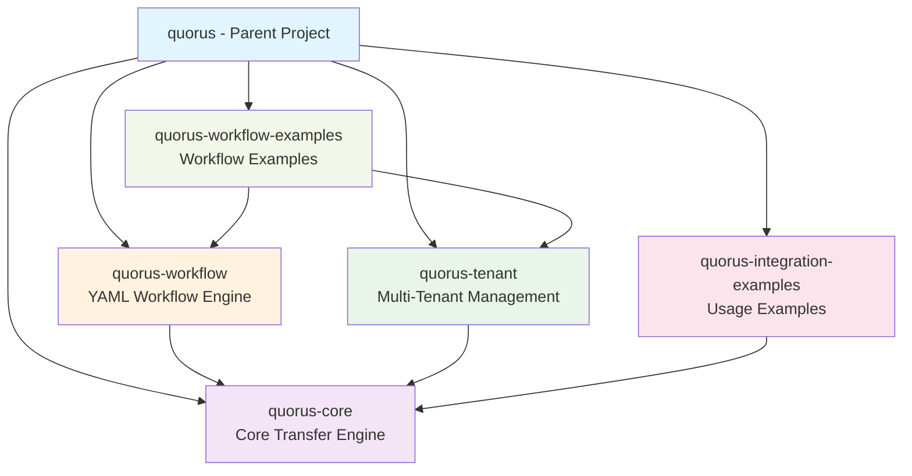
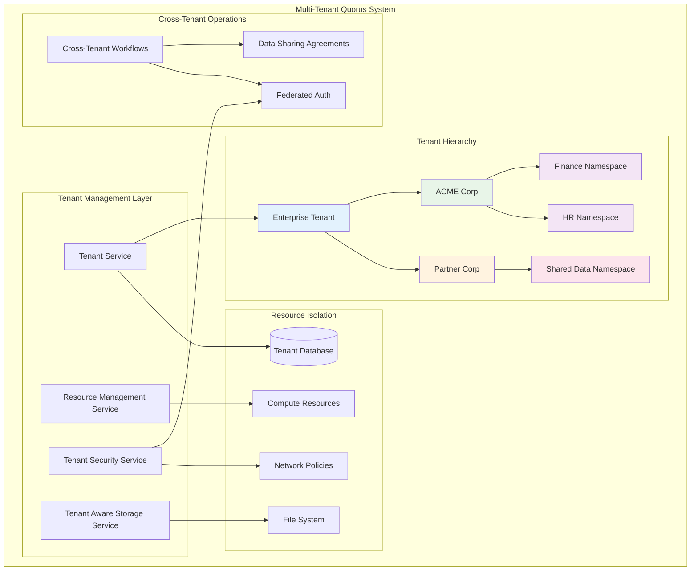
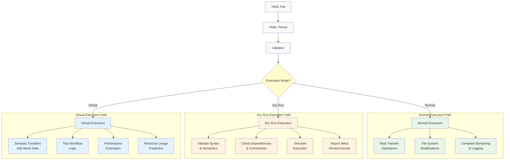
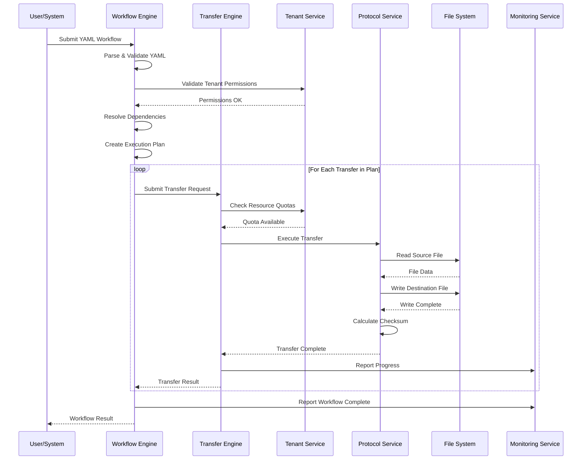
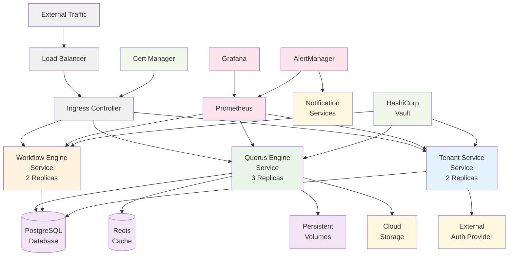
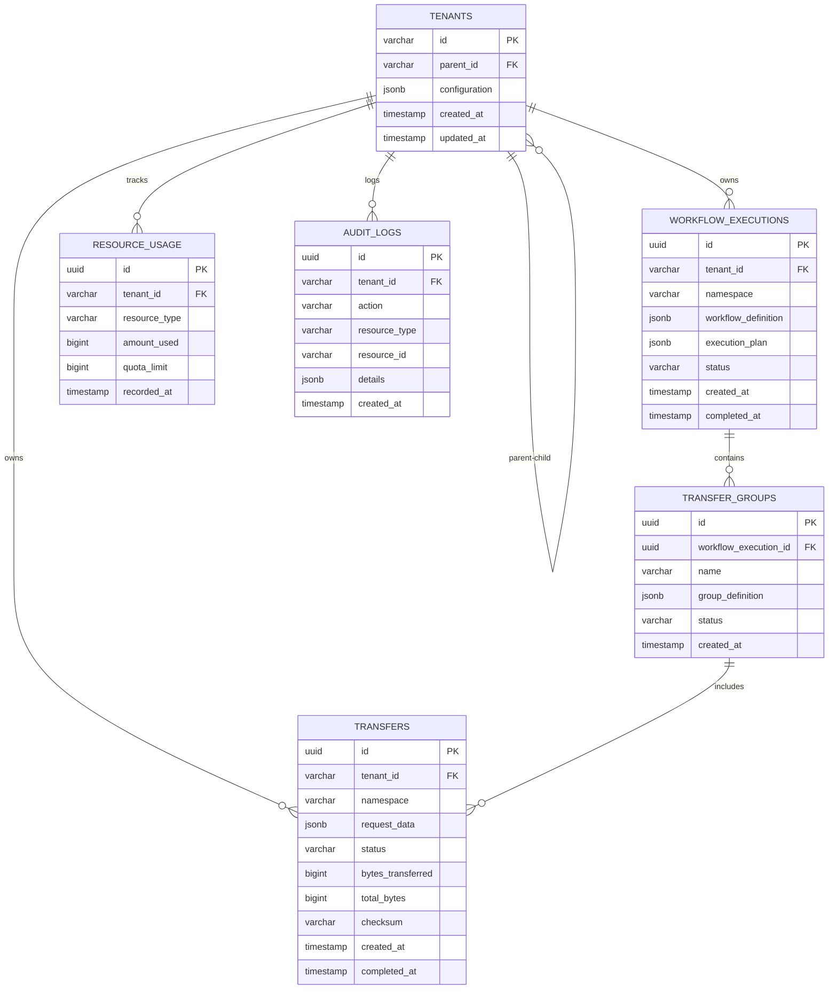
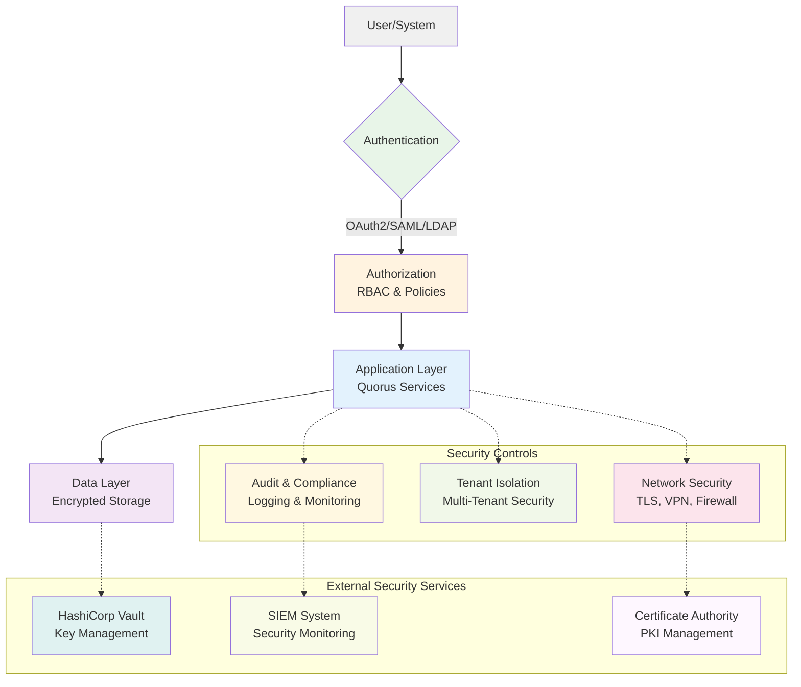
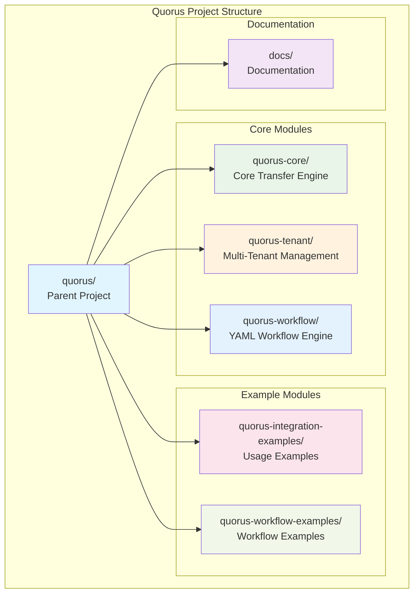

# Quorus Comprehensive System Design

## Overview

Quorus is an enterprise-grade file transfer system designed for high reliability, scalability, and multi-tenant operation. The system provides both programmatic APIs and declarative YAML-based workflow definitions for complex file transfer orchestration with comprehensive multi-tenancy support.

## System Architecture

### High-Level Architecture



### Module Structure

The system is organized into multiple Maven modules for clear separation of concerns:



## Core Components

### 1. Transfer Engine (quorus-core)

The foundation of the system providing basic file transfer capabilities.

**Key Components:**
- `TransferEngine`: Main interface for transfer operations
- `TransferProtocol`: Pluggable protocol implementations
- `ProgressTracker`: Real-time progress monitoring
- `ChecksumCalculator`: File integrity verification

**Features:**
- HTTP/HTTPS protocol support
- Concurrent transfer management
- Retry mechanisms with exponential backoff
- Progress tracking with rate calculation
- SHA-256 integrity verification
- Thread-safe operations

### 2. Multi-Tenant Management (quorus-tenant)

Enterprise-grade multi-tenancy with isolation and resource management.

**Key Components:**
- `TenantService`: Tenant lifecycle management
- `ResourceManagementService`: Quota and usage tracking
- `TenantSecurityService`: Authentication and authorization
- `TenantAwareStorageService`: Storage isolation

**Features:**
- Hierarchical tenant structure
- Resource quotas and limits
- Data isolation strategies
- Cross-tenant security controls
- Compliance and governance

### 3. YAML Workflow Engine (quorus-workflow)

Declarative workflow definition and execution system.

**Key Components:**
- `WorkflowDefinitionParser`: YAML parsing and validation
- `WorkflowEngine`: Workflow execution orchestration
- `DependencyResolver`: Dependency analysis and planning
- `VariableResolver`: Variable substitution and templating

**Features:**
- Declarative YAML definitions
- Complex dependency management
- Conditional execution
- Dry run and virtual run modes
- Variable substitution and templating

## Multi-Tenancy Architecture

### Core Multi-Tenancy Concepts

#### 1. Tenant
A logical isolation boundary representing an organization, department, or business unit with its own:
- Configuration and policies
- Resource quotas and limits
- Security boundaries
- Workflow definitions
- Execution history and metrics

#### 2. Tenant Hierarchy
Support for nested tenants (e.g., Company → Department → Team) with inheritance of policies and quotas.

#### 3. Tenant Isolation Levels
- **Logical Isolation**: Shared infrastructure with data separation
- **Physical Isolation**: Dedicated resources per tenant
- **Hybrid Isolation**: Mix of shared and dedicated resources

### Multi-Tenant System Architecture



#### 1. Tenant Management Service
```java
// New package: dev.mars.quorus.tenant
public interface TenantService {
    // Tenant lifecycle
    Tenant createTenant(TenantConfiguration config);
    Tenant updateTenant(String tenantId, TenantConfiguration config);
    void deleteTenant(String tenantId);
    
    // Tenant discovery
    Tenant getTenant(String tenantId);
    List<Tenant> getChildTenants(String parentTenantId);
    TenantHierarchy getTenantHierarchy(String tenantId);
    
    // Resource management
    ResourceQuota getResourceQuota(String tenantId);
    ResourceUsage getResourceUsage(String tenantId);
    boolean checkResourceLimit(String tenantId, ResourceType type, long amount);
}
```

#### 2. Multi-Tenant Workflow Engine
```java
public interface MultiTenantWorkflowEngine extends WorkflowEngine {
    // Tenant-aware execution
    WorkflowExecution execute(WorkflowDefinition definition, TenantContext context);
    
    // Cross-tenant operations
    WorkflowExecution executeCrossTenant(WorkflowDefinition definition, 
                                       List<TenantContext> tenants);
    
    // Tenant isolation
    List<WorkflowExecution> getExecutions(String tenantId);
    WorkflowMetrics getMetrics(String tenantId, TimeRange range);
}
```

#### 3. Tenant-Aware Security Service
```java
public interface TenantSecurityService {
    // Authentication
    TenantPrincipal authenticate(String tenantId, AuthenticationToken token);
    
    // Authorization
    boolean authorize(TenantPrincipal principal, String resource, String action);
    
    // Data protection
    EncryptionKey getTenantEncryptionKey(String tenantId);
    String encryptForTenant(String tenantId, String data);
    String decryptForTenant(String tenantId, String encryptedData);
    
    // Cross-tenant security
    boolean isCrossTenantAllowed(String sourceTenant, String targetTenant);
    DataSharingAgreement getDataSharingAgreement(String tenant1, String tenant2);
}
```

#### 4. Resource Management Service
```java
public interface ResourceManagementService {
    // Quota management
    boolean reserveResources(String tenantId, ResourceRequest request);
    void releaseResources(String tenantId, ResourceRequest request);
    
    // Usage tracking
    void recordUsage(String tenantId, ResourceUsage usage);
    ResourceMetrics getUsageMetrics(String tenantId, TimeRange range);
    
    // Billing and cost allocation
    CostReport generateCostReport(String tenantId, TimeRange range);
    void allocateCosts(String tenantId, TransferExecution execution);
}
```

## YAML Workflow System

### Core Concepts

#### 1. Transfer Definition
A single file transfer operation with source, destination, and metadata.

#### 2. Transfer Group
A collection of related transfers that can be executed with dependencies, sequencing, and shared configuration.

#### 3. Transfer Workflow
A higher-level orchestration of transfer groups with complex dependency trees, triggers, and conditional execution.

#### 4. Transfer Plan
The resolved execution plan after dependency analysis and validation.

### YAML Schema Design

#### Single Transfer Definition

```yaml
# transfer-user-data.yaml
apiVersion: quorus.dev/v1
kind: Transfer
metadata:
  name: user-data-backup
  description: "Backup user data to archive server"
  tenant: acme-corp              # Tenant identifier
  namespace: finance             # Sub-tenant/namespace
  labels:
    environment: production
    priority: high
    team: data-ops
    dataClassification: confidential
    costCenter: "CC-12345"
  annotations:
    created-by: "john.doe@company.com"
    ticket: "JIRA-12345"

spec:
  source:
    uri: "https://api.company.com/users/export"
    protocol: https
    authentication:
      type: tenant-oauth2        # Use tenant's OAuth2 config
      scopes: ["read:customers"]
    headers:
      Authorization: "${AUTH_TOKEN}"
      Content-Type: "application/json"
      X-Tenant-ID: "${tenant.id}"
      X-Data-Classification: "${metadata.labels.dataClassification}"
    timeout: 300s
    
  destination:
    path: "${tenant.storage.root}/exports/customers-${date:yyyy-MM-dd}.json"
    createDirectories: true
    permissions: "644"
    encryption:
      enabled: "${tenant.security.dataProtection.encryptionAtRest}"
      keyId: "${tenant.security.keyManagement.keyId}"
    
  validation:
    expectedSize: 
      min: 1MB
      max: 100MB
    checksum:
      algorithm: "${tenant.defaults.validation.checksumAlgorithm}"
      required: "${tenant.defaults.validation.checksumRequired}"
      expected: "${EXPECTED_CHECKSUM}"
    
  retry:
    maxAttempts: 3
    backoff: exponential
    initialDelay: 1s
    maxDelay: 30s
    
  monitoring:
    enabled: "${tenant.defaults.monitoring.metricsEnabled}"
    progressReporting: true
    metricsEnabled: true
    alertOnFailure: true
    tags:
      tenant: "${tenant.id}"
      namespace: "${metadata.namespace}"
      costCenter: "${metadata.labels.costCenter}"
```

#### Transfer Group Definition

```yaml
# backup-workflow.yaml
apiVersion: quorus.dev/v1
kind: TransferGroup
metadata:
  name: daily-backup-workflow
  description: "Daily backup workflow for critical data"
  tenant: acme-corp
  namespace: finance
  labels:
    schedule: daily
    criticality: high

spec:
  # Execution strategy
  execution:
    strategy: sequential  # sequential, parallel, mixed
    maxConcurrency: 3
    timeout: 3600s
    continueOnError: false
    
  # Shared configuration
  defaults:
    retry:
      maxAttempts: 3
      backoff: exponential
    monitoring:
      progressReporting: true
      
  # Variable definitions
  variables:
    BACKUP_DATE: "${date:yyyy-MM-dd}"
    BACKUP_ROOT: "${tenant.storage.root}/backup/${BACKUP_DATE}"
    AUTH_TOKEN: "${env:API_TOKEN}"
    
  # Transfer definitions
  transfers:
    - name: user-data
      source:
        uri: "https://api.company.com/users/export"
        headers:
          Authorization: "${AUTH_TOKEN}"
      destination:
        path: "${BACKUP_ROOT}/users.json"
      dependsOn: []
      
    - name: order-data
      source:
        uri: "https://api.company.com/orders/export"
        headers:
          Authorization: "${AUTH_TOKEN}"
      destination:
        path: "${BACKUP_ROOT}/orders.json"
      dependsOn: ["user-data"]  # Wait for user-data to complete
      
    - name: analytics-data
      source:
        uri: "https://analytics.company.com/export"
      destination:
        path: "${BACKUP_ROOT}/analytics.json"
      dependsOn: ["user-data", "order-data"]
      condition: "${user-data.success} && ${order-data.success}"
      
  # Post-execution actions
  onSuccess:
    - action: notify
      target: "slack://data-ops-channel"
      message: "Daily backup completed successfully"
    - action: cleanup
      target: "/backup"
      retentionDays: 30
      
  onFailure:
    - action: notify
      target: "email://ops-team@company.com"
      message: "Daily backup failed: ${error.message}"
    - action: rollback
      strategy: deletePartial
```

#### Multi-Tenant Workflow Definition

```yaml
# multi-tenant-workflow.yaml
apiVersion: quorus.dev/v1
kind: TransferWorkflow
metadata:
  name: cross-tenant-data-sync
  tenant: enterprise            # Parent tenant

spec:
  # Multi-tenant execution
  tenants:
    - name: acme-corp
      namespace: finance
      role: source              # source, destination, both

    - name: partner-corp
      namespace: shared-data
      role: destination

  # Tenant-specific execution policies
  execution:
    isolation: logical          # logical, physical, hybrid
    crossTenantAllowed: true
    approvalRequired: true
    dryRun: false
    virtualRun: false
    parallelism: 5
    timeout: 7200s

  # Cross-tenant security
  security:
    # Data sharing agreements
    dataSharing:
      agreements: ["DSA-2024-001"]
      dataClassification: "internal"
      retentionPolicy: "30d"

    # Cross-tenant authentication
    authentication:
      federatedAuth: true
      trustedTenants: ["partner-corp"]

  # Environment-specific variables
  environments:
    production:
      SOURCE_DB: "prod-db.company.com"
      TARGET_STORAGE: "s3://prod-backup"
    staging:
      SOURCE_DB: "staging-db.company.com"
      TARGET_STORAGE: "s3://staging-backup"

  groups:
    - name: extract-acme-data
      tenant: acme-corp
      namespace: finance
      transferGroup:
        spec:
          transfers:
            - name: customer-export
              source:
                uri: "${acme-corp.api.endpoint}/customers"
                authentication:
                  type: tenant-oauth2
              destination:
                path: "${shared.storage}/acme-customers.json"

    - name: sync-to-partner
      tenant: partner-corp
      namespace: shared-data
      dependsOn: ["extract-acme-data"]
      condition: "${acme-corp.dataSharing.approved}"
      transferGroup:
        spec:
          transfers:
            - name: partner-import
              source:
                path: "${shared.storage}/acme-customers.json"
              destination:
                uri: "${partner-corp.api.endpoint}/import"
                authentication:
                  type: tenant-oauth2

  # Workflow triggers
  triggers:
    - name: schedule
      type: cron
      schedule: "0 2 * * *"  # Daily at 2 AM
      timezone: "UTC"

    - name: file-watcher
      type: fileSystem
      path: "/incoming/trigger.flag"
      action: create

  # Validation rules
  validation:
    - name: source-connectivity
      type: connectivity
      targets: ["${SOURCE_DB}"]

    - name: storage-capacity
      type: diskSpace
      path: "/staging"
      required: 10GB

    - name: dependency-check
      type: yamlDependencies
      recursive: true
```

### Tenant Configuration

```yaml
# tenant-config.yaml
apiVersion: quorus.dev/v1
kind: TenantConfiguration
metadata:
  name: acme-corp
  namespace: enterprise
  labels:
    tier: premium
    region: us-east-1
    industry: finance

spec:
  # Tenant hierarchy
  hierarchy:
    parent: null  # Root tenant
    children: ["acme-corp-finance", "acme-corp-hr", "acme-corp-it"]

  # Resource quotas and limits
  resources:
    quotas:
      # Transfer limits
      maxConcurrentTransfers: 50
      maxDailyTransfers: 1000
      maxMonthlyDataTransfer: 10TB
      maxFileSize: 5GB

      # Storage limits
      maxStorageUsage: 1TB
      maxRetentionDays: 365

      # Compute limits
      maxCpuCores: 16
      maxMemoryGB: 64
      maxBandwidthMbps: 1000

    # Resource allocation strategy
    allocation:
      strategy: shared  # shared, dedicated, hybrid
      priority: high    # low, medium, high, critical

  # Security policies
  security:
    # Network access controls
    networking:
      allowedSourceCIDRs: ["10.0.0.0/8", "192.168.0.0/16"]
      allowedDestinations: ["s3://acme-corp-*", "/data/acme-corp/*"]
      requireVPN: true
      allowCrossRegion: false

    # Authentication and authorization
    authentication:
      provider: "oauth2"  # oauth2, saml, ldap, api-key
      endpoint: "https://auth.acme-corp.com"

    authorization:
      rbac:
        enabled: true
        defaultRole: "transfer-user"
        adminRole: "transfer-admin"

    # Data protection
    dataProtection:
      encryptionAtRest: true
      encryptionInTransit: true
      encryptionAlgorithm: "AES-256"
      keyManagement: "aws-kms"  # aws-kms, azure-kv, vault

  # Compliance and governance
  governance:
    # Data classification
    dataClassification:
      defaultLevel: "internal"
      allowedLevels: ["public", "internal", "confidential"]

    # Audit and compliance
    audit:
      enabled: true
      retentionDays: 2555  # 7 years
      exportFormat: "json"

    compliance:
      frameworks: ["SOX", "GDPR", "HIPAA"]
      dataResidency: "us-east-1"
      crossBorderTransfer: false

  # Monitoring and alerting
  monitoring:
    # Metrics collection
    metrics:
      enabled: true
      granularity: "1m"
      retention: "90d"

    # Alerting configuration
    alerting:
      channels:
        - type: "slack"
          webhook: "https://hooks.slack.com/acme-corp"
        - type: "email"
          recipients: ["ops@acme-corp.com"]
        - type: "webhook"
          endpoint: "https://monitoring.acme-corp.com/alerts"

      thresholds:
        errorRate: 5%
        quotaUsage: 80%
        transferLatency: 30s

  # Workflow defaults
  defaults:
    # Default retry policy
    retry:
      maxAttempts: 3
      backoff: exponential
      initialDelay: 1s

    # Default validation
    validation:
      checksumRequired: true
      sizeValidation: true

    # Default monitoring
    monitoring:
      progressReporting: true
      metricsEnabled: true
```

## Workflow Engine Architecture

### Core Components

#### 1. YAML Parser & Validator
```java
// New package: dev.mars.quorus.workflow
public interface WorkflowDefinitionParser {
    WorkflowDefinition parse(Path yamlFile) throws WorkflowParseException;
    ValidationResult validate(WorkflowDefinition definition);
    DependencyGraph buildDependencyGraph(List<WorkflowDefinition> definitions);
}
```

#### 2. Workflow Engine
```java
public interface WorkflowEngine {
    WorkflowExecution execute(WorkflowDefinition definition, ExecutionContext context);
    WorkflowExecution dryRun(WorkflowDefinition definition, ExecutionContext context);
    WorkflowExecution virtualRun(WorkflowDefinition definition, ExecutionContext context);

    // Monitoring and control
    WorkflowStatus getStatus(String executionId);
    boolean pause(String executionId);
    boolean resume(String executionId);
    boolean cancel(String executionId);
}
```

#### 3. Dependency Resolver
```java
public interface DependencyResolver {
    ExecutionPlan resolve(List<WorkflowDefinition> definitions);
    ValidationResult validateDependencies(DependencyGraph graph);
    List<WorkflowDefinition> getExecutionOrder(DependencyGraph graph);
}
```

#### 4. Variable Resolver
```java
public interface VariableResolver {
    String resolve(String expression, ExecutionContext context);
    Map<String, String> resolveAll(Map<String, String> variables, ExecutionContext context);

    // Built-in functions
    // ${date:yyyy-MM-dd} -> current date
    // ${env:VAR_NAME} -> environment variable
    // ${file:path/to/file} -> file content
    // ${transfer.result.checksum} -> result from previous transfer
}
```

### Execution Modes



#### 1. Normal Execution
- Full transfer execution with real network operations
- File system modifications
- Complete monitoring and logging

#### 2. Dry Run
- Validate YAML syntax and semantics
- Check dependencies and connectivity
- Simulate execution without actual transfers
- Report what would be executed

#### 3. Virtual Run
- Simulate transfers with mock data
- Test workflow logic and dependencies
- Performance estimation
- Resource usage prediction

## Transfer Process Flow



## Data Models

### Core Domain Models

#### Transfer Request
```java
public class TransferRequest {
    private String requestId;
    private URI sourceUri;
    private Path destinationPath;
    private String protocol;
    private String tenantId;
    private String namespace;
    private Map<String, String> metadata;
    private long expectedSize;
    private String expectedChecksum;
    // ... other fields
}
```

#### Transfer Job
```java
public class TransferJob {
    private String jobId;
    private TransferRequest request;
    private TransferStatus status;
    private long bytesTransferred;
    private long totalBytes;
    private Instant startTime;
    private String actualChecksum;
    private String tenantId;
    // ... other fields
}
```

### Multi-Tenant Models

#### Tenant Configuration
```java
public class TenantConfiguration {
    private String tenantId;
    private String parentTenantId;
    private ResourceQuota resourceQuota;
    private SecurityPolicy securityPolicy;
    private ComplianceSettings compliance;
    private Map<String, String> variables;
    // ... other fields
}
```

### Workflow Models

#### Workflow Definition
```java
public class WorkflowDefinition {
    private String name;
    private String tenantId;
    private String namespace;
    private ExecutionStrategy execution;
    private List<TransferGroupDefinition> groups;
    private Map<String, String> variables;
    private List<TenantContext> tenants;
    // ... other fields
}
```

## Data Isolation Strategies

### 1. Database-Level Isolation
```sql
-- Tenant-aware schema design
CREATE TABLE transfers (
    id UUID PRIMARY KEY,
    tenant_id VARCHAR(255) NOT NULL,
    namespace VARCHAR(255),
    request_data JSONB,
    status VARCHAR(50),
    created_at TIMESTAMP DEFAULT NOW(),

    -- Tenant isolation constraints
    CONSTRAINT fk_tenant FOREIGN KEY (tenant_id) REFERENCES tenants(id),
    INDEX idx_tenant_namespace (tenant_id, namespace)
);

-- Row-level security
CREATE POLICY tenant_isolation ON transfers
    FOR ALL TO application_role
    USING (tenant_id = current_setting('app.current_tenant'));
```

### 2. Storage Isolation
```java
public class TenantAwareStorageService {
    private final String getTenantStorageRoot(String tenantId) {
        return String.format("/data/tenants/%s", tenantId);
    }

    private final void validateTenantAccess(String tenantId, Path path) {
        String tenantRoot = getTenantStorageRoot(tenantId);
        if (!path.startsWith(tenantRoot)) {
            throw new SecurityException("Cross-tenant storage access denied");
        }
    }
}
```

### 3. Network Isolation
```yaml
# Kubernetes NetworkPolicy example
apiVersion: networking.k8s.io/v1
kind: NetworkPolicy
metadata:
  name: tenant-isolation
spec:
  podSelector:
    matchLabels:
      tenant: acme-corp
  policyTypes:
  - Ingress
  - Egress
  ingress:
  - from:
    - podSelector:
        matchLabels:
          tenant: acme-corp
  egress:
  - to:
    - podSelector:
        matchLabels:
          tenant: acme-corp
```

## Enterprise Features

### 1. Governance & Compliance
```yaml
governance:
  approvals:
    required: true
    approvers: ["data-ops-lead", "security-team"]

  compliance:
    dataClassification: confidential
    retentionPolicy: 7years
    encryptionRequired: true
    auditLogging: true

  security:
    allowedSources: ["*.company.com", "trusted-partner.com"]
    allowedDestinations: ["s3://company-*", "/backup/*"]
    requiresVPN: true
```

### 2. Resource Management
```yaml
resources:
  limits:
    maxConcurrentTransfers: 10
    maxBandwidth: 100MB/s
    maxDiskUsage: 1TB

  quotas:
    dailyTransferLimit: 1TB
    monthlyTransferLimit: 30TB

  scheduling:
    priority: high
    preferredHours: "02:00-06:00"
    blackoutWindows: ["12:00-13:00"]
```

### 3. Monitoring & Alerting
```yaml
monitoring:
  metrics:
    - transferRate
    - errorRate
    - queueDepth
    - resourceUtilization

  alerts:
    - name: transfer-failure
      condition: "errorRate > 5%"
      severity: critical
      channels: ["slack", "email", "pagerduty"]

    - name: slow-transfer
      condition: "transferRate < 1MB/s"
      severity: warning
      channels: ["slack"]
```

## Security Architecture

### Authentication
- Support for multiple providers (OAuth2, SAML, LDAP)
- Tenant-specific authentication configuration
- API key authentication for programmatic access

### Authorization
- Role-based access control (RBAC)
- Tenant-scoped permissions
- Fine-grained resource access controls

### Data Protection
- Encryption at rest using tenant-specific keys
- TLS encryption for data in transit
- Data classification and handling policies

### Audit & Compliance
- Comprehensive audit logging
- Tenant-isolated audit trails
- Compliance framework support (GDPR, HIPAA, SOX)

## Configuration Management

### Hierarchical Configuration
```yaml
# Global defaults (system-level)
global:
  defaults:
    retry:
      maxAttempts: 3
    security:
      encryptionRequired: true

# Tenant-level overrides
tenant:
  acme-corp:
    defaults:
      retry:
        maxAttempts: 5  # Override global
      security:
        encryptionAlgorithm: "AES-256-GCM"  # Add tenant-specific

    # Namespace-level overrides
    namespaces:
      finance:
        defaults:
          retry:
            maxAttempts: 7  # Override tenant
          validation:
            checksumRequired: true  # Add namespace-specific
```

### Variable Resolution with Tenancy
```yaml
variables:
  # System variables
  system:
    version: "1.0.0"
    region: "us-east-1"

  # Tenant variables
  tenant:
    id: "acme-corp"
    name: "ACME Corporation"
    storage:
      root: "/data/tenants/acme-corp"
      backup: "s3://acme-corp-backup"
    api:
      endpoint: "https://api.acme-corp.com"

  # Namespace variables
  namespace:
    name: "finance"
    costCenter: "CC-12345"
    approver: "finance-lead@acme-corp.com"
```

## Deployment Architecture

### Container-Based Deployment


```yaml
# Kubernetes deployment example
apiVersion: apps/v1
kind: Deployment
metadata:
  name: quorus-engine
spec:
  replicas: 3
  selector:
    matchLabels:
      app: quorus-engine
  template:
    metadata:
      labels:
        app: quorus-engine
    spec:
      containers:
      - name: quorus-engine
        image: quorus/engine:latest
        resources:
          requests:
            memory: "512Mi"
            cpu: "500m"
          limits:
            memory: "1Gi"
            cpu: "1000m"
        env:
        - name: QUORUS_TENANT_ID
          valueFrom:
            fieldRef:
              fieldPath: metadata.labels['tenant']
```

### Database Schema



```sql
-- Core tables
CREATE TABLE tenants (
    id VARCHAR(255) PRIMARY KEY,
    parent_id VARCHAR(255),
    configuration JSONB,
    created_at TIMESTAMP DEFAULT NOW(),
    updated_at TIMESTAMP DEFAULT NOW(),
    FOREIGN KEY (parent_id) REFERENCES tenants(id)
);

CREATE TABLE transfers (
    id UUID PRIMARY KEY,
    tenant_id VARCHAR(255) NOT NULL,
    namespace VARCHAR(255),
    request_data JSONB,
    status VARCHAR(50),
    bytes_transferred BIGINT DEFAULT 0,
    total_bytes BIGINT,
    checksum VARCHAR(255),
    created_at TIMESTAMP DEFAULT NOW(),
    completed_at TIMESTAMP,
    FOREIGN KEY (tenant_id) REFERENCES tenants(id)
);

CREATE TABLE workflow_executions (
    id UUID PRIMARY KEY,
    tenant_id VARCHAR(255) NOT NULL,
    namespace VARCHAR(255),
    workflow_definition JSONB,
    execution_plan JSONB,
    status VARCHAR(50),
    created_at TIMESTAMP DEFAULT NOW(),
    completed_at TIMESTAMP,
    FOREIGN KEY (tenant_id) REFERENCES tenants(id)
);

CREATE TABLE transfer_groups (
    id UUID PRIMARY KEY,
    workflow_execution_id UUID NOT NULL,
    name VARCHAR(255),
    group_definition JSONB,
    status VARCHAR(50),
    created_at TIMESTAMP DEFAULT NOW(),
    FOREIGN KEY (workflow_execution_id) REFERENCES workflow_executions(id)
);

CREATE TABLE resource_usage (
    id UUID PRIMARY KEY,
    tenant_id VARCHAR(255) NOT NULL,
    resource_type VARCHAR(100),
    amount_used BIGINT,
    quota_limit BIGINT,
    recorded_at TIMESTAMP DEFAULT NOW(),
    FOREIGN KEY (tenant_id) REFERENCES tenants(id)
);

CREATE TABLE audit_logs (
    id UUID PRIMARY KEY,
    tenant_id VARCHAR(255) NOT NULL,
    action VARCHAR(100),
    resource_type VARCHAR(100),
    resource_id VARCHAR(255),
    details JSONB,
    created_at TIMESTAMP DEFAULT NOW(),
    FOREIGN KEY (tenant_id) REFERENCES tenants(id)
);
```


## Design Principles

### 1. Modularity
- Clear separation between core engine and enterprise features
- Pluggable architecture for protocols and storage
- Independent module development and testing

### 2. Multi-Tenancy
- Tenant isolation at all levels (data, compute, network)
- Hierarchical tenant structure with inheritance
- Resource quotas and usage tracking

### 3. Declarative Configuration
- YAML-based workflow definitions
- Infrastructure-as-code approach
- Version-controlled transfer configurations

### 4. Enterprise-Grade Security
- Authentication and authorization
- Data encryption at rest and in transit
- Audit logging and compliance

### 5. Observability
- Comprehensive metrics and monitoring
- Real-time progress tracking
- Alerting and notification systems

## Security Architecture



### Security Layer Details

#### Authentication Layer
- **OAuth2 Provider** - Modern token-based authentication
- **SAML Provider** - Enterprise SSO integration
- **LDAP Provider** - Directory service authentication
- **API Key Authentication** - Service-to-service authentication

#### Authorization Layer
- **Role-Based Access Control (RBAC)** - User role management
- **Attribute-Based Access Control (ABAC)** - Fine-grained permissions
- **Policy Engine** - Centralized policy management
- **Permission Manager** - Access control enforcement

#### Data Protection Layer
- **Encryption at Rest** - Database and file encryption
- **Encryption in Transit** - TLS/mTLS for all communications
- **Key Management Service** - Centralized key management
- **Hardware Security Module** - Secure key storage

#### Network Security Layer
- **TLS/mTLS** - Secure communication protocols
- **VPN Gateway** - Secure network access
- **Firewall Rules** - Network traffic filtering
- **Network Policies** - Kubernetes network isolation

#### Audit & Compliance Layer
- **Audit Logging** - Comprehensive activity logging
- **Compliance Monitor** - Regulatory compliance tracking
- **Data Residency** - Geographic data controls
- **Retention Policies** - Data lifecycle management

#### Tenant Isolation Layer
- **Tenant Isolation** - Multi-tenant data separation
- **Row Level Security** - Database-level isolation
- **Namespace Isolation** - Kubernetes namespace separation
- **Quota Management** - Resource usage controls

## Scalability & Performance

### Horizontal Scaling
- Stateless service design
- Load balancing across instances
- Distributed execution coordination

### Resource Management
- Configurable concurrency limits
- Resource quotas per tenant
- Dynamic resource allocation

### Performance Optimization
- Efficient buffer management
- Connection pooling
- Asynchronous I/O operations

## Monitoring & Observability

### Metrics
- Transfer performance metrics
- Resource utilization tracking
- Error rates and latency measurements

### Logging
- Structured logging with correlation IDs
- Tenant-scoped log aggregation
- Configurable log levels

### Alerting
- Threshold-based alerting
- Tenant-specific notification channels
- Integration with external monitoring systems

## Error Handling & Recovery

### Retry Mechanisms
- Exponential backoff strategies
- Configurable retry limits
- Circuit breaker patterns

### Failure Recovery
- Graceful degradation
- Automatic failover
- Manual recovery procedures

### Error Reporting
- Structured error messages
- Error categorization and classification
- Integration with monitoring systems

## Future Enhancements

### Planned Features
- Additional protocol support (FTP, SFTP, S3)
- Advanced workflow features (loops, conditions)
- Real-time streaming transfers
- Machine learning for optimization

### Scalability Improvements
- Distributed coordination with Raft consensus
- Advanced clustering capabilities
- Global load balancing

### Enterprise Features
- Advanced governance and compliance
- Integration with enterprise systems
- Custom protocol development SDK

## File Organization

### Project Structure Overview



### Module Details

#### Core Modules
```
quorus-core/                    # Core transfer engine
├── src/main/java/dev/mars/quorus/
│   ├── core/                   # Domain models
│   ├── transfer/               # Transfer engine
│   ├── protocol/               # Protocol handlers
│   ├── storage/                # File management
│   └── config/                 # Configuration
└── src/test/java/              # Unit tests

quorus-tenant/                  # Multi-tenant management
├── src/main/java/dev/mars/quorus/tenant/
│   ├── model/                  # Tenant models
│   ├── service/                # Tenant services
│   ├── security/               # Multi-tenant security
│   └── resource/               # Resource management
└── src/test/java/              # Unit tests

quorus-workflow/                # YAML workflow engine
├── src/main/java/dev/mars/quorus/workflow/
│   ├── definition/             # YAML models
│   ├── parser/                 # YAML parsing
│   ├── engine/                 # Workflow engine
│   └── resolver/               # Dependency resolution
└── src/test/java/              # Unit tests
```

#### Example Modules
```
quorus-integration-examples/    # Usage examples
├── src/main/java/dev/mars/quorus/examples/
│   └── BasicTransferExample.java
└── README.md

quorus-workflow-examples/       # Workflow examples
├── basic/                      # Simple examples
├── enterprise/                 # Complex workflows
└── templates/                  # Reusable templates
```

#### Documentation
```
docs/                           # Documentation
├── quorus-comprehensive-system-design.md
├── quorus-implementation-plan.md
└── README.md
```

## Related Documents

- **[Implementation Plan](quorus-implementation-plan.md)** - Detailed 52-week development roadmap with Gantt chart timeline, milestones, and deliverables
- **[API Documentation](api-documentation.md)** - REST API specifications (future)

## Conclusion

The Quorus comprehensive system design provides a solid foundation for enterprise-grade file transfer operations with:

- **Multi-tenant architecture** supporting complex organizational structures
- **Declarative YAML workflows** for infrastructure-as-code approach
- **Robust security framework** with authentication, authorization, and compliance
- **Scalable architecture** supporting horizontal scaling and high availability
- **Enterprise features** including governance, monitoring, and resource management

The modular design ensures maintainability and extensibility while meeting the demanding requirements of enterprise environments. The system is designed to grow from simple single-tenant deployments to complex multi-tenant enterprise scenarios with thousands of users and petabytes of data transfer.
```
