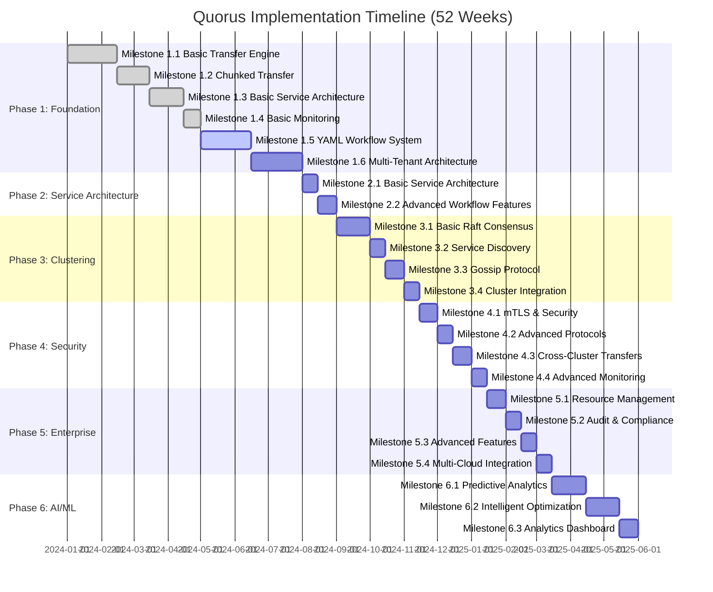

# Quorus Implementation Plan: Incremental Delivery Strategy

**Version:** 1.0
**Date:** 2025-01-27
**Author:** Mark Andrew Ray-Smith Cityline Ltd

## Overview

This implementation plan delivers Quorus functionality through proven, testable milestones. Each milestone builds upon the previous one, ensuring we have a working system at every stage that can be demonstrated, tested, and potentially deployed.

## Implementation Timeline



## Module Structure Strategy

### Phase 1 Approach: Single Module with Strategic Packaging

**Key Principles:**
- **Cohesion over Fragmentation**: Group related functionality together
- **Clear Boundaries**: Each package has well-defined responsibility
- **Minimal Dependencies**: Reduce coupling between packages
- **Future-Proof**: Structure accommodates the 5-phase roadmap
- **Testability**: Easy to unit test and integration test

**Single Module Structure:**
```
quorus/
├── src/main/java/dev/mars/quorus/
│   ├── core/           # Core domain models and interfaces
│   ├── transfer/       # Transfer engine implementation
│   ├── protocol/       # Transfer protocol implementations
│   ├── storage/        # File storage and persistence
│   ├── monitoring/     # Health checks and metrics
│   └── config/         # Configuration management
```

### Future Modularization (Phase 2+)

When clustering features are introduced (Phase 2), extract to multi-module structure:
```
quorus/
├── quorus-core/        # Core domain models
├── quorus-transfer/    # Transfer engine + protocols
├── quorus-cluster/     # Clustering functionality (Phase 2)
├── quorus-security/    # Security features (Phase 3)
└── quorus-analytics/   # AI/ML features (Phase 5)
```

**Migration Strategy:**
- Phase 1: Single module with clear package boundaries
- Phase 2: Extract core and transfer modules when adding clustering
- Phase 3+: Extract additional modules as features grow

## Phase 1: Foundation & Core Transfer (Weeks 1-8)

### Milestone 1.1: Basic Transfer Engine (Weeks 1-2)
**Goal:** Single-node file transfer with basic protocols

**Deliverables:**
- Simple HTTP/HTTPS file transfer
- Basic file integrity verification (SHA256)
- Transfer progress tracking
- Simple retry mechanism

**Success Criteria:**
- Transfer files up to 1GB successfully
- 99% transfer success rate in controlled environment
- Basic progress reporting (bytes transferred, ETA)

**Module Structure Decision:**
For Phase 1, we use a **single-module approach** with well-organized packages to prepare for future modularization:

**Rationale:**
- Milestone 1.1 scope doesn't justify multi-module complexity
- Faster development and easier refactoring
- Package structure prepares for future module extraction
- Simpler testing and integration

**Implementation Tasks:**
```java
// Package structure for single module
src/main/java/dev/mars/quorus/
├── core/                    # Core domain models and interfaces
│   ├── TransferJob.java
│   ├── TransferStatus.java
│   ├── TransferRequest.java
│   ├── TransferResult.java
│   └── exceptions/
├── transfer/                # Transfer engine implementation
│   ├── TransferEngine.java (interface)
│   ├── SimpleTransferEngine.java
│   ├── ProgressTracker.java
│   └── TransferContext.java
├── protocol/                # Transfer protocol implementations
│   ├── TransferProtocol.java (interface)
│   ├── HttpTransferProtocol.java
│   └── ProtocolFactory.java
├── storage/                 # File storage and persistence
│   ├── ChecksumCalculator.java
│   ├── FileManager.java
│   └── TransferStateRepository.java
├── monitoring/              # Health checks and metrics
│   ├── HealthCheck.java
│   └── MetricsCollector.java
└── config/                  # Configuration management
    └── QuorusConfiguration.java
```

**Tests:**
- Unit tests for all core classes
- Integration tests for HTTP transfers
- Performance tests with various file sizes
- Failure injection tests (network interruption)

### Milestone 1.2: Chunked Transfer with Resumability (Weeks 3-4)
**Goal:** Reliable transfer of large files with resume capability

**Deliverables:**
- Chunked file transfer (configurable chunk size)
- Transfer state persistence
- Resume interrupted transfers
- Parallel chunk processing

**Success Criteria:**
- Transfer files up to 10GB successfully
- Resume transfers after interruption with <1% data loss
- 50% improvement in large file transfer speed

### Milestone 1.3: Basic Service Architecture (Weeks 5-6)
**Goal:** Multi-component system with REST API

**Deliverables:**
- Transfer Controller REST API
- Transfer Agent service
- Basic service registration
- Job queue and scheduling

### Milestone 1.4: Basic Monitoring & Health Checks (Weeks 7-8)
**Goal:** Observability and system health monitoring

**Deliverables:**
- Health check endpoints
- Basic metrics collection
- Transfer progress API
- Simple web dashboard

### Milestone 1.5: YAML Workflow System (Weeks 9-12)
**Goal:** Implement declarative YAML-based workflows

**Deliverables:**
- YAML schema definition and validation
- Basic workflow engine with dependency resolution
- Variable substitution and templating
- Dry run and virtual run capabilities
- Transfer groups and workflow orchestration

**Success Criteria:**
- Parse and validate complex YAML workflow definitions
- Execute workflows with dependencies and conditional logic
- Dry run mode validates workflows without execution
- Virtual run mode simulates execution with mock data
- Support sequential, parallel, and mixed execution strategies

**Key Components:**
- `WorkflowDefinitionParser` - YAML parsing and validation
- `WorkflowEngine` - Workflow execution orchestration
- `DependencyResolver` - Dependency analysis and planning
- `VariableResolver` - Variable substitution and templating
- `ExecutionPlan` - Resolved execution plan
- `ValidationFramework` - YAML and semantic validation

### Milestone 1.6: Multi-Tenant Architecture (Weeks 13-16)
**Goal:** Enterprise-grade multi-tenancy with isolation and resource management

**Deliverables:**
- Multi-tenant configuration and isolation
- Tenant management APIs and hierarchy
- Resource quotas and usage tracking
- Cross-tenant security controls
- Tenant-aware workflow execution

**Success Criteria:**
- Support multiple tenants with complete data isolation
- Hierarchical tenant structure with configuration inheritance
- Resource quota enforcement and usage monitoring
- Cross-tenant operations with security controls
- Tenant-specific authentication and authorization

**Key Components:**
- `TenantService` - Tenant lifecycle management
- `ResourceManagementService` - Quota and usage tracking
- `TenantSecurityService` - Authentication and authorization
- `TenantAwareStorageService` - Storage isolation
- `MultiTenantWorkflowEngine` - Tenant-aware workflow execution

## Phase 2: Service Architecture & REST API (Weeks 17-20)

### Milestone 2.1: Basic Service Architecture (Weeks 17-18)
**Goal:** Transform into a service-oriented architecture with REST API

**Deliverables:**
- REST API for transfer operations
- Service discovery and health checks
- Basic authentication and authorization
- API documentation and client SDKs

**Success Criteria:**
- REST API handles 100 concurrent requests
- Service health monitoring operational
- API response time < 100ms for status queries
- Complete OpenAPI specification

### Milestone 2.2: Advanced Workflow Features (Weeks 19-20)
**Goal:** Enhanced workflow capabilities and enterprise features

**Deliverables:**
- Advanced dependency management
- Conditional execution and loops
- Workflow templates and reusability
- Enterprise governance features

## Phase 3: Clustering & High Availability (Weeks 21-28)

### Milestone 3.1: Basic Raft Consensus (Weeks 21-23)
**Goal:** Multi-node controller cluster with leader election

### Milestone 3.2: Service Discovery & Load Balancing (Weeks 24-25)
**Goal:** Dynamic service discovery and intelligent load balancing

### Milestone 3.3: Gossip Protocol & Failure Detection (Weeks 26-27)
**Goal:** Fast failure detection and cluster communication

### Milestone 3.4: Cluster Integration & Testing (Week 28)
**Goal:** Fully integrated cluster with comprehensive testing

## Phase 4: Security & Advanced Features (Weeks 29-36)

### Milestone 4.1: mTLS & Basic Security (Weeks 29-30)
**Goal:** Secure communication between all components

### Milestone 4.2: Advanced Transfer Protocols (Weeks 31-32)
**Goal:** Support for multiple transfer protocols and optimization

### Milestone 4.3: Cluster Peering & Cross-Cluster Transfers (Weeks 33-34)
**Goal:** Secure communication between clusters

### Milestone 4.4: Advanced Monitoring & Observability (Weeks 35-36)
**Goal:** Production-ready monitoring and observability

## Phase 5: Enterprise Features (Weeks 37-44)

### Milestone 5.1: Advanced Scheduling & Resource Management (Weeks 37-38)
### Milestone 5.2: Audit Logging & Compliance (Weeks 39-40)
### Milestone 5.3: Advanced Transfer Features (Weeks 41-42)
### Milestone 5.4: Multi-Cloud Integration (Weeks 43-44)

## Phase 6: AI/ML & Advanced Analytics (Weeks 45-52)

### Milestone 6.1: Predictive Analytics (Weeks 45-47)
### Milestone 6.2: Intelligent Optimization (Weeks 48-50)
### Milestone 6.3: Advanced Analytics Dashboard (Weeks 51-52)

## Testing Strategy

### Continuous Testing Approach
- **Unit Tests**: 90%+ code coverage for all components
- **Integration Tests**: End-to-end workflow testing
- **Performance Tests**: Load and stress testing at each milestone
- **Chaos Engineering**: Failure injection and resilience testing
- **Security Tests**: Penetration testing and vulnerability scanning

## Success Metrics

### Technical Metrics
- **Availability**: 99.9% uptime
- **Performance**: <5 second failover, >1GB/s transfer rates
- **Scalability**: Support 1000+ agents, 10,000+ concurrent transfers
- **Security**: Zero critical vulnerabilities

### Business Metrics
- **Time to Market**: Deliver MVP in 16 weeks
- **Feature Completeness**: 100% of planned features delivered
- **Quality**: <5% post-release defect rate
- **User Satisfaction**: >90% user satisfaction score

This implementation plan ensures that Quorus evolves incrementally with proven, testable functionality at each milestone, reducing risk and enabling early feedback and validation.
