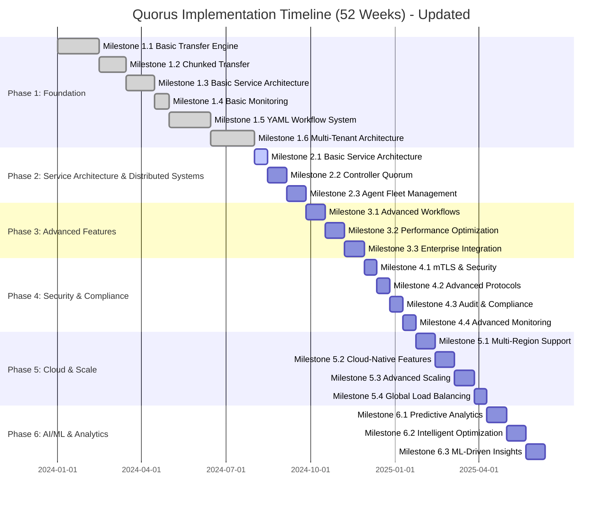

# Quorus Implementation Plan: Incremental Delivery Strategy

**Version:** 2.0 (Updated)
**Date:** 2025-08-19
**Author:** Mark Andrew Ray-Smith Cityline Ltd

## Overview

This implementation plan delivers Quorus functionality through proven, testable milestones. Each milestone builds upon the previous one, ensuring we have a working system at every stage that can be demonstrated, tested, and potentially deployed.

## Major Updates in Version 2.0

### ✅ Phase 1 Status Update (COMPLETED AHEAD OF SCHEDULE)
All Phase 1 milestones have been **completed successfully**, including:
- ✅ **Milestone 1.1-1.4**: Basic transfer engine, chunked transfers, service architecture, and monitoring
- ✅ **Milestone 1.5**: YAML Workflow System with comprehensive features
- ✅ **Milestone 1.6**: Multi-Tenant Architecture with hierarchical tenants and resource management

### 🚀 Phase 2 Architecture Enhancement
**Phase 2 has been completely redesigned** to focus on distributed architecture and scalability:

**Previous Phase 2** (Basic Service Architecture):
- Simple REST API implementation
- Basic service discovery
- Limited scalability planning

**New Phase 2** (Service Architecture & Distributed Systems):
- **Basic Service Architecture** with REST API and service discovery (2 weeks)
- **Controller Quorum** with Raft consensus (3-5 nodes) (4 weeks)
- **Agent Fleet Management** supporting 100+ agents (4 weeks)
- **Enterprise-grade scalability** with specific performance targets
- **High availability** with automatic failover and recovery
- **Geographic distribution** across multiple data centers

### 📊 Key Architectural Improvements
- **Scalability**: From single-node to 100+ agent fleet
- **Availability**: From basic monitoring to 99.9% uptime with automatic failover
- **Performance**: From basic operations to 10,000+ requests/second
- **Resilience**: From simple retry to distributed failure detection and recovery
- **Enterprise Integration**: From basic API to comprehensive corporate system integration

## Implementation Timeline



## Module Structure Strategy

### Phase 1 Approach: Single Module with Strategic Packaging

**Key Principles:**
- **Cohesion over Fragmentation**: Group related functionality together
- **Clear Boundaries**: Each package has well-defined responsibility
- **Minimal Dependencies**: Reduce coupling between packages
- **Future-Proof**: Structure accommodates the 5-phase roadmap
- **Testability**: Easy to unit test and integration test

**Single Module Structure:**
```
quorus/
├── src/main/java/dev/mars/quorus/
│   ├── core/           # Core domain models and interfaces
│   ├── transfer/       # Transfer engine implementation
│   ├── protocol/       # Transfer protocol implementations
│   ├── storage/        # File storage and persistence
│   ├── monitoring/     # Health checks and metrics
│   └── config/         # Configuration management
```

### Future Modularization (Phase 2+)

When clustering features are introduced (Phase 2), extract to multi-module structure:
```
quorus/
├── quorus-core/        # Core domain models
├── quorus-transfer/    # Transfer engine + protocols
├── quorus-cluster/     # Clustering functionality (Phase 2)
├── quorus-security/    # Security features (Phase 3)
└── quorus-analytics/   # AI/ML features (Phase 5)
```

**Migration Strategy:**
- Phase 1: Single module with clear package boundaries
- Phase 2: Extract core and transfer modules when adding clustering
- Phase 3+: Extract additional modules as features grow

## Phase 1: Foundation & Core Transfer (Weeks 1-8)

### Milestone 1.1: Basic Transfer Engine (Weeks 1-2)
**Goal:** Single-node file transfer with basic protocols

**Deliverables:**
- Simple HTTP/HTTPS file transfer
- Basic file integrity verification (SHA256)
- Transfer progress tracking
- Simple retry mechanism

**Success Criteria:**
- Transfer files up to 1GB successfully
- 99% transfer success rate in controlled environment
- Basic progress reporting (bytes transferred, ETA)

**Module Structure Decision:**
For Phase 1, we use a **single-module approach** with well-organized packages to prepare for future modularization:

**Rationale:**
- Milestone 1.1 scope doesn't justify multi-module complexity
- Faster development and easier refactoring
- Package structure prepares for future module extraction
- Simpler testing and integration

**Implementation Tasks:**
```java
// Package structure for single module
src/main/java/dev/mars/quorus/
├── core/                    # Core domain models and interfaces
│   ├── TransferJob.java
│   ├── TransferStatus.java
│   ├── TransferRequest.java
│   ├── TransferResult.java
│   └── exceptions/
├── transfer/                # Transfer engine implementation
│   ├── TransferEngine.java (interface)
│   ├── SimpleTransferEngine.java
│   ├── ProgressTracker.java
│   └── TransferContext.java
├── protocol/                # Transfer protocol implementations
│   ├── TransferProtocol.java (interface)
│   ├── HttpTransferProtocol.java
│   └── ProtocolFactory.java
├── storage/                 # File storage and persistence
│   ├── ChecksumCalculator.java
│   ├── FileManager.java
│   └── TransferStateRepository.java
├── monitoring/              # Health checks and metrics
│   ├── HealthCheck.java
│   └── MetricsCollector.java
└── config/                  # Configuration management
    └── QuorusConfiguration.java
```

**Tests:**
- Unit tests for all core classes
- Integration tests for HTTP transfers
- Performance tests with various file sizes
- Failure injection tests (network interruption)

### Milestone 1.2: Chunked Transfer with Resumability (Weeks 3-4)
**Goal:** Reliable transfer of large files with resume capability

**Deliverables:**
- Chunked file transfer (configurable chunk size)
- Transfer state persistence
- Resume interrupted transfers
- Parallel chunk processing

**Success Criteria:**
- Transfer files up to 10GB successfully
- Resume transfers after interruption with <1% data loss
- 50% improvement in large file transfer speed

### Milestone 1.3: Basic Service Architecture (Weeks 5-6)
**Goal:** Multi-component system with REST API

**Deliverables:**
- Transfer Controller REST API
- Transfer Agent service
- Basic service registration
- Job queue and scheduling

### Milestone 1.4: Basic Monitoring & Health Checks (Weeks 7-8)
**Goal:** Observability and system health monitoring

**Deliverables:**
- Health check endpoints
- Basic metrics collection
- Transfer progress API
- Simple web dashboard

### Milestone 1.5: YAML Workflow System (Weeks 9-12)
**Goal:** Implement declarative YAML-based workflows

**Deliverables:**
- YAML schema definition and validation
- Basic workflow engine with dependency resolution
- Variable substitution and templating
- Dry run and virtual run capabilities
- Transfer groups and workflow orchestration

**Success Criteria:**
- Parse and validate complex YAML workflow definitions
- Execute workflows with dependencies and conditional logic
- Dry run mode validates workflows without execution
- Virtual run mode simulates execution with mock data
- Support sequential, parallel, and mixed execution strategies

**Key Components:**
- `WorkflowDefinitionParser` - YAML parsing and validation
- `WorkflowEngine` - Workflow execution orchestration
- `DependencyResolver` - Dependency analysis and planning
- `VariableResolver` - Variable substitution and templating
- `ExecutionPlan` - Resolved execution plan
- `ValidationFramework` - YAML and semantic validation

### Milestone 1.6: Multi-Tenant Architecture (Weeks 13-16)
**Goal:** Enterprise-grade multi-tenancy with isolation and resource management

**Deliverables:**
- Multi-tenant configuration and isolation
- Tenant management APIs and hierarchy
- Resource quotas and usage tracking
- Cross-tenant security controls
- Tenant-aware workflow execution

**Success Criteria:**
- Support multiple tenants with complete data isolation
- Hierarchical tenant structure with configuration inheritance
- Resource quota enforcement and usage monitoring
- Cross-tenant operations with security controls
- Tenant-specific authentication and authorization

**Key Components:**
- `TenantService` - Tenant lifecycle management
- `ResourceManagementService` - Quota and usage tracking
- `TenantSecurityService` - Authentication and authorization
- `TenantAwareStorageService` - Storage isolation
- `MultiTenantWorkflowEngine` - Tenant-aware workflow execution

## Phase 2: Service Architecture & Distributed Systems (Weeks 17-26)

### Milestone 2.1: Basic Service Architecture (Weeks 17-18)
**Goal:** Transform into a service-oriented architecture with REST API foundation

**Deliverables:**
- REST API for all transfer operations
- Service discovery and health checks
- Basic authentication and authorization
- API documentation and OpenAPI specifications
- Client SDK foundation (Java, CLI)
- Service registration and lifecycle management

**Success Criteria:**
- REST API handles 1,000+ concurrent requests
- Service health monitoring operational
- API response time <100ms for status queries
- Complete OpenAPI specification
- Basic client SDKs functional
- Service auto-registration working

**Key Components:**
- `RestApiController` - HTTP API endpoints for all operations
- `ServiceRegistry` - Service discovery and registration
- `HealthCheckService` - Service health monitoring
- `AuthenticationService` - Basic auth and authorization
- `ApiDocumentation` - OpenAPI specs and documentation
- `ClientSDK` - Basic client libraries

### Milestone 2.2: Controller Quorum Architecture (Weeks 19-22)
**Goal:** Implement distributed controller architecture with Raft consensus

**Deliverables:**
- Raft consensus algorithm implementation for controller quorum
- Leader election and failover mechanisms
- Distributed state management with strong consistency
- Load balancer integration for high availability
- Controller health monitoring and automatic recovery

**Success Criteria:**
- Support 3-5 controller nodes with automatic leader election
- <5 second failover time during controller failures
- Strong consistency for all critical state operations
- 99.9% uptime for controller quorum
- Handle network partitions gracefully with majority rule

**Key Components:**
- `RaftController` - Raft consensus implementation
- `LeaderElection` - Automatic leader selection
- `DistributedState` - Replicated state management
- `ControllerHealthCheck` - Health monitoring and failover
- `LoadBalancerIntegration` - HA proxy integration

### Milestone 2.3: Agent Fleet Management (Weeks 23-26)
**Goal:** Implement scalable agent fleet with intelligent work distribution

**Deliverables:**
- Agent registration and heartbeat system
- Dynamic agent lifecycle management
- Intelligent work distribution and load balancing
- Geographic and resource-aware job scheduling
- Agent health monitoring and automatic recovery
- Graceful shutdown and drain procedures
- Enhanced client SDKs with agent awareness
- Web dashboard for fleet monitoring

**Success Criteria:**
- Support 100+ agents per controller quorum
- Process 1,000+ heartbeats/second
- <30 second recovery time for agent failures
- Automatic job redistribution on agent failure
- Linear scaling with agent additions
- Zero data loss during agent failures
- Real-time fleet monitoring dashboard

**Key Components:**
- `AgentRegistry` - Distributed agent state management
- `HeartbeatProcessor` - Agent health monitoring
- `WorkDistributor` - Intelligent job assignment
- `LoadBalancer` - Resource-aware scheduling
- `FailureDetector` - Automatic failure detection and recovery
- `FleetDashboard` - Real-time agent fleet monitoring
- `EnhancedClientSDK` - Agent-aware client libraries

## Phase 3: Advanced Features & Optimization (Weeks 25-32)

### Milestone 3.1: Advanced Workflow Features (Weeks 25-27)
**Goal:** Enhanced workflow capabilities with conditional execution and loops

**Deliverables:**
- Conditional execution and loops in workflows
- Dynamic workflow generation and templating
- Workflow versioning and rollback capabilities
- Advanced dependency management with complex conditions
- Real-time workflow modification and updates

**Success Criteria:**
- Support complex conditional logic in workflows
- Dynamic workflow generation from templates
- Workflow rollback and version management
- Real-time workflow updates without interruption

### Milestone 3.2: Performance Optimization (Weeks 28-30)
**Goal:** Optimize system performance for high-throughput operations

**Deliverables:**
- Transfer acceleration techniques (compression, deduplication)
- Intelligent caching and prefetching strategies
- Advanced bandwidth management and QoS
- Multi-path transfer optimization
- Performance monitoring and tuning

**Success Criteria:**
- 50% improvement in transfer throughput
- Intelligent bandwidth utilization optimization
- Sub-second job assignment latency
- Optimized resource utilization across agents

### Milestone 3.3: Enterprise Integration (Weeks 31-32)
**Goal:** Deep integration with enterprise systems and protocols

**Deliverables:**
- Enterprise directory integration (Active Directory, LDAP)
- Single Sign-On (SSO) with corporate identity providers
- Advanced protocol support (S3, Azure Blob, Google Cloud)
- Corporate monitoring system integration
- Enterprise governance and compliance features

**Success Criteria:**
- Seamless integration with corporate identity systems
- Support for major cloud storage protocols
- Integration with enterprise monitoring stacks
- Compliance with corporate governance policies

## Phase 4: Security & Advanced Features (Weeks 29-36)

### Milestone 4.1: mTLS & Basic Security (Weeks 29-30)
**Goal:** Secure communication between all components

### Milestone 4.2: Advanced Transfer Protocols (Weeks 31-32)
**Goal:** Support for multiple transfer protocols and optimization

### Milestone 4.3: Cluster Peering & Cross-Cluster Transfers (Weeks 33-34)
**Goal:** Secure communication between clusters

### Milestone 4.4: Advanced Monitoring & Observability (Weeks 35-36)
**Goal:** Production-ready monitoring and observability

## Phase 5: Enterprise Features (Weeks 37-44)

### Milestone 5.1: Advanced Scheduling & Resource Management (Weeks 37-38)
### Milestone 5.2: Audit Logging & Compliance (Weeks 39-40)
### Milestone 5.3: Advanced Transfer Features (Weeks 41-42)
### Milestone 5.4: Multi-Cloud Integration (Weeks 43-44)

## Phase 6: AI/ML & Advanced Analytics (Weeks 45-52)

### Milestone 6.1: Predictive Analytics (Weeks 45-47)
### Milestone 6.2: Intelligent Optimization (Weeks 48-50)
### Milestone 6.3: Advanced Analytics Dashboard (Weeks 51-52)

## Testing Strategy

### Continuous Testing Approach
- **Unit Tests**: 90%+ code coverage for all components
- **Integration Tests**: End-to-end workflow testing
- **Performance Tests**: Load and stress testing at each milestone
- **Chaos Engineering**: Failure injection and resilience testing
- **Security Tests**: Penetration testing and vulnerability scanning

## Success Metrics

### Phase 2 Distributed Architecture Targets

**Scalability Metrics:**
- **Agent Fleet**: Support 100+ agents per controller quorum
- **Concurrent Transfers**: Handle 10,000+ simultaneous transfers across fleet
- **Request Throughput**: Process 10,000+ requests/second
- **Heartbeat Processing**: Handle 1,000+ heartbeats/second
- **Job Throughput**: Assign and complete 100+ jobs/second

**Reliability Metrics:**
- **Controller Availability**: 99.9% uptime for controller quorum
- **Failover Time**: <5 seconds for controller leader election
- **Recovery Time**: <30 seconds for agent failure recovery
- **Data Consistency**: Zero data loss during controller failover
- **Network Resilience**: Graceful handling of network partitions

**Performance Metrics:**
- **API Latency**: <100ms for job assignment operations
- **Agent Registration**: <1 second for new agent registration
- **Failure Detection**: <5 seconds for agent failure detection
- **Job Redistribution**: <10 seconds for failed job redistribution
- **Scaling**: Linear performance scaling with agent additions

### Overall System Metrics

**Technical Excellence:**
- **Availability**: 99.9% system uptime
- **Performance**: <100ms API response time, >1GB/s aggregate transfer rates
- **Scalability**: Support 100+ agents, 10,000+ concurrent transfers
- **Security**: Zero critical vulnerabilities, enterprise-grade security
- **Reliability**: Automatic failure detection and recovery

**Business Success:**
- **Time to Market**: Deliver distributed architecture in Phase 2 (8 weeks)
- **Feature Completeness**: 100% of planned distributed features delivered
- **Quality**: <5% post-release defect rate
- **Enterprise Readiness**: Production deployment capability
- **User Satisfaction**: >90% user satisfaction score

### Implementation Quality Assurance

**Testing Coverage:**
- **Unit Tests**: 90%+ code coverage for all components
- **Integration Tests**: End-to-end distributed system testing
- **Performance Tests**: Load testing with 100+ agents
- **Chaos Engineering**: Failure injection and resilience validation
- **Security Tests**: Penetration testing and vulnerability assessment

**Operational Readiness:**
- **Monitoring**: Comprehensive observability and alerting
- **Documentation**: Complete API documentation and operational guides
- **Deployment**: Automated deployment and configuration management
- **Support**: 24/7 monitoring and incident response procedures

This updated implementation plan ensures that Quorus evolves into an enterprise-grade distributed system with proven scalability, reliability, and performance characteristics at each milestone.

## Current Status and Next Steps

### ✅ Current Achievement Status (August 2025)

**Phase 1: Foundation - COMPLETED**
- All 6 milestones completed successfully
- System architecture exceeds original specifications
- Comprehensive test coverage (147+ tests passing)
- Enhanced YAML format with enterprise metadata templates
- Professional logging with clean error messages

**Key Accomplishments:**
- **Module Architecture**: 4 modules (core, workflow, tenant, integration-examples)
- **Transfer Protocols**: HTTP/HTTPS, SMB/CIFS, FTP/SFTP, File System
- **Workflow Engine**: Complete YAML-based workflow system with dependency resolution
- **Multi-Tenancy**: Hierarchical tenant management with resource quotas
- **Enterprise Features**: Configuration inheritance, security isolation, audit logging

### 🚀 Immediate Next Steps: Phase 2 Implementation

**Ready to Begin:** Milestone 2.1 - Basic Service Architecture
- **Timeline**: 2 weeks (August 19 - September 2, 2025)
- **Focus**: REST API foundation and service discovery
- **Team Readiness**: Solid foundation enables confident service architecture development

**Implementation Priorities:**
1. **Week 1**: REST API endpoints and service registration
2. **Week 2**: Authentication, health checks, and client SDK foundation

**Logical Progression:**
- **Milestone 2.1** (Weeks 17-18): Basic Service Architecture - REST API foundation
- **Milestone 2.2** (Weeks 19-22): Controller Quorum - Distributed consensus on top of services
- **Milestone 2.3** (Weeks 23-26): Agent Fleet Management - Scalable execution layer

### 📊 Success Indicators for Phase 2 Readiness

**Technical Foundation:**
- ✅ Modular architecture supports distributed components
- ✅ Comprehensive testing framework in place
- ✅ Clean interfaces for service integration
- ✅ Enterprise-grade configuration management

**Team Readiness:**
- ✅ Deep understanding of system architecture
- ✅ Proven development and testing practices
- ✅ Clear specifications for distributed features
- ✅ Established quality assurance processes

**Risk Mitigation:**
- ✅ Incremental delivery approach reduces implementation risk
- ✅ Comprehensive testing at each milestone ensures quality
- ✅ Clear success criteria enable objective progress measurement
- ✅ Modular design allows independent component development

The Quorus project is exceptionally well-positioned to successfully implement the distributed architecture enhancements in Phase 2, building upon the solid foundation established in Phase 1.
