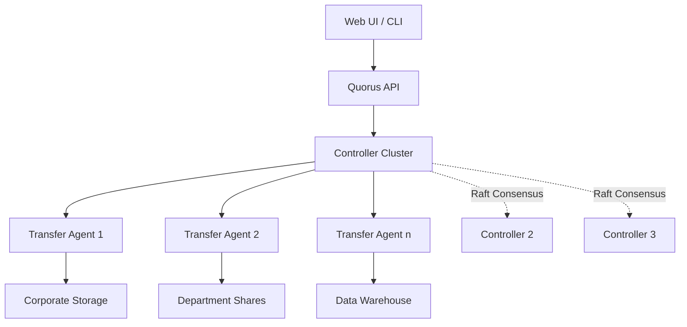
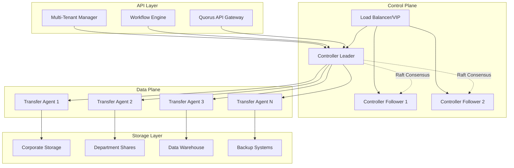
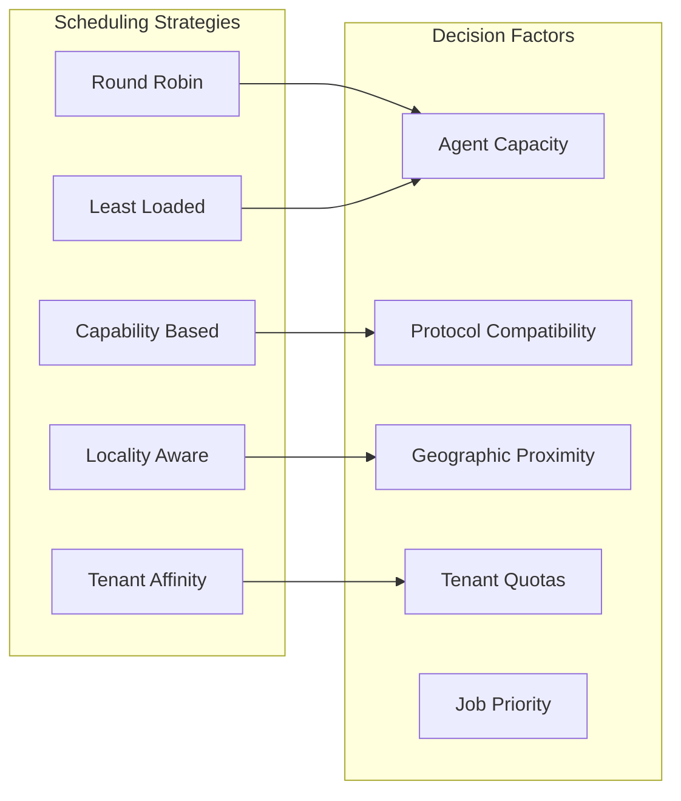
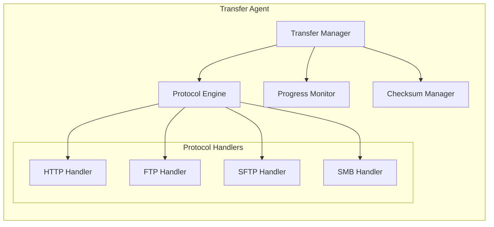
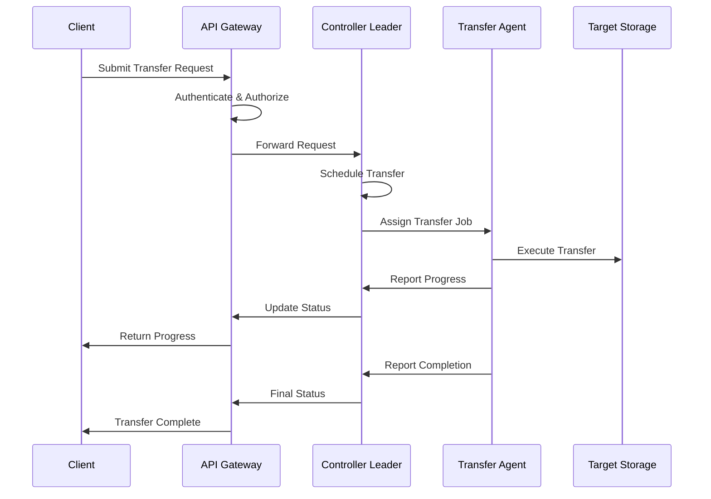
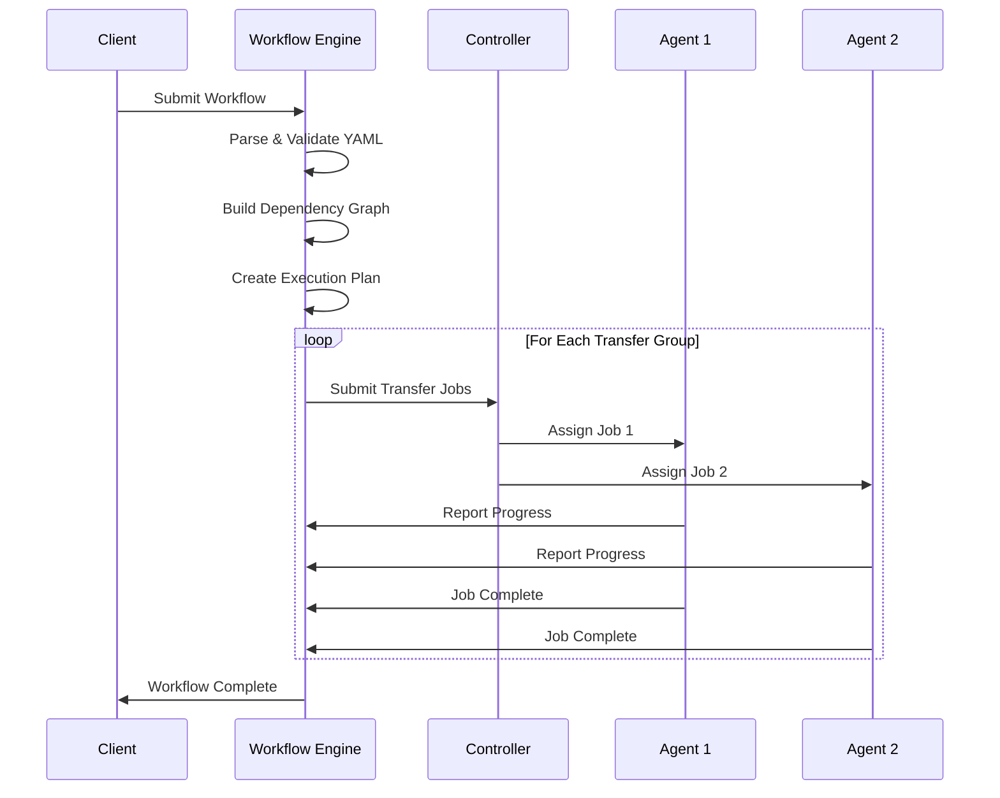
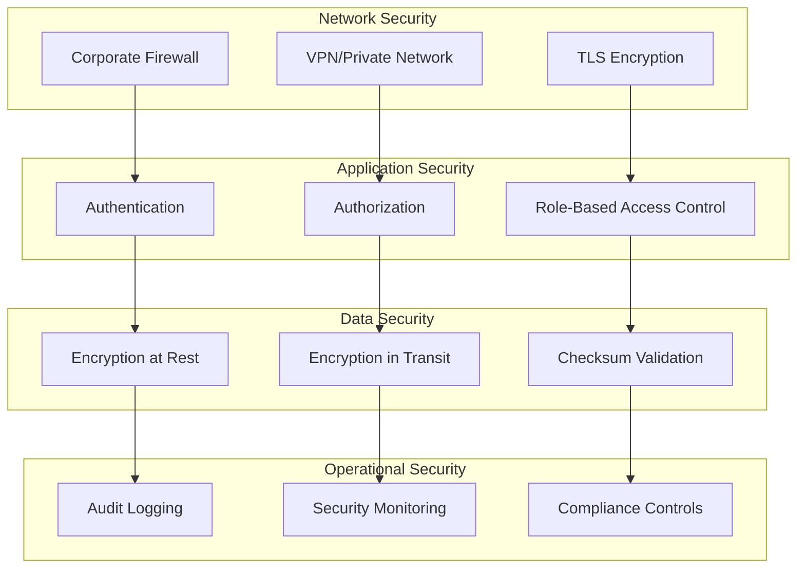
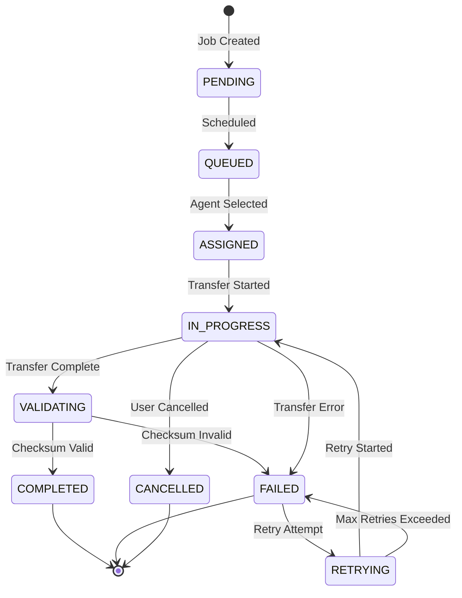
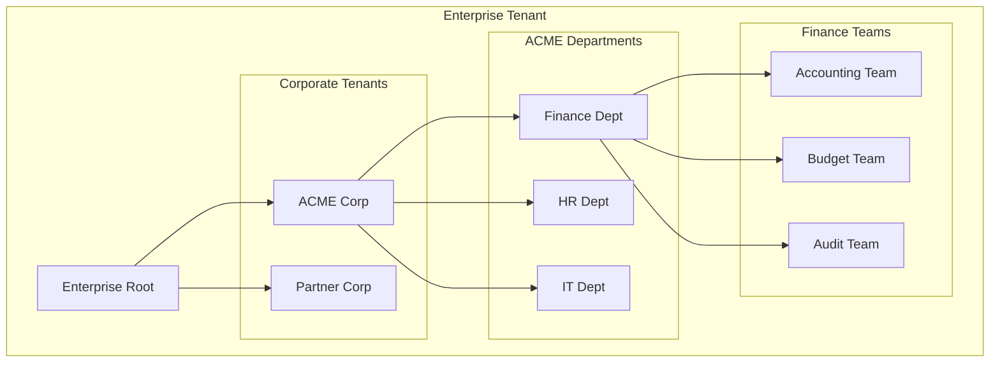
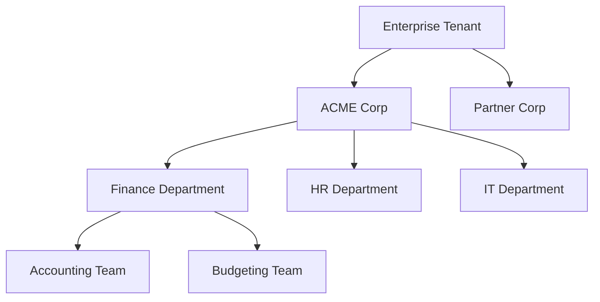

# Quorus User Guide

**Version:** 1.0
**Date:** 2025-04-14
**Author:** Mark Andrew Ray-Smith Cityline Ltd


## Table of Contents

1. [Introduction](#introduction)
2. [System Architecture & Design](#system-architecture--design)
3. [Core Functional Concepts](#core-functional-concepts)
4. [Getting Started](#getting-started)
5. [Basic File Transfers](#basic-file-transfers)
6. [YAML Workflows](#yaml-workflows)
7. [Multi-Tenant Operations](#multi-tenant-operations)
8. [REST API Usage](#rest-api-usage)
9. [Administration Guide](#administration-guide)
10. [Troubleshooting](#troubleshooting)
11. [Best Practices](#best-practices)

## Introduction

Quorus is an enterprise-grade file transfer system designed for internal corporate networks. It provides secure, reliable, and scalable file transfer capabilities with advanced workflow orchestration and multi-tenant support.

### Key Features

- **Secure File Transfers**: HTTP/HTTPS, FTP, SFTP, SMB protocols
- **YAML Workflows**: Declarative workflow definitions with complex dependencies
- **Multi-Tenant Architecture**: Hierarchical tenant isolation and resource management
- **High Availability**: Raft consensus clustering with automatic failover
- **Progress Tracking**: Real-time transfer monitoring with ETA calculations
- **Enterprise Integration**: Corporate directory, SSO, and compliance support

### System Architecture



## System Architecture & Design

### Distributed System Architecture

Quorus is built as a **distributed, fault-tolerant system** designed for enterprise-scale file transfer operations. The architecture follows microservices principles with clear separation of concerns and horizontal scalability.

#### Core Components



#### 1. Controller Cluster (Control Plane)

The **Controller Cluster** provides centralized coordination and state management using the Raft consensus algorithm. It serves as the brain of the Quorus system, making all critical decisions and maintaining global state consistency across the distributed infrastructure.

##### Key Responsibilities

**Job Scheduling: Assigns transfer jobs to available agents**

The Job Scheduler is responsible for intelligent assignment of transfer jobs to the most appropriate agents in the fleet:

```java
public class JobScheduler {
    // Scheduling strategies
    public enum SchedulingStrategy {
        ROUND_ROBIN,        // Simple round-robin assignment
        LEAST_LOADED,       // Assign to agent with lowest current load
        CAPABILITY_BASED,   // Match job requirements to agent capabilities
        LOCALITY_AWARE,     // Prefer agents closer to source/destination
        TENANT_AFFINITY     // Prefer agents dedicated to specific tenants
    }

    // Scheduling decision factors
    private SchedulingDecision scheduleJob(TransferJob job) {
        List<Agent> candidateAgents = findEligibleAgents(job);

        // Filter by capabilities
        candidateAgents = filterByCapabilities(candidateAgents, job.getRequiredCapabilities());

        // Filter by tenant quotas
        candidateAgents = filterByTenantQuotas(candidateAgents, job.getTenant());

        // Apply scheduling strategy
        Agent selectedAgent = applySchedulingStrategy(candidateAgents, job);

        return new SchedulingDecision(selectedAgent, job, calculatePriority(job));
    }
}
```

**Scheduling Factors:**
- **Agent Capacity**: Current load, available bandwidth, concurrent transfer limits
- **Protocol Compatibility**: Agent must support the required transfer protocol
- **Geographic Proximity**: Network latency and bandwidth between agent and endpoints
- **Tenant Affinity**: Some agents may be dedicated to specific tenants
- **Resource Quotas**: Ensure tenant quotas are not exceeded
- **Job Priority**: High-priority jobs get preferential scheduling
- **Failure History**: Avoid agents with recent failures for the same job type

**Load Balancing Algorithms:**


**State Management: Maintains cluster-wide state consistency**

The State Management system ensures all controllers have a consistent view of the system state:

```java
public class ClusterStateManager {
    // Core state components
    private final Map<String, Agent> registeredAgents;
    private final Map<String, TransferJob> activeJobs;
    private final Map<String, WorkflowExecution> runningWorkflows;
    private final Map<String, TenantConfiguration> tenantConfigs;
    private final Map<String, ResourceUsage> resourceUsage;

    // State synchronization
    public void applyStateChange(StateChangeEvent event) {
        // Apply change locally
        applyChangeLocally(event);

        // Replicate to followers via Raft
        raftNode.appendEntry(event);

        // Update state version
        incrementStateVersion();

        // Notify state change listeners
        notifyStateChangeListeners(event);
    }

    // State consistency checks
    public StateConsistencyReport checkConsistency() {
        return StateConsistencyReport.builder()
            .agentCount(registeredAgents.size())
            .activeJobCount(activeJobs.size())
            .workflowCount(runningWorkflows.size())
            .stateVersion(getCurrentStateVersion())
            .lastUpdateTime(getLastUpdateTime())
            .build();
    }
}
```

**State Components:**
- **Agent Registry**: All registered agents with their capabilities and status
- **Job Queue**: Pending, active, and completed transfer jobs
- **Workflow State**: Current state of all running workflows
- **Tenant Configuration**: Multi-tenant settings and quotas
- **Resource Usage**: Real-time resource consumption tracking
- **System Metadata**: Configuration, policies, and operational parameters

**State Consistency Guarantees:**
- **Strong Consistency**: All reads return the most recent write
- **Linearizability**: Operations appear to execute atomically
- **Durability**: State changes are persisted and survive failures
- **Partition Tolerance**: System remains consistent during network partitions

**Agent Fleet Management: Monitors and manages transfer agents**

The Agent Fleet Manager maintains a real-time view of all transfer agents and their health:

```java
public class AgentFleetManager {
    // Agent lifecycle management
    public void registerAgent(AgentRegistration registration) {
        Agent agent = createAgentFromRegistration(registration);

        // Validate agent capabilities
        validateAgentCapabilities(agent);

        // Add to fleet
        agentRegistry.register(agent);

        // Start health monitoring
        healthMonitor.startMonitoring(agent);

        // Notify scheduling system
        jobScheduler.onAgentAdded(agent);

        logger.info("Agent registered: {} with capabilities: {}",
                   agent.getId(), agent.getCapabilities());
    }

    // Health monitoring
    public void processHealthReport(String agentId, HealthReport report) {
        Agent agent = agentRegistry.getAgent(agentId);

        // Update agent status
        agent.updateHealth(report);

        // Check for degraded performance
        if (report.getPerformanceScore() < DEGRADED_THRESHOLD) {
            handleDegradedAgent(agent);
        }

        // Check for failure conditions
        if (report.getStatus() == AgentStatus.FAILED) {
            handleFailedAgent(agent);
        }

        // Update load balancing weights
        loadBalancer.updateAgentWeight(agentId, report.getCapacityScore());
    }
}
```

**Agent Monitoring Metrics:**
- **Health Status**: Online, degraded, offline, failed
- **Performance Metrics**: CPU usage, memory usage, network utilization
- **Transfer Statistics**: Active transfers, success rate, average duration
- **Capacity Metrics**: Available bandwidth, concurrent transfer slots
- **Error Rates**: Failed transfers, timeout rates, retry frequencies

**Fleet Management Operations:**
- **Auto-scaling**: Automatically add/remove agents based on demand
- **Load Redistribution**: Move jobs from overloaded to underutilized agents
- **Maintenance Mode**: Gracefully drain agents for maintenance
- **Failure Recovery**: Reassign jobs from failed agents to healthy ones

**Workflow Orchestration: Coordinates complex multi-step workflows**

The Workflow Orchestrator manages the execution of complex, multi-step transfer workflows:

```java
public class WorkflowOrchestrator {
    // Workflow execution engine
    public String executeWorkflow(WorkflowDefinition definition, ExecutionContext context) {
        // Parse and validate workflow
        WorkflowExecutionPlan plan = createExecutionPlan(definition);

        // Create execution instance
        WorkflowExecution execution = new WorkflowExecution(
            generateExecutionId(),
            definition,
            context,
            plan
        );

        // Start execution
        return startExecution(execution);
    }

    // Dependency resolution and execution planning
    private WorkflowExecutionPlan createExecutionPlan(WorkflowDefinition definition) {
        // Build dependency graph
        DependencyGraph graph = dependencyResolver.buildGraph(definition);

        // Check for circular dependencies
        if (graph.hasCycles()) {
            throw new WorkflowValidationException("Circular dependencies detected");
        }

        // Create execution stages
        List<ExecutionStage> stages = graph.topologicalSort()
            .stream()
            .map(this::createExecutionStage)
            .collect(Collectors.toList());

        return new WorkflowExecutionPlan(stages);
    }
}
```

**Workflow Execution Phases:**
1. **Parsing & Validation**: YAML parsing, schema validation, dependency analysis
2. **Planning**: Dependency resolution, execution stage creation, resource allocation
3. **Execution**: Stage-by-stage execution with progress tracking
4. **Monitoring**: Real-time status updates and error handling
5. **Completion**: Final status determination and cleanup

**Orchestration Features:**
- **Dependency Management**: Complex dependency graphs with parallel execution
- **Conditional Execution**: Execute stages based on runtime conditions
- **Error Handling**: Configurable error handling strategies (fail-fast, continue-on-error)
- **Progress Tracking**: Real-time workflow and stage-level progress
- **Resource Management**: Ensure workflows don't exceed tenant quotas

**Resource Allocation: Manages tenant quotas and resource distribution**

The Resource Allocator ensures fair distribution of system resources across tenants:

```java
public class ResourceAllocator {
    // Quota enforcement
    public boolean checkQuotaAvailability(String tenantId, ResourceType resourceType, long requestedAmount) {
        TenantQuota quota = quotaManager.getQuota(tenantId, resourceType);
        ResourceUsage currentUsage = usageTracker.getCurrentUsage(tenantId, resourceType);

        long availableQuota = quota.getLimit() - currentUsage.getAmount();

        if (requestedAmount > availableQuota) {
            // Check for burst capacity
            if (quota.hasBurstCapacity() && requestedAmount <= quota.getBurstLimit()) {
                return authorizeBurstUsage(tenantId, resourceType, requestedAmount);
            }
            return false;
        }

        return true;
    }

    // Resource reservation
    public ResourceReservation reserveResources(String tenantId, ResourceRequest request) {
        // Check quota availability
        if (!checkQuotaAvailability(tenantId, request.getResourceType(), request.getAmount())) {
            throw new QuotaExceededException("Insufficient quota for tenant: " + tenantId);
        }

        // Reserve resources
        ResourceReservation reservation = createReservation(tenantId, request);
        reservationManager.addReservation(reservation);

        // Update usage tracking
        usageTracker.recordReservation(reservation);

        return reservation;
    }
}
```

**Resource Types Managed:**
- **Compute Resources**: CPU cores, memory allocation for processing
- **Network Resources**: Bandwidth allocation, concurrent connections
- **Storage Resources**: Storage quotas, file count limits
- **Transfer Resources**: Concurrent transfers, transfer volume limits
- **API Resources**: Request rate limits, workflow execution limits

##### Raft Consensus Implementation

**Leader Election: Automatic leader selection with (N-1)/2 fault tolerance**

The Raft leader election ensures exactly one leader exists at any time:

```java
public class RaftLeaderElection {
    // Election process
    public void startElection() {
        currentTerm++;
        state = NodeState.CANDIDATE;
        votedFor = nodeId;

        // Vote for self
        int votes = 1;

        // Request votes from other nodes
        for (String nodeId : clusterNodes) {
            if (!nodeId.equals(this.nodeId)) {
                CompletableFuture<VoteResponse> voteResponse =
                    sendVoteRequest(nodeId, currentTerm, lastLogIndex, lastLogTerm);

                voteResponse.thenAccept(response -> {
                    if (response.isVoteGranted()) {
                        votes++;
                        if (votes > clusterSize / 2) {
                            becomeLeader();
                        }
                    }
                });
            }
        }
    }

    // Leader responsibilities
    private void becomeLeader() {
        state = NodeState.LEADER;

        // Initialize leader state
        initializeLeaderState();

        // Start sending heartbeats
        startHeartbeats();

        // Begin processing client requests
        enableClientRequestProcessing();

        logger.info("Node {} became leader for term {}", nodeId, currentTerm);
    }
}
```

**Election Triggers:**
- **Startup**: When a node starts and no leader exists
- **Leader Failure**: When followers stop receiving heartbeats
- **Network Partition**: When a partition loses contact with the leader
- **Manual Trigger**: Administrative command to force re-election

**Election Guarantees:**
- **Safety**: At most one leader per term
- **Liveness**: Eventually a leader will be elected
- **Fault Tolerance**: Tolerates (N-1)/2 node failures
- **Network Partition**: Majority partition can elect a leader

**Log Replication: Ensures all state changes are consistently replicated**

The Raft log replication mechanism ensures all state changes are durably stored and consistently applied:

```java
public class RaftLogReplication {
    // Append entries to followers
    public void replicateEntry(LogEntry entry) {
        // Add entry to local log
        log.append(entry);

        // Replicate to all followers
        for (String followerId : followers) {
            CompletableFuture<AppendEntriesResponse> response =
                sendAppendEntries(followerId, entry);

            response.thenAccept(resp -> {
                if (resp.isSuccess()) {
                    updateFollowerProgress(followerId, entry.getIndex());
                } else {
                    handleReplicationFailure(followerId, resp);
                }
            });
        }
    }

    // Commit entries when majority acknowledges
    private void checkForCommit() {
        for (long index = commitIndex + 1; index <= log.getLastIndex(); index++) {
            int acknowledgments = 1; // Leader counts as acknowledgment

            for (String followerId : followers) {
                if (getFollowerMatchIndex(followerId) >= index) {
                    acknowledgments++;
                }
            }

            // Commit if majority acknowledges
            if (acknowledgments > clusterSize / 2) {
                commitIndex = index;
                applyToStateMachine(log.getEntry(index));
            }
        }
    }
}
```

**Replication Process:**
1. **Entry Creation**: Leader creates log entry for state change
2. **Parallel Replication**: Send entry to all followers simultaneously
3. **Acknowledgment Collection**: Wait for majority acknowledgment
4. **Commit Decision**: Commit entry when majority acknowledges
5. **State Application**: Apply committed entry to state machine
6. **Client Response**: Respond to client after successful commit

**Replication Guarantees:**
- **Durability**: Committed entries survive node failures
- **Consistency**: All nodes apply entries in the same order
- **Majority Agreement**: Entries committed only with majority consent
- **Monotonicity**: Log entries are never removed or reordered

**Split-Brain Prevention: Quorum-based decision making prevents inconsistencies**

Raft prevents split-brain scenarios through strict quorum requirements:

```java
public class QuorumManager {
    // Quorum calculation
    public boolean hasQuorum(Set<String> availableNodes) {
        int requiredQuorum = (clusterSize / 2) + 1;
        return availableNodes.size() >= requiredQuorum;
    }

    // Leadership validation
    public boolean canMaintainLeadership() {
        Set<String> reachableNodes = getReachableNodes();
        reachableNodes.add(nodeId); // Include self

        if (!hasQuorum(reachableNodes)) {
            // Step down as leader
            stepDownAsLeader();
            return false;
        }

        return true;
    }

    // Split-brain detection
    public void detectSplitBrain() {
        if (state == NodeState.LEADER) {
            // Continuously verify quorum
            if (!canMaintainLeadership()) {
                logger.warn("Lost quorum, stepping down as leader");
                state = NodeState.FOLLOWER;
                stopClientRequestProcessing();
            }
        }
    }
}
```

**Split-Brain Prevention Mechanisms:**
- **Quorum Requirements**: All decisions require majority agreement
- **Leadership Validation**: Leaders continuously verify they have quorum
- **Automatic Step-Down**: Leaders step down when they lose quorum
- **Client Request Blocking**: Minority partitions reject client requests

**Network Partition Tolerance: Maintains availability during network issues**

The system handles network partitions gracefully while maintaining consistency:

```java
public class NetworkPartitionHandler {
    // Partition detection
    public void handleNetworkPartition() {
        Set<String> reachableNodes = detectReachableNodes();

        if (hasQuorum(reachableNodes)) {
            // Majority partition - continue operations
            continueAsActivePartition();

            // Mark unreachable nodes as suspected failed
            markNodesAsSuspected(getUnreachableNodes());

        } else {
            // Minority partition - become read-only
            enterReadOnlyMode();

            // Stop accepting write requests
            stopWriteOperations();

            // Continue serving read requests from local state
            enableReadOnlyOperations();
        }
    }

    // Partition recovery
    public void handlePartitionRecovery(Set<String> recoveredNodes) {
        // Verify recovered nodes are legitimate
        authenticateRecoveredNodes(recoveredNodes);

        // Synchronize state with recovered nodes
        synchronizeState(recoveredNodes);

        // Resume normal operations if quorum restored
        if (hasQuorum(getAllNodes())) {
            resumeNormalOperations();
        }
    }
}
```

**Partition Handling Strategies:**
- **Majority Partition**: Continues normal operations
- **Minority Partition**: Becomes read-only, rejects writes
- **Partition Recovery**: Automatic state synchronization
- **Consistency Preservation**: No conflicting state changes

##### High Availability Features

**Virtual IP Failover: Seamless client redirection during leader changes**

Virtual IP failover provides transparent leader changes to clients:

```java
public class VirtualIPManager {
    // VIP management
    public void promoteToLeader() {
        try {
            // Acquire virtual IP
            acquireVirtualIP();

            // Update DNS records
            updateDNSRecords();

            // Start accepting client connections
            startClientListener();

            // Notify load balancer
            notifyLoadBalancer();

            logger.info("Virtual IP acquired, now serving client requests");

        } catch (Exception e) {
            logger.error("Failed to acquire virtual IP", e);
            throw new LeadershipException("Cannot serve as leader without VIP");
        }
    }

    // Graceful failover
    public void stepDownAsLeader() {
        try {
            // Stop accepting new requests
            stopAcceptingNewRequests();

            // Complete in-flight requests
            waitForInFlightRequests();

            // Release virtual IP
            releaseVirtualIP();

            // Update DNS records
            updateDNSRecords();

        } catch (Exception e) {
            logger.error("Error during leader step-down", e);
        }
    }
}
```

**VIP Failover Features:**
- **Automatic Acquisition**: New leader automatically acquires VIP
- **Graceful Release**: Outgoing leader gracefully releases VIP
- **DNS Integration**: Automatic DNS record updates
- **Load Balancer Integration**: Seamless load balancer updates
- **Client Transparency**: Clients see no interruption

**Geographic Distribution: Multi-AZ deployment for disaster recovery**

Geographic distribution provides disaster recovery across multiple availability zones:

```java
public class GeographicDistribution {
    // Multi-AZ deployment
    public void deployMultiAZ() {
        // Deploy controllers across availability zones
        Map<String, String> nodeToAZ = Map.of(
            "controller1", "us-east-1a",
            "controller2", "us-east-1b",
            "controller3", "us-east-1c"
        );

        // Configure cross-AZ networking
        configureCrossAZNetworking(nodeToAZ);

        // Set up data replication
        configureDataReplication(nodeToAZ);

        // Configure disaster recovery procedures
        setupDisasterRecovery(nodeToAZ);
    }

    // Disaster recovery
    public void handleAZFailure(String failedAZ) {
        Set<String> affectedNodes = getNodesInAZ(failedAZ);

        // Mark affected nodes as failed
        markNodesAsFailed(affectedNodes);

        // Trigger leader election if leader was affected
        if (isLeaderInFailedAZ(failedAZ)) {
            triggerLeaderElection();
        }

        // Redistribute workload
        redistributeWorkload(affectedNodes);

        // Notify operations team
        sendDisasterRecoveryAlert(failedAZ);
    }
}
```

**Geographic Distribution Benefits:**
- **Disaster Recovery**: Survive entire availability zone failures
- **Reduced Latency**: Deploy closer to data sources and destinations
- **Regulatory Compliance**: Meet data residency requirements
- **Load Distribution**: Distribute load across geographic regions

**Rolling Updates: Zero-downtime upgrades and maintenance**

Rolling updates enable zero-downtime system upgrades:

```java
public class RollingUpdateManager {
    // Rolling update process
    public void performRollingUpdate(String newVersion) {
        List<String> updateOrder = calculateUpdateOrder();

        for (String nodeId : updateOrder) {
            // Ensure cluster has quorum without this node
            if (!canSafelyUpdateNode(nodeId)) {
                throw new UpdateException("Cannot safely update node " + nodeId);
            }

            // Gracefully drain node
            drainNode(nodeId);

            // Update node
            updateNode(nodeId, newVersion);

            // Wait for node to rejoin cluster
            waitForNodeRejoin(nodeId);

            // Verify cluster health
            verifyClusterHealth();
        }
    }

    // Safe update validation
    private boolean canSafelyUpdateNode(String nodeId) {
        Set<String> remainingNodes = new HashSet<>(allNodes);
        remainingNodes.remove(nodeId);

        // Ensure remaining nodes form quorum
        return hasQuorum(remainingNodes);
    }
}
```

**Rolling Update Process:**
1. **Update Planning**: Calculate safe update order
2. **Node Draining**: Gracefully stop processing on target node
3. **Software Update**: Update node software/configuration
4. **Rejoin Verification**: Ensure node successfully rejoins cluster
5. **Health Validation**: Verify cluster health before next update

**Health Monitoring: Continuous health checks and automatic recovery**

Comprehensive health monitoring enables proactive issue detection and automatic recovery:

```java
public class HealthMonitoringSystem {
    // Health check types
    public enum HealthCheckType {
        BASIC_CONNECTIVITY,     // Basic network connectivity
        RAFT_PARTICIPATION,     // Raft protocol participation
        STATE_CONSISTENCY,      // State machine consistency
        PERFORMANCE_METRICS,    // Performance and resource usage
        EXTERNAL_DEPENDENCIES   // External system dependencies
    }

    // Comprehensive health assessment
    public HealthStatus performHealthCheck(String nodeId) {
        HealthStatus.Builder status = HealthStatus.builder(nodeId);

        // Basic connectivity check
        status.addCheck(BASIC_CONNECTIVITY, checkConnectivity(nodeId));

        // Raft participation check
        status.addCheck(RAFT_PARTICIPATION, checkRaftParticipation(nodeId));

        // State consistency check
        status.addCheck(STATE_CONSISTENCY, checkStateConsistency(nodeId));

        // Performance metrics check
        status.addCheck(PERFORMANCE_METRICS, checkPerformanceMetrics(nodeId));

        // External dependencies check
        status.addCheck(EXTERNAL_DEPENDENCIES, checkExternalDependencies(nodeId));

        return status.build();
    }

    // Automatic recovery actions
    public void handleUnhealthyNode(String nodeId, HealthStatus status) {
        if (status.isCritical()) {
            // Critical failure - immediate action required
            handleCriticalFailure(nodeId, status);
        } else if (status.isDegraded()) {
            // Degraded performance - gradual remediation
            handleDegradedPerformance(nodeId, status);
        }
    }
}
```

**Health Monitoring Features:**
- **Multi-Level Checks**: Basic connectivity to complex state validation
- **Automated Recovery**: Automatic remediation for common issues
- **Escalation Procedures**: Graduated response based on severity
- **Predictive Analytics**: Trend analysis for proactive maintenance
- **Integration**: SNMP, Prometheus, and enterprise monitoring systems

#### 2. Transfer Agents (Data Plane)

**Transfer Agents** are the distributed workhorses that perform actual file transfer operations. They form the data plane of the Quorus architecture, executing transfer jobs assigned by the controller cluster while providing real-time feedback and maintaining high reliability.

##### Agent Capabilities

**Protocol Support: HTTP/HTTPS, FTP, SFTP, SMB, and extensible protocol framework**

The protocol support system provides a unified interface for different transfer protocols while allowing protocol-specific optimizations:

```java
public class ProtocolManager {
    // Protocol registry and factory
    private final Map<String, ProtocolHandler> protocolHandlers;

    public void registerProtocol(String scheme, ProtocolHandler handler) {
        protocolHandlers.put(scheme.toLowerCase(), handler);
        logger.info("Registered protocol handler for scheme: {}", scheme);
    }

    // Protocol selection and optimization
    public ProtocolHandler selectOptimalProtocol(TransferRequest request) {
        String scheme = extractScheme(request.getSourceUri());
        ProtocolHandler handler = protocolHandlers.get(scheme);

        if (handler == null) {
            throw new UnsupportedProtocolException("No handler for scheme: " + scheme);
        }

        // Apply protocol-specific optimizations
        return optimizeForTransfer(handler, request);
    }
}

// HTTP/HTTPS Protocol Implementation
public class HttpProtocolHandler implements ProtocolHandler {
    @Override
    public TransferResult executeTransfer(TransferRequest request) {
        HttpTransferContext context = createTransferContext(request);

        // Configure HTTP client with optimizations
        HttpClient client = HttpClient.newBuilder()
            .connectTimeout(Duration.ofSeconds(30))
            .followRedirects(HttpClient.Redirect.NORMAL)
            .build();

        // Support for range requests (resume capability)
        HttpRequest.Builder requestBuilder = HttpRequest.newBuilder()
            .uri(URI.create(request.getSourceUri()))
            .timeout(Duration.ofSeconds(request.getTimeout()));

        // Add range header for resume support
        if (request.getResumeOffset() > 0) {
            requestBuilder.header("Range", "bytes=" + request.getResumeOffset() + "-");
        }

        // Execute transfer with progress tracking
        return executeWithProgressTracking(client, requestBuilder.build(), context);
    }

    // HTTP-specific features
    private void configureHttpOptimizations(HttpClient.Builder builder, TransferRequest request) {
        // Connection pooling
        builder.connectionTimeout(Duration.ofSeconds(30));

        // Compression support
        if (request.isCompressionEnabled()) {
            builder.header("Accept-Encoding", "gzip, deflate");
        }

        // Authentication
        if (request.hasCredentials()) {
            configureAuthentication(builder, request.getCredentials());
        }
    }
}
```

**Protocol-Specific Features:**

*HTTP/HTTPS Protocol:*
- **Range Requests**: Support for partial content and resume capability
- **Compression**: Automatic gzip/deflate compression handling
- **Authentication**: OAuth2, Basic Auth, Bearer tokens, custom headers
- **Redirects**: Automatic redirect following with loop detection
- **Connection Pooling**: Efficient connection reuse for multiple transfers
- **Proxy Support**: Corporate proxy integration with authentication

*FTP Protocol:*
- **Active/Passive Mode**: Automatic mode selection based on network topology
- **Binary/ASCII Transfer**: Automatic mode detection based on content type
- **Directory Operations**: Recursive directory transfers and synchronization
- **Resume Support**: Restart interrupted transfers from last position
- **Secure FTP**: FTPS (FTP over SSL/TLS) support

*SFTP Protocol:*
- **Key-Based Authentication**: SSH key authentication with passphrase support
- **Compression**: SSH compression for improved transfer speeds
- **Concurrent Streams**: Multiple parallel streams within single SSH connection
- **Directory Synchronization**: Efficient directory comparison and sync
- **File Permissions**: Preserve Unix file permissions and ownership

*SMB Protocol:*
- **Windows Authentication**: NTLM, Kerberos, and domain authentication
- **Share Enumeration**: Automatic discovery of available shares
- **File Locking**: Proper file locking to prevent corruption
- **Extended Attributes**: Preserve Windows file attributes and metadata
- **DFS Support**: Distributed File System path resolution

**Concurrent Transfers: Configurable parallelism based on agent capacity**

The concurrent transfer system manages multiple simultaneous transfers while respecting resource constraints:

```java
public class ConcurrentTransferManager {
    private final ExecutorService transferExecutor;
    private final Semaphore transferSlots;
    private final Map<String, TransferExecution> activeTransfers;
    private final TransferCapacityManager capacityManager;

    public ConcurrentTransferManager(AgentConfiguration config) {
        // Configure thread pool based on agent capacity
        int maxConcurrentTransfers = config.getMaxConcurrentTransfers();
        this.transferExecutor = Executors.newFixedThreadPool(
            maxConcurrentTransfers,
            new ThreadFactoryBuilder()
                .setNameFormat("transfer-worker-%d")
                .setDaemon(true)
                .build()
        );

        // Semaphore to control concurrent transfers
        this.transferSlots = new Semaphore(maxConcurrentTransfers);
        this.activeTransfers = new ConcurrentHashMap<>();
        this.capacityManager = new TransferCapacityManager(config);
    }

    // Submit transfer for execution
    public CompletableFuture<TransferResult> submitTransfer(TransferJob job) {
        return CompletableFuture.supplyAsync(() -> {
            try {
                // Acquire transfer slot
                transferSlots.acquire();

                // Check capacity constraints
                if (!capacityManager.canAcceptTransfer(job)) {
                    throw new CapacityExceededException("Agent at capacity");
                }

                // Execute transfer
                return executeTransfer(job);

            } catch (InterruptedException e) {
                Thread.currentThread().interrupt();
                throw new TransferException("Transfer interrupted", e);
            } finally {
                // Release transfer slot
                transferSlots.release();
                activeTransfers.remove(job.getId());
            }
        }, transferExecutor);
    }

    // Dynamic capacity management
    public void adjustCapacity(CapacityAdjustment adjustment) {
        int currentCapacity = transferSlots.availablePermits() + activeTransfers.size();
        int newCapacity = adjustment.getNewCapacity();

        if (newCapacity > currentCapacity) {
            // Increase capacity
            transferSlots.release(newCapacity - currentCapacity);
        } else if (newCapacity < currentCapacity) {
            // Decrease capacity (gracefully)
            int toReduce = currentCapacity - newCapacity;
            transferSlots.acquireUninterruptibly(toReduce);
        }

        logger.info("Adjusted transfer capacity from {} to {}", currentCapacity, newCapacity);
    }
}
```

**Capacity Management Features:**
- **Dynamic Scaling**: Adjust concurrent transfer limits based on performance
- **Resource Monitoring**: Monitor CPU, memory, and network utilization
- **Backpressure Handling**: Gracefully handle capacity constraints
- **Priority Queuing**: High-priority transfers get preferential treatment
- **Load Balancing**: Distribute transfers across available resources

**Capacity Calculation Factors:**
```java
public class TransferCapacityCalculator {
    public int calculateOptimalCapacity(AgentResources resources) {
        // Base capacity on available resources
        int cpuBasedCapacity = resources.getAvailableCpuCores() * 2;
        int memoryBasedCapacity = (int) (resources.getAvailableMemoryMB() / 256);
        int networkBasedCapacity = (int) (resources.getNetworkBandwidthMbps() / 10);

        // Take the minimum to avoid resource exhaustion
        int baseCapacity = Math.min(cpuBasedCapacity,
                          Math.min(memoryBasedCapacity, networkBasedCapacity));

        // Apply safety factor
        return (int) (baseCapacity * 0.8); // 80% utilization target
    }
}
```

**Progress Tracking: Real-time transfer monitoring with rate calculation**

The progress tracking system provides comprehensive real-time monitoring of transfer operations:

```java
public class ProgressTracker {
    private final Map<String, TransferProgress> activeTransfers;
    private final ScheduledExecutorService progressReporter;
    private final MetricsCollector metricsCollector;

    // Progress tracking for a transfer
    public void trackTransfer(String jobId, TransferJob job) {
        TransferProgress progress = new TransferProgress(jobId, job);
        activeTransfers.put(jobId, progress);

        // Start periodic progress reporting
        ScheduledFuture<?> reportingTask = progressReporter.scheduleAtFixedRate(
            () -> reportProgress(jobId),
            1, 1, TimeUnit.SECONDS
        );

        progress.setReportingTask(reportingTask);
    }

    // Update progress metrics
    public void updateProgress(String jobId, long bytesTransferred) {
        TransferProgress progress = activeTransfers.get(jobId);
        if (progress != null) {
            progress.updateBytesTransferred(bytesTransferred);

            // Calculate transfer rate
            long elapsedMs = progress.getElapsedTimeMs();
            if (elapsedMs > 0) {
                double transferRate = (double) bytesTransferred / elapsedMs * 1000; // bytes/sec
                progress.setTransferRate(transferRate);

                // Calculate ETA
                long remainingBytes = progress.getTotalBytes() - bytesTransferred;
                if (transferRate > 0) {
                    long etaSeconds = (long) (remainingBytes / transferRate);
                    progress.setEstimatedTimeRemaining(Duration.ofSeconds(etaSeconds));
                }
            }

            // Update metrics
            metricsCollector.recordProgress(progress);
        }
    }
}

public class TransferProgress {
    private final String jobId;
    private final long totalBytes;
    private final Instant startTime;

    private volatile long bytesTransferred;
    private volatile double transferRate; // bytes per second
    private volatile Duration estimatedTimeRemaining;
    private volatile TransferPhase currentPhase;

    // Progress calculations
    public double getCompletionPercentage() {
        if (totalBytes == 0) return 0.0;
        return (double) bytesTransferred / totalBytes * 100.0;
    }

    public Duration getElapsedTime() {
        return Duration.between(startTime, Instant.now());
    }

    public double getAverageTransferRate() {
        long elapsedMs = getElapsedTime().toMillis();
        if (elapsedMs == 0) return 0.0;
        return (double) bytesTransferred / elapsedMs * 1000;
    }
}
```

**Progress Metrics Collected:**
- **Transfer Volume**: Bytes transferred, total bytes, completion percentage
- **Transfer Rate**: Current rate, average rate, peak rate
- **Time Metrics**: Elapsed time, estimated time remaining (ETA)
- **Phase Tracking**: Connection, transfer, validation phases
- **Network Metrics**: Latency, throughput, packet loss (where available)
- **Error Metrics**: Retry attempts, error rates, failure reasons

**Progress Reporting Features:**
- **Real-Time Updates**: Sub-second progress updates for large transfers
- **Rate Smoothing**: Moving averages to smooth out rate fluctuations
- **Predictive ETA**: Machine learning-enhanced ETA calculations
- **Phase Detection**: Automatic detection of transfer phases
- **Anomaly Detection**: Identify unusual transfer patterns

**Integrity Verification: SHA-256 checksum validation and corruption detection**

The integrity verification system ensures data integrity throughout the transfer process:

```java
public class IntegrityVerifier {
    private final Map<String, ChecksumCalculator> activeCalculators;
    private final ChecksumValidationService validationService;

    // Start checksum calculation during transfer
    public void startChecksumCalculation(String jobId, TransferJob job) {
        if (job.isChecksumValidationEnabled()) {
            ChecksumCalculator calculator = new ChecksumCalculator(
                job.getChecksumAlgorithm(),
                job.getExpectedChecksum()
            );

            activeCalculators.put(jobId, calculator);
        }
    }

    // Update checksum with transferred data
    public void updateChecksum(String jobId, byte[] data, int offset, int length) {
        ChecksumCalculator calculator = activeCalculators.get(jobId);
        if (calculator != null) {
            calculator.update(data, offset, length);
        }
    }

    // Validate checksum after transfer completion
    public ChecksumValidationResult validateChecksum(String jobId) {
        ChecksumCalculator calculator = activeCalculators.get(jobId);
        if (calculator == null) {
            return ChecksumValidationResult.skipped("Checksum validation disabled");
        }

        String calculatedChecksum = calculator.getChecksum();
        String expectedChecksum = calculator.getExpectedChecksum();

        if (expectedChecksum != null) {
            // Compare with expected checksum
            boolean isValid = calculatedChecksum.equals(expectedChecksum);
            return new ChecksumValidationResult(isValid, calculatedChecksum, expectedChecksum);
        } else {
            // No expected checksum - just record calculated value
            return ChecksumValidationResult.calculated(calculatedChecksum);
        }
    }
}

public class ChecksumCalculator {
    private final MessageDigest digest;
    private final String expectedChecksum;

    public ChecksumCalculator(ChecksumAlgorithm algorithm, String expectedChecksum) {
        this.digest = createDigest(algorithm);
        this.expectedChecksum = expectedChecksum;
    }

    // Streaming checksum calculation
    public void update(byte[] data, int offset, int length) {
        digest.update(data, offset, length);
    }

    public String getChecksum() {
        byte[] hash = digest.digest();
        return bytesToHex(hash);
    }

    // Support for different algorithms
    private MessageDigest createDigest(ChecksumAlgorithm algorithm) {
        try {
            switch (algorithm) {
                case SHA256:
                    return MessageDigest.getInstance("SHA-256");
                case SHA1:
                    return MessageDigest.getInstance("SHA-1");
                case MD5:
                    return MessageDigest.getInstance("MD5");
                default:
                    throw new UnsupportedOperationException("Unsupported algorithm: " + algorithm);
            }
        } catch (NoSuchAlgorithmException e) {
            throw new RuntimeException("Checksum algorithm not available", e);
        }
    }
}
```

**Integrity Verification Features:**
- **Multiple Algorithms**: SHA-256, SHA-1, MD5, CRC32 support
- **Streaming Calculation**: Calculate checksum during transfer (no additional I/O)
- **Source Verification**: Compare against source-provided checksums
- **Corruption Detection**: Detect data corruption during transfer
- **Partial Verification**: Verify chunks for large file transfers
- **Performance Optimization**: Hardware-accelerated checksums where available

**Checksum Sources:**
- **HTTP Headers**: Content-MD5, ETag headers
- **File Metadata**: Extended attributes, sidecar files
- **API Responses**: Checksum provided by source API
- **Pre-calculated**: Checksums calculated before transfer
- **On-demand**: Calculate if not provided by source

**Retry Logic: Exponential backoff with configurable retry policies**

The retry system provides intelligent retry logic for handling transient failures:

```java
public class RetryManager {
    // Retry policy configuration
    public static class RetryPolicy {
        private final int maxAttempts;
        private final Duration initialDelay;
        private final double backoffMultiplier;
        private final Duration maxDelay;
        private final Set<Class<? extends Exception>> retryableExceptions;
        private final Set<Class<? extends Exception>> nonRetryableExceptions;

        // Retry decision logic
        public boolean shouldRetry(Exception exception, int attemptNumber) {
            if (attemptNumber >= maxAttempts) {
                return false;
            }

            // Check if exception is explicitly non-retryable
            if (isNonRetryableException(exception)) {
                return false;
            }

            // Check if exception is retryable
            return isRetryableException(exception);
        }

        public Duration calculateDelay(int attemptNumber) {
            double delay = initialDelay.toMillis() * Math.pow(backoffMultiplier, attemptNumber - 1);

            // Add jitter to prevent thundering herd
            delay = delay * (0.5 + Math.random() * 0.5);

            // Cap at maximum delay
            return Duration.ofMillis(Math.min((long) delay, maxDelay.toMillis()));
        }
    }

    // Execute with retry logic
    public <T> T executeWithRetry(Supplier<T> operation, RetryPolicy policy) {
        Exception lastException = null;

        for (int attempt = 1; attempt <= policy.getMaxAttempts(); attempt++) {
            try {
                return operation.get();
            } catch (Exception e) {
                lastException = e;

                if (!policy.shouldRetry(e, attempt)) {
                    break;
                }

                // Calculate delay and wait
                Duration delay = policy.calculateDelay(attempt);
                logger.info("Transfer attempt {} failed, retrying in {}: {}",
                           attempt, delay, e.getMessage());

                try {
                    Thread.sleep(delay.toMillis());
                } catch (InterruptedException ie) {
                    Thread.currentThread().interrupt();
                    throw new TransferException("Retry interrupted", ie);
                }
            }
        }

        throw new TransferException("Transfer failed after " + policy.getMaxAttempts() + " attempts", lastException);
    }
}
```

**Retry Policy Features:**
- **Exponential Backoff**: Progressively longer delays between retries
- **Jitter**: Random variation to prevent thundering herd problems
- **Exception Classification**: Different retry behavior for different error types
- **Circuit Breaker**: Temporarily disable retries for consistently failing endpoints
- **Adaptive Policies**: Adjust retry behavior based on historical success rates

**Retryable vs Non-Retryable Exceptions:**
```java
// Retryable exceptions (transient failures)
- NetworkTimeoutException
- ConnectionResetException
- TemporaryServerErrorException (5xx HTTP errors)
- RateLimitExceededException
- ServiceUnavailableException

// Non-retryable exceptions (permanent failures)
- AuthenticationException
- AuthorizationException
- FileNotFoundException
- InvalidChecksumException
- QuotaExceededException
```

This comprehensive expansion provides deep technical insight into how the Controller Cluster and Transfer Agents operate, showing the sophisticated engineering that makes Quorus a robust, enterprise-grade file transfer system.

**Agent Architecture:**


**Agent Registration and Discovery:**
- **Automatic Registration**: Agents self-register with the controller cluster
- **Capability Advertisement**: Agents advertise their supported protocols and capacity
- **Health Reporting**: Continuous health and performance metrics reporting
- **Dynamic Scaling**: Agents can be added/removed without service interruption

#### 3. API Gateway Layer

The **API Gateway** provides unified access to all Quorus functionality:

**Gateway Features:**
- **Authentication & Authorization**: Enterprise SSO integration and RBAC
- **Rate Limiting**: Tenant-based request throttling and quota enforcement
- **Request Routing**: Intelligent routing to healthy controller nodes
- **Protocol Translation**: REST API to internal protocol conversion
- **Audit Logging**: Comprehensive request/response logging for compliance

**API Design Principles:**
- **RESTful Design**: Standard HTTP methods and status codes
- **OpenAPI Specification**: Complete API documentation and client generation
- **Versioning**: Backward-compatible API evolution
- **Idempotency**: Safe retry semantics for critical operations

### Data Flow Architecture

#### Transfer Request Lifecycle



#### Workflow Execution Flow



### Fault Tolerance and Resilience

#### Controller Fault Tolerance

**Raft Consensus Guarantees:**
- **Consistency**: All nodes agree on the same state
- **Availability**: System remains operational with majority of nodes
- **Partition Tolerance**: Handles network splits gracefully

**Failure Scenarios:**
1. **Leader Failure**: Automatic re-election within election timeout
2. **Follower Failure**: Continues operation with remaining nodes
3. **Network Partition**: Majority partition maintains service
4. **Split-Brain Prevention**: Minority partitions become read-only

#### Agent Fault Tolerance

**Agent Failure Handling:**
- **Job Reassignment**: Failed jobs automatically reassigned to healthy agents
- **Partial Transfer Recovery**: Resume transfers from last checkpoint
- **Circuit Breaker**: Temporarily disable failing agents
- **Graceful Degradation**: Reduce capacity rather than complete failure

**Network Resilience:**
- **Connection Pooling**: Efficient connection reuse and management
- **Timeout Management**: Configurable timeouts for different scenarios
- **Retry Strategies**: Exponential backoff with jitter
- **Bandwidth Adaptation**: Dynamic rate limiting based on network conditions

### Security Architecture

#### Defense in Depth



#### Security Layers

**1. Network Security:**
- **Corporate Firewall Integration**: Leverages existing network security
- **Private Network Communication**: Internal-only communication paths
- **TLS 1.3 Encryption**: Modern encryption for all external communications
- **Certificate Management**: Automated certificate lifecycle management

**2. Application Security:**
- **Enterprise SSO Integration**: Active Directory, LDAP, SAML, OAuth2
- **Multi-Factor Authentication**: Support for corporate MFA requirements
- **Role-Based Access Control**: Fine-grained permission management
- **API Security**: Rate limiting, input validation, and injection prevention

**3. Data Security:**
- **Encryption at Rest**: AES-256 encryption for stored data
- **Encryption in Transit**: TLS for all network communications
- **Key Management**: Integration with corporate key management systems
- **Data Classification**: Support for corporate data classification policies

**4. Operational Security:**
- **Comprehensive Audit Logging**: All operations logged for compliance
- **Security Event Monitoring**: Integration with SIEM systems
- **Compliance Frameworks**: SOX, GDPR, HIPAA, PCI-DSS support
- **Incident Response**: Automated alerting and response procedures

## Core Functional Concepts

### Transfer Engine Concepts

#### Transfer Job Lifecycle

A **Transfer Job** represents a single file transfer operation with the following lifecycle:



**Transfer Job Properties:**
- **Job ID**: Unique identifier for tracking and management
- **Source URI**: Complete source location with protocol and credentials
- **Destination Path**: Target location within the tenant's storage space
- **Protocol**: Transfer protocol (HTTP, HTTPS, FTP, SFTP, SMB)
- **Options**: Timeout, retry policy, checksum validation, chunk size
- **Metadata**: File size, content type, creation time, tags
- **Progress**: Bytes transferred, transfer rate, ETA, completion percentage

#### Protocol Abstraction

The **Protocol Engine** provides a unified interface for different transfer protocols:

```java
public interface TransferProtocol {
    // Protocol identification
    String getProtocolName();
    List<String> getSupportedSchemes();

    // Transfer operations
    CompletableFuture<TransferResult> transfer(TransferRequest request);
    CompletableFuture<Void> cancel(String jobId);

    // Capability queries
    boolean supportsResume();
    boolean supportsChecksum();
    long getMaxFileSize();

    // Configuration
    void configure(ProtocolConfiguration config);
    ProtocolCapabilities getCapabilities();
}
```

**Protocol-Specific Features:**
- **HTTP/HTTPS**: Range requests, compression, custom headers, OAuth2
- **FTP**: Active/passive mode, binary/ASCII transfer, directory operations
- **SFTP**: Key-based authentication, compression, concurrent streams
- **SMB**: Windows authentication, share enumeration, file locking

#### Progress Tracking System

The **Progress Tracking System** provides real-time visibility into transfer operations:

**Progress Metrics:**
- **Bytes Transferred**: Current and total bytes
- **Transfer Rate**: Current, average, and peak transfer rates
- **Time Estimates**: Elapsed time, estimated time remaining (ETA)
- **Completion Percentage**: Visual progress indicator
- **Network Statistics**: Latency, packet loss, connection quality

**Progress Events:**
```java
public class ProgressEvent {
    private String jobId;
    private long bytesTransferred;
    private long totalBytes;
    private double transferRate;
    private Duration elapsedTime;
    private Duration estimatedTimeRemaining;
    private TransferPhase phase; // CONNECTING, TRANSFERRING, VALIDATING
    private Map<String, Object> metadata;
}
```

### Workflow Engine Concepts

#### Workflow Definition Model

A **Workflow Definition** is a declarative specification of a complex transfer operation:

```yaml
# Complete workflow structure
apiVersion: quorus.dev/v1
kind: TransferWorkflow
metadata:
  name: enterprise-data-pipeline
  description: Daily enterprise data synchronization
  version: "1.2.0"
  tenant: enterprise
  namespace: data-ops
  labels:
    environment: production
    criticality: high
    schedule: daily
  annotations:
    owner: "data-team@corp.com"
    documentation: "https://wiki.corp.com/data-pipeline"

spec:
  # Global workflow configuration
  variables:
    sourceSystem: "https://erp.corp.internal"
    targetWarehouse: "/data-warehouse/enterprise"
    processingDate: "{{today}}"
    environment: "production"

  # Execution strategy
  execution:
    strategy: mixed  # sequential, parallel, mixed
    parallelism: 5
    timeout: 7200    # 2 hours
    retryPolicy:
      maxAttempts: 3
      backoffMultiplier: 2
      initialDelay: 60

  # Conditional execution
  conditions:
    - name: production-only
      expression: "{{environment}} == 'production'"
    - name: business-hours
      expression: "{{hour}} >= 6 && {{hour}} <= 22"

  # Transfer groups with dependencies
  transferGroups:
    - name: data-extraction
      description: Extract raw data from source systems
      condition: production-only
      transfers:
        - name: customer-data
          source: "{{sourceSystem}}/api/customers/export"
          destination: "{{targetWarehouse}}/raw/customers/{{processingDate}}.json"

    - name: data-transformation
      description: Transform and validate extracted data
      dependsOn: [data-extraction]
      transfers:
        - name: process-customers
          source: "{{targetWarehouse}}/raw/customers/{{processingDate}}.json"
          destination: "{{targetWarehouse}}/processed/customers/{{processingDate}}.parquet"

    - name: data-loading
      description: Load processed data into analytics systems
      dependsOn: [data-transformation]
      condition: business-hours
      transfers:
        - name: load-analytics
          source: "{{targetWarehouse}}/processed/customers/{{processingDate}}.parquet"
          destination: "analytics://warehouse/customers/{{processingDate}}"
```

#### Dependency Resolution Engine

The **Dependency Resolution Engine** analyzes workflow definitions and creates optimal execution plans:

**Dependency Types:**
1. **Explicit Dependencies**: Defined via `dependsOn` clauses
2. **Implicit Dependencies**: Inferred from data flow patterns
3. **Conditional Dependencies**: Dependencies that apply only under certain conditions
4. **Resource Dependencies**: Dependencies based on shared resources or quotas

**Dependency Graph Analysis:**
```java
public class DependencyGraph {
    // Graph construction
    public void addTransferGroup(TransferGroup group);
    public void addDependency(String from, String to, DependencyType type);

    // Analysis operations
    public List<TransferGroup> topologicalSort();
    public boolean hasCycles();
    public List<List<TransferGroup>> findStronglyConnectedComponents();
    public int calculateCriticalPath();

    // Execution planning
    public ExecutionPlan createExecutionPlan(ExecutionStrategy strategy);
    public List<ExecutionStage> getExecutionStages();
    public Map<String, Set<String>> getParallelizableGroups();
}
```

**Execution Strategies:**
- **Sequential**: Execute transfer groups one at a time
- **Parallel**: Execute all independent groups simultaneously
- **Mixed**: Optimize based on dependencies and resource constraints

#### Variable Resolution System

The **Variable Resolution System** provides powerful templating and configuration management:

**Variable Sources (in precedence order):**
1. **Runtime Context**: Variables provided at execution time
2. **Workflow Definition**: Variables defined in the workflow spec
3. **Tenant Configuration**: Tenant-specific default values
4. **System Defaults**: Global system default values
5. **Built-in Functions**: System-provided functions and values

**Built-in Functions:**
```yaml
variables:
  # Date/time functions
  today: "{{today}}"                    # 2025-01-20
  yesterday: "{{yesterday}}"            # 2025-01-19
  timestamp: "{{timestamp}}"            # 2025-01-20T10:30:00Z
  hour: "{{hour}}"                      # 10

  # System functions
  hostname: "{{hostname}}"              # current-agent-01
  tenant: "{{tenant}}"                  # current-tenant
  namespace: "{{namespace}}"            # current-namespace

  # Utility functions
  uuid: "{{uuid}}"                      # generated UUID
  random: "{{random(1000)}}"            # random number 0-999

  # String functions
  upper: "{{upper(environment)}}"       # PRODUCTION
  lower: "{{lower(department)}}"        # finance

  # Conditional functions
  conditional: "{{if(environment == 'prod', 'production-db', 'test-db')}}"
```

**Variable Validation:**
- **Type Checking**: Ensure variables match expected types
- **Range Validation**: Validate numeric ranges and string patterns
- **Dependency Validation**: Ensure all referenced variables are defined
- **Circular Reference Detection**: Prevent infinite variable expansion

### Multi-Tenancy Concepts

#### Tenant Hierarchy Model

The **Tenant Hierarchy** provides organizational structure and inheritance:



**Tenant Properties:**
- **Identity**: Unique tenant ID and display name
- **Hierarchy**: Parent-child relationships with inheritance
- **Resources**: Quotas, limits, and usage tracking
- **Security**: Authentication providers and authorization policies
- **Storage**: Isolation strategy and storage configuration
- **Workflows**: Tenant-specific workflow definitions and templates

#### Resource Management System

The **Resource Management System** enforces quotas and tracks usage across the tenant hierarchy:

**Resource Types:**
```java
public enum ResourceType {
    // Transfer resources
    CONCURRENT_TRANSFERS,    // Number of simultaneous transfers
    TRANSFER_BANDWIDTH,      // Total bandwidth allocation
    TRANSFER_VOLUME,         // Data volume per time period

    // Storage resources
    STORAGE_QUOTA,           // Total storage allocation
    FILE_COUNT,              // Maximum number of files
    FILE_SIZE,               // Maximum individual file size

    // Compute resources
    CPU_ALLOCATION,          // CPU cores for processing
    MEMORY_ALLOCATION,       // Memory allocation

    // API resources
    API_REQUESTS,            // API calls per time period
    WORKFLOW_EXECUTIONS      // Workflow executions per time period
}
```

**Quota Enforcement:**
- **Hard Limits**: Strict enforcement that blocks operations
- **Soft Limits**: Warning thresholds with notification
- **Burst Capacity**: Temporary allowance above normal limits
- **Time-based Quotas**: Quotas that reset over time periods

**Usage Tracking:**
```java
public class ResourceUsage {
    private String tenantId;
    private ResourceType resourceType;
    private long currentUsage;
    private long quotaLimit;
    private Instant lastUpdated;
    private Map<String, Long> usageBreakdown; // by namespace, user, etc.

    // Usage calculations
    public double getUtilizationPercentage();
    public long getRemainingQuota();
    public boolean isOverQuota();
    public Duration getTimeUntilReset();
}
```

#### Isolation Strategies

The **Isolation System** provides different levels of tenant separation:

**1. Logical Isolation:**
- **Shared Infrastructure**: All tenants share the same physical resources
- **Namespace Separation**: Logical separation using tenant prefixes
- **Access Control**: RBAC-based access restrictions
- **Data Tagging**: Metadata-based tenant identification

**2. Physical Isolation:**
- **Dedicated Resources**: Separate infrastructure per tenant
- **Network Isolation**: VLANs or separate network segments
- **Storage Isolation**: Dedicated storage systems or volumes
- **Compute Isolation**: Dedicated servers or containers

**3. Hybrid Isolation:**
- **Sensitive Data**: Physical isolation for critical tenants
- **Regular Data**: Logical isolation for standard tenants
- **Flexible Migration**: Ability to move between isolation levels
- **Cost Optimization**: Balance security and cost requirements

This enhanced system design and functional concepts section provides deep technical insight into how Quorus operates internally, helping users understand not just how to use the system, but how it works under the hood to provide enterprise-grade file transfer capabilities.

## Getting Started

### Prerequisites

- **Java 21+** - Required for running Quorus components
- **Docker** (optional) - For containerized deployments
- **Network Access** - Internal corporate network connectivity
- **Storage Access** - Permissions to source and destination locations

### Quick Start

#### 1. Basic Installation

```bash
# Download and extract Quorus
wget https://releases.quorus.dev/v2.0/quorus-2.0.tar.gz
tar -xzf quorus-2.0.tar.gz
cd quorus-2.0

# Start the API service
java -jar quorus-api-2.0.jar

# Verify installation
curl http://localhost:8080/api/v1/info
```

#### 2. Docker Deployment

```bash
# Clone the repository
git clone https://github.com/your-org/quorus.git
cd quorus

# Start with Docker Compose
docker-compose up -d

# Check cluster status
curl http://localhost:8081/health
curl http://localhost:8082/health
curl http://localhost:8083/health
```

#### 3. First Transfer

```bash
# Create a simple transfer job
curl -X POST http://localhost:8080/api/v1/transfers \
  -H "Content-Type: application/json" \
  -d '{
    "sourceUri": "https://httpbin.org/json",
    "destinationPath": "/tmp/test-download.json",
    "protocol": "http"
  }'
```

## Basic File Transfers

### Supported Protocols

| Protocol | Description | Use Case |
|----------|-------------|----------|
| HTTP/HTTPS | Web-based transfers | API downloads, web content |
| FTP | File Transfer Protocol | Legacy system integration |
| SFTP | Secure FTP | Secure file transfers |
| SMB | Server Message Block | Windows file shares |

### Simple Transfer Examples

#### HTTP Download

```java
// Java API Example
TransferEngine engine = new SimpleTransferEngine();

TransferRequest request = TransferRequest.builder()
    .sourceUri("https://api.internal.corp/data/export.csv")
    .destinationPath("/corporate-storage/imports/daily-export.csv")
    .protocol(TransferProtocol.HTTP)
    .checksumValidation(true)
    .build();

CompletableFuture<TransferResult> future = engine.submitTransfer(request);
TransferResult result = future.get();

if (result.isSuccessful()) {
    System.out.println("Transfer completed: " + result.getBytesTransferred() + " bytes");
} else {
    System.err.println("Transfer failed: " + result.getErrorMessage());
}
```

#### REST API Transfer

```bash
# Submit transfer job
curl -X POST http://localhost:8080/api/v1/transfers \
  -H "Content-Type: application/json" \
  -H "Authorization: Bearer YOUR_TOKEN" \
  -d '{
    "sourceUri": "sftp://fileserver.corp.local/exports/data.zip",
    "destinationPath": "/data-warehouse/incoming/data.zip",
    "protocol": "sftp",
    "credentials": {
      "username": "transfer-user",
      "keyPath": "/etc/quorus/keys/transfer-key"
    },
    "options": {
      "checksumValidation": true,
      "retryAttempts": 3,
      "timeout": 300
    }
  }'

# Check transfer status
curl http://localhost:8080/api/v1/transfers/{job-id}/status
```

### Progress Monitoring

```bash
# Monitor transfer progress
curl http://localhost:8080/api/v1/transfers/{job-id}/progress

# Example response
{
  "jobId": "transfer-123",
  "status": "IN_PROGRESS",
  "bytesTransferred": 1048576,
  "totalBytes": 10485760,
  "progressPercentage": 10.0,
  "transferRate": 2097152,
  "estimatedTimeRemaining": 4.5,
  "startTime": "2025-01-20T10:00:00Z",
  "lastUpdate": "2025-01-20T10:00:30Z"
}
```

## YAML Workflows

### Basic Workflow Structure

```yaml
apiVersion: quorus.dev/v1
kind: TransferWorkflow
metadata:
  name: daily-data-sync
  description: Daily synchronization of corporate data
  tenant: acme-corp
  namespace: finance

spec:
  variables:
    sourceApi: "https://crm.internal.corp"
    targetStorage: "/corporate-storage/data-warehouse"
    date: "{{today}}"
    
  execution:
    strategy: sequential  # or parallel, mixed
    parallelism: 3
    timeout: 3600
    
  transferGroups:
    - name: data-extraction
      description: Extract data from CRM system
      transfers:
        - name: customer-export
          source: "{{sourceApi}}/customers/export?date={{date}}"
          destination: "{{targetStorage}}/customers/{{date}}.json"
          protocol: http
          
        - name: orders-export
          source: "{{sourceApi}}/orders/export?date={{date}}"
          destination: "{{targetStorage}}/orders/{{date}}.json"
          protocol: http
          dependsOn: [customer-export]
```

### Advanced Workflow Features

#### Conditional Execution

```yaml
transferGroups:
  - name: conditional-processing
    condition: "{{environment}} == 'production'"
    transfers:
      - name: production-backup
        source: "/production/data"
        destination: "/backup/production/{{timestamp}}"
        protocol: file
```

#### Error Handling

```yaml
transferGroups:
  - name: resilient-transfers
    continueOnError: true
    retryPolicy:
      maxAttempts: 3
      backoffMultiplier: 2
      initialDelay: 5
    transfers:
      - name: critical-transfer
        source: "{{criticalSource}}"
        destination: "{{criticalDest}}"
        onError: 
          action: retry
          notification: "admin@corp.com"
```

#### Complex Dependencies

```yaml
transferGroups:
  - name: stage-1
    transfers:
      - name: extract-customers
      - name: extract-products
        
  - name: stage-2
    dependsOn: [stage-1]
    transfers:
      - name: process-data
        dependsOn: [extract-customers, extract-products]
        
  - name: stage-3
    dependsOn: [stage-2]
    transfers:
      - name: generate-reports
      - name: send-notifications
```

### Workflow Execution

#### Command Line

```bash
# Execute workflow
java -jar quorus-workflow-2.0.jar execute \
  --workflow-file daily-sync.yaml \
  --mode normal \
  --tenant acme-corp \
  --namespace finance

# Dry run (validation only)
java -jar quorus-workflow-2.0.jar execute \
  --workflow-file daily-sync.yaml \
  --mode dry-run

# Virtual run (simulation)
java -jar quorus-workflow-2.0.jar execute \
  --workflow-file daily-sync.yaml \
  --mode virtual-run
```

#### REST API

```bash
# Submit workflow
curl -X POST http://localhost:8080/api/v1/workflows \
  -H "Content-Type: application/yaml" \
  -H "X-Tenant: acme-corp" \
  -H "X-Namespace: finance" \
  --data-binary @daily-sync.yaml

# Monitor workflow execution
curl http://localhost:8080/api/v1/workflows/{execution-id}/status
```

#### Java API

```java
// Load and execute workflow
WorkflowDefinitionParser parser = new WorkflowDefinitionParser();
WorkflowDefinition workflow = parser.parseFromFile("daily-sync.yaml");

ExecutionContext context = ExecutionContext.builder()
    .mode(ExecutionContext.ExecutionMode.NORMAL)
    .tenant("acme-corp")
    .namespace("finance")
    .variable("today", LocalDate.now().toString())
    .build();

SimpleWorkflowEngine engine = new SimpleWorkflowEngine();
String executionId = engine.executeWorkflow(workflow, context);

// Monitor execution
WorkflowExecution execution = engine.getExecution(executionId);
System.out.println("Status: " + execution.getStatus());
```

## Multi-Tenant Operations

### Tenant Hierarchy



### Tenant Configuration

```yaml
# tenant-config.yaml
apiVersion: quorus.dev/v1
kind: TenantConfiguration
metadata:
  name: acme-corp
  parent: enterprise-tenant

spec:
  displayName: "ACME Corporation"
  description: "Primary corporate tenant for ACME Corp"
  
  resources:
    quotas:
      maxConcurrentTransfers: 50
      maxStorageGB: 1000
      maxBandwidthMbps: 100
    limits:
      maxFileSize: "10GB"
      maxTransferDuration: "24h"
      
  security:
    authentication:
      provider: "active-directory"
      domain: "corp.acme.com"
    authorization:
      defaultRole: "user"
      adminRole: "admin"
      
  storage:
    isolation: "logical"  # logical, physical, hybrid
    basePath: "/corporate-storage/acme-corp"
    encryption: true
    
  namespaces:
    - name: finance
      quotas:
        maxConcurrentTransfers: 20
        maxStorageGB: 500
    - name: hr
      quotas:
        maxConcurrentTransfers: 10
        maxStorageGB: 200
```

### Tenant Operations

#### Creating Tenants

```bash
# Create tenant via API
curl -X POST http://localhost:8080/api/v1/tenants \
  -H "Content-Type: application/yaml" \
  -H "Authorization: Bearer ADMIN_TOKEN" \
  --data-binary @tenant-config.yaml
```

#### Tenant-Aware Transfers

```bash
# Transfer within tenant context
curl -X POST http://localhost:8080/api/v1/transfers \
  -H "Content-Type: application/json" \
  -H "X-Tenant: acme-corp" \
  -H "X-Namespace: finance" \
  -d '{
    "sourceUri": "https://finance-api.corp/reports/monthly.pdf",
    "destinationPath": "/finance/reports/monthly-{{month}}.pdf"
  }'
```

#### Resource Monitoring

```bash
# Check tenant resource usage
curl http://localhost:8080/api/v1/tenants/acme-corp/usage

# Example response
{
  "tenant": "acme-corp",
  "currentUsage": {
    "concurrentTransfers": 15,
    "storageUsedGB": 450.5,
    "bandwidthUsedMbps": 25.3
  },
  "quotas": {
    "maxConcurrentTransfers": 50,
    "maxStorageGB": 1000,
    "maxBandwidthMbps": 100
  },
  "utilizationPercentage": {
    "transfers": 30.0,
    "storage": 45.1,
    "bandwidth": 25.3
  }
}
```

## REST API Usage

### Authentication

Quorus supports multiple authentication methods for enterprise integration:

#### Bearer Token Authentication

```bash
# Obtain token (example with corporate SSO)
curl -X POST https://sso.corp.com/oauth/token \
  -d "grant_type=client_credentials" \
  -d "client_id=quorus-client" \
  -d "client_secret=your-secret"

# Use token in requests
curl -H "Authorization: Bearer YOUR_TOKEN" \
  http://localhost:8080/api/v1/transfers
```

#### Basic Authentication

```bash
# For development/testing environments
curl -u "username:password" \
  http://localhost:8080/api/v1/transfers
```

### Core API Endpoints

#### Transfer Management

```bash
# Create transfer job
POST /api/v1/transfers
{
  "sourceUri": "https://api.corp/data.zip",
  "destinationPath": "/storage/data.zip",
  "protocol": "https",
  "options": {
    "checksumValidation": true,
    "retryAttempts": 3,
    "timeout": 300
  }
}

# Get transfer status
GET /api/v1/transfers/{jobId}

# Get transfer progress
GET /api/v1/transfers/{jobId}/progress

# Cancel transfer
DELETE /api/v1/transfers/{jobId}

# List transfers
GET /api/v1/transfers?status=RUNNING&tenant=acme-corp
```

#### Workflow Management

```bash
# Submit workflow
POST /api/v1/workflows
Content-Type: application/yaml
X-Tenant: acme-corp

# Get workflow execution
GET /api/v1/workflows/{executionId}

# List workflow executions
GET /api/v1/workflows?tenant=acme-corp&status=RUNNING

# Cancel workflow execution
DELETE /api/v1/workflows/{executionId}
```

#### System Information

```bash
# Service information
GET /api/v1/info

# Health check
GET /health

# Metrics
GET /metrics

# Cluster status
GET /api/v1/cluster/status
```

### Error Handling

The API uses standard HTTP status codes and provides detailed error information:

```json
{
  "error": {
    "code": "TRANSFER_FAILED",
    "message": "Transfer failed due to network timeout",
    "details": {
      "jobId": "transfer-123",
      "sourceUri": "https://api.corp/data.zip",
      "errorType": "NETWORK_TIMEOUT",
      "retryable": true,
      "timestamp": "2025-01-20T10:30:00Z"
    }
  }
}
```

### Rate Limiting

API requests are subject to rate limiting based on tenant quotas:

```bash
# Rate limit headers in response
X-RateLimit-Limit: 1000
X-RateLimit-Remaining: 999
X-RateLimit-Reset: 1642694400
```

## Administration Guide

### Cluster Management

#### Controller Cluster Setup

```bash
# Start 3-node controller cluster
docker-compose -f docker-compose-network-test.yml up -d

# Check cluster health
curl http://localhost:8081/health
curl http://localhost:8082/health
curl http://localhost:8083/health

# Check Raft status
curl http://localhost:8081/raft/status
```

#### Adding/Removing Nodes

```bash
# Add new controller node
curl -X POST http://localhost:8081/api/v1/cluster/nodes \
  -H "Content-Type: application/json" \
  -d '{
    "nodeId": "controller4",
    "address": "controller4:8080"
  }'

# Remove node
curl -X DELETE http://localhost:8081/api/v1/cluster/nodes/controller4
```

### Monitoring and Logging

#### Health Monitoring

```bash
# Comprehensive health check
curl http://localhost:8080/health/detailed

# Example response
{
  "status": "UP",
  "checks": [
    {
      "name": "transfer-engine",
      "status": "UP",
      "data": {
        "activeTransfers": 5,
        "queuedTransfers": 2
      }
    },
    {
      "name": "cluster",
      "status": "UP",
      "data": {
        "role": "LEADER",
        "term": 15,
        "nodes": 3
      }
    }
  ]
}
```

#### Metrics Collection

```bash
# Prometheus metrics
curl http://localhost:8080/metrics

# Key metrics
quorus_transfers_total{status="completed"} 1250
quorus_transfers_total{status="failed"} 23
quorus_transfer_duration_seconds{quantile="0.5"} 45.2
quorus_cluster_leader_elections_total 3
quorus_tenant_quota_usage{tenant="acme-corp",resource="storage"} 0.45
```

#### Log Configuration

```properties
# logging.properties
# Root logger
.level=INFO
handlers=java.util.logging.ConsoleHandler,java.util.logging.FileHandler

# Console handler
java.util.logging.ConsoleHandler.level=INFO
java.util.logging.ConsoleHandler.formatter=java.util.logging.SimpleFormatter

# File handler
java.util.logging.FileHandler.pattern=/var/log/quorus/quorus.%g.log
java.util.logging.FileHandler.limit=10485760
java.util.logging.FileHandler.count=10
java.util.logging.FileHandler.formatter=java.util.logging.SimpleFormatter

# Package-specific levels
dev.mars.quorus.transfer.level=DEBUG
dev.mars.quorus.workflow.level=INFO
dev.mars.quorus.controller.raft.level=WARNING
```

### Backup and Recovery

#### Configuration Backup

```bash
# Backup tenant configurations
curl http://localhost:8080/api/v1/admin/backup/tenants > tenants-backup.json

# Backup workflow definitions
curl http://localhost:8080/api/v1/admin/backup/workflows > workflows-backup.yaml

# Backup cluster state
curl http://localhost:8081/api/v1/cluster/backup > cluster-backup.json
```

#### Disaster Recovery

```bash
# Restore from backup
curl -X POST http://localhost:8080/api/v1/admin/restore/tenants \
  -H "Content-Type: application/json" \
  --data-binary @tenants-backup.json

# Rebuild cluster from surviving nodes
./scripts/cluster-recovery.sh --surviving-nodes controller1,controller2
```

### Security Configuration

#### TLS Configuration

```yaml
# application.yml
quarkus:
  http:
    ssl:
      certificate:
        files: /etc/ssl/certs/quorus.crt
        key-files: /etc/ssl/private/quorus.key
    ssl-port: 8443

  oidc:
    auth-server-url: https://sso.corp.com/auth/realms/corporate
    client-id: quorus-api
    credentials:
      secret: your-client-secret
```

#### Access Control

```yaml
# rbac-config.yaml
apiVersion: quorus.dev/v1
kind: RoleBasedAccessControl

roles:
  - name: admin
    permissions:
      - "transfers:*"
      - "workflows:*"
      - "tenants:*"
      - "cluster:*"

  - name: operator
    permissions:
      - "transfers:read"
      - "transfers:create"
      - "workflows:read"
      - "workflows:execute"

  - name: user
    permissions:
      - "transfers:read:own"
      - "transfers:create:own"

bindings:
  - role: admin
    subjects:
      - "group:quorus-admins"
  - role: operator
    subjects:
      - "group:transfer-operators"
  - role: user
    subjects:
      - "group:all-users"
```

## Troubleshooting

### Common Issues

#### Transfer Failures

**Problem**: Transfers failing with network timeouts

```bash
# Check network connectivity
curl -v https://source-server.corp/test-file

# Increase timeout in transfer request
{
  "sourceUri": "https://slow-server.corp/large-file.zip",
  "destinationPath": "/storage/large-file.zip",
  "options": {
    "timeout": 1800,  # 30 minutes
    "retryAttempts": 5
  }
}
```

**Problem**: Checksum validation failures

```bash
# Verify source file integrity
curl -I https://source-server.corp/file.zip
# Check Content-MD5 or ETag headers

# Disable checksum validation if source is unreliable
{
  "sourceUri": "https://legacy-system.corp/data.csv",
  "destinationPath": "/storage/data.csv",
  "options": {
    "checksumValidation": false
  }
}
```

#### Cluster Issues

**Problem**: Leader election failures

```bash
# Check cluster status
curl http://localhost:8081/raft/status
curl http://localhost:8082/raft/status
curl http://localhost:8083/raft/status

# Check network connectivity between nodes
docker exec quorus-controller1 ping controller2
docker exec quorus-controller1 ping controller3

# Review election timeout settings
# Increase if network latency is high
ELECTION_TIMEOUT_MS=10000
```

**Problem**: Split-brain scenarios

```bash
# Check cluster quorum
curl http://localhost:8081/api/v1/cluster/quorum

# Manually trigger leader election
curl -X POST http://localhost:8081/api/v1/cluster/election

# Restart minority nodes if needed
docker restart quorus-controller3
```

#### Workflow Issues

**Problem**: Workflow validation errors

```bash
# Validate workflow syntax
java -jar quorus-workflow-2.0.jar validate --file workflow.yaml

# Check dependency cycles
java -jar quorus-workflow-2.0.jar analyze --file workflow.yaml

# Dry run to test execution plan
java -jar quorus-workflow-2.0.jar execute --file workflow.yaml --mode dry-run
```

**Problem**: Variable resolution failures

```yaml
# Ensure all variables are defined
spec:
  variables:
    sourceApi: "https://api.corp"
    targetPath: "/storage"
    # Add missing variables
    environment: "production"
    timestamp: "{{now}}"
```

### Diagnostic Commands

#### System Diagnostics

```bash
# Generate diagnostic report
curl http://localhost:8080/api/v1/admin/diagnostics > diagnostics.json

# Check system resources
curl http://localhost:8080/api/v1/admin/system/resources

# Thread dump for performance issues
curl http://localhost:8080/api/v1/admin/system/threads > threads.txt
```

#### Network Diagnostics

```bash
# Test network connectivity
./scripts/network-test-helper.sh status

# Check DNS resolution
nslookup source-server.corp
nslookup destination-server.corp

# Test bandwidth
iperf3 -c destination-server.corp -p 5201
```

### Log Analysis

#### Common Log Patterns

```bash
# Transfer failures
grep "Transfer failed" /var/log/quorus/quorus.log

# Cluster events
grep "Leader election" /var/log/quorus/quorus.log
grep "Node joined\|Node left" /var/log/quorus/quorus.log

# Performance issues
grep "Transfer rate below threshold" /var/log/quorus/quorus.log
grep "Queue full" /var/log/quorus/quorus.log
```

## Best Practices

### Transfer Optimization

#### File Size Considerations

```yaml
# For large files (>1GB)
transfers:
  - name: large-file-transfer
    source: "https://api.corp/large-dataset.zip"
    destination: "/storage/large-dataset.zip"
    options:
      chunkSize: 10485760  # 10MB chunks
      timeout: 3600        # 1 hour timeout
      retryAttempts: 5
      checksumValidation: true
```

#### Concurrent Transfers

```yaml
# Optimize parallelism based on network capacity
execution:
  strategy: parallel
  parallelism: 5  # Adjust based on bandwidth and server capacity

# Use sequential for bandwidth-limited environments
execution:
  strategy: sequential
```

#### Network Optimization

```yaml
# For high-latency networks
options:
  timeout: 1800
  retryAttempts: 3
  retryDelay: 30

# For unreliable networks
options:
  retryAttempts: 5
  retryBackoffMultiplier: 2
  checksumValidation: true
```

### Workflow Design

#### Dependency Management

```yaml
# Good: Clear dependency chains
transferGroups:
  - name: extract
    transfers: [extract-customers, extract-orders]
  - name: transform
    dependsOn: [extract]
    transfers: [transform-data]
  - name: load
    dependsOn: [transform]
    transfers: [load-warehouse]

# Avoid: Complex cross-dependencies
# This creates unnecessary complexity and potential deadlocks
```

#### Error Handling Strategy

```yaml
# Critical transfers: Fail fast
transferGroups:
  - name: critical-data
    continueOnError: false
    transfers:
      - name: financial-data
        onError:
          action: fail
          notification: "finance-team@corp.com"

# Non-critical transfers: Continue on error
transferGroups:
  - name: optional-data
    continueOnError: true
    transfers:
      - name: marketing-data
        onError:
          action: log
          notification: "marketing-team@corp.com"
```

### Security Best Practices

#### Credential Management

```yaml
# Use secure credential storage
transfers:
  - name: secure-transfer
    source: "sftp://secure-server.corp/data.zip"
    credentials:
      type: "key-based"
      keyPath: "/etc/quorus/keys/transfer-key"
      # Avoid embedding passwords in YAML
```

#### Network Security

```yaml
# Use HTTPS for external transfers
transfers:
  - name: external-api
    source: "https://partner-api.external.com/data"
    options:
      tlsVerification: true
      certificatePath: "/etc/ssl/certs/partner-ca.crt"

# Use internal protocols for internal transfers
transfers:
  - name: internal-transfer
    source: "smb://fileserver.corp.local/share/data"
    protocol: smb
```

### Monitoring and Alerting

#### Key Metrics to Monitor

```yaml
# Transfer success rate
alert: transfer_success_rate < 0.95
action: notify_operations_team

# Cluster health
alert: cluster_nodes_down > 1
action: page_on_call_engineer

# Resource utilization
alert: tenant_quota_usage > 0.9
action: notify_tenant_admin

# Performance degradation
alert: avg_transfer_duration > baseline * 2
action: investigate_performance
```

#### Operational Procedures

```bash
# Daily health check
./scripts/daily-health-check.sh

# Weekly capacity planning
./scripts/capacity-report.sh --tenant all --period week

# Monthly tenant review
./scripts/tenant-usage-report.sh --month $(date +%Y-%m)
```

### Capacity Planning

#### Sizing Guidelines

| Environment | Controllers | Agents | Concurrent Transfers |
|-------------|-------------|--------|---------------------|
| Development | 1 | 1-2 | 10 |
| Testing | 3 | 3-5 | 50 |
| Production | 3-5 | 10-50 | 500+ |
| Enterprise | 5+ | 50+ | 1000+ |

#### Resource Requirements

```yaml
# Controller nodes
resources:
  cpu: 2-4 cores
  memory: 4-8 GB
  storage: 100 GB SSD
  network: 1 Gbps

# Agent nodes
resources:
  cpu: 1-2 cores
  memory: 2-4 GB
  storage: 50 GB
  network: 1 Gbps
```

---

## Support and Resources

### Documentation
- [System Design](quorus-comprehensive-system-design.md)
- [Implementation Plan](quorus-implementation-plan.md)
- [Workflow Examples](README-WORKFLOWS.md)
- [Docker Testing](README-DOCKER-TESTING.md)

### Community
- **GitHub**: https://github.com/your-org/quorus
- **Issues**: https://github.com/your-org/quorus/issues
- **Discussions**: https://github.com/your-org/quorus/discussions

### Enterprise Support
- **Email**: support@quorus.dev
- **Documentation**: https://docs.quorus.dev
- **Training**: https://training.quorus.dev

---

**Quorus v2.0** - Enterprise File Transfer System
Copyright © 2025 Your Organization. All rights reserved.
